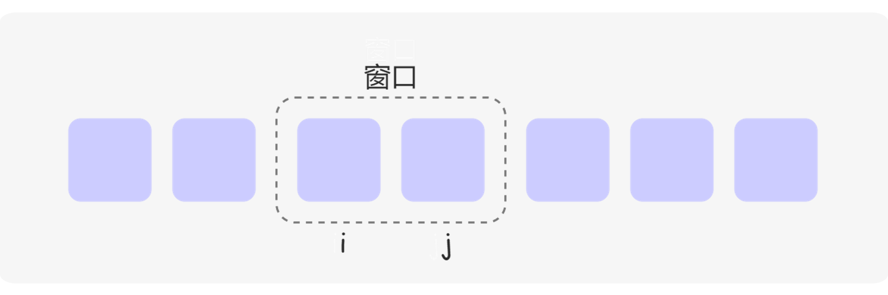
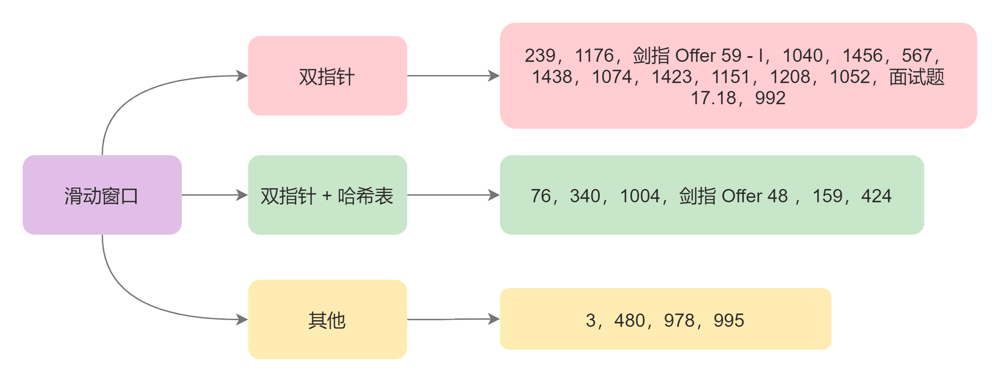

标签划分 - 滑动窗口
===

> Create by **jsliang** on **2020-08-17 15:12:54**  
> Recently revised in **2020-08-17 17:22:58**

## 一 理论知识

顾名思义，滑动窗口就是将数组或字符串中的一个分段，形象地看作一个“窗口”，通过更改“窗口”的左右边界，实现窗口的移动、缩放等操作



滑动窗口题目归类：



```
作者：力扣 (LeetCode)
链接：https://leetcode-cn.com/leetbook/read/hash-table-plus/x7pks3/
来源：力扣（LeetCode）
著作权归作者所有。商业转载请联系作者获得授权，非商业转载请注明出处。
```

## 入门

## 熟练

## 精通

## 哈希表

* 【简单】【入门】[219-存在重复元素 II](https://leetcode-cn.com/problems/contains-duplicate-ii/)
* 【中等】【熟练】[424-替换后的最长重复字符](https://leetcode-cn.com/problems/longest-repeating-character-replacement/)
* 【中等】【熟练】[1004-最大连续1的个数 III](https://leetcode-cn.com/problems/max-consecutive-ones-iii/)
* 【中等】【熟练】[159-至多包含两个不同字符的最长子串](https://leetcode-cn.com/problems/longest-substring-with-at-most-two-distinct-characters/)