GitBook 搭建
===

> Create by **jsliang** on **2019-05-20 14:43:41**  
> Recently revised in **2019-5-29 08:47:31**

本文将介绍如何安装 GitBook、如何起 GitBook 服务、如何配置 GitBook，以及到最后的部署到 GitHub Pages 或者部署到个人云服务器。

**小伙伴们如果觉得不错可以到 [jsliang 的文档库](https://github.com/LiangJunrong/document-library) 为 jsliang 点个 star，谢谢~**

下面是最终效果，欢迎评论留言~

* [LiangJunrong.github.io](https://liangjunrong.github.io/)

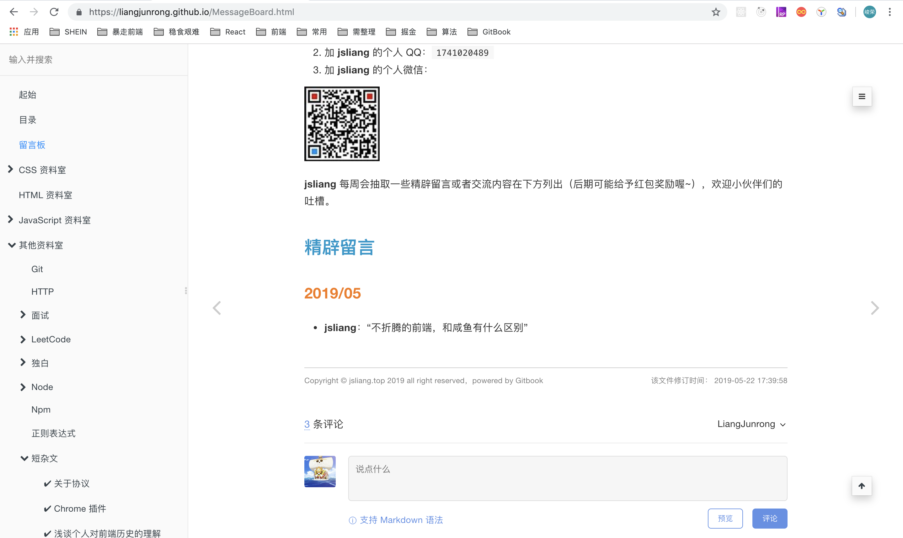

## <a name="chapter-one" id="chapter-one">一 目录</a>

**不折腾的前端，和咸鱼有什么区别**

| 目录 |
| --- | 
| [一 目录](#chapter-one) | 
| <a name="catalog-chapter-two" id="catalog-chapter-two"></a>[二 前言](#chapter-two) |
| <a name="catalog-chapter-three" id="catalog-chapter-three"></a>[三 GitBook 常用指令](#chapter-three) |
| <a name="catalog-chapter-four" id="catalog-chapter-four"></a>[四 GitBook 插件配置](#chapter-four) |
| <a name="catalog-chapter-five" id="catalog-chapter-five"></a>[五 GitBook 打包部署](#chapter-five) |
| <a name="catalog-chapter-six" id="catalog-chapter-six"></a>[六 总结](#chapter-six) |

## <a name="chapter-two" id="chapter-two">二 前言</a>

> [返回目录](#chapter-one)

由于平时喜欢使用 MarkDown 编写文档，无意中在工作上暴露了自己会使用 MarkDown 的 “优点”，所以上周日（2019-05-19）被抓苦力，叫去将公司 WIKI 转成 GitBook。

后面回到租房自己又玩了下，表示深深被吸引了，这也太好用了吧！

所以在这里安利给小伙伴们，大家一起 happy 下。

## <a name="chapter-three" id="chapter-three">三 GitBook 常用指令</a>

> [返回目录](#chapter-one)

* **安装 GitBook**：`npm i gitbook-cli -g`
* **初始化 GitBook 项目**：`gitbook init`
* **安装 GitBook 依赖**：`gitbook install`
* **开启 GitBook 服务**：`gitbook serve`
* **打包 GitBook 项目**：`gitbook build`
* **GitBook 命令行查看**：`gitbook -help`  
* **GitBook 版本查看**：`gitbook -V`

---

**首先**，我们为电脑配置 GitBook，在 **终端** 中直接敲：`npm i gitbook-cli -g`，电脑会配置好 GitBook。

> 由于 Mac 可能会有权限限制，所以需要执行 `sudo npm i gitbook-cli -g`

**然后**，我们找个空文件夹，初始化一个 GitBook 项目：`gitbook init`，目录会生成一个 `README.md` 内容文件和一个 `SUMMARY.md` 目录文件。

```
- GitBook
 - README.md
 - SUMMARY.md
```

> README.md  
> \# 号表示一级标题，详情可自行查看 [MarkDown 语法](../Markdown/README.md)

```markdown
# Introduction


```

> SUMMARY.md  
> \[链接](链接地址) 表示跳转链接，即 GitBook 会根据你的 SUMMARY 自动帮你生成左侧菜单栏的目录

```markdown
# Summary

* [Introduction](README.md)


```

**最后**，我们在 **终端** 输入 `gitbook serve` 即可开启一个 `localhost:4000` 的服务，请在浏览器中输入 `http://localhost:4000` 即可访问服务。

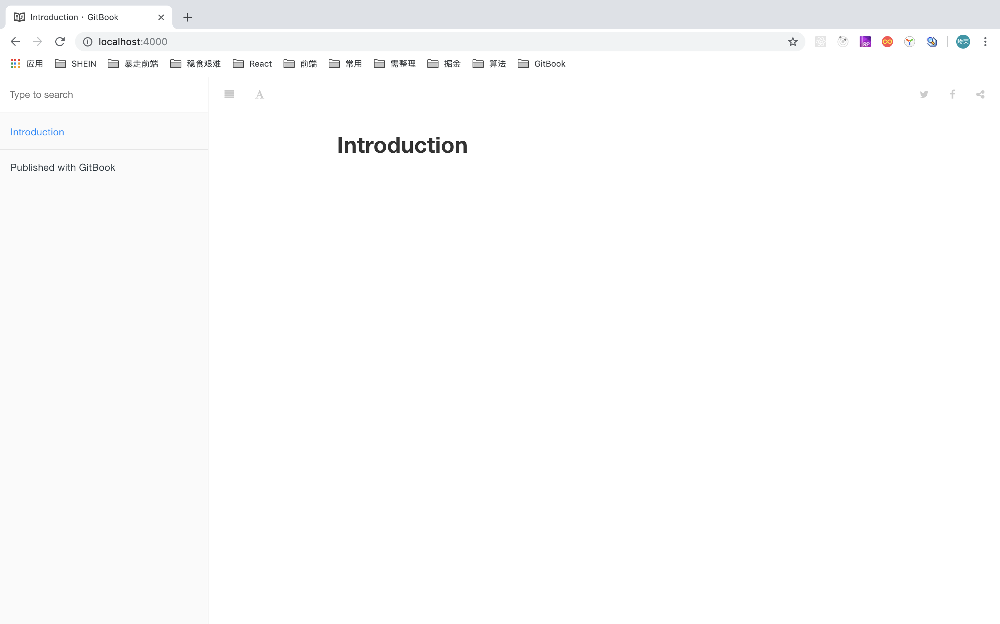

## <a name="chapter-four" id="chapter-four">四 GitBook 插件配置</a>

> [返回目录](#chapter-one)

仅仅只有个搜索功能的 GitBook 怎么可能吸引 **jsliang**！，插件的配置才是 GitBook 的核心！！！

下面我们开始配置 GitBook 插件。

**首先**，给目录中添加一个 `book.json` 文件：

```
- GitBook
 - README.md
 - SUMMARY.md
 - book.json
```

**然后**，我们配置下 `book.json`：

> book.json

```json
{
  "title": "jsliang 的文档库",
  "author": "梁峻荣 - jsliang",
  "description": "jsliang 的文档库. 里面包含了个人撰写的所有前端文章，例如 Vue、React,、ECharts、微信小程序等……",
  "language": "zh-hans",
  "styles": {
    "website": "./public-repertory/css/gitbook-configure.css"
  },
  "plugins": [
    "theme-comscore",
    "prism",
    "-highlight",
    "copy-code-button",
    "search-pro",
    "-search",
    "-lunr",
    "expandable-chapters",
    "splitter",
    "-sharing",
    "github-buttons",
    "donate",
    "tbfed-pagefooter",
    "baidu-tongji",
    "anchor-navigation-ex"
  ],
  "pluginsConfig": {
    "github-buttons": {
      "buttons": [
        {
          "user": "LiangJunrong",
          "repo": "document-library", 
          "type": "star",
          "count": true,
          "size": "small"
        }, 
        {
          "user": "LiangJunrong",
          "width": "160", 
          "type": "follow", 
          "count": true,
          "size": "small"
        }
      ]
    },
    "donate": {
      "button": "打赏",
      "alipayText": "支付宝打赏",
      "wechatText": "微信打赏",
      "alipay": "https://github.com/LiangJunrong/document-library/blob/master/public-repertory/img/seek-reward.jpg?raw=true",
      "wechat": "https://github.com/LiangJunrong/document-library/blob/master/public-repertory/img/seek-reward.png?raw=true"
    },
    "prism": {
      "css": [
        "prismjs/themes/prism-solarizedlight.css"
      ],
      "lang": {
        "shell": "bash"
      }
    },
    "tbfed-pagefooter": {
      "copyright":"Copyright &copy jsliang.top 2019",
      "modify_label": "该文件修订时间：",
      "modify_format": "YYYY-MM-DD HH:mm:ss"
    },
    "baidu-tongji": {
      "token": "55e7dfe47f4dc1c018d4042fdfa62565"
    },
    "anchor-navigation-ex": {
      "showLevel": false
    }
  }
}
```

**最后**，我们安装下 `book.json` 中配置的插件：`gitbook install`，并把 [jsliang 的文档库](https://github.com/LiangJunrong/document-library) 的内容复制过来，修改下 `SUMMARY.md`，重新启动项目：`gitbook serve`。

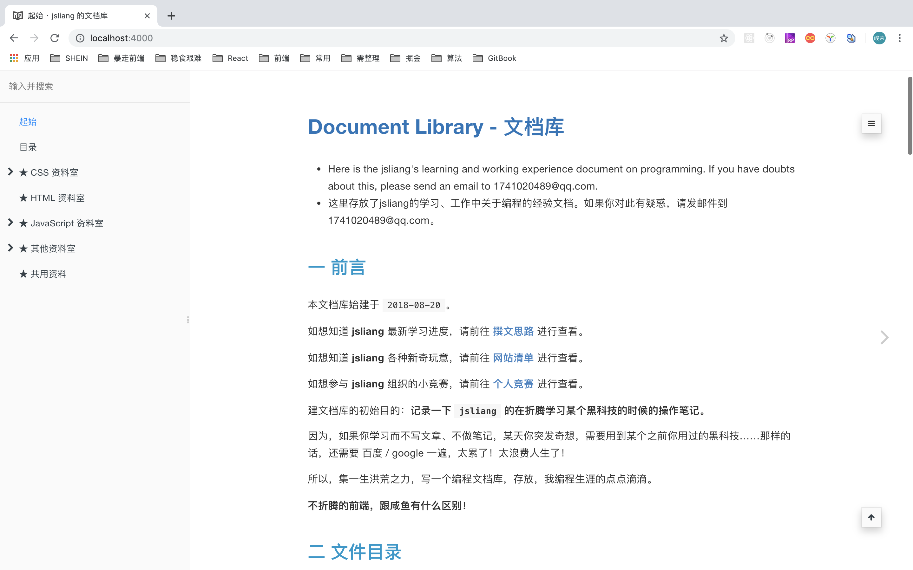

> 当然，这需要你配置下 SUMMARY.md 文件，不过这应该对你来说不成问题。

### <a name="chapter-four-one" id="chapter-four-one">4.1 book.json</a>

> [返回目录](#chapter-one)

现在，我们讲解下 `book.json` 的意思：

* `title`：网站标题
* `author`：网站作者
* `description`：网站功能描述
* `language`：网站使用语言
* `styles`：网站额外配置的样式表
* `plugins`：网站使用的插件
* `pluginsConfig`：网站使用的插件的额外配置

下面主要讲解下 `styles` 和 `plugins`。

### <a name="chapter-four-two" id="chapter-four-two">4.2 gitbook - styles</a>

> [返回目录](#chapter-one)

有的时候，GitBook 会自带一些你不需要的样式，例如侧边栏的 **由 GitBook 提供支持** 等，我们可以通过设置 CSS 来让它隐藏掉：

```css
.gitbook-link {
  display: none !important;
}
.summary .divider {
  display: none !important;
}
```

### <a name="chapter-four-three" id="chapter-four-three">4.3 gitbook - plugins</a>

> [返回目录](#chapter-one)

`plugins` 即插件的意思，有的 `plugins` 的配置，因为需要用户自行决定需要使用哪些功能，所以需要再额外配置下 `pluginsConfig`。

下面我们先列 `plugins` 清单，再逐个讲解功能实现：

#### 插件 1 - theme-comscore

`theme-comscore`：为 GitBook 添加好看的样式，它会使 Table 表单等变得更加好看。

> 配置方法

```json
"plugins": [
  "theme-comscore"
]
```

> 参考效果：

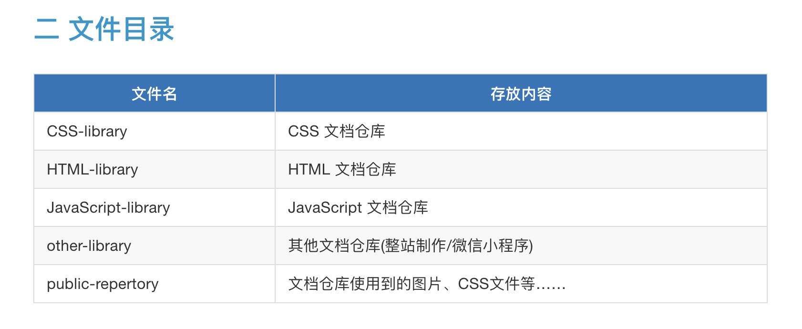

#### 插件 2 - prism

`prism`：为 GitBook 的 Code 添加更好看的样式，使用它的时候记得屏蔽 GitBook 默认的 `highlight` 插件，即通过 （`-highlight` 表示，下面出现 `-` 的插件也一样）

> 配置方法

```json
"plugins": [
  "prism",
  "-highlight"
],
"pluginsConfig": {
  "prism": {
    "css": [
      "prismjs/themes/prism-solarizedlight.css"
    ],
    "lang": {
      "shell": "bash"
    }
  }
}
```

> 参考效果：

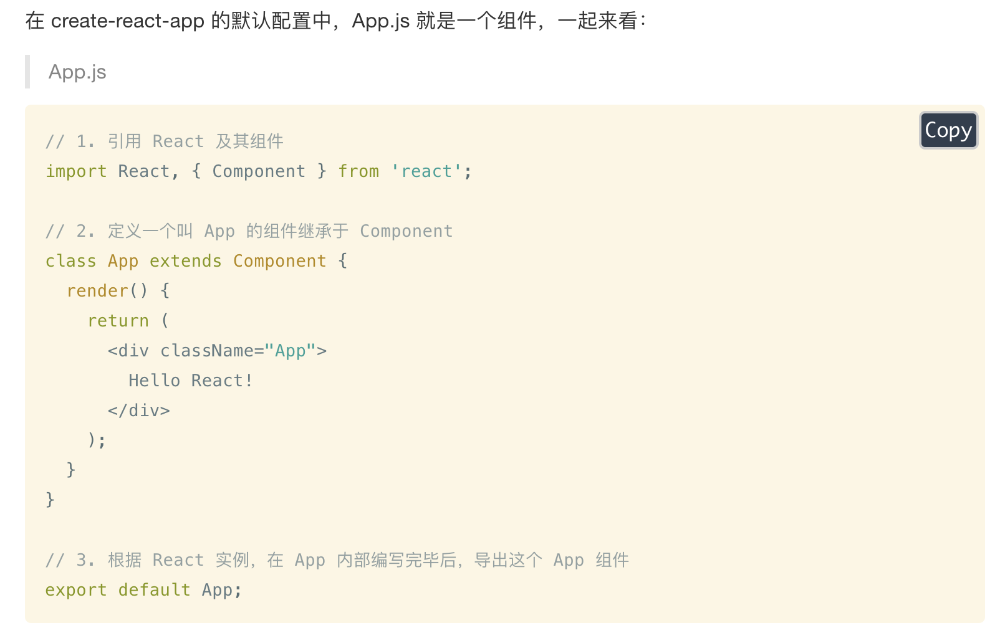

#### 插件 3 - copy-code-button

`copy-code-button`：给 GitBook 的 Code 添加复制功能，可以一键复制代码块的所有代码。

> 配置方法

```json
"plugins": [
  "copy-code-button"
]
```

> 参考效果：

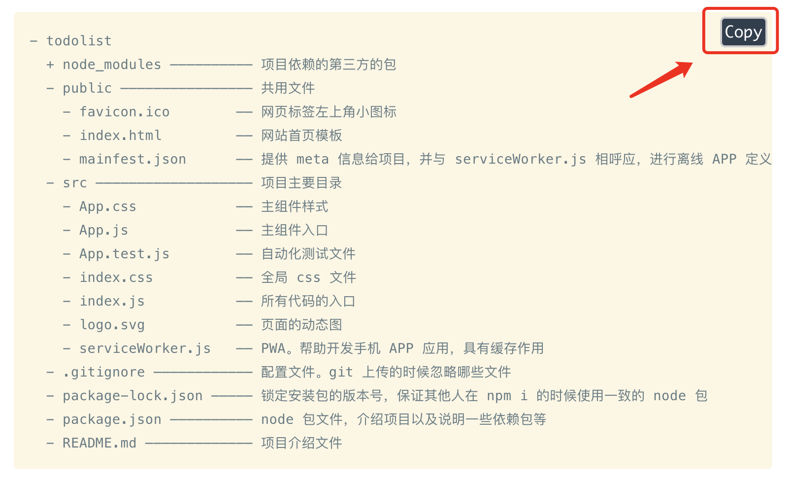

#### 插件 4 - search-pro

`search-pro`：由于 GitBook 支持的搜索，对于中文不太好。添加该插件后，对搜索结果能用高亮来显示，非常强大。当然，由于取缔了默认的搜索功能，所以需要屏蔽 `search` 和 `lunr`

> 配置方法

```json
"plugins": [
  "search-pro",
  "-search",
  "-lunr"
]
```

> 参考效果：

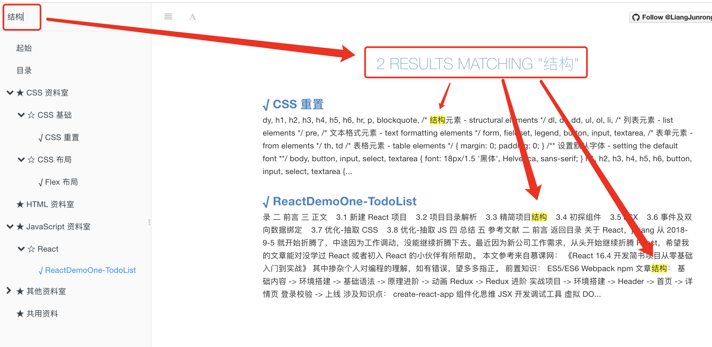

#### 插件 5 - expandable-chapters

`expandable-chapters`：由于侧边栏标题是默认全部展开的，所以这个插件会让它具有展开收缩功能。

> 配置方法

```json
"plugins": [
  "expandable-chapters"
]
```

> 参考效果：

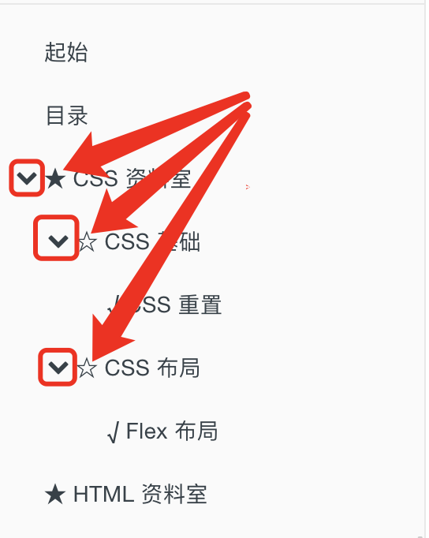

#### 插件 6 - splitter

`splitter`：让侧边栏的宽度可以自行拖动。

> 配置方法

```json
"plugins": [
  "splitter"
]
```

> 参考效果：

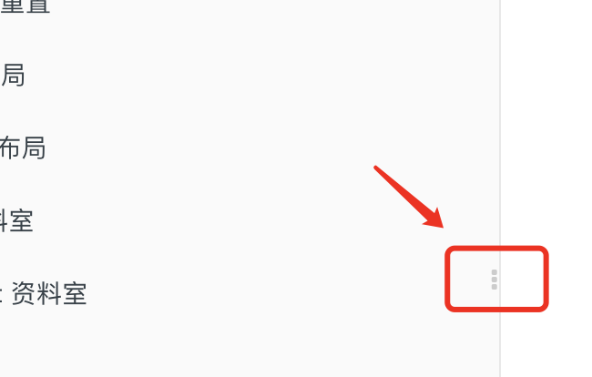

#### 插件 7 - -sharing

`-sharing`：去掉 GitBook 默认的分享功能。由于它默认的一些推特，脸书都需要翻墙，而我们做的是中文站点，所以将分享功能全部关闭掉。

> 配置方法

```json
"plugins": [
  "-sharing"
]
```

> 参考效果：


#### 插件 8 - github-buttons

`github-buttons`：给 GitBook 添加 GitHub 的图标，来显示 `follow` 和 `stars`。

> 配置方法

```json
"plugins": [
  "github-buttons"
],
"pluginsConfig": {
  "github-buttons": {
  "buttons": [
    {
      "user": "LiangJunrong",
      "repo": "document-library", 
      "type": "star",
      "count": true,
      "size": "small"
    }, 
    {
      "user": "LiangJunrong",
      "width": "160", 
      "type": "follow", 
      "count": true,
      "size": "small"
    }
  ]
  }
}
```

> 参考效果：


#### 插件 9 - donate

`donate`：给底部配置一个打赏模块，用户可以点击进行支付宝、微信打赏等。

> 配置方法

```json
"plugins": [
  "donate"
],
"pluginsConfig": {
  "donate": {
    "button": "打赏",
    "alipayText": "支付宝打赏",
    "wechatText": "微信打赏",
    "alipay": "https://github.com/LiangJunrong/document-library/blob/master/public-repertory/img/seek-reward.jpg?raw=true",
    "wechat": "https://github.com/LiangJunrong/document-library/blob/master/public-repertory/img/seek-reward.png?raw=true"
  }
}
```

> 参考效果：


#### 插件 10 - tbfed-pagefooter

`tbfed-pagefooter`：给 GitBook 每个页面添加页脚，这样就可以知道这些文件的 `copyright` 以及修改时间等。

> 配置方法

```json
"plugins": [
  "tbfed-pagefooter"
],
"pluginsConfig": {
  "tbfed-pagefooter": {
    "copyright":"Copyright &copy jsliang.top 2019",
    "modify_label": "该文件修订时间：",
    "modify_format": "YYYY-MM-DD HH:mm:ss"
  }
}
```

> 参考效果：


#### 插件 11 - baidu-tongji

`baidu-tongji`：给 GitBook 的站点添加百度统计，这样用户的访问数量可以通过百度统计查看到。

> 配置方法

```json
"plugins": [
  "baidu-tongji"
],
"pluginsConfig": {
  "baidu-tongji": {
    "token": "55e7dfe47f4dc1c12345678fdfa62565"
  }
}
```

#### 插件 12 - anchor-navigation-ex

`anchor-navigation-ex`：根据 # ## ### 自动生成菜单，并添加跳转到顶部效果。

> 配置方法

```json
"plugins": [
  "anchor-navigation-ex"
],
"pluginsConfig": {
  "anchor-navigation-ex": {
    "showLevel": false
  }
}
```

> 参考效果：

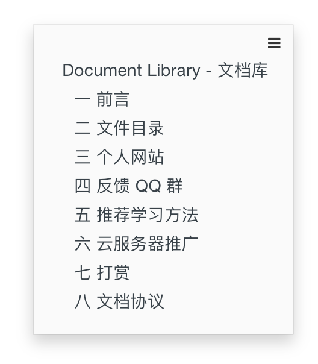

#### 插件 13 - gitalk

`gitalk`：给页面添加评论功能，这些评论内容会添加到 GitHub 仓库的 Issue 上。

**首先**，这不是一个插件，[Gitalk](https://github.com/gitalk/gitalk/blob/master/readme-cn.md) 是一个基于 GitHub Issue 和 Preact 开发的评论插件。

**然后**，我们在 `MessageBoard.md`（即我们需要添加评论区的页面）中添加对应的代码：

```html
<link rel="stylesheet" href="https://cdn.jsdelivr.net/npm/gitalk@1/dist/gitalk.css">
<script src="https://cdn.jsdelivr.net/npm/gitalk@1/dist/gitalk.min.js"></script>
<div id="gitalk-container"></div>
<script>
  var gitalk = new Gitalk({
    "clientID": "需要补充的 clientID",
    "clientSecret": "需要补充的 clientSecret",
    "repo": "document-library",
    "owner": "LiangJunrong",
    "admin": ["LiangJunrong"],
    "id": location.pathname,      
    "distractionFreeMode": false  
  });
  gitalk.render("gitalk-container");
</script>
```

**接着**，我们大致讲讲上面那些字段：

1. `clientID`：GitHub 开发者设置，客户端连接标识。下面有详细讲解。
2. `clientSecret`：GitHub 开发者设置，客户端秘钥。下面有详细讲解。
3. `repo`：GitHub 仓库名，我们的就是 `document-library` 啦。
4. `owner`：GitHub 仓库所有者，就是我 GitHub 账户：`LiangJunrong`。
5. `admin`：GitHub 仓库管理者，还是我的 GitHub 账户：`LiangJunrong`。（支持数组，多个管理者）
6. `id`：页面的唯一标识，默认值: `location.href`
7. `distractionFreeMode`：类似 Facebook 评论框的全屏遮罩效果,默认值: `false`

> 更多配置请看：[Gitalk](https://github.com/gitalk/gitalk/blob/master/readme-cn.md)

**再来**，我们打开页面：[GitHub 开放授权应用](https://github.com/settings/applications/new)

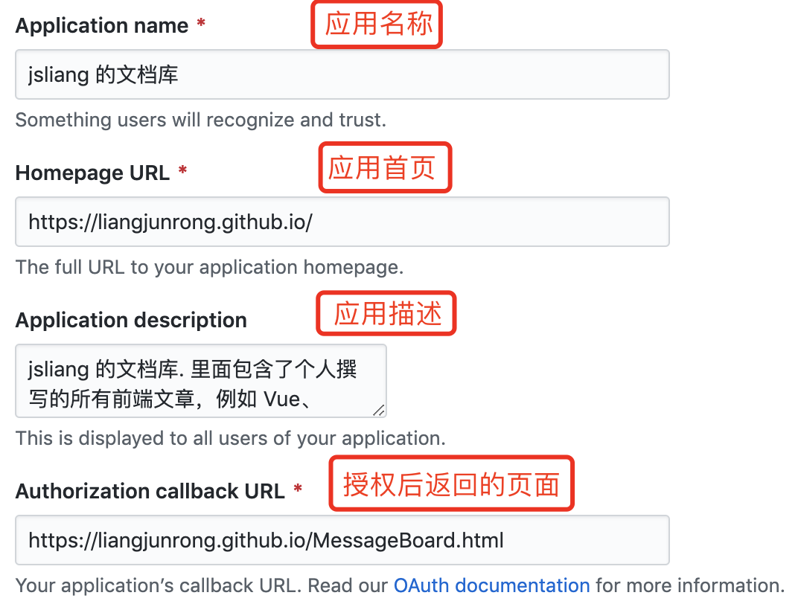

创建后页面会显示：


**最后**，我们可以在 `http://localhost:4000/MessageBoard.html` 中查看到结果显示（最终需要放到 LiangJunrong.github.io 中）：

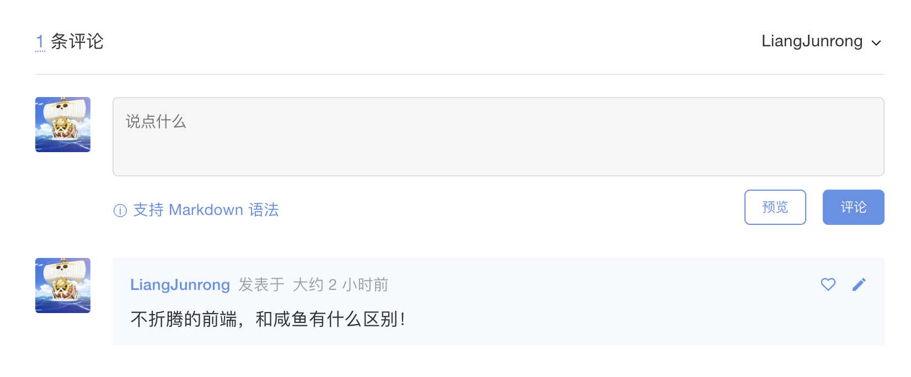

这样，我们就完成了单个页面添加 Gitalk，如果需要添加多个页面，那么可以参考下 **雪之梦技术驿站** 的攻略（这里就不哆嗦了，**jsliang** 亲测有效）：

* [gitbook 入门教程之实用插件(新增3个插件) - segmentfault - 雪之梦技术驿站](https://segmentfault.com/a/1190000018777424#articleHeader8)

#### 插件 14 - 参考文献

1. [GitBook 插件 - GitHub - zhangjikai](https://github.com/zhangjikai/gitbook-use/blob/master/plugins.md)
2. [插件功能定制，参数详解 - GitHub - zq99299](https://github.com/zq99299/gitbook-plugin-anchor-navigation-ex/blob/master/doc/config.md)
3. [Gitbook 的使用和常用插件 - 赵达](https://zhaoda.net/2015/11/09/gitbook-plugins/)
4. [【Gitbook】实用配置及插件介绍 - zhangjk](https://www.cnblogs.com/zhangjk1993/p/5066771.html)
5. [如何优雅地使用 Gitbook - 泫](http://blog.cugxuan.cn/2018/12/03/Markdown/How-to-use-gitbook-elegantly/)
6. [gitbook 入门教程之实用插件(新增3个插件) - segmentfault - 雪之梦技术驿站](https://segmentfault.com/a/1190000018777424)
7. [Gitbook模板 - GitHub - crifan](https://github.com/crifan/gitbook_template)

## <a name="chapter-five" id="chapter-five">五 GitBook 打包部署</a>

> [返回目录](#chapter-one)

现在，是时候打包并且发布项目，让其他小伙伴看到你的成果了。

**首先**，打包项目：`gitbook build`。

**然后**，部署到 GitHub Pages 或者个人云服务器。

* [GitHub Pages 教程](../GitHub-Pages/GitHub-Pages-study.md)
* [Nginx 配置](../../Node/build-web-station.md)

**最后**，我们查看下我们的部署页面：

> 部署在 GitHub Pages 中的页面：https://liangjunrong.github.io/

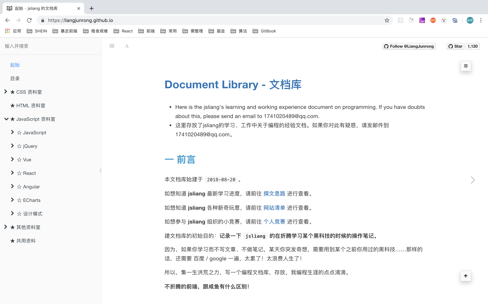

## <a name="chapter-six" id="chapter-six">六 总结</a>

> [返回目录](#chapter-one)

OK，我们的 GitBook 教学到此结束啦。

如果小伙伴们在使用 GitBook 开发的时候碰到问题，可以联系我：

1. 加 **jsliang** 的 QQ 资料群：`798961601`。
2. 加 **jsliang** 的个人 QQ：`1741020489`
3. 加 **jsliang** 的个人微信：


**最后的最后**，小伙伴们觉得不错的话，记得给 **jsliang** 点个 **赞** 或者 **star** 哦~

* [GitHub - jsliang 的文档库](https://github.com/LiangJunrong/document-library)
* [掘金 - jsliang 的个人页面](https://juejin.im/user/584613ba128fe10058b3cf68)

**PS**：如果需要购买云服务器来存放自己通过 GitBook 打包的页面，可以点击下面链接或者咨询 **jsliang** 噢~

---

> **jsliang** 广告推送：  
> 也许小伙伴想了解下云服务器  
> 或者小伙伴想买一台云服务器  
> 或者小伙伴需要续费云服务器  
> 欢迎点击 **[云服务器推广](https://github.com/LiangJunrong/document-library/blob/master/other-library/Monologue/%E7%A8%B3%E9%A3%9F%E8%89%B0%E9%9A%BE.md)** 查看！

[](https://promotion.aliyun.com/ntms/act/qwbk.html?userCode=w7hismrh)
[](https://cloud.tencent.com/redirect.php?redirect=1014&cps_key=49f647c99fce1a9f0b4e1eeb1be484c9&from=console)

> <a rel="license" href="http://creativecommons.org/licenses/by-nc-sa/4.0/"></a><br /><span xmlns:dct="http://purl.org/dc/terms/" property="dct:title">jsliang 的文档库</span> 由 <a xmlns:cc="http://creativecommons.org/ns#" href="https://github.com/LiangJunrong/document-library" property="cc:attributionName" rel="cc:attributionURL">梁峻荣</a> 采用 <a rel="license" href="http://creativecommons.org/licenses/by-nc-sa/4.0/">知识共享 署名-非商业性使用-相同方式共享 4.0 国际 许可协议</a>进行许可。<br />基于<a xmlns:dct="http://purl.org/dc/terms/" href="https://github.com/LiangJunrong/document-library" rel="dct:source">https://github.com/LiangJunrong/document-library</a>上的作品创作。<br />本许可协议授权之外的使用权限可以从 <a xmlns:cc="http://creativecommons.org/ns#" href="https://creativecommons.org/licenses/by-nc-sa/2.5/cn/" rel="cc:morePermissions">https://creativecommons.org/licenses/by-nc-sa/2.5/cn/</a> 处获得。