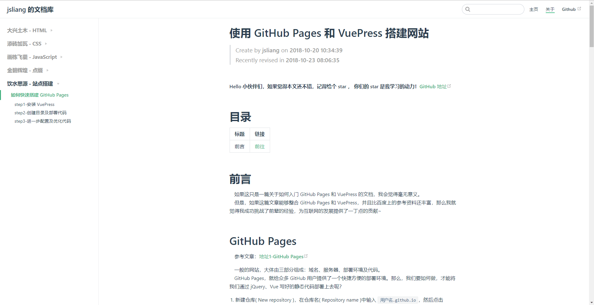
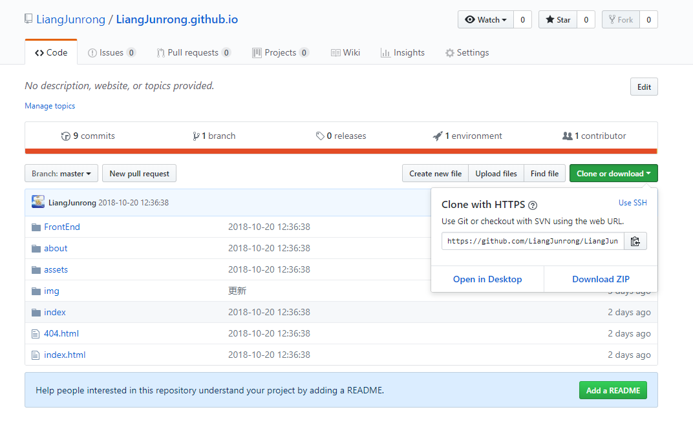
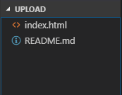
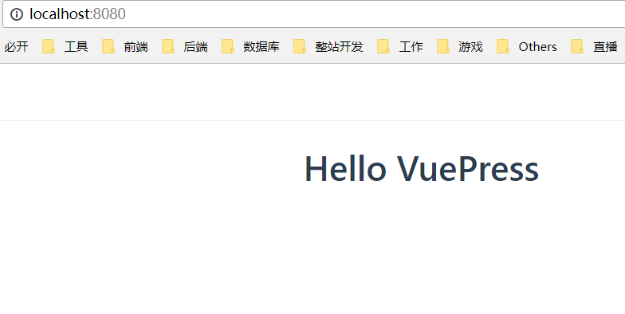
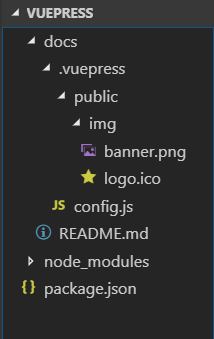
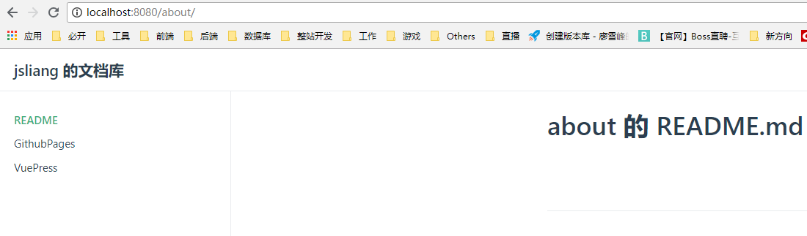

使用 GitHub Pages 和 VuePress 搭建网站
===

> Create by **jsliang** on **2018-10-20 10:34:39**  
> Recently revised in **2018-10-24 13:54:52**

<br>

&emsp;**Hello 小伙伴们，如果觉得本文还不错，记得给个 **star** ， 你们的 **star** 是我学习的动力！[GitHub 地址](https://github.com/LiangJunrong/document-library/blob/master/other-library/Website/GithubPages/DocumentLibrary.md)**

<br>

&emsp;本文教你如何利用 GitHub 平台搭建自己的博客/文档库。  
&emsp;如果，你的目的仅仅是想了解如何配置。那么，你应该在看完 `第三章 基础配置` 后，就可以自己去写自己的博客/文档库，遇到不懂的问题，可以自己翻阅 VuePress 文档，解决你所需要解决的问题。  
&emsp;如果，你的目的是具体查找某组件：例如导航条、例如侧边栏的配置。那么，你可以直接查找目录，跳到对应章节进行阅读。  

&emsp;**参考文档：**

* 参考地址：[GitHub Pages](https://pages.github.com/)  

* 参考地址：[VuePress 中文网](http://caibaojian.com/vuepress/)

&emsp;**目前效果：**




<br>

# <a name="chapter-one" id="chapter-one">一 目录</a>

| 目录名 |
| --- |
| <a name="catalog-chapter-one" id="catalog-chapter-one"></a>[一 目录](#chapter-one) |
| <a name="catalog-chapter-two" id="catalog-chapter-two"></a>[二 前言](#chapter-two) |
| <a name="catalog-chapter-three" id="catalog-chapter-three"></a>[三 基础配置](#chapter-three) |
| &emsp;[3.1 搭建 GitHub Pages](#chapter-three-one) |
| &emsp;[3.2 搭建 VuePress](#chapter-three-two) |
| &emsp;&emsp;[3.2.1 目录讲解](#chapter-three-two-one) |
| &emsp;&emsp;[3.2.2 导航栏](#chapter-three-two-two) |
| &emsp;&emsp;[3.2.3 侧边栏](#chapter-three-two-three) |
| &emsp;&emsp;[3.2.4 默认首页](#chapter-three-two-four) |
| <a name="catalog-chapter-four" id="catalog-chapter-four"></a>[四 VuePress 进阶](#chapter-four) |
| &emsp;[4.1 修改样式](#chapter-four-one) |

<br>

# <a name="chapter-two" id="chapter-two">二 前言</a>

> [返回目录](#chapter-one)

<br>

&emsp;一般的网站，大体由三部分组成：域名、服务器部署环境以及部署代码。  

* GitHub Pages，由 GitHub 网站服务，为众多 GitHub 用户提供了良好的服务器部署环境以及域名的好工具。[【Github Pages 官网】](https://pages.github.com/)  
* VuePress，是以 Vue 为驱动的主题系统的简约静态网站生成工具 balabala……它是咱尤雨溪大神折腾出来的一个工具，初始目的是为了方便他使用 Markdown 语法来写文档，然后生成 HTML 代码，部署到服务器上即可。在众多网友的修改下，它可以拿来写静态网站，也就是可以拿来发布我们编写的博文。[【VuePress 官网】](http://caibaojian.com/vuepress/)  

&emsp;说到这里，小伙伴们大概懂了我们要讲什么了~  
&emsp;但是，如果这只是一篇关于如何入门 GitHub Pages 和 VuePress 的文档，我会觉得毫无意义。所以，**jsliang** 希望这篇文章能够整合网上的 GitHub Pages 和 VuePress 资料，并且比它们丰富一丢丢，加入 **jsliang** 使用心得，让小伙伴们看完无需翻阅大量文章也能快速做好自己的个人文档库/博客。那样，我就心满意足了。因为……  

&emsp;**不折腾的前端，跟咸鱼有什么区别！**  


&emsp;本文涉及的技术点：

* GitHub
* Git
* Markdown

&emsp;如果你不是很熟悉上面的技术，**jsliang** 推荐你去百度下资料，先学习下这些技术，再回来继续学习。其中 GitHub 和 Git 的文章 **jsliang** 尚未整理，小伙伴只能去百度获取资料了，这里我提供一篇自己写的 Markdown文章：[地址](https://github.com/LiangJunrong/document-library/blob/master/other-library/shortArticle/markdown/markdown.md)。  
&emsp;如果你熟悉且了解上面的技术，那么，让我们愉快地继续往下去折腾吧！

<br>

# <a name="chapter-three" id="chapter-three">三 基础配置</a>

<br>

## <a name="chapter-three-one" id="chapter-three-one">3.1 搭建 GitHub Pages</a>

> [返回目录](#chapter-one)

<br>

1. 新建仓库( New repository )，在仓库名( Repository name )中输入 `用户名.github.io`，例如我的就是：`LiangJunrong.github.io`，然后点击 Create repository 即可创建一个部署好的环境。


<br>

2. Clone 项目至电脑，并新增 `README.md` 和 `index.html`：



<br>


<br>



<br>

> README.md

```
Hello Github Pages
===

&emsp;这是我的 GitHub Pages 初始目录
```

<br>

> index.html

```
<!DOCTYPE html>
<html lang="en">
<head>
    <meta charset="UTF-8">
    <meta name="viewport" content="width=device-width,initial-scale=1.0,maximum-scale=1.0,user-scalable=no">
    <meta http-equiv="X-UA-Compatible" content="ie=edge">
    <title>Hello Github Pages</title>
    <style>
        .container {
            margin-top: 300px;
            text-align: center;
        }
    </style>
</head>
<body>
    <h1 class="container">Hello Github Pages</h1>
</body>
</html>
```

<br>

3. 上传到 GitHub：

```
git add .
git commit -m "Github Pages"
git push
```

<br>

4. 打开 `用户名.github.io`：


<br>

&emsp;如上，完成 GitHub Pages 的搭建，现在我们已经拥有了一个免费部署静态页面的平台了。那么，下面我们将讲解如何通过 Markdown + VuePress 来编写博客。

<br>

## <a name="chapter-three-two" id="chapter-three-two">3.2 搭建 VuePress</a>

> [返回目录](#chapter-one)

<br>

1. 安装 VuePress

&emsp;在你需要存放的目录中，通过终端命令行安装 VuePress：`npm i vuepress -D`


<br>

2. 创建目录及部署代码


&emsp;编辑 `package.json`：

> package.json

```
{
  "scripts": {
    "dev": "vuepress dev docs",
    "build": "vuepress build docs"
  },
  "devDependencies": {
    "vuepress": "^0.14.4"
  }
}
```

> 注：

* `npm run dev` 即可开始实时编辑模式
* `npm run build` 即可对代码进行压缩打包，打包后的文件夹在 `.vuepress/dist` 上。

<br>

&emsp;然后创建 docs 文件夹，并在 docs 文件夹下创建 README.md 文件

> README.md

```
Hello VuePress
===
```

<br>

&emsp;最后在终端执行命令 `npm run dev`，并打开 `http://localhost:8080`，得到初步配置界面如下：



&emsp;值得注意的是。在这里，我们是通过 `npm run dev` 即时获取我们修改的页面显示。  
&emsp;然后，我们可以通过 `npm run build` 打包我们的代码，你可以在 `.vuepress` 中找到一个 `dist` 文件夹，然后将 `dist` 中的文件夹上传至 `用户名.github.io`，即可完成 VuePress 的部署。

<br>

## <a name="chapter-three-two-one" id="chapter-three-two-one">3.2.1 目录讲解</a>

> [返回目录](#chapter-one)

<br>

&emsp;在前面，我们讲解了如何设置 VuePress 并启动
&emsp;现在，我们来个基配的目录，进行讲解：



<br>

```
- docs                   - VuePress 存放目录
 - .vuepress             - VuePress 配置目录
  - public               - 共用文件存储目录
   - img                 - 共用图片目录
    - banner.png         - 图片-首页 banner
    - logo.ico           - 图片-网站右上角小图标
  - config.js            - VuePress 的 js 配置文件
 - listOne               - 侧边栏项目组1
  - pageOne.md           - 项目组1页面1
  - README.md            - 项目组1默认页面
 - listTwo               - 侧边栏项目组2
  - pageThree.md         - 项目组2页面3
  - pageTwo.md           - 项目组2页面2
  - README.md            - 项目组2默认页面
 - README.md             - 网站默认首页
+ node_modules           - node 依赖包
- package.json           - webpack 配置文件
```

<br>

&emsp;其中，`.vuepress` 存放 VuePress 的配置目录，`public` 中存放共有的文件，`config.js` 为 VuePress 的配置文件，`listOne`、`listTwo` 是侧边栏组，对页面进行个分类。

<br>

## <a name="chapter-three-two-two" id="chapter-three-two-two">3.2.2 导航栏</a>

> [返回目录](#chapter-one)

<br>

&emsp;在这里，我们开始进行顶部导航栏的配置。  
&emsp;首先，我们填写下 `config.js` 中的配置代码：

> config.js

```
module.exports = {
    // 左上角标题
    title: 'jsliang 的文档库',
    // 描述
    description: '前端工程师 jsliang 的文档库',
    // 头部部署，右上角小图标
    head: [
        // ico 配置
        ['link', {
            rel: 'icon',
            href: '/img/logo.ico'
        }]
    ],
    // 主题部署
    themeConfig: {
        /** 
         * 右侧导航条
         * text - 显示字段
         * link - 链接：注意前后带 / 符号
         */
        nav: [
            {
                text: '主页',
                link: '/'
            },
            /**
             * 多级菜单
             * 开头 text 为一级标题
             * 数组内 text 为二级标题
             * link 为链接，注意带 /
             */
            {
                text: '博文',
                items: [
                    {
                        text: '微信小程序 bug 集中营',
                        link: 'https://github.com/LiangJunrong/document-library/blob/master/other-library/WeChatApplet/WeChatAppletBug.md'
                    },
                    {
                        text: '使用 GitHub Pages 和 VuePress 搭建网站',
                        link: 'https://github.com/LiangJunrong/document-library/blob/master/other-library/GithubPages/GithubPages.md'
                    }
                ]
            },
            {
                text: '关于',
                link: '/about/'
            },
            // 链接到网站
            {
                text: 'Github',
                link: 'https://www.github.com/LiangJunrong'
            },
        ]
    }
}
```

&emsp;然后，启动 `npm run dev`，打开 `http://localhost:8080`，你可以看到导航栏部署完毕了。


<br>

## <a name="chapter-three-two-three" id="chapter-three-two-three">3.2.3 侧边栏</a>

> [返回目录](#chapter-one)

<br>

&emsp;VuePress 中的侧边栏配置，一共有三种方式：简单配置，按组配置，分页配置，有兴趣的小伙伴可以去：[地址](http://caibaojian.com/vuepress/default-theme-config/#%E4%BE%A7%E8%BE%B9%E6%A0%8F-sidebar) 直接查看，这里我们单纯讲下我们部署我们的文档库用到的分页配置。

&emsp;目录如下：


&emsp;然后，我们修改下 `config.js`：

> config.js

```
module.exports = {
    title: 'jsliang 的文档库',
    description: '前端工程师 jsliang 的文档库',
    head: [
        // ...省略，配置代码同 3.2.2    
    ],
    themeConfig: {

        nav: [
            // ...省略，配置代码同 3.2.2   
        ],
        /**
         * 侧边栏配置：侧边栏组
         */
        sidebar: {
            // 侧边栏在 /index/ 目录上
            '/index/': [
                ['', 'README'],
                ['indexTwo', '导航第二页']
            ],
            // 侧边栏在 /about/ 目录上
            '/about/': [
                ['', 'README'],
                ['GithubPages', 'GithubPages'],
                ['VuePress', 'VuePress']
            ]
        }
    }
}
```

&emsp;最后，我们运行 `npm run dev`，查看 `http://localhost:8080` 所示如下：


<br>



&emsp;可以看出，我们已经成功配置了分页形式的侧边栏。

<br>

## <a name="chapter-three-two-four" id="chapter-three-two-four">3.2.4 默认首页</a>

> [返回目录](#chapter-one)

<br>

&emsp;VuePress 为我们设置了一套默认的首页，我们直接拿来用，看看它长什么样子吧！

&emsp;首先，我们找一张 banner.png 图，放到 `public/img/banner.png` 上。  
&emsp;然后，我们修改下 `docs/README.md` 文件：

> docs/README.md

```
---
home: true
heroImage: ./img/banner.png
actionText: 皮皮虾 我们走 →
actionLink: /index/
features:
- title: 装逼
  details: 在这里，你可以看到 jsliang 在这里无限装逼，所以你可以尽情打脸。就算你懂，没关系，打了脸再说~
- title: 搞笑
  details: 在这里，你可以获得各种学习欢乐，轻松进击前端编程。点滴进步，成就不一样的你。
- title: 深沉
  details: 在这里，你可以收获一个广州自身漂泊的人的情怀，感受在这个烦躁的社会 jsliang 如何安身立命。
footer: jsliang 的文档库 | Copyright © 2018 不折腾的前端，和咸鱼有什么区别
---
```

&emsp;OK，由于我们重新修改了首页（即 docs/README.md），所以我们重新重启下，`Ctrl+C` -> `y` -> `npm run dev`，重新打开 `http://localhost:8080`：


&emsp;完美！这样，我们就完成了基础的配置了！！！

<br>

# <a name="chapter-four" id="chapter-four">四 VuePress 进阶</a>

<br>

## <a name="chapter-four-one" id="chapter-four-one">4.1 修改样式</a>

> [返回目录](#chapter-one)

<br>

&emsp;正在逐步完善。

&emsp;**如果你觉得该篇文章对你非常有用，请给我在 GitHub 上的文档库一个 **star**，你的 **star** 是我不断折腾的动力~ [【Github 地址】](https://github.com/LiangJunrong/document-library/blob/master/other-library/Website/GithubPages/DocumentLibrary.md)**

<br>

> <a rel="license" href="http://creativecommons.org/licenses/by-nc-sa/4.0/"></a><br /><a xmlns:dct="http://purl.org/dc/terms/" property="dct:title">**jsliang** 的文档库</a> 由 <a xmlns:cc="http://creativecommons.org/ns#" href="https://github.com/LiangJunrong/document-library" property="cc:attributionName" rel="cc:attributionURL">梁峻荣</a> 采用 <a rel="license" href="http://creativecommons.org/licenses/by-nc-sa/4.0/">知识共享 署名-非商业性使用-相同方式共享 4.0 国际 许可协议</a>进行许可。<br />基于<a xmlns:dct="http://purl.org/dc/terms/" href="https://github.com/LiangJunrong/document-library" rel="dct:source">https://github.com/LiangJunrong/document-library</a>上的作品创作。<br />本许可协议授权之外的使用权限可以从 <a xmlns:cc="http://creativecommons.org/ns#" href="https://creativecommons.org/licenses/by-nc-sa/2.5/cn/" rel="cc:morePermissions">https://creativecommons.org/licenses/by-nc-sa/2.5/cn/</a> 处获得。