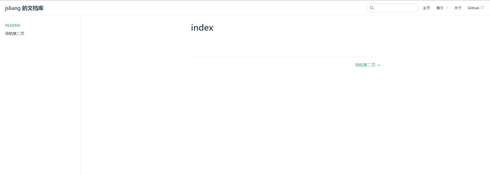
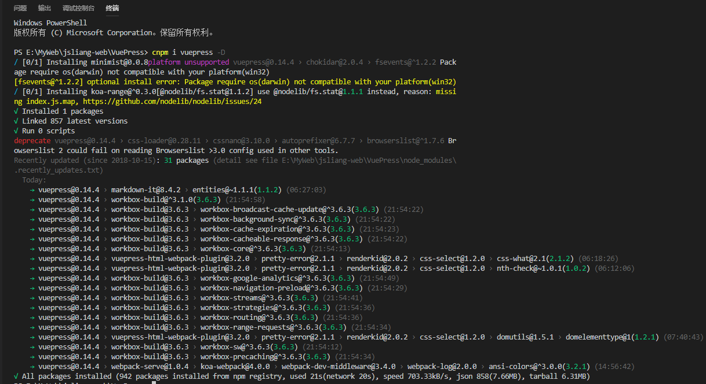
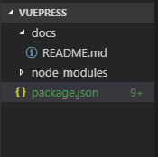
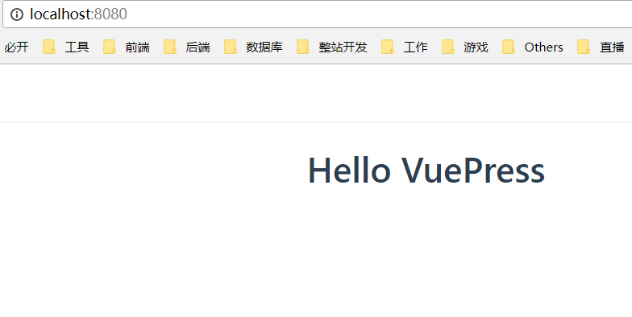
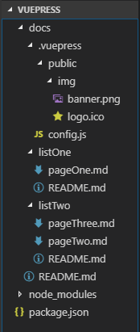
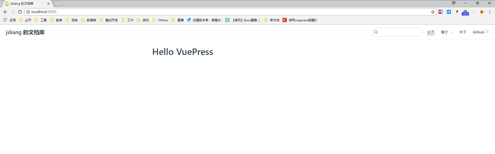
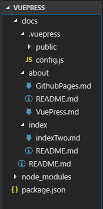
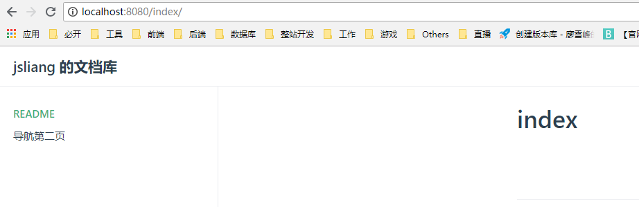

VuePress 学习
===

> Create by **jsliang** on **2018-10-20 10:34:39**  
> Recently revised in **2019-05-30 20:42:39**

**小伙伴们如果觉得不错可以到 [jsliang 的文档库](https://github.com/LiangJunrong/document-library) 为 jsliang 点个 star，谢谢~**

* **参考文档**：[VuePress 中文网](http://caibaojian.com/vuepress/)

* **效果**：




## <a name="chapter-one" id="chapter-one">一 目录</a>

**不折腾的前端，和咸鱼有什么区别！**

| 目录名 |
| --- |
| <a name="catalog-chapter-one" id="catalog-chapter-one"></a>[一 目录](#chapter-one) |
| <a name="catalog-chapter-two" id="catalog-chapter-two"></a>[二 前言](#chapter-two) |
| <a name="catalog-chapter-three" id="catalog-chapter-three"></a>[三 搭建 VuePress](#chapter-three) |
| <a name="catalog-chapter-four" id="catalog-chapter-four"></a>[四 目录讲解](#chapter-four) |
| <a name="catalog-chapter-five" id="catalog-chapter-five"></a>[五 导航栏](#chapter-five) |
| <a name="catalog-chapter-six" id="catalog-chapter-six"></a>[六 侧边栏](#chapter-six) |
| <a name="catalog-chapter-seven" id="catalog-chapter-seven"></a>[七 默认首页](#chapter-seven) |
| <a name="catalog-chapter-eight" id="catalog-chapter-eight"></a>[八 总结](#chapter-eight) |

## <a name="chapter-two" id="chapter-two">二 前言</a>

> [返回目录](#chapter-one)

VuePress，是以 Vue 为驱动的主题系统的简约静态网站生成工具 balabala……

它是咱 **尤雨溪** 大神折腾出来的一个工具，初始目的是为了方便他使用 Markdown 语法来写文档，然后生成 HTML 代码，部署到服务器上即可。

在众多网友的修改下，它可以拿来写静态网站，也就是可以拿来发布我们编写的博文。[【VuePress 官网】](http://caibaojian.com/vuepress/)  

本章节需要有 Markdown 基础，如果你还不知道 Markdown，请前往 **jsliang** 的 Markdown 文章进行学习。

* [Markdown 学习](../Markdown/Markdown-study.md)

## <a name="chapter-three" id="chapter-three">三 搭建 VuePress</a>

> [返回目录](#chapter-one)

* **步骤 1**. 安装 VuePress

在你需要存放的目录中，通过终端命令行安装 VuePress：`npm i vuepress -D`



* **步骤 2**. 创建目录及部署代码



**首先**，编辑 `package.json`：

> package.json

```json
{
  "scripts": {
    "dev": "vuepress dev docs",
    "build": "vuepress build docs"
  },
  "devDependencies": {
    "vuepress": "^0.14.4"
  }
}
```

> 注：

* `npm run dev` 即可开始实时编辑模式
* `npm run build` 即可对代码进行压缩打包，打包后的文件夹在 `.vuepress/dist` 上。

**然后**，创建 docs 文件夹，并在 docs 文件夹下创建 README.md 文件

> README.md

```
Hello VuePress
===
```

**接着**，在终端执行命令 `npm run dev`，并打开 `http://localhost:8080`，得到初步配置界面如下：



值得注意的是。在这里，我们是通过 `npm run dev` 即时获取我们修改的页面显示（Webpack 配置），所以我们只需要改动完毕保存页面，浏览器会自动刷新。。  

**最后**，我们可以通过 `npm run build` 打包我们的代码，你可以在 `.vuepress` 中找到一个 `dist` 文件夹，然后将 `dist` 中的文件夹上传至 `用户名.github.io`，即可完成 VuePress 的部署。

> 关于如何部署 GitHub Pages 并能通过 `用户名.github.io` 访问：

* [Github Pages 学习](../Github-Pages/Github-Pages-study.md)

## <a name="chapter-four" id="chapter-four">四 目录讲解</a>

> [返回目录](#chapter-one)

在前面，我们讲解了如何设置 VuePress 并启动

现在，我们来个基配的目录，进行讲解：



```
- docs                   - VuePress 存放目录
 - .vuepress             - VuePress 配置目录
  - public               - 共用文件存储目录
   - img                 - 共用图片目录
    - banner.png         - 图片-首页 banner
    - logo.ico           - 图片-网站右上角小图标
  - config.js            - VuePress 的 js 配置文件
 - listOne               - 侧边栏项目组1
  - pageOne.md           - 项目组1页面1
  - README.md            - 项目组1默认页面
 - listTwo               - 侧边栏项目组2
  - pageThree.md         - 项目组2页面3
  - pageTwo.md           - 项目组2页面2
  - README.md            - 项目组2默认页面
 - README.md             - 网站默认首页
+ node_modules           - node 依赖包
- package.json           - webpack 配置文件
```

其中，`.vuepress` 存放 VuePress 的配置目录，`public` 中存放共有的文件，`config.js` 为 VuePress 的配置文件，`listOne`、`listTwo` 是侧边栏组，对页面进行个分类。

## <a name="chapter-five" id="chapter-five">五 导航栏</a>

> [返回目录](#chapter-one)

在这里，我们开始进行顶部导航栏的配置。  

**首先**，我们填写下 `config.js` 中的配置代码：

> config.js

```js
module.exports = {
  // 左上角标题
  title: 'jsliang 的文档库',
  // 描述
  description: '前端工程师 jsliang 的文档库',
  // 头部部署，右上角小图标
  head: [
    // ico 配置
    ['link', {
      rel: 'icon',
      href: '/img/logo.ico'
    }]
  ],
  // 主题部署
  themeConfig: {
    /** 
     * 右侧导航条
     * text - 显示字段
     * link - 链接：注意前后带 / 符号
     */
    nav: [
      {
        text: '主页',
        link: '/'
      },
      /**
      * 多级菜单
      * 开头 text 为一级标题
      * 数组内 text 为二级标题
      * link 为链接，注意带 /
      */
      {
        text: '博文',
        items: [
          {
            text: '微信小程序 bug 集中营',
            link: 'https://github.com/LiangJunrong/document-library'
          },
          {
            text: '使用 GitHub Pages 和 VuePress 搭建网站',
            link: 'https://github.com/LiangJunrong/document-library'
          }
        ]
      },
      {
        text: '关于',
        link: '/about/'
      },
      // 链接到网站
      {
        text: 'Github',
        link: 'https://www.github.com/LiangJunrong'
      },
    ]
  }
}
```

**然后**，启动 `npm run dev`，打开 `http://localhost:8080`，你可以看到导航栏部署完毕了。

**最后**，查看页面：



## <a name="chapter-six" id="chapter-six">六 侧边栏</a>

> [返回目录](#chapter-one)

VuePress 中的侧边栏配置，一共有三种方式：简单配置，按组配置，分页配置，有兴趣的小伙伴可以去：[侧边栏(sidebar)](http://caibaojian.com/vuepress/default-theme-config/#%E4%BE%A7%E8%BE%B9%E6%A0%8F-sidebar) 直接查看，这里我们单纯讲下我们部署我们的文档库用到的分页配置。

**首先**，到本节为止目录如下：



**然后**，我们修改下 `config.js`：

> config.js

```js
module.exports = {
  title: 'jsliang 的文档库',
  description: '前端工程师 jsliang 的文档库',
  head: [
    // ...省略，配置代码同 3.2.2    
  ],
  themeConfig: {
    nav: [
      // ...省略，配置代码同 3.2.2   
    ],
    /**
     * 侧边栏配置：侧边栏组
     */
    sidebar: {
      // 侧边栏在 /index/ 目录上
      '/index/': [
        ['', 'README'],
        ['indexTwo', '导航第二页']
      ],
      // 侧边栏在 /about/ 目录上
      '/about/': [
        ['', 'README'],
        ['GithubPages', 'GithubPages'],
        ['VuePress', 'VuePress']
      ]
    }
  }
}
```

**最后**，我们运行 `npm run dev`，查看 `http://localhost:8080` 所示如下：




可以看出，我们已经成功配置了分页形式的侧边栏。

## <a name="chapter-seven" id="chapter-seven">七 默认首页</a>

> [返回目录](#chapter-one)

VuePress 为我们设置了一套默认的首页，我们直接拿来用，看看它长什么样子吧！

**首先**，我们找一张 banner.png 图，放到 `public/img/banner.png` 上。  

**然后**，我们修改下 `docs/README.md` 文件：

> docs/README.md

```
---
home: true
heroImage: ./img/banner.png
actionText: 皮皮虾 我们走 →
actionLink: /index/
features:
- title: 装逼
  details: 在这里，你可以看到 jsliang 在这里无限装逼，所以你可以尽情打脸。就算你懂，没关系，打了脸再说~
- title: 搞笑
  details: 在这里，你可以获得各种学习欢乐，轻松进击前端编程。点滴进步，成就不一样的你。
- title: 深沉
  details: 在这里，你可以收获一个广州自身漂泊的人的情怀，感受在这个烦躁的社会 jsliang 如何安身立命。
footer: jsliang 的文档库 | Copyright © 2018 不折腾的前端，和咸鱼有什么区别
---
```

OK，由于我们重新修改了首页（即 docs/README.md），所以我们重新重启下，`Ctrl+C` -> `y` -> `npm run dev`，重新打开 `http://localhost:8080`：


完美！这样，我们就完成了基础的配置了！！！

## <a name="chapter-eight" id="chapter-eight">八 总结</a>

> [返回目录](#chapter-one)

至此，我们就完善了 VuePress 的 **入坑指南**，由于期间开发经历不太好，所以并没有坚持继续使用 VuePress，而是用了 GitBook，但是不排除有的小伙伴喜欢这种开发形式，所以在这里献上这篇 **入坑指南**，希望小伙伴们有愉快的编写文章的环境。

---

> **jsliang** 广告推送：  
> 也许小伙伴想了解下云服务器  
> 或者小伙伴想买一台云服务器  
> 或者小伙伴需要续费云服务器  
> 欢迎点击 **[云服务器推广](https://github.com/LiangJunrong/document-library/blob/master/other-library/Monologue/%E7%A8%B3%E9%A3%9F%E8%89%B0%E9%9A%BE.md)** 查看！

[](https://promotion.aliyun.com/ntms/act/qwbk.html?userCode=w7hismrh)
[](https://cloud.tencent.com/redirect.php?redirect=1014&cps_key=49f647c99fce1a9f0b4e1eeb1be484c9&from=console)

> <a rel="license" href="http://creativecommons.org/licenses/by-nc-sa/4.0/"></a><br /><span xmlns:dct="http://purl.org/dc/terms/" property="dct:title">jsliang 的文档库</span> 由 <a xmlns:cc="http://creativecommons.org/ns#" href="https://github.com/LiangJunrong/document-library" property="cc:attributionName" rel="cc:attributionURL">梁峻荣</a> 采用 <a rel="license" href="http://creativecommons.org/licenses/by-nc-sa/4.0/">知识共享 署名-非商业性使用-相同方式共享 4.0 国际 许可协议</a>进行许可。<br />基于<a xmlns:dct="http://purl.org/dc/terms/" href="https://github.com/LiangJunrong/document-library" rel="dct:source">https://github.com/LiangJunrong/document-library</a>上的作品创作。<br />本许可协议授权之外的使用权限可以从 <a xmlns:cc="http://creativecommons.org/ns#" href="https://creativecommons.org/licenses/by-nc-sa/2.5/cn/" rel="cc:morePermissions">https://creativecommons.org/licenses/by-nc-sa/2.5/cn/</a> 处获得。