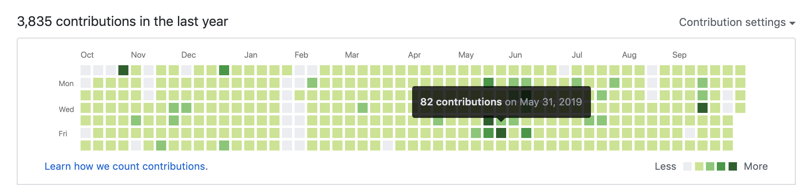

暴走前端 - Github 竞赛
===

> Create by **jsliang** on **2018-12-17 08:16:35**  
> Recently revised in **2019-10-15 17:39:29**

**不折腾的前端，和咸鱼有什么区别！**

## 一 竞赛前言

这是一个竞赛，目标是让你确立自己学习目标，通过坚持、系统地学习，让自己的技术不断成长，顺带让 GitHub Contribution 长成青青草原。

只要你提供 GitHub 账号，只要你记录自己的成长，就可以参加！

## 二 竞赛规则

1、**竞赛日志**

每个参与竞赛的小伙伴需有 GitHub 仓库存放竞赛日志，并且在一开始发给 **jsliang** 一个近期小目标，以提供给 **jsliang** 进行监督。

日志参考如：https://github.com/LiangJunrong/document-library/blob/master/other-library/Monologue/logs/2019-09.md

下面是简略版演示：

### 2019-10-13

* [x] 休息

### 2019-10-12

* [x] 学习：插座学院
* [x] 学习：算法与数据结构之栈和队列
* [x] 锻炼：90 分钟

---

2、**竞赛形式**

竞赛按周或者按月方式进行，小伙伴可以根据自身情况选择是按周还是按月参与。

竞赛从每周一或者每月 1 号算起。

每天的比赛金为 5 元，每月参赛金额按具体月份算。

例如：参与周竞赛 35 元，参与月竞赛 150 元。

---

3、**竞赛结算**

每天进行统计汇总，结算前一天的竞赛记录。

小伙伴打卡表明正常参与，会返还前一天参赛金额（5 元）。

小伙伴漏卡表明未参与，会被扣掉前一天参与金额。

每周日会进行当周结算（上周日——本周六），将漏卡总金额以红包形式发给大家当福利（金额 = 漏卡总金额 / 参赛人数）。同时，接受下一周的竞赛参与（本周日——下周六）。

**新增**：目前可以按日或者按周结算参赛金额。

---

4、**特殊说明**

**jsliang** 会根据参赛情况，按月形式收取 6.66 元监督费/劳苦费（每月一收），如果你觉得不合理，请忽略该竞赛。

**jsliang** 会根据小伙伴的竞赛日志给予个人建议，帮助小伙伴修正自身发展路线以及学习状态（无需建议请提前说明）。

**jsliang** 会将一个月未参与竞赛的小伙伴清理出微信群。

如果小伙伴想参赛，但是又不知道自己想学习啥，可以咨询 **jsliang**。根据 **jsliang** 提供的建议再参与竞赛。

## 三 参赛方式

需要参赛的小伙伴可加 **jsliang** 微信，并在好友通过后直接言明参赛（减少大家沟通时间），**jsliang** 会直接拉小伙伴进 GitHub 竞赛微信群。

下面是参考：

---

**jsliang** 我想参与你组织的 **暴走前端 - GitHub 竞赛**：

1. 我竞赛的日志在 jsliang 的参赛地址：https://github.com/LiangJunrong/document-library/tree/master/other-library/Monologue/logs （GitHub 仓库地址）
2. 我参赛昵称是 **广州-jsliang**（进群请修改成该昵称）
3. 目前我的发展是先搞 `React` 基础，然后写几个 `React` Demo，最后深入探究下 `React` 源码。
4. 本周我想开始参与，今天至周日还有 3 天，我先交 15 元（3 天 * 5 元）给你报名，今天开始记录，下周按正常周参与。

---

**jsliang 微信**：

## 四 成员名单

| 昵称 | GitHub 账号 | 小目标 |
| --- | --- | --- |
| 1. jsliang | [LiangJunrong](https://github.com/LiangJunrong/document-library/tree/master/other-library/Monologue/logs) | 技术提升 |
| 2. teachat8 | [teachat8](https://github.com/teachat8/document-library/blob/master/other-library/RecordDailyGrowth/2019-10.md) | 能写 Vue 组件 |
| 3. 黄敏坚 | [huangminjianxx](https://github.com/huangminjianxx/LearningRecord/) | 11 月找到实习 |
| 4. apple | [donaf](https://github.com/donaf/daydayup/blob/master/logs/2019-10.md) |  |
| 5. 浓茶 | [NingZhuo](https://github.com/NingZhuo/Log/blob/master/Log.md) | 年前跳槽 |
| 5. lien | [LienJack](https://github.com/LienJack/daliy-study/blob/master/201910/14-20.md) | 深入 Vue 源码 |
| 6. chenxiaoyao | [chenxiaoyao6228](https://github.com/chenxiaoyao6228/daily-learing-log) |  |

## 五 参赛记录和漏卡记录

> 2019-10-13 —— 2019-10-19

1. jsliang
2. teachat8 - 7 天
3. 黄敏坚 - 6 天
4. apple - 7 天（周结算）
5. 浓茶 - 6 天
6. lien - 6 天
7. chenxiaoyao - 5 天

>   
> **jsliang** 的文档库</a> 由 [梁峻荣](https://github.com/LiangJunrong/document-library) 采用 [知识共享 署名-非商业性使用-相同方式共享 4.0 国际 许可协议](http://creativecommons.org/licenses/by-nc-sa/4.0/) 进行许可。  
> 基于 [https://github.om/LiangJunrong/document-library](https://github.om/LiangJunrong/document-library) 上的作品创作。  
> 本许可协议授权之外的使用权限可以从 [https://creativecommons.org/licenses/by-nc-sa/2.5/cn/](https://creativecommons.org/licenses/by-nc-sa/2.5/cn/) 处获得。