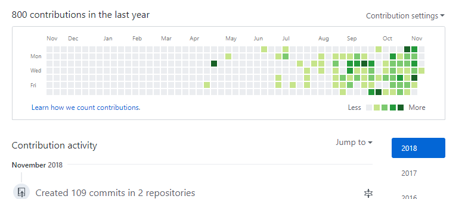
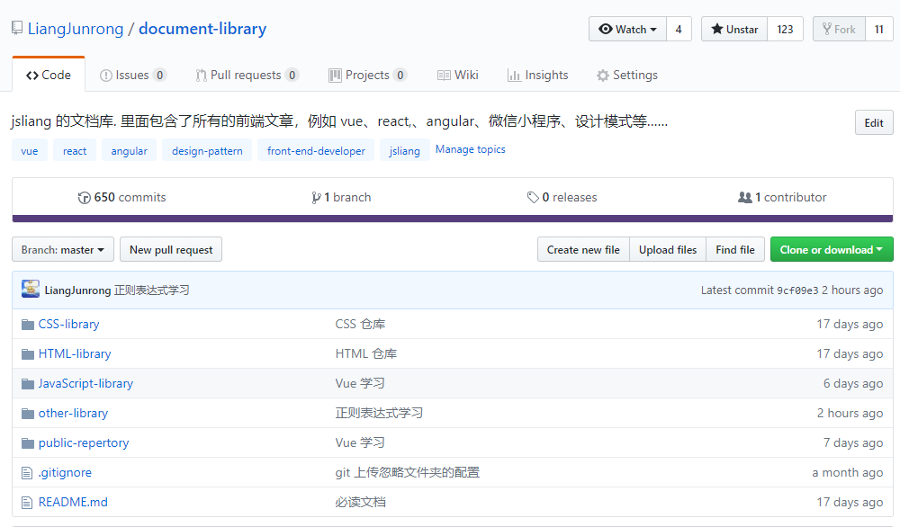

2018年11月-2019年3月进阶指南
===

> Create by **jsliang** on **2018-11-14 13:18:02**  
> Recently revised in **2018-11-14 13:17:58**

 

&emsp;你，是否对自己目前的工作内容很不满意？  
&emsp;你，是否已经厌倦了公司内部的尔虞我诈？  
&emsp;你，是否想要学习更多的技术换份新工作？  
&emsp;我，是的……

 

# 目前现状

* **坐标**：广州
* **薪资**：5.5K
* **职位**：前端工程师
* **工作经验**：半年(应届生)
* **工作内容**：

1. 使用 jQuery 进行电信活动页的编写
2. 进行 Java 的 JSP 页面的维护
3. 进行 PHP 开发的公众号中 H5 页面的开发
4. 小程序的开发与维护

* **已有技能**：

1. 知道基础的 HTML、CSS、JavaScript，基本的 PSD 图能完美切成网页。
2. 了解并会使用 jQuery 进行。
3. 有微信小程序相关的开发经验。
4. 学习过 Webpack 中文文档，并搭建过 Webpack 多页面配置。
5. 曾经使用过 ElementUI + Express + MongoDB 做毕业设计。
6. 曾经使用过 Bootstrap + ThinkPHP + MySQL 做博客。
7. ……其他省略，不值一提

 

# 进阶目标

* **坐标**：广州、深圳
* **薪资**：10K+
* **职位**：前端工程师
* **进阶技能**：

1. 能使用 Vue 全家桶进行项目开发。
2. 有 Node.js 编程经验，并进行过 Node.js 实践。
3. 熟悉 HTTP 协议，了解性能优化方法。
4. 了解 ES6 设计模式，并尝试对日常编程进行架构。

* **技能列表**：

1. Vue 基础知识
2. Vue-Router
3. Vue-Cli
4. Axios
5. Node 基础知识
6. Koa
7. MongoDB
8. MySQL

 

# 实践进度

1. 【10-25】想用 Vue + Koa + MongoDB 搭建一套商城，于是学习 [jspang 的教程](http://jspang.com/post/vue-koa.html)。
2. 【10-28】跟着学习了几天，发现一些基础知识真的忘得差不多了，不知道 Vue 基础知识，不知道 Node 基础知识，不知道 Koa 怎么玩，好纠结，好难受。
3. 【10-29】敲下 Vue 的 README 文章，开始 Vue 学习。
4. 【11-08】发现自己所有知识点都塞进一篇文章了，感觉不好，所以拆分成 VueBase、VueRouter、VueCli、Axios 这四篇文章。同时，发现自己 Axios 没法跟着教程下去了，想搞点 Node 基础，弄个 Koa 服务来帮助自己。

 

* 目前笔记

&emsp;-> [Vue + Koa2 + MongoDB 搭建商城](https://github.com/LiangJunrong/document-library/blob/master/other-library/Website/ShoppingMall/ShoppingMall.md)   
&emsp;-> [Vue 开篇](https://github.com/LiangJunrong/document-library/blob/master/JavaScript-library/Vue/README.md)   
&emsp;-> [Vue 基础](https://github.com/LiangJunrong/document-library/blob/master/JavaScript-library/Vue/VueBase.md)   
&emsp;-> [VueRouter 学习](https://github.com/LiangJunrong/document-library/blob/master/JavaScript-library/Vue/VueRouter.md)   
&emsp;-> [VueCli 实践](https://github.com/LiangJunrong/document-library/blob/master/JavaScript-library/Vue/VueCli.md)   
&emsp;-> [Axios 探索](https://github.com/LiangJunrong/document-library/blob/master/JavaScript-library/Vue/Axios.md)

 

# 留笔做念

&emsp;不单单是想想，更想去实现！  
&emsp;留下你的 GitHub，可以是文章，可以是 Demo，只要能看到你的即时更新！  
&emsp;我们，每周一更新，一起关注彼此进度：  

&emsp;**留笔名单**：

| 姓名 | 最新更新 | 缺更记录 |
| --- | --- | --- |
| **jsliang** | [2018-11-14](https://github.com/LiangJunrong/document-library) | 11-10、11-11、11-12、11-13 |

 

>  <a xmlns:dct="http://purl.org/dc/terms/" property="dct:title">**jsliang** 的文档库</a> 由 <a xmlns:cc="http://creativecommons.org/ns#" href="https://github.com/LiangJunrong/document-library" property="cc:attributionName" rel="cc:attributionURL">梁峻荣</a> 采用 <a rel="license" href="http://creativecommons.org/licenses/by-nc-sa/4.0/">知识共享 署名-非商业性使用-相同方式共享 4.0 国际 许可协议</a>进行许可。 基于<a xmlns:dct="http://purl.org/dc/terms/" href="https://github.com/LiangJunrong/document-library" rel="dct:source">https://github.om/LiangJunrong/document-library</a>上的作品创作。 本许可协议授权之外的使用权限可以从 <a xmlns:cc="http://creativecommons.org/ns#" href="https://creativecommons.org/licenses/by-nc-sa/2.5/cn/" rel="cc:morePermissions">https://creativecommons.org/licenses/by-nc-sa/2.5/cn/</a> 处获得。