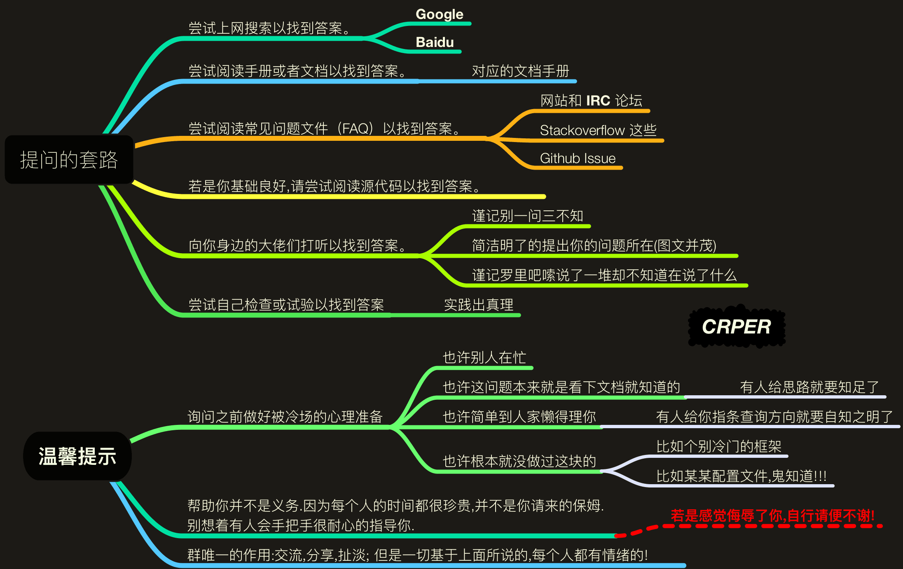
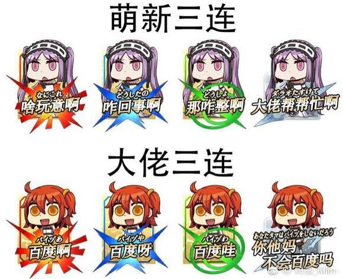

提问的艺术
===

> create by **jsliang** on **2019-3-26 15:28:38**   
> Recently revised in **2019-3-26 15:59:09**

作为一枚编程界的渣，平时最多的就是 **百度**、**bing**、**Google**……

好吧，**Google** 在国内被墙了，还真没咋用过梯子，所以 **Google** 不常用。

除此之外，更多的就是 **向大佬提问** 了：“大佬，问你个问题！我这边显示 Error……”

好的，不管怎样，有时候觉得自己提问姿势还是不太对的，然后刚好看到文章 [【《别像弱智一样提问》】](https://github.com/tangx/Stop-Ask-Questions-The-Stupid-Ways/blob/master/README.md) 和 [【《提问的智慧》】](https://github.com/ryanhanwu/How-To-Ask-Questions-The-Smart-Way/blob/master/README-zh_CN.md)

enm......陷入深思，我是不是就里面的那个弱智......

所以，为了提醒自己，**jsliang** 把 [【《别像弱智一样提问》】](https://github.com/tangx/Stop-Ask-Questions-The-Stupid-Ways/blob/master/README.md) 一文中的内容列出来，免得自己重蹈覆辙：

**别像弱智一样提问！**

## 一 提问之前

在提问之前，我们需要知道的是：

1. 要知道，**Free** 的正确翻译是 **自由**，而非 **免费**。即便回答你的人由时间。
2. 要知道，愿意回答问题的人，都是 **可爱** 的人。
3. 要知道，向帮助你的人 **付费** 是一个高尚的行为。即便回答你的人不是为了钱。
4. 要知道，**花钱买时间是一个常识**。如果你不能认同，要么你钱包穷，要么你思想穷。
5. 要知道，给对方发工资的不是你或者你老板。
6. 要知道，提问的时候你才是 **孙子**，对 **大爷** 客气点。
7. 要知道，不回答你的问题，对其他人没有任何损失。
8. 要知道，**准确描述一件事情** 是一项基本生存技能。
9. 要知道，**搜索** 是一项基本生存技能，学不会用 Google 的话，你可能真的不适合你所从事的行业。
10. 要知道，**英文** 是一项基本生存技能，不认识英文的话，你可能真的不适合你所从事的行业。

## 二 提问描述

向 **大佬** 提问的时候，要学会正确的描述问题。

把 **大佬** 当成你的老板，你在给他做报告，你会怎么做？当然是用最精炼的文字和图片，向老板阐述明白一个事情的来龙去脉。

**要知道，如果你不是妹子，大佬没功夫猜你想什么！**

所以，提问的时候，给的条件越多，你的问题得到解决的概率也快，解决速度越快。

所以，提问的时候，大致是：

---

你好，我这里有一个问题：

1. 关于 **什么**。
2. 想要实现怎样效果。
3. 我通过搜索查找，最终做到怎样效果。
4. 其中代码部分我做了哪些。
5. 其中框架及其版本是哪些。

看到有空的时候能回复下么，谢谢~

---

OK，如果得到解答，最好就再回复句 **谢谢**！没得到解答也最好回复句 **谢谢**！

记住，**谢谢** 两字不用钱，也不会让你觉得委屈，但是能让大佬觉得舒服，感觉自己得到了应用的尊敬！

>  jsliang 的文档库 由 <a xmlns:cc="http://creativecommons.org/ns#" href="https://github.com/LiangJunrong/document-library" property="cc:attributionName" rel="cc:attributionURL">梁峻荣</a> 采用 <a rel="license" href="http://creativecommons.org/licenses/by-nc-sa/4.0/">知识共享 署名-非商业性使用-相同方式共享 4.0 国际 许可协议</a>进行许可。 基于<a xmlns:dct="http://purl.org/dc/terms/" href="https://github.com/LiangJunrong/document-library" rel="dct:source">https://github.com/LiangJunrong/document-library</a>上的作品创作。 本许可协议授权之外的使用权限可以从 <a xmlns:cc="http://creativecommons.org/ns#" href="https://creativecommons.org/licenses/by-nc-sa/2.5/cn/" rel="cc:morePermissions">https://creativecommons.org/licenses/by-nc-sa/2.5/cn/</a> 处获得。