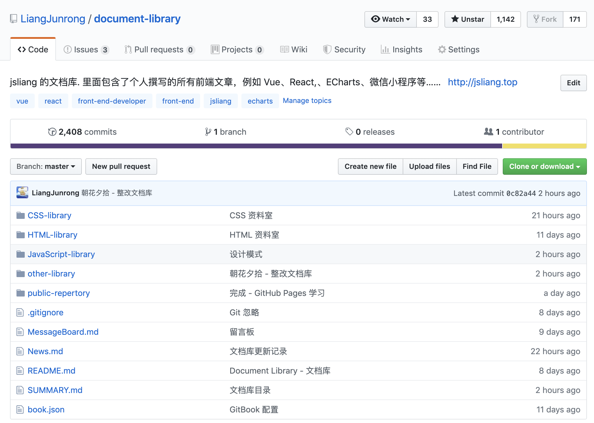
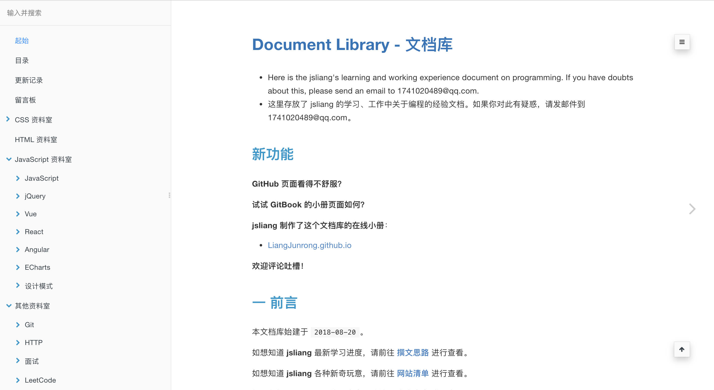

朝花夕拾 - 变更
===

> Create by **jsliang** on **2019-05-31 17:17:45**  
> Recently revised in **2019-6-3 09:05:39**

**不折腾的前端，和咸鱼有什么区别！**

## 一 前言

**jsliang** 的文档库（[document-library](https://github.com/LiangJunrong/document-library)）创建于 **2018-08-20**，期间经过好几次的大更改，目前已有超 **2400** 次的 commit，**1140** 多的 star 以及近 **120** 多篇原创文章。

在两周前（2019-05-20），**jsiang** 机缘巧合之下看到用 GitBook 重构下文档库是个不错的选择，于是投入了重改文档库的大工程中，并成功在今天（2019-05-31）改造文档库完毕。

* [jsliang 的文档库](https://github.com/LiangJunrong/document-library)

* jsliang 的 GitBook 小册
  * [LiangJunrong.github.io](http://liangjunrong.github.io)（每天更新）
  * [document.jsliang.top](http://document.jsliang.top/)（每周更新）

截至今天，**jsliang** 除了：

* **正则表达式**
* **原生 Node 教程**
* **ECharts 打造个人简历**
* ……等

这些单篇幅文章在 **掘金** 受到小伙伴们的欢迎外，**jsliang** 根据自己编写文档库的思路，将文章划分出一些模块：

* **Vue 系列学习**
* **React 系列学习**
* **MarkDown 打造静态网站系列**
* **LeetCode 系列攻略**
* **前端面试系列**

后期会持续完善文档库，希望能帮助小伙伴们在前端的路上快活前行~

## 二 单篇系列推荐文章

单篇系列是指该篇文章在某个时间段深受小伙伴们喜欢，但是并不代表它们一直会是单篇，例如 Node.js，在后期写上 Express、Koa、Egg 等使用攻略后，它也是一个系列的学习。

* [ECharts 打造在线个人简历](https://liangjunrong.github.io/JavaScript-library/ECharts/curriculum-vitae.html)
* [Node 基础](https://liangjunrong.github.io/other-library/Node/Node-base.html)
* [正则表达式学习](https://liangjunrong.github.io/other-library/regular-expression/regular-expression-study.html)

## 三 Markdown 打造静态网站系列文章

**jsliang** 在 2018年10月24日 发布过一篇 **1024，快速打造你的文档库/静态博客**，使用的是 VuePress 和 GitHub Pages，最近又因为折腾了下 GitBook，于是将它们和 Markdown 一起存放，形成了一个 文档库/博客 系列的教程。

* [Markdown 学习](https://liangjunrong.github.io/other-library/Markdown-Websites/Markdown/Markdown-study.html)
* [GitHub Pages 学习](https://liangjunrong.github.io/other-library/Markdown-Websites/GitHub-Pages/GitHub-Pages-study.html)
* [VuePress 学习](https://liangjunrong.github.io/other-library/Markdown-Websites/VuePress/VuePress-study.html)
* [GitBook 搭建](https://liangjunrong.github.io/other-library/Markdown-Websites/GitBook/GitBook-study.html)

**jsliang** 祝小伙伴们看完这 4 篇文章后，不仅可以在日常工作/生活中能使用 Markdown 做笔记，更能成功搭建自己的 文档库/博客。

## 四 前端面试系列文章

都 9102 年了，老板怎么还不涨工资！这是不给活路啊！

于是，**jsliang** 在 3 月份开启了自己的面试之旅，经历了 4 天的 *请假休息*，**jsliang** 跑了 3 轮面试，并成功拿到了 3 份 offer，4月1日入职，然后写下了这个系列的文章。

* [jsliang 的 2019 面试准备](https://liangjunrong.github.io/other-library/interview/personal-experience/2019-interview-preparation.html)
* [2019 面试实战 - Round One](https://liangjunrong.github.io/other-library/interview/personal-experience/2019-practical-round-one.html)
* [2019 面试实战 - Round Two](https://liangjunrong.github.io/other-library/interview/personal-experience/2019-practical-round-two.html)
* [2019 面试实战 - Round Three](https://liangjunrong.github.io/other-library/interview/personal-experience/2019-practical-round-three.html)
* [面试知识点 - JS 原型与原型链](https://liangjunrong.github.io/other-library/interview/personal-experience/JavaScript-%E5%8E%9F%E5%9E%8B%E4%B8%8E%E5%8E%9F%E5%9E%8B%E9%93%BE.html)
* [面试知识点 - JS 防抖与节流](https://liangjunrong.github.io/other-library/interview/personal-experience/JavaScript-%E9%98%B2%E6%8A%96%E4%B8%8E%E8%8A%82%E6%B5%81.html)
* [面试知识点 - 图片](https://liangjunrong.github.io/other-library/interview/personal-experience/other-%E5%9B%BE%E7%89%87.html)

## 五 Vue 学习系列文章

是技术文章没热点还是 **jsliang** 写的技术系列文章不够清晰？

那就不可得知了！

不过 **jsliang** 写完 Vue 和 React 系列的文章后，还是会感觉自己有所进步的。

* [Vue 基础](https://liangjunrong.github.io/JavaScript-library/Vue/Vue-base.html)
* [Vue 官方文档二三事](https://liangjunrong.github.io/JavaScript-library/Vue/Vue-official-documents.html)
* [Vue 开发准备](https://liangjunrong.github.io/JavaScript-library/Vue/Vue-prepare.html)
* [Axios](https://liangjunrong.github.io/JavaScript-library/Vue/Axios.html)
* [Vue Router](https://liangjunrong.github.io/JavaScript-library/Vue/Vue-Router.html)
* [Vue 上传文件](https://liangjunrong.github.io/JavaScript-library/Vue/Vue-upload-file.html)
* [Vue 部署优化](https://liangjunrong.github.io/JavaScript-library/Vue/Vue-deployment-optimization.html)
* [Vue Demo - 功成千骨](https://liangjunrong.github.io/JavaScript-library/Vue/Vue-demo-one.html)
* [Vue Demo Two - 创意网站](https://liangjunrong.github.io/JavaScript-library/Vue/Vue-demo-two.html)

## 六 React 学习系列文章

4月1日 入职后，**jsliang** 开启了自己的 React 之旅，并疯狂地学习，从而留下了这个系列的文章，虽然有些部分不够完善……

* [React 基础](https://liangjunrong.github.io/JavaScript-library/React/React-base.html)
* [React 开发准备](https://liangjunrong.github.io/JavaScript-library/React/React-prepare.html)
* [React 知识点清单](https://liangjunrong.github.io/JavaScript-library/React/React-list.html)
* [React List - Create React App](https://liangjunrong.github.io/JavaScript-library/React/React-list-Create-React-App.html)
* [React List - React Redux](https://liangjunrong.github.io/JavaScript-library/React/React-list-React-Redux.html)
* [React List - React Router](https://liangjunrong.github.io/JavaScript-library/React/React-list-React-Router.html)
* [React Demo One - TodoList](https://liangjunrong.github.io/JavaScript-library/React/React-demo-one-TodoList.html)
* [React Demo Two - TodoList 升级](https://liangjunrong.github.io/JavaScript-library/React/React-demo-two-TodoList-upgrade.html)
* [React Demo Three - 简书](https://liangjunrong.github.io/JavaScript-library/React/React-demo-three-JianShu.html)
* [React Demo Four - 掘金](https://liangjunrong.github.io/JavaScript-library/React/React-demo-four-JueJin.html)
* [React Demo Five - 区域圈](https://liangjunrong.github.io/JavaScript-library/React/React-demo-five-RegionalCircle.html)

## 七 LeetCode 攻略系列文章

* [001 - 两数之和（two-sum）](https://liangjunrong.github.io/other-library/LeetCode/easy/001-%E4%B8%A4%E6%95%B0%E4%B9%8B%E5%92%8C%EF%BC%88two-sum%EF%BC%89.html)
* [007 - 整数反转（reverse-integer）](https://liangjunrong.github.io/other-library/LeetCode/easy/007-%E6%95%B4%E6%95%B0%E5%8F%8D%E8%BD%AC%EF%BC%88reverse-integer%EF%BC%89.html)
* [009 - 回文数（palindrome-number）](https://liangjunrong.github.io/other-library/LeetCode/easy/009-%E5%9B%9E%E6%96%87%E6%95%B0%EF%BC%88palindrome-number%EF%BC%89.html)
* [013 - 罗马数字转整数（roman-to-integer](https://liangjunrong.github.io/other-library/LeetCode/easy/013-%E7%BD%97%E9%A9%AC%E6%95%B0%E5%AD%97%E8%BD%AC%E6%95%B4%E6%95%B0%EF%BC%88roman-to-integer%EF%BC%89.html)

## 八 总结

到此，**jsliang** 的文档库概况在小伙伴们眼前是一览无余啦~

如果小伙伴们想知道 **jsliang** 最新的动态，可以催更 **jsliang**：

* [文档库更新记录](https://liangjunrong.github.io/News.html)

如果小伙伴们想知道 **jsliang** 的联系方式、文档库地址、GitBook 小册地址以及公众号：

* 微信：

* 微信群：

* 公众号：飘飞的心灵
* QQ：`1741020489`
* QQ 群：`798961601`
* 文档库地址：[jsliang 的文档库](https://github.com/LiangJunrong/document-library)
* GitBook 小册地址：[LiangJunrong.github.io](https://liangjunrong.github.io/)

那么，祝小伙伴们在前端道路上不断前行~

---

> **jsliang** 广告推送：  
> 也许小伙伴想了解下云服务器  
> 或者小伙伴想买一台云服务器  
> 或者小伙伴需要续费云服务器  
> 欢迎点击 **[云服务器推广](https://github.com/LiangJunrong/document-library/blob/master/other-library/Monologue/%E7%A8%B3%E9%A3%9F%E8%89%B0%E9%9A%BE.md)** 查看！

>  jsliang 的文档库 由 <a xmlns:cc="http://creativecommons.org/ns#" href="https://github.com/LiangJunrong/document-library" property="cc:attributionName" rel="cc:attributionURL">梁峻荣</a> 采用 <a rel="license" href="http://creativecommons.org/licenses/by-nc-sa/4.0/">知识共享 署名-非商业性使用-相同方式共享 4.0 国际 许可协议</a>进行许可。 基于<a xmlns:dct="http://purl.org/dc/terms/" href="https://github.com/LiangJunrong/document-library" rel="dct:source">https://github.com/LiangJunrong/document-library</a>上的作品创作。 本许可协议授权之外的使用权限可以从 <a xmlns:cc="http://creativecommons.org/ns#" href="https://creativecommons.org/licenses/by-nc-sa/2.5/cn/" rel="cc:morePermissions">https://creativecommons.org/licenses/by-nc-sa/2.5/cn/</a> 处获得。