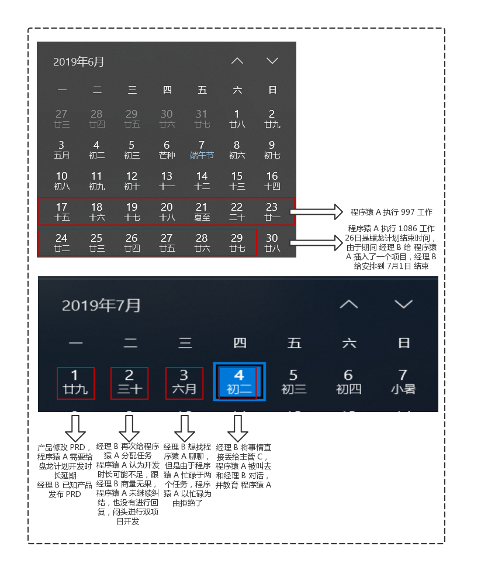
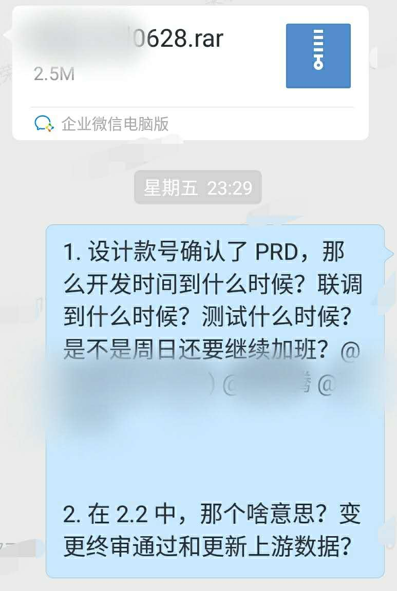
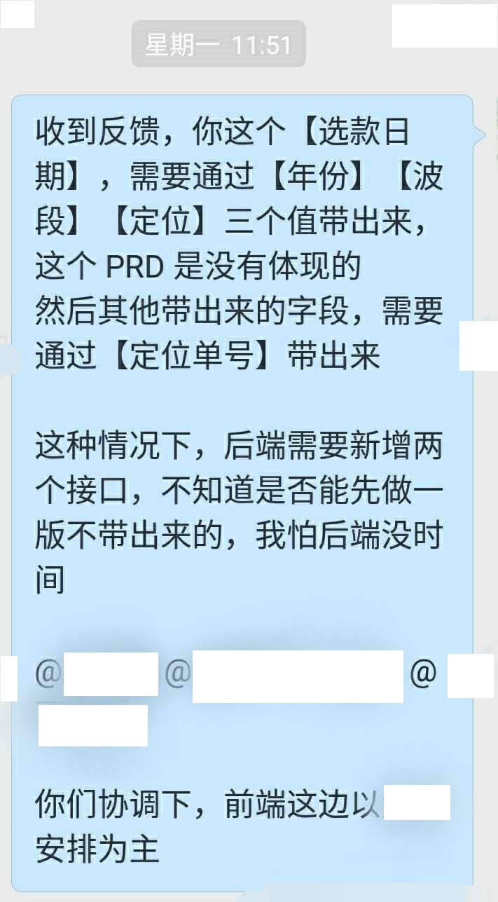
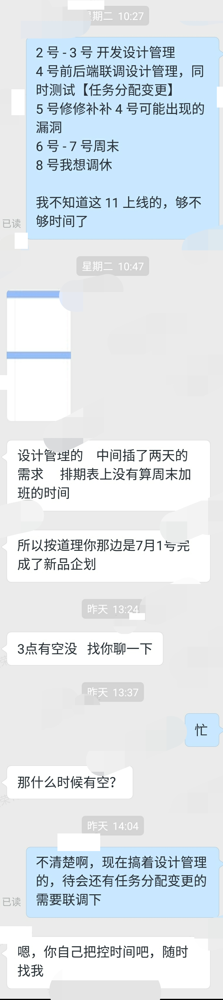

朝花夕拾 - 一则小故事
===

> Create by **jsliang** on **2019-7-4 21:43:53**  
> Recently revised in **2019-7-5 09:23:10**

## 一 前言

今天，准备讲一则对于走进社会的人士，随时可以碰到的普通寻常的。但是，对于某些人来说，可能又不普通且值得铭记的故事。

**虽然我不是一个很会讲故事的人，但是我觉得一个故事如果没被记载，那么它会带走这个故事主人公的灵魂碎片，并逐渐消失在历史潮流中，无法回溯。**

这则故事将从事件源头开始，并尝试以 **前端程序猿 A** 的视角，描述它的起因、经过、结果……

> 前端程序猿 A：以下简称 **程序猿 A**  
> 前端经理 B：以下简称 **程序猿 B**  
> 项目主管 C：以下简称 **主管 C**

由于涉及人物以及有些内容需要敏感出来，并且故事可能带个人主观，所以在这里请小伙伴们先明晰。

那么，Here we go~

## 二 客观描述 - 历史回溯

项目盘龙计划，原定于经过 1 个多月的开发，并通过为期 1 周多的测试，经产品验收后，上线以供业务方使用。

但是由于中途产品的跑路，该项目中断了近 2 周，迎来了新的产品，并开始了紧急开发计划：

> 产品：一种人物，非常伟大，主宰程序猿  
> 后端：程序猿物种 * 1  
> 前端：程序猿物种 * 1

* 后端（6.16-6.30）：早 9 点，晚 9 点，一周需要上 7 天班（997）
* 前端（6.17-6.26）：早 9 点，晚 9 点，一周需要上 6 天班（996）

那么，故事开始：

* 6月17日 - 6月22日，经过 PRD ① 的再三处理，前后端对接口文档 ② 的协定，以及 **程序猿 A** 的流程规划，**程序猿 A** 逐渐找到了自己的节奏。为了避免后期开发的加班加点，**程序猿 A** 于 6月23日 也进行了加班，实际执行了 997。

> ① PRD：类似设计师的设计稿，就是简化版的网页，需要经过程序猿的加工，生成真实的网页  
> ② 接口文档：前端和后端为了防止冲突，以及各种甩锅行为，定义的一些文档，双方参照这些文档进行编程，防止对接时的冲突  

* 6月23日 - 6月29日，**程序猿 A** 发现他能以正常的上下班时间来开发了，于是按照正常的作息（早 10 点，晚 8 点）开发。但是由于 6月29日 是 **测试** ③ 进行测试的日子，所以 6月29日 也进行了加班，实际执行了 10-8-6。期间，**经理 B** 给 **程序猿 A** 加了个任务，并定义前端新的完工时间为 7月1日。

> ③ 测试：一种人物，非常苦逼，需要为产品期望的页面进行各方面的检测

* 7月2日，**经理 B** 又丢给 **程序猿 A** 一个任务，**程序猿 A** 跟 **经理 B** 商量无果后，**程序猿 A** 只能闷头双向开发。
* 7月4日，由于 **程序猿 A** 没有在 7月2日 协调后回复 **经理 B**，并且在 7月3日 **经理 B** 询问 **程序猿 A** 有没有时间当面聊聊时，**程序猿 A** 由于正在开发，回复没有时间，导致 **经理 B** 认为 **程序猿 A** 有怠工现象，反馈给 **主管 C**。**主管 C** 将 **程序猿 A** 和 **经理 B** 叫到了一块，当面对 **程序猿 A** 进行了教育。

有的小伙伴看到这里可能懵圈了，那么上图：

那么，小伙伴应该有自己的想法了，下面开始程序猿视角分析。

## 三 视角 - 程序猿 A

程序猿 A 视角经历如下：

* **6月28日，星期五**，产品就 **页面 Z** 进行了最终解释，并拉了 **经理 B** 以及后端负责人进行讲解，同时在群里发布了最终版本的 PRD，我就个人疑问艾特了 **产品**、**经理 B** 以及 **后端负责人**，好像，没有任何回复。enm...之后应该会回复我的吧？

* **7月1日，星期一**，我开始进行开发，然后有些问题再次艾特周五艾特的这三个，好像，还是没有回复？

* **7月2日，星期二**，真难受，**经理 B** 又给我分配了个任务，我告诉他 2号-3号 需要开发 **页面 Z**，然后 **经理 B** 对着盘龙计划开始前的安排，告诉我中间插了一项任务，所以我应该在 **7月1日** 就应该结束了，他说的 *很对*，我竟无言以对。

* **7月4日，星期四**，我就这样被叫出来了，**主管 C** 跟我说这事的时候，我是有点懵圈的，随后 **主管 C** 把 **经理 B** 也叫了出来，并对我进行了末日审判，主要罪名有：

1. 项目开发延期 4 天，前端未能按时完成。
2. 带情绪上班，对任务安排毛躁，对经理不耐烦。
3. 对外人招待不周，其他项目组安排人过来，轮流介绍的时候我发言说 **小人物、小人物，不用介绍不用介绍**，态度不正确。
4. 消极怠工，拒接安排的任务。

我个人想法是：

1. 项目开发延期 4 天，未能按时完成……enm...这，嗯，你说的对你说的对。
2. 带情绪上班，对任务安排毛躁，对经理不耐烦……enm...这，连续三周工作，就休息一天，然后被安排 **7月1日** 完工，这边天气还那么干燥，不知道其他小伙伴会不会毛躁会不会不耐烦，好想知道。
3. 对外人招待不周……enm...这，这是我真的有问题，毕竟人家是个妹子，再毛躁也还是要好好打招呼了，我的锅~
4. 消极怠工，拒绝安排的任务……enm...都安排上了，还说的很有道理，那我就开发咯，还开发完了好吧……怎么就给你其他任务安排造成影响了。

## 四 结尾

**程序猿 A** 被 **主管 C** 教育后，**主管 C** 吩咐 **经理 B** 进行随后的惩罚安排。

故事，就到此结束了。

这个故事告诉我们，该背的锅还是甩不掉的！

但是，希望小伙伴们在人生的旅途中，不会被各种各样的锅压地扁平了，扭曲了，失望了，没活力了。

至少，我们还是能获得一点教训：

1. 该沟通的及时沟通。虽然留了截图可能一点用都没有，但是先沟通，再工作，再谈论问题出处，是 **工作准则** 之一。
2. 看好你的小情绪。别被抓了小尾巴喔~

至少，还知道，曾经的我们，是怎样的。

## 精彩评论

1. 看完了，很多公司都有这样的毛病，还是沟通的问题，a 缺乏沟通了，或者说沟通不明确，比如发现项目有延期风险就要趁早说，a 虽然是有一堆待确认的问题，但 a 是主开发负责人，因为人家没回复就导致项目延期，a 肯定是有责任的。
2. 千万别觉得发到群里 @别人就够了，群里又不能显示已读，人家就说消息太多没看到，你任何办法没有。
3. 不管什么样的人，和我对接的时候，他提交的东西要尽可能没问题，而且我的精力能做多少事情直接和他说明。扯太多了，事情容易搞砸。
4. 在有需求未确认或者需求发生变更时，简单的说，有风险的情况下，直接把风险暴露给项目主管，让他去推进整个事情。如果对方超过半小时没回复，电话直接打过去。推动要果断，语言要谦虚。
5. 我对人性的观察，很多事情是相互的，项目延期直接领导找你沟通一般都是会询问原因，帮你解决，但你直接拒绝，给他的感觉就是你不在乎他，他肯定也不管你了。
6. 文字记录上，如果做个人反思的话，提个建议，客观描述事情，更重要的是记录自己的心理过程和情绪变化，这样更容易找到自己忽略的问题。
7. 我看完了你的故事，说说我的看法。
 我认为，你们最主要的矛盾在于，产品经理频繁的需求变更与分配给程序员的开发时间不会动态增加的矛盾。
 从你的描述给我感觉，经理B和主管C，水平都有限。  
 任何工程项目，都需要缜密的思考，严谨的规划，认真的实施，才能取得好成果，规避风险，符合进度与预算。越是大的项目，越是如此。
 优秀的团队，完善的项目管理流程很重要，项目出现延期，应该是产品经理分析下什么地方出了坑，协调好程序员的开发周期，而不是一味甩锅，而你们主管C，如果这个事情上只帮产品经理说话，不会安抚下属，那我觉得水平就那样了。
 然后说下你的问题，连续加班确实让人心浮气躁，我自己也经历过，可以理解，但是最好不要太表露出来，情绪不要带到工作中去，经理B问你什么时候有空，你只回复一句“忙”，确实不太好，经理B肯定就觉得没面子，所以程序员还是要在社交技巧上下点功夫。
 最后一点建议，把注意力放在提升自己硬实力上，让自己越来越专业，不只是技术方面。以后和更优秀的人合作。

---

**不折腾的前端，和咸鱼有什么区别！**

**jsliang** 会每天更新一道 LeetCode 题解，从而帮助小伙伴们夯实原生 JS 基础，了解与学习算法与数据结构。

或者分享下前端编程经历，前端工作经历。

扫描上方二维码，关注 **jsliang** 的公众号，让我们一起折腾！

>  jsliang 的文档库 由 <a xmlns:cc="http://creativecommons.org/ns#" href="https://github.com/LiangJunrong/document-library" property="cc:attributionName" rel="cc:attributionURL">梁峻荣</a> 采用 <a rel="license" href="http://creativecommons.org/licenses/by-nc-sa/4.0/">知识共享 署名-非商业性使用-相同方式共享 4.0 国际 许可协议</a>进行许可。 基于<a xmlns:dct="http://purl.org/dc/terms/" href="https://github.com/LiangJunrong/document-library" rel="dct:source">https://github.com/LiangJunrong/document-library</a>上的作品创作。 本许可协议授权之外的使用权限可以从 <a xmlns:cc="http://creativecommons.org/ns#" href="https://creativecommons.org/licenses/by-nc-sa/2.5/cn/" rel="cc:morePermissions">https://creativecommons.org/licenses/by-nc-sa/2.5/cn/</a> 处获得。