朝花夕拾 - 生日
===

> Create by **jsliang** on **2019-4-5 16:58:15**  
> Recently revised in **2019-09-19 09:43:22**

生活太匆忙，人生恨苦短。

不知不觉，已经到了人生第二个本命年，恰巧的是，今天又是本命年的生日。

闲来无事，整理下 2018-2019 这一年的资料，分享下此时此刻的心情与感慨。

* **主题**：【写在生日，本命有感】
* **时间**：【2019-04-05】
* **地点**：【员岗】
* **歌曲 1**：【来吧 甜蜜的吐槽 —— 卢恒宇、李姝洁、王冲】
* **歌曲 2**：【写给父亲 —— 卢恒宇、李姝洁】

> 注意：图片过多，谨慎打开

## 一 毕业季

* 2018 年 5 月 —— 2018 年 6 月
* 开始实习，在毕业那天正式转正，大学生活就这么结束了，开始广东漂泊之旅？哈哈！

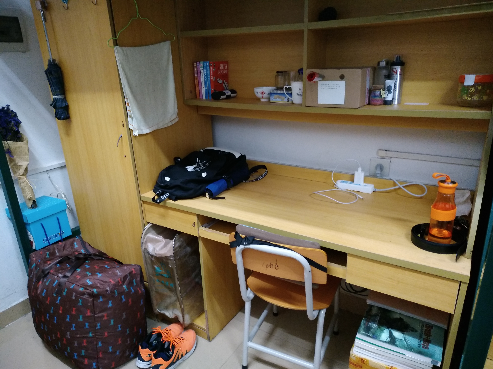

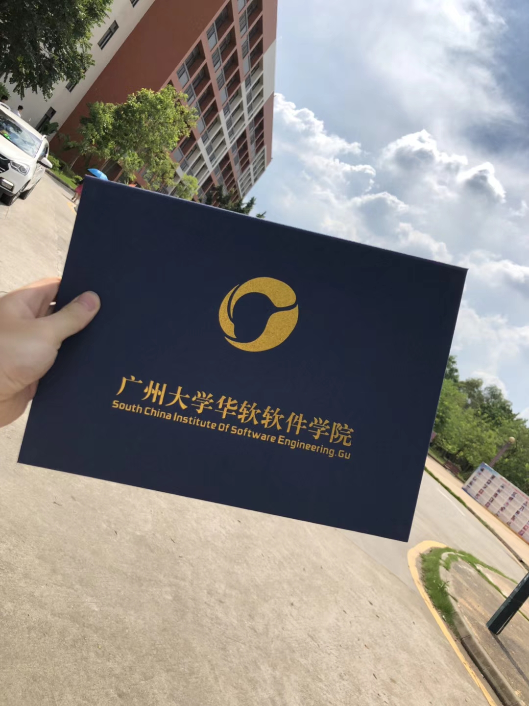

## 二 工作岗位

* 2018 年 5 月 —— 至今
* 2018 年 5 月，开始第一家公司工作，写写 H5 页面，轻松快活。
* 2018 年 9 月，被派到电信驻点，写微信小程序、数据报表等等。
* 2019 年 4 月，开始第二家公司工作，入职没几天，没啥好照片。

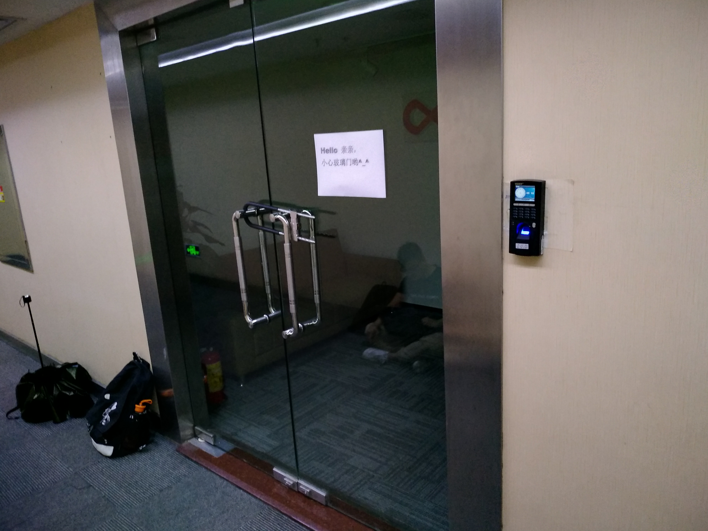

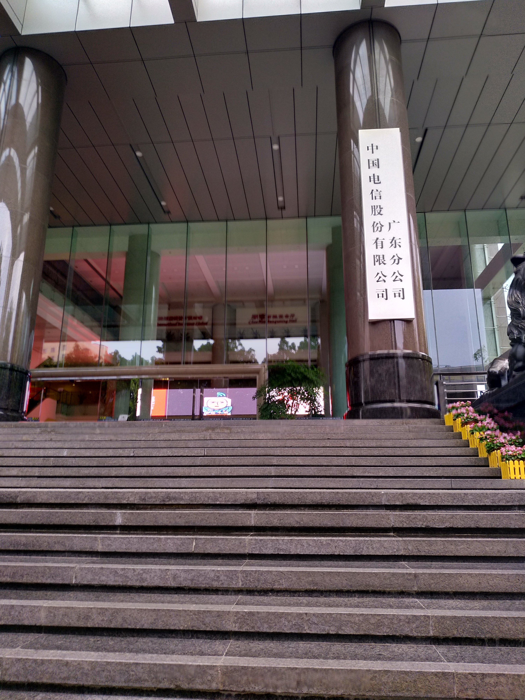

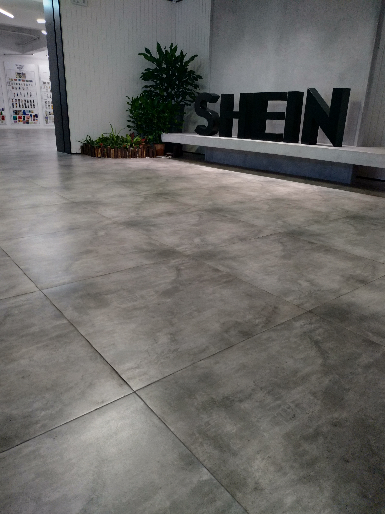

## 三 办公位置变化

* 2018 年 5 月 —— 至今
* 2018 年 5 月，第一家公司的时候，自己买了新电脑和新显示器，大大的显示器盒子还在办公桌旁边，再加上个大大的鼠标垫，自己购买的一套装备。
* 2018 年 9 月，驻点电信之旅开始，由于电信提供显示器了，所以 **心疼** 地买了个显示器转接头，鼠标垫也忘记拿过来了，位置狭窄偏僻，空气不好，勉强活着。
* 2019 年 4 月，第二家公司之旅开始，刚入职一周，没拍摄到好照片。当然令人开心的是，公司提供 Mac 了，人生第一台 Mac，虽然所有权不是我的，哈哈。

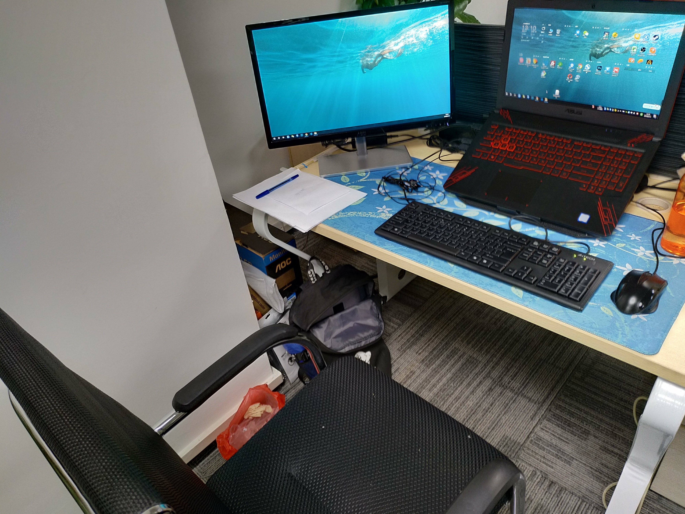

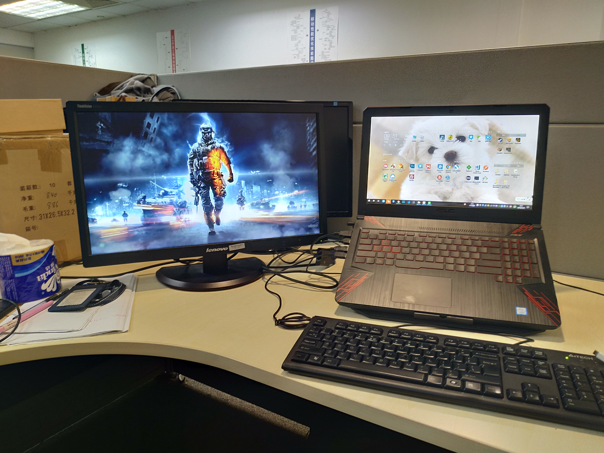

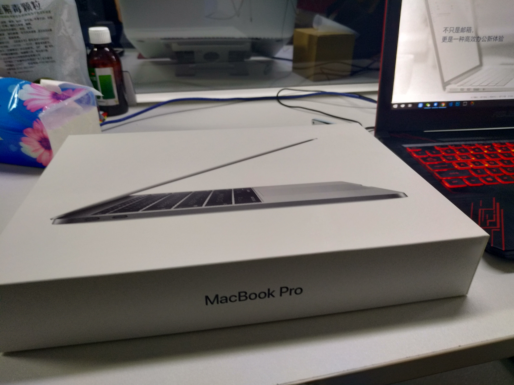

## 四 文档库成就

* 2018 年 8 月 —— 至今
* 掘金 —— 获得第 2019 个关注者的截图，现在如果再看，可能没那么兴奋了，目前关注者 6979，加油努力，期待 10000 个关注者。
* GitHub —— 获得第 1003 个 star 截图，本来打算第 1000 个 star 截图的，但是那几天太忙了，没反应过来，被冲破了。
* 掘金 —— 人生小巅峰，因为那篇关于 Node 文章突破 1000 点赞，获得了年度排行第 7 位。

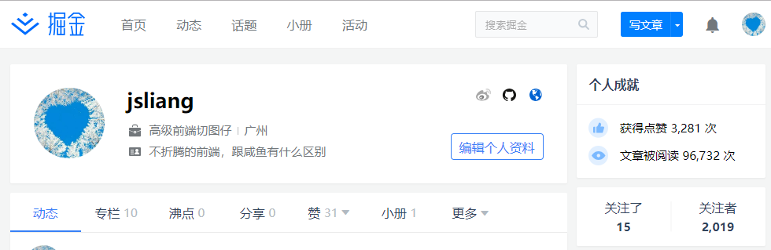

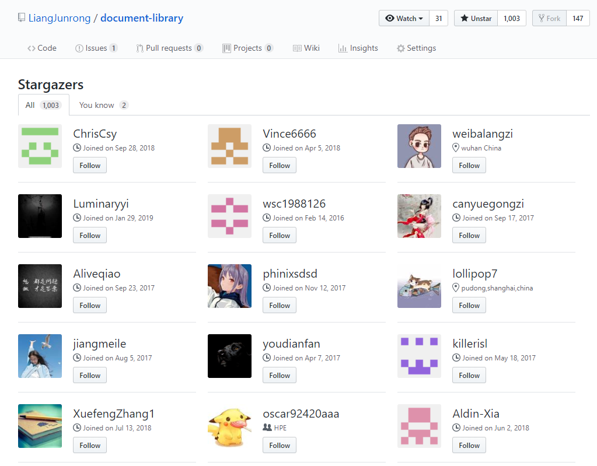

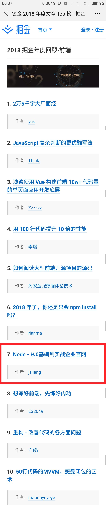

## 五 粉丝互动

* 2019 年 3 月
* 因为写了一系列的面试经历，及最后的个人面试体系分享，收获了一些粉丝的夸奖，还是非常开心的。当然，有夸奖也有贬低，有时候看到一些 “莫名其妙” 的话，还是小难受的，哈哈~

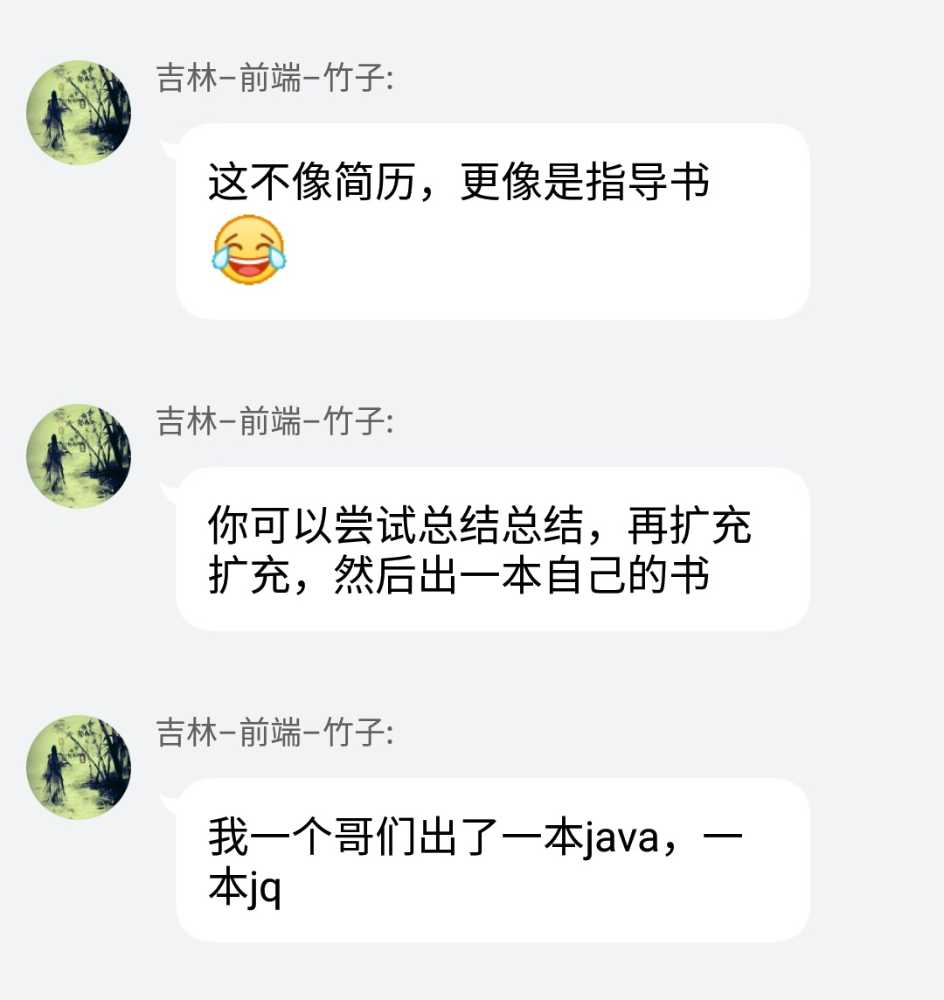

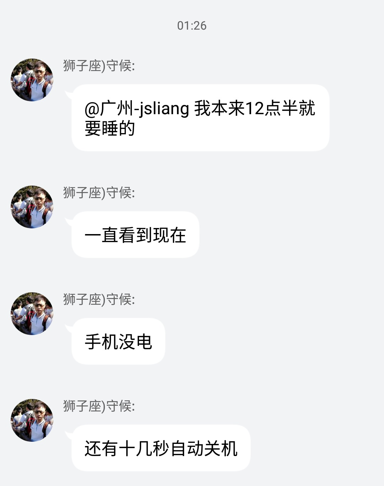

## 六 租房

* 2018 年 5 月 —— 2019 年 3 月
* 2018 年 5 月，第一次租房，能花 900 租到 35 平方的，距离地铁贼近的房子，个人幸运度还是蛮高的。
* 2019 年 3 月，第二次租房，这次的租房比上次来说，空间小了，光线更充足了，价格却更贵了，950 租到 30 平方的。

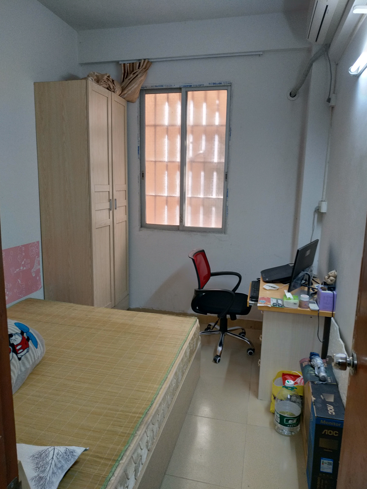

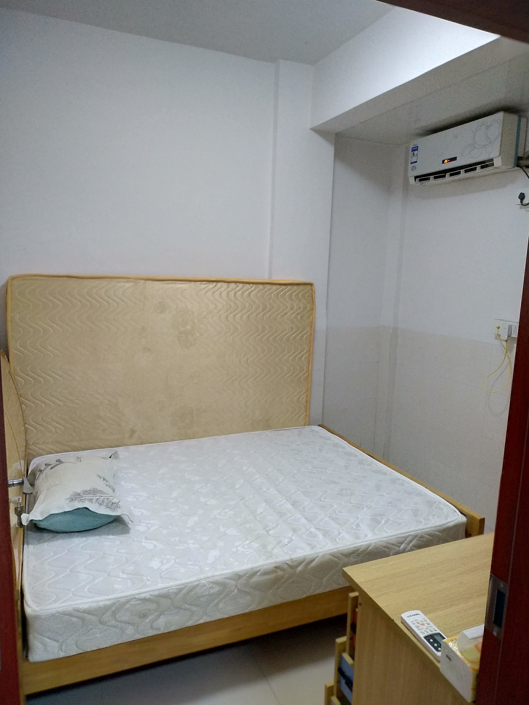

## 七 个人健康

* 2018 年 5 月 —— 至今
* **编程是份高风险的工作！请大家注重锻炼，保持身体健康！请关注身边的程序猿/程序媛！**
* **编程是份高风险的工作！请大家注重锻炼，保持身体健康！请关注身边的程序猿/程序媛！**
* **编程是份高风险的工作！请大家注重锻炼，保持身体健康！请关注身边的程序猿/程序媛！**
* 那天看到个人偶像发的票圈，整个人都愣住了，后来一听他的经历，整个人都懵逼了，太拼了。还好大佬目前还是健健康康的。
* 但是，编程这份工作，真的不是那么好混的。加班，熬夜，掉发，时刻威胁生命健康。幸好身边的大佬挺注重生活的，所以跟着榜样时刻锻炼自己，现在晚上 11 点睡 6 点半起床。
* **请记住：钱可以慢慢赚，生命就只有一条，你以为玩超级玛丽呢！**

## 八 后记

最后，谈谈今年印象最深的事。

还记得某次面试，有场对话：

* 面试官：“能冒昧询问下你上家公司的薪资吗？”
* 我：“n 千。”（n 代表一个数字）
* 面试官：“既然你上家公司的薪资是 n 千，现在你提的薪资是 2n 千了，你觉得你哪方面值得翻一番？”
* 我：“我觉得 ** 方面可以加 n 千， ** 方面可以……”（一顿分析）

现在回想起来，想说的是，面试贵司之前的公司，真的给我工资翻番了，而且在这之后的几家给 offer 的公司，基本也给我翻番工资了。

最后的最后，如果小伙伴们想关注 **前端程序猿的个人知识体系构建**，可查看：

* [jsliang 的文档库](https://github.com/LiangJunrong/document-library)

如果小伙伴们想关注 **程序猿的生活日常**，可以查看：

* [jsliang 的文档库 之 朝花夕拾](https://github.com/LiangJunrong/document-library/tree/master/other-library/Monologue/morning-and-evening)

what's more，下面有个小广告，需要购买服务器的小伙伴可以点点~

---

> **jsliang** 广告推送：  
> 也许小伙伴想了解下云服务器  
> 或者小伙伴想买一台云服务器  
> 或者小伙伴需要续费云服务器  
> 欢迎点击 **[云服务器推广](https://github.com/LiangJunrong/document-library/blob/master/other-library/Monologue/%E7%A8%B3%E9%A3%9F%E8%89%B0%E9%9A%BE.md)** 查看！

>  jsliang 的文档库 由 <a xmlns:cc="http://creativecommons.org/ns#" href="https://github.com/LiangJunrong/document-library" property="cc:attributionName" rel="cc:attributionURL">梁峻荣</a> 采用 <a rel="license" href="http://creativecommons.org/licenses/by-nc-sa/4.0/">知识共享 署名-非商业性使用-相同方式共享 4.0 国际 许可协议</a>进行许可。 基于<a xmlns:dct="http://purl.org/dc/terms/" href="https://github.com/LiangJunrong/document-library" rel="dct:source">https://github.com/LiangJunrong/document-library</a>上的作品创作。 本许可协议授权之外的使用权限可以从 <a xmlns:cc="http://creativecommons.org/ns#" href="https://creativecommons.org/licenses/by-nc-sa/2.5/cn/" rel="cc:morePermissions">https://creativecommons.org/licenses/by-nc-sa/2.5/cn/</a> 处获得。