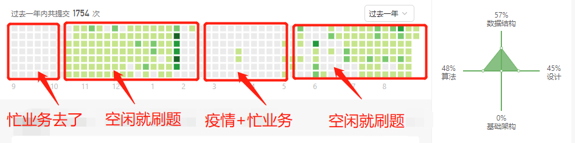
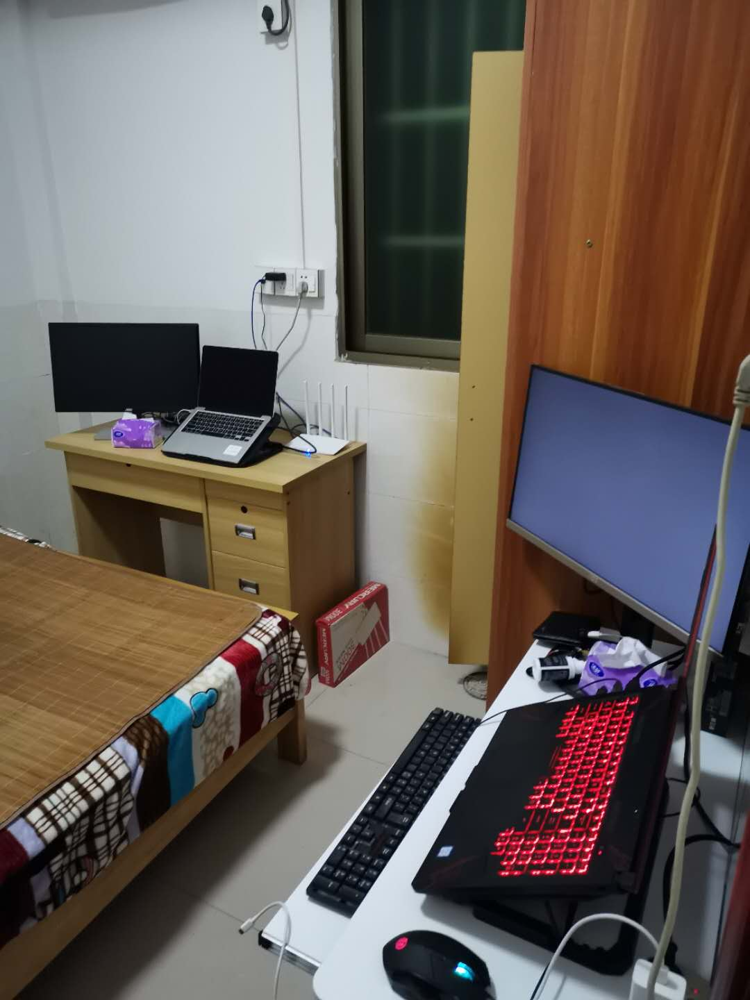
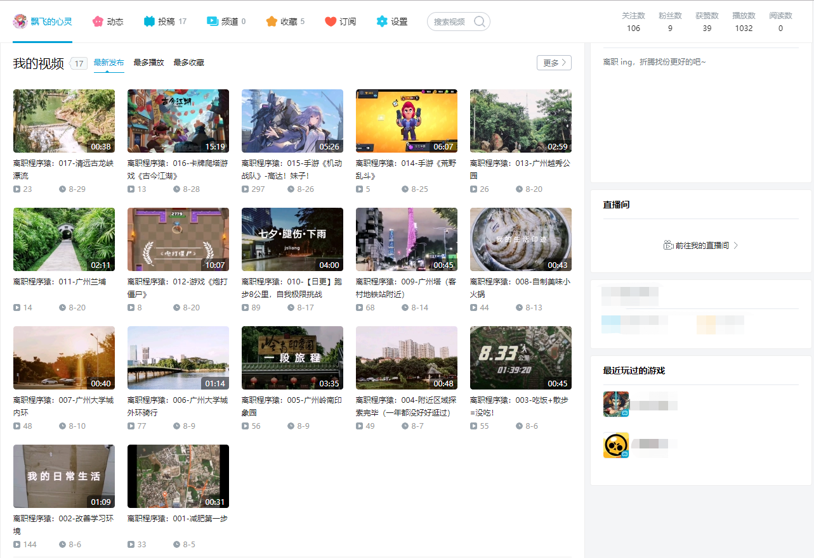

朝花夕拾 - 8月离职 & 9月规划
===

> Create by **jsliang** on **2020-09-01 10:48:08**  
> Recently revised in **2020-09-01 15:47:18**

好像，有一个月没有发公众号，没有接触前端工作相关的东西了，今天谈谈 **jsliang** 7 月底离职、8 月休息，到今天 9月1日，这一个月的感想。

> 简单来说：吹吹水，聊聊天

## 一 8 月做了啥

### 1. LeetCode

至今为止，**jsliang** 的 LeetCode 刷题数为：

* 已解决 430/1769，简单 312，中等 102，困难 16

在 2019 年，**jsliang** 刷了 200+ 简单题。当时并没意识到什么，只是觉得 **“有趣”**，那就坚持做了，现在整理出来，发现 2019 将自己对 JavaScript 基础进行了完善和整合，也将自己的 **“兴趣”** 坚持了下来。

在 2020 年，**jsliang** 开始编写电子书。从 6.1 开始，从字符串、数组开始，目前已编写的文章系列有：【字符串】【数组】【栈】【队列】【递归】【广度优先搜索】【深度优先搜索】，正在完善 BFS 的一些内容，并且开始准备【链表】【动态规划】等内容。

这是一个循序渐进的阶段，虽然我可能还是 **“菜”**，但是将 2019~2020 整个时间线拉出来，我的确有在进步。

刷题不仅仅是因为想让自己强，更因为它 **“有趣”**、**“益智”**，至于怎么将看这篇文章的小伙伴拉进这种我现在的状态，我也在思考，如果后面有思路，再 Share 出来吧。

写电子书，看似是一个 **“输出”** 的过程，实际上我觉得在编写的过程中，**输入 > 输出**。

拿【深度优先搜索】举例，在这篇文章中，小伙伴可以快速了解啥是 DFS，然后 get 解题套路，再根据我列举的题目，将套路套上去（就跟拿衣服给布娃娃套上一样简单），最后看下实际应用。OK，大致内容懂了。

但是在我编写这篇文章的过程中：

1. **查找相关资料**。查找 JavaScript 相关的【深度优先搜索】方面资料，同时要兼顾【广度优先搜索】，因为这两个技巧就像光和暗，能用【深度优先搜索】解决的问题，一般也可以有【广度优先搜索】
2. **大量刷相关题型题目**。可能在文章最终呈现的是 7/8 道题目，但是实际上，我练习的题目是对应的 2 倍以上。因为题目难度问题，我要挑选 **个人觉得最优最有参考性** 的题目给读者。不仅仅是列举题目，到时候如果小伙伴不懂，我还希望能单独给它讲透，就这么简单。
3. **学习对应技巧**。这跟在 掘金/SF/微信公众号 等平台写文章不同，因为电子书可能是 **定价** 的，我要负责撒。这样子我就没法随便找图 **敷衍了事**，现在文章里面的动图 gif 或者 jpg/png，是通过 Mac 的 keynote 亲手画的（难以想象我这审美，审核文章的时候要改几次才能合格）。再加上，**jsliang** 之前的 Mac 是公司的，离职后被收回了，所以我花了 3.2k 买了一部二手的 Mac 进行制图和自我审稿。

当然，以上说明并不是 **哭惨**，只是希望小伙伴们能理解写作电子书这块，后面 **买了/看了** 文章，觉得有问题，可以提出建议或者直接批评，**jsliang** 虚心接受，希望上线后能根据反馈调整，然后更进一步。

毕竟个人精力有限，每一篇都以当时最好状态写完，譬如现在，我还觉得前面的文章可以补充修改。

所以，但是如果说是 **百度/Google 查找资料进行整合**，enm...大概听到会很伤心吧。

当然，说这些就偏题了，LeetCode 刷题方面，现在 **jsliang** 有在跟进【每日一题】和【周赛】，希望 **“有生之年”** 能跟进里面的题目，哪怕 2024 年啥的，来个 **3000/3000** 的结果后，就再也没刷题了，我也觉得是件一生中有意义的事情。

### 1.2 锻炼

说实话我现在 178cm/86kg，我也没觉得自己 **胖得过火**。

可能身边的朋友瘦子较多，然后印象中自己 **曾经瘦过**，所以没觉得自己胖，再加上一年生病次数不超过 2 次，丝毫没有 **减肥** 这块方面的想法。

不过上次体检后，意识到自己还没进大厂，就肥胖 + 各种病了，细思极恐。

所以，8 月定了个跑步计划，可惜的是持续的时间大概为半个月，月底的时候突然觉得膝盖伤了（可以想象下，小腿和大腿由一块海绵加胶水粘着，然后每次跑步我都没有热身，即没加润滑油，然后体重又大，跑步的时候上体重量就这样冲击过去，所以膝盖伤了）。

经过这几天的休息 + 涂药，现在膝盖好了七八层了，所以 9 月还是得作死的，不过要先热身啥的了。

1. 控制饮食
2. 每天抽出 1~2 小时锻炼

再详细就没了，逐步整理改进撒，更多的可以看我的 b 站：

* https://space.bilibili.com/289377747

8 月的跑步、吃喝、游完啥的，都贴上面了，看下做这种 **简单** 小视频，能更新多久吧~

最后还有点，就是希望自己能每年带家里人做一次全身体检吧（这很重要）。

### 1.3 游完

其实也不算游完，就是走了下广州的几个地方，去清远漂流了一下。

* [x] 白云山
* [x] 住宅附近
* [x] 岭南印象园
* [x] 大学城骑行+徒步
* [x] 广州塔
* [x] 广州兰圃
* [x] 越秀公园
* [x] 鬼打墙（鬼屋）

> 详细在上面 b 站都能看到

9 月会尝试完成一开始定的计划吧，还差：

* [ ] 小蛮腰
* [ ] 沙面
* [ ] 珠江夜游
* [ ] 长隆欢乐世界
* [ ] 大夫山森林公园
* [ ] 沙湾古镇+滴水岩森林公园

游完的目的主要是放松自我，然后是放空自我，想想钱程、钱程啥的。

如果 9 月或者 10 月找工作顺利，希望能每 3 个月给自己安排一次跨省旅行。

## 二 9 月想做啥

### 2.1 面试

* [ ] 【09/07 前】面向面试，完成面试资料和简历整理，并投递 2~3 家公司
* [ ] 【09/14 前】整理上周面试内容，并完善面试资料和简历，以及投递 5~10 家公司
* [ ] 【09/21 前】整理上周面试内容，并完善面试资料和简历，以及投递 5~10 家公司
* [ ] 【09/28 前】整理上周面试内容，并完善面试资料和简历，以及投递 5~10 家公司

其实说到面试这块，大抵是有点虚的：

1. 前端相关的。可能某些技术自己曾经折腾过，但是后面忘了。而且业务深入的技术点深度不够，问到业务比较深的点，可能就倒了。
2. 前公司加分项。都是小公司或者互联网小厂，业务项目啥的真要加分，不会太多。
3. ……

可能每一个要面试的 **“渣”**，内心都是仿徨不安的吧。

不过也不需要高呼 9 月 10 月对我好点：

* 如果不行，请多尝试。

### 2.2 学习

* [ ] 【09/07 前】完成动态规划练习
* [ ] 【09/15 前】深度优先搜索和广度优先搜索实现迷宫自动化
* [ ] 【09/15 前】完成广度优先搜索文章
* [ ] 【09/30 前】完成链表文章

这是 9 月需要继续计划的文章，以及个人补充系列。

刷题是一件乐事，能在面试中加分也是一件好事。

## 三 最后说点啥

以上，就是 8 月小总结和 9 月小规划了。

原谅我这一个月的沉匿，却没发现人生的未来轨迹。

世界很大，未来很多态，我将向前，走得更远。