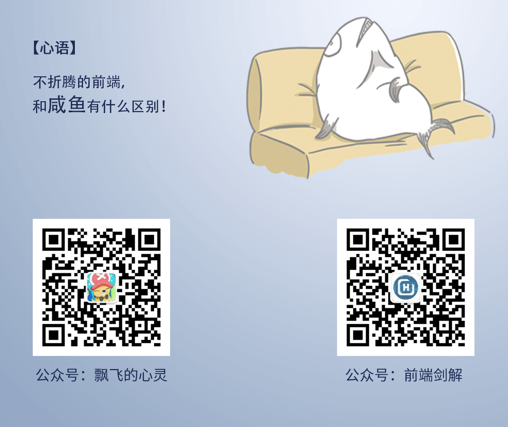

000 - 小黑屋
===

> Create by **jsliang** on **2019-12-26 09:14:42**  
> Recently revised in **2019-12-26 09:29:35**

每个人身上都会有负面情绪，每个人都想做情绪的掌控者，但有些人掌控着掌控着就被反噬了，噫吁嚱，细思极恐……

本文关押着 **jsliang** 的负面情绪，如功力不够，切莫入内！

---

## 2019-12-15

* **背景**：

业务需求【备货时效】中，有一个 Dropdown 下拉菜单。

* **经过**：

1. WIKI 画的很丑。
2. 开发完成后找产品确认了，结果产品不耐烦，说验收会过一遍的，按流程来。
3. 验收完成的时候，有两个小问题，但和这个 Dropdown 无关。
4. 发布前一天，产品突然觉得很丑，要我修改给她。

* **结果**：

直言不讳拒绝了，然后产品直接找前端经理，最后产品经理说他下手给她改。

* **个人观点**：

1. 公司有 UI，如果觉得产品自身和前端自身都没有搞好，可以让 UI 帮忙设计。
2. 部门负责人说过改需求需要走流程，而且总体流程没问题，功能实现没问题，临近发布前一天要改 UI，问题是产品对美观把控也不好。

* **反思**：

前端经理教会我一句：“有时候说话委婉一点呗，不要说不想改，而是说手头上现在在处理事情，可不可以放到后面作为 bug 修复。”

---

## 后记

**很久很久以前，有一个小男孩，打开了自己的小黑屋，记录身边许许多多的事情……**

**很久很久以后，他也不记得自己记录了多少，某天回首发现，一些人，一些事，已是模糊……**

---

**不折腾的前端，和咸鱼有什么区别！**

**jsliang** 会每天更新一道 LeetCode 题解，从而帮助小伙伴们夯实原生 JS 基础，了解与学习算法与数据结构。

**浪子神剑** 会每天更新面试题，以面试题为驱动来带动大家学习，坚持每天学习与思考，每天进步一点！

扫描上方二维码，关注 **jsliang** 的公众号（左）和 **浪子神剑** 的公众号（右），让我们一起折腾！

>  jsliang 的文档库 由 <a xmlns:cc="http://creativecommons.org/ns#" href="https://github.com/LiangJunrong/document-library" property="cc:attributionName" rel="cc:attributionURL">梁峻荣</a> 采用 <a rel="license" href="http://creativecommons.org/licenses/by-nc-sa/4.0/">知识共享 署名-非商业性使用-相同方式共享 4.0 国际 许可协议</a>进行许可。 基于<a xmlns:dct="http://purl.org/dc/terms/" href="https://github.com/LiangJunrong/document-library" rel="dct:source">https://github.com/LiangJunrong/document-library</a>上的作品创作。 本许可协议授权之外的使用权限可以从 <a xmlns:cc="http://creativecommons.org/ns#" href="https://creativecommons.org/licenses/by-nc-sa/2.5/cn/" rel="cc:morePermissions">https://creativecommons.org/licenses/by-nc-sa/2.5/cn/</a> 处获得。