Node 基础
===

> Create by **jsliang** on **2018-11-8 13:42:42**  
> Recently revised in **2018-12-22 14:58:29**

<br>

&emsp;**Hello 小伙伴们，如果觉得本文还不错，记得点个赞或者给个 star，你们的赞和 star 是我编写更多更精彩文章的动力！[GitHub 地址](https://github.com/LiangJunrong/document-library/blob/master/other-library/Node/NodeBase.md)**

<br>

&emsp;**本文重点内容**：

* Node 基础 - 通过对 Node 基础的了解学习，打下 Node 基础
* Node API - 开启服务提供 API 给前端调用
* Node 连接 MySQL - 通过 npm 安装 mysql，从而实现数据库的链接
* Node 实战 - 企业官网从 0 开始，打造能注册、登录以及留言的企业官网
* Node 部署 - 如何通过部署云服务器，让小伙伴们可以查看到你的网站

<br>

&emsp;**本文延伸链接**：

* Node 部署项目、云服务器以及域名的使用：[链接](https://github.com/LiangJunrong/document-library/blob/master/other-library/Website/BuildStation/README.md)
* 本文 Node 基础代码下载地址：[链接](https://github.com/LiangJunrong/Node/tree/FrontEndCodeBase)
* 本文 Node 成品代码下载地址：[链接](https://github.com/LiangJunrong/Node)  

<br>

&emsp;**本文成品演示**：

* Node 项目演示：[jsliang 前端有限公司](http://company.jsliang.top/)


<br>

# <a name="chapter-one" id="chapter-one">一 目录</a>

&emsp;**不折腾的前端，和咸鱼有什么区别**

| 目录 |                                                                             
| --- | 
| [一 目录](#chapter-one) | 
| <a name="catalog-chapter-two" id="catalog-chapter-two"></a>[二 前言](#chapter-two) |
| <a name="catalog-chapter-three" id="catalog-chapter-three"></a>[三 基础学习](#chapter-three) |
| &emsp;<a name="catalog-chapter-three-one" id="catalog-chapter-three-one"></a>[3.1 HTTP - 开始 Node 之旅](#chapter-three-one) |
| &emsp;<a name="catalog-chapter-three-two" id="catalog-chapter-three-two"></a>[3.2 URL 模块](#chapter-three-two) |
| &emsp;<a name="catalog-chapter-three-three" id="catalog-chapter-three-three"></a>[3.3 CommonJS](#chapter-three-three) |
| &emsp;<a name="catalog-chapter-three-four" id="catalog-chapter-three-four"></a>[3.4 包与 npm](#chapter-three-four) |
| &emsp;<a name="catalog-chapter-three-five" id="catalog-chapter-three-five"></a>[3.5 fs 文件管理](#chapter-three-five) |
| &emsp;<a name="catalog-chapter-three-six" id="catalog-chapter-three-six"></a>[3.6 fs 案例](#chapter-three-six) |
| &emsp;<a name="catalog-chapter-three-seven" id="catalog-chapter-three-seven"></a>[3.7 fs 流](#chapter-three-seven) |
| &emsp;<a name="catalog-chapter-three-eight" id="catalog-chapter-three-eight"></a>[3.8 创建 Web 服务器](#chapter-three-eight) |
| &emsp;<a name="catalog-chapter-three-night" id="catalog-chapter-three-night"></a>[3.9 非阻塞 I/O 事件驱动](#chapter-three-night) |
| &emsp;<a name="catalog-chapter-three-ten" id="catalog-chapter-three-ten"></a>[3.10 get 与 post](#chapter-three-ten) |
| &emsp;<a name="catalog-chapter-three-eleven" id="catalog-chapter-three-eleven"></a>[3.11 Node 连接 MySQL](#chapter-three-eleven) |
| <a name="catalog-chapter-four" id="catalog-chapter-four"></a>[四 Web 实战 —— 企业官网](#chapter-four) |
| &emsp;<a name="catalog-chapter-four-one" id="catalog-chapter-four-one"></a>[4.1 编程环境](#chapter-four-one) |
| &emsp;<a name="catalog-chapter-four-two" id="catalog-chapter-four-two"></a>[4.2 后端接口](#chapter-four-two) |
| &emsp;<a name="catalog-chapter-four-three" id="catalog-chapter-four-three"></a>[4.3 注册功能](#chapter-four-three) |
| &emsp;<a name="catalog-chapter-four-four" id="catalog-chapter-four-four"></a>[4.4 登录功能](#chapter-four-four) |
| &emsp;<a name="catalog-chapter-four-five" id="catalog-chapter-four-five"></a>[4.5 留言功能](#chapter-four-five) |
| <a name="catalog-chapter-five" id="catalog-chapter-five"></a>[五 工具整合](#chapter-five) |
| &emsp;<a name="catalog-chapter-five-one" id="catalog-chapter-five-one"></a>[5.1 supervisor - 监听 Node 改动](#chapter-five-one) |
| &emsp;<a name="catalog-chapter-five-two" id="catalog-chapter-five-two"></a>[5.2 PM2 - Node 进程管理](#chapter-five-two) |
| <a name="catalog-chapter-six" id="catalog-chapter-six"></a>[六 参考资料](#chapter-six) |
| <a name="catalog-chapter-seven" id="catalog-chapter-seven"></a>[七 线上部署](#chapter-seven) |
| <a name="catalog-chapter-eight" id="catalog-chapter-eight"></a>[八 归纳总结](#chapter-eight) |

<br>

# <a name="chapter-two" id="chapter-two">二 前言</a>

> [返回目录](#catalog-chapter-two)

<br>

&emsp;本文主要目的：

1. 整合 Node 基础，加深 **jsliang** 对 Node 的学习了解，并且方便日后复习。  
2. 整合 Node 工具，方便查找在 Node 开发中，有哪些工具比较有利于开发。
3. 给初学 Node 的小伙伴做一个参考，如有疑问还请在 QQ 群：`798961601` 中咨询。

<br>

# <a name="chapter-three" id="chapter-three">三 基础</a>

> [返回目录](#catalog-chapter-three)

<br>

&emsp;**万丈高楼平地起，地基还得自己起。**  

<br>

## <a name="chapter-three-one" id="chapter-three-one">3.1 HTTP - 开始 Node 之旅</a>

> [返回目录](#catalog-chapter-three-one)

<br>

&emsp;话不多说，先上代码：

> 01_http.js

```
// 1. 引入 http 模块
var http = require("http");

// 2. 用 http 模块创建服务
/**
 * req 获取 url 信息 (request)
 * res 浏览器返回响应信息 (response)
 */
http.createServer(function (req, res) {
  // 设置 HTTP 头部，状态码是 200，文件类型是 html，字符集是 utf8
  res.writeHead(200, {
    "Content-Type": "text/html;charset=UTF-8"
  });

  // 往页面打印值
  res.write('<h1 style="text-align:center">Hello NodeJS</h1>');

  // 结束响应
  res.end();

}).listen(3000); // 监听的端口
```

<br>

&emsp;那么，上面代码，我们要怎么用呢？

&emsp;**首先**，将上面的代码复制粘贴到 `01_http.js` 中。  
&emsp;**然后**，启动 VS Code 终端：`Ctrl + ~`。  
&emsp;**接着**，输入 `node 01_http.js` 并回车。  
&emsp;**最后**，打开 `localhost:3000`：

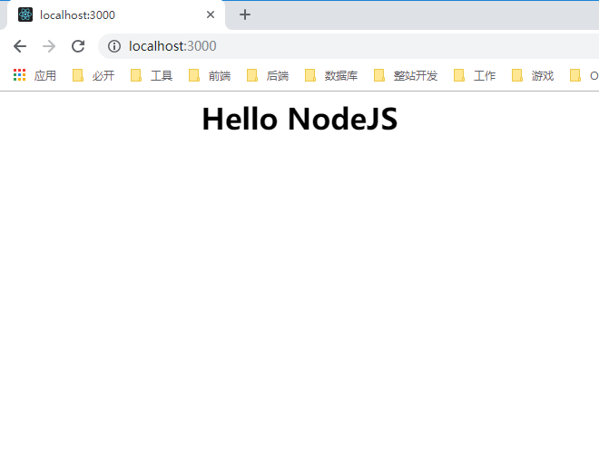

<br>

&emsp;OK，搞定完事，现在我们一一讲解上面代码：

1. **首先**，我们需要先开启仙人模式。哦，不是，是 HTTP 模式。我们都知道，像 PHP 这类老牌子的后端语言，需要 Apache 或者 Nginx 开启 HTTP 服务。然而我们的 Node 不需要：

```
var http = require("http");
```

2. **然后**，开启 HTTP 服务，并设置开启的端口：

```
/**
 * req 获取 url 信息 (request)
 * res 浏览器返回响应信息 (response)
 */
http.createServer(function (req, res) {
  // ... 步骤 3 代码
}).listen(3000); // 监听的端口
```

3. **接着**，我们设置 HTTP 头部，并往页面打印值，最后结束响应：

```
// 设置 HTTP 头部，状态码是 200，文件类型是 html，字符集是 utf8
res.writeHead(200, {
  "Content-Type": "text/html;charset=UTF-8"
});

// 往页面打印值
res.write('<h1 style="text-align:center">Hello NodeJS</h1>');

// 结束响应 
res.end();
```

4. **最后**，我们往浏览器输入 `http://localhost:3000/`，将访问到我们开启的 Node 服务，从而往页面渲染页面。

&emsp;至此，小伙伴们是不是也开启了自己的 Node 之旅？

<br>

## <a name="chapter-three-two" id="chapter-three-two">3.2 URL 模块</a>

> [返回目录](#catalog-chapter-three-two)

<br>

&emsp;URL 模块是什么呢？  
&emsp;我们在控制台（终端）开启 Node 模式，并打印出 `url` 来看一下：

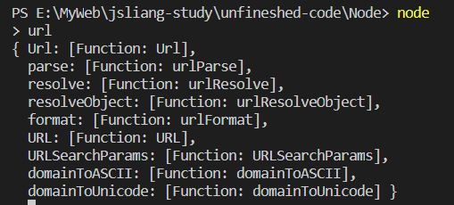

&emsp;好家伙，它有 `Url`、`parse`、`resolve`、`resolveObject`、`format`、`URL`、`URLSearchParams`、`domainToASCII`、`domainToUnicode` 这么多模块。  
&emsp;那么，这些模块都有什么用呢？

&emsp;话不多说，先上代码：

> 02_url.js

```
// 1. 引入 url 模块
var url = require("url");

// 2. 引入 http 模块
var http = require("http");

// 3. 用 http 模块创建服务
/**
 * req 获取 url 信息 (request)
 * res 浏览器返回响应信息 (response)
 */
http.createServer(function (req, res) {

  // 4. 获取服务器请求
  /**
   * 访问地址是：http://localhost:3000/?userName=jsliang&userAge=23
   * 如果你执行 console.log(req.url)，它将执行两次，分别返回下面的信息：
   * /  ?userName=jsliang&userAge=23
   * /  /favicon.ico
   * 这里为了防止重复执行，所以排除 req.url == /favicon.ico 的情况
   */
  if(req.url != "/favicon.ico") {
    
    // 5. 使用 url 的 parse 方法
    /**
     * parse 方法需要两个参数：
     * 第一个参数是地址
     * 第二个参数是 true 的话表示把 get 传值转换成对象
     */ 
    var result = url.parse(req.url, true);
    console.log(result);
    /**
     * Url {
     *   protocol: null,
     *   slashes: null,
     *   auth: null,
     *   host: null,
     *   port: null,
     *   hostname: null,
     *   hash: null,
     *   search: '?userName=jsliang&userAge=23',
     *   query: { userName: 'jsliang', userAge: '23' },
     *   pathname: '/',
     *   path: '/?userName=jsliang&userAge=23',
     *   href: '/?userName=jsliang&userAge=23' }
     */

    console.log(result.query.userName); // jsliang

    console.log(result.query.userAge); // 23
  }

  // 设置 HTTP 头部，状态码是 200，文件类型是 html，字符集是 utf8
  res.writeHead(200, {
    "Content-Type": "text/html;charset=UTF-8"
  });

  // 往页面打印值
  res.write('<h1 style="text-align:center">Hello NodeJS</h1>');

  // 结束响应
  res.end();

}).listen(3000);
```

<br>

&emsp;在上面的代码中：

&emsp;**首先**，我们引入该章节的主角 `url` 模块：

```
// 1. 引入 url 模块
var url = require("url");
```

&emsp;**然后**，我们引入 `http` 模块：

```
// 2. 引入 http 模块
var http = require("http");
```

&emsp;**接着**，我们创建 `http` 模块，因为 `url` 的监听，需要 `http` 模块的开启：

```
// 3. 用 http 模块创建服务
/**
 * req 获取 url 信息 (request)
 * res 浏览器返回响应信息 (response)
 */
http.createServer(function (req, res) {
  // ... 第 4 步、第 5 步代码

  // 设置 HTTP 头部，状态码是 200，文件类型是 html，字符集是 utf8
  res.writeHead(200, {
    "Content-Type": "text/html;charset=UTF-8"
  });

  // 往页面打印值
  res.write('<h1 style="text-align:center">Hello NodeJS</h1>');

  // 结束响应
  res.end();
}).listen(3000);
```

&emsp;**最后**，我们访问我们给出的地址：`http://localhost:3000/?userName=jsliang&userAge=23`，并通过它查看 `url` 的 `parse` 模块怎么用，输出啥：

```
// 4. 获取服务器请求
/**
  * 访问地址是：http://localhost:3000/?userName=jsliang&userAge=23
  * 如果你执行 console.log(req.url)，它将执行两次，分别返回下面的信息：
  * /  ?userName=jsliang&userAge=23
  * /  /favicon.ico
  * 这里为了防止重复执行，所以排除 req.url == /favicon.ico 的情况
  */
if(req.url != "/favicon.ico") {
  
  // 5. 使用 url 的 parse 方法
  /**
    * parse 方法需要两个参数：
    * 第一个参数是地址
    * 第二个参数是 true 的话表示把 get 传值转换成对象
    */ 
  var result = url.parse(req.url, true);
  console.log(result);
  /**
    * Url {
    *   protocol: null,
    *   slashes: null,
    *   auth: null,
    *   host: null,
    *   port: null,
    *   hostname: null,
    *   hash: null,
    *   search: '?userName=jsliang&userAge=23',
    *   query: { userName: 'jsliang', userAge: '23' },
    *   pathname: '/',
    *   path: '/?userName=jsliang&userAge=23',
    *   href: '/?userName=jsliang&userAge=23' }
    */

  console.log(result.query.userName); // jsliang

  console.log(result.query.userAge); // 23
}
```

&emsp;从中，我们可以看出，我们可以通过 `query`，获取到我们想要的路径字段。

<br>

&emsp;当然，上面只讲解了 `parse` 的用法，我们可以将上面代码中 `if` 语句里面的代码全部清空。然后，输入下面的内容，去学习 `url` 模块更多的内容：

1. url 模块所有内容：

```
console.log(url);

/**
 * Console：
 { 
   Url: [Function: Url],
    parse: [Function: urlParse], // 获取地址信息
    resolve: [Function: urlResolve], // 追加或者替换地址
    resolveObject: [Function: urlResolveObject],
    format: [Function: urlFormat], // 逆向 parse，根据地址信息获取原 url 信息
    URL: [Function: URL],
    URLSearchParams: [Function: URLSearchParams],
    domainToASCII: [Function: domainToASCII],
    domainToUnicode: [Function: domainToUnicode] 
  }
 */
```

<br>

2. parse 如何使用

```
console.log(url.parse("http://www.baidu.com"));
/**
 * Console：
  Url {
    protocol: 'http:',
    slashes: true,
    auth: null,
    host: 'www.baidu.com',
    port: null,
    hostname: 'www.baidu.com',
    hash: null,
    search: null,
    query: null,
    pathname: '/',
    path: '/',
    href: 'http://www.baidu.com/' 
  }
 */
```

<br>

3. parse 带参数：

```
console.log(url.parse("http://www.baidu.com/new?name=zhangsan"));

/**
 * Console：
  Url {
    protocol: 'http:',
    slashes: true,
    auth: null,
    host: 'www.baidu.com',
    port: null,
    hostname: 'www.baidu.com',
    hash: null,
    search: '?name=zhangsan',
    query: 'name=zhangsan',
    pathname: '/new',
    path: '/new?name=zhangsan',
    href: 'http://www.baidu.com/new?name=zhangsan' 
  }
 */
```

<br>

4. `format` 的使用：

```
console.log(url.format({
  protocol: 'http:',
  slashes: true,
  auth: null,
  host: 'www.baidu.com',
  port: null,
  hostname: 'www.baidu.com',
  hash: null,
  search: '?name=zhangsan',
  query: 'name=zhangsan',
  pathname: '/new',
  path: '/new?name=zhangsan',
  href: 'http://www.baidu.com/new?name=zhangsan' 
}))

// Console：
// http://www.baidu.com/new?name=zhangsan
```

<br>

5. `resolve` 的使用：

```
console.log(url.resolve("http://www.baidu.com/jsliang", "梁峻荣"));

// Console：
// http://www.baidu.com/梁峻荣
```

&emsp;当然，`url` 这里我们只讲解了个入门，更多的还请看官网 API：[url | Node.js v10.14.1 文档](http://nodejs.cn/api/url.html#url_class_url)

<br>

## <a name="chapter-three-three" id="chapter-three-three">3.3 CommonJS</a>

> [返回目录](#catalog-chapter-three-three)

<br>

* 什么是 CommonJS？

&emsp;CommonJS 就是为 JS 的表现来制定规范，因为 JS 没有模块系统、标准库较少、缺乏包管理工具，所以 CommonJS 应运而生，它希望 JS 可以在任何地方运行，而不只是在浏览器中，从而达到 Java、C#、PHP 这些后端语言具备开发大型应用的能力。

<br>

* CommonJS 的应用？

1. 服务器端 JavaScript 应用程序。（Node.js）
2. 命令行工具
3. 桌面图形界面应用程序。

<br>

* CommonJS 与 Node.js 的关系？

&emsp;CommonJS 就是模块化的标准，Node.js 就是 CommonJS（模块化）的实现。

<br>

* Node.js 中的模块化？

1. 在 Node 中，模块分为两类：一是 Node 提供的模块，称为核心模块；二是用户编写的模块，成为文件模块。核心模块在 Node 源代码的编译过程中，编译进了二进制执行文件，所以它的加载速度是最快的，例如：HTTP 模块、URL 模块、FS 模块；文件模块是在运行时动态加载的，需要完整的路劲分析、文件定位、编译执行过程等……所以它的速度相对核心模块来说会更慢一些。
2. 我们可以将公共的功能抽离出一个单独的 JS 文件存放，然后在需要的情况下，通过 exports 或者 module.exports 将模块导出，并通过 require 引入这些模块。

<br>

&emsp;现在，我们通过三种使用方式，来讲解下 Node 中的模块化及 exports/require 的使用。

&emsp;我们先查看下目录：

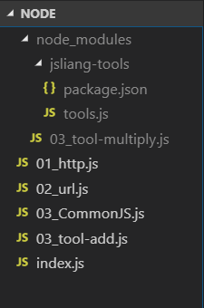

<br>

&emsp;**方法一**：

&emsp;首先，我们新建 `03_CommonJS.js`、`03_tool-add.js`、`node_modules/03_tool-multiply.js`、`node_modules/jsliang-module/tools.js` 这 4 个文件/文件夹。  
&emsp;其中 `package.json` 我们暂且不理会，稍后会讲解它如何自动生成。

&emsp;在 `03_tool-add.js` 中：

> 03_tool-add.js

```
// 1. 假设我们文件其中有个工具模块
var tools = {
  add: (...numbers) => {
    let sum = 0;
    for (let number in numbers) {
      sum += numbers[number];
    }
    return sum;
  }
}

/**
 * 2. 暴露模块
 * exports.str = str;
 * module.exports = str;
 * 区别：
 * module.exports 是真正的接口
 * exports 是一个辅助工具
 * 如果 module.exports 为空，那么所有的 exports 收集到的属性和方法，都赋值给了 module.exports
 * 如果 module.exports 具有任何属性和方法，则 exports 会被忽略
 */

// exports 使用方法
// var str = "jsliang is very good!";
// exports.str = str; // { str: 'jsliang is very good!' }

// module.exports 使用方法
module.exports = tools;
```

<br>

&emsp;那么，上面的代码有啥含义呢？  
&emsp;第一步，我们定义了个工具库 `tools`。  
&emsp;第二步，我们通过 `modules.exports` 将 `tools` 进行了导出。  
&emsp;所以，我们在 `03_CommonJS.js` 可以通过 `require` 导入使用：

```
var http = require("http");

var tools1 = require('./03_tool-add');

http.createServer(function (req, res) {

  res.writeHead(200, {
    "Content-Type": "text/html;charset=UTF-8"
  });

  res.write('<h1 style="text-align:center">Hello NodeJS</h1>');
  
  console.log(tools1.add(1, 2, 3));
  /**
   * Console：
   * 6
   * 6
   * 这里要记得 Node 运行过程中，它请求了两次，
   * http://localhost:3000/ 为一次，
   * http://localhost:3000/favicon.ico 为第二次
   */
  
  res.end();

}).listen(3000);
```

<br>

&emsp;这样，我们就完成了 `exports` 与 `require` 的初次使用。

<br>

&emsp;**方法二**：

&emsp;当我们模块文件过多的时候，应该需要有个存放这些模块的目录，Node 就很靠谱，它规范我们可以将这些文件都放在 `node_modules` 目录中（大家都放在这个目录上，就不会有其他乱七八糟的命名了）。  

&emsp;所以，我们在 `node_modules` 中新建一个 `03_tool-multiply.js` 文件，其内容如下：

> 03_tool-multiply.js

```
var tools = {
  multiply: (...numbers) => {
    let sum = numbers[0];
    for (let number in numbers) {
      sum = sum * numbers[number];
    }
    return sum;
  }
}

module.exports = tools;
```

&emsp;在引用方面，我们只需要通过：
```
// 如果 Node 在当前目录没找到 tool.js 文件，则会去 node_modules 里面去查找
var tools2 = require('03_tool-multiply');

console.log(tools2.multiply(1, 2, 3, 4));
```

&emsp;这样，就可以成功导入 `03_tool-multiply.js` 文件了。

<br>

&emsp;**方法三**：

&emsp;如果全部单个文件丢在 `node_modules` 上，它会显得杂乱无章，所以我们应该定义个自己的模块：`jsliang-module`，然后将我们的 `tools.js` 存放在该目录中：

> jsliang-module/tools.js

```
var tools = {
  add: (...numbers) => {
    let sum = 0;
    for (let number in numbers) {
      sum += numbers[number];
    }
    return sum;
  },
  multiply: (...numbers) => {
    let sum = numbers[0];
    for (let number in numbers) {
      sum = sum * numbers[number];
    }
    return sum;
  }
}

module.exports = tools;
```

<br>

&emsp;这样，我们就定义好了自己的工具库。  
&emsp;但是，如果我们通过 `var tools3 = require('jsliang-module');` 去导入，会发现它报 `error` 了，所以，我们应该在 `jsliang-module` 目录下，通过下面命令行生成一个 `package.json`

> PS E:\MyWeb\node_modules\jsliang-module> npm init --yes

&emsp;这样，在 `jsliang-module` 中就有了 `package.json`。  
&emsp;而我们在 `03_CommonJS.js` 就可以引用它了：

> 03_CommonJS.js

```
var http = require("http");

var tools1 = require('./03_tool-add');

// 如果 Node 在当前目录没找到 tool.js 文件，则会去 node_modules 里面去查找
var tools2 = require('03_tool-multiply');

/**
 * 通过 package.json 来引用文件
 * 1. 通过在 jsliang-module 中 npm init --yes 来生成 package.json 文件
 * 2. package.json 文件中告诉了程序入口文件为 ："main": "tools.js",
 * 3. Node 通过 require 查找 jsliang-module，发现它有个 package.json
 * 4. Node 执行 tools.js 文件
 */
var tools3 = require('jsliang-module');

http.createServer(function (req, res) {

  res.writeHead(200, {
    "Content-Type": "text/html;charset=UTF-8"
  });

  res.write('<h1 style="text-align:center">Hello NodeJS</h1>');
  
  console.log(tools1.add(1, 2, 3));
  console.log(tools2.multiply(1, 2, 3, 4));
  console.log(tools3.add(4, 5, 6));
  /**
   * Console：
   * 6
   * 24
   * 15
   * 6
   * 24
   * 15
   * 这里要记得 Node 运行过程中，它请求了两次，
   * http://localhost:3000/ 为一次，
   * http://localhost:3000/favicon.ico 为第二次
   */
  
  res.end();

}).listen(3000);
```

<br>

&emsp;到此，我们就通过三种方法，了解了各种 `exports` 和 `require` 的姿势以及 Node 模块化的概念啦~

<br>

&emsp;参考文献：

* [CommonJS 规范 | 博客园 - Little Bird](https://www.cnblogs.com/littlebirdlbw/p/5670633.html)
* [js模块化编程之彻底弄懂CommonJS和AMD/CMD！ | 博客园 - 方便以后复习](http://www.cnblogs.com/chenguangliang/p/5856701.html)
* [[js高手之路] es6系列教程 - 不定参数与展开运算符(...) | 博客园 - ghostwu](https://www.cnblogs.com/ghostwu/p/7298462.html)

<br>

## <a name="chapter-three-four" id="chapter-three-four">3.4 包与 npm</a>

> [返回目录](#catalog-chapter-three-four)

<br>

&emsp;Node 中除了它自己提供的核心模块之外，还可以自定义模块，以及使用 **第三方模块**。  
&emsp;Node 中第三方模块由包组成，可以通过包来对一组具有相互依赖关系的模块进行统一管理。

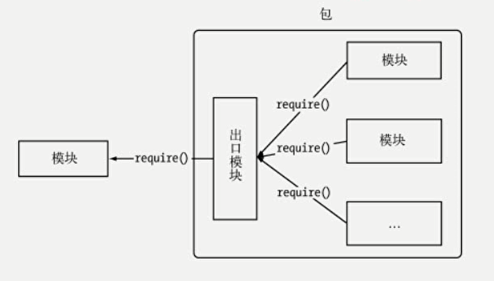

&emsp;那么，假如我们需要使用一些第三方模块，应该去哪找呢？

1. [百度](https://www.baidu.com)。百度查找你需要安装的第三方模块的对应内容。
2. [npm 官网](https://www.npmjs.com/)。如果你已经知道包的名字或者包的作用。那么，直接在 npm 官网上搜索，想必会更快找到想要安装的包。

&emsp;那么，npm 是啥？  
&emsp;npm 是世界上最大的开放源代码的生态系统。我们可以通过 npm 下载各种各样的包。  
&emsp;在我们安装 Node 的时候，它默认会顺带给你安装 npm。

* `npm -v`：查看 npm 版本。
* `npm list`：查看当前目录下都安装了哪些 npm 包。
* `npm info 模块`：查看该模块的版本及内容。
* `npm i 模块@版本号`：安装该模块的指定版本。

&emsp;在平时使用 npm 安装包的过程中，你可能需要知道一些 npm 基本知识：

* `i`/`install`：安装。使用 `install` 或者它的简写 `i`，都表明你想要下载这个包。
* `uninstall`：卸载。如果你发现这个模块你已经不使用了，那么可以通过 `uninstall` 卸载它。
* `g`：全局安装。表明这个包将安装到你的计算机中，你可以在计算机任何一个位置使用它。
* `--save`/`-S`：通过该种方式安装的包的名称及版本号会出现在 `package.json` 中的 `dependencies` 中。`dependencies` 是需要发布在生成环境的。例如：`ElementUI` 是部署后还需要的，所以通过 `-S` 形式来安装。
* `--save-dev`/`-D`：通过该种方式安装的包的名称及版本号会出现在 `package.json` 中的 `devDependencies` 中。`devDependencies` 只在开发环境使用。例如：`gulp` 只是用来压缩代码、打包的工具，程序运行时并不需要，所以通过 `-D` 形式来安装。

&emsp;例子：

* `cnpm i webpack-cli -D`
* `npm install element-ui -S`

&emsp;那么，这么多的 npm 包，我们通过什么管理呢？  
&emsp;答案是 `package.json`。  
&emsp;如果我们需要创建 `package.json`，那么我们只需要在指定的包管理目录（例如 `node_modules`）中通过以下命名进行生成：

* `npm init`：按步骤创建 `package.json`。
* `npm init --yes`：快速创建 `package.json`

&emsp;当然，因为国内网络环境的原因，有些时候通过 npm 下载包，可能会很慢或者直接卡断，这时候就要安装淘宝的 npm 镜像：cnpm

* `npm install -g cnpm --registry=https://registry.npm.taobao.org`

<br>

## <a name="chapter-three-five" id="chapter-three-five">3.5 fs 文件管理</a>

> [返回目录](#catalog-chapter-three-five)

<br>

&emsp;本章节我们讲解下 fs 文件管理：

> 如需快速找到下面某个内容，请使用 `Ctrl + F`

1. `fs.stat` 检测是文件还是目录
2. `fs.mkdir` 创建目录
3. `fs.writeFile` 创建写入文件
4. `fs.appendFile` 追加文件
5. `fs.readFile` 读取文件
6. `fs.readdir` 读取目录
7. `fs.rename` 重命名
8. `fs.rmdir` 删除目录
9. `fs.unlink` 删除文件

<br>

> 此章节文件目录：

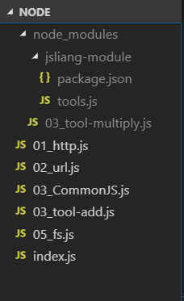

&emsp;**首先**，我们通过 `fs.stat` 检查一个读取的是文件还是目录：

> 05_fs.js

```
//  1. fs.stat
let fs = require('fs');
fs.stat('index.js', (error, stats) => {
  if(error) {
    console.log(error);
    return false;
  } else {
    console.log(stats);
    /**
     * Console：
     * Stats {
     *  dev: 886875,
     *  mode: 33206,
     *  nlink: 1,
     *  uid: 0,
     *  gid: 0,
     *  rdev: 0,
     *  blksize: undefined,
     *  ino: 844424931461390,
     *  size: 284,
     *  blocks: undefined,
     *  atimeMs: 1542847157494,
     *  mtimeMs: 1543887546361.2158,
     *  ctimeMs: 1543887546361.2158,
     *  birthtimeMs: 1542847157493.663,
     *  atime: 2018-11-22T00:39:17.494Z,
     *  mtime: 2018-12-04T01:39:06.361Z,
     *  ctime: 2018-12-04T01:39:06.361Z,
     *  birthtime: 2018-11-22T00:39:17.494Z }
     */

    console.log(`文件：${stats.isFile()}`); 
    // Console：文件：true
    
    console.log(`目录：${stats.isDirectory()}`); 
    // Console：目录：false

    return false;
  }
})
```

&emsp;通过 `Console` 打印出来的信息，我们基础掌握了 `fs.stat` 的作用。

<br>

&emsp;**然后**，我们尝试通过 `fs.mkdir` 创建目录：

> 05_fs.js

```
//  2. fs.mkdir
let fs = require('fs');

/**
 * 接收参数
 * path - 将创建的目录路径
 * mode - 目录权限（读写权限），默认 0777
 * callback - 回调，传递异常参数 err
 */
fs.mkdir('css', (err) => {
  if(err) {
    console.log(err);
    return false;
  } else {
    console.log("创建目录成功！");
    // Console：创建目录成功！
  }
})
```

&emsp;通过 `node 05_fs.js`，我们发现目录中多了一个 `css` 文件夹。

<br>

&emsp;**那么**，有创建就有删除，创建的目录如何删除呢？这里讲解下 `fs.rmdir`：

> 05_fs.js

```
//  8. fs.rmdir
let fs = require('fs');

/**
 * 接收参数
 * path - 将创建的目录路径
 * mode - 目录权限（读写权限），默认 0777
 * callback - 回调，传递异常参数 err
 */
fs.rmdir('css', (err) => {
  if(err) {
    console.log(err);
    return false;
  } else {
    console.log("创建目录成功！");
    // Console：创建目录成功！
  }
})
```

&emsp;通过 `node 05_fs.js`，我们发现目录中的 `css` 文件夹被删除了。

<br>

&emsp;**接着**，我们通过 `fs.writeFile` 来创建写入文件：

> 05_fs.js

```
//  3. fs.writeFile
let fs = require('fs');

/**
 * filename (String) 文件名称
 * data (String | Buffer) 将要写入的内容，可以是字符串或者 buffer 数据。
 * · encoding (String) 可选。默认 'utf-8'，当 data 是 buffer 时，该值应该为 ignored。
 * · mode (Number) 文件读写权限，默认 438。
 * · flag (String) 默认值 'w'。
 * callback { Function } 回调，传递一个异常参数 err。
 */
fs.writeFile('index.js', 'Hello jsliang', (err) => {
  if(err) {
    console.log(err);
    return false;
  } else {
    console.log('写入成功！');
  }
})
```

&emsp;值得注意的是，这样的写入，是清空原文件中的所有数据，然后添加 `Hello jsliang` 这句话。即：存在即覆盖，不存在即创建。  

&emsp;有创建就有删除，感兴趣的可以使用 `fs.unlink` 进行文件的删除，再次不做过多讲解。

<br>

&emsp;**既然**，上面的是覆盖文件，那么有没有追加文件呢？有的，使用 `fs.appendFile` 吧：

> 05_fs.js

```
//  4. fs.appendFile
let fs = require('fs');

fs.appendFile('index.js', '这段文本是要追加的内容', (err) => {
  if(err) {
    console.log(err);
    return false;
  } else {
    console.log("追加成功");
  }
})
```

&emsp;这样，我们就成功往里面追加了一段话，从而使 `index.js` 变成了：

> index.js

```
Hello jsliang这段文本是要追加的内容
```

<br>

&emsp;**在上面**，我们已经做了：新增、修改、删除操作。那么小伙伴一定很熟悉下一步骤是做什么了：  

* `fs.readFile` 读取文件
* `fs.readdir` 读取目录

> 05_fs.js

```
let fs = require('fs');

// 5. fs.readFile
fs.readFile('index.js', (err, data) => {
  if(err) {
    console.log(err);
    return false;
  } else {
    console.log("读取文件成功！");
    console.log(data);
    // Console：
    // 读取文件成功！
    // <Buffer 48 65 6c 6c 6f 20 6a 73 6c 69 61 6e 67 e8 bf 99 e6 ae b5 e6 96 87 e6 9c ac e6 98 af e8 a6 81 e8 bf bd e5 8a a0 e7 9a 84 e5 86 85 e5 ae b9>
  }
})

// 6. fs.readdir 读取目录
fs.readdir('node_modules', (err, data) => {
  if(err) {
    console.log(err);
    return false;
  } else {
    console.log("读取目录成功！");
    console.log(data);
    // Console：
    // 读取目录成功！
    // [ '03_tool-multiply.js', 'jsliang-module' ]
  }
})
```

&emsp;如上，我们成功做到了读取文件和读取目录。  

&emsp;**最后**，我们再回顾一开始的目标：

~~1. `fs.stat` 检测是文件还是目录~~  
~~2. `fs.mkdir` 创建目录~~  
~~3. `fs.writeFile` 创建写入文件~~  
~~4. `fs.appendFile` 追加文件~~  
~~5. `fs.readFile` 读取文件~~  
~~6. `fs.readdir` 读取目录~~  
7. `fs.rename` 重命名  
~~8. `fs.rmdir` 删除目录~~  
~~9. `fs.unlink` 删除文件~~

&emsp;很好，我们就剩下重命名了：

> 05_fs.js

```
let fs = require('fs');

// 7. fs.rename 重命名
fs.rename('index.js', 'jsliang.js', (err) => {
  if(err) {
    console.log(err);
    return false;
  } else {
    console.log("重命名成功！");
  }
})
```

&emsp;当然，如果 `fs.rename` 还有更劲爆的功能：剪切

> 05_fs.js

```
let fs = require('fs');

// 7. fs.rename 重命名
fs.rename('jsliang.js', 'node_modules/jsliang.js', (err) => {
  if(err) {
    console.log(err);
    return false;
  } else {
    console.log("剪切成功！");
  }
})
```

&emsp;OK，通通搞定，现在目录变成了：

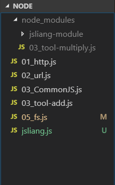

<br>

## <a name="chapter-three-six" id="chapter-three-six">3.6 fs 案例</a>

> [返回目录](#catalog-chapter-three-six)

<br>

&emsp;在上一章节中，我们了解了 `fs` 的文件管理。  
&emsp;那么，在这里，我们尝试使用 `fs` 做点小事情：

> 06_fsDemo.js

```
/**
 * 1. fs.stat 检测是文件还是目录
 * 2. fs.mkdir 创建目录
 * 3. fs.writeFile 创建写入文件
 * 4. fs.appendFile 追加文件
 * 5. fs.readFile 读取文件
 * 6. fs.readdir 读取目录
 * 7. fs.rename 重命名
 * 8. fs.rmdir 删除目录
 * 9. fs.unlink 删除文件
 */

// 1. 判断服务器上面有没有 upload 目录，没有就创建这个目录
// 2. 找出 html 目录下面的所有的目录，然后打印出来

let fs = require('fs');

// 图片上传
fs.stat('upload', (err, stats) => {
  // 判断有没有 upload 目录
  if(err) {
    // 如果没有
    fs.mkdir('upload', (error) => {
      if(error) {
        console.log(error);
        return false;
      } else {
        console.log("创建 upload 目录成功！");
      }
    })
  } else {
    // 如果有
    console.log(stats.isDirectory());
    console.log("有 upload 目录，你可以做更多操作！");
  }
})

// 读取目录全部文件
fs.readdir('node_modules', (err, files) => {
  if(err) {
    console.log(err);
    return false;
  } else {
    // 判断是目录还是文件夹
    console.log(files);

    let filesArr = [];

    (function getFile(i) {
      
      // 循环结束
      if(i == files.length) {
        // 打印出所有目录
        console.log("目录：");
        console.log(filesArr);
        return false;
      }

      // 判断目录是文件还是文件夹
      fs.stat('node_modules/' + files[i], (error, stats) => {

        if(stats.isDirectory()) {
          filesArr.push(files[i]);
        }

        // 递归调用
        getFile(i+1);
        
      })
    })(0)
  }
})
```

<br>

## <a name="chapter-three-seven" id="chapter-three-seven">3.7 fs 流</a>

> [返回目录](#catalog-chapter-three-seven)

<br>

&emsp;话不多说，我们了解下 `fs` 流及其读取：

```
// 新建 fs
const fs = require('fs');
// 流的方式读取文件
let fileReadStream = fs.createReadStream('index.js');
// 读取次数
let count = 0;
// 保存数据
let str = '';
// 开始读取
fileReadStream.on('data', (chunk) => {
  console.log(`${++count} 接收到：${chunk.length}`);
  // Console：1 接收到：30
  str += chunk;
})
// 读取完成
fileReadStream.on('end', () => {
  console.log("——结束——");
  console.log(count);
  console.log(str);

  // Console：——结束——
  // 1
  // console.log("Hello World！");
})
// 读取失败
fileReadStream.on('error', (error) => {
  console.log(error);
})
```

<br>

&emsp;在这里，我们通过 `fs` 模块的 `createReadStream` 创建了读取流，然后读取文件 `index.js`，从而最后在控制台输出了：

```
1 接收到：259
——结束——
1
console.log("尽信书，不如无书；尽看代码，不如删掉这些文件。");
console.log("尽信书，不如无书；尽看代码，不如删掉这些文件。");
console.log("尽信书，不如无书；尽看代码，不如删掉这些文件。");
```

<br>

&emsp;其中 `console.log()` 那三行就是 `index.js` 的文本内容。

<br>

&emsp;然后，我们试下流的存入：

```
let fs = require('fs');
let data = 'console.log("Hello World! 我要存入数据！")';

// 创建一个可以写入的流，写入到文件 index.js 中
let writeStream = fs.createWriteStream('index.js');
// 开始写入
writeStream.write(data, 'utf8');
// 写入完成
writeStream.end();
writeStream.on('finish', () => {
  console.log('写入完成！');
  // Console：写入完成
});
```

&emsp;我们打开 `index.js`，会发现里面的内容变成了 `console.log("Hello World! 我要存入数据！")`，依次，我们通过流的形式进行了读取和写入的操作。

<br>

## <a name="chapter-three-eight" id="chapter-three-eight">3.8 创建 Web 服务器</a>

> [返回目录](#catalog-chapter-three-eight)

<br>

&emsp;在这里，我们利用 http 模块、url 模块、path 模块、fs 模块创建一个 Web 服务器。

&emsp;什么是 Web 服务器？  
&emsp;Web 服务器一般指网站服务器，是指驻留于因特网上某种类型计算机的程序，可以像浏览器等 Web 客户端提供文档，也可以放置网站文件，让全世界浏览；可以放置数据文件，让全世界下载。目前最主流的三个 Web 服务器是 Apache、Nginx、IIS。

&emsp;下面，我们使用 Node 来创建一个 Web 服务：

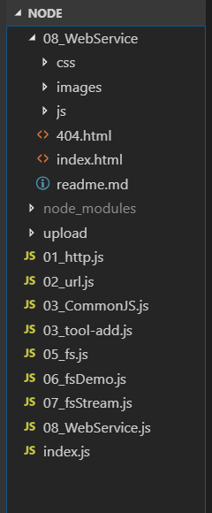

<br>

> 08_WebService.js

```
// 引入 http 模块
let http = require("http");

// 引入 fs 模块
let fs = require("fs");

http.createServer((req, res) => {
  // 获取响应路径
  let pathName = req.url;

  // 默认加载路径
  if (pathName == "/") {
    // 默认加载的首页
    pathName = "index.html";
  }

  // 过滤 /favicon.ico 的请求
  if (pathName != "/favicon.ico") {
    // 获取 08_WebService 下的 index.html
    fs.readFile("./08_WebService/" + pathName, (err, data) => {
      if (err) {
        
        // 如果不存在这个文件
        
        console.log("404 Not Found!");
        fs.readFile('./08_WebService/404.html', (errorNotFound, dataNotFound) => {
          if(errorNotFound) {
            console.log(errorNotFound);
          } else {
            res.writeHead(200, {
              "Content-Type": "text/html; charset='utf-8'"
            });
            // 读取写入文件
            res.write(dataNotFound);
            // 结束响应
            res.end();
          }
        })
        return;
      } else {

        // 返回这个文件
        
        // 设置请求头
        res.writeHead(200, {
          "Content-Type": "text/html; charset='utf-8'"
        });
        // 读取写入文件
        res.write(data);
        // 结束响应
        res.end();
      }
    });
  }
}).listen(8080);
```

<br>

&emsp;这样，我们在浏览器输入 `localhost:8080` 即可以看到：


<br>

&emsp;好家伙，感情它就加载了整个 `index.html` 文件，连 CSS 这些没引入么？  
&emsp;所以，下一步，我们要动态加载 `html`、`css` 以及 `js`：

> 08_WebService.js

```
// 引入 http 模块
let http = require("http");

// 引入 fs 模块
let fs = require("fs");

// 引入 url 模块
let url = require("url");

// 引入 path 模块
let path = require("path");

http.createServer((req, res) => {
  
  // 获取响应路径
  let pathName = url.parse(req.url).pathname;

  // 默认加载路径
  if (pathName == "/") {
    // 默认加载的首页
    pathName = "index.html";
  }

  // 获取文件的后缀名
  let extName = path.extname(pathName);

  // 过滤 /favicon.ico 的请求
  if (pathName != "/favicon.ico") {
    // 获取 08_WebService 下的 index.html
    fs.readFile("./08_WebService/" + pathName, (err, data) => {
      // 如果不存在这个文件
      if (err) {
        console.log("404 Not Found!");
        fs.readFile(
          "./08_WebService/404.html",
          (errorNotFound, dataNotFound) => {
            if (errorNotFound) {
              console.log(errorNotFound);
            } else {
              res.writeHead(200, {
                "Content-Type": "text/html; charset='utf-8'"
              });
              // 读取写入文件
              res.write(dataNotFound);
              // 结束响应
              res.end();
            }
          }
        );
        return;
      }
      // 返回这个文件
      else {
        // 获取文件类型
        let ext = getExt(extName);

        // 设置请求头
        res.writeHead(200, {
          "Content-Type": ext + "; charset='utf-8'"
        });
        // 读取写入文件
        res.write(data);
        // 结束响应
        res.end();
      }
    });
  }
}).listen(8080);

// 获取后缀名
getExt = (extName) => {
  switch(extName) {
    case '.html': return 'text/html';
    case '.css': return 'text/css';
    case '.js': return 'text/js';
    default: return 'text/html';
  }
}
```

<br>

&emsp;这样，当我们再次请求的时候，浏览器就变成了：


<br>

&emsp;当然，在上面，我们仅仅模拟了 `html`、`css`、`js` 这三种文件类型而已，我们需要模拟更多的文件类型：

>[ 08_ext.json](https://github.com/LiangJunrong/Node/blob/master/NodeBase/08_ext.json)

```
 代码详情请点击上面的链接
```

<br>

&emsp;在上面的 `json` 文件中，我们定义了各种的文件类型，此刻文件目录如下所示：

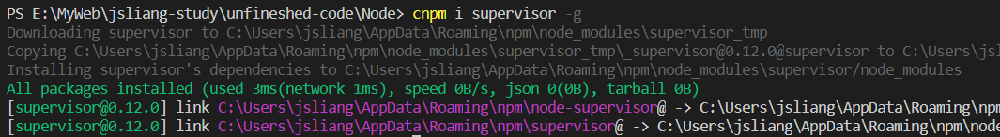

&emsp;这时候，我们需要修改下我们的 `js` 文件，让它适应多种请求响应了：

> 08_WebService.js

```
// 引入 http 模块
let http = require("http");

// 引入 fs 模块
let fs = require("fs");

// 引入 url 模块
let url = require("url");

// 引入 path 模块
let path = require("path");

http.createServer((req, res) => {
  
  // 获取响应路径
  let pathName = url.parse(req.url).pathname;

  // 默认加载路径
  if (pathName == "/") {
    // 默认加载的首页
    pathName = "index.html";
  }

  // 获取文件的后缀名
  let extName = path.extname(pathName);

  // 过滤 /favicon.ico 的请求
  if (pathName != "/favicon.ico") {
    // 获取 08_WebService 下的 index.html
    fs.readFile("./08_WebService/" + pathName, (err, data) => {
      // 如果不存在这个文件
      if (err) {
        console.log("404 Not Found!");
        fs.readFile(
          "./08_WebService/404.html",
          (errorNotFound, dataNotFound) => {
            if (errorNotFound) {
              console.log(errorNotFound);
            } else {
              res.writeHead(200, {
                "Content-Type": "text/html; charset='utf-8'"
              });
              // 读取写入文件
              res.write(dataNotFound);
              // 结束响应
              res.end();
            }
          }
        );
        return;
      }
      // 返回这个文件
      else {
        // 获取文件类型
        let ext = getExt(extName);
        console.log(ext);

        // 设置请求头
        res.writeHead(200, {
          "Content-Type": ext + "; charset='utf-8'"
        });
        // 读取写入文件
        res.write(data);
        // 结束响应
        res.end();
      }
    });
  }
}).listen(8080);

// 获取后缀名
getExt = (extName) => {
  // readFile 是异步操作，所以需要使用 readFileSync
  let data = fs.readFileSync('./08_ext.json');
  let ext = JSON.parse(data.toString());
  return ext[extName];
}
```

<br>

&emsp;如此，我们做了个简单的 Web 服务器。

<br>

## <a name="chapter-three-night" id="chapter-three-night">3.9 非阻塞 I/O 事件驱动</a>

> [返回目录](#catalog-chapter-three-night)

<br>

&emsp;Java、PHP 或者 .NET 等服务端语言，会为每一个客户端的连接创建一个新的线程。  
&emsp;Node 不会为每一个客户连接创建一个新的线程，而仅仅使用一个线程。  
&emsp;当有用户连接了，就会触发一个内部事件，通过非租塞 I/O、事件驱动机制，让 Node 程序宏观上也是并行的。  
&emsp;使用 Node，一个 8GB 内存的服务器，可以同时处理超过 4 万用户的连接。

&emsp;在这一章节中，主要解决：

1. Node 的非阻塞 I/O 是什么？
2. Node events 模块是什么？

&emsp;首先，在我们正常编程中，我们是希望程序能够一行一行按照我们的意愿编写的：

> 09_io.js

```
console.log("1");

console.log("2");

console.log("3");

/**
 * Console：
 * 1
 * 2
 * 3
 */
```

<br>

&emsp;但是，事与愿违。  
&emsp;我们有时候，会执行一些异步方法（函数）：

> 09_io.js

```
console.log("1");

// console.log("2");
let fs = require('fs');
getExt = () => {
  fs.readFile('08_ext.json', (err, data) => {
    console.log("2");
  })
}
getExt();

console.log("3");

/**
 * Console：
 * 1
 * 3
 * 2
 */
```

<br>

&emsp;在上面代码中，由于 `fs.readFile` 是 Node 的异步函数。所以，程序先执行了 1 和 3，最后才执行 `fs.readFile` 的 2 部分。  

> 在这里，可以看出 Node 不会因为一段代码的逻辑错误，从而导致其他代码无法运行。

&emsp;这样子，就导致了一个问题：步骤 3 可能拿不到步骤 2 的执行结果了！这就是 Node 的非租塞性 I/O 驱动。  
&emsp;那么，我们有没有办法解决这个问题呢？  
&emsp;有的！

1. 通过回调函数
2. 通过 Node 的 `events` 模块

&emsp;首先，我们通过回调函数来解决这个异步问题：

> 09_io.js

```
let fs = require("fs");

getExt = (callback) => {
  fs.readFile('08_ext.json', (err, data) => {
    callback(data);
  })  
}

getExt( (result) => {
  console.log(result.toString());
})
```

<br>

&emsp;通过回调，我们可以将 `getExt` 的数据提取出来。

<br>

&emsp;然后，我们通过 Node 的 `events` 模块来解决这个异步问题：

```
// 引入 fs 模块
let fs = require("fs");

/**
 * Node 事件循环：
 * 1. Node 是单进程单线程应用程序，但是通过事件和回调支持并发，所以性能非常高。
 * 2. Node 的每一个 API 都是异步的，并作为一个独立线程运行，使用异步函数调用，并处理并发。
 * 3. Node 有多个内置的事件，我们可以通过引入 events 模块，并通过实例化 EventEmitter 类来绑定和监听事件。
 */

// 引入 events 模块
let events = require("events");
// 实例化事件对象
let EventEmitter = new events.EventEmitter();

getExt = () => {
  fs.readFile('08_ext.json', (err, data) => {
    // 将 data 广播出去
    EventEmitter.emit('data', data.toString());
  })  
};

getExt();

// 监听 data
EventEmitter.on('data', (ext) => {
  console.log(ext);
});
```

<br>

&emsp;在这里，`EventEmitter.on` 通过监听 `data` 的形式，获取了 `getExt` 内部的执行结果。  
&emsp;如此，我们就了解了 Node 的 I/O 事件及 `events` 模块

<br>

## <a name="chapter-three-ten" id="chapter-three-ten">3.10 get 与 post</a>

> [返回目录](#catalog-chapter-three-ten)

<br>

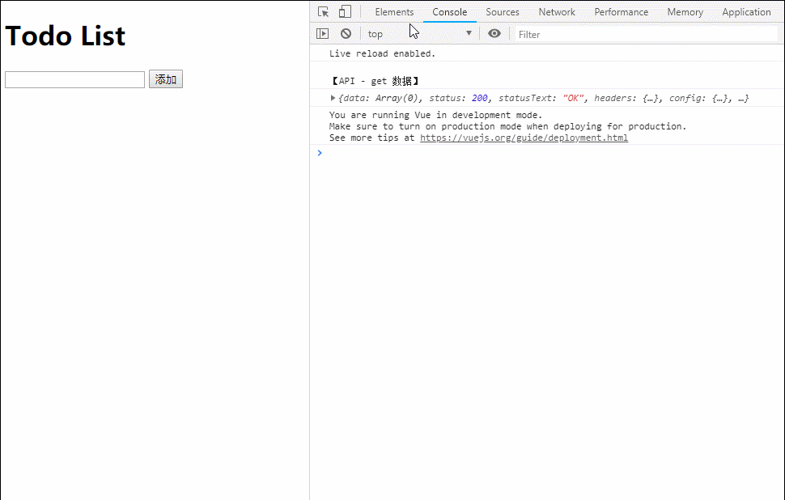

&emsp;话不多说，先上代码：

> index.js

```
// 加载 http 模块
var http = require('http');

// 虚拟 SQL 读取出来的数据
var items = [];

// 创建 http 服务
http.createServer(function (req, res) {
  
  // 设置跨域的域名，* 代表允许任意域名跨域
  res.setHeader('Access-Control-Allow-Origin', '*');
  // 设置 header 类型
  res.setHeader('Access-Control-Allow-Headers', 'Content-Type');
  // 跨域允许的请求方式
  res.setHeader('Content-Type', 'application/json');

  // 判断请求
  switch (req.method) {
    
    // post 请求时，浏览器会先发一次 options 请求，如果请求通过，则继续发送正式的 post 请求
    case 'OPTIONS':
      res.statusCode = 200;
      res.end();
      break;
    
      // 如果是 get 请求，则直接返回 items 数组
    case 'GET':
      let data = JSON.stringify(items);
      res.write(data);
      res.end();
      break;
      
    // 如果是 post 请求
    case 'POST':
      let item = '';
      // 读取每次发送的数据
      req.on('data', function (chunk) {
        item += chunk;
      });
      // 数据发送完成
      req.on('end', function () {
        // 存入
        item = JSON.parse(item);
        items.push(item.item);
        // 将数据返回到客户端
        let data = JSON.stringify(items);
        res.write(data);
        res.end();
      });
      break;
  }
}).listen(3000)

console.log('http server is start...');
```

<br>

&emsp;**首先**，我们加载了 `http` 模块，并创建了服务。  
&emsp;**然后**，我们设置了跨域的处理方式，允许进行跨域。  
&emsp;**接着**，我们进行了请求的判断处理，由于只做简单演练，故只判断是 `get` 请求还是 `post` 请求。  
&emsp;**最后**，我们将请求的结果返回给客户端。

<br>

&emsp;在上面，我们进行了后端 Node 的部署，那么前端页面要怎么做呢？

> index.html

```
<!DOCTYPE html>
<html lang="en">

<head>
  <meta charset="UTF-8">
  <meta name="viewport" content="width=device-width,initial-scale=1.0,maximum-scale=1.0,user-scalable=no">
  <meta http-equiv="X-UA-Compatible" content="ie=edge">
  <title>Node Web</title>

</head>

<body>

  <div id="app">
    <h1>Todo List</h1>
    <ul>
      <li v-for="(item, index) in items" :key="index">{{ item }}</li>
    </ul>
    <input type="text" v-model="item">
    <button @click="postApi">添加</button>
  </div>

  <!-- cdn 引用：Vue 和 Node -->
  <script src="https://cdn.jsdelivr.net/npm/vue/dist/vue.js"></script>
  <script src="https://unpkg.com/axios/dist/axios.min.js"></script>
  
  <script>
    new Vue({
      el: document.getElementById('app'),
      data: function () {
        return {
          items: [],
          item: '',
        }
      },
      created() {
        // 进入页面请求数据
        axios.get('http://localhost:3000/').then(res => {
          console.log("\n【API - get 数据】");
          console.log(res);
          this.items = res.data;
        }).catch(function (err) {
          console.log(err)
        })
      },
      methods: {
        // 点击按钮提交数据
        postApi() {
          axios.post('http://localhost:3000/', {
            item: this.item
          }).then(res => {
            console.log("\n【API - post 数据】")
            console.log(res);
            this.items = res.data;
          }).catch(function (err) {
            console.log(err)
          })
        }
      }
    })
  </script>
</body>

</html>
```

<br>

&emsp;我们通过 Vue 进行了布局，通过 Axios 进行了接口的请求。从而完成了对数据的操作。

<br>

## <a name="chapter-three-eleven" id="chapter-three-eleven">3.11 Node 连接 MySQL</a>

> [返回目录](#catalog-chapter-three-eleven)

<br>

> 关于 MySQL 的安装，可以查看 **jsliang** 写的：[MySQL 安装及图形化工具](https://github.com/LiangJunrong/document-library/blob/master/other-library/SQL/MySQL.md)

&emsp;**首先**，我们通过可视化工具进行表的设计：

| 名   | 类型    | 长度 | 键   |
| ---- | ------- | ---- | ---- |
| id   | int     | 11   | 主键 |
| name | varchar | 255  |      |
| age  | varchar | 255  |      |

&emsp;**然后**，我们进行表的填充：

| id  | name     | age |
| --- | -------- | --- |
| 1   | jslliang | 23  |
| 2   | 梁峻荣   | 23  |

&emsp;**接着**，我们安装 Node 连接 MySQL 的包：

```
npm i mysql -D
```

&emsp;**再来**，我们编写 Node 的 `index.js`：

> index.js

```
var mysql = require('mysql');
var connection = mysql.createConnection({
  host: 'localhost',
  user: 'root',
  password: '123456',
  database: 'node'
});

connection.connect();

connection.query('SELECT * FROM user', function (error, results, fields) {
  if (error) throw error;
  console.log(results);
});

connection.end();
```

&emsp;**最后**，我们通过 `node index.js`，打开该服务：

```
[ RowDataPacket { id: 1, name: 'jsliang', age: '23' },
  RowDataPacket { id: 2, name: '梁峻荣', age: '23' } ]
```

&emsp;如此，我们便完成了 Node 连接 MySQL。

&emsp;———————华丽分割线———————

&emsp;当然，增删改查是后端的基本操作，所以在这里，我们可以补全基本的增删改查功能。

&emsp;先看目录：

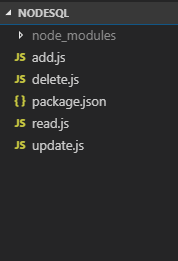

* **新增表字段**

> add.js

```
var mysql = require('mysql');
var connection = mysql.createConnection({
  host: 'localhost',
  user: 'root',
  password: '123456',
  database: 'node'
});

connection.connect();

let addSql = "INSERT INTO user(id,name,age) VALUES(0,?,?)";
let addSqlParams = ["jsliang", "23"];

connection.query(addSql, addSqlParams, function (err, res) {
  if (err) {
    console.log("新增错误：");
    console.log(err);
    return;
  } else {
    console.log("新增成功：");
    console.log(res);
  }
});

connection.end();
```

<br>

&emsp;我们只需要直接 `node add.js`，就能往数据库中新增数据了。

<br>

* **删除表字段**

> delete.js

```
// 连接 MySQL
var mysql = require('mysql');
// MySQL 的连接信息
var connection = mysql.createConnection({
  host: 'localhost',
  user: 'root',
  password: '123456',
  database: 'node'
});

// 开始连接
connection.connect();

// 新增的 SQL 语句及新增的字段信息
var delSql = 'DELETE FROM user where id = 2';

// 连接 SQL 并实施语句
connection.query(delSql, function (err, res) {
  if (err) {
    console.log("删除错误：");
    console.log(err);
    return;
  } else {
    console.log("删除成功：");
    console.log(res);
  }
});

// 终止连接
connection.end();
```

<br>

* **修改表字段**

> update.js

```
// 连接 MySQL
var mysql = require('mysql');
// MySQL 的连接信息
var connection = mysql.createConnection({
  host: 'localhost',
  user: 'root',
  password: '123456',
  database: 'node'
});

// 开始连接
connection.connect();

// 新增的 SQL 语句及新增的字段信息
let updateSql = "UPDATE user SET name = ?,age = ? WHERE Id = ?";
let updateSqlParams = ["LiangJunrong", "23", 1];

// 连接 SQL 并实施语句
connection.query(updateSql, updateSqlParams, function (err, res) {
  if (err) {
    console.log("修改错误：");
    console.log(err);
    return;
  } else {
    console.log("修改成功：");
    console.log(res);
  }
});

// 终止连接
connection.end();
```

<br>

* **查询表字段**

> read.js

```
// 连接 MySQL
var mysql = require('mysql');
// MySQL 的连接信息
var connection = mysql.createConnection({
  host: 'localhost',
  user: 'root',
  password: '123456',
  database: 'node'
});

// 开始连接
connection.connect();

// 新增的 SQL 语句及新增的字段信息
let readSql = "SELECT * FROM user";

// 连接 SQL 并实施语句
connection.query(readSql, function (err, res) {
  if (err) throw err;
  console.log(res);
});

// 终止连接
connection.end();
```

<br>

&emsp;以上，我们打通了 Node 与 MySQL 的壁垒，实现了数据的增删改查。

<br>
 
# <a name="chapter-four" id="chapter-four">四 Web 实战 —— 企业官网</a>

> [返回目录](#catalog-chapter-four)

<br>

&emsp;在进行代码实战的时候，我们很多时候会遇到一些小事儿，例如：logo 制作、ico 制作、icon 挑选等……  

&emsp;下面这些都是 **jsliang** 平时碰到的，小伙伴有需要的可以 mark 啦~

* [logo 制作](http://www.uugai.com/logoa/wenzi.php)
* [ico 制作](http://www.bitbug.net/)
* [icon 挑选](https://www.iconfont.cn/home/index)

&emsp;另外，由于 HTML 与 CSS 没什么好讲的，所以本章节的前提静态页面 **jsliang** 已经写好了，小伙伴们在学习前可以预先下载：

* [本文静态页面代码地址](https://github.com/LiangJunrong/Node/tree/FrontEndCodeBase)

<br>

## <a name="chapter-four-one" id="chapter-four-one">4.1 编程环境</a>

> [返回目录](#catalog-chapter-four-one)

<br>

&emsp;**首先**，我们查看下我们的前端基本代码：[地址](https://github.com/LiangJunrong/Node/tree/FrontEndCodeBase)

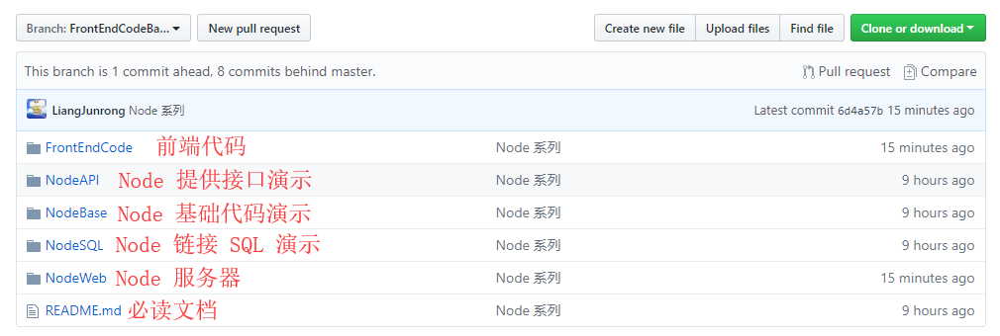

<br>

&emsp;如上，我们仅需要了解 FrontEndCode 目录以及 NodeWeb 目录即可，其他目录为上面章节练习参考。

&emsp;**然后**，我们进行后端功能分析：

1. 留言板。用户点击 **留言板** 的时候，需要先判断用户是否登录。如果用户尚未登录，则直接跳转到 **登录页**；如果用户登录了，则显示 **留言板页面**。

&emsp;在 **留言板页面** 中，存在两个接口：

* **获取留言内容**：调取 `getMessage` 接口，返回全部留言信息，由于预计信息不多，故这里不做分页功能，有需要的小伙伴在实现完这个功能后，可以进行分页接口的设计。
* **提交留言内容**：调取 `sendMessage` 接口，将用户名、用户 id、留言内容发送给后端。

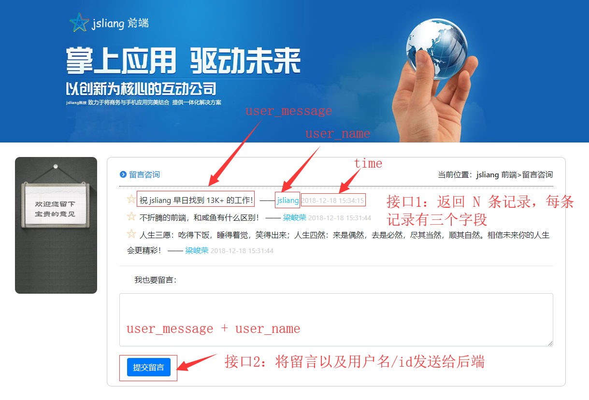

<br>

2. 在 **登录页面** 中，存在一个接口：

* **登录**：调取 `login` 接口，提交用户填写的姓名和密码。

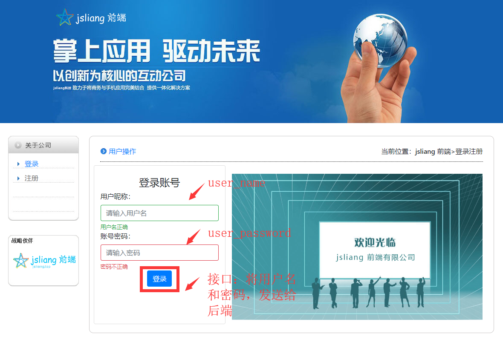

<br>

3. 在 **注册页面** 中，存在一个接口：

* **注册**：调取 `register` 接口，提交用户填写的姓名和密码。


<br>

&emsp;由此，我们可以设计下前后端的接口结合：

> 接口文档

| 接口          | 类型 | 参数                                                       | 返回信息                                                                             |
| ------------- | ---- | ---------------------------------------------------------- | ------------------------------------------------------------------------------------ |
| `getMessage`：获取留言信息  | get  | 无参                                                       | n 条记录：id(用户 id)、user_name(用户名)、user_message(用户留言内容)、time(留言时间) |
| `sendMessage`：提交留言信息 | post | id(用户 id)、user_name(用户名)、user_message(用户留言内容) | status 状态                                                                          |
| `login`：登录       | post | id(用户 id)、user_name(用户名)、user_password(用户密码)    | status 状态                                                                          |
| `register`：注册    | post | id(用户 id)、user_name(用户名)、user_password(用户密码)    | status 状态                                                                          |

<br>

&emsp;**最后**，我们进行 MySQL 数据库的表设计：

> user 表

| 名            | 类型     | 长度 | 键   |
| ------------- | -------- | ---- | ---- |
| id            | int      | 11   | 主键 |
| user_name     | varchar  | 255  |      |
| user_password | varchar  | 255  |      |
| time          | datetime |      |      |

<br>

> message 表

| 名           | 类型     | 长度 | 键   |
| ------------ | -------- | ---- | ---- |
| id           | int      | 11   | 主键 |
| user_message | varchar  | 255  |      |
| user_id      | varchar  | 255  | 外键 |
| user_name    | varchar  | 255  |      |
| time         | datetime |      |      |

<br>

## <a name="chapter-four-two" id="chapter-four-two">4.2 后端接口</a>

> [返回目录](#catalog-chapter-four-two)

<br>

&emsp;在我们进行实操之前，先确认我们是否能写接口，所以我们可以新建一个 `test` 文件夹，里面放一个 `index.html` 以及一个 `index.js` 来测试一下。

```
- text
 - index.html
 - index.js
```

&emsp;**首先**，我们就 4.1 提到的接口，提前进行后端接口的设置：

> index.js

```
// 连接 MySQL：先安装 npm i mysql -D
var mysql = require('mysql');
// MySQL 的连接信息
var connection = mysql.createConnection({
  host: 'localhost',
  user: 'root',
  password: '123456',
  database: 'nodebase'
});
// 开始连接
connection.connect();

// 引入 http 模块：http 是提供 Web 服务的基础
const http = require("http");

// 引入 url 模块：url 是对用户提交的路径进行解析
const url = require("url");

// 引入 qs 模块：qs 是对路径进行 json 化或者将 json 转换为 string 路径
const qs = require("querystring");

// 用 http 模块创建服务
/**
 * req 获取 url 信息 (request)
 * res 浏览器返回响应信息 (response)
 */
http.createServer(function (req, res) {

  // 设置 cors 跨域
  res.setHeader("Access-Control-Allow-Origin", "*");
  // 设置 header 类型
  res.setHeader('Access-Control-Allow-Headers', 'Content-Type');
  // 跨域允许的请求方式
  res.setHeader('Content-Type', 'application/json');

  if (req.method == "POST") { // 接口 POST 形式

    console.log("\n【POST 形式】");

    // 获取前端发来的路由地址
    let pathName = req.url;

    console.log("\n接口为：" + pathName);

    // 接收发送过来的参数
    let tempResult = "";

    // 数据接入中
    req.addListener("data", function (chunk) {
      tempResult += chunk;
    });

    // 数据接收完成
    req.addListener("end", function () {

      var result = JSON.stringify(qs.parse(tempResult));
      console.log("\n参数为：");
      console.log(result);

      if (pathName == "/sendMessage") { // 提交留言信息

        console.log("\n【API - 提交留言信息】");

      } else if (pathName == "/login") { // 登录

        console.log("\n【API - 登录】");

      } else if (pathName == "/register") { // 注册

        console.log("\n【API - 注册】");

      }
      // 接口信息处理完毕
    })
    // 数据接收完毕

  } else if (req.method == "GET") { // 接口 GET 形式

    console.log("\n【GET 形式】");

    // 解析 url 接口
    let pathName = url.parse(req.url).pathname;

    console.log("\n接口为：" + pathName);

    if (pathName == "/getMessage") { // 获取留言信息

      console.log("\n【API - 获取留言信息】");

    } else if(pathName == "/") { // 首页
      res.writeHead(200, {
        "Content-Type": "text/html;charset=UTF-8"
      });

      res.write('<h1 style="text-align:center">jsliang 前端有限公司服务已开启！</h1><h2 style="text-align:center">详情可见：<a href="https://github.com/LiangJunrong/document-library/blob/master/other-library/Node/NodeBase.md" target="_blank">Node 基础</a></h2>');

      res.end();
    }

  }

}).listen(8888); // 监听的端口

// 获取当前时间
function getNowFormatDate() {
  var date = new Date();
  var year = date.getFullYear(); // 年
  var month = date.getMonth() + 1; // 月
  var strDate = date.getDate(); // 日
  var hour = date.getHours(); // 时
  var minute = date.getMinutes(); // 分
  var second = date.getMinutes(); // 秒
  if (month >= 1 && month <= 9) {
    month = "0" + month;
  }
  if (strDate >= 0 && strDate <= 9) {
    strDate = "0" + strDate;
  }
  // 返回 yyyy-mm-dd hh:mm:ss 形式
  var currentdate = year + "-" + month + "-" + strDate + " " + hour + ":" + minute + ":" + second;
  return currentdate;
}
```

<br>

&emsp;通过判断 `req.method` 属于 `GET` 还是 `POST` 形式，从而确定加载的接口：  

* 在 `POST` 中，判断是属于 **提交留言信息**、**登录** 还是 **注册**；
* 在 `GET` 中，判断是不是 **获取留言信息**。  

&emsp;**同时**，我们在其中定义了 MySQL 的连接以及一个 `getNowFormatDate` 用来获取当前时间，格式为：`2018-12-21 10:03:59`

&emsp;**然后**，我们通过一个前端页面来演示我们的接口是否能使用：

> index.html

```
<!DOCTYPE html>
<html lang="en">

<head>
  <meta charset="UTF-8">
  <meta name="viewport" content="width=device-width,initial-scale=1.0,maximum-scale=1.0,user-scalable=no">
  <meta http-equiv="X-UA-Compatible" content="ie=edge">
  <title>演示代码</title>
</head>

<body>
  <div>
    <label for="user">用户名</label><input type="text" id="user">
  </div>
  <div>
    <label for="password">密&nbsp;&nbsp;&nbsp;码</label><input type="password" id="password">
  </div>
  <div>
    <button id="register">注册</button>
  </div>

  <script src="https://cdn.bootcss.com/jquery/3.3.1/jquery.js"></script>
  <script>
    $(function () {
      // 测试 get 接口
      $.ajax({
        url: "http://localhost:8888/getMessage",
        type: "POST",
        data: {
          username: "jsliang"
        },
        success: function (res) {
          console.log(res);
        },
        error: function (err) {
          console.log(err);
        }
      })

      $("#register").click(function () {
        // 测试 post 接口
        $.ajax({
          url: "http://localhost:8888/login",
          type: "POST",
          data: {
            username: $("#user").val(),
            password: $("#password").val()
          },
          success: function (res) {
            console.log(res);
          },
          error: function (err) {
            console.log(err);
          }
        })
      })
    });
  </script>
</body>

</html>
```

<br>

&emsp;**最后**，我们通过 `node index.js`，并打开 `index.html`，通过 `F12` 控制台查看我们的接口是否正常：

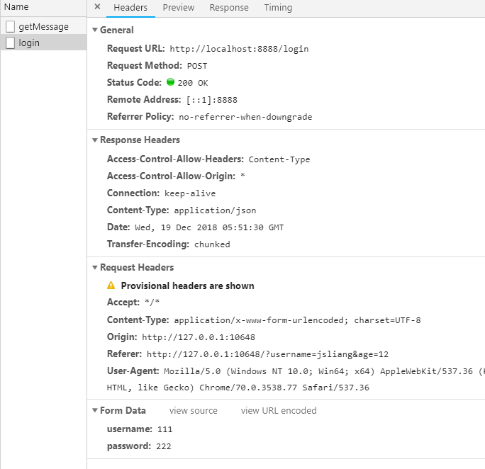

&emsp;可以看到我们的接口能正常调通，这样我们就可以连接数据库，进行这 4 个接口的设计了。

> 如果小伙伴们觉得每次更新 Node 代码后，又要重启一遍 `node index.js` 觉得麻烦，可以通过 `supervisor` 来监听 Node 代码的改动，`supervisor` 的安装使用：[supervisor](#chapter-five-one)

<br>

## <a name="chapter-four-three" id="chapter-four-three">4.3 注册功能</a>

> [返回目录](#catalog-chapter-four-three)

<br>

&emsp;很好，我们回到仿企业网站的页面上，准备编写接口以及丰富 Node 的接口。  

&emsp;**首先**，我们开启前端和 Node 服务：

1. 打开命令行/终端

2. 开启前端

* `cd FrontEndCode`
* `live-server`

> 安装 `live-server`：`npm i live-server -g`

3. 开启后端

* `cd NodeWeb`
* `supervisor index.js`

> 安装 `supervisor`：`npm i supervisor -g`

<br>

&emsp;**然后**，我们在注册页面通过点击事件来触发调接口：

> register.html

```
<!DOCTYPE html>
<html lang="en">

<head>
  <meta charset="UTF-8">
  <meta http-equiv="keywords" content="前端,jsliang,bootstrap,企业建站">
  <meta http-equiv="description" content="jsliang 为你打造最好的企业服务">
  <link rel="shortcut icon" href="./images/favicon.ico" type="image/x-icon" />
  <meta name="viewport" content="width=device-width, initial-scale=1.0">
  <meta http-equiv="X-UA-Compatible" content="ie=edge">
  <title>注册-jsliang 前端有限公司</title>
  <link rel="stylesheet" href="./css/index.css">
  <link rel="stylesheet" href="./css/bootstrap.min.css">
</head>

<body>
  <!-- 省略 body 中代码，有需要的请前往第四章开头下载查看全部代码 -->

  <script src="./js/jquery-3.3.1.min.js"></script>
  <script src="./js/bootstrap.min.js"></script>
  <script src="./js/islogin.js"></script>
  <script>
    $(function () {
      $("#register-submit").click(function () {

        let userName = $("#userName").val();
        let userPassword = $("#userPassword").val();

        if (!userName) {
          alert("请输入用户名");
          $("#userName").focus();
        } else if (!userPassword) {
          alert("请输入密码");
          $("#userPassword").focus();
        } else if (userName.length > 10) {
          alert("请输入少于 10 位的用户名");
          $("#userName").focus();
        } else if (userPassword.length > 20) {
          alert("请输入少于 20 位的密码");
          $("#userPassword").focus();
        } else {

          // 如果用户输入的没毛病，那就加载接口
          $.ajax({
            url: "http://localhost:8888/register",
            type: 'post',
            dataType: 'json',
            data: {
              username: userName,
              password: userPassword
            },
            success: function (res) {
              console.log(res);
              if (res.code == "0") {
                alert("注册成功，前往登录！");
                window.location.href = "./login.html";
              }
            },
            error: function (err) {
              console.log(err.responseText);
              if (err.responseText == "注册失败，姓名重复！") {
                alert("用户名已被注册！");
              } else if (err.responseText == "注册失败，名额已满！") {
                alert("注册失败，名额已满！");
              } else if (err.responseText == "注册失败，密码为空！") {
                alert("注册失败，密码为空！");
              } else if (err.responseText == "注册失败，姓名过长！") {
                alert("注册失败，姓名过长！");
              } else if (err.responseText == "注册失败，密码过长！") {
                alert("注册失败，密码过长！");
              } else {
                alert("未知错误！");
              }
            }
          })
        }

      })
    })
  </script>
</body>

</html>
```

<br>

&emsp;如此，我们在用户点击 **注册** 按钮的时候，进行接口的调用，发送数据到了后端，如果成功了，那就弹窗，并跳转到登录页；如果没成功，就弹窗提示。

<br>

&emsp;**接着**，我们编写 Node，前端调用接口后，Node 判断这两个参数是否为空，如果不为空，则将数据存储到数据库。

> index.js

```
// ... 其他代码省略，请自行前往章节 4.2 后端接口 获取其他代码

if (pathName == "/sendMessage") { // 提交留言信息

  console.log("\n【API - 提交留言信息】");

} else if (pathName == "/login") { // 登录

  console.log("\n【API - 登录】");

} else if (pathName == "/register") { // 注册

  console.log("\n【API - 注册】");

  result = JSON.parse(result);

  let username = result.username; // 用户名
  let password = result.password; // 密码
  let time = getNowFormatDate(); // 时间

  if (!username) { // 用户名为空
    res.end("注册失败，用户名为空。");
    return;
  } else if (!password) { // 密码为空
    res.end("注册失败，密码为空！");
    return;
  } else if(username.length > 10) { // 姓名过长
    res.end("注册失败，姓名过长！");
    return;
  } else if(password.length > 20) { // 密码过长
    res.end("注册失败，密码过长！");
    return;
  } else {
    
    // 查询 user 表
    // 使用 Promise 的原因是因为中间调用了两次数据库，而数据库查询是异步的，所以需要用 Promise。
    new Promise( (resolve, reject) => {

      // 新增的 SQL 语句及新增的字段信息
      let readSql = "SELECT * FROM user";
      
      // 连接 SQL 并实施语句
      connection.query(readSql, function (error1, response1) {
        
        if (error1) { // 如果 SQL 语句错误
          throw error1;
        } else {
          
          console.log("\nSQL 查询结果：");

          // 将结果先去掉 RowDataPacket，再转换为 json 对象
          let newRes = JSON.parse(JSON.stringify(response1));
          console.log(newRes);

          // 判断姓名重复与否
          let userNameRepeat = false;
          for(let item in newRes) {
            if(newRes[item].user_name == username) {
              userNameRepeat = true;
            }
          }

          // 如果姓名重复
          if(userNameRepeat) {
            res.end("注册失败，姓名重复！");
            return;
          } else if(newRes.length > 300) { // 如果注册名额已满
            res.end("注册失败，名额已满！");
            return;
          } else { // 可以注册
            resolve();
          }
          
        }
      });

    }).then( () => {
      
      console.log("\n第二步：");
      
      // 新增的 SQL 语句及新增的字段信息
      let addSql = "INSERT INTO user(user_name,user_password, time) VALUES(?,?,?)";
      let addSqlParams = [result.username, result.password, time];

      // 连接 SQL 并实施语句
      connection.query(addSql, addSqlParams, function (error2, response2) {
        if (error2) { // 如果 SQL 语句错误
          console.log("新增错误：");
          console.log(error2);
          return;
        } else {
          console.log("\nSQL 查询结果：");
          console.log(response2);

          console.log("\n注册成功！");

          // 返回数据
          res.write(JSON.stringify({
            code: "0",
            message: "注册成功！"
          }));

          // 结束响应
          res.end();
        }
      });

    })
    // Promise 结束
  }
  // 注册流程结束
}
```

<br>

&emsp;**最后**，我们在查看下该功能是否成功：


<br>

## <a name="chapter-four-four" id="chapter-four-four">4.4 登录功能</a>

> [返回目录](#catalog-chapter-four-four)

<br>

&emsp;在上面，我们完成了注册功能，那么相对来说，登录功能就容易通了，因为查询部分我们已经试过了一次。

> login.html

```
<!DOCTYPE html>
<html lang="en">

<head>
  <meta charset="UTF-8">
  <meta http-equiv="keywords" content="前端,jsliang,bootstrap,企业建站">
  <meta http-equiv="description" content="jsliang 为你打造最好的企业服务">
  <link rel="shortcut icon" href="./images/favicon.ico" type="image/x-icon" />
  <meta name="viewport" content="width=device-width, initial-scale=1.0">
  <meta http-equiv="X-UA-Compatible" content="ie=edge">
  <title>登录-jsliang 前端有限公司</title>
  <link rel="stylesheet" href="./css/index.css">
  <link rel="stylesheet" href="./css/bootstrap.min.css">
</head>

<body>
  
  <!-- 代码省略，有需要的小伙伴请在第四章前言部分下载代码 -->

  <script src="./js/jquery-3.3.1.min.js"></script>
  <script src="./js/bootstrap.min.js"></script>
  <script src="./js/islogin.js"></script>
  <script>
    $(function () {
      $("#login-submit").click(function () {

        let userName = $("#userName").val(); // 用户名
        let userPassword = $("#userPassword").val(); // 密码

        if (!userName) {
          alert("请输入用户名");
          $("#userName").focus();
        } else if (!userPassword) {
          alert("请输入密码");
          $("#userPassword").focus();
        } else if (userName.length > 10) {
          alert("请输入少于 10 位的用户名");
          $("#userName").focus();
        } else if (userPassword.length > 20) {
          alert("请输入少于 20 位的密码");
          $("#userPassword").focus();
        } else {

          $.ajax({
            url: "http://localhost:8888/login",
            type: 'post',
            dataType: 'json',
            data: {
              username: userName,
              password: userPassword
            },
            success: function (res) {
              console.log(res);
              if (res.code == "0") {
                sessionStorage.setItem("id", res.data.id);
                sessionStorage.setItem("userName", res.data.userName);
                alert("登录成功！");
                window.location.href = "./messageBoard.html";
              } else if (res.code == "1") {
                alert("登录失败，密码错误！");
              }
            },
            error: function (err) {
              console.log(err.responseText);
              if (err.responseText == "不存在该用户！") {
                alert("不存在该用户！");
              } else if (err.responseText == "登录失败，用户名为空！") {
                alert("登录失败，用户名为空！");
              } else if (err.responseText == "登录失败，密码为空！") {
                alert("登录失败，密码为空！");
              } else if (err.responseText == "登录失败，姓名过长！") {
                alert("登录失败，姓名过长！");
              } else if (err.responseText == "登录失败，密码过长！") {
                alert("登录失败，密码过长！");
              } else {
                alert("未知错误！");
              }
            }
          })

        }

      })
    })
  </script>
</body>

</html>
```

<br>

&emsp;编写完前端的代码后，我们进行 Node 代码的编辑：

> index.js

```

// ... 其他代码省略，请自行前往章节 4.2 后端接口 获取其他代码

if (pathName == "/sendMessage") { // 提交留言信息

  console.log("\n【API - 提交留言信息】");

} else if (pathName == "/login") { // 登录

  console.log("\n【API - 登录】");

  result = JSON.parse(result);

  let username = result.username; // 用户名
  let password = result.password; // 密码

  if (!username) { // 用户名为空
    res.end("登录失败，用户名为空！");
    return;
  } else if (!password) { // 密码为空
    res.end("登录失败，密码为空！");
    return;
  } else if(username.length > 10) {
    res.end("登录失败，姓名过长！");
    return;
  } else if(password.length > 20) {
    res.end("登录失败，密码过长！");
    return;
  } else { 
    
    // 新增的 SQL 语句及新增的字段信息
    let readSql = "SELECT * FROM user WHERE user_name  = '" + username + "'";

    // 连接 SQL 并实施语句
    connection.query(readSql, function (error1, response1) {
      if (error1) {
        throw error1;
      } else {
        if(response1 == undefined || response1.length == 0) { // 不存在用户
          res.end("\n不存在该用户！");
          return;
        } else { // 存在用户
          console.log("\n存在该用户！");

          let newRes = JSON.parse(JSON.stringify(response1));
          console.log(newRes);

          if(newRes[0].user_password == password) { // 密码正确
            // 返回数据
            res.write(JSON.stringify({
              code: "0",
              message: "登录成功！",
              data: {
                id: newRes[0].id,
                userName: newRes[0].user_name
              }
            }));

            res.end();
          } else { // 密码错误
            // 返回数据
            res.write(JSON.stringify({
              code: "1",
              message: "登录失败，密码错误！"
            }));

            res.end();
          }
          // 判断密码正确与否完毕
        }
        // 存在用户处理结束
      }
    });
  }
  // 登录步骤结束
} else if (pathName == "/register") { // 注册

  console.log("\n【API - 注册】");

}
```

<br>

&emsp;很好，前端和后端都编写完毕，是时候查验下功能是否实现了：


<br>

## <a name="chapter-four-five" id="chapter-four-five">4.5 留言功能</a>

> [返回目录](#catalog-chapter-four-five)

<br>

&emsp;现在，我们就剩下留言功能了，一鼓作气做好它吧！

> messageBoard.html

```
<!-- 留言板 -->
<!DOCTYPE html>
<html lang="en">

<head>
  <meta charset="UTF-8">
  <meta http-equiv="keywords" content="前端,jsliang,bootstrap,企业建站">
  <meta http-equiv="description" content="jsliang 为你打造最好的企业服务">
  <link rel="shortcut icon" href="./images/favicon.ico" type="image/x-icon" />
  <meta name="viewport" content="width=device-width, initial-scale=1.0">
  <meta http-equiv="X-UA-Compatible" content="ie=edge">
  <title>留言板-jsliang 前端有限公司</title>
  <link rel="stylesheet" href="./css/index.css">
  <link rel="stylesheet" href="./css/bootstrap.min.css">
</head>

<body>
  
  <!-- 代码省略，基础代码请前往本章节前言下载 -->

  <script src="./js/jquery-3.3.1.min.js"></script>
  <script src="./js/bootstrap.min.js"></script>
  <script src="./js/islogin.js"></script>
  <script>
    $(function() {
      
      let userName = sessionStorage.getItem("userName");
      let userId = sessionStorage.getItem("id");
      
      // 查询留言板
      if(userName && userId) { // 如果有存储
        $.ajax({
          url: "http://localhost:8888/getMessage",
          type: 'get',
          dataType: 'json',
          success: function (res) {
            console.log(res);
            let li = ``;
            for(let item in res.data) {
              li = li + `
                <li>
                  <span class="text-warning font-bold">☆ </span>
                  <span class="user-message">${res.data[item].user_message}</span>
                  <span>—— </span>
                  <span class="user-name">${res.data[item].user_name} [${res.data[item].user_id}]</span>
                  <span class="message-time">${res.data[item].time}</span>
                </li>
              `;
            }
            $("#message-board-ul").append(li);
          },
          error: function (err) {
            console.log(err);
          }
        })
      } else { // 如果没有存储
        window.location.href = "../login.html";
      }

      // 提交留言
      $("#message-submit").click(function() {
        let messageText = $("#message").val()
        if(!messageText) {
          alert("留言内容不能为空");
        } else if(messageText.length > 140) {
          alert("留言长度不能超过 140 位！");
        } else {
          $.ajax({
            url: "http://localhost:8888/sendMessage",
            type: 'post',
            dataType: 'json',
            data: {
              userid: userId,
              username: userName,
              message: messageText
            },
            success: function (res) {
              console.log(res);
              if(res.code == "0") {
                alert("新增成功！");
                window.location.reload();
              }
            },
            error: function (err) {
              console.log(err);
              console.log(err.responseText);
              if (err.responseText == "登录失败，留言内容为空！") {
                alert("登录失败，留言内容为空！");
              } else if (err.responseText == "登录失败，字数超过限制！") {
                alert("登录失败，字数超过限制！");
              } else {
                alert("未知错误！");
              }
            }
          })
        }
      })

    })
  </script>
</body>

</html>
```

<br>

&emsp;接着编写下 Node 后端：

> index.js

```

// ... 其他代码省略，请自行前往章节 4.2 后端接口 获取其他代码

if (pathName == "/sendMessage") { // 提交留言信息

  console.log("\n【API - 提交留言信息】");

  result = JSON.parse(result);

  let id = result.userid; // id
  let userName = result.username; // 用户名
  let messageText = result.message; // 留言内容
  let time = getNowFormatDate(); // 时间

  if(!messageText) {
    res.end("登录失败，留言内容为空！");
    return;
  } else if(messageText.length > 140) {
    res.end("登录失败，字数超过限制！");
    return;
  } else {
    
    // 新增的 SQL 语句及新增的字段信息
    let addSql = "INSERT INTO message(user_message, user_id, user_name, time) VALUES(?, ?, ?, ?)";
    let addSqlParams = [messageText, id, userName, time];

    // 连接 SQL 并实施语句
    connection.query(addSql, addSqlParams, function (error1, response1) {
      if (error1) { // 如果 SQL 语句错误
        throw error1;
      } else {
        console.log("\n新增成功！");

        // 返回数据
        res.write(JSON.stringify({
          code: "0",
          message: "新增成功！"
        }));

        // 结束响应
        res.end();
      }
    })
  }

} else if (pathName == "/login") { // 登录

  console.log("\n【API - 登录】");

} else if (pathName == "/register") { // 注册

  console.log("\n【API - 注册】");

}


// ... 其他代码省略，请自行前往章节 4.2 后端接口 获取其他代码


if (pathName == "/getMessage") { // 获取留言信息

  console.log("\n【API - 获取留言信息】");

  // 解析 url 参数部分
  let params = url.parse(req.url, true).query;

  console.log("\n参数为：");
  console.log(params);

  // 新增的 SQL 语句及新增的字段信息
  let readSql = "SELECT * FROM message";

  // 连接 SQL 并实施语句
  connection.query(readSql, function (error1, response1) {
    if (error1) {
      throw error1; 
    } else {
      
      let newRes = JSON.parse(JSON.stringify(response1));
      console.log(newRes);

      // 返回数据
      res.write(JSON.stringify({
        code: "1",
        message: "查询成功！",
        data: newRes
      }));

      // 结束响应
      res.end();
    }
  });
  // 查询完毕
} else if(pathName == "/") { // 首页
  res.writeHead(200, {
    "Content-Type": "text/html;charset=UTF-8"
  });

  res.write('<h1 style="text-align:center">jsliang 前端有限公司服务已开启！</h1><h2 style="text-align:center">详情可见：<a href="https://github.com/LiangJunrong/document-library/blob/master/other-library/Node/NodeBase.md" target="_blank">Node 基础</a></h2>');

  res.end();
}
```

<br>

&emsp;敲完代码再看下功能是否实现：


&emsp;综上，我们完成了所有的功能模块：注册、登录以及留言。

<br>
 
# <a name="chapter-five" id="chapter-five">五 工具整合</a>

> [返回目录](#catalog-chapter-five)

<br>

&emsp;**工欲善其事，必先利其器。**  
&emsp;掌控好了工具，可以方便你更快地进行开发。

<br>

## <a name="chapter-five-one" id="chapter-five-one">5.1 supervisor - 监听 Node 改动</a>

> [返回目录](#catalog-chapter-five-one)

<br>

* [supervisor 官网](http://www.supervisord.org/)

&emsp;正如其官网所说，它是一个进行控制系统：

1. 安装插件：`npm i supervisor -g`
2. 运行文件：`supervisor app.js`
3. 查看运行：`localhost:3000`

&emsp;平时，我们 `node app.js` 后，当我们修改了 `app.js` 的内容，就需要关闭 node 命令行再执行 `node app.js`。  
&emsp;而我们使用 `supervisor` 后，我们修改了 `app.js` 中的内容，只要点击保存，即可生效保存后的代码，实现实时监听 node 代码的变动。  

&emsp;关于这个工具，网上更详细的攻略有：

* [详细版：用Supervisor守护你的Node.js进程 | 简书 - Mike的读书季](https://www.jianshu.com/p/6d84e5efe99d)

<br>

## <a name="chapter-five-two" id="chapter-five-two">5.2 PM2 - Node 进程管理</a>

> [返回目录](#catalog-chapter-five-two)

<br>

* [PM2 - npm](https://www.npmjs.com/package/pm2)

&emsp;PM2 是 Node 进程管理工具，可以利用它来简化很多 Node 应用管理的繁琐任务，如性能监控、自动重启、负载均衡等，而且使用非常简单。

&emsp;下面就对 PM2 进行入门性的介绍，基本涵盖了 PM2 的常用的功能和配置：

1. 全局安装 PM2：`npm i pm2 -g`
2. 监听应用：`pm2 start index.js`
3. 查看所有进程：`pm2 list`
4. 查看某个进程：`pm2 describe App name/id`
5. 停止某个进程：`pm2 stop App name/id`。例如：

> 先通过 `pm2 list` 查看：

| App name | id  | status |
| -------- | --- | ------ |
| index    | 0   | online |

&emsp;只需要执行 `pm2 stop index` 或者 `pm2 stop 0` 即可。

6. 停止所有进程：`pm2 stop all`
7. 重启某个进程：`pm2 restart App name/id`
8. 删除某个进程：`pm2 delete App name/id`

&emsp;如上，如果说我们的 `supervisor` 是监听单个进程的话，那么 `PM2` 就是监听多个进程。

&emsp;更多攻略：

* [PM2 官网](https://pm2.io/doc/en/runtime/quick-start/?utm_source=pm2&utm_medium=website&utm_campaign=rebranding)
* [PM2 用法简介 | 简书 - LeavesLife](https://www.jianshu.com/p/f640450bd120)
* [PM2实用入门指南 | 博客园 - 程序猿小卡](http://www.cnblogs.com/chyingp/p/pm2-documentation.html)

<br>
 
# <a name="chapter-six" id="chapter-six">六 参考资料</a>

> [返回目录](#catalog-chapter-six)

<br>

&emsp;在编写这篇文章的过程中，有一些参考资料是值得保留阅读的：

1. **经典：该类值得我们研读**

> 经典，就是随着时间流逝，它还是那么有参考价值。

* [API 文档 | Node.js 中文网](http://nodejs.cn/api/)
* [Node.js 教程 | 菜鸟教程](http://www.runoob.com/nodejs/nodejs-tutorial.html)
* [Express 文档 | Express 中文网](http://www.expressjs.com.cn/)

2. **尝试：该类值得我们参考借鉴**

> Node 基础模块

* [nodejs之querystring模块 | 博客园 - whiteMu](https://www.cnblogs.com/whiteMu/p/5986297.html)

> Node 编写接口

* [用Node编写RESTful API接口 | php 中文网 - 不言](http://www.php.cn/js-tutorial-406242.html)

> MySQL 学习

* [MySQL 教程 | 菜鸟教程](http://www.runoob.com/mysql/mysql-tutorial.html)

> Node 连接数据库

* [node.js前后台交互示例 -- 使用node.js实现用户注册功能 | 博客园 - 返回主页 党兴明](https://www.cnblogs.com/by-dxm/p/6723039.html)
* [node.js实现简单的登录注册页面 - 博客园 - 返回主页 bestjarvan](https://www.cnblogs.com/bestjarvan/archive/2017/04/08/6680857.html)

> Node 仿 Express

* [nodejs模块：简单http请求路由，仿express | CSDN - TTUZ](https://blog.csdn.net/tiantangyouzui/article/details/70184959)
* [初学nodejs一：别被Express的API搞晕了 | 前端乱炖 - 飞天小黑神猪](http://www.html-js.com/article/1603)
* [NodeJs 实战——原生 NodeJS 轻仿 Express 框架从需求到实现（一） | 倔强的石头 - 掘金](https://juejin.im/post/5bf227a751882516be2ec124)
* [NodeJs 实战——原生 NodeJS 轻仿 Express 框架从需求到实现（二） | 倔强的石头 - 掘金](https://juejin.im/post/5bf4e46a6fb9a049f153d2ae)
* [仿 Express | Github - wallaceyuan](https://github.com/wallaceyuan/yuan-express)
* [Node.js 封装仿照 express 的路由 | CSDN - c.](https://blog.csdn.net/cckevincyh/article/details/78695177)
* [学习node中express框架中间件的相关知识及实践 | Github - BadWaka](https://github.com/BadWaka/node-express-middleware-study)

<br>
 
# <a name="chapter-seven" id="chapter-seven">七 线上部署</a>

> [返回目录](#catalog-chapter-seven)

<br>

&emsp;关于线上部署及域名、服务器相关的配置，**jsliang** 在另外一篇文章有所交代：[云服务器建站](https://github.com/LiangJunrong/document-library/blob/master/other-library/Website/BuildStation/README.md)。

&emsp;如果小伙伴需要订购云服务器来存放像 jsliang 个人网站类的静态或者有 Node 后端的网页，但却不知道怎么选择，可以加 **jsliang** QQ：`1741020489` 咨询，下面是一些优惠推广：  

&emsp;**腾讯云推广**：  

&emsp;新用户点这里：  
* [新客户无门槛 2775 元代金券](https://cloud.tencent.com/redirect.php?redirect=1025&cps_key=49f647c99fce1a9f0b4e1eeb1be484c9&from=console)  


&emsp;购买云服务器：  
* [12 月优惠低至 168 元/年](https://cloud.tencent.com/redirect.php?redirect=1014&cps_key=49f647c99fce1a9f0b4e1eeb1be484c9&from=console)


<br>

&emsp;**阿里云推广**：  

&emsp;新用户点这里：
* [新用户云产品 1888 通用代金券](https://promotion.aliyun.com/ntms/yunparter/invite.html?userCode=w7hismrh)


&emsp;购买云服务器：  
* [高性能云服务器 - 低至 293元/年](https://promotion.aliyun.com/ntms/act/qwbk.html?userCode=w7hismrh) 


&emsp;购买企业级云服务器：  
* [企业级高性能云服务器](https://promotion.aliyun.com/ntms/act/enterprise-discount.html?userCode=w7hismrh)


<br>
 
# <a name="chapter-eight" id="chapter-eight">八 归纳总结</a>

> [返回目录](#catalog-chapter-eight)

<br>

&emsp;综上，搞定一切！  
&emsp;兴许在前面代码的摧残下，能看到这里的小伙伴已经寥寥无几了，但我坚信我该交代的基本都交代了，不该交代的也交代了~  
&emsp;所以，如果小伙伴看完真觉得不错，那就点个赞或者给个 star 吧！你们的赞和 star 是我编写更多更精彩文章的动力！[GitHub 地址](https://github.com/LiangJunrong/document-library/blob/master/other-library/Node/NodeBase.md)  

&emsp;如果小伙伴看完这里要评论的话，可以加个暗语：`Node 基础，***`，这样 **jsliang** 看到必回，哈哈~

* Node 基础，我完成了！
* Node 基础，我想说 jsliang 肯定还偷懒了，没写成最完美的，我不管我打赏了你赶紧给我完善下！
* ……

&emsp;**so, that's all, thanks~**

<br>

*-----------------------*

&emsp;后记：  

&emsp;**撰文不易，如果文章对小伙伴有帮助，希望小伙伴们给勤劳敲代码、辛苦撰文的 jsliang 进行微信/支付宝打赏，你们的每一次打赏都是最好的鼓励，谢谢~**


<br>

> <a rel="license" href="http://creativecommons.org/licenses/by-nc-sa/4.0/"></a><br /><a xmlns:dct="http://purl.org/dc/terms/" property="dct:title">**jsliang** 的文档库</a> 由 <a xmlns:cc="http://creativecommons.org/ns#" href="https://github.com/LiangJunrong/document-library" property="cc:attributionName" rel="cc:attributionURL">梁峻荣</a> 采用 <a rel="license" href="http://creativecommons.org/licenses/by-nc-sa/4.0/">知识共享 署名-非商业性使用-相同方式共享 4.0 国际 许可协议</a>进行许可。<br />基于<a xmlns:dct="http://purl.org/dc/terms/" href="https://github.com/LiangJunrong/document-library" rel="dct:source">https://github.om/LiangJunrong/document-library</a>上的作品创作。<br />本许可协议授权之外的使用权限可以从 <a xmlns:cc="http://creativecommons.org/ns#" href="https://creativecommons.org/licenses/by-nc-sa/2.5/cn/" rel="cc:morePermissions">https://creativecommons.org/licenses/by-nc-sa/2.5/cn/</a> 处获得。