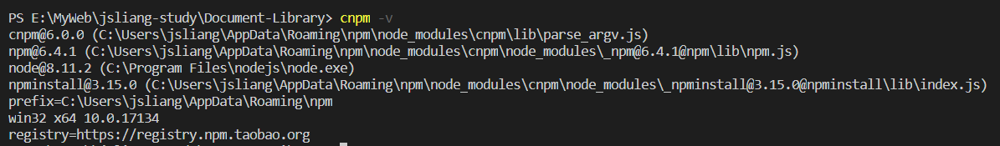

Node
===

> Create by **jsliang** on **2018-11-22 08:21:23**  
> Recently revised in **2018-12-3 22:41:12**

 

# 一 Node 目录

| 目录      |
| --------- |
| [Node 导言](https://github.com/LiangJunrong/document-library/blob/master/other-library/Node/README.md) |
| [Node 基础](https://github.com/LiangJunrong/document-library/blob/master/other-library/Node/NodeBase.md) |
| [Koa 框架](https://github.com/LiangJunrong/document-library/blob/master/other-library/Node/Koa.md) |

 

# 二 Node 介绍

* **什么是 Node.js？**

&emsp;Node.js 是一个 JavaScript 运行环境(runtime)。它让 JavaScript 可以开发后端程序，实现几乎其他后端语言实现的所有功能。传说中 **能与 PHP、JSP、Python、Ruby 等后端语言平起平坐**。但是，实际上 Node 一般用作中间件。例如：在浏览器端和 Java 端使用 Node 作为中间件，Node 调用 Java 后端发布的接口，同时 Node 可以发布 HTTP 接口给浏览器端调用。  
&emsp;参考链接：[浅谈前后端分离与实践之 nodejs 中间层服务(二) | 知乎](https://zhuanlan.zhihu.com/p/30384677)

 

* **Node 优点？**

1. Node 语法完全是 JS 语法，只要你懂了 JS 基础就可以学会 Node 后端开发。
2. Node 超强的高并发能力。在 Java、PHP 或者 .Net 等服务端语言中，会为每一个客户端的连接创建一个新的线程，而每个线程需要耗费大约 2 MB 内存。也就是说，理论上一个 8GB 的服务器，可以同时连接的最大用户数为 4000 个左右。而 Node 不会为每个客户创建新的线程，仅仅使用一个线程。所以，使用 Node，一个 8GB 的服务器，可以同时处理超过 4 万用户的连接。
3. 实现高性能服务器。Node 基于 V8 引擎，V8 引擎是 Google 公司使用 C++ 开发的一种高性能引擎。这意味着开发者编写的高端 JavaScript 脚本代码与开发者编写的低端的 C 语言具有非常相近的执行效率。
4. 开发周期短、开发成本低、学习成本低。花最小的硬件成本，追求更高的并发，更高的处理性能。

 

* **Node 应用？**

 

# 三 编程开发环境

&emsp;Node 系列教程文章中，需要的前置知识为：**Node**、**npm**、**cnpm**、**Visio Studio Code**。  
&emsp;下面是这些技术的详细介绍：

1. Node.js

&emsp;在开发学习中，我们需要安装配置 Node 的环境。  
&emsp;首先，我们需要先下载 Node 并安装到我们的电脑上。  
&emsp;然后，我们需要了解 Node 与 NPM 之间的关系。  
&emsp;最后，由于 npm 在国内有一定限制，所以，我们需要换成淘宝的 npm 镜像：cnpm，从而提高我们的 npm 包的下载安装速度。  
&emsp;个中繁杂，由于系统还要考虑 Win、Mac 等缘故，这里不一一累述，请小伙伴们按照下面的链接先行安装 Node，不明之处可去百度或者 Google。

* [Node 下载 | Node.js 中文网](http://nodejs.cn/download/)
* [Node 安装步骤 | 菜鸟教程](https://www.runoob.com/nodejs/nodejs-install-setup.html)
* [Node 与 Npm | 廖雪峰](https://www.liaoxuefeng.com/wiki/001434446689867b27157e896e74d51a89c25cc8b43bdb3000/00143450141843488beddae2a1044cab5acb5125baf0882000)
* [cnpm | 淘宝 NPM 镜像](https://npm.taobao.org/)

&emsp;最后的最后，如果小伙伴们觉得环境装好了，请输入 `cnpm -v` 查看自己的版本，**jsliang** 的 Node、Npm、Cnpm 版本如下。

 

2. Visio Studio Code

&emsp;如果你是个前端开发，那么 Visio Studio Code（以下简称 VS Code）一定不能错过，因为这是一款轻量级的代码编辑器，支持语法高亮、智能代码补全、自定义热键、括号匹配、代码片段、代码对比 Diff、GIT 等特性。所以，下个 VS Code 愉快玩耍吧！

* [Visio Studio Code 安装 | 官网](https://code.visualstudio.com/)
* [Visio Studio Code 安装及使用技巧 | 博客园](https://www.cnblogs.com/huyong/p/4573041.html)

 

# 四 技术支撑

* [IT 营](https://www.itying.com)
* [IT 营 Node.js Koa2 视频教程 avi 版本（课件+源码+视频）](https://www.itying.com/goods-240.html)

 

>  <a xmlns:dct="http://purl.org/dc/terms/" property="dct:title">**jsliang** 的文档库</a> 由 <a xmlns:cc="http://creativecommons.org/ns#" href="https://github.com/LiangJunrong/document-library" property="cc:attributionName" rel="cc:attributionURL">梁峻荣</a> 采用 <a rel="license" href="http://creativecommons.org/licenses/by-nc-sa/4.0/">知识共享 署名-非商业性使用-相同方式共享 4.0 国际 许可协议</a>进行许可。 基于<a xmlns:dct="http://purl.org/dc/terms/" href="https://github.com/LiangJunrong/document-library" rel="dct:source">https://github.om/LiangJunrong/document-library</a>上的作品创作。 本许可协议授权之外的使用权限可以从 <a xmlns:cc="http://creativecommons.org/ns#" href="https://creativecommons.org/licenses/by-nc-sa/2.5/cn/" rel="cc:morePermissions">https://creativecommons.org/licenses/by-nc-sa/2.5/cn/</a> 处获得。
