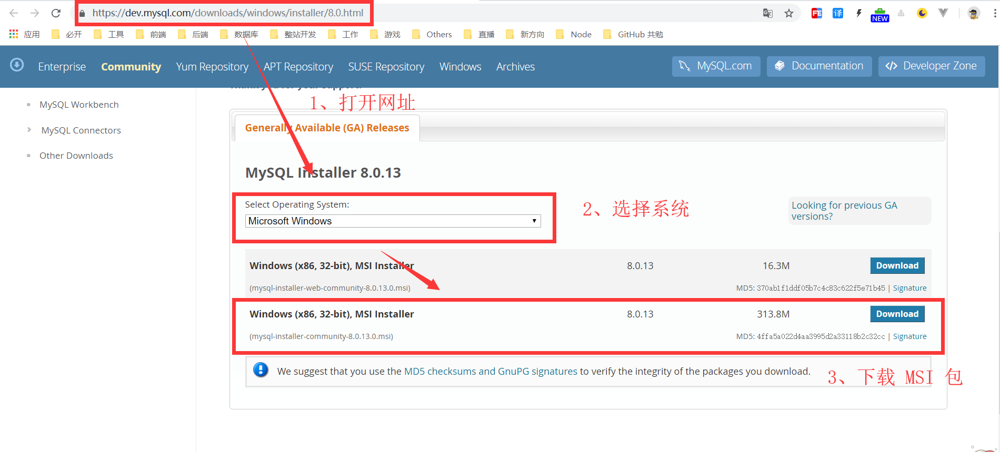
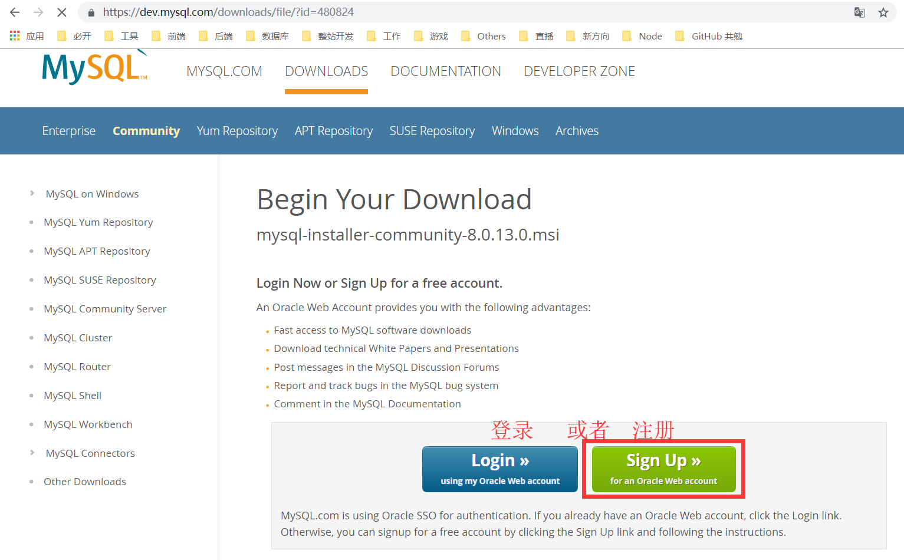
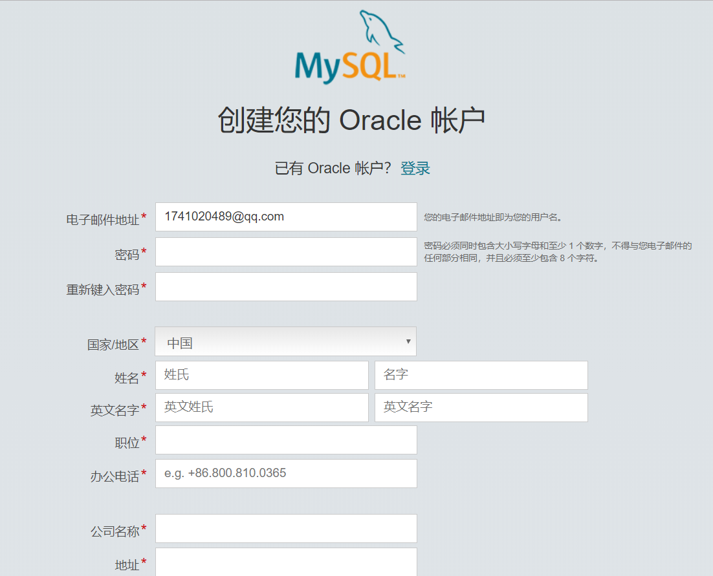

MySQL
===

> Create by **jsliang** on **2018-12-13 08:49:41**  
> Recently revised in **2018-12-13 08:54:57**

 

# <a name="chapter-one" id="chapter-one">一 目录</a>

&emsp;**不折腾的前端，和咸鱼有什么区别**

| 目录 |                                                                             
| --- | 
| [一 目录](#chapter-one) | 
| [二 前言](#chapter-two) |
| [三 下载](#chapter-three) |
| [四 安装](#chapter-four) |
| [五 总结](#chapter-five) |

 

# <a name="chapter-two" id="chapter-two">二 前言</a>

> [返回目录](#chapter-one)

 

&emsp;MySQL 是什么呢？MySQL 是最流行的关系数据库管理系统之一，体积小、速度快、总体成本低的缘故导致中小型网站的开发都乐意选用 MySQL。  
&emsp;Long long ago，**jsliang** 曾经学习过 SQLserver，那时候纯粹用 SQL 语句建表，各种秀……后来，为了应付毕设，囫囵吞枣，学习了 MongoDB，用 Node 连接它进行操作。当然，关系型数据库和非关系型数据库的区别将我折腾地体无完肤。  
&emsp;最近要学习 Node 基础，思来想去考虑一番，还是打算连接 MySQL，无他，因为正经学过关系型数据库而已。  

 

# <a name="chapter-three" id="chapter-three">三 下载</a>

> [返回目录](#chapter-one)

 

&emsp;在这里，咱是用 Window 系统进行的下载安装，各位看官如果是用 Mac 或者其他，请看：

* [Window 安装 MySQL 全攻略 | 博客园 - Smile_Coding](https://www.cnblogs.com/ayyl/p/5978418.html)
* [Linux 安装 MySQL | 百度经验](https://jingyan.baidu.com/article/fec7a1e5f8d3201190b4e782.html)

&emsp;如果上面两篇都无法满足大佬需求，请自行百度或者 google。

&emsp;那么下面开始安装：

1. 直接打开 MySQL 下载页面：[地址](https://dev.mysql.com/downloads/mysql/)
2. 选择系统 Windows
3. 点击下载 MSI 安装包

&emsp;然后，它会弹出窗口告诉你，需要登录或者注册：

&emsp;**jsliang** 没有自己的账号，所以需要注册，但是点开注册页面，发现自己又不想注册了（太多账号了！不想再搞事情了），所以咱直接下载比较旧的版本吧：

* [MySQL 版本5.7 MSI 安装包](http://cdn.mysql.com//Downloads/MySQLInstaller/mysql-installer-community-5.7.16.0.msi)

> 最新版本是 8.0.13

&emsp;

 

# <a name="chapter-four" id="chapter-four">四 安装</a>

> [返回目录](#chapter-one)

 

&emsp;

 

# <a name="chapter-five" id="chapter-five">五 总结</a>

> [返回目录](#chapter-one)

 

&emsp;

 

>  <a xmlns:dct="http://purl.org/dc/terms/" property="dct:title">**jsliang** 的文档库</a> 由 <a xmlns:cc="http://creativecommons.org/ns#" href="https://github.com/LiangJunrong/document-library" property="cc:attributionName" rel="cc:attributionURL">梁峻荣</a> 采用 <a rel="license" href="http://creativecommons.org/licenses/by-nc-sa/4.0/">知识共享 署名-非商业性使用-相同方式共享 4.0 国际 许可协议</a>进行许可。 基于<a xmlns:dct="http://purl.org/dc/terms/" href="https://github.com/LiangJunrong/document-library" rel="dct:source">https://github.om/LiangJunrong/document-library</a>上的作品创作。 本许可协议授权之外的使用权限可以从 <a xmlns:cc="http://creativecommons.org/ns#" href="https://creativecommons.org/licenses/by-nc-sa/2.5/cn/" rel="cc:morePermissions">https://creativecommons.org/licenses/by-nc-sa/2.5/cn/</a> 处获得。