微信小程序 bug 集中营
===

> Create by **jsliang** on **2018-9-17 17:58:56**  
> Recently revised in **2018-11-21 11:40:01**

<br>

&emsp;**Hello 小伙伴们，如果觉得本文还不错，记得给个 **star** ， 你们的 **star** 是我学习的动力！[GitHub 地址](https://github.com/LiangJunrong/document-library/blob/master/other-library/WeChatApplet/WeChatAppletBug.md)**

# 写在前面

&emsp;首个微信小程序实践记录:  
&emsp;工作量: PSD 18 张 (导出的 JPG 30 张)  
&emsp;耗时：12 个工作日  
&emsp;总结1: 在页面制作商，需要 3 周工作日（工作 15 天）搞定，前后端对接口另计。实际上，12 个工作日可以搞定所有页面，但是应该往前铺 1.5D 熟悉框架，往后铺 1.5D 整理代码。当然每个人的耗时可能不同，可根据个人实际情况进行调整。  
&emsp;总结2：在 API 调用上，根据接口数量可能需要 7-12 个工作日进行 API 调用，难点表现在： 
1. 接口不够丰富，数据量不足； 
2. 接口数据不够正式真实，跟前面的假数据相差太大； 
3. 接口可能没法正常调用 等原因。故因根据小程序业务逻辑进行工作时长的报备。  

&emsp;**这里有 jsliang 微信小程序开发中遇到的所有坑，以及在填坑过程中的一些个人经验。jsliang 利用这篇教程存储一些常用的微信小程序开发技巧，方便查找。它可能教不了你什么，但至少能省下你百度的功夫。**  

&emsp;**请结合 《目录》 和 《返回目录》 来进行跳转，获得更好的阅读体验。**  


&emsp;本文技术支持：**Ansen江**

&emsp;**注1：由于更新频繁，有时候平台上的文章版本可能没有图片或者目录无法跳转，所以小伙伴需要获取最新资料的，请前往 GitHub：[地址](https://github.com/LiangJunrong/document-library/blob/master/other-library/WeChatApplet/WeChatAppletBug.md)**

&emsp;**注2：如果小伙伴使用的是手机版打开，那么推荐小伙伴使用电脑打开，因为各平台的手机端大都不支持页内跳转，看起来比较费劲。**

<br>

# <a name="chapter-one" id="chapter-one">一 目录</a>

&emsp;目前已有 **48** 个坑。  

> 请各位按目录检索时注意：  
> 3.1、3.2、3.3…… 等二级目录对应着一个章节。  
> 3.1.1、3.1.2、3.1.3…… 等三级目录将该二级目录这个大章节详细拆分成诸多小坑，方便查看。  

<br>

| 目录                                                                                                                                                  | 坑  |
| ----------------------------------------------------------------------------------------------------------------------------------------------------- | --- |
| [一 目录](#chapter-one)                                                                                                                               |     |
| <a name="catalog-chapter-two" id="catalog-chapter-two"></a>[二 前言](#chapter-two)                                                                    |     |
| <a name="catalog-chapter-three" id="catalog-chapter-three"></a>[三 填坑实战](#chatper-three)                                                          |     |
| &emsp;<a name="catalog-chapter-three-one" id="catalog-chapter-three-one"></a>[3.1 swiper 轮播图](#chapter-three-one)                                  | 5   |
| &emsp;&emsp;[3.1.1 行内样式无效](#chapter-three-one-one)                                                                                              |     |
| &emsp;&emsp;[3.1.2 图片样式修改不了](#chapter-three-one-two)                                                                                          |     |
| &emsp;&emsp;[3.1.3 swiper 属性值设置](#chapter-three-one-three)                                                                                       |     |
| &emsp;&emsp;[3.1.4 轮播图图片跳转](#chapter-three-one-four)                                                                                           |     |
| &emsp;&emsp;[3.1.5 wx:key](#chapter-three-one-five)                                                                                                   |     |
| &emsp;&emsp;[3.1.6 实战代码](#chapter-three-one-six)                                                                                                  |     |
| &emsp;<a name="catalog-chapter-three-two" id="catalog-chapter-three-two"></a>[3.2 tabBar 与 switchTab](#chapter-three-two)                            | 3   |
| &emsp;&emsp;[3.2.1 底部导航跳转](#chapter-three-two-one)                                                                                              |     |
| &emsp;&emsp;[3.2.2 自定义底部导航](#chapter-three-two-two)                                                                                            |     |
| &emsp;&emsp;[3.2.3 自定义组件](#chapter-three-two-three)                                                                                              |     |
| &emsp;<a name="catalog-chapter-three-three" id="catalog-chapter-three-three"></a>[3.3 px、rem 与 rpx](#chapter-three-three)                           | 1   |
| &emsp;<a name="catalog-chapter-three-four" id="catalog-chapter-three-four"></a>[3.4 微信 web 开发者工具](#chapter-three-four)                         | 2   |
| &emsp;&emsp;[3.4.1 无法输入中文](#chapter-three-four-one)                                                                                             |     |
| &emsp;&emsp;[3.4.2 无法滑动滚轮](#chapter-three-four-two)                                                                                             |
| &emsp;<a name="catalog-chapter-three-five" id="catalog-chapter-three-five"></a>[3.5 组件与 API](#chapter-three-five)                                  | 2   |
| &emsp;&emsp;[3.5.1 概念混淆：组件 VS API](#chapter-three-five-one)                                                                                    |     |
| &emsp;&emsp;[3.5.2 API 查询不到对应的方法](#chapter-three-five-two)                                                                                   |
| &emsp;<a name="catalog-chapter-three-six" id="catalog-chapter-three-six"></a>[3.6 flex 布局](#chapter-three-six)                                      | 2   |
| &emsp;&emsp;[3.6.1 基础概念](#chapter-three-six-one)                                                                                                  |     |
| &emsp;&emsp;[3.6.2 左右布局](#chapter-three-six-two)                                                                                                  |     |
| &emsp;&emsp;[3.6.3 混合布局](#chapter-three-six-three)                                                                                                |     |
| &emsp;<a name="catalog-chapter-three-seven" id="catalog-chapter-three-seven"></a>[3.7 background-image 套用本地图片无效](#chapter-three-seven)        | 1   |
| &emsp;<a name="catalog-chapter-three-eight" id="catalog-chapter-three-eight"></a>[3.8 \<block\> 与 \<view\>](#chapter-three-eight)                    | 1   |
| &emsp;<a name="catalog-chapter-three-night" id="catalog-chapter-three-night"></a>[3.9 搜索框](#chapter-three-night)                                   | 2   |
| &emsp;&emsp;[3.9.1 margin-top 无法上浮](#chapter-three-night-one)                                                                                     |     |
| &emsp;&emsp;[3.9.2 改造 WeUI 搜索框](#chapter-three-night-two)                                                                                        |     |
| &emsp;<a name="catalog-chapter-three-ten" id="catalog-chapter-three-ten"></a>[3.10 微信小程序分享](#chapter-three-ten)                                | 1   |
| &emsp;<a name="catalog-chapter-three-eleven" id="catalog-chapter-three-eleven"></a>[3.11 border-box 设置](#chapter-three-eleven)                      | 1   |
| &emsp;<a name="catalog-chapter-three-twelve" id="catalog-chapter-three-twelve"></a>[3.12 自定义导航条](#chapter-three-twelve)                         | 6   |
| &emsp;&emsp;[3.12.1 WeUI 选项卡](#chapter-three-twelve-one)                                                                                           |     |
| &emsp;&emsp;[3.12.2 自定义选项卡效果与实现](#chapter-three-twelve-two)                                                                                |     |
| &emsp;&emsp;[3.12.3 绑定事件如何传递数据](#chapter-three-twelve-three)                                                                                |     |
| &emsp;&emsp;[3.12.4 不允许驼峰](#chapter-three-twelve-four)                                                                                           |     |
| &emsp;&emsp;[3.12.5 获取 data 数据](#chapter-three-twelve-five)                                                                                       |     |
| &emsp;&emsp;[3.12.6 实现文字省略](#chapter-three-twelve-six)                                                                                          |     |
| &emsp;<a name="catalog-chapter-three-thirteen" id="catalog-chapter-three-thirteen"></a>[3.13 黑科技：\<modal\>](#chapter-three-thirteen)              | 2   |
| &emsp;&emsp;[3.13.1 被遗弃的 \<modal\>](#chapter-three-thirteen-one)                                                                                  |     |
| &emsp;&emsp;[3.13.2 四种弹窗写法](#chapter-three-thirteen-two)                                                                                        |     |
| &emsp;<a name="catalog-chapter-three-fourteen" id="catalog-chapter-three-fourteen"></a>[3.14 小程序解析 HTML](#chapter-three-fourteen)                | 6   |
| &emsp;&emsp;[3.14.1 解析 HTML 的三种方法](#chapter-three-fourteen-one)                                                                                |     |
| &emsp;&emsp;[3.14.2 wxParse](#chapter-three-fourteen-two)                                                                                             |     |
| &emsp;&emsp;[3.14.3 rich-text](#chapter-three-fourteen-three)                                                                                         |     |
| &emsp;&emsp;[3.14.4 web-view](#chapter-three-fourteen-four)                                                                                           |     |
| &emsp;<a name="catalog-chapter-three-fifteen" id="catalog-chapter-three-fifteen"></a>[3.15 诡异的 open-type](#chapter-three-fifteen)                  | 1   |
| &emsp;<a name="catalog-chapter-three-sixteen" id="catalog-chapter-three-sixteen"></a>[3.16 \<button\>去样式及其内嵌\<image\>](#chapter-three-sixteen) | 1   |
| &emsp;<a name="catalog-chapter-three-seventeen" id="catalog-chapter-three-seventeen"></a>[3.17 下拉刷新和上拉加载](#chapter-three-seventeen)          | 2   |
| &emsp;<a name="catalog-chapter-three-eighteen" id="catalog-chapter-three-eighteen"></a>[3.18 获取 input 的值](#chapter-three-eighteen)                | 1   |
| &emsp;<a name="catalog-chapter-three-nighteen" id="catalog-chapter-three-nighteen"></a>[3.19 onLaunch 加载问题](#chapter-three-nighteen)              | 2   |
| &emsp;&emsp;[3.19.1 小程序执行顺序](#chapter-three-nighteen-one)                                                                                      |     |
| &emsp;&emsp;[3.19.2 路由守卫](#chapter-three-nighteen-two)                                                                                            |     |
| &emsp;<a name="catalog-chapter-three-twenty" id="catalog-chapter-three-twenty"></a>[3.20 request 封装与 api 抽离](#chapter-three-twenty)              | 1   |
| &emsp;<a name="catalog-chapter-three-twenty-one" id="catalog-chapter-three-twenty-one"></a>[3.21 判断数据是否读取完](#chapter-three-twenty-one)       | 1   |
| &emsp;<a name="catalog-chapter-three-twenty-two" id="catalog-chapter-three-twenty-two"></a>[3.22 客服系统研究](#chapter-three-twenty-two)             | 1   |
| &emsp;<a name="catalog-chapter-three-twenty-three" id="catalog-chapter-three-twenty-three"></a>[3.23 文件在线预览](#chapter-three-twenty-three)       | 2   |
| &emsp;<a name="catalog-chapter-three-twenty-four" id="catalog-chapter-three-twenty-four"></a>[3.24 尽量使用 ES6](#chapter-three-twenty-four)          | 1   |
| &emsp;<a name="catalog-chapter-three-twenty-five" id="catalog-chapter-three-twenty-five"></a>[3.25 视频功能实现](#chapter-three-twenty-five)          | 1   |
| &emsp;<a name="catalog-chapter-three-twenty-six" id="catalog-chapter-three-twenty-six"></a>[3.26 多层 for 循环](#chapter-three-twenty-six)          | 1   |
| &emsp;<a name="catalog-chapter-three-twenty-seven" id="catalog-chapter-three-twenty-seven"></a>[3.27 拼音导航](#chapter-three-twenty-seven)          | 1   |
| <a name="catalog-chapter-four" id="catalog-chapter-four"></a>[四 网友补充](#chatper-four)                                                             |     |
| &emsp;<a name="catalog-chapter-four-one" id="catalog-chapter-four-one"></a>[4.1 文件夹读取报错](#chapter-four-one)                                    | 1   |
| &emsp;<a name="catalog-chapter-four-two" id="catalog-chapter-four-two"></a>[4.2 textarea问题多多](#chapter-four-two)                                  | 1   |

<br>

# <a name="chapter-two" id="chapter-two">二 前言</a>

&emsp;[返回目录](#catalog-chapter-two)

> 本文章原名【微信小程序 100 坑】

&emsp;微信小程序的开发教程，或许写出来是非常受欢迎的。  
&emsp;但是：
* 第一，微信小程序是国内的，有[中文文档](https://developers.weixin.qq.com/miniprogram/dev/index.html)，虽然它的文档说明有点坑，但好歹有文档，阅读理解对小伙伴们来说不是问题。
* 第二， **jsliang** 的文笔并没有想象中的那么好，想想如果我带你们走了一遍小程序开发，然后你们以为是一条平坦路，结果碰到一堆坑坑洼洼，咋办？最后的锅，会不会到我背啊，可怕！  

&emsp;所以，在这里， **jsliang** 结合 **“日常躺坑”** ，先为你解决小程序的 100 个坑！虽然现在可能还不够，但是第一天我就碰到 4/5 个了，我想我可以帮你们躺完 100 个的！！！  
&emsp;现在的微信开发者工具显示的开发版本是：`"libVersion": "2.0.4"`  
&emsp;如果你开发的版本已经解决了这个 bug ，或者你觉得这个 bug 还有其他解决方法，或者你觉得这个玩意还有其他 bug ，请告诉我，我会补充到这篇文档上，顺带记上您的大名，谢谢！  
&emsp;**QQ： 1741020489**  

<br>

# <a name="chatper-three" id="chatper-three">三 填坑实战</a>

&emsp;[返回目录](#catalog-chapter-three)

&emsp;这里的坑：
* 有的来源于微信自带的开发文档：[小程序开发文档](https://developers.weixin.qq.com/miniprogram/dev/component/)。在文档中，你会发现很多的乐趣！毕竟，你不知道什么时候中文成为了你的语言障碍~  
* 有的是开发中遇到的，然后结合大量的百度结果，进行的有效性总结。

&emsp;希望小伙伴在百度中或者无意看到这篇文章，请熟练使用浏览器的 `Ctrl + F`，查找需要的问题答案。

<br>

## <a name="chapter-three-one" id="chapter-three-one">3.1 swiper 轮播图</a>

&emsp;[返回目录](#catalog-chapter-three-one)

> 本组件目前已有 5 个坑，有兴趣的小伙伴可以详看。

<br>

&emsp; 代码来源于该地址：[微信组件 swiper](https://developers.weixin.qq.com/miniprogram/dev/component/swiper.html) 。  

&emsp;为方便小伙伴查看，下面贴出原版代码：
> demo.wxml
```
<swiper indicator-dots="{{indicatorDots}}"
  autoplay="{{autoplay}}" interval="{{interval}}" duration="{{duration}}">
  <block wx:for="{{imgUrls}}">
    <swiper-item>
      <image src="{{item}}" class="slide-image" width="355" height="150"/>
    </swiper-item>
  </block>
</swiper>
<button bindtap="changeIndicatorDots"> indicator-dots </button>
<button bindtap="changeAutoplay"> autoplay </button>
<slider bindchange="intervalChange" show-value min="500" max="2000"/> interval
<slider bindchange="durationChange" show-value min="1000" max="10000"/> duration
```

<br>

> demo.js
```
Page({
  data: {
    imgUrls: [
      'http://img02.tooopen.com/images/20150928/tooopen_sy_143912755726.jpg',
      'http://img06.tooopen.com/images/20160818/tooopen_sy_175866434296.jpg',
      'http://img06.tooopen.com/images/20160818/tooopen_sy_175833047715.jpg'
    ],
    indicatorDots: false,
    autoplay: false,
    interval: 5000,
    duration: 1000
  },
  changeIndicatorDots: function(e) {
    this.setData({
      indicatorDots: !this.data.indicatorDots
    })
  },
  changeAutoplay: function(e) {
    this.setData({
      autoplay: !this.data.autoplay
    })
  },
  intervalChange: function(e) {
    this.setData({
      interval: e.detail.value
    })
  },
  durationChange: function(e) {
    this.setData({
      duration: e.detail.value
    })
  }
})
```
<br>

&emsp;好的，上面就是微信官方文档的演示代码，如果你跟着演示代码走了一遍碰到疑问的话，看看这里我挖的土是不是能填好你的坑：

<br>

### <a name="chapter-three-one-one" id="chapter-three-one-one">3.1.1 行内样式无效</a>

&emsp;[返回目录](#catalog-chapter-three-one)

&emsp;`demo.wxml` 中出现的 `<image src="{{item}}" class="slide-image" width="355" height="150"/>` 这行， `width` 和 `height` 的行内属性是忽悠老百姓的，**它并没卵用** ！我们需要在 `slide-image` 这个 `class` 类中修改 `width` 和 `height`。简而言之，行内样式都是骗人的，乖，我们还是去 `demo.wxss` 写样式吧~

<br>

### <a name="chapter-three-one-two" id="chapter-three-one-two">3.1.2 图片样式修改不了</a>

&emsp;[返回目录](#catalog-chapter-three-one)

&emsp;在任何出现图片的地方（包括但不限于轮播图），如果你发现不仅行内写法无效之外，还发现单纯地给图片加 `class`，去 `*.wxss` 写样式也无效的话。那么，我建议小伙伴最好采用样式加重法，即 `.image-wrap .image` 这种写法格式，来确保图片样式能进行修改。详细用法可看下文。

<br>

### <a name="chapter-three-one-three" id="chapter-three-one-three">3.1.3 swiper 属性值设置</a>

&emsp;[返回目录](#catalog-chapter-three-one)

&emsp;`swiper` 属性值。官方文档说明：

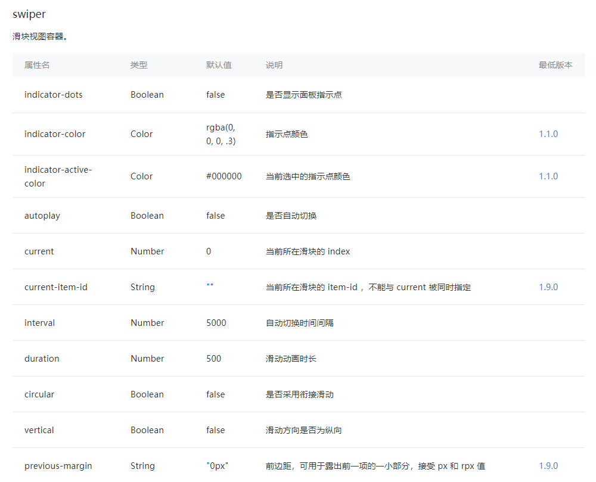

&emsp;虽然，它的属性名和属性值是这么说的。但是，用的时候，首先你需要在 `demo.wxml` 中的 `swiper` 绑定这个属性名，然后在 `demo.js` 中设置其属性值。值得注意的是，它的绑定值，稍微不同于 `Vue`， 需要设置 `{{}}` 形式。如果文字描述你看得不是很清楚，可以参照下面的代码进行理解。

<br>

### <a name="chapter-three-one-four" id="chapter-three-one-four">3.1.4 轮播图图片跳转</a>

&emsp;[返回目录](#catalog-chapter-three-one)

&emsp;关于轮播图的地址跳转，在微信小程序的官网是没用提及的，也是 **jsliang** 去百度查看了下，才知道怎么设置（可能是我一开始就挑战的难度太高了么 -_-|| ），在下面 **jsliang** 贴出来代码~想知道怎么解决的可以去看看：首先，在 `data` 中设置 `link` ；然后，设置 `navigator` 导航遍历 `item.link` 。

<br>

### <a name="chapter-three-one-five" id="chapter-three-one-five">3.1.5 wx:key</a>

&emsp;[返回目录](#catalog-chapter-three-one)

&emsp;关于 `wx:key` ， `wx:key` 的作用是：当数据改变触发渲染层重新渲染的时候，会校正带有 key 的组件，框架会确保他们被重新排序，而不是重新创建，以确保使组件保持自身的状态，并且提高列表渲染时的效率。但是，在其 `swiper` 中，小程序本身是没有写的，所以它会带有 `warning` ，这里也是个小坑， **jsliang** 也是百度了下也知道这件事：[点我了解](https://www.sohu.com/a/207728111_99897596)。

<br>

### <a name="chapter-three-one-six" id="chapter-three-one-six">3.1.6 实战代码</a>

&emsp;[返回目录](#catalog-chapter-three-one)

&emsp;下面给出这 5 个坑的解决代码，如有不对，尽情指出：

> index.wxml
```
<view class="carousel">
  <swiper indicator-dots="{{indicatorDots}}" autoplay="{{autoplay}}" interval="{{interval}}" duration="{{duration}}" indicator-color="#707071" indicator-active-color="#fff" circular="true">
    <!-- wx:key ： 提高列表渲染效率 -->
    <block wx:for="{{imgUrls}}" wx:key="{{item.index}}">
      <swiper-item>
        <navigator url="{{item.link}}" hover-class="navigator-hover">
          <image src="{{item.url}}" class="slide-image" />
        </navigator>
      </swiper-item>
    </block>
  </swiper>
</view>
```

<br>

> index.wxss
```
.carousel .slide-image {
  width: 100%;
  height: 420rpx;
}
```

<br>

> index.js
```
Page({
  data: {
    imgUrls: [
      {
        link: '../index/index',
        url: 'http://img02.tooopen.com/images/20150928/tooopen_sy_143912755726.jpg',
      },
      {
        link: '../demo/demo',
        url: 'http://img06.tooopen.com/images/20160818/tooopen_sy_175866434296.jpg',
      },
      {
        link: '../logs/logs',
        url: 'http://img02.tooopen.com/images/20150928/tooopen_sy_143912755726.jpg'
      }
    ],
    indicatorDots: true,
    autoplay: true,
    interval: 5000,
    duration: 1000
  }
})
```

<br>

## <a name="chapter-three-two" id="chapter-three-two">3.2 tabBar 与 switchTab</a>

&emsp;[返回目录](#catalog-chapter-three-two)

> 本组件目前已有 3 个坑，有兴趣的小伙伴可以详看。

&emsp;tabBar ：底部菜单栏，需要在 `app.json` 中设置。使用方法：见下文。  
&emsp;navigator ：导航切换。使用方法：[地址](https://blog.csdn.net/u013778905/article/details/59141486)  
&emsp;switchTab ：控制 tabBar 的切换。使用方法：[地址](https://blog.csdn.net/liona_koukou/article/details/53930045)

<br>

### <a name="chapter-three-two-one" id="chapter-three-two-one">3.2.1 底部导航跳转</a>

&emsp;[返回目录](#catalog-chapter-three-two)

&emsp;在这里，我们讲下 `tabBar` 的坑，如果你在 `app.json` 中设置了 `tabBar` ：
> app.json
```
"tabBar": {
    "list": [{
      "pagePath": "pages/index/index",
      "text": "首页",
      "iconPath": "./public/index_tabBar1_nor.png",
      "selectedIconPath": "./public/index_tabBar1.png"
    }, {
      "pagePath": "pages/demo/demo",
      "text": "发现",
      "iconPath": "./public/index_tabBar2_nor.png",
      "selectedIconPath": "./public/index_tabBar2.png"
    }, {
      "pagePath": "pages/logs/logs",
      "text": "我的",
      "iconPath": "./public/index_tabBar3_nor.png",
      "selectedIconPath": "./public/index_tabBar3.png"
    }]
  }
```

<br>

&emsp;那么，我们就需要通过设置 `switchTab` 来控制底部导航的跳转，而不能通过 `navigator` 来跳转：
> demo.wxml
```
<view>
  <button bindtap="linkTo">Hello</button>
</view>
```

<br>

> demo.js
```
linkTo: function () {
  wx.switchTab({
    url: '../index/index'
  });
},
```

<br>

### <a name="chapter-three-two-two" id="chapter-three-two-two">3.2.2 自定义底部导航</a>

&emsp;[返回目录](#catalog-chapter-three-two)

&emsp;那么问题又来了，当我们切换到子页面的时候，我们发现 `tabBar` 这个底部导航栏不见了，然后问了下 **Ansen江** ，他说之前是整个小程序都有的，有些页面还要想方设法去隐藏。  
&emsp;但是现在嘛……它没了！没了啊！！！在微信小程序的文档没看到有唤起底部导航条的方法，难道我要做一个导航条了么 -_-||   
&emsp;回答是：yes！  
&emsp;所以，下面给出该底部导航条 `tabBar` 的实现情况和代码片段：

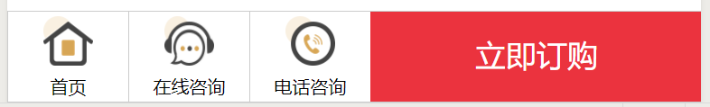

> 注：图片宽高均为 54rpx

> *.wxml
```
<view class="nav">
  <view class="nav-home" bindtap="goHome">
    <image src="../../public/index_productDetail_icon_home.png"></image>
    <text>首页</text>
  </view>
  <view class="nav-service">
    <image src="../../public/index_productDetail_icon_service.png"></image>
    <text>在线咨询</text>
  </view>
  <view class="nav-phone" bindtap="callWaiter">
    <image src="../../public/index_productDetail_icon_phone.png"></image>
    <text>电话咨询</text>
  </view>
  <navigator url="../indexPurchaseProduct/indexPurchaseProduct">
    <view class="nav-buy">
      <text>立即订购</text>
    </view>
  </navigator>
</view>
```

<br>

> *.wxss
```
.nav {
  display: flex;
  justify-content: space-around;
  font-size: 20rpx;
  border: 1px solid #ccc;
  position: fixed;
  bottom: 0;
  background: #fff;
}
.nav view {
  display: flex;
  flex-direction: column;
  align-items: center;
}
.nav image {
  width: 54rpx;
  height: 54rpx;
}
.nav text {
  margin-top: 7rpx;
}
.nav-home {
  border-right: 1px solid #ccc;
  width: 130rpx;
  padding-top: 5rpx;
}
.nav-service {
  border-right: 1px solid #ccc;
  width: 130rpx;
  padding-top: 5rpx;
}
.nav-phone {
  width: 130rpx;
  padding-top: 5rpx;
}
.nav-buy {
  background: #eb333e;
  color: #fff;
  width: 360rpx;
  height: 98rpx;
  line-height: 80rpx;
  font-size: 34rpx;
}
```

<br>

> *.js
```
callWaiter: function(res) {
  wx.makePhoneCall({
    phoneNumber: '13264862250',
    success: function(res) {
      console.log("拨打成功");
      console.log(res);
    },
    fail: function(res) {
      console.log("拨打失败");
      console.log(res);
    },
    complete: function(res) {
      console.log("拨打完成");
      console.log(res);
    }
  })
},
goHome: function() {
  wx.switchTab({
    url: '../index/index'
  })
},
```

<br>

### <a name="chapter-three-two-three" id="chapter-three-two-three">3.2.3 自定义组件</a>

&emsp;[返回目录](#catalog-chapter-three-two)

&emsp;在最近的工作中，又发现一个小问题：

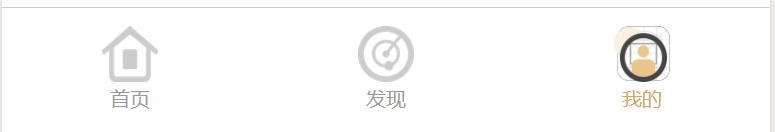

&emsp;像这个导航条，它需要根据页面所在的模块，动态地展示不同位置的状态为活跃，而且它是需要在多个页面重复出现的，如果每个页面我都要复制粘贴一遍，到时候要修改起来的时候，麻烦不说，最重要的是，它可能影响我前端的性能了，能不能直接将其封装起来呢？

&emsp;自定义组件：[链接](https://developers.weixin.qq.com/miniprogram/dev/framework/custom-component/)

&emsp;是的，发现在小程序文档中是存在这个东西的。当然，至于过程中我百度了几篇文章来辅助写出下面的代码，你猜？

&emsp;子组件写法

> navBar.wxml

```
<!-- 底部导航条 -->
<view class="navBar">
  <view class="navBar-home" bindtap='goHome'>
    <image wx:if="{{homeActive}}" src="../../public/index_tabBar1.png"></image>
    <image wx:if="{{!homeActive}}" src="../../public/index_tabBar1_nor.png"></image>
    <text>首页</text>
  </view>
  <view class="navBar-explore" bindtap='goExplore'>
    <image wx:if="{{exploreActive}}" src="../../public/index_tabBar2.png"></image>
    <image wx:if="{{!exploreActive}}" src="../../public/index_tabBar2_nor.png"></image>
    <text>发现</text>
  </view>
  <view class="navBar-user" bindtap='goUser'>
    <image wx:if="{{userActive}}" src="../../public/index_tabBar3.png"></image>
    <image wx:if="{{!userActive}}" src="../../public/index_tabBar3_nor.png"></image>
    <text>我的</text>
  </view>
</view>
```

<br>

> navBar.wxss

```
/* 底部导航条 */
.navBar {
  width: 100%;
  padding: 18rpx 0;
  border-top: 1rpx solid #cccccc;
  display: flex;
  justify-content: space-around;
  position: fixed;
  bottom: 0;
  background: #fff;
}
.navBar image {
  width: 55rpx;
  height: 55rpx;
}
.navBar view {
  display: flex;
  flex-direction: column;
  align-items: center;
  font-size: 20rpx;
  color: #999999;
}
.navBar-user text {
  color: #d0a763;
}
```

<br>

> navBar.js

```
// pages/componentNavBar/navBar.js
Component({
  /**
   * 组件的属性列表
   */
  properties: {
    homeActive: {
      type: Boolean,
      value: false
    },
    exploreActive: {
      type: Boolean,
      value: false
    },
    userActive: {
      type: Boolean,
      value: false
    }
  },

  /**
   * 组件的初始数据
   */
  data: {

  },

  /**
   * 组件的方法列表
   */
  methods: {
    // 返回首页
    goHome: function (e) {
      wx.switchTab({
        url: '../index/index',
      })
    },
    // 返回发现页 
    goExplore: function (e) {
      wx.switchTab({
        url: '../explore/explore',
      })
    },
    // 返回我的页面
    goUser: function (e) {
      wx.switchTab({
        url: '../user/user',
      })
    },
    showCode: function(e) {
      console.log(e);
      let that = this;
      console.log(that.data);
    }
  }
})

```

<br>

> navBar.json

```
{
  "component": true,
  "usingComponents": {}
}
```

<br>

&emsp;然后，在父组件的使用，只需要：

> *.wxml

```
<view>
  <navBar userActive="{{userActive}}"></navBar>
</view>
```

<br>

> *.json

```
{
  "usingComponents": {
    "navBar": "../componentNavBar/navBar"
  }
}
```

<br>

> *.js

```
data: {
  userActive: true
},
```

<br>

&emsp;怎样？这就是自定义组件的写法，是不是觉得特好用涅，一次写完，终身受用。

<br>

## <a name="chapter-three-three" id="chapter-three-three">3.3 px、rem 与 rpx</a>

&emsp;[返回目录](#catalog-chapter-three-three)

> 本节目前已有1个坑，有兴趣的小伙伴可以详看。

&emsp;在微信中，它自带了一套属于自己的单位：`rpx` ， `rpx` 不同于之前我们认识的 `px` 、 `rem` 、 `em` ，如果你的设计稿是 750 px 的，那么很容易的， 1px = 1rpx ，但是，如果设计稿不是 750 px ，那么将造成一个 bug ，至于这个 bug 如何解决……  
&emsp;-_-|| 谁知道呢……要不先把UI设计师宰了？  
&emsp;知识补充：[关于 rpx](http://www.51xuediannao.com/javascript/xiaochengxu_rpx.html) 。

<br>

## <a name="chapter-three-four" id="chapter-three-four">3.4 微信 web 开发者工具</a>

&emsp;[返回目录](#catalog-chapter-three-four)

> 本节目前已有 2 个坑，有兴趣的小伙伴可以详看。

<br>

### <a name="chapter-three-four-one" id="chapter-three-four-one">3.4.1 无法输入中文</a>

&emsp;[返回目录](#catalog-chapter-three-four)

&emsp;如果你在开发过程中，发现只能写英文了，而中文无法输入了，千万别急，也别怪输入法出 bug 了，你只需要：重启开发工具。

<br>

### <a name="chapter-three-four-two" id="chapter-three-four-two">3.4.2 无法滑动滚轮</a>

&emsp;[返回目录](#catalog-chapter-three-four)

&emsp;如果你某时刻，突然发现你没法滚动代码进行查看，而是需要拖动滚动条才行，请别怪你的鼠标，你可以去浏览器打开一篇文章看看，enm...你的鼠标还是好的~所以，请：重启开发工具。

<br>

## <a name="chapter-three-five" id="chapter-three-five">3.5 组件与 API</a>

&emsp;[返回目录](#catalog-chapter-three-five)

> 本节目前已有 2 个坑，有兴趣的小伙伴可以详看。

### <a name="chapter-three-five-one" id="chapter-three-five-one">3.5.1 概念混淆：组件 VS API</a>

&emsp;[返回目录](#catalog-chapter-three-five)

&emsp;首先，科普下 组件 与 API 是什么：  
* 组件：对数据和方法的封装，使用组件可以实现拖放式编程、快速的属性处理以及真正的面向对象的设计[【百度百科】](https://baike.baidu.com/item/%E7%BB%84%E4%BB%B6/6902128?fr=aladdin)。那么，可以理解为：开发中常用的一些部件，我们都可以封装起来，然后在需要的时候拿来用，即为组件。
* API：预先定义的函数，提供应用程序与开发人员无需访问源码，基于某软件或硬件得以访问一组例程的能力[【百度百科】](https://baike.baidu.com/item/api/10154)。就是说已经写好的一些 `Function` 或者后端接口，前端直接调用就行了。

&emsp;但是，在微信小程序官方文档中，组件与API，拆分地有点不科学。  
&emsp;例如：**轮播图**与**底部导航条**  
* 一个在组件中，一个在 API 中；  
* 一个在 `wxml` 、 `wxss` 、 `js` 中要设置对应的参数，一个只需要在 `app.json` 中设置就行。  

&emsp;可能微信小程序考虑到**底部导航条**不应该有太大的变化（例如让你修改太多样式或者 `js` ），所以将导航条内嵌至源码中了。  
&emsp;但是，这可能导致什么重要影响吗？是的，如果**底部导航条**需要进行修改呢？例如：[3.2.3 自定义组件](#chapter-three-two-three)。这样的情况下，我们的开发时间就有所增加了。

<br>

### <a name="chapter-three-five-two" id="chapter-three-five-two">3.5.2 API 查询不到对应的方法</a>

&emsp;[返回目录](#catalog-chapter-three-five)

&emsp;如果小伙伴你经常有去看微信小程序官方文档的话，那么你一定会有一件事需要吐槽，那就是：  
&emsp;明明上次我见到过某个 API 实现了我需要做的功能，但是改天我回去查找的时候，它却提示我没有这个玩意，这是什么鬼？！  
&emsp;是的，跟我们 [3.13 黑科技：\<modal\>](#chapter-thirteen) 这一章中讲到的 `<modal>` 这个黑科技一样，有时候官方文档也不是万能的，它总会有这样那样的毛病，导致我们找不到需要的东西，只能去百度了 -_-||

<br>

## <a name="chapter-three-six" id="chapter-three-six">3.6 flex 布局</a>

&emsp;[返回目录](#catalog-chapter-three-six)

> 本节目前已有 3 个坑，有兴趣的小伙伴可以详看。

&emsp;Flex布局又称弹性布局，在小程序开发中比较适用。但是由于 **jsliang** 之前没怎么用过 Flex 布局，所以在这里咱们特意去踩下坑，充实下自己。[【小程序开发之页面布局】](https://blog.csdn.net/anda0109/article/details/72867449)[【阮一峰-Flex 布局教程】](http://www.techug.com/post/flex-examples.html)  
&emsp;在我们布局页面的时候，最好看看 **阮一峰** 的教程，平时遇到布局的问题的时候，我都习惯去上面 **阮一峰** 的文章看看：

<br>

### <a name="chapter-three-six-one" id="chapter-three-six-one">3.6.1 基础概念</a>

&emsp;[返回目录](#catalog-chapter-three-six)

&emsp;基础概念：[地址](https://www.runoob.com/w3cnote/flex-grammar.html)

```
  <!-- 设置 flex 布局 -->
  display: flex;

  <!-- 
    1、决定主轴的方向
    row - （默认）水平方向，起点在左端
    row-reverse - 水平方向，起点在右端
    column - 垂直方向，起点在上沿
    column-reverse - 垂直方向，起点在下沿
   -->
  flex-direction: row | row-reverse | column | column-reverse;
  
  <!-- 
    2、一条轴线（一行）排不下时如何解决
    nowrap - （默认）不换行
    warp - 换行，第一行在上方
    wrap-reverse - 换行，第一行在下方
   -->
  flex-wrap: nowrap | wrap | wrap-reverse;
  
  <!-- 
    3、flex-flow = flex-direction + flex-wrap。即 flex-flow 是这两个属性的合集
    row nowrap - （默认）水平方向，起点在左端，不换行
   -->
  flex-flow: <flex-direction> || <flex-wrap>;
  
  <!-- 
    4、justify-content 定义项目在主轴上的对齐方式
    flex-start - 左边对齐
    flex-end - 右边对齐
    center - 居中对齐
    space-between - 两端对齐，空格在中间
    space-around - 空格环绕
   -->
  justify-content: flex-start | flex-end | center | space-between | space-around;
  
  <!-- 
    5、align-items 定义项目在交叉轴上如何对齐
    flex-start - 顶部对齐，即文字图片等顶部同一条线上
    flex-end - 底部对其，即文字图片等底部在同一条线上
    center - 中间对其，即文字图片不管多高，都拿它们的中间放在同一条线上
    stretch - 将文字图片充满整个容器的高度，强制统一
    baseline - 将每项的第一行文字做统一在一条线上对齐
   -->
  align-items: flex-start | flex-end | center | stretch | baseline;
  
  <!-- 
    6、align-content 定义多根轴线的对齐方式。如果只有一根轴线（只有一行），该属性不起作用
    flex-start - 这几行顶部对齐
    flex-end - 这几行底部对齐
    center - 这几行居中对齐
    stretch - 这几行进行扩展或者缩放，从而填满容器高
    space-between - 这几行中间使用空格进行填充
    space-around - 这几行两边及中间进行填充
   -->
  align-content: flex-start | flex-end | center | space-between | space-around | stretch;
```

<br>

### <a name="chapter-three-six-two" id="chapter-three-six-two">3.6.2 左右布局</a>

&emsp;[返回目录](#catalog-chapter-three-six)

&emsp;实现效果如下：

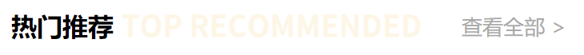

&emsp;如图，这是我们要实现的左右布局效果。那么，在微信小程序要怎么做呢？

> *.wxml
```
<view class="top-recommended-headlines">
  <view class="top-recommended-headlines-left">
    <text>热门推荐</text>
  </view>
  <view>
    <image src="../../public/index_top_recommended_headlines.png"></image>
  </view>
  <view class="top-recommended-headlines-right">
    <navigator url="../indexProduct/indexProduct">查看全部 ></navigator>
  </view>
</view>
```

<br>

> *.wxss
```
.top-recommended-headlines {
  display: flex;
  align-items: flex-end;
  height: 31rpx;
  line-height: 31rpx;
  margin-bottom: 10rpx;
}
.top-recommended-headlines-left text {
  font-size: 32rpx;
  font-weight: bold;
}
.top-recommended-headlines image {
  width: 366rpx;
  height: 31rpx;
  margin-left: 10rpx;
}
.top-recommended-headlines-right navigator {
  font-size: 26rpx;
  color: #a9a9a9;
  margin-left: 50rpx;
}
```

<br>

### <a name="chapter-three-six-three" id="chapter-three-six-three">3.6.3 混合布局</a>

&emsp;[返回目录](#catalog-chapter-three-six)

&emsp;实现效果如下：


&emsp;如图，这是我们要实现的左右布局效果。那么，在微信小程序要怎么做呢？

> *.wxml
```
<view class="weui-tab__content-item3" wx:for="{{tabs3Content}}" wx:key="{{item.index}}">
  <navigator url="../indexProductArticle/indexProductArticle">
    <view class="weui-tab__content-item3-question">
      <image src="../../public/index_productDetail_icon_question.png"></image>
      <text>{{item.title}}</text>
    </view>
    <view class="weui-tab__content-item3-answer">
      <image src="../../public/index_productDetail_icon_answer.png"></image>
      <text>{{item.content}}</text>
    </view>
    <view class="weui-tab__content-item3-detail">
      <text class="weui-tab__content-item3-detail-datatime">{{item.datatime}}</text>
      <text class="weui-tab__content-item3-detail-reader">{{item.reader}}阅读</text>
      <text class="weui-tab__content-item3-detail-label">#{{item.label}}#</text>
    </view>
  </navigator>
  <view class="weui-tab__content-item3-gap">
    <image src="../../public/index_productDetail_gap.png"></image>
  </view>
</view>
```

<br>

> *.wxss
```
.weui-tab__content-item3 {
  padding-left: 30rpx;
  padding-right: 30rpx;
  margin-top: -10rpx;
  margin-bottom: 10rpx;
}
.weui-tab__content-item3:first-child {
  padding: 40rpx 30rpx 0;
}
.weui-tab__content-item3-question image {
  width: 30rpx;
  height: 30rpx;
}
.weui-tab__content-item3-question text {
  font-size: 30rpx;
  line-height: 46rpx;
  font-weight: bold;
  color: #333;
  margin-left: 10rpx;
}
.weui-tab__content-item3-answer image {
  width: 30rpx;
  height: 30rpx;
}
.weui-tab__content-item3-answer text {
  font-size: 26rpx;
  line-height: 42rpx;
  color: #a9a9a9;
  margin-left: 10rpx;
}
.weui-tab__content-item3-detail {
  display: flex;
  justify-content: space-between;
  font-size: 26rpx;
  color: #a9a9a9;
}
.weui-tab__content-item3-detail-label {
  color: #d0a763;
}
.weui-tab__content-item3-gap image {
  width: 100%;
  height: 30rpx;
}
```

<br>

> *.js
```
tabs3Content: [
  {
    title: '员工发明创造是否属于职务发明的认证标准?',
    content: '随着企业对知识产权在企业发展中核心竞争力的认识力提高，企业保护自身知识产权的意识不断增强，使其技术得......',
    datatime: '2018-03-05',
    reader: '2081',
    label: '知识产权'
  }
]
```

<br>

## <a name="chapter-three-seven" id="chapter-three-seven">3.7 background-image 套用本地图片无效</a>

&emsp;[返回目录](#catalog-chapter-three-seven)

> 本节目前已有 1 个坑，有兴趣的小伙伴可以详看。

&emsp;在小程序中，如果你使用 wxss，你是可以发现有 `background-image` 的提示的。但是，如果你设置它的背景图是本地图片，你会发现，它是不生效的。  
&emsp;解决方案：  

1. 在使用背景图片的时候用网络图片，就是用外链的形式，比如你将这张图片放到你的服务器，如：`https://xxxx/xxx.jpg`；
2. 将背景图片使用编码base64进行转换，可以在这个网址进行 [点我前往](http://tool.css-js.com/base64.html) 转换，如：background-image: url("转换后得到的编码文本")，如果多次使用的话可以将该值设置为全局变量，再在js文件进行引用即可。
3. 使用 `image` 组件 + `position` 定位而不是使用 `background-image` 。

<br>

## <a name="chapter-three-eight" id="chapter-three-eight">3.8 \<block\> 与 \<view\></a>

&emsp;[返回目录](#catalog-chapter-three-eight)

> 本节目前已有 1 个坑，有兴趣的小伙伴可以详看。

&emsp;两者的区别是，`<view>` 是一个组件，会在页面上做渲染；`<block>` 不是一个组件，它仅仅是一个包装元素，只接受控制属性，不会在页面中做任何渲染。  
&emsp;所以，如果你仅仅是需要包裹，而不是渲染一个层，可以使用 `<block>` 提升性能。

<br>

## <a name="chapter-three-night" id="chapter-three-night">3.9 搜索框</a>

&emsp;[返回目录](#catalog-chapter-three-night)

> 本节目前已有 2 个坑，有兴趣的小伙伴可以详看。

<br>

### <a name="chapter-three-night-one" id="chapter-three-night-one">3.9.1 margin-top 无法上浮</a>

&emsp;[返回目录](#catalog-chapter-three-night)

&emsp;首先，我们要实现的效果是：


&emsp;然后， **jsliang** 的想法是：

> *.wxml
```
<view class="search">
  <input class="search-product-input" bindinput="bindKeyInput" auto-focus maxlength='10'></input>
  <label class="search-placeholder">
    <image class="search-placeholder-icon" src="../../public/index_indexProduct_icon_search.png"></image>
    <text class="search-placeholder-text">搜索产品</text>
  </label>
  <view></view>
</view>
```

<br>

> *.wxss
```
.search {
  height: 100rpx;
  display: flex;
  flex-direction: column;
  justify-content: space-between;
  align-items: center;
  position: relative;
}
.search-product-input {
  background: #f5f5f5;
  width: 650rpx;
  height: 65rpx;
  border-radius: 30rpx;
  font-size: 30rpx;
  padding-left: 20rpx;
}
.search-placeholder {
  font-size: 26rpx;
  text-align: center;
  margin-top: -65rpx;
  z-index: 2;
}
.search-placeholder-icon {
  width: 24rpx;
  height: 24rpx;
}
.search-placeholder-text {
  margin-left: 10rpx;
}
```

<br>

&emsp;你注意到了吗？在 `*.wxml` 中， **jsliang** 设置了个空的 `<view>` ，如果你把这个 `<view>` 去掉，你会惊奇地发现，它……下来了……

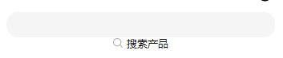

&emsp;好吧，可能有其他的实现方式，但是如果你下次使用这种方式，注意上面这个坑~  

<br>

### <a name="chapter-three-night-two" id="chapter-three-night-two">3.9.2 改造 WeUI 搜索框</a>

&emsp;[返回目录](#catalog-chapter-three-night)

&emsp;回头看了下 `WeUI` 的实现方式，发现跟我的思路是挺像的，关于 `input` 的实现方式，现在依据 `WeUI` ，成功实现了输入框：

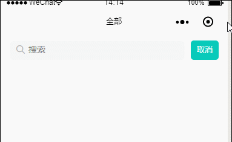

&emsp;源码奉上：
> *.wxml
```
<!-- 搜索框 -->
<view class="search">
  <view class="weui-search-bar">
    <view class="weui-search-bar__form {{inputShowed ? 'form-border' : ''}}">
      <view class="weui-search-bar__box">
        <icon class="weui-icon-search_in-box" type="search" size="14"></icon>
        <input type="text" class="weui-search-bar__input" placeholder="搜索" value="{{inputVal}}" focus="{{inputShowed}}" bindinput="inputTyping" />
        <view class="weui-icon-clear" wx:if="{{inputVal.length > 0}}" bindtap="clearInput">
          <icon type="clear" size="14"></icon>
        </view>
      </view>
      <label class="weui-search-bar__label" hidden="{{inputShowed}}" bindtap="showInput">
        <icon class="weui-icon-search" type="search" size="14"></icon>
        <view class="weui-search-bar__text">搜索</view>
      </label>
    </view>
    <view wx:if="{{inputVal.length <= 0}}" class="weui-search-bar__cancel-btn" hidden="{{!inputShowed}}" bindtap="hideInput">取消</view>
    <view wx:if="{{inputVal.length > 0}}" class="weui-search-bar__submit-btn" hidden="{{!inputShowed}}" bindtap="searchInput">搜索</view>
  </view>
</view>
```

<br>

> *.js
```
Page({
  data: {
    inputShowed: false,
    inputVal: ""
  },
  showInput: function () {
    this.setData({
      inputShowed: true
    });
  },
  hideInput: function () {
    this.setData({
      inputVal: "",
      inputShowed: false
    });
  },
  clearInput: function () {
    this.setData({
      inputVal: ""
    });
  },
  inputTyping: function (e) {
    this.setData({
      inputVal: e.detail.value
    });
  }
})
```

<br>

> *.wxss
```
.search {
  height: 100rpx;
  padding: 18rpx 30rpx;
}
.weui-search-bar {
  padding: 0;
  background-color: #fff;
  border-top: none;
  border-bottom: none;
  height: 64rpx;
}
.weui-search-bar__form {
  border: none;
}
.form-border {
  border: 1rpx solid #f5f5f5;
  background: #f5f5f5;
}
.weui-search-bar__label {
  background: #f5f5f5;
  border-radius: 30rpx;
}
.weui-search-bar__cancel-btn {
 font-size: 26rpx; 
 background: rgb(8, 202, 186);
 color: #fff;
 padding: 2rpx 20rpx 0 20rpx;
 border-radius: 10rpx;
}
.weui-search-bar__submit-btn {
  font-size: 26rpx; 
  background: rgb(8, 200, 248);
  color: #fff;
  padding: 10rpx 20rpx 0 20rpx;
  border-radius: 10rpx;
}
```

<br>

## <a name="chapter-three-ten" id="chapter-three-ten">3.10 微信小程序分享</a>

&emsp;[返回目录](#catalog-chapter-three-ten)

> 本节目前已有 1 个坑，有兴趣的小伙伴可以详看。

&emsp;官方文档：[地址](https://developers.weixin.qq.com/miniprogram/dev/framework/app-service/page.html#%E9%A1%B5%E9%9D%A2%E4%BA%8B%E4%BB%B6%E5%A4%84%E7%90%86%E5%87%BD%E6%95%B0)  
&emsp;在这里，提醒广大小伙伴注意了，注意了，注意了！重要的事说三遍。  
&emsp;当你新建 `page` 的时候，微信 web 开发者工具会自动帮你添加分享事件:

```
/**
  * 用户点击右上角分享
  */
onShareAppMessage: function (res) {
  // 实现分享功能
  return {
    title: this.data.productName,
    path: '/pages/indexProductDetail.js?productId=' + this.data.productId,
    imageUrl: this.data.videoImageSrc,
    success: (res) => {
      console.log("分享成功~");
    },
    fail: (res) => {
      console.log("分享失败~");
    }
  }
}
```

<br>

&emsp;所以，如果你在前面定义了，它会在最下面偷偷帮你清空，然后你就觉得无法自定义分享事件……  
&emsp;是的，**jsliang** 打死都不承认这是我自己的锅，新手注意！新手注意！！新手注意！！！

<br>

## <a name="chapter-three-eleven" id="chapter-three-eleven">3.11 border-box 设置</a>

&emsp;[返回目录](#catalog-chapter-three-eleven)

> 本节目前已有 1 个坑，有兴趣的小伙伴可以详看。

&emsp;熟知盒模型的小伙伴应该知道，盒模型有两种计算方式：
1. box-sizing: border-box;
2. box-sizing: content-box;

&emsp;在 `border-box` 中，整个 `view` 的宽、高，包括 `margin`、`padding`、`border`。  
&emsp;而在 `content-box` 中，整个 `view` 的宽、高，则不包括上面元素。 

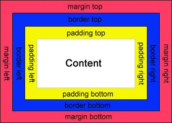

&emsp;如上图，如果一个 `view` ，你的代码如下：
```
view {
  box-sizing: border-box;
  margin: 10rpx;
  width: 100rpx;
  height: 100rpx;
  padding: 10rpx;
}
```

<br>

&emsp;那么，你的整个宽高还是 `100rpx`。  
&emsp;但是，如果你的代码如下：
```
view {
  box-sizing: content-box;
  margin: 10rpx;
  width: 100rpx;
  height: 100rpx;
  padding: 10rpx;
}
```

<br>

&emsp;那么，你的整个盒子宽高是 `120rpx`。

&emsp;如果你在设计页面中，发现内容区被撑爆了，那么，请检查下现在的 `border-box` 是什么。

<br>

## <a name="chapter-three-twelve" id="chapter-three-twelve">3.12 自定义选项卡</a>

&emsp;[返回目录](#catalog-chapter-three-twelve)

> 本节目前已有 6 个坑，有兴趣的小伙伴可以详看。

<br>

### <a name="chapter-three-twelve-one" id="chapter-three-twelve-one">3.12.1 WeUI 选项卡</a>

&emsp;[返回目录](#catalog-chapter-three-twelve)

&emsp;使用 WeUI 的导航条，首先需要引用 WeUI 的 CSS 样式：[地址](https://github.com/Tencent/weui-wxss/tree/master/dist/style)

&emsp;下载 `weui.wxss` 并在 `app.wxss` 中引用即可

> app.wxss

```
/* 引用WeUI */
@import 'weui.wxss';
```

<br>

&emsp;然后，我们直接往页面加入它的选项卡并根据项目需求修改其样式：

<br>

> *.wxml

```
<view class="tab">
  <view class="weui-tab">
    <view class="weui-navbar">
      <block wx:for="{{tabs}}" wx:key="*this">
        <view id="{{index}}" class="weui-navbar__item {{activeIndex == index ? 'weui-bar__item_on' : ''}}" bindtap="tabClick">
          <view class="weui-navbar__title">{{item}}</view>
        </view>
      </block>
      <view class="weui-navbar__slider" style="left: {{sliderLeft}}px; transform: translateX({{sliderOffset}}px); -webkit-transform: translateX({{sliderOffset}}px);"></view>
    </view>
    <view class="weui-tab__panel">
      <!-- 全部 -->
      <view class="weui-tab__content" hidden="{{activeIndex != 0}}">
        <view class="weui-tab__content-item1">
          <text>全部</text>
        </view>
      </view>
      <!-- 已付款 -->
      <view class="weui-tab__content" hidden="{{activeIndex != 1}}">
        <view class="weui-tab__content-item2">
          <text>已付款</text>
        </view>
      </view>
      <!-- 待付款 -->
      <view class="weui-tab__content" hidden="{{activeIndex != 2}}">
        <view class="weui-tab__content-item3">
          <text>待付款</text>
        </view>
      </view>
    </view>
  </view>
</view>
```

<br>

> *.wxss

```
.tab {
  font-size: 26rpx;
}
.tab image {
  width: 173rpx;
  height: 29rpx;
}
.weui-navbar {
  border-top: 1rpx solid #efefef;
  border-bottom: 1rpx solid #efefef;
}
.weui-navbar__slider {
  background: #d0a763;
  width: 4em;
}
.weui-navbar__item.weui-bar__item_on {
  color: #d0a763;
}
.weui-tab__content {
  margin-bottom: 100rpx;
}
```

<br>

> *.js

```
var sliderWidth = 52; // 需要设置slider的宽度，用于计算中间位置

Page({

  /**
   * 页面的初始数据
   */
  data: {
    // 选项卡导航
    tabs: ["全部", "已付款", "待付款"],
    activeIndex: 1,
    sliderOffset: 0,
    sliderLeft: 0,
  },
  // 选项卡切换
  tabClick: function (e) {
    this.setData({
      sliderOffset: e.currentTarget.offsetLeft,
      activeIndex: e.currentTarget.id
    });
  },

  /**
   * 生命周期函数--监听页面加载
   */
  onLoad: function (options) {
    // 计算搜索框活跃条
    var that = this;
    wx.getSystemInfo({
      success: function (res) {
        that.setData({
          sliderLeft: (res.windowWidth / that.data.tabs.length - sliderWidth) / 2,
          sliderOffset: res.windowWidth / that.data.tabs.length * that.data.activeIndex
        });
      }
    });
  }
})
```

&emsp;`2018-11-15`：新增一个 `bug` 修复，就是在第一个 `tab` 能流畅切换的情况下，第二个及其他的 `tab`，需要多次滑动才能上拉加载。这时候，只需要在 `weui-tab__content` 这个类新增三行代码就可以解决该问题：

> *.css

```
.weui-tab__content {
  padding: 30rpx 30rpx 0;
  box-sizing: border-box;
  height: 100%;
  overflow: hidden;
}
```

<br>

### <a name="chapter-three-twelve-two" id="chapter-three-twelve-two">3.12.2 自定义选项卡效果与实现</a>

&emsp;[返回目录](#catalog-chapter-three-twelve)

&emsp;自定义选项卡的代码实现：   

&emsp;实现效果图如下：

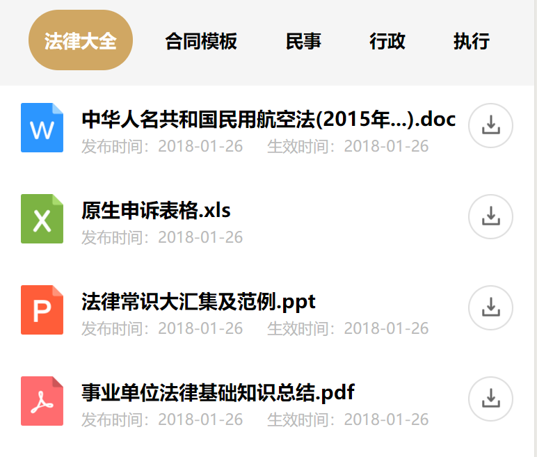

&emsp;实现代码如下：

> *.wxml
```
<view>
  <view class="weui-tab__nav">
    <text wx:for="{{tabs2Nav}}" wx:key="item.index" class="{{item.state == 1 ? 'weui-tab__nav-active' : ''}}" bindtap="tabs2NavClick" data-labelId="{{item.id}}">{{item.label}}</text>
  </view>
  <view class="weui-tab__content-item2" wx:for="{{tabs2Content}}" wx:key="{{item.index}}">
    <view class="weui-tab__content-item-descritpion">
      <view class="{{item.type == 1 ? 'weui-tab__content-item-icon-type' : 'hide'}}">
        <image src="../../public/index_productDetail_icon_word.png"></image>
      </view>
      <view class="{{item.type == 2 ? 'weui-tab__content-item-icon-type' : 'hide'}}">
        <image src="../../public/index_productDetail_icon_excel.png"></image>
      </view>
      <view class="{{item.type == 3 ? 'weui-tab__content-item-icon-type' : 'hide'}}">
        <image src="../../public/index_productDetail_icon_ppt.png"></image>
      </view>
      <view class="{{item.type == 4 ? 'weui-tab__content-item-icon-type' : 'hide'}}">
        <image src="../../public/index_productDetail_icon_pdf.png"></image>
      </view>
      <view class="weui-tab__content-item-descritpion-content">
        <text class="weui-tab__content-item-descritpion-content-title">{{item.title}}</text>
        <view class="weui-tab__content-item-descritpion-content-datatime">
          <text class="weui-tab__content-item-descritpion-content-datatime1">发布时间：{{item.datatime}}</text>
          <text class="{{item.effectiveTime ? 'weui-tab__content-item-descritpion-content-datatime2' : 'hide'}}">生效时间：{{item.effectiveTime}}</text>
        </view>
      </view>
    </view>
    <view class="weui-tab__content-item-download-state" bindtap='downloadFile' data-url="{{item.url}}">
      <image src="../../public/index_productDetail_icon_undown.png"></image>
    </view>
  </view>
</view>
```

<br>

> *.wxss
```
.weui-tab__nav {
  background: #f5f5f5;
  border: 1rpx 0rpx solid #e6e6e6;
  height: 90rpx;
  padding: 17rpx 41rpx;
  display: flex;
  justify-content: space-between;
}
.weui-tab__nav text {
  border-radius: 56rpx;
  height: 56rpx;
  line-height: 56rpx;
  padding: 15rpx 23rpx;
  font-size: 26rpx;
  font-weight: bold;
}
.weui-tab__nav-active {
  color: #fefefe;
  background: #d0a763;
}
.weui-tab__content-item2 {
  display: flex;
  justify-content: space-between;
  padding: 25rpx 30rpx;
}
.weui-tab__content-item-descritpion {
  display: flex;
  justify-content: space-between;
}
.weui-tab__content-item-descritpion image {
  width: 60rpx;
  height: 70rpx;
}
.hide {
  display: none;
}
.weui-tab__content-item-descritpion-content {
  margin-left: 26rpx;
}
.weui-tab__content-item-descritpion-content-title {
  font-size: 28rpx;
  font-weight: bold;
  overflow: hidden;
  text-overflow: ellipsis;
  display: -webkit-box;
  -webkit-line-clamp: 1;
  -webkit-box-orient: vertical;
}
.weui-tab__content-item-descritpion-content-datatime {
  font-size: 22rpx;
  color: #bbb;
}
.weui-tab__content-item-descritpion-content-datatime1 {
  margin-right: 35rpx;
}
.weui-tab__content-item-download-state image {
  width: 64rpx;
  height: 64rpx;
}
```

<br>

> *.js
```
data: {
  tabs2Nav: [
    {
      id: '1',
      label: '法律大全',
      state: 1
    },
    {
      id: '2',
      label: '合同模板',
      state: 0
    },
    {
      id: '3',
      label: '民事',
      state: 0
    },
    {
      id: '4',
      label: '行政',
      state: 0
    },
    {
      id: '5',
      label: '执行',
      state: 0
    }
  ],
  tabs2Content: [
    {
      title: '中华人名共和国民用航空法(2015年...).doc',
      url: 'https://wxmcard.imusic.cn/testfordocdownload.doc',
      datatime: '2018-01-26',
      effectiveTime: '2018-01-26',
      type: '1'
    },
    {
      title: '原生申诉表格.xls',
      url: 'https://wxmcard.imusic.cn/testfordocdownload.doc',
      datatime: '2018-01-26',
      type: '2'
    },
    {
      title: '法律常识大汇集及范例.ppt',
      url: 'https://wxmcard.imusic.cn/testforpptdownload.pptx',
      datatime: '2018-01-26',
      effectiveTime: '2018-01-26',
      type: '3'
    },
    {
      title: '事业单位法律基础知识总结.pdf',
      url: 'https://wxmcard.imusic.cn/testforpdfdownload.pdf',
      datatime: '2018-01-26',
      effectiveTime: '2018-01-26',
      type: '4'
    }
  ],

  // 选项卡第二屏分组
  tabs2Content1: [
    {
      title: '中华人名共和国民用航空法(2015年...).doc',
      datatime: '2018-01-26',
      effectiveTime: '2018-01-26',
      type: '1'
    },
    {
      title: '原生申诉表格.xls',
      datatime: '2018-01-26',
      type: '2'
    },
    {
      title: '法律常识大汇集及范例.ppt',
      datatime: '2018-01-26',
      effectiveTime: '2018-01-26',
      type: '3'
    },
    {
      title: '事业单位法律基础知识总结.pdf',
      datatime: '2018-01-26',
      effectiveTime: '2018-01-26',
      type: '4'
    }
  ],
  tabs2Content2: [
    {
      title: '合同模板.doc',
      datatime: '2018-01-26',
      effectiveTime: '2018-01-26',
      type: '1'
    }
  ],
  tabs2Content3: [
    {
      title: '民事合同模板.doc',
      datatime: '2018-01-26',
      effectiveTime: '2018-01-26',
      type: '1'
    }
  ],
  tabs2Content4: [
    {
      title: '行政合同模板.doc',
      datatime: '2018-01-26',
      effectiveTime: '2018-01-26',
      type: '1'
    }
  ],
  tabs2Content5: [
    {
      title: '执行合同模板.doc',
      datatime: '2018-01-26',
      effectiveTime: '2018-01-26',
      type: '1'
    }
  ]
},
// 选项卡2切换
tabs2NavClick: function(e) {
  var that = this;
  console.log("完整的数据是：");
  console.log(that.data.tabs2Nav);
  
  console.log("点击的标签是：");
  console.log(e.currentTarget.dataset.labelid);

  var newTabs2Content;

  console.log("正在经历的标签是：");
  for(var i=0; i<that.data.tabs2Nav.length; i++) {
    console.log(that.data.tabs2Nav[i].id);
    that.data.tabs2Nav[i].state = 0;
    if (that.data.tabs2Nav[i].id == e.currentTarget.dataset.labelid) {
      that.data.tabs2Nav[i].state = 1;
      console.log("将改变的标签是：");
      console.log(that.data.tabs2Nav[i]);

      // 改变内容
      var changeContentName = "tabs2Content" + (i + 1);
      if (changeContentName == "tabs2Content1") {
        console.log(that.data.tabs2Content1);
        newTabs2Content = that.data.tabs2Content1;
      } else if (changeContentName == "tabs2Content2") {
        newTabs2Content = that.data.tabs2Content2;
      } else if (changeContentName == "tabs2Content3") {
        newTabs2Content = that.data.tabs2Content3;
      } else if (changeContentName == "tabs2Content4") {
        newTabs2Content = that.data.tabs2Content4;
      } else {
        newTabs2Content = that.data.tabs2Content5;
      }

      console.log("希望转换内容到：");
      console.log(changeContentName);
    }
  }

  this.setData({
    tabs2Nav: that.data.tabs2Nav,
    tabs2Content: newTabs2Content
  })
},
```

<br>

### <a name="chapter-three-twelve-three" id="chapter-three-twelve-three">3.12.3 绑定事件如何传递数据</a>

&emsp;[返回目录](#catalog-chapter-three-twelve)

&emsp;绑定事件如何传递数据：  
&emsp;如果学过 `Vue` 的同学，应该知道 `Vue` 的数据传递形式是： `@click='tabs2NavClick(item.id)'`  
&emsp;那么，在微信小程序中，你千万记得，绑定时间的传递参数的方式不是这样子的，而是：
```
<text wx:for="{{tabs2Nav}}" wx:key="item.index" bindtap="tabs2NavClick" data-labelId="{{item.id}}">{{item.label}}</text>
```  

<br>

&emsp;通过 `data-*="{{item}}"` 的形式传递的~然后你需要在 `js` 中，通过 `e.currentTarget.dataset.labelid` 来获取。

<br>

### <a name="chapter-three-twelve-four" id="chapter-three-twelve-four">3.12.4 不允许驼峰</a>

&emsp;[返回目录](#catalog-chapter-three-twelve)

&emsp;然后，注意了，这里还有个小 bug。在代码中，我们使用的是 `data-labelId="{{item.id}}"`，而获取数据的时候，我们获取的是 `labelid`，是的，驼峰不见了~

&emsp;参考链接：[链接](https://www.jianshu.com/p/a3481a255842)

<br>

### <a name="chapter-three-twelve-five" id="chapter-three-twelve-five">3.12.5 获取 data 数据</a>

&emsp;[返回目录](#catalog-chapter-three-twelve)

&emsp;如何在方法中获取 `data` 中定义的数据：  
&emsp;如果我想在选项卡切换的方法 `tabs2NavClick` 中获取 `data` 里面的数据，那么我应该怎么做呢？  
&emsp;是的，通过:
```
tabs2NavClick: function(e) {
  var that = this;
  console.log(that.data.tabs2Nav);
}
```  

<br>

&emsp;这种形式，我们就可以获取到 `data` 中的数据。  
&emsp;参考链接：[链接](https://blog.csdn.net/chq1988/article/details/74625741)

<br>

### <a name="chapter-three-twelve-six" id="chapter-three-twelve-six">3.12.6 实现文字省略</a>

&emsp;[返回目录](#catalog-chapter-three-twelve)

&emsp;如何实现文字省略：  
&emsp;加入你有一段文本，你想让页面根据自身宽度，自动省略多余长度，那么，我们可以设置下面的 `css` 代码，从而实现文字省略效果（不使用 js 的原因，是因为 js 没有 css 那么灵活）  
```
text {
  overflow:hidden;
  text-overflow:ellipsis;
  display:-webkit-box;
  -webkit-line-clamp:1;
  -webkit-box-orient:vertical;
}
```

<br>

&emsp;参考链接：[链接](https://blog.csdn.net/hxh5801050/article/details/79540412)

<br>

## <a name="chapter-three-thirteen" id="chapter-three-thirteen">3.13 黑科技：\<modal\></a>

&emsp;[返回目录](#catalog-chapter-three-thirteen)

> 本节目前已有 2 个坑，有兴趣的小伙伴可以详看。

<br>

### <a name="chapter-three-thirteen-one" id="chapter-three-thirteen-one">3.13.1 被遗弃的 \<modal\></a>

&emsp;[返回目录](#catalog-chapter-three-thirteen)

&emsp;一个坑就是一个故事。  
&emsp;故事都有四元素：时间，地点，人物，事情。  
&emsp;前三个自不必说，我们直接讲事情经过：我们项目的负责人需要一个留言弹窗，然后里面有个文本框可以填信息，最后点击【留言】按钮将数据传到后端，点击【取消】按钮关闭弹窗。  
&emsp;需求是不是很简单~既然微信小程序有自己的官方文档。那么，怎么方便怎么来吧，于是 **jsliang** 在微信小程序中搜索关键字 `弹窗`：

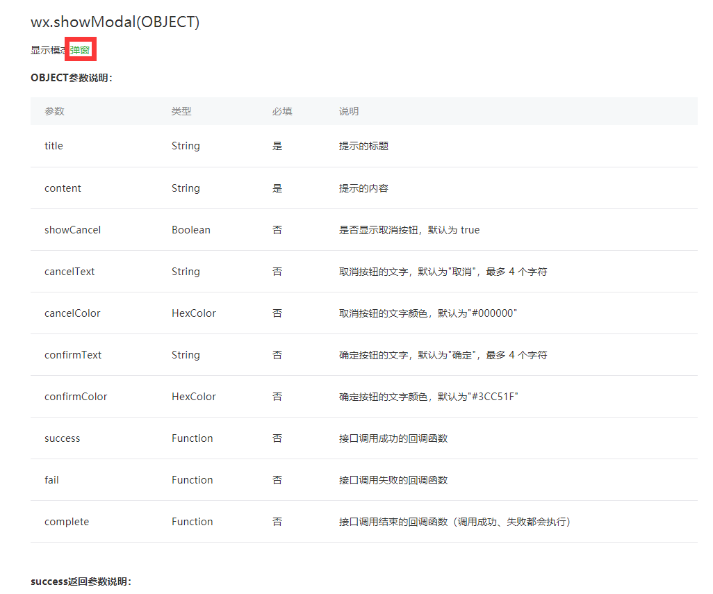

&emsp;看了下搜索记录，最匹配的就是上面这个了。enm...好像没看到放文本框的？先试试：

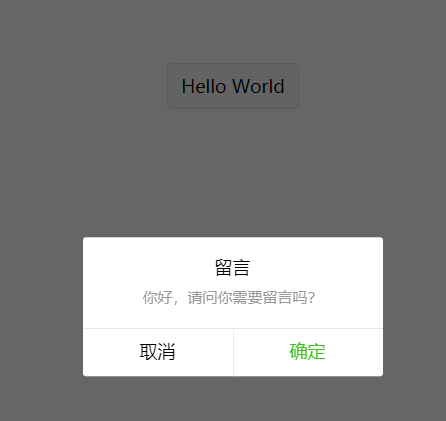

&emsp;额(⊙o⊙)…  


&emsp;不好意思打扰了，我去百度看看：[链接](https://blog.csdn.net/qq_35181466/article/details/80405248)

&emsp;咦~ 它这里好像有个 `<modal>` 标签？Ctrl+C、Ctrl+V 试试先~

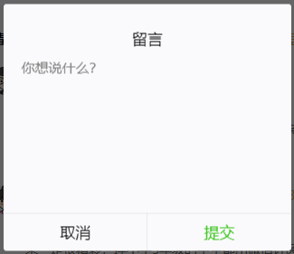

&emsp;Duang~~~这不就是我要的效果么，挖槽，黑科技？于是 **jsliang** 去小程序那里搜了下 `modal` ……enm...蜜汁尴尬，好像只有上面的 `wx.showModal()` 方法……于是 **jsliang** 满头黑线……好嘛，黑科技黑科技！！！  
&emsp;下面贴出实现代码：

> *.wxml
```
<text class="article-message-board-head-addMessage" bindtap="modalinput">写留言</text>
```

<br>

> *.js
```
Page({
  data: {
    // 弹窗
    hiddenmodalput: true, //可以通过hidden是否掩藏弹出框的属性，来指定那个弹出框
  },
  //点击按钮指定的hiddenmodalput弹出框    
  modalinput: function () {
    this.setData({
      hiddenmodalput: !this.data.hiddenmodalput
    })
  },
  //取消按钮    
  cancel: function () {
    this.setData({
      hiddenmodalput: true
    });
  },
  //确认    
  confirm: function () {
    wx.showToast({
      title: '留言成功！',
    })
    this.setData({
      hiddenmodalput: true
    })
  }
})
```

<br>

&emsp;好的，上面就实现了一个简单的可填写文本的弹窗了。

<br>

### <a name="chapter-three-thirteen-two" id="chapter-three-thirteen-two">3.13.2 四种弹窗写法</a>

&emsp;[返回目录](#catalog-chapter-three-thirteen)

&emsp;作为一枚职业填坑人，怎么能满足于上面的两种弹窗形式呢！于是，使用百度大法又找到了一篇填坑文：[链接](https://blog.csdn.net/gao_xu_520/article/details/71084162?locationNum=1&fps=1)

&emsp;所以，总结下就有了四种弹窗写法：

| 类型      | 说明                                                                                                              | 地址                                                                                                                           |
| --------- | ----------------------------------------------------------------------------------------------------------------- | ------------------------------------------------------------------------------------------------------------------------------ |
| 模态弹窗  | wx.showModal(Object) - 模态弹窗就是上面的第一种弹窗，它可以给你选择【取消】或者【确定】                           | [链接](https://developers.weixin.qq.com/miniprogram/dev/api/ui/interaction/wx.showToast.html?search-key=wx.showModal)          |
| \<modal\> | \<modal\>是上面的第二种弹窗，可以提供用户填写                                                                     | [链接](https://blog.csdn.net/qq_35181466/article/details/80405248)                                                             |
| 消息弹窗  | wx.showToast(Object) - 消息弹窗就是操作成功或者操作失败的那一刻，系统的提示弹窗，无需用户操作，可设定几秒自动关闭 | [链接](https://developers.weixin.qq.com/miniprogram/dev/api/ui/interaction/wx.showToast.html?search-key=wx.showToast)          |
| 操作菜单  | wx.showActionSheet(Object) - 操作菜单类似于弹出的下拉菜单，提供你选择其中某项或者【取消】                         | [链接](https://developers.weixin.qq.com/miniprogram/dev/api/ui/interaction/wx.showActionSheet.html?search-key=showActionSheet) |

&emsp;在这里，就讲完了微信小程序的四种弹窗形式了。如果你改样式改的烦啊烦的，可能你需要封装一个属于自己的弹窗？嘿嘿，说不定你的产品经理会有兴趣让你开发一个 `beautiful` 弹窗的~  
&emsp;这坑我不填，我没碰到~碰到了再说！在这里预留下这个坑，哈哈。

<br>

## <a name="chapter-three-fourteen" id="chapter-three-fourteen">3.14 小程序解析 HTML</a>

&emsp;[返回目录](#catalog-chapter-three-fourteen)

> 本节目前已有 6 个坑，有兴趣的小伙伴可以详看。

<br>

### <a name="chapter-three-fourteen-one" id="chapter-three-fourteen-one">3.14.1 解析 HTML 的三种方法</a>

&emsp;[返回目录](#catalog-chapter-three-fourteen)

&emsp;在小程序的文章处理中，文章的主体内容，一般来说，后端会采用富文本的形式存储数据到数据库。就是说，你要在 `view` 中展示 `html` 变迁。但是，你知道的，小程序不采用浏览器的那一套，所以，你可能需要兜圈子了：[链接](https://www.qinziheng.com/xiaochengxudev/4336.htm)

&emsp;在上面这篇文章中，讲述了三种解析富文本的方法：
* wxParse 解析富文本
* rich-text 解析富文本
* web-view 解析富文本

<br>

### <a name="chapter-three-fourteen-two" id="chapter-three-fourteen-two">3.14.2 wxParse</a>

&emsp;[返回目录](#catalog-chapter-three-fourteen)

&emsp;在百度大法的渲染下，**jsliang** 采用了 wxParse。

&emsp;Github 的 wxParse 地址：[链接](https://github.com/icindy/wxParse)

&emsp;使用方法很简单，照着它 GitHub 地址去撸就是了。然而，坑不是那么容易填的 o(╥﹏╥)o

&emsp;（ bug1 ）wxParse 在其神秘源码中，会将你的 html+css 样式弄乱，例如：`px` 要转成 `rpx`，才能在小程序中正常显示，如果你不处理……enm...你试试~

&emsp;（ bug2 ）然后，如果你突然发现，内容无法显示，那么，恭喜你又触发了 bug，这个是 wxParse 代码的一个 bug,在一些特殊的手机里面，在 wxparse/html2json.js 中的第 112 和 119行，都有一个 console.dir() 这个函数的使用，它使你的内容不能正常显示了。把这个函数注释掉，内容就可以正常显示出来了。

```
if (name == 'class') {
    // console.dir(value); // 112 行
    //  value = value.join("")
    node.classStr = value;
}
// has multi attibutes
// make it array of attribute
if (name == 'style') {
    // console.dir(value);  // 119行
    //  value = value.join("")
    node.styleStr = value;
}
```

<br>

&emsp;（ bug3 ）如果你需要引用图片，那么，你会发现引用不成功。这是因为，我们在网页后台编辑器里面上传的图片，是采用相对路径的，上传成绝对网络地址路径之后，换成域名，就没法很好的展示了。所以最好的方法，就是修改 html2json.js 这个文件，让 wxParse 自动添加域名前缀：[地址](https://blog.csdn.net/jorzen1984/article/details/80492521)

&emsp;（ bug4 ）空格没法被正确替换，需要修改 `wxDiscode.js` 中的 `strcharacterDiscode` ：

```
// 将原语句注释掉，替换为下面的语句
// str = str.replace(/&nbsp;/g, ' ');
  str = str.replace(/&nbsp;/g, '\xa0');
```

&emsp;（ bug5 ）如何干掉控制台 console 中 wxParse 的一大串输出：

> wxParse.js

```
// 36行注释掉
console.log(JSON.stringify(transData, ' ', ' '));
// 41行注释掉
console.log(JSON.stringify(transData, ' ', ' '));
```

&emsp;综上，**jsliang** 气得差口吐白沫了……换换换！有空要换成其他两种方式才行！！！

<br>

### <a name="chapter-three-fourteen-three" id="chapter-three-fourteen-three">3.14.3 rich-text</a>

&emsp;[返回目录](#catalog-chapter-three-fourteen)

&emsp;**jsliang** 还未使用过 rich-text，这里先预留个坑。如果小伙伴们在开发 rich-text 过程中碰到过各种坑，可以跟 **jsliang** 提一下，我会写进这章节，顺带在章节尾写上你的大名，辛苦了~

<br>

### <a name="chapter-three-fourteen-four" id="chapter-three-fourteen-four">3.14.4 web-view</a>

&emsp;[返回目录](#catalog-chapter-three-fourteen)

&emsp;**jsliang** 还未使用过 web-view，这里先预留个坑。如果小伙伴们在开发 web-view 过程中碰到过各种坑，可以跟 **jsliang** 提一下，我会写进这章节，顺带在章节尾写上你的大名，辛苦了~

<br>

## <a name="chapter-three-fifteen" id="chapter-three-fifteen">3.15 诡异的 open-type</a>

&emsp;[返回目录](#catalog-chapter-three-fifteen)

> 本节目前已有 1 个坑，有兴趣的小伙伴可以详看。

&emsp;在小程序中，它有一些自定义的方法，例如 `open-type` ，是需要 `<button>` 来承接的。  
&emsp;所以，如果你写好了一个 `view`，里面有很好看的样式了，你本来打算用 `bindtap` 来搞事情的。但是，突然接到信息，需要外套一层 `<button open-type="***">` ，然后发现，样式需要重新跳过……  
&emsp;enm...加油不哭，重新写过样式吧~

<br>


## <a name="chapter-three-sixteen" id="chapter-three-sixteen">3.16 \<button\>去样式及其内嵌\<image\></a>

&emsp;[返回目录](#catalog-chapter-three-sixteen)

> 本节目前已有 1 个坑，有兴趣的小伙伴可以详看。

&emsp;就像上一章所说的，有时候，迫不得已，我们必须在 `<button>` 中内嵌个 `<image>` 或者 `<text>` 之类的，那么，一般怎么做呢？  
&emsp;现在，假设我有一个 `42*40` 的图片，我来试试调下它的样式：

> *.wxml
```
<button open-type='share'>
  <image src="../../public/explore_activityDetail_icon_share.png"></image>
</button>
```

<br>

> *.wxss
```
.activity-user-action button {
  width: 42rpx;
  height: 80rpx;
  margin: 0;
  padding: 0;
  margin-top: -21rpx;
  background: #fff;
}
.activity-user-action button::after {
  border: none;
}
.activity-user-action image:last-child {
  width: 42rpx;
  height: 40rpx;
}
```

<br>

&emsp;如上，我们需要设置这个按钮的高度是图片高度的 2 倍，然后还需要设置 `margin-top` 的高度为图片高度的 1/2（注意 margin 与 margin-top 的顺序，如果你不知道顺序的重要性，推荐你使用 `margin: -21rpx 0 0 0 `），同时 `margin`、`padding`、`background`、`border` 需要清空。

<br>

## <a name="chapter-three-seventeen" id="chapter-three-seventeen">3.17 下拉刷新和上拉加载</a>

&emsp;[返回目录](#catalog-chapter-three-seventeen)

> 本节目前已有 2 个坑，有兴趣的小伙伴可以详看。

&emsp;在浏览器中，有 F5 刷新，有鼠标滚轮滑动加载。  
&emsp;那么，换到微信小程序，又是怎样子的呢？  
&emsp;是的，这就要说说用户下拉动作和上拉触底了：  

&emsp;下拉事件在小程序文档的解释：[链接](https://developers.weixin.qq.com/miniprogram/dev/api/pulldown.html?search-key=pulldown)

> 2018-11-20 注意，该事件需要在 `json` 中设置：   `"enablePullDownRefresh": true`

```
/**
  * 页面相关事件处理函数--监听用户下拉动作
  */
onPullDownRefresh: function () {

},
```

<br>

&emsp;上拉触底在小程序文档的解释：[链接](https://blog.csdn.net/zhanxingdong/article/details/81228287)

```
/**
  * 页面上拉触底事件的处理函数
  */
onReachBottom: function () {

},
```

<br>

&emsp;这两个事件，都是在你新建 `page` 的时候，会自动添加的，小伙伴们注意下，免得前面写了，被后面的覆盖了哦~

<br>

## <a name="chapter-three-eighteen" id="chapter-three-eighteen">3.18 获取 input 的值</a>

&emsp;[返回目录](#catalog-chapter-three-eighteen)

> 本节目前已有 1 个坑，有兴趣的小伙伴可以详看。

&emsp;`<input class="phone-number"></input>`  
&emsp;`<button>获取电话号码</button`

&emsp;现在，假设我们在小程序中输入了一个 `class` 为 `phone-number` 的`input` 框，并且有一个 `<button>` 。那么，我们在微信小程序中，需要如何获取该 `phone-number` 的值呢？
1. 先在 `<input>` 中设置 `name` 为 `phoneNumber`
2. 然后 `data` 中设置 `phoneNumber: ''`
3. 接着 `bindinput="phoneCodeInput'`
4. 再来设置 `phoneCodeInput` 方法来修改 `this.data.phoneNumber`
5. 最后在 `<button>` 的绑定事件中获取 `phoneNumber`

&emsp;步骤繁杂，下面贴出实现代码：

> *.wxml
```
<input maxlength='11' placeholder='请输入手机号码' placeholder-class="phone-number" name="phoneNumber" bindinput='phoneNumberInput'></input>

<button class="get-phone-number" bindtap="getPhoneNumber">获取验证码</button>
```

<br>

> *.js
```
Page({
  data: {
    // 输入的手机号码
    phonenumber: '',
  },
  // 获取手机号码
  phoneNumberInput: function(e) {
    this.setData({
      phonenumber: e.detail.value
    })
  },
  // 点击获取验证码
  getPhoneNumber: function (e) {
    var phoneNumber = this.data.phonenumber
    console.log(phoneNumber);
  }
})
```

<br>

&emsp;在上面，我们仅仅是 **获取** 到了 `input` 的值。那么，我们要如何实现 **动态修改** `input` 的值呢？

```
<input maxlength='11' placeholder='请输入手机号码' placeholder-class="phone-number" name="phoneNumber" bindinput='phoneNumberInput' type="text" value="{{phoneNumber}}"></input>
```

<br>

&emsp;答案是：我们只需要将 `value` 的值设为 `phoneNumber` 就行了！

<br>

&emsp;看到这里，如果有习惯 `jQuery` ，习惯操作 `dom` 节点的小伙伴可能会抱有很大疑惑：“它就不能像 `jQuery` 一样直接获取 `dom` 的内容么？”  
&emsp;答案是，有的：[地址](https://developers.weixin.qq.com/miniprogram/dev/api/wxml/NodesRef.html)。但是，在这里， **jsliang** 并不推荐小伙伴这么做，想要学好一门新的技术，就不能因为旧的技术而限制了自己的观念。时代在进步，科技在发展，我们不学更多的知识，只能被淘汰在前端的潮流中。

<br>

## <a name="chapter-three-nighteen" id="chapter-three-nighteen">3.19 onLaunch 加载问题与路由守卫</a>

&emsp;[返回目录](#catalog-chapter-three-nighteen)

> 本节目前已有 2 个坑，有兴趣的小伙伴可以详看。

### <a name="chapter-three-nighteen-one" id="chapter-three-nighteen-one">3.19.1 小程序执行顺序</a>

&emsp;[返回目录](#catalog-chapter-three-nighteen)

&emsp;这次的需求是：判断用户是否登录，如果登录了就跳转到首页，如果没登录就跳转到登录页。  
&emsp;我们都知道，在微信小程序中，有个 `onLaunch` 方法，微信小程序官方文档对其描述就是：每个页面进来需要先加载 `onLaunch` 方法，再去执行其他方法。然后，在 **jsliang** 尝试设置在 `onLaunch` 中调用 `wx.login()`，却发现，`index.js` 的 `onLoad` 方法是先于 `onLaunch` 执行的，这导致我们没法预先获取到需要的信息：    

1. 先执行 `index.js` 的 `onload`
2. 再才执行 `app.js` 中的 `onLaunch`

&emsp;迫于无奈，**jsliang** 对其进行了百度：[地址](https://blog.csdn.net/qq_35860064/article/details/82590573) 。通过百度这篇文章发现，有两个解决方案：

1. 设置启动页，成功再返回首页
2. 使用 `Promise` 来进行进程管理

&emsp;但是，由于 **jsliang** 对于 `Promise` 的做法，觉得其太过复杂，故新增了一个 `page/login`。

<br>

### <a name="chapter-three-nighteen-two" id="chapter-three-nighteen-two">3.19.2 路由守卫</a>

&emsp;[返回目录](#catalog-chapter-three-nighteen)

&emsp;那么，如何在用户进入首页阅读文章、查看产品之前，先对用户进行微信授权、账号登录呢？
1. 设置 `onLogin` 的 `Storage`，在 `index.js` 中的 `onload` 进行判断，如果用户未进行登录，则使用 `wx.redirectTo()` 跳转到登录页面：

> index.js

```
onLoad: function (options) {
  if (!wx.getStorageSync('isLogin')) {
    wx.redirectTo({
      url: '../login/login',
    })
  }
}
```

<br>

2. 如果用户进行了登录，在登录时设置 `onLogin` 为 `true`。

> login.js

```
loginSubmit: function(e) {
  wx.setStorageSync('isLogin', true);
}
```
<br>

&emsp;这样，我们就做到了路由守卫，即你不登录，不给跳转到首页。

<br>

## <a name="chapter-three-twenty" id="chapter-three-twenty">3.20 request 封装与 api 抽离</a>

&emsp;[返回目录](#catalog-chapter-three-twenty)

> 本节目前已有 1 个坑，有兴趣的小伙伴可以详看。

&emsp;在 **Ansen江** 的推荐下，参照 **Ansen江** 的 `api.js`，对我这边的小程序接口 `request` 进行了 `promise` 封装，并做了 `api.js` 的分离。  

> api.js
```
/*
 * @Author: jsliang
 * @Date: 2018-10-11 09:11:26
 * @LastEditors: jsliang
 * @LastEditTime: 2018-10-11 09:11:29
 * @Description: 接口文件
 */

// 引入请求头文件
import header from './header.js';

// 加载中
const Loading = {
  show() {
    wx.showLoading({
      title: '加载中'
    });
  },
  hide() {
    wx.hideLoading()
  }
};

// 加载中白名单
const loadingWhite = [
  'index/index'
]

// 将请求进行 Promise 封装
const fetch = ({url, data, header}) => {
  // 白名单地址会显示加载中状态
  if(loadingWhite.includes(url)) {
    Loading.show();
  }
  
  // 打印接口请求的信息
  console.log(`【step1】API接口：${url}`);
  console.log("【step2】header请求头：");
  console.log(header);
  console.log("【step3】data传参：");
  console.log(data);

  // 返回 Promise
  return new Promise((resolve, reject) => {
    wx.request({
      url: getApp().globalData.api + url,
      header: header,
      data: data,
      success: res => {
        Loading.hide();
        
        // 成功时的处理 
        if (res.data.code == 0) {
          console.log("【step4】请求成功：");
          console.log(res.data);
          return resolve(res.data);
        } else {
          wx.showModal({
            title: '请求失败',
            content: res.data.message,
            showCancel: false
          });
        }
      },
      fail: err => {
        Loading.hide();

        // 失败时的处理
        console.log(err);
        return reject(err);
      }
    })
  })

}

/**
 * code 换取 openId
 * @data {
 *   jsCode - wx.login() 返回的 code
 * }
 */
export const wxLogin = data => {
  return fetch({
    url: "tbcUser/getWechatOpenId",
    header: header.newHeader(),
    data: data
  })
}
```

<br>

&emsp;在上面进行了分离 `api.js` 后，接着在其他地方调用 `api.js`：

> login.js
```
import {
  wxLogin
} from "../../utils/api.js"

// 登录
wx.login({
  success: res => {

    // 发送 code ，获取 openId
    console.log("\n【API：获取 openId】");

    wxLogin({
      jsCode: res.code
    }).then(
      res => {
        console.log("【step5】返回成功处理：");
        console.log(res);
      },
      err => {
        console.log("【step5】返回失败处理：");
        console.log(err);
      }
    )

  }
})
```

<br>

&emsp;输出结果：

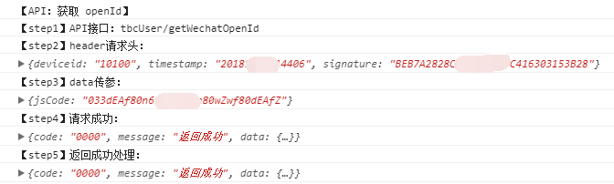

&emsp;这样，我们就成功做了 `request` 的封装，并通过调用 `api.js` 的形式，分离了代码，从而更方便地进行编程。

<br>

## <a name="chapter-three-twenty-one" id="chapter-three-twenty-one">3.21 判断数据是否读取完</a>

&emsp;[返回目录](#catalog-chapter-three-twenty-one)

> 本节目前已有 1 个坑，有兴趣的小伙伴可以详看。

&emsp;在页面布局中，我们经常使用列表展示，然后在列表展示上，有时候该列表的最后一条数据下面是没有下划线或者虚线的。  
&emsp;那么，当数据读取到最后一条的时候，如何判断已经到了最后一条，不再展示下划线或者虚线呢？ 

* 方法一

> *.wxml
```
<view class="content">
  <view wx:for="{{topRecommended}}" wx:key="{{item.recommendId}}" wx:for-index="index">
    <navigator url="../indexProduct/indexProduct">
      <view class="content-item">
        <image src="{{item.coverImage}}"></image>
        <view class="content-item-text">
          <text class="content-item-text-title">{{item.recommendTitle}}</text>
          <text class="content-item-text-content">{{item.recommendDescription}}</text>
          <view class="content-item-text-row">
            <text class="content-item-text-user">{{item.userCount}}人在用</text>
            <text class="content-item-text-price">￥{{item.productPrice}}</text>
          </view>
        </view>
      </view>
    </navigator>
    <view class="{{(index+1) == topRecommended.length ? 'content-item-gap-hide' : 'content-item-gap'}}">
      <image src="../../public/index_top_recommended_content_item_gap.png"></image>
    </view>
  </view>
</view>
```

<br>

&emsp;在这里，我们对要循环的对象使用 `wx:for-index="index` ，即：

```
<view wx:for="{{topRecommended}}" wx:key="{{item.recommendId}}" wx:for-index="index">
```

&emsp;然后，我们在下划线/点虚线位置进行 `class` 判断，如果 `index+1 == topRecommended.length`，那么我们就换一个样式：`class="{{(index+1) == topRecommended.length ? 'class1' : 'class2'}}"`，即：

```
<view class="{{(index+1) == topRecommended.length ? 'content-item-gap-hide' : 'content-item-gap'}}">
```

&emsp;这样，我们就做到了判断是否处于最后一条数据，从而通过 `class` 来隐藏下划线或者虚线。

<br>

* 方法二

&emsp;通过 `CSS` 的 `last-child { ... }`，可以直接修改最后的 `view`样式：

> *.wxss
```
.content-item-gap:last-child {
  display: none;
}
```

&emsp;这样，就不需要复杂的 `JS` 逻辑，从而实现最后一个下划线的显示影藏。  
&emsp;如果你想了解下 `last-child` 为何物：[链接](http://www.w3school.com.cn/cssref/selector_last-child.asp)

<br>

## <a name="chapter-three-twenty-two" id="chapter-three-twenty-two">3.22 客服系统研究</a>

&emsp;[返回目录](#catalog-chapter-three-twenty-two)

> 本节目前已有 1 个坑，有兴趣的小伙伴可以详看。

&emsp;在微信小程序中，客服系统也是个相当诡异的玩意。  
&emsp;目前实现：

> *.wxml

```
<button open-type="contact" send-message-title='{{productName}}' send-message-img='{{videoImageSrc}}' send-message-path='../indexProductDetail/indexProductDetail?productId={{productId}}' show-message-card='true'>
  <view class="nav-service">
    <image src="../../public/index_productDetail_icon_service.png"></image>
    <text>在线咨询</text>
  </view>
</button>
```

1. 能够进行正常的通讯
2. 能够发送产品信息给客服

&emsp;但是，这不能满足我的要求：

1. 不能修改对话框的标题（查的资料标明需要进行小程序配置后后端返回？[来源地址](https://www.jianshu.com/p/3d59ae5e69ab?mType=Group)）
2. 暂时无法验证是否能实现客服点击用户分享的产品卡片，跳转到小程序对应的产品页面上。

&emsp;这些，都需要我们的小程序发布后进行验证。

<br>

## <a name="chapter-three-twenty-three" id="chapter-three-twenty-three">3.23 文件在线预览</a>

&emsp;[返回目录](#catalog-chapter-three-twenty-three)

> 本节目前已有 2 个坑，有兴趣的小伙伴可以详看。

&emsp;话不多说，先丢出实现代码：

> *.wxml

```
<view class="container" bindtap='downloadFile' data-url="{{downloadUrl}}">
  <button>点我下载</button>
</view>
```

<br>

> *.js

```
Page({
  data: {
    downloadUrl: '网上随便找一个下载地址'
  },
  downloadFile: function(e) {
    // 获取传递过来的下载地址
    var url = e.currentTarget.dataset.url;
    // 调用下载 API
    wx.downloadFile({
      url: url,
      success: function (res) {
        console.log("下载文件成功");
        console.log(res);
        
        var tempFilePath = res.tempFilePath;

        // 在线预览文档
        wx.openDocument({
          filePath: tempFilePath,
          success: res => {
            console.log("打开成功");
          },
          fail: res => {
            console.log(res);
          },
          complete: res => {
            console.log(res);
          }
        })

      },
      fail: function () {
        console.log("下载失败");
      }
    })
  }
})
```

<br>

&emsp;然后，在下载的时候，后端小伙伴偷懒，上传的是没有数据的 Word、PPT，这时候，小程序会报：`openDocument:fail filetype not supported` 的 error，所以小伙伴们要注意下。

<br>

## <a name="chapter-three-twenty-four" id="chapter-three-twenty-four">3.24 尽量使用 ES6</a>

&emsp;[返回目录](#catalog-chapter-three-twenty-four)

> 本节目前已有 1 个坑，有兴趣的小伙伴可以详看。

&emsp;由于 **jsliang** 平时都是使用 ES5 ，一直口嚷嚷说要步入 ES6 大堂，但是一直就是没入门，所以乘着有功夫，尽量使用 ES6 ，用熟了才能进步。

&emsp;绑定方法写法修改：

* 原写法：

```
getUserPhone: function(e) {
  console.log(e);
}
```

<br>

* 现写法：

```
getUserPhone(e) {
  console.log(e);
}
```

<br>

&emsp;循环写法：

* 原写法

```
for(var i = 0; i <= array.length; i++) {
  console.log(array[i]);
}
```

* 新写法

```
for (let i of array) {
  console.log(i);
}
```

<br>

## <a name="chapter-three-twenty-five" id="chapter-three-twenty-five">3.25 视频功能实现</a>

&emsp;[返回目录](#catalog-chapter-three-twenty-five)

> 本节目前已有 1 个坑，有兴趣的小伙伴可以详看。

&emsp;官方地址：[地址](https://developers.weixin.qq.com/miniprogram/dev/component/video.html)

&emsp;官方实现效果：


&emsp;项目实现效果：


&emsp;从图中可以看出，我们大概要实现3个步骤：

1. 调整 CSS，使 Video 占满 100% 的宽，并且居顶。

2. 调整 HTML+CSS，使图片覆盖住视频。

3. 编写 JS，使图片点击时，隐藏图片，播放视频。

> *.wxml

```
<view class="video">

  <!-- 
    1. 绑定接口视频路径
    2. controls - 可控制播放暂停
    3. show-fullscreen-btn - 显示全屏按钮
  -->
  <video id="video" src="{{videoSrc}}" controls show-fullscreen-btn></video>

  <!-- 通过 playVideo 这个方法来控制 showVideo 这个属性，从而控制遮罩的产品图片是否隐藏 -->
  <cover-view class="{{showVideo ? 'video-mask' : 'hide-video-mask'}}" bindtap='playVideo'>
    <cover-image class="video-image" src="{{videoImageSrc}}"></cover-image>
  </cover-view>

  <!-- 通过 playVideo 这个方法来控制 showVideo 这个属性，从而控制遮罩的播放按钮是否隐藏 -->
  <cover-view class="{{showVideo ? 'video-mask' : 'hide-video-mask'}}" bindtap='playVideo'>
    <cover-image class="video-button" src="../../public/index_productDetail_video_button.png"></cover-image>
  </cover-view>

</view>
```

<br>

> *.wxss

```
/* 设置视频宽高 */
video {
  width: 100%;
  height: 420rpx;
}
/* 隐藏遮罩层 */
.hide-video-mask {
  display: none;
}
/* 遮罩层 */
.video-mask {
  width: 100%;
  height: 420rpx;
  position: absolute;
  top: 0;
  left: 0;
  z-index: 8;
}
/* 遮罩层图片 */
.video-image {
  width: 100%;
  height: 420rpx;
  position: absolute;
  top: 0;
  left: 0;
  z-index: 9;
}
/* 遮罩层播放按钮 */
.video-button {
  width: 98rpx;
  height: 98rpx;
  position: absolute;
  top: 50%;
  left: 50%;
  margin-top: -49rpx;
  margin-left: -49rpx;
  z-index: 99;
}
```

<br>

*.js

```
Page({
  data: {
    // 视频字段
    // videoSrc: 'http://wxsnsdy.tc.qq.com/105/20210/snsdyvideodownload?filekey=30280201010421301f0201690402534804102ca905ce620b1241b726bc41dcff44e00204012882540400&bizid=1023&hy=SH&fileparam=302c020101042530230204136ffd93020457e3c4ff02024ef202031e8d7f02030f42400204045a320a0201000400',
    videoSrc: '',
    videoImageSrc: '',
    showVideo: true,
  },

  /**
   * 播放视频
   */
  playVideo: function () {
    var that = this;
    that.setData({
      showVideo: false
    });
    // videoContext 的定义在 onReady 上
    this.videoContext.play();
  },

  /**
   * 生命周期函数--监听页面初次渲染完成
   */
  onReady: function () {
    this.videoContext = wx.createVideoContext("video")
  },

})
```

<br>

&emsp;如上，实现了视频播放。

<br>

## <a name="chapter-three-twenty-six" id="chapter-three-twenty-six">3.26 多层 for 循环</a>

&emsp;[返回目录](#catalog-chapter-three-twenty-six)

> 本节目前已有 1 个坑，有兴趣的小伙伴可以详看。

<br>

&emsp;作为一个 **曾经的 Vuer**，昨儿收到任务，要处理下面的数据：

> 代码片段

```
contactsData: [
  {
    groupName: 'A',
    users: [
      {
        userName: "啊杰",
        userPhone: '18933338765'
      }
    ]
  },
  {
    groupName: 'L',
    users: [
      {
        userName: "李淑芬",
        userPhone: '18925781396'
      }
    ]
  }
]
```

<br>

&emsp;于是，**jsliang** 脑抽，直接：

```
<view v-for="contactsData">
  <view v-for="item.users"></view>
</view>
```

<br>

&emsp;不出意外失败了，回顾起来有点笑喷。^_^  
&emsp;那么问题来了，在小程序中，如何进行多次数据遍历循环输出呢？

> 代码片段

> *.js

```
contactsData: [
  {
    groupName: 'A',
    users: [
      {
        userName: "啊杰",
        userPhone: '18933338765'
      }
    ]
  },
  {
    groupName: 'L',
    users: [
      {
        userName: "李淑芬",
        userPhone: '18925781396'
      }
    ]
  }
]
```

<br>

> *.wxml

```
<view wx:for="{{contactsData}}" wx:for-item="contactsData" wx:key="{{contactsData.index}}">
  <view>
    <text>{{contactsData.groupName}}</text>
  </view>
  <view wx:for="{{contactsData.users}}" wx:for-item="userInfo" wx:key="{{userInfo.index}}">
    <text class="contacts-list-user-left-name">{{userInfo.userName}}</text>
    <text class="contacts-list-user-left-phone">{{userInfo.userPhone}}</text>
  </view>
</view>
```

<br>

&emsp;如上，在设计数据的多层嵌套时，我们要多层遍历输出数据，应该利用 `wx-for-item` 的使用，它可以帮助我们进行变量的重命名。在单层数据中，我们使用：

```
<view wx:for="{{student}}">
  <text>{{item.name}}<text>
</view>
```

&emsp;然而，我们如果执行第二层及以上的 `wx:for`。那么，使用 `item` 就导致他们冲突了，所以应该通过 `wx-for-item` 重命名要循环的数据：

```
<view wx:for="{{student}}" wx:for-item="student" wx:key="student.index">
  <text>{{student.studentGroup}}</text>
  <view wx:for="{{student.studentInfo}}" wx:for-item="studentInfo" wx:key="{{studentInfo.index}}">
    <text>{{studentInfo.studentName}}</text>
  </view>
</view>
```

<br>

## <a name="chapter-three-twenty-seven" id="chapter-three-twenty-seven">3.27 拼音导航</a>

&emsp;[返回目录](#catalog-chapter-three-twenty-seven)

> 本节目前已有 1 个坑，有兴趣的小伙伴可以详看。

<br>

&emsp;在项目的开发中，**jsliang** 碰到了联系人列表的开发需求。话不多说，直接上手：

> *.wxml

```
<view class="pinyin-nav">
  <view wx:for="{{letters}}" wx:key="{{letters.index}}">
    <text class="pinyin-nav-byte" data-byte="{{item}}" bindtap="pingyinNav">{{item}}</text>
  </view>
</view>
```

> *.wxss

```
.pinyin-nav {
  font-size: 28rpx;
  line-height: 28rpx;
  position: fixed;
  right: 10rpx;
  top: 9%;
  height: 80%;
  text-align: center;
}
.pinyin-nav-byte {
  display: inline-block;
  width: 30rpx;
  border-radius: 20rpx;
  padding: 5rpx 5rpx;
  margin-top: 3rpx;
  color: #fff;
  background: rgb(129, 212, 238);
}
```

> *.js
```
Page({

  /**
   * 页面的初始数据
   */
  data: {
    // 导航字母
    letters: ['A', 'B', 'C', 'D', 'E', 'F', 'G', 'H', 'I', 'J', 'K', 'L', 'M', 'N', 'O', 'P', 'Q', 'R', 'S', 'T', 'U', 'V', 'W', 'X', 'Y', 'Z'],
  },
  // 拼音导航
  pingyinNav(e) {
    console.log(e.currentTarget.dataset.byte);
  },
})
```

<br>

&emsp;在上面的代码中，**jsliang** 做了三件事：

1. 编写 `Wxml` 结构，由于只有一层 `view` 在循环的时候，在控制台看到的 `Wxml` 结构并不好看，所以循环的是第二层 `view`，这样就形成下面的效果：

```
<view>
  <view></view>
  <view></view>
  ...
</view>
```

2. 编写 `Wxss` 定位，**jsliang** 对 `Wxml` 进行了 `position: fixed` 的绝对定位，这样就可以将它固定在右侧。
3. 最后，在 `js` 中定义了遍历的数据（字母 `A-Z`）及点击字母的时候，将该字母传递过来并打印。

<br>

&emsp;在昨晚上面的基础环境搭建后，我们需要实现下拉、上拉的功能，这两个功能在微信小程序中有定义，这里就不做过多讲解：`onPullDownRefresh`、`onReachBottom`。下面我们重点讲解下点击字母滚动到对应页面：

> 代码片段

```
onLoad: function (options) {
  console.log("\n成员管理页：");
  
  // 设备信息
  wx.getSystemInfo({
    success: res => {
      console.log("\n设备信息为：");
      console.log(res);

      let equipmentOneRpx = 750 / res.windowWidth;
      console.log("换算信息：1rpx = " + equipmentOneRpx + "px");
      this.setData({
        equipmentOneRpx: equipmentOneRpx
      })
    },
  })
},
```

* [参考资料](https://blog.csdn.net/qq_41080490/article/details/80268298)

&emsp;我们在 `onLoad` 中获取到用户设备的信息，然后计算出 `1rpx` 等于多少 `px`。在 `iphone6` 中，`1rpx = 2px`。我们只需要将 `css` 中写的样式高度 / 比例，就能动态计算我们的高度。  
&emsp;这里讲解不甚清楚，有空将开启一篇新文章进行讲解。

<br>

# <a name="chatper-four" id="chatper-four">四 网友补充</a>

&emsp;[返回目录](#catalog-chapter-four)

&emsp;这章主要讲解小伙伴们发现的 **bug** 及其解决思路，有兴趣的小伙伴可以私我QQ：1741020489，我将把你提出的 **bug** 写进这篇文章并附上你的大名（看个人意愿），谢谢小伙伴们的支持~

> 注：小伙伴们提出的 **bug**，如果包含详细的问题描述和解决方案，我会统计进该文章的 **bug** 清单。

<br>

## <a name="chapter-four-one" id="chapter-four-one">4.1 文件夹读取报错</a>

&emsp;[返回目录](#catalog-chapter-four)

> 本组件目前已有 ? 个坑，有经验的小伙伴可以进行补充。

<br>

&emsp;问题提出者：掘金 [史前图腾](https://juejin.im/user/5a311af051882554bd510dd0)。  
&emsp;问题反馈：`wx.getFileSystemManager().readdir` 文件夹读取 `api` 报错，但仍会返回结果。  
&emsp;问题解决：这个 api 作用是读取某个目录下的文件名，正常会返回文件名数组，但是现在 IDE 在返回数据之前会报 'indexOf' 未定义的错误，并不影响api 使用。我看官方论坛上月就有人反应了，至今未修复。

## <a name="chapter-four-two" id="chapter-four-two">4.2 textarea问题多多</a>

&emsp;[返回目录](#catalog-chapter-four)

> 本组件目前已有 ? 个坑，有经验的小伙伴可以进行补充。

&emsp;问题提出者：掘金 [jilaokang](https://juejin.im/user/5b32742ce51d4558c91bb884)。  
&emsp;问题反馈：textare问题非常多，补一个。  
&emsp;问题解决：已联系大佬，等待回复。

<br>

> <a rel="license" href="http://creativecommons.org/licenses/by-nc-sa/4.0/"></a><br /><a xmlns:dct="http://purl.org/dc/terms/" property="dct:title">**jsliang** 的文档库</a> 由 <a xmlns:cc="http://creativecommons.org/ns#" href="https://github.com/LiangJunrong/document-library" property="cc:attributionName" rel="cc:attributionURL">梁峻荣</a> 采用 <a rel="license" href="http://creativecommons.org/licenses/by-nc-sa/4.0/">知识共享 署名-非商业性使用-相同方式共享 4.0 国际 许可协议</a>进行许可。<br />基于<a xmlns:dct="http://purl.org/dc/terms/" href="https://github.com/LiangJunrong/document-library" rel="dct:source">https://github.com/LiangJunrong/document-library</a>上的作品创作。<br />本许可协议授权之外的使用权限可以从 <a xmlns:cc="http://creativecommons.org/ns#" href="https://creativecommons.org/licenses/by-nc-sa/2.5/cn/" rel="cc:morePermissions">https://creativecommons.org/licenses/by-nc-sa/2.5/cn/</a> 处获得。