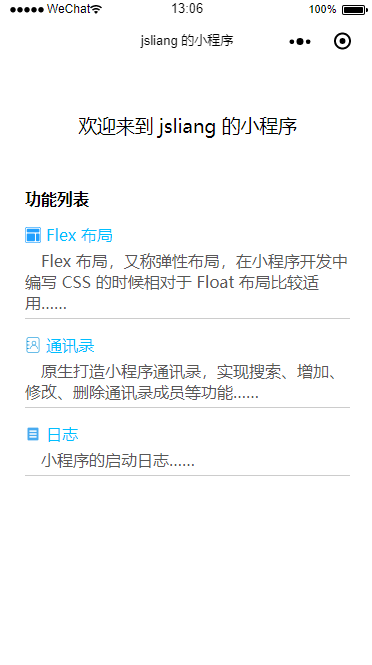

微信小程序 之 奇技淫巧
===

> Create by **jsliang** on **2018-11-21 20:46:36**  
> Recently revised in **2018-11-23 13:08:22**

<br>

&emsp;**Hello 小伙伴们，如果觉得本文还不错，记得给个 **star** ， 你们的 **star** 是我学习的动力！[GitHub 地址](https://github.com/LiangJunrong/document-library/blob/master/other-library/WeChatApplet/WeChatAppletBug.md)**

&emsp;**开篇点题**：  
&emsp;这是一篇专研小程序各种功能实现的文章，例如布局、通讯录、底部导航栏……  
&emsp;感觉不错点赞点 Star，感觉有错评论区溜达一番，虚心求教，不胜感激~ 



<br>

# <a name="chapter-one" id="chapter-one">一 目录</a>

&emsp;**不折腾的前端，和咸鱼有什么区别**

| 目录 |                                                                             
| --- | 
| [一 目录](#chapter-one) | 
| <a name="catalog-chapter-two" id="catalog-chapter-two"></a>[二 前言](#chapter-two) |
| <a name="catalog-chapter-three" id="catalog-chapter-three"></a>[三 功能列表](#chapter-three) |
| &emsp;<a name="catalog-chapter-three-one" id="catalog-chapter-three-one"></a>[3.1 排兵布阵 - flex布局](#chapter-three-one) |
| &emsp;&emsp;[3.1.1 基础概念](#chapter-three-one-one) |
| &emsp;&emsp;[3.1.2 左右布局](#chapter-three-one-two) |
| &emsp;&emsp;[3.1.3 混合布局](#chapter-three-one-three) |
| &emsp;<a name="catalog-chapter-three-two" id="catalog-chapter-three-two"></a>[3.2 沙场点兵 - 通讯录](#chapter-three-two) |
| <a name="catalog-chapter-four" id="catalog-chapter-four"></a>[四 项目地址](#chapter-four) |

<br>

# <a name="chapter-two" id="chapter-two">二 前言</a>

> [返回目录](#catalog-chapter-two)

<br>

&emsp;写文章无形中也会磨炼自己的表达能力。  
&emsp;这周 (`2018-11-19`) 在开发 **通讯录** 时，突然发现 **[微信小程序 bug 集中营](https://github.com/LiangJunrong/document-library/blob/master/other-library/WeChatApplet/WeChatAppletBug.md)** 这篇文章不能再继续写了，因为它变得 **臃肿**、**丑陋** 且 **难维护**，连我这个写作人都感慨：如果没有 `Ctrl + F` ，以及我的 **目录** 写得还不错，我真心不想再翻这篇文章。  
&emsp;为此，**jsliang** 单独开了一篇文章：**微信小程序功能清单**。  
&emsp;然后嘛，为了能吸引小伙伴点进来瞅瞅，起个标新立异的标题吧：**微信小程序 之 奇技淫巧**。

<br>

# <a name="chapter-three" id="chapter-three">三 功能列表</a>

> [返回目录](#catalog-chapter-three)

<br>

&emsp;**敲了再说**  

&emsp;**敲&emsp;&emsp;看**  
&emsp;**一&emsp;&emsp;一**  
&emsp;**遍&emsp;&emsp;遍**  
&emsp;**？&emsp;&emsp;？**  
&emsp;**天&emsp;&emsp;谁**  
&emsp;**差&emsp;&emsp;都**  
&emsp;**地&emsp;&emsp;可**  
&emsp;**别&emsp;&emsp;以**  
&emsp;**！&emsp;&emsp;！**

<br>

## <a name="chapter-three-one" id="chapter-three-one">3.1 排兵布阵 - flex布局</a>

> [返回目录](#catalog-chapter-three-one)

<br>

&emsp;如果你发现你的 `CSS` 水平还处于 `float` 状态，你会发现在小程序中你举步维艰，因为单单只用浮动布局，在小程序中它不好用。  
&emsp;所以，`Flex` 布局，是你的不二选择：布局的传统解决方案，基于盒状模型，依赖 `display` 属性 + `position` 属性 + `float` 属性。它对于那些特殊布局非常不方便，比如，垂直居中就不容易实现。`Flex` 布局。又称弹性布局，可以简便、完整、响应式地实现各种页面布局。  
&emsp;网上较好的教程有：

* [Flex 布局语法教程 | 菜鸟教程](https://www.runoob.com/w3cnote/flex-grammar.html)
* [Flex 布局教程：实例篇 | 阮一峰](http://www.techug.com/post/flex-examples.html)  

&emsp;如果你想全面了解 `Flex`，推荐去看上面的文章。  
&emsp;如果你已经了解 `Flex` 布局，点击 [返回目录](#chapter-one) 寻找更多精彩！  
&emsp;如果你想快速入手小程序下 `Flex` 布局，那么，`Here we go`；

<br>

### <a name="chapter-three-one-one" id="chapter-three-one-one">3.1.1 基础概念</a>

&emsp;[返回目录](#catalog-chapter-three-one)

<br>

&emsp;……

```
  <!-- 设置 flex 布局 -->
  display: flex;

  <!-- 
    1、决定主轴的方向
    row - （默认）水平方向，起点在左端
    row-reverse - 水平方向，起点在右端
    column - 垂直方向，起点在上沿
    column-reverse - 垂直方向，起点在下沿
   -->
  flex-direction: row | row-reverse | column | column-reverse;
  
  <!-- 
    2、一条轴线（一行）排不下时如何解决
    nowrap - （默认）不换行
    warp - 换行，第一行在上方
    wrap-reverse - 换行，第一行在下方
   -->
  flex-wrap: nowrap | wrap | wrap-reverse;
  
  <!-- 
    3、flex-flow = flex-direction + flex-wrap。即 flex-flow 是这两个属性的合集
    row nowrap - （默认）水平方向，起点在左端，不换行
   -->
  flex-flow: <flex-direction> || <flex-wrap>;
  
  <!-- 
    4、justify-content 定义项目在主轴上的对齐方式
    flex-start - 左边对齐
    flex-end - 右边对齐
    center - 居中对齐
    space-between - 两端对齐，空格在中间
    space-around - 空格环绕
   -->
  justify-content: flex-start | flex-end | center | space-between | space-around;
  
  <!-- 
    5、align-items 定义项目在交叉轴上如何对齐
    flex-start - 顶部对齐，即文字图片等顶部同一条线上
    flex-end - 底部对其，即文字图片等底部在同一条线上
    center - 中间对其，即文字图片不管多高，都拿它们的中间放在同一条线上
    stretch - 将文字图片充满整个容器的高度，强制统一
    baseline - 将每项的第一行文字做统一在一条线上对齐
   -->
  align-items: flex-start | flex-end | center | stretch | baseline;
  
  <!-- 
    6、align-content 定义多根轴线的对齐方式。如果只有一根轴线（只有一行），该属性不起作用
    flex-start - 这几行顶部对齐
    flex-end - 这几行底部对齐
    center - 这几行居中对齐
    stretch - 这几行进行扩展或者缩放，从而填满容器高
    space-between - 这几行中间使用空格进行填充
    space-around - 这几行两边及中间进行填充
   -->
  align-content: flex-start | flex-end | center | space-between | space-around | stretch;
```

<br>

### <a name="chapter-three-one-two" id="chapter-three-one-two">3.1.2 左右布局</a>

&emsp;[返回目录](#catalog-chapter-three-one)

&emsp;实现效果如下：


&emsp;如图，这是我们要实现的左右布局效果。那么，在微信小程序要怎么做呢？

> *.wxml
```
<view class="top-recommended-headlines">
  <view class="top-recommended-headlines-left">
    <text>热门推荐</text>
  </view>
  <view>
    <image src="../../public/index_top_recommended_headlines.png"></image>
  </view>
  <view class="top-recommended-headlines-right">
    <navigator url="../indexProduct/indexProduct">查看全部 ></navigator>
  </view>
</view>
```

<br>

> *.wxss
```
.top-recommended-headlines {
  display: flex;
  align-items: flex-end;
  height: 31rpx;
  line-height: 31rpx;
  margin-bottom: 10rpx;
}
.top-recommended-headlines-left text {
  font-size: 32rpx;
  font-weight: bold;
}
.top-recommended-headlines image {
  width: 366rpx;
  height: 31rpx;
  margin-left: 10rpx;
}
.top-recommended-headlines-right navigator {
  font-size: 26rpx;
  color: #a9a9a9;
  margin-left: 50rpx;
}
```

<br>

### <a name="chapter-three-one-three" id="chapter-three-one-three">3.1.3 混合布局</a>

&emsp;[返回目录](#catalog-chapter-three-one)

&emsp;实现效果如下：


&emsp;如图，这是我们要实现的左右布局效果。那么，在微信小程序要怎么做呢？

> *.wxml
```
<view class="weui-tab__content-item3" wx:for="{{tabs3Content}}" wx:key="{{item.index}}">
  <navigator url="../indexProductArticle/indexProductArticle">
    <view class="weui-tab__content-item3-question">
      <image src="../../public/index_productDetail_icon_question.png"></image>
      <text>{{item.title}}</text>
    </view>
    <view class="weui-tab__content-item3-answer">
      <image src="../../public/index_productDetail_icon_answer.png"></image>
      <text>{{item.content}}</text>
    </view>
    <view class="weui-tab__content-item3-detail">
      <text class="weui-tab__content-item3-detail-datatime">{{item.datatime}}</text>
      <text class="weui-tab__content-item3-detail-reader">{{item.reader}}阅读</text>
      <text class="weui-tab__content-item3-detail-label">#{{item.label}}#</text>
    </view>
  </navigator>
  <view class="weui-tab__content-item3-gap">
    <image src="../../public/index_productDetail_gap.png"></image>
  </view>
</view>
```

<br>

> *.wxss
```
.weui-tab__content-item3 {
  padding-left: 30rpx;
  padding-right: 30rpx;
  margin-top: -10rpx;
  margin-bottom: 10rpx;
}
.weui-tab__content-item3:first-child {
  padding: 40rpx 30rpx 0;
}
.weui-tab__content-item3-question image {
  width: 30rpx;
  height: 30rpx;
}
.weui-tab__content-item3-question text {
  font-size: 30rpx;
  line-height: 46rpx;
  font-weight: bold;
  color: #333;
  margin-left: 10rpx;
}
.weui-tab__content-item3-answer image {
  width: 30rpx;
  height: 30rpx;
}
.weui-tab__content-item3-answer text {
  font-size: 26rpx;
  line-height: 42rpx;
  color: #a9a9a9;
  margin-left: 10rpx;
}
.weui-tab__content-item3-detail {
  display: flex;
  justify-content: space-between;
  font-size: 26rpx;
  color: #a9a9a9;
}
.weui-tab__content-item3-detail-label {
  color: #d0a763;
}
.weui-tab__content-item3-gap image {
  width: 100%;
  height: 30rpx;
}
```

<br>

> *.js
```
tabs3Content: [
  {
    title: '员工发明创造是否属于职务发明的认证标准?',
    content: '随着企业对知识产权在企业发展中核心竞争力的认识力提高，企业保护自身知识产权的意识不断增强，使其技术得......',
    datatime: '2018-03-05',
    reader: '2081',
    label: '知识产权'
  }
]
```

<br>

## <a name="chapter-three-two" id="chapter-three-two">3.2 沙场点兵 - 通讯录</a>

> [返回目录](#catalog-chapter-three-two)

<br>

&emsp;**功能实现思路**

* 数据存放位置：
```
contactsData: [
  { groupName: 'A', users: [] },
  { groupName: 'B', users: [] },
  // ...C 组之后省略不写，同 A、B 组一样
]
```
* 正常分页接口 1：`pagination/paginationWayOne`
* 拼音分页接口 2（上拉加载）：`pagination/paginationWayTwo`
* 拼音分页接口 3（下拉加载）：`pagination/paginationWayThree`
* 修改数据接口：`changeData/editData`
* 删除数据接口：`changeData/deleteData`
* 新增数据接口：`changeData/addData`

1. 首屏渲染。用户进入页面，加载 **正常分页接口 1**：`pagination/paginationWayOne?pageNo=1`，获取第一页数据，并判断分组，添加到 `contactsData`。
2. 正常上拉动作。用户在进入页面后，执行正常的上拉加载动作，则执行 **正常分页接口 1**：`pagination/paginationWayOne?pageNo=2`，在原有 `contactsData` 的情况下，将第二页的数据进行判断分析，分别添加到各分组中。
3. 点击拼音导航条。加载 **拼音分页接口 2（上拉加载）**： `pagination/paginationWayTwo?pinyin=L&pageNo=1`，如果该次接口返回数据，则将新数据同【L】组及其之后的【M】【N】组等（因为【L】组可能不满分页条数）的原数据进行比对：如果是原数据所不存在的，则将新的数据直接 `push` 插入到【L】组尾端；如果该数据已存在，则不理会。
4. 拼音导航条情况下，执行上拉加载动作。则执行 **拼音分页接口 2（上拉加载）**：`pagination/paginationWayTwo?pinyin=L&pageNo=2`，从而加载第二页，并与上一条分析一样，分析判断，然后插入数据。
5. 拼音导航条情况下，执行下拉刷新动作。执行接口 **拼音分页接口 3（下拉加载）**：`pagination/paginationWayThree?pinyin=L&pageNo=1`，从而获得该字母前一个字母的数据（后端会进行倒序查询输出，我们需要的仅仅是进行判断，然后 `unshift` 插入渲染）。
6. 用户进行修改操作。加载接口 `changeData/editData?userName=jsliang`，点击修改后，删除原有数据，判断接口返回的拼音：首先循环 `A-Z`，查看该数据应该存放到哪个组；然后在该字母组中，执行二分查找；最后插入该数据位置，并重新渲染数据新增部分。
7. 用户执行删除操作。加载接口 `changeData/deleteData?userName=jsliang`，直接删除该数据。
8. 用户执行新增操作。加载接口 `changeData/addData`，成功后根据拼音进行二分查找，然后插入到对应的位置。

<br>

> 由于不能暴露公司代码，需要抽取进行单独编程。  
> 故以下代码尚未完善，敬请期待

&emsp;**☆———————华———————☆**  
&emsp;**☆———————丽———————☆**  
&emsp;**☆———————分———————☆**  
&emsp;**☆———————割———————☆**  
&emsp;**☆———————线———————☆**  

&emsp;话不多说，直接上手：

> *.wxml

```
<view class="pinyin-nav">
  <view wx:for="{{letters}}" wx:key="{{letters.index}}">
    <text class="pinyin-nav-byte" data-byte="{{item}}" bindtap="pingyinNav">{{item}}</text>
  </view>
</view>
```

> *.wxss

```
.pinyin-nav {
  font-size: 28rpx;
  line-height: 28rpx;
  position: fixed;
  right: 10rpx;
  top: 9%;
  height: 80%;
  text-align: center;
}
.pinyin-nav-byte {
  display: inline-block;
  width: 30rpx;
  border-radius: 20rpx;
  padding: 5rpx 5rpx;
  margin-top: 3rpx;
  color: #fff;
  background: rgb(129, 212, 238);
}
```

> *.js
```
Page({

  /**
   * 页面的初始数据
   */
  data: {
    // 导航字母
    letters: ['A', 'B', 'C', 'D', 'E', 'F', 'G', 'H', 'I', 'J', 'K', 'L', 'M', 'N', 'O', 'P', 'Q', 'R', 'S', 'T', 'U', 'V', 'W', 'X', 'Y', 'Z'],
    // 数据
    contactsData: [
      { groupName: 'A', users: [] },
      { groupName: 'B', users: [] },
      { groupName: 'C', users: [] },
      { groupName: 'D', users: [] },
      { groupName: 'E', users: [] },
      { groupName: 'F', users: [] },
      { groupName: 'G', users: [] },
      { groupName: 'H', users: [] },
      { groupName: 'I', users: [] },
      { groupName: 'J', users: [] },
      { groupName: 'K', users: [] },
      { groupName: 'L', users: [] },
      { groupName: 'M', users: [] },
      { groupName: 'N', users: [] },
      { groupName: 'O', users: [] },
      { groupName: 'P', users: [] },
      { groupName: 'Q', users: [] },
      { groupName: 'R', users: [] },
      { groupName: 'S', users: [] },
      { groupName: 'T', users: [] },
      { groupName: 'U', users: [] },
      { groupName: 'V', users: [] },
      { groupName: 'W', users: [] },
      { groupName: 'X', users: [] },
      { groupName: 'Y', users: [] },
      { groupName: 'Z', users: [] }
    ],
  },
  // 拼音导航
  pingyinNav(e) {
    console.log(e.currentTarget.dataset.byte);
  },
})
```

<br>

&emsp;在上面的代码中，**jsliang** 做了三件事：

1. 编写 `Wxml` 结构，由于只有一层 `view` 在循环的时候，在控制台看到的 `Wxml` 结构并不好看，所以循环的是第二层 `view`，这样就形成下面的效果：

```
<view>
  <view></view>
  <view></view>
  ...
</view>
```

2. 编写 `Wxss` 定位，**jsliang** 对 `Wxml` 进行了 `position: fixed` 的绝对定位，这样就可以将它固定在右侧。
3. 最后，在 `js` 中定义了遍历的数据（字母 `A-Z`）及点击字母的时候，将该字母传递过来并打印。

<br>

&emsp;在昨晚上面的基础环境搭建后，我们需要实现下拉、上拉的功能，这两个功能在微信小程序中有定义，这里就不做过多讲解：`onPullDownRefresh`、`onReachBottom`。下面我们重点讲解下点击字母滚动到对应页面：

> 代码片段

```
onLoad: function (options) {
  console.log("\n成员管理页：");
  
  // 设备信息
  wx.getSystemInfo({
    success: res => {
      console.log("\n设备信息为：");
      console.log(res);

      let equipmentOneRpx = 750 / res.windowWidth;
      console.log("换算信息：1rpx = " + equipmentOneRpx + "px");
      this.setData({
        equipmentOneRpx: equipmentOneRpx
      })
    },
  })
},
```

* [参考资料](https://blog.csdn.net/qq_41080490/article/details/80268298)

&emsp;我们在 `onLoad` 中获取到用户设备的信息，然后计算出 `1rpx` 等于多少 `px`。在 `iphone6` 中，`1rpx = 2px`。我们只需要将 `css` 中写的样式高度 / 比例，就能动态计算我们的高度。

<br>

# <a name="chapter-four" id="chapter-four">四 项目地址</a>

> [返回目录](#catalog-chapter-four)

<br>

&emsp;不定期更新，详情可关注 **jsliang** 的 [GitHub 地址](https://github.com/LiangJunrong/document-library/blob/master/other-library/WeChatApplet/WeChatAppletBug.md)  
&emsp;最后的最后，奉上上面实例中的地址：  

&emsp;[项目地址](https://github.com/LiangJunrong/WeChatApplet)


<br>

> <a rel="license" href="http://creativecommons.org/licenses/by-nc-sa/4.0/"></a><br /><a xmlns:dct="http://purl.org/dc/terms/" property="dct:title">**jsliang** 的文档库</a> 由 <a xmlns:cc="http://creativecommons.org/ns#" href="https://github.com/LiangJunrong/document-library" property="cc:attributionName" rel="cc:attributionURL">梁峻荣</a> 采用 <a rel="license" href="http://creativecommons.org/licenses/by-nc-sa/4.0/">知识共享 署名-非商业性使用-相同方式共享 4.0 国际 许可协议</a>进行许可。<br />基于<a xmlns:dct="http://purl.org/dc/terms/" href="https://github.com/LiangJunrong/document-library" rel="dct:source">https://github.om/LiangJunrong/document-library</a>上的作品创作。<br />本许可协议授权之外的使用权限可以从 <a xmlns:cc="http://creativecommons.org/ns#" href="https://creativecommons.org/licenses/by-nc-sa/2.5/cn/" rel="cc:morePermissions">https://creativecommons.org/licenses/by-nc-sa/2.5/cn/</a> 处获得。