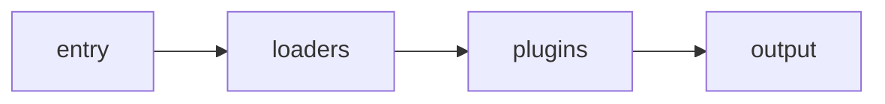

Webpack
===

> Create by **jsliang** on **2020-04-21 16:47:19**  
> Recently revised in **2020-09-24 16:31:01**

## <a name="chapter-one" id="chapter-one"></a>一 目录

**不折腾的前端，和咸鱼有什么区别**

| 目录 |
| --* | 
| [一 目录](#chapter-one) | 
| <a name="catalog-chapter-two" id="catalog-chapter-two"></a>[二 前言](#chapter-two) |

## <a name="chapter-two" id="chapter-two"></a>二 前言

> [返回目录](#chapter-one)

模块化知识：

* 模块化核心
  * 独立作用域与依赖关系处理
    * 导出模块内部数据
    * 导入外部模块数据
  * 基于 JavaScript 的模块系统分列
    * CommonJS
    * AMD
    * UMD
    * ESM

Webpack 基础

* Webpack 的基本功能
* 安装、命令工具与配置文件
* 入口文件的概念和打包输出
* 基本配置项
  * mode
  * entry
  * output
    * path 与 filename
    * 出口与入口规则和场景
  * loaders
    * module 选项
    * rules 选项
    * test 选项
    * use 选项
      * 单个 loader 配置
      * 多个 loader 的数组类型配置
      * 多个 loader 的对象类型配置

```js
const path = require('path');

// 因为 webpack 是运行在 node 环境下的，所以该文件也就是运行在 node 环境下了，那么 node 语法，模块都可以进行调用

// 这个导出去都对象就是 webpack 打包需要用到都配置对象
module.exports = {

	// 模式 : `"production" | "development" | "none"`
	mode: 'development',

	// entry: './src/index.js',

	// entry: [
	//     './src/index.js',
	//     './src/list.js'
	// ],

	entry: {
		'index': './src/index.js',
		// 'list': './src/list.js'
	},


	output: {
		// path 必须是绝对路径
		path: path.resolve(__dirname, "dist"),
		filename: '[name].js'
	},

	module: {
		// 各种 loader 加载处理规则
		rules: [
			// 每一种规则就是一个对象
			{
				// 被加载都模块规则，支持正则
				test: /\.txt$/i,
				// 满足上面的规则调用的对应loader
				use: 'raw-loader'
			}
		]
	}

}
```

## 模块化

模块化已经是现代前端开发中不可或缺的一部分了

把复杂的问题分解成相对独立的模块，这样的设计可以降低程序复杂性，提高代码的重用，也有利于团队协作开发与后期的维护和扩展

从 `ECMAScript2015` 开始引入了模块的概念，我们称为：`ECMAScript Module`，简称：`ESM`

## 模块化的核心

* 独立的作用域与依赖关系处理
  * 如何导出模块内部数据
  * 如果导入外部模块数据

## 基于 JavaScript 的模块系统分类

* CommonJS（适用于服务端，Node.js）

1. 每个文件都是一个单独的作用域
2. 通过 `module.exports()` 导出，`module.require()` 导入

在早起前端对于模块化并没有什么规范，反而是偏向服务端的应用有更强烈的需求，CommonJS 规范就是一套偏向服务端的模块化规范，NodeJS 就采用了这个规范。

* AMD

因为 CommonJS 规范一些特性（基于文件系统，同步加载），它并不适用于浏览器端，所以另外定义了适用于浏览器端的规范 

* UMD

严格来说，`UMD` 并不属于一套模块规范，它主要用来处理 `CommonJS`、`AMD`、`CMD` 的差异兼容，是模块代码能在前面不同的模块环境下都能正常运行

* ESM

## ESM

从 `ECMAScript2015` / `ECMAScript6` 开始，`JavaScript` 原生引入了模块概念，而且现在主流浏览器也都有了很好的支持

### 独立模块作用域

一个文件就是模块，拥有独立的作用域，且导出的模块都自动处于 `严格模式`下，即：`'use strict'`

### 导出模块内部数据

使用 `export` 语句导出模块内部数据

```js
// 导出单个特性
export let name1, name2, …, nameN;
export let name1 = …, name2 = …, …, nameN;
export function FunctionName(){...}
export class ClassName {...}

// 导出列表
export { name1, name2, …, nameN };

// 重命名导出
export { variable1 as name1, variable2 as name2, …, nameN };

// 默认导出
export default expression;
export default function (…) { … }
export default function name1(…) { … }
export { name1 as default, … };

// 模块重定向导出
export * from …;
export { name1, name2, …, nameN } from …;
export { import1 as name1, import2 as name2, …, nameN } from …;
export { default } from …;
```

### 导入外部模块数据

导入分为两种模式

* 静态导入
* 动态导入

**静态导入**

在浏览器中，`import` 语句只能在声明了 `type="module"` 的 script 的标签中使用。

```js
import defaultExport from "module-name";
import * as name from "module-name";

import { export } from "module-name";
import { export as alias } from "module-name";
import { export1 , export2 } from "module-name";
import { foo , bar } from "module-name/path/to/specific/un-exported/file";
import { export1 , export2 as alias2 , [...] } from "module-name";
import defaultExport, { export [ , [...] ] } from "module-name";
import defaultExport, * as name from "module-name";
import "module-name";
```

> 静态导入方式不支持延迟加载，`import` 必须这模块的最开始

```js
document.onclick = function () {
  // import 必须放置在当前模块最开始加载
  // import m1 from './m1.js'

  // console.log(m1);
}
```

**动态导入**

此外，还有一个类似函数的动态 `import()`，它不需要依赖 `type="module"` 的 script 标签。

关键字 `import` 可以像调用函数一样来动态的导入模块。以这种方式调用，将返回一个 `promise`。

```js
import('./m.js')
  .then(m => {
    //...
});
// 也支持 await
let m = await import('./m.js');
```

> 通过 `import()` 方法导入返回的数据会被包装在一个对象中，即使是 `default` 也是如此

## Webpack

### webpack 是什么？

* 官⽅方⽹网站：https://webpack.js.org/
* 中⽂文⽹网站：https://www.webpackjs.com/

本质上，`webpack` 是一个现代 `JavaScript` 应用程序的静态模块打包器(module bundler)。当 webpack 处理应用程序时，它会递归地构建一个依赖关系图(dependency graph)，其中包含应用程序需要的每个模块，然后将所有这些模块打包成一个或多个 bundle。

### 安装

`webpack` 是一个使用 `Node.js` 实现的一个模块化代码打包工具。所以，我们需要先安装 webpack，安装之前需要搭建好 `Node.js` 环境

```shell
 npm install -D webpack webpack-cli
```

> 注：不推荐全局安装

`webpack-cli` : 提供 webpack 命令、工具，类似 `create-react-app`

`webpack` : webpack 代码，类似 `react`

### 使用

```bash
./node_modules/.bin/webpack

// 查看版本
./node_modules/.bin/webpack -v
```

也可以编辑 `package.json` 的 `scripts` 来简化输入

```json
// package.json
{
	...,
	"scripts": {
		"start": "webpack"	// scripts 中可以定位到 ./node_modules/.bin/ 目录下
	}
}
```

> `scripts` 中使用 `test`、`start`、`restart`、`stop` 命名的时候，可以在调用的时候省略 `run`，即直接 `npm start`

当然，还可以使用更加方便的方式：

```bash
npx webpack
```

通过 `npx` 也可以帮助我们定位命令到 `./node_modules/.bin/` 目录下

> 注：npm5.2+ 增加，如果没有，可以使用 npm i -g npx 来安装


### 打包模块

打包之前，我们需要了解一个概念，入口文件

* 入口文件

入口文件就是我们项目中加载的第一个文件，比如上面的 `main.js` 文件，其它文件都是通过 `import` 等方式引入的，`webpack` 会从我们指定的入口文件开始分析所有需要依赖的文件，然后把打包成一个完整文件。

* 打包命令

```bash
webpack ./js/index.js
```

上面命令会使用 `webpack` 默认的一些配置对模块文件进行打包，并把打包后的文件输出到默认创建的 `./dist` 目录下，打包后的文件名称默认为 `main.js`。

模块文件打包以后，就可以在不支持 es6 模块语法的浏览器环境下引入使用了。

**打包文件分析**

* 把分散的模块文件打包到一个文件中，不需要外部引入了
* 内置了一个小型模块加载器(类似 `requireJS`)，实现了打包后的代码隔离与引用

以上就是 webpack 最基础的使用于基本原理，当然强大的 `webpack` 远远不止这些功能。

### 打包配置

虽然，我们可以直接通过命令的来打包，但是推荐创建一个 `webpack.config.js` 的配置文件来实现更方便和强大的功能。

`webpack` 命令在运行的时候，默认会读取运行命令所在的目录下的 `webpack.config.js` 文件，通常我们会在项目的根目录下运行命令和创建配置文件。

我们也可以通过 `—config` 选项来指定配置文件路径：

```shell
webpack --config ./configs/my_webpack.config.js
```

通常情况下，我们的项目目录大致如下：

```txt
/
-* /dist * 项目打包后存放目录
-* /node_modules * 第三方模块
-* /src
-----* css/
-----* images/
-----* js/
-----* index.js
-* webpack.config.js
-* package.json
```

配置文件

```javascript
module.exports = {
  ...	//配置项
}
```

### 核心配置

* mode

模式 : `"production" | "development" | "none"`

<!--cli-->

```bash
module.exports = {
  mode: 'production'
}
```

* entry

指定打包⼊口⽂文件，有三种不同的形式：`string | object | array`

一对一：一个入口、一个打包文件

```js
module.exports = {
  entry: './src/index.js'
}
```

多对一：多个入口、一个打包文件

```js
module.exports = {
  entry: [
    './src/index1.js',
    './src/index2.js',
  ]
}
```

多对多：多个入口、多打包文件

```js
module.exports = {
  entry: {
    'index1': "./src/index1.js",
    'index2': "./src/index2.js"
  }
}
```

* output

打包后的文件位置

```js
module.exports = {
  ...,
  output: {
  	path: path.resolve(__dirname, "dist"),
    filename: "bundle.js",
		filename: "[name].js"
	}
}
```

* 可以指定一个固定的文件名称，如果是多入口多出口(`entry` 为对象)，则不能使用单文件出口，需要使用下面的方式
* 通过 `webpack` 内置的变量占位符：`[name]`


### 深入

在 `webpack` 中，有一个很重要的特性：模块不仅仅只是 `js` 的文件，`webpack` 可以把任意文件数据作为模块进行处理，包括：非 js 文本、css、图片等等

```javascript
import txt from './a.txt';
console.log(txt);
```

但是 `webpack` 默认情况下只能处理 `js` 模块，如果需要处理其它类型的模块，则需要使用它提供的一些其它功能

* 执行简要流程



* `loaders`：`webpack` 中灰常核心的内容之一，前面我们说的非 js 类型的模块处理就靠它了，不同类型的模块的解析就是依赖不同的 `loader` 来实现的
* `plugins`：`webpack` 中另外一个核心的内容，它主要是扩展 `webpack` 本身的一些功能，它们会运行在各种模块解析完成以后的打包编译阶段，比如对解析后的模块文件进行压缩等


### Loaders

https://webpack.js.org/loaders/

```js
module.exports = {
  ...,
  module: {
  	rules:[
  		{
  			test:/\.xxx$/,
       	use:{
        	loader: 'xxx-load'
      	}
			}
  	]
	}
}
```

当 `webpack` 碰到不识别的模块的时候，`webpack` 会在配置的 `module` 中进行该文件解析规则的查找

- `rules` 就是我们为不同类型的文件定义的解析规则对应的 loader，它是一个数组
- 每一种类型规则通过 test 选项来定义，通过正则进行匹配，通常我们会通过正则的方式来匹配文件后缀类型
- `use` 针对匹配到文件类型，调用对应的 `loader` 进行处理

**从一个简单的案例来了解 loader**

<!--src/datas/data.txt-->

```
我是 txt 的内容
```

<!--src/datas/data.md-->

```
# 我是 md 的内容
```

<!--src/raw-loader.js-->

```javascript
import txtData from './datas/data.txt';
import mdData from './datas/data.md';

console.log('txtData: ', txtData);
console.log('mdData: ', mdData);
```

默认情况下，webpack 会报错，因为 webpack 处理不了 txt 和 md 这样的非 js 的模块，但是我们可以通过专门来处理纯文本内容(不同的 loader 有不同的作用)

* `raw-loader`

在 webpack 中通过 import 方式导入文件内容，loader 并不是 webpack 内置的，所以首先要安装

```bash
npm install --save-dev raw-loader
```

然后在 webpack.config.js 中进行配置

```javascript
module.exports = {
  ...,
  module: {
      rules: [
      {
        test: /\.(txt|md)$/,
        use: 'raw-loader'
    	}
    ]
	}
}
```

* `file-loader`

把识别出的资源模块，移动到指定的输出⽬目录，并且返回这个资源在输出目录的地址(字符串)

```bash
npm install --save-dev file-loader
```

```javascript
rules: [
  ...,
	{
		test: /\.(png|jpe?g|gif)$/,
    use: {
      loader: "file-loader",
      options: {
        // placeholder 占位符 [name] 源资源模块的名称
        // [ext] 源资源模块的后缀
        name: "[name]_[hash].[ext]",
        //打包后的存放位置
        outputPath: "./images"
        // 打包后文件的 url
        publicPath: './images',
      }
    }
	}
]
```

> 占位符：https://webpack.js.org/loaders/file-loader#placeholders

* `url-loader`

可以处理理 `file-loader` 所有的事情，但是遇到图片格式的模块，可以选择性的把图片转成 `base64`  格式的字符串，并打包到 `js` 中，对⼩体积的图片⽐较合适，⼤图⽚不合适。

```bash
npm install --save-dev url-loader
```

```javascript
rules: [
  ...,
	{
		test: /\.(png|jpe?g|gif)$/,
    use: {
      loader: "url-loader",
      options: {
        // placeholder 占位符 [name] 源资源模块的名称
        // [ext] 源资源模块的后缀
        name: "[name]_[hash].[ext]",
        //打包后的存放位置
        outputPath: "./images"
        // 打包后文件的 url
        publicPath: './images',
        // 小于 100 字节转成 base64 格式
        limit: 100
      }
    }
	}
]
```

* `css-loader`

分析 `css` 模块之间的关系，并合成⼀个 `css`

```bash
npm install --save-dev css-loader
```

```js
rules: [
  ...,
	{
		test: /\.css$/,
    use: {
      loader: "css-loader",
      options: {
  			// 启用/禁用 url() 处理
  			url: true,
  			// 启用/禁用 @import 处理
  			import: true,
        // 启用/禁用 Sourcemap
        sourceMap: false
      }
    }
	}
]
```

* `style-loader`

把 `css-loader` 生成的内容，用 `style` 标签挂载到⻚面的 `head` 中

```bash
npm install --save-dev style-loader
```

```js
rules: [
  ...,
	{
		test: /\.css$/,
    use: ["style-loader", "css-loader"]
	}
]
```

同一个任务的 `loader` 可以同时挂载多个，处理顺序为：从右到左，也就是先通过 `css-loader` 处理，然后把处理后的 `css` 字符串交给 `style-loader` 进行处理

```js
rules: [
  ...,
	{
		test: /\.css$/,
    use: [
  		{
  			loader: 'style-loader',
  			options: {}
  		},
      'css-loader'
		]
	}
]
```

---

**不折腾的前端，和咸鱼有什么区别！**


**jsliang** 会每天更新一道 LeetCode 题解，从而帮助小伙伴们夯实原生 JS 基础，了解与学习算法与数据结构。

**浪子神剑** 会每天更新面试题，以面试题为驱动来带动大家学习，坚持每天学习与思考，每天进步一点！

扫描上方二维码，关注 **jsliang** 的公众号（左）和 **浪子神剑** 的公众号（右），让我们一起折腾！

> <a rel="license" href="http://creativecommons.org/licenses/by-nc-sa/4.0/"></a><br /><span xmlns:dct="http://purl.org/dc/terms/" property="dct:title">jsliang 的文档库</span> 由 <a xmlns:cc="http://creativecommons.org/ns#" href="https://github.com/LiangJunrong/document-library" property="cc:attributionName" rel="cc:attributionURL">梁峻荣</a> 采用 <a rel="license" href="http://creativecommons.org/licenses/by-nc-sa/4.0/">知识共享 署名-非商业性使用-相同方式共享 4.0 国际 许可协议</a>进行许可。<br />基于<a xmlns:dct="http://purl.org/dc/terms/" href="https://github.com/LiangJunrong/document-library" rel="dct:source">https://github.com/LiangJunrong/document-library</a>上的作品创作。<br />本许可协议授权之外的使用权限可以从 <a xmlns:cc="http://creativecommons.org/ns#" href="https://creativecommons.org/licenses/by-nc-sa/2.5/cn/" rel="cc:morePermissions">https://creativecommons.org/licenses/by-nc-sa/2.5/cn/</a> 处获得。