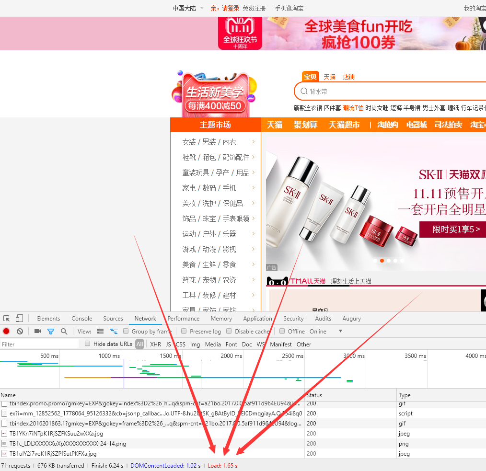
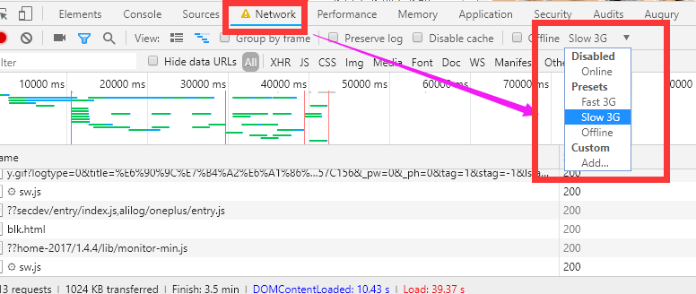
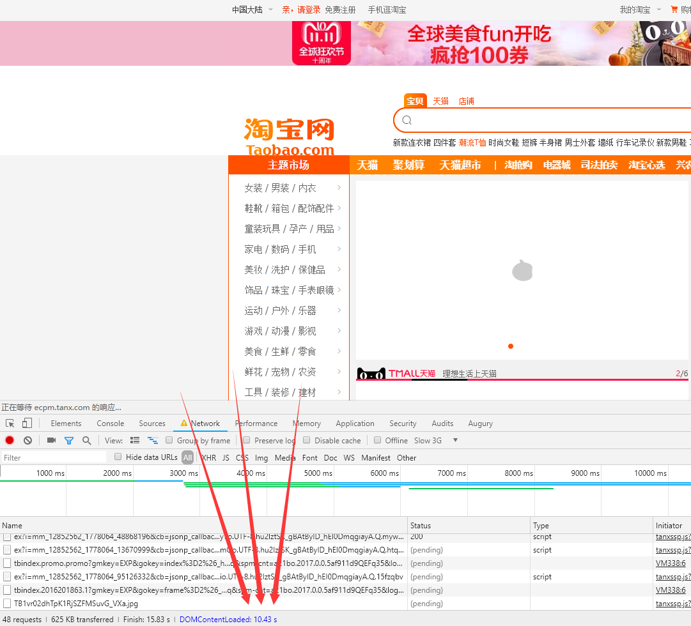
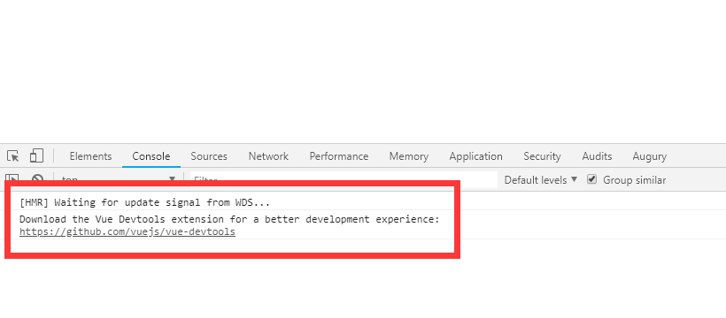
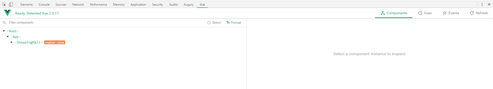
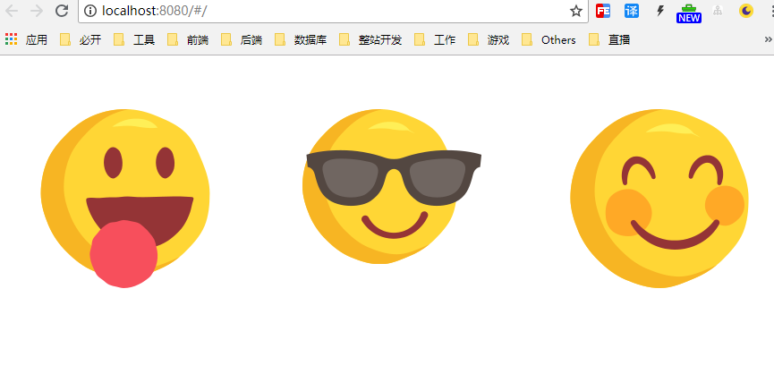

Vue + Koa2 + MongoDB 搭建商城
===

> Create by **jsliang** on **2018-10-25 15:14:00**  
> Recently revised in **2018-10-28 18:58:21**

<br>

&emsp;**Hello 小伙伴们，如果觉得本文还不错，记得给个 **star** ， 你们的 **star** 是我学习的动力！[GitHub 地址](https://github.com/LiangJunrong/document-library/blob/master/other-library/Website/ShoppingMall/ShoppingMall.md)**

<br>

&emsp;本文通过 Vue + Koa2 + MongoDB 搭建一个春节/新年皮肤的商城。

&emsp;本文参考教程：[Vue.js+Koa2移动电商实战视频教程(文字版)](http://jspang.com/post/vue-koa.html)

&emsp;涉及技术点：

* Vue - `2.5.2`
* Vant - `1.3.8`
* Node - `8.11.2`
* Koa2 - 
* MongoDB - 

&emsp;值得注意的是，你在这里看到的，不是从无到有的开发过程，即：这不是一篇手把手带你 0 基础搞定一切的文章。  
&emsp;细瞧代码片刻，竟无语凝噎，唯有泪千行，妈妈我不知道怎么跟小伙伴们讲啊！前端代码涉及知识点太多了~  
&emsp;但，文章篇幅会非常详细，**jsliang** 会尽可能地提供相应的开发思路，如果你在阅读这篇文章的过程中，发现某些无法看懂，请自行 `百度` 或者 `Google` 或者在 `QQ 群` @ 我。这就好比咱要做一件坏事，**jsliang** 为你提供了作案思路和作案工具，还有外援([QQ 群 798961601](https://jq.qq.com/?_wv=1027&k=5bSk4rs))，相信小伙伴们在自己的努力下，会收获不一样的精彩。

&emsp;推荐通过 `目录` 以及使用 `返回目录` 按钮，获得更好的阅读体验。


<br>

&emsp;**如果你对文章的一些章节存在疑惑，请留言或者私聊 jsliang 提出来，jsliang 在自己理解的基础上尽可能为你解答，因为 jsliang 在 Vue 某些方面的理解，是远远不及一些有丰富开发经验的 Vuer 的。**

<br>

# <a name="chapter-one" id="chapter-one">一 目录</a>

&emsp;**我不是想犯罪，只是，似乎证据确凿？……**

| 目录名 |
| --- |
| <a name="catalog-chapter-one" id="catalog-chapter-one"></a>[一 目录：你一定会回来的](#chapter-one) |
| <a name="catalog-chapter-two" id="catalog-chapter-two"></a>[二 自白：我想做个好人](#chapter-two) |
| <a name="catalog-chapter-three" id="catalog-chapter-three"></a>[三 犯罪商城：奇技淫巧](#chapter-three) |
| &emsp;[3.1 VS Code 插件](#chapter-three-one) |
| &emsp;[3.2 Iconfont-阿里巴巴矢量图标库](#chapter-three-two) |
| &emsp;[3.3 Vant——Vue的组件库](#chapter-three-three) |
| &emsp;&emsp;[3.3.1 引用 Vant 组件库](#chapter-three-three-one)|
| &emsp;&emsp;[3.3.2 Button 按钮](#chapter-three-three-two)|
| &emsp;&emsp;[3.3.3 Layout 布局](#chapter-three-three-three)|
| &emsp;[3.4 模拟网速缓慢 - Slow 3G](#chapter-three-four) |
| &emsp;[3.5 mock 数据 - Easy Mock](#chapter-three-five) |
| &emsp;[3.6 Chrome 插件 - Vue Devtool](#chapter-three-six) |
| &emsp;[3.7 Swiper 组件 - vue-awesome-swiper](#chapter-three-seven) |
| <a name="catalog-chapter-four" id="catalog-chapter-four"></a>[四 犯罪前奏：前端基础](#chapter-four) |
| &emsp;[4.1 vue-cli 的安装及使用](#chapter-four-one) |
| &emsp;[4.2 引用图片](#chapter-four-two) |
| &emsp;[4.3 引用 Axios 获取 API](#chapter-four-three) |
| &emsp;[4.4 API 接口文件配置](#chapter-four-four) |
| &emsp;[4.5 Filter 过滤器](#chapter-four-five) |
| &emsp;[4.6 Sass 的安装](#chapter-four-six) |
| <a name="catalog-chapter-five" id="catalog-chapter-five"></a>[五 犯罪经过：页面布局](#chapter-five) |
| <a name="catalog-chapter-six" id="catalog-chapter-six"></a>[六 牢狱之灾：初识数据](#chapter-six) |
| <a name="catalog-chapter-seven" id="catalog-chapter-seven"></a>[七 作案新招：后端基础](#chapter-seven) |
| <a name="catalog-chapter-eight" id="catalog-chapter-eight"></a>[八 卷土重来：项目部署](#chapter-eight) |
| <a name="catalog-chapter-night" id="catalog-chapter-night"></a>[九 枪决前刻：我真的是个好人](#chapter-night) |

<br>

# <a name="chapter-two" id="chapter-two">二 前言</a>

> [返回目录](#catalog-chapter-two)

<br>

&emsp;**商城思路**：

&emsp;**规则**：
* 用户有 10000 初始金币
* 用户可以向系统商城购买商品
* 用户可以购买店铺皮肤
* 用户可以修改商品标题、介绍、图片、详情
* 用户通过售卖商品、商铺点赞、商品点赞获得金币
* 用户可以参与销售比赛。比赛规则：假如有 10 个用户参与商户竞赛，总共有 1000 个用户参与其中。那么，比赛主持人（我）将投入 100 块钱，假如其中一个用户最后获得 100 * 10000 金币，那么，它将得到 10 块钱……以此类推

&emsp;**页面**：
1. 注册/登录
2. 商城首页-商品推荐页
3. 商家首页-商品列表页
4. 购物车页
5. 新增收获地址页
6. 订单/付款页
7. 销售排行榜页
8. 个人中心页
9. 道具页
10. 打卡日历页

<br>

&emsp;**下载代码**：代码目前在 **jsliang** 的 **unfineshed-code** 仓库中，等这篇文章完结了会单独开一个仓库以供下载，如果你想即刻拥有原始资料，那就点击链接加 QQ 群拿资料吧：[798961601](https://jq.qq.com/?_wv=1027&k=5bSk4rs)。  
&emsp;我是 **jsliang**，我在天书世界等你，噢，不是……  
&emsp;我是 **jsliang**，想要资料就来砍我，哦，不是……  
&emsp;我是 **jsliang**，我在 **jsliang** 资料群等你~  

<br>

&emsp;**运行代码**：

```
# 安装依赖
npm i

# 在 localhost:8080 运行
npm run dev

# 打包部署到服务器
npm run build
```

<br>

# <a name="chapter-three" id="chapter-three">三 奇技淫巧</a>

> [返回目录](#catalog-chapter-three)

<br>

&emsp;在这个章节中，你可以看到 VS Code 的一些插件的妙用；可以看到 Iconfont 这个图标库的使用；可以看到一些比较实用的组件库例如 Vant 的介绍……  
&emsp;通过这些小技巧，提高你的开发效率。  
&emsp;如果这些小技巧你都用得非常熟练了，请通过目录跳转至第四章或者直接前往第五章，学习其他的开发技巧。

<br>

## <a name="chapter-three-one" id="chapter-three-one">3.1 VS Code 插件</a>


> [返回目录](#catalog-chapter-three)

<br>

&emsp;使用方法：Visio Studio Code 软件 -> 扩展 -> 搜索关键字 -> 安装 -> 重启 VS Code

* `Vetur`：该插件可以使得 VS Code 能识别 `.vue` 文件，并支持 `.vue` 文件的语法高亮显示，同时，还兼顾大多数主流的前端开发和插件，例如 `Sass` 和 `TypeScript`。

* `Vue VSCode Snippets`：该插件可以方便编写 Vue 代码。通过安装后，在页面中敲 `vbase` 并回车可以得到一个空模板，敲 `vdata` 可以获得一个 `data()` 方法。

<br>

## <a name="chapter-three-two" id="chapter-three-two">3.2 Iconfont-阿里巴巴矢量图标库</a>

> [返回目录](#catalog-chapter-three)

<br>

&emsp;在阿里巴巴图标库，设计师将图标上传到 Iconfont 平台，用户可以自定义下载多种格式的 icon，平台也可将图标转换为字体，便于前端工程师自由调整与调用。  

&emsp;地址：[阿里巴巴图标库](http://www.iconfont.cn/)

&emsp;使用方法，通过加入购物车的形式，将需要的图标一起打包下载。如果实在是不看攻略就搞不懂，可参考文档：[链接-如何使用 iconfont 下载图标？](https://www.cnblogs.com/hjvsdr/p/6639649.html)

<br>

## <a name="chapter-three-three" id="chapter-three-three">3.3 Vant——Vue的组件库</a>

> [返回目录](#catalog-chapter-three)

<br>  

&emsp;Vant 是轻量、可靠的移动端 Vue 组件库：[Vant 官网](https://youzan.github.io/vant/#/zh-CN/intro)

&emsp;这里我们讲一下 Vant 的基础引用，下面章节涉及到 Vant 的代码时，请小伙伴们直接查看上面的 Vant 官网。因为组件库的使用，只有自己去折腾几遍，才能玩得溜。

<br>

## <a name="chapter-three-three-one" id="chapter-three-three-one">3.3.1 引用 Vant 组件库</a>

> [返回目录](#catalog-chapter-three)

<br>

&emsp;在通过 Vue-cli 安装了 Vue 项目的情况下，Vant 的安装及配置：

1. 安装 Vant：`npm i vant -S`
2. 通过安装 `babel-plugin-import` 按需引用组件模块：`npm i babel-plugin-import -D`
3. 在 `.babelrc` 文件中配置 `plugins`：

> .babelrc

```
{
  "presets": [
      ... 省略，详情在 .babelrc 中有，复制下面的 plugins 至代码中即可
  ],
  "plugins": [
    "transform-vue-jsx", 
    "transform-runtime",
    [
      "import",
      {
        "libraryName": "vant",
        "style": true
      }
    ]
  ]
}

```

<br>

## <a name="chapter-three-three-two" id="chapter-three-three-two">3.3.2 Button 按钮</a>

> [返回目录](#catalog-chapter-three)

<br>

&emsp;这里讲解下页面中引用 Vant 的 Button 组件：

> src/main.js

```
import { Button } from 'vant'
Vue.use(Button)
```

<br>

> src/App.vue

```
<van-button type="primary">主要按钮</van-button>
```

<br>

&emsp;这样，我们可以通过引用组件的形式，引用 Vant，做到按需引用，对我们的项目是比较友好的。如果你想采用其他的引用技巧或者更进一步了解 Vant，请点击上面提及的 Vant 链接，直接访问即可。

<br>

## <a name="chapter-three-three-three" id="chapter-three-three-three">3.3.3 Layout 布局</a>

> [返回目录](#catalog-chapter-three)

<br>

&emsp;如果你使用过 bootstrap，你可能还记得它的 12 格栅格化布局，在 Vant 中，它不同于 bootstrap，它使用了 24 格布局：[Vant Layout 布局](https://youzan.github.io/vant/#/zh-CN/col)。  

&emsp;下面我们讲解它的使用：

&emsp;我们在 `src/main.js` 中引用 Vant 的 `Row` 和 `Col` 组件：

> src/main.js

```
// The Vue build version to load with the `import` command
// (runtime-only or standalone) has been set in webpack.base.conf with an alias.
import Vue from 'vue'
import App from './App'
import router from './router'
import { Button, Row, Col } from 'vant'

Vue
.use(Button)
.use(Row)
.use(Col)

Vue.config.productionTip = false

/* eslint-disable no-new */
new Vue({
  el: '#app',
  router,
  components: { App },
  template: '<App/>'
})

```

<br>

&emsp;然后，我们在 `ShopingMall.vue` 中使用布局

> ShoppingMall.vue

```
<template>
    <div>
        <van-button type="primary">主要按钮</van-button>
        <van-row>
          <van-col span="8">span: 8</van-col>
          <van-col span="8">span: 8</van-col>
          <van-col span="8">span: 8</van-col>
        </van-row>
    </div>
</template>

<script>
    export default {
        
    }
</script>

<style scoped>

</style>
```

&emsp;这样，我们就搞定了 Vant Layout 布局的引用。

<br>

## <a name="chapter-three-four" id="chapter-three-four">3.4 模拟网速缓慢 - Slow 3G</a>

> [返回目录](#catalog-chapter-three)

<br>  

&emsp;由于我们制作的是商城，到时候可能加载大量的图片。  
&emsp;所以，我们不仅需要考虑用户在 WiFi 下的愉快体验，更需要考虑在野外等手机信号差的 3G，甚至 2G 信号下商城的加载速度，从而优化用户的浏览体验。  
&emsp;因为我们平时在公司或者家里开发，都是 `WiFi` 网络。所以，在这里，我们使用 `Chrome` 控制台的 `Slow 3G`，通过加载PC端淘宝，进行网速慢的模拟。

&emsp;首先，我们通过 `Chrome` 打开淘宝首页，通过 `F12` 打开控制台，点开 `Network` 并通过按 `Ctrl + F5` 进行强制刷新，得到下面这个图：



<br>

&emsp;可以看到，我们 WiFi 情况下，DOM 节点的内容加载为 1.02s。然后，我们按下面的图点开下拉菜单，选择 `Slow 3G`：



<br>

&emsp;再通过 `Ctrl + F5` 进行强制刷新，模拟网速缓慢的情况：



&emsp;可以看出，在网速缓慢的情况下，我们加载 DOM 节点的内容，加载了 `10.43s`。无疑，假设我们开发的商城在上线后变成这样，当用户在网速更差的情况下，可能会选择直接关闭网站。  
&emsp;所以，通过网络缓慢的情景模拟，可以对网站做一些性能优化，从而减少我们的用户量。

<br>

## <a name="chapter-three-five" id="chapter-three-five">3.5 mock 数据 - Easy Mock</a>

> [返回目录](#catalog-chapter-three)

<br>  

&emsp;对于页面中最后需要调用接口渲染的数据，我们大概会使用两种方法：  
1. 直接在 `data` 中使用假数据，读取接口后再进行更新；
2. 根据接口文档，进行 `mock`，获取 `mock` 数据。  

&emsp;在这里，我们介绍一种比较便捷的方式：[Easy Mock](https://www.easy-mock.com)  
&emsp;Easy Mock 是一个比较好用的图形化网站，小伙伴们点击进去会立刻 get 到它的设计意图，我们可以直接在项目中通过 `Axios` 直接调用它的链接，获取到数据。

<br>

## <a name="chapter-three-six" id="chapter-three-six">3.6 Vue 的 Chrome 插件 - Vue Devtool</a>

> [返回目录](#catalog-chapter-three)

<br>  

&emsp;如果你是 Vue 新手，那么，当你第一次运行 `npm run dev`，在 `localhost:8080` 中打开控制台会发现：



<br>

&emsp;它提示我们安装个 Vue Devtools 的插件，来获得更好的开发体验：

```
Download the Vue Devtools extension for a better development experience:
https://github.com/vuejs/vue-devtools
```

<br>

&emsp;所以，我们下载了个 `Vue Devtools` 的插件，并进行了安装。插件安装包和安装方式：

* [参考地址1-安装方式](https://segmentfault.com/a/1190000009682735)
* [参考地址2-安装包](http://chromecj.com/downloadstart.html#886)（加入公众号 -> 获取验证码 -> 下载资料 -> 取消关注）

&emsp;安装完成后，我们可以刷新页面，可以在 Vue 项目的控制台中看到：



&emsp;由于插件非常简洁，一看就懂，所以这里就不讲解了，这样我们又可以愉快地玩耍啦~

<br>

## <a name="chapter-three-seven" id="chapter-three-seven">3.7 Swiper 组件 - vue-awesome-swiper</a>

> [返回目录](#catalog-chapter-three)

<br>  

&emsp;`vue-awesome-swiper` 是关于 Vue 的一个 Swiper 组件，它实现了轮播图、滑动、内容滚动等功能，GitHub 地址：[vue-awesome-swiper](https://github.com/surmon-china/vue-awesome-swiper)

&emsp;它适合 `PC` 或者 `Mobile` 端，可用于 `SPA`  或者 `SSR` 页面。

&emsp;它的使用技巧及 `Example` 在上面的 `GitHub` 地址存在，如果你想先了解它的作用，可以点击这里：[展示地址](https://surmon-china.github.io/vue-awesome-swiper/)

&emsp;然后，上面的演示对应的代码为：[代码地址](https://github.com/surmon-china/vue-awesome-swiper/tree/master/examples)。在安装了 `vue-awesome-swiper` 的情况下，将代码地址中的任意一个 `.vue` 文件复制到我们的项目，进行稍微修改即可。

* 全局引用：

> main.js

```
// import 依赖
import Vue from 'vue'
import VueAwesomeSwiper from 'vue-awesome-swiper'

// 加载样式
import 'swiper/dist/css/swiper.css'

// 全局使用
Vue.use(
  VueAwesomeSwiper, 
)

// ...
```

<br>

* 页面中组件形式引用

> *.vue

```
// 以组件方式引用
import { swiper, swiperSlide } from 'vue-awesome-swiper'

// 加载样式
import 'swiper/dist/css/swiper.css'

// 引用组件
export default {
  components: {
    swiper,
    swiperSlide
  }
}
```

&emsp;如果你需要更多的技巧，请直接翻阅它的 `Github`。

<br>

# <a name="chapter-four" id="chapter-four">四 前端开发</a>

> [返回目录](#catalog-chapter-four)

<br>

&emsp;在这个章节，我们开始部署前端基础环境，为后续的连贯操作做基础准备。 
<br>

## <a name="chapter-four-one" id="chapter-four-one">4.1 vue-cli 的安装及使用</a>

> [返回目录](#catalog-chapter-four)

<br>

&emsp;步骤：

1. 安装 `vue-cli`：`npm i vue-cli -g`
2. 初始化 Vue 项目：`vue init webpack`
3. 开启开发模式：`npm run dev`
4. 打开浏览器，查看网页： `http://localhost:8080`

<br>

## <a name="chapter-four-two" id="chapter-four-two">4.2 引用图片</a>

> [返回目录](#catalog-chapter-four)

<br>

&emsp;如果你没用过 `Vue-cli`，那么，你可能会对它的图片存放路径存在问题，因为它可以存放在 `src/assets` 及 `static` 这两个目录中。你可能对此感到疑惑，为什么它会有两个文件夹来进行存放呢？  
&emsp;讲个大白话：`src/assets` 目录中的图片是会被 `webpack` 打包成 base64 的，`static` 目录中的图片是不会被打包的。  
&emsp;那么，为什么会存在打包成 `base64` 的区别呢？因为当浏览器加载你的图片的时候，每一张图片就相当于一次 `http` 请求，当图片多了的时候，它就会损耗你的性能。所以，就像 [雪碧图](https://zhidao.baidu.com/question/646556016260409565.html) 的引用一样，在 vue-cli 的配置上：

```
{
  test: /\.(png|jpe?g|gif|svg)(\?.*)?$/,
  loader: 'url-loader',
  options: {
    limit: 10000,
    name: utils.assetsPath('img/[name].[hash:7].[ext]')
  }
},
```

<br>

&emsp;可以看出，它对于小于 10K(10000/1024) 的图片，会打包成 base64，从而减少了我们在浏览器加载时的性能损耗。

<br>

&emsp;讲解完 `src/assets` 及 `static` 的区别后，我们继续讲在这两个文件夹中图片的引用。  
&emsp;由于 `src/assets` 目录中，我们存放一些比较小的，需要打包的图片，所以我们应该通过 require 的方式，将它当成模块进行引用。  
&emsp;而在 `static` 目录的图片，`vue-cli` 已经对其进行了个解析：   

> config/index/js

```
'use strict'

const path = require('path')

module.exports = {
  dev: {
    assetsSubDirectory: 'static',
    assetsPublicPath: '/',
    proxyTable: {},
    //... 省略剩下的代码
  },
   build: {
    index: path.resolve(__dirname, '../dist/index.html'),

    assetsRoot: path.resolve(__dirname, '../dist'),
    assetsSubDirectory: 'static',
    assetsPublicPath: '/',
    // ...省略剩下的代码
   }
}
```

&emsp;从中，可以看出，对于 `static` 的资源，`vue-cli` 在开发模式 `dev` 以及打包模式 `build` 中都进行了配置，它不会被 `webpack` 进行打包，属于 “静态资源”。所以，在项目中引用 `src/assets` 及 `static` 下的图片资源，我们可以：

> src/components/pages/ShoppingMall.vue
```
<template>
  <div>
      <van-row>
        <!-- 不推荐通过下面的方式直接引用 assets 图片，因为 webpack 打包可能没法成功打包 -->
        <van-col span="8"></van-col>
        <van-col span="8"></van-col>
        <van-col span="8"></van-col>
      </van-row>
  </div>
</template>

<script>
  export default {
    data() {
      return {
        icon1: require('../../assets/img/emoticon_cool.png'), // 引用 assets 下的图片
        icon2: '/static/img/emoticon_cute.png' // 引用 static 下的图片
      }
    }
  }
</script>

<style scoped>

</style>
```

<br>

&emsp;通过 `npm run dev` 编译后，浏览器 `localhost:8080` 展示为：



<br>

## <a name="chapter-four-three" id="chapter-four-three">4.3 引用 Axios 获取 API</a>

> [返回目录](#catalog-chapter-four)

<br>

&emsp;步骤：

1. 安装 `axios`：`npm i axios -S`
2. 在 `src/components/pages/ShoppingMall.vue` 的 `<script>` 标签中引用并使用 `axios`：

```
<script>
  import axios from 'axios';
  export default {
    data() {
      return {
        icon1: require('../../assets/img/emoticon_cool.png'), // 引用 assets 下的图片
        icon2: '/static/img/emoticon_cute.png' // 引用 static 下的图片
      }
    },
    created() {
      axios({
        url: 'https://www.easy-mock.com/mock/5bd2b50e6388c25a14965a22/index',
        method: 'get'
      }).then(res => {
        console.log(res.data.data);
      }).catch(err => {
        console.log(err);
      })
    }
  }
</script>
```

<br>

&emsp;然后，我们打开 `localhost:8080`，查看控制台，可以看到它进行了正常的输出。

<br>

## <a name="chapter-four-four" id="chapter-four-four">4.4 API 接口文件配置</a>

> [返回目录](#catalog-chapter-four)

<br>

&emsp;在 `4.3` 章节中，我们提及到了 `Axios` 对接口的调用。  
&emsp;但是，小伙伴们有没有想到，如果某天，后端大大对你说，某台服务器过期了，你将接口地址更改一下。听到这话，你乖乖地一个一个 `.vue` 文件改一遍，当你还没有改完时，后端大大又发你一个接口地址：“确定了，咱还是用这个。”……  
&emsp;不知道小伙伴会是什么心情吧……所以，为了预防万一，我们将 `API` 地址统一抽取到一个文件，到时候修改起来也方便。  
&emsp;我们在 `src` 目录下新建一个 `serviceAPI.config.js` 配置文件，用来存放 `API` 接口地址：

> src/serviceAPI.config.js

```
const BASEURL = "https://www.easy-mock.com/mock/5bd2b50e6388c25a14965a22/ShoppingMall/"

const URL = {
  getGoodsInfo: BASEURL + 'getGoodsInfo',
  getUserInfo: BASEURL + 'getUserInfo',
}

module.exports = URL
```

<br>

&emsp;然后，我们在 Vue 文件中获取该数据：

> *.vue

```
<template>
  <div>

  </div>
</template>

<script>
  import axios from 'axios';
  import url from '@/serviceAPI.config.js';
  export default {
    created() {
      axios({
        url: url.getGoodsInfo,
        method: 'get'
      }).then(res => {
        console.log(res.data.data);
      }).catch(err => {
        console.log(err);
      });

      axios({
        url: url.getUserInfo,
        method: 'get'
      }).then(res => {
        console.log(res.data.data);
      }).catch(err => {
        console.log(err);
      })
    }
  }
</script>

<style scoped>

</style>
```

&emsp;最后，我们打开 `localhost:8080` 的控制台，就可以看到这两个接口都能获取到数据了。

<br>

## <a name="chapter-four-five" id="chapter-four-five">4.5 Filter 过滤器</a>

> [返回目录](#catalog-chapter-four)

<br>

&emsp;在 Vue 中，可能经常对一些数据进行处理。例如：对后台返回的时间进行处理，对后台返回的金钱进行处理……在这里，我们就需要写过滤器，完成对这些数据的处理。  
&emsp;下面讲解一个金钱格式过滤器。现在 `src` 文件下建立一个 `filter` 文件夹，然后 `filter` 文件夹下建立一个 `moneyFilter.js` 文件，我们用它来进行金钱格式的过滤：

> src/filter/moneyFilter.js

```
export function toMoney(money = 0){
  return money.toFixed(2)
}
```

<br>

&emsp;然后，我们在页面中引入并使用这个金钱过滤器：

> *.vue

```
<script>
  import axios from 'axios';
  import { toMoney } from '@/filter/moneyFilter.js'
  export default {
    filters: {
      moneyFilter(money) {
        return toMoney(money);
      }
    },
    // ...省略下面代码
  }
<script>
```

<br>

&emsp;最后，我们在 `template` 中实现简单过滤：

```
<p>{{112 | moneyFilter}}</p>
```

&emsp;在 `localhost:8080` 页面中可以看到，数字变成了 `112.00`

<br>

## <a name="chapter-four-six" id="chapter-four-six">4.6 Sass 的安装</a>

> [返回目录](#catalog-chapter-four)

<br>

&emsp;在代码中，如果我们需要在页面中使用 `sass`：

```
<style lang="scss" scoped>

</style>
```

<br>

&emsp;如果你在你的 `build/webpack.base.config.js` 中没找到这四行，那就证明你没有安装 `sass` 处理器：

```
{
  test: /\.scss$/,
  loaders: ["style", "css", "sass"]
},
```

<br>

&emsp;所以，在这里，我们讲一下在 Vue 项目中，`sass` 的安装：

1. 安装对应的依赖：

* `npm i node-sass -D`
* `npm i sass-loader -D`

2. 在 `build/webpack.base.config.js` 的 `rules` 中加上：

```
{
  // ...上一个 test:...loader:...复制下面的 {} 即可
}
{
  test: /\.scss$/,
  loaders: ["style", "css", "sass"]
},
```

<br>

&emsp;如此，你在加载下 Vue 项目，会发现它能正常运行了。

<br>

# 未完待续

&emsp;**如果小伙伴们觉得本文还不错，记得给个 **star** ， 你们的 **star** 是我学习的动力！[GitHub 地址](https://github.com/LiangJunrong/document-library/blob/master/other-library/Website/ShoppingMall/ShoppingMall.md)**

<br>

> <a rel="license" href="http://creativecommons.org/licenses/by-nc-sa/4.0/"></a><br /><a xmlns:dct="http://purl.org/dc/terms/" property="dct:title">**jsliang** 的文档库</a> 由 <a xmlns:cc="http://creativecommons.org/ns#" href="https://github.com/LiangJunrong/document-library" property="cc:attributionName" rel="cc:attributionURL">梁峻荣</a> 采用 <a rel="license" href="http://creativecommons.org/licenses/by-nc-sa/4.0/">知识共享 署名-非商业性使用-相同方式共享 4.0 国际 许可协议</a>进行许可。<br />基于<a xmlns:dct="http://purl.org/dc/terms/" href="https://github.com/LiangJunrong/document-library" rel="dct:source">https://github.com/LiangJunrong/document-library</a>上的作品创作。<br />本许可协议授权之外的使用权限可以从 <a xmlns:cc="http://creativecommons.org/ns#" href="https://creativecommons.org/licenses/by-nc-sa/2.5/cn/" rel="cc:morePermissions">https://creativecommons.org/licenses/by-nc-sa/2.5/cn/</a> 处获得。