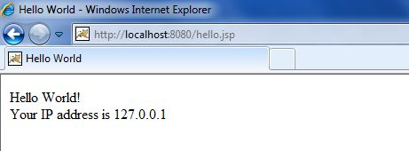
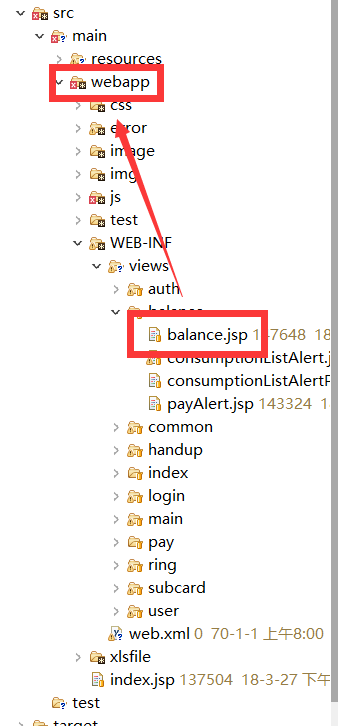

JSP
===

> create by **jsliang** on **2018-9-12 11:37:01**  
> Recently revised in **2019-05-23 18:51:43**

## 一 序

JSP 全名为 Java Server Pages，中文名叫 Java 服务器页面，其根本是一个简化的 Servlet 设计，它是由 Sun Microsystems 公司倡导、许多公司参与一起建立的一种动态网页技术标准。

JSP 技术有点类似 ASP 技术，它是在传统的网页 HTML（标准通用标记语言的子集）文件(`*.htm`， `*.html`)中插入 Java 程序段(Scriptlet)和JSP标记(tag)，从而形成JSP文件，后缀名为(`*.jsp`)。

用 JSP 开发的 Web 应用是跨平台的，既能在 Linux 下运行，也能在其他操作系统上运行。  

由于最近工作可能涉及到 JSP 编写的页面，故在此简要学习下 JSP 语法。  

本次学习主要参考有：[菜鸟教程 JSP](http://www.runoob.com/jsp)

## 二 JSP 运行流程

1. 浏览器发送 HTTP 请求给服务器
2. 服务器根据请求调动 JSP 引擎，查找对应的 JSP 文件
3. JSP 引擎载入 JSP 文件，将其转为 Servlet (将 JSP 元素转化为 Java 代码)。
> Servlet（Server Applet）是 Java Servlet 的简称，称为小服务程序或服务连接器，用 Java 编写的服务器端程序，主要功能在于交互式地浏览和修改数据，生成动态 Web 内容。  
> 狭义的 Servlet 是指 Java 语言实现的一个接口，广义的 Servlet 是指任何实现了这个 Servlet 接口的类，一般情况下，人们将 Servlet 理解为后者。Servlet 运行于支持Java的应用服务器中。从原理上讲，Servlet 可以响应任何类型的请求，但绝大多数情况下 Servlet 只用来扩展基于 HTTP 协议的 Web 服务器。
4. JSP 引擎将 Servlet 编译成可执行类，将原始请求传递给 Servlet 引擎。
5. 服务器的对应组件会调用 Servlet 引擎，然后载入并执行 Servlet 类。在执行过程中， Servlet 产生 HTML 格式输出并将其内嵌于 HTTP response 中上交给 Web 服务器。
6. Web 服务器以 HTML 网页形式将 HTTP response 返回到浏览器中。

## 三 生命周期

* **编译阶段** ：servlet 容器编译 servlet 源文件，生成 servlet 类
* **初始化阶段** ：加载与 JSP 对应的 servlet 类，创建其实例，并调用它的初始化方法
* **执行阶段** ：调用与 JSP 对应的 servlet 实例的服务方法
* **销毁阶段** ：调用与 JSP 对应的 servlet 实例的销毁方法，然后销毁 servlet 实例

## 四 初试 JSP

* 输出：

```
<% 代码片段 %>
```

例如：

```html
<html>
<head><title>Hello World</title></head>
<body>
    Hello World!<br/>
    <%
    out.println("Your IP address is " + request.getRemoteAddr());
    %>
</body>
</html>
```



## 五 JSP 语法

### 5.1 声明

```
<%! 代码片段 %>
```

示例：

```
<%! int i = 0; %> 
<%! int a, b, c; %> 
<%! Circle a = new Circle(2.0); %> 
```

### 5.2 表达式

```
<%= 表达式 %>
```

示例：

```
<%= (new java.util.Date()).toLocaleString()%>
```

### 5.3 注释

```
<%-- 注释 --%>
<!-- 注释 -->
```

上面两种注释中，一种是 JSP 注释，一种是 HTML 注释。

### 5.4 指令

```
<%@ page ... %>
<%@ include ... %>
<%@ taglib ... %>
```

@ page... 定义页面依赖属性，例如脚本、error页面，缓存需求等  

@ include... 包含其他文件

@ taglib... 引入标签库的定义

### 5.5 行为

```
<jsp:action_name attribute="value" />
```

JSP 行为标签使用 XML 语法结构来控制 Servlet 引擎。它能够动态插入一个文件，重用 JavaBean 组件，引导用户去另一个页面，为 Java 插件产生相关的 HTML 等等。

| 语法            | 描述                                                       |
| --------------- | ---------------------------------------------------------- |
| jsp:include     | 用于在当前页面中包含静态或动态资源                         |
| jsp:useBean     | 寻找和初始化一个 JavaBean 组件                             |
| jsp:include     | 用于在当前页面中包含静态或动态资源                         |
| jsp:setProperty | 设置 JavaBean 组件的值                                     |
| jsp:getProperty | 将 JavaBean 组件的值插入到 output中                        |
| jsp:forward     | 从一个JSP文件向另一个文件传递一个包含用户请求的request对象 |
| jsp:plugin      | 用于在生成的HTML页面中包含Applet和JavaBean对象             |
| jsp:element     | 动态创建一个XML元素                                        |
| jsp:attribute   | 定义动态创建的XML元素的属性                                |
| jsp:body        | 定义动态创建的XML元素的主体                                |
| jsp:text        | 用于封装模板数据                                           |

### 5.6 隐含对象

| 语法        | 描述                                                            |
| ----------- | --------------------------------------------------------------- |
| request     | HttpServletRequest 类的实例                                     |
| response    | HttpServletResponse 类的实例                                    |
| out         | PrintWriter 类的实例，用于把结果输出至网页上                    |
| session     | HttpSession 类的实例                                            |
| application | ServletContext 类的实例，与应用上下文有关                       |
| config      | ServletConfig 类的实例                                          |
| pageContext | PageContext类 的实例，提供对 JSP 页面所有对象以及命名空间的访问 |
| page        | 类似于 Java 类中的 this 关键字                                  |
| Exception   | Exception 类的对象，代表发生错误的 JSP 页面中对应的异常对象     |

### 5.7 控制流语句

> if...else...

```
<% if (day == 1 | day == 7) { %>
      <p>今天是周末</p>
<% } else { %>
      <p>今天不是周末</p>
<% } %>
```

> switch...case...

```
<% 
switch(day) {
case 0:
   out.println("星期天");
   break;
case 1:
   out.println("星期一");
   break;
case 2:
   out.println("星期二");
   break;
case 3:
   out.println("星期三");
   break;
case 4:
   out.println("星期四");
   break;
case 5:
   out.println("星期五");
   break;
default:
   out.println("星期六");
}
%>
```

> for...

```
<%for ( fontSize = 1; fontSize <= 3; fontSize++){ %>
   <font color="green" size="<%= fontSize %>">
    菜鸟教程
   </font><br />
<%}%>
```
> 至于while、do...while这些，在此就不提示了。

## 六 Study For Work

### 6.1 中文编码问题

```
<%-- 解决页面中出现的中文乱码 --%>
<%@ page language="java" contentType="text/html; charset=UTF-8"
    pageEncoding="UTF-8"%>

<%-- 引用 jstl 核心标签库 -->
<%@ taglib prefix="c" uri="http://java.sun.com/jsp/jstl/core"%>
<c:set var="ctx" value="${pageContext.request.contextPath}"/>
<script src="${ctx}/js/jquery.min.js"></script>
```

在这里，`${ctx}` 有两种解读，一种是寻找文件：




另一种就是寻找对应的方法，这些是由后端管理的，例如：

```
<li>
    <a href="${ctx}/user/userList" data-value=1 title="成员管理">成员管理</a>
</li>
```

### 6.2 HTML 模板

> data.jsp

```
<%@ page language="java" contentType="text/html; charset=UTF-8"
    pageEncoding="UTF-8"%>
<p>
   今天的日期是: <%= (new java.util.Date()).toLocaleString()%>
</p>
```
> main.jsp
```
<%@ page language="java" contentType="text/html; charset=UTF-8"
    pageEncoding="UTF-8"%>
<!DOCTYPE html>
<html>
<head>
<meta charset="utf-8">
<title>菜鸟教程(runoob.com)</title>
</head>
<body>
    <h2>include 动作实例</h2>
    <jsp:include page="date.jsp" flush="true" />
</body>
</html>
```

### 6.3 JSTL 标准标签库

什么是JSTL：[JSTL](https://www.runoob.com/jsp/jsp-jstl.html)  
JSP 标准标签库（JSTL）是一个 JSP 标签集合，它封装了 JSP 应用的通用核心功能。  

JSTL 支持通用的、结构化的任务，比如迭代，条件判断，XML 文档操作，国际化标签，SQL 标签。 除了这些，它还提供了一个框架来使用集成 JSTL 的自定义标签。  

由于工作的代码中引用了 JSTL 核心标签库，所以接下来新开一篇文章，专门讲解 JSTL ： [Go!](../JSTL/README.md)

> <a rel="license" href="http://creativecommons.org/licenses/by-nc-sa/4.0/"></a><br /><span xmlns:dct="http://purl.org/dc/terms/" property="dct:title">jsliang的文档库</span> 由 <a xmlns:cc="http://creativecommons.org/ns#" href="https://github.com/LiangJunrong/document-library" property="cc:attributionName" rel="cc:attributionURL">梁峻荣</a> 采用 <a rel="license" href="http://creativecommons.org/licenses/by-nc-sa/4.0/">知识共享 署名-非商业性使用-相同方式共享 4.0 国际 许可协议</a>进行许可。<br />基于<a xmlns:dct="http://purl.org/dc/terms/" href="https://github.com/LiangJunrong/document-library" rel="dct:source">https://github.com/LiangJunrong/document-library</a>上的作品创作。<br />本许可协议授权之外的使用权限可以从 <a xmlns:cc="http://creativecommons.org/ns#" href="https://creativecommons.org/licenses/by-nc-sa/2.5/cn/" rel="cc:morePermissions">https://creativecommons.org/licenses/by-nc-sa/2.5/cn/</a> 处获得。
