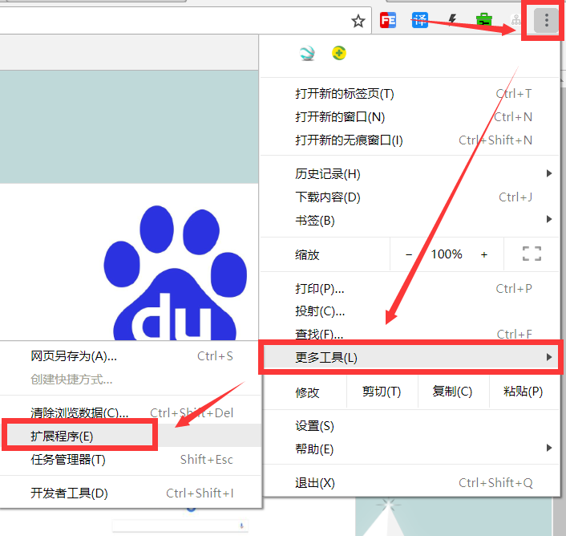
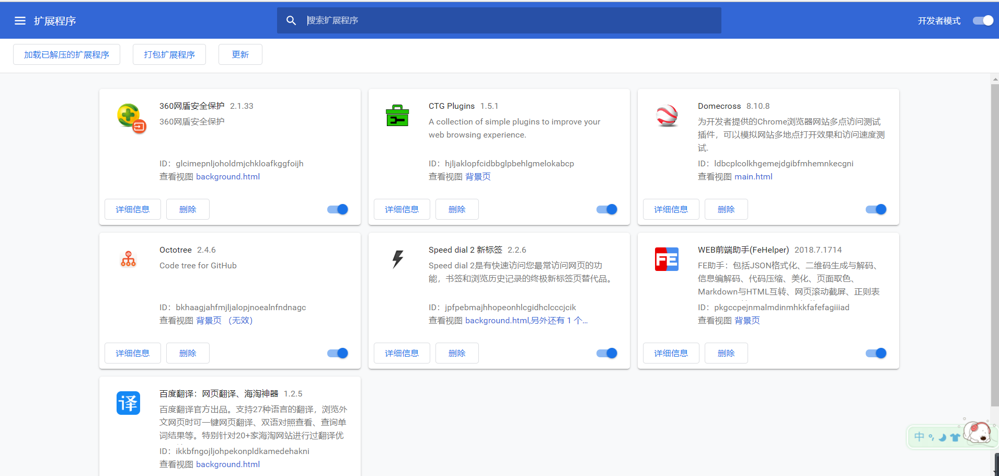
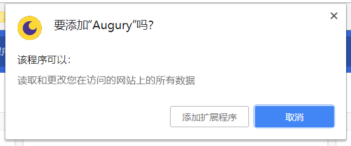
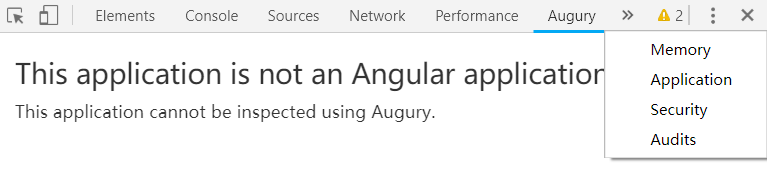

# Chrome 插件

> create by **jsliang** on **2018-09-05 14:21:47**   
> Recently revised in **2018-10-15 14:17:55**

 

## Chrome 插件安装
&emsp;首先，在 Chrome 浏览器中，点击右上角更多图标，点击 【更多工具】，再点击 【扩展程序】

 

&emsp;然后，进入该界面，将 .crx 文件拖入：

 

&emsp;最后，点击 【添加扩展程序】 即可：

 

 

## Angular
&emsp;这款 Angular 开发插件叫 Augury，下载 id 为：`elgalmkoelokbchhkhacckoklkejnhcd`，在 [这个地址](https://chrome-extension-downloader.com/) 下输入该 id 并回车即可下载。  

&emsp;**jsliang** 这里提供的是 Angury_v1.19.1.crx 文件，地址为[前往](./Augury_v1.19.1.crx)，或者找到该文件的同级目录，找到对应的插件即可。  
&emsp;开发的时候，打开 F12 控制台，点开 Augury 即可使用：

 

 

>  jsliang 的文档库 由 <a xmlns:cc="http://creativecommons.org/ns#" href="https://github.com/LiangJunrong/document-library" property="cc:attributionName" rel="cc:attributionURL">梁峻荣</a> 采用 <a rel="license" href="http://creativecommons.org/licenses/by-nc-sa/4.0/">知识共享 署名-非商业性使用-相同方式共享 4.0 国际 许可协议</a>进行许可。 基于<a xmlns:dct="http://purl.org/dc/terms/" href="https://github.com/LiangJunrong/document-library" rel="dct:source">https://github.com/LiangJunrong/document-library</a>上的作品创作。 本许可协议授权之外的使用权限可以从 <a xmlns:cc="http://creativecommons.org/ns#" href="https://creativecommons.org/licenses/by-nc-sa/2.5/cn/" rel="cc:morePermissions">https://creativecommons.org/licenses/by-nc-sa/2.5/cn/</a> 处获得。