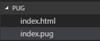

pug 模板引擎
===

> create by **jsliang** on **2017-06-08**  
> Recently revised in **2019-05-23 20:07:54**

## <span id="0">目录</span>

* [一、介绍](#1)
* [二、安装](#2)
* [三、建立项目](#3)
* [四、标签](#4)
* [五、id 与 class](#5)
* [六、属性](#6)
* [七、多行文本](#7)
* [八、注释](#8)
* [九、style 与 script](#9)
* [十、变量](#10)
* [十一、for、each、while](#11)
* [十二、if、else、unless](#12)
* [十三、mixins](#13)
* [十四、结语](#14)

## <span id="1">一、介绍</span>

> [返回目录](#0)

**首先**，我们得知道，什么是模板引擎？  

模板引擎（这里特指用于 Web 开发的模板引擎）是为了使用户界面与业务数据（内容）分离而产生的，它可以生成特定格式的文档，用于网站的模板引擎就会生成一个标准的HTML文档。->[详情参考百度](http://baike.baidu.com/link?url=1D7m0SKvR-_w12MvZmuLdqIuTJcnHJ-mDDG-whRjm3knUE_o-TPeZdWh6G5hM_Dc8PQdvQ9hEBlGdCeTuwBGC_mdEjUPPBs9-r1_OCvm-Q85QroyRYVjz0NMGcTN-hgo)  

**然后**，为什么使用 pug ？pug 的前身是 jade ，因为涉及商标原因改名 pug。pug 是一个高性能的模板引擎，它深受 Haml 影响，它是用 JavaScript 实现的，使用空白与缩进敏感的代码格式编写HTML页面，并且可以供 Node 使用。->[pug官网](https://www.npmjs.com/package/pug)  

缺点：1、可移植性差；2、调试困难；3、性能不是很出色。  

优点：1、初始阶段开发效率快；2、稳定阶段性能和协作成本低。  

举个例子：  

传统HTML代码：  

```html
<!DOCTYPE html>
<html>
  <head>
    <title>hello pug </title>
  </head>
  <body>
    <h1>pug pug</h1>
  </body>
</html>
```

pug 代码：

```
doctype html
html
  head
    title hello pug
  body
    h1 pug pug
```

## <span id="2">二、安装</span>

> [返回目录](#0)

* `npm install pug`  
* `npm install -g pug-cli`  

## <span id="3">三、建立项目</span>

> [返回目录](#0)

新建文件夹 pug，然后添加文件 index.pug，往 index.pug 添加下面内容（注意，pug 的书写格式是空2格，如果用 tab 缩进会报错）  

```
doctype html
html
  head
    title pug study
  body
```

**然后**，在该文件夹的位置，使用终端运行 `pug -P -w index.pug`（如何使用命令行我vue有讲，这里就不累叙了），就会获得一个可读性较好的 index.html （如果想要压缩的 html，使用 pug index.pug 就OK了）：  
```html
<!DOCTYPE html>
<html>
  <head>
    <title>pug study</title>
  </head>
  <body></body>
</html>
```

此刻文档目录如下：  



## <span id="4">四、标签</span>

> [返回目录](#0)

标签写法非常简单，这里就不哆嗦了。  

```
doctype html
html
  head
    title pug study
  body
```

使用 `pug -P -w index.pug` 命令编译后查看 index.html 文件（为简略下面只写“编译后”）： 
```
<!DOCTYPE html>
<html>
  <head>
    <title>pug study</title>
  </head>
  <body></body>
</html>
```

## <span id="5">五、id 与 class</span>

> [返回目录](#0)

```
doctype html
html
  head
    title pug study
  body
    p.bg_color1 hello pug class1
    p(class="bg_color2") hello pug class2
    p#title1 hello pug id1
    p(id="title2") hello pug id2
    p.bg_color1#title1 hello pug class+id
```

编译后：

```html
<!DOCTYPE html>
<html>
  <head>
    <title>pug study</title>
  </head>
  <body>
    <p class="bg_color1">hello pug class1</p>
    <p class="bg_color2">hello pug class2</p>
    <p id="title1">hello pug id1</p>
    <p id="title2">hello pug id2</p>
    <p class="bg_color1" id="title1">hello pug class+id</p>
  </body>
</html>
```

## <span id="6">六、属性</span>

> [返回目录](#0)

```
doctype html
html
  head
    title pug study
  body
    a(href="http://www.liangjunrong.com", target="_blank") 梁峻荣的网站
    input(name='study',type='button',value='pug学习')
    input(name='like',type='checkbox',checked)
    span 吃喝拉撒睡
```

编译后：

```html
<!DOCTYPE html>
<html>
  <head>
    <title>pug study</title>
  </head>
  <body>
    <a href="http://www.liangjunrong.com" target="_blank">梁峻荣的网站</a>
    <input name="study" type="button" value="pug学习">
    <input name="like" type="checkbox" checked><span>吃喝拉撒睡</span>
  </body>
</html>
```

## <span id="7">七、多行文本</span>

> [返回目录](#0)

```
doctype html
html
  head
   title pug study
  body
    p
    | 1. hello
    span /hi
    | 2. liang
    p.
    1. hello<span>/hi</span>
    2. liang
```

编译后：

```html
<!DOCTYPE html>
<html>
  <head>
    <title>pug study</title>
  </head>
  <body>
    <p>1. hello<span>/hi</span>2. liang </p>
    <p>
        1. hello<span>/hi</span>
        2. liang
    </p>
  </body>
</html>
```

## <span id="8">八、注释</span>

> [返回目录](#0)

```
doctype html
html
  head
title pug study
  body
    h3 单行注释，该注释会显示到编译后的HTML中
    // h3 hello world!
    h3 非缓冲注释，不会显示到编译后的HTML中
    //- h3 hello world!
    h3 多行注释
    //- h3 hello
      span hello
      h4 hi
```

编译后：

```html
<!DOCTYPE html>
<html>
  <head>
    <title>pug study</title>
  </head>
  <body>
    <h3>单行注释，该注释会显示到编译后的HTML中</h3>
    <!-- h3 hello world!-->
    <h3>非缓冲注释，不会显示到编译后的HTML中</h3>
    <h3>多行注释</h3>
  </body>
</html>
```

## <span id="9">九、style 与 script</span>

> [返回目录](#0)

```
doctype html
html
  head
    title pug study
    style.
      p{
        color: red;
      }
  body
    p hello world!
    script.
      var name = 'liang';
      var title = 'pugStudy';
```

编译后：

```html
<!DOCTYPE html>
<html>
  <head>
    <title>pug study</title>
    <style>
    p{
        color: red;
    }
    </style>
  </head>
  <body>
    <p>hello world!</p>
    <script>
      var name = 'liang';
      var title = 'pugStudy';
    </script>
  </body>
</html>
```

## <span id="10">十、变量</span>

> [返回目录](#0)

```
doctype html
html
  head
    title pug study
  body
    h3 变量定义与使用
    - var name = 'liang'
    p #{name}
    - var nameScript = '<script>alert(hello);</script>'

    h3 转义
    div #{nameScript}
    div= nameScript

    h3 非转义
    div !{nameScript}
    div!= nameScript

    h3 单纯输出文本
    div \#{name}
    div \!{name}

    h3 input value默认值
    input(value=name)
    input(value=myName)
```

## <span id="11">十一、for、each、while</span>

> [返回目录](#0)

```
doctype html
html
  head
    title pug study
  body
    - var liang = {name1: '梁峻荣', name2: '梁渣渣'}
    h3 for
    - for (var k in liang)
    p= liang[k]
     
    h3 each
    each value, key in liang
    p #{key}: #{value}
     
    h3 while
    - var n = 0
    ul
      while n <= 4
        li= n++
```

编译后：

```html
<!DOCTYPE html>
<html>
  <head>
    <title>pug study</title>
  </head>
  <body>
    <h3>for</h3>
    <p>梁峻荣</p>
    <p>梁渣渣</p>
     
    <h3>each</h3>
    <p>name1: 梁峻荣</p>
    <p>name2: 梁渣渣</p>

    <h3>while</h3>
    <ul>
      <li>0</li>
      <li>1</li>
      <li>2</li>
      <li>3</li>
      <li>4</li>
    </ul>
  </body>
</html>
```

## <span id="12">十二、if、else、unless</span>

> [返回目录](#0)

```
doctype html
html
  head
    title pug study
  body
    h3 if...else...
    - var number = 1
    if number != 0
      p number!=0
    else
      p number=0

    h3 unless
    - var myNumber = true
    unless !myNumber
      p false

    h3 case
    - var caseNumber = 3
    case caseNumber
      when 1
        p caseNumber=1
      when 2
        p caseNumber=2
      when 3: p caseNumber=3
      default
        p caseNumber undefined
```

编译后：

```html
<!DOCTYPE html>
<html>
  <head>
    <title>pug study</title>
  </head>
  <body>
    <h3>if...else...</h3>
    <p>number!=0</p>
     
    <h3>unless</h3>
    <p>false</p>
     
    <h3>case</h3>
    <p>caseNumber=3</p>
  </body>
</html>
```

## <span id="13">十三、mixins</span>

> [返回目录](#0)

* [1. mixin初认识](#13-1)
* [2. mixin循环](#13-2)
* [3. mixin嵌套](#13-3)
* [4. 传递标签](#13-4)
* [5. 传递class](#13-5)
* [6. 传递class和id](#13-6)
* [7. 不确定传参](#13-7)

### 13.1 <span id="13-1">mixin初认识</span>

> > [返回第十三章目录](#13)

```
doctype html
html
  head
    title pug study
  body
    mixin lesson
    p pug study
    +lesson
```

编译后：

```html
<!DOCTYPE html>
<html>
  <head>
    <title>pug study</title>
  </head>
  <body>
    <h3>1、mixin初认识</h3>
    <p>pug study</p>
  </body>
</html>
```

### 13.2 <span id="13-2">mixin循环</span>

> > [返回第十三章目录](#13)

```
doctype html
html
  head
    title pug study
  body
    mixin study(name, courses)
    p #{name}
      ul courses
        each course in courses
          li= course
    +study('tom', ['jade', 'pug'])
```

编译后：

```html
<!DOCTYPE html>
<html>
  <head>
    <title>pug study</title>
  </head>
  <body>
    <p>tom</p>
    <ul>courses
      <li>jade</li>
      <li>pug</li>
    </ul>
  </body>
</html>
```

### 13.3 <span id="13-3">mixin嵌套</span>

> > [返回第十三章目录](#13)

```
doctype html
html
  head
    title pug study
  body
    mixin study(name, courses)
      p #{name}
      ul courses
        each course in courses
           li= course
    mixin group(student)
      h4 #{student.name}
      +study(student.name, student.courses)
    +group({name:'liang',courses:['jade','pug']})
```

编译后：

```html
<!DOCTYPE html>
<html>
  <head>
    <title>pug study</title>
  </head>
  <body>
    <h4>liang</h4>
    <p>liang</p>
    <ul>courses
      <li>jade</li>
      <li>pug</li>
    </ul>
  </body>
</html>
```

### 13.4 <span id="13-4">传递标签</span>

> [返回第十三章目录](#13)

```
doctype html
html
  head
    title pug study
  body
    mixin team(slogan)
      h4 #{slogon}
      //- 如果存在附带标签，则传递过来
      if block
        block
      else
        p no team
    +team('slogon')
      p Good job!
```

编译后：

```html
<!DOCTYPE html>
<html>
  <head>
    <title>pug study</title>
  </head>
  <body>
    <h4></h4>
    <p>Good job!</p>
  </body>
</html>
```

### 13.5 <span id="13-5">传递class</span>

> [返回第十三章目录](#13)

```
doctype html
html
  head
    title pug study
  body
    mixin attr(name)
    p(class != attributes.class) #{name}
    +attr('attr')(class='magic')
```

编译后：

```html
<!DOCTYPE html>
<html>
  <head>
    <title>pug study</title>
  </head>
  <body>
    <p class="magic">attr</p>
  </body>
</html>
```

### 13.6 <span id="13-6">传递class和id</span>

> [返回第十三章目录](#13)

```
doctype html
html
  head
    title pug study
  body
    mixin attrs(name)
    p&attributes(attributes) #{name}
    +attrs('attrs')(class='magic', id='attrid')
```

编译后：

```html
<!DOCTYPE html>
<html>
  <head>
    <title>pug study</title>
  </head>
  <body>
    <p class="magic" id="attrid">attrs</p>
  </body>
</html>
```

### 13.7 <span id="13-7">不确定传参</span>

> [返回第十三章目录](#13)

```
doctype html
html
  head
    title pug study
  body
    mixin magic(name, ...items)
        ul(class=name)
      each item in items
        li = item
    +magic('magic', 'node', 'jade', '...')
```

编译后：

```html
<!DOCTYPE html>
<html>
  <head>
    <title>pug study</title>
  </head>
  <body>
    <ul class="magic">
      <li>= item</li>
      <li>= item</li>
      <li>= item</li>
    </ul>
  </body>
</html>
```

## <span id="14">十四、结语</span>

> [返回目录](#0)

pug 是我在学 Node.js 的课程中，老师要求使用 Node 写一个项目，然后我在项目中负责前端，而小伙伴想我使用 pug 写个静态界面给他，所以才有了我学习 pug 的文档。  

* **参考资料**：
  
1. 慕课jade模板视频讲解 ->[点击前往](http://www.imooc.com/learn/259)
2. segmentfault论坛pug模板（一） ->[点击前往](https://segmentfault.com/a/1190000006198621)
3. pug npm网址 ->[点击前往](https://www.npmjs.com/package/pug)
4. pug的GitHub网址 ->[点击前往](https://github.com/pugjs/pug)

到此我们的 pug 学习结束。

> <a rel="license" href="http://creativecommons.org/licenses/by-nc-sa/4.0/"></a><br /><span xmlns:dct="http://purl.org/dc/terms/" property="dct:title">jsliang的文档库</span> 由 <a xmlns:cc="http://creativecommons.org/ns#" href="https://github.com/LiangJunrong/document-library" property="cc:attributionName" rel="cc:attributionURL">梁峻荣</a> 采用 <a rel="license" href="http://creativecommons.org/licenses/by-nc-sa/4.0/">知识共享 署名-非商业性使用-相同方式共享 4.0 国际 许可协议</a>进行许可。<br />基于<a xmlns:dct="http://purl.org/dc/terms/" href="https://github.com/LiangJunrong/document-library" rel="dct:source">https://github.com/LiangJunrong/document-library</a>上的作品创作。<br />本许可协议授权之外的使用权限可以从 <a xmlns:cc="http://creativecommons.org/ns#" href="https://creativecommons.org/licenses/by-nc-sa/2.5/cn/" rel="cc:morePermissions">https://creativecommons.org/licenses/by-nc-sa/2.5/cn/</a> 处获得。