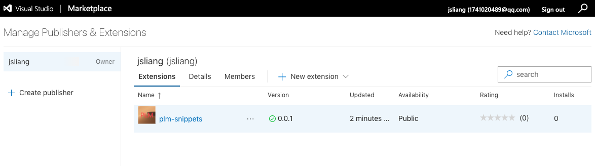

Visio Studio Code 插件开发
===

> Create by **jsliang** on **2020-04-17 08:16:19**  
> Recently revised in **2020-05-13 18:02:19**

* 该文章实践代码在该仓库第 005-vscodeplugin 中：https://github.com/LiangJunrong/all-for-one
* 该文章实践的插件为 `plm-snippets` 和 `jsliang`，在 VS Code 的插件中搜索即可找到

## <a name="chapter-one" id="chapter-one"></a>一 目录

**不折腾的前端，和咸鱼有什么区别**

| 目录 |
| --- | 
| [一 目录](#chapter-one) | 
| <a name="catalog-chapter-two" id="catalog-chapter-two"></a>[二 前言](#chapter-two) |
| <a name="catalog-chapter-three" id="catalog-chapter-three"></a>[三 安装脚手架](#chapter-three) |
| <a name="catalog-chapter-four" id="catalog-chapter-four"></a>[四 搭建环境](#chapter-four) |
| <a name="catalog-chapter-five" id="catalog-chapter-five"></a>[五 运行项目](#chapter-five) |
| <a name="catalog-chapter-six" id="catalog-chapter-six"></a>[六 package.json](#chapter-six) |
| <a name="catalog-chapter-seven" id="catalog-chapter-seven"></a>[七 extension.ts](#chapter-seven) |
| <a name="catalog-chapter-eight" id="catalog-chapter-eight"></a>[八 实现代码提示功能](#chapter-eight) |
| <a name="catalog-chapter-night" id="catalog-chapter-night"></a>[九 打包](#chapter-night) |
| <a name="catalog-chapter-ten" id="catalog-chapter-ten"></a>[十 发布](#chapter-ten) |
| <a name="catalog-chapter-eleven" id="catalog-chapter-eleven"></a>[十一 未来计划](#chapter-eleven) |
| <a name="catalog-chapter-twelve" id="catalog-chapter-twelve"></a>[十二 参考文献](#chapter-twelve) |

## <a name="chapter-two" id="chapter-two"></a>二 前言

> [返回目录](#chapter-one)

在一次群聊谈话中，希望能够在文件中输入 `@api` 的时候，能提示自定义的命令：

```js
/**
 * @name 接口名称
 * @description 接口地址
 * @param 接口参数
 * @return 接口返回内容
*/
```

虽然可以直接定义 `snippets` 即可，但是毕竟是团队开发，所以还是希望能进行统一设置（规范化），于是我就尝试下能不能将这个东西搞成一个 VS Code 插件。

后面不仅实现了 `snippets` 模板，更是添加了其他的功能，例如：

* [x] 输入 `@fnComments` 出现 `snippets` 代码提示（用于常用代码配置）
* [x] 输入 `!!` 快速生成 H5 常用文件代码
* [x] 在功能函数或者接口函数中使用快捷键 `Ctrl/Command + Shift + I` 在 JS/JSX 文件中快速注释
* [x] 在 JSX 文件中通过 `import ... from ...` 导入的 CSS，支持通过 `Ctrl/Command + 点击` 跳转到对应文件中。
* [x] 在 JSX 文件中通过 `import ... from 'src/...'` 形式导入的内容，支持 `Ctrl/Command + 点击` 跳转到对应文件中。（注意，是项目根路径下存在 `src` 文件夹）
* [x] Markdown 模板自动生成，通过 `template`、`time`、`category`、`ads` 这四个关键字生成模板，详细开启看 3.6 章节的讲解。
* [x] 在任何文件中选中特定格式的单词，通过 `Ctrl/Command + Shift + J` 命令将其按照 `text_style -> textStyle -> TextStyle -> TEXT_STYLE -> text-style` 的顺序进行变更。

当然，在开发过程中还是碰到了许多的问题，所以你会在参考文献看到 XX 篇文章是因为它帮助我实现了哪块功能。

---

一套下来发现小茗同学的文档非常齐全了，这里仅仅是为了做这个内容的插件，如果你不知道自己想做什么，或者单纯想知道某块内容怎么做，推荐先看小茗同学的 VS Code 插件开发全套系列。

* [【博客园】小茗同学《VSCode插件开发全攻略（一）概览》](https://www.cnblogs.com/liuxianan/p/vscode-plugin-overview.html)

## <a name="chapter-three" id="chapter-three"></a>三 安装脚手架

> [返回目录](#chapter-one)

工欲善其事，必先利其器，开发 VS Code 插件需要安装 2 个包：

* 安装 `yeoman` 脚手架工具：`npm i yo -g`
* 安装 VS Code 代码生成器：`npm i generator-code -g`

> 统一为：`npm i yo generator-code -g`

## <a name="chapter-four" id="chapter-four"></a>四 搭建环境

> [返回目录](#chapter-one)

安装完上面的 2 个包后，你就可以开始搞事/折腾了：

1. 开始干活：`yo code`
2. 你打算开发怎样的插件：`TypeScript`
3. 给你的插件起个名字：`jsliang`
4. 你插件的标识：`jsliang`
5. 描述一下你的插件：`jsliang 开发的插件，欢迎定制需求`
6. 需要起一个 `git` 仓库吗：`Yes`
7. 你打算使用哪种包管理工具：`npm`
8. 安装中……
9. 打开新目录：`cd ./jsliang`

这个过程在 VS Code 的终端上展示如下：

```
yo code

? What type of extension do you want to create? New Extension (TypeScript)
? What's the name of your extension? jsliang
? What's the identifier of your extension? jsliang
? What's the description of your extension? jsliang 开发的插件
? Initialize a git repository? Yes
? Which package manager to use? npm

。。。。。。
安装完毕，前往新世界，扬帆起航~

cd ./jsliang
```

## <a name="chapter-five" id="chapter-five"></a>五 运行项目

> [返回目录](#chapter-one)

通过 VS Code 打开新生成的文件夹 `jsliang`，按 F5 运行项目。

> Mac 下 `fn + F5`。Windows 下可能命令覆盖，需要自行试试是 `win + F5` 还是其他方式

在弹出的新窗口，执行：`Command + Shift + P` 或者 `Ctrl + Shift + P` 打开命令行。

这时候在弹窗的命令框中输入 `Hello World` 并回车即会在右下角弹出一个窗口。

命令：

* 打印：`Hello World`
* 重载：`Reload Window`

> 重载也可以在新窗口直接通过 `Ctrl+R` 或者 `Command+R` 刷新。

## <a name="chapter-six" id="chapter-six"></a>六 package.json

> [返回目录](#chapter-one)

VS Code 通过 `yo code` 生成的文件目录这里不做过多讲解，主要讲解一些内容：

```
- images —————————————————————— 【自己创建】 图片文件夹，用来存放插件的 Icon 图标
- snippets ———————————————————— 【自己创建】 snippets 提示，用来存放各式类型的提示
  - html.json ————————————————— 【自己创建】 HTML 的模板 snippets
  - javascript.json ——————————— 【自己创建】 JavaScript 的模板 snippets
  - webpack.json —————————————— 【自己创建】 Webpack 的模板 snippets
- src ————————————————————————— 主要的代码目录
  - extension.js —————————————— 扩展主入口
  - functionNotes.ts —————————— 【自己创建】 代码注释（Cmd/Ctrl + Shift + I）
  - openFile.ts ——————————————— 【自己创建】 跳转目录（Cmd/Ctrl + 点击）
  - util.ts ——————————————————— 【自己创建】 扩展代码工具库
  - variableFormatConversion.ts 【自己创建】 变量准换（Cmd/Ctrl + Shift + J）
- package.json ———————————————— 项目包管理以及对应的程序配置
- README.md ——————————————————— README.md 会出现在插件的细节中
- CHANGELOG.md ———————————————— CHANGELOG.md 会出现在插件的更改日志上
```

下面开始讲解 `package.json`：

> 以下内容仅供参考，json 格式的文件不允许添加注释！

```json
{
  // 插件的名字，全部小写，不能有空格
  "name": "005-vscodeplugin",
  // 插件的友好显示名称，用户显示再应用市场，支持中文
  "displayName": "005-vscodeplugin",
  // 描述
  "description": "jsliang 的 插件",
  // 关键字，用于市场搜索
  "keywords": ["jsliang", "自定义命令"],
  // 发布者，如果要发布到应用市场的话，这个名字必须与发布者一致
  "publisher": "jsliang",
  // 版本号
  "version": "0.0.1",
  // 表示插件最低支持的 VS Code 版本
	"engines": {
		"vscode": "^1.44.0"
  },
  // 插件应用市场分类，可选值：[Programming Languages, Snippets, Linters, Themes, Debuggers, Formatters, Keymaps, SCM Providers, Other, Extension Packs, Language Packs]
	"categories": [
		"Other"
  ],
  // 插件图标，至少 128 * 128 像素
  "icon": "images/icon.png",
  // 扩展的激活事件
	"activationEvents": [
		"onCommand:005-vscodeplugin.HelloWorld"
  ],
  // 入口文件
  "main": "./out/extension.js",
  // 贡献点，VS Code 插件大部分功能配置都在这里
	"contributes": {
    // 命令
		"commands": [
			{
				"command": "005-vscodeplugin.HelloWorld",
				"title": "Hello World"
			}
    ],
    // 快捷键绑定
    "keybindings": [
			{
				"command": "005-vscodeplugin.HelloWorld",
				"key": "ctrl+shift+i",
				"mac": "cmd+shift+i",
				"when": "editorTextFocus"
			}
    ],
    // 设置菜单
		"menus": {
      // 编辑器右键菜单
			"editor/context": [
				{
          // 表示只有编辑器具有焦点时才会在菜单中出现
					"when": "editorFocus",
          "command": "005-vscodeplugin.HelloWorld",
          // navigation 是一个永远置顶的分组，后面的 @6 是人工进行组内排序
					"group": "navigation"
        },
        {
          // 只有编辑器具有焦点，并且打开的是 JS 文件才会出现
          "when": "editorFocus && resourceLangId == javascript",
          "command": "extension.demo.testMenuShow",
          "group": "z_commands"
        }
      ],
      // 编辑器右上角图标，不配置图片就显示文字
      "editor/title": [
        {
          "when": "editorFocus && resourceLangId == javascript",
          "command": "extension.demo.testMenuShow",
          "group": "navigation"
        }
      ],
			// 编辑器标题右键菜单
      "editor/title/context": [
        {
          "when": "resourceLangId == javascript",
          "command": "extension.demo.testMenuShow",
          "group": "navigation"
        }
      ],
			// 资源管理器右键菜单
      "explorer/context": [
        {
          "command": "extension.demo.getCurrentFilePath",
          "group": "navigation"
        },
        {
          "command": "extension.demo.openWebview",
          "group": "navigation"
        }
      ]
    },
    // 代码片段
    "snippets": [
      {
        "language": "javascript",
        "path": "./snippets/javascript.json"
      },
      {
        "language": "html",
        "path": "./snippets/html.json"
      }
    ],
    // 自定义新的 activitybar 图标，也就是左侧侧边栏大的图标
    "viewsContainers": {
      "activitybar": [
        {
          "id": "beautifulGirl",
          "title": "美女",
          "icon": "images/beautifulGirl.svg"
        }
      ]
    },
		// 自定义侧边栏内 view 的实现
    "views": {
			// 和 viewsContainers 的id对应
      "beautifulGirl": [
        {
          "id": "beautifulGirl1",
          "name": "国内美女"
        },
        {
          "id": "beautifulGirl2",
          "name": "国外美女"
        },
        {
          "id": "beautifulGirl3",
          "name": "人妖"
        }
      ]
    },
		// 图标主题
    "iconThemes": [
      {
        "id": "testIconTheme",
        "label": "测试图标主题",
        "path": "./theme/icon-theme.json"
      }
    ]
  },
  // 同 npm scripts
	"scripts": {
		"vscode:prepublish": "npm run compile",
		"compile": "tsc -p ./",
		"lint": "eslint src --ext ts",
		"watch": "tsc -watch -p ./",
		"pretest": "npm run compile && npm run lint",
		"test": "node ./out/test/runTest.js"
  },
  // 开发依赖
	"devDependencies": {
		"@types/vscode": "^1.44.0",
		"@types/glob": "^7.1.1",
		"@types/mocha": "^7.0.2",
		"@types/node": "^13.11.0",
		"eslint": "^6.8.0",
		"@typescript-eslint/parser": "^2.26.0",
		"@typescript-eslint/eslint-plugin": "^2.26.0",
		"glob": "^7.1.6",
		"mocha": "^7.1.1",
		"typescript": "^3.8.3",
		"vscode-test": "^1.3.0"
  },
  // 后面这几个应该不用介绍了
  "license": "SEE LICENSE IN LICENSE.txt",
  "bugs": {
    "url": "https://github.com/sxei/vscode-plugin-demo/issues"
  },
  "repository": {
    "type": "git",
    "url": "https://github.com/sxei/vscode-plugin-demo"
  },
	// 主页
  "homepage": "https://github.com/sxei/vscode-plugin-demo/blob/master/README.md"
}
```

## <a name="chapter-seven" id="chapter-seven"></a>七 extension.ts

> [返回目录](#chapter-one)

`extension.ts` 文件在 `src` 目录下面：

```js
// 模块（module） 'vscode' 包含了 VS Code 的可拓展性 API
// 导入这个模块并在下面代码中使用别名 vscode 来引用它
import * as vscode from 'vscode';

// 这个方法在激活扩展的时候调用
// 你的扩展在第一次执行命令时被激活
export function activate(context: vscode.ExtensionContext) {

	// 使用控制台输出信息（console.log）和错误（console.error）
	// 当你的拓展被激活时，这一行代码将只执行一次
	console.log('Congratulations, your extension "005-vscodeplugin" is now active!');

	// 这个命令在 package.json 文件中被定义了
	// 现在用 registerCommand 命令实现，commandId 参数必须与 package.json 中的命令字段匹配
	let disposable = vscode.commands.registerCommand('005-vscodeplugin.HelloWorld', () => {
		// 你在这里配置的代码将在每次执行命令时被调用

		// 打印一个 Message 信息弹窗
		const message = 'Hello jsliang！这是你的第一个插件！';
		vscode.window.showInformationMessage(message);
	});

	context.subscriptions.push(disposable);
}

// 当你的拓展被停用时会调用这个钩子
export function deactivate() {}

```

它的初始内容如下，后面经过调整改造后，变成：

```js
import * as vscode from 'vscode';

export function activate(context: vscode.ExtensionContext) {

	console.log('你的扩展 jsliang 已被激活');

	require('./functionNotes')(context); // 代码注释功能：Command/Ctrl + Shift + I
	require('./variableFormatConversion')(context); // 代码大小写类型转换：Command/Ctrl + Shift + J
	require('./openFile')(context); // 打开文件功能：Command/Ctrl + 点击
}

export function deactivate() {
	console.log('你的扩展 jsliang 已被释放');
}
```

将内容抽取到其他文件夹，方便后面的维护管理：

```
- src ————————————————————————— 主要的代码目录
  - extension.js —————————————— 扩展主入口
  - functionNotes.ts —————————— 【自己创建】 代码注释（Cmd/Ctrl + Shift + I）
  - openFile.ts ——————————————— 【自己创建】 跳转目录（Cmd/Ctrl + 点击）
  - util.ts ——————————————————— 【自己创建】 扩展代码工具库
  - variableFormatConversion.ts 【自己创建】 变量准换（Cmd/Ctrl + Shift + J）
```

## <a name="chapter-eight" id="chapter-eight"></a>八 实现代码提示功能

> [返回目录](#chapter-one)

在成为大神之前，先当好小菜鸡。

> 人生第一步，雀氏纸尿裤

**首先**，配置 `package.json`：

> package.json

```js
// ……省略
"contributes": {
  "snippets": [
    {
      "language": "javascript",
      "path": "./snippets/javascript.json"
    }
  ],
}
// ……省略
```

**然后**，新建文件夹和文件：

> snippets/javascript.json

* scope：文件类型
* prefix：啥时候出现这个代码片段
* body：这个代码片段内容
* description：这个代码片段的描述

```json
{
  "@api": {
		"prefix": "@api",
		"body": [
	    "/**",
      "* @name 接口名字",
      "* @tutorial 接口地址",
      "* @param 接口参数",
      "* @return 接口返回",
      "*/"
		],
		"description": "PLM 接口文档注释"
	}
}
```

**最后**，在新窗口 `Ctrl + R`/`Command + R`，刷新下我们刚才在插件中做的变更，然后打开一个 JS 文件，输入 `@api` 就出来了提示。

### <a name="chapter-eight-one" id="chapter-eight-one"></a>8.1 将 `snippets` 换成命令

> [返回目录](#chapter-one)

由于发现通过 `snippets` 设置的时候，无法动态判断方法体的名称和参数，这咋办是好？

通过查询资料，发现可以换成命令指示来实现：

* 【2020-04-28 20:18:35】实现命令插入的代码

> package.json

```json
// ...省略
{
	"activationEvents": [
		"onCommand:extension.fileheader"
	],
	"main": "./out/extension.js",
	"contributes": {
		"keybindings": [
			{
				"command": "extension.fileheader",
				"key": "ctrl+shift+i",
				"mac": "cmd+shift+i",
				"when": "editorTextFocus"
			}
		]
	},
}
// ...省略
```

> extension.ts

```ts
import * as vscode from 'vscode';

export function activate(context: vscode.ExtensionContext) {

	console.log('你的扩展已被激活');

	const disposable = vscode.commands.registerCommand('extension.fileheader', () => {
		let lang:any;
		let selection:any;
		let nowLineText:any;
		if (vscode.window.activeTextEditor) {
			// 找到文件类型
			lang = vscode.window.activeTextEditor.document.languageId;
			// 找到当前选择光标的位置
			selection = vscode.window.activeTextEditor.selection;
			// 找到该行的文本
			nowLineText = vscode.window.activeTextEditor.document.lineAt(selection.start.line);
		}
		if ((lang === 'javascript')) {
			const textArray = nowLineText.text.split('=');
			const fnNameList = textArray[0].trim().split(' ');
			// 找到函数名
			const fnName = fnNameList[fnNameList.length - 1];
			// 找到所有参数
			const argName = textArray[1].match(/\(([^)]*)\)/)[1].split(',').map((item: string) => item.trim());
			// 组装内容
			let insertText = '';
			insertText += '/**\n';
			insertText += `* @name ${fnName}\n`;
			insertText += `* @description API 接口描述\n`;
			insertText += `* @address API 接口地址\n`;
			for (let i = 0; i < argName.length; i++) {
				insertText += `* @param {any} ${argName[i]}\n`;
			}
			insertText += '*/\n';

			// 开始的行数
			const startLine = selection.start.line;
			// 设置位置 { line: 0, character: 1}
			let pos:vscode.Position;
			pos = new vscode.Position(startLine, 0);

			vscode.window.activeTextEditor?.edit((editBuilder: vscode.TextEditorEdit) => {
				editBuilder.insert(pos, insertText);
			});
		}
	});

	context.subscriptions.push(disposable);
}

export function deactivate() {
	console.log('你的扩展已被释放');
}

```

在这里你可以看到原始的未封装后的内容，因为一开始的时候，需要实现的功能只有一个，所以就塞到了 `extension.ts` 上，后面因为内容变多了，`extension.ts` 表示很累，所以我给它减压了。

### <a name="chapter-eight-two" id="chapter-eight-two"></a>8.1 将命令注释转移到新文件

> [返回目录](#chapter-one)

转移到新文件后，`extension.ts` 和新的文件 `funcitonNotes.ts` 展示如下：

> src/extension.ts

```js
import * as vscode from 'vscode';

export function activate(context: vscode.ExtensionContext) {

	console.log('你的扩展 jsliang 已被激活');

	require('./functionNotes')(context); // 代码注释功能：Command/Ctrl + Shift + I
}

export function deactivate() {
	console.log('你的扩展 jsliang 已被释放');
}
```

> src/functionNotes.ts

```js
import * as vscode from 'vscode';

// 代码注释功能
const functionNotes = vscode.commands.registerCommand('jsliang.functionComments',
  (
    lang: any, // 文件类型
    selection: any, // 光标位置
    nowLineText: any, // 光标位置的文本
    pos: vscode.Position, // 需要插入的位置 { line: 0, character: 1}
  ) => {

  // 找到文件类型
  lang = vscode.window.activeTextEditor?.document.languageId;

  console.log(lang);

  // js 文件或者 jsx 文件
  if ((lang === 'javascript') || (lang === 'javascriptreact')) {

    // 找到当前选择光标的位置
    selection = vscode.window.activeTextEditor?.selection;
    // 找到该行的文本
    nowLineText = vscode.window.activeTextEditor?.document.lineAt(selection.start.line).text;
    // 开始的行数
    const startLine = selection.start.line;
    // 设置需要插入的位置 { line: 0, character: 1}
    pos = new vscode.Position(startLine, 0);

    /*
      ---非接口---
      function data1(abc, def) {
      const data2 = function(abc, def) {
      const data3 = (abc, def) => {
      const data4 = abc => {
      ---接口---
      export function getList1(params) {
      export const getList2 = function(params) {
      export const getList3 = (abc, def) => {
      export const getList4 = abc => {
    */
    // 拼装普通函数注释
    const getFnText = (fnName: string, argName: any[]) => {
      let insertText = '';
      insertText += '/**\n';
      insertText += `* @name ${fnName}\n`;
      insertText += `* @description 功能描述\n`;
      if (!(argName.length === 1 && argName[0] === '')) {
        for (let i = 0; i < argName.length; i++) {
          insertText += `* @param {any} ${argName[i]}\n`;
        }
      }
      insertText += '* @return 接口返回\n';
      insertText += '*/\n';
      return insertText;
    };
    // 拼装接口函数注释
    const getApiText = (fnName: string, argName: any[]) => {
      let insertText = '';
      insertText += '/**\n';
      insertText += `* @name ${fnName}\n`;
      insertText += `* @description API接口描述\n`;
      insertText += `* @address API接口文档地址\n`;
      if (!(argName.length === 1 && argName[0] === '')) {
        for (let i = 0; i < argName.length; i++) {
          insertText += `* @param {any} ${argName[i]}\n`;
        }
      }
      insertText += '* @return 接口返回\n';
      insertText += '*/\n';
      return insertText;
    };

    let insertText = ''; // 插入的文本
    let eqLength = 0; // 等号个数
    for (let i = 0; i < nowLineText.length; i++) {
      if (nowLineText[i] === '=') {
        eqLength ++;
      }
    }

    // ES5 方法
    if (nowLineText.includes('function')) {

      let firstIndex = 0; // 开始索引
      let lastIndex = nowLineText.length; // 结束索引
      let fnName = ''; // 方法名称
      const argName = nowLineText.match(/\(([^)]*)\)/)[1].split(',').map((item: string) => item.trim()); // 参数名称

      // 没有 = 号、长度为 1的三种判断
      if (eqLength === 0) {
        lastIndex = nowLineText.indexOf('(');
        if (nowLineText.length - lastIndex > 0) {
          firstIndex = nowLineText.lastIndexOf(' ', lastIndex);
          fnName = nowLineText.slice(firstIndex + 1, lastIndex);
        }
      } else if (eqLength === 1) {
        lastIndex = nowLineText.indexOf('=');
        if (nowLineText.length - lastIndex > 0) {
          const str = nowLineText.slice(firstIndex, lastIndex).trim().split(' ');
          fnName = str[str.length - 1];
        }
      }

      // 组装内容
      if (nowLineText.includes('export')) { // 接口函数
        insertText = getApiText(fnName, argName);
      } else { // 非接口函数
        insertText = getFnText(fnName, argName);
      }

    } else if (nowLineText.includes('=>')) { // ES6 方法
      
      let firstIndex = 0; // 开始索引
      let lastIndex = nowLineText.length; // 结束索引
      let fnName = ''; // 方法名称
      let argName = []; // 参数名称

      // 没有 = 号、长度为 1的三种判断
      if (eqLength >= 2) {
        firstIndex = nowLineText.indexOf('=');
        lastIndex = nowLineText.indexOf('=', firstIndex + 1);

        const tempName = nowLineText.slice(0, firstIndex).trim().split(' ');
        fnName = tempName[tempName.length - 1];

        const tempArg = nowLineText.slice(firstIndex + 1, lastIndex).trim();
        if (tempArg.includes('(')) {
          argName = [...(tempArg.slice(1, tempArg.length - 1).split(',').map((item: string) => item.trim()))];
        } else {
          argName.push(tempArg);
        }
      }

      // 组装内容
      if (nowLineText.includes('export')) { // 接口函数
        insertText = getApiText(fnName, argName);
      } else { // 非接口函数
        insertText = getFnText(fnName, argName);
      }

    }

    // 插入内容
    vscode.window.activeTextEditor?.edit((editBuilder: vscode.TextEditorEdit) => {
      editBuilder.insert(pos, insertText);
    });

  }
});

module.exports = (context: vscode.ExtensionContext) => {
  context.subscriptions.push(functionNotes);
};
```

以上就是最初目的的 3 次旅程~

---

OK，贴代码还是很累的，毕竟内容一大床不知道讲啥，我们就不一一细讲后面的拓展了，接下来讲解下打包和发布。

## <a name="chapter-night" id="chapter-night"></a>九 打包

> [返回目录](#chapter-one)

不管是本地打包还是发布到应用市场都需要 `vsce` 这个工具：

* 安装 `vsce`：`npm i vsce -g`
* 本地打包：`vsce package`

这时候会有个过程：

```
Executing prepublish script 'npm run vscode:prepublish'...

> 005-vscodeplugin@0.0.1 vscode:prepublish /Users/si-gz-1738/个人/all-for-one/005-VSCodePlugin
> npm run compile


> 005-vscodeplugin@0.0.1 compile /Users/si-gz-1738/个人/all-for-one/005-VSCodePlugin
> tsc -p ./

 WARNING  A 'repository' field is missing from the 'package.json' manifest file.
Do you want to continue? [y/N] y
 DONE  Packaged: /Users/si-gz-1738/个人/all-for-one/005-VSCodePlugin/005-vscodeplugin-0.0.1.vsix (8 files, 111.39KB)
```

如上所示，输入 y 后，会在当前项目上直接输出 `.vsix` 文件。

如果是想本地尝试，可以到插件处，通过 `vsix` 方式安装插件即可。

## <a name="chapter-ten" id="chapter-ten"></a>十 发布

> [返回目录](#chapter-one)

1. 创建 Microsoft 账号：https://login.live.com/
2. 通过 Microsoft 账号注册 Azure 账号：https://aka.ms/SignupAzureDevOps

这两个步骤主要是为了能创建账号，方便发布操作。

---

* 通过命令行发布：

1. 进入 Azure 后在右上角的个人设置出找到 `Person access tokens`
2. 创建 Token：

```
Name：随便填
Organization：All assessible organizations
Expiration（UTC）：90 days
Scopes：Full access
```

3. 通过命令行发布：`vsce create-publisher jsliang`（比较麻烦，不推荐）

---

* 直接通过网页发布：https://marketplace.visualstudio.com/manage

随便点点就可以发布，特别简单，我这边看到发布后的是：



这样就代表着发布完成了，去 VS Code 的插件市场可以搜索到这个插件了。

> 注意：每次更新都需要更换版本，版本号更替在 `package.json` 和 `CHANGELOG` 上可以更新下，否则同版本上传没用（或者说有用，但是我的激活操作有问题）

发布可以参考下面文献：

* [【掘金】别闹《VS Code 插件发布步骤》](https://juejin.im/post/5d4d162c5188251f6b1ef845)
* [【小茗同学的博客园】小茗同学《VSCode插件开发全攻略（十）打包、发布、升级》](https://www.cnblogs.com/liuxianan/p/vscode-plugin-publish.html)

## <a name="chapter-eleven" id="chapter-eleven"></a>十一 未来计划

> [返回目录](#chapter-one)

截至到 2020-05-13 17:53:08，我们还有一些内容需要补充完善：

* [ ] VS Code 插件开发：实现可视化编辑
  * [ ] 通过 Webview 的点击实现命令的执行
  * [ ] 点击创建模板，新建一套空模板，或者完整能运行的基础模板
  * [ ] 点击创建组件，可以将代码塞到对应的卡位
  * [ ] 允许自行提供模板，通过 `json` 读取用户的配置
* [ ] VS Code 插件开发：实现 `import style from './style.css'` 这种情况的时候，点击 `<div className={style.colorRed}></div>` 能打开到定义的位置
* [ ] VS Code 插件开发：实现待输入提示，在文件中输入 `src` 的时候，找到 `src` 目录下所有文件夹进行提示

这里比较看重的功能是：VS Code 实现可视化编辑。

我们都知道，整个 VSCode 编辑器就是一张大的网页，其实，我们还可以在 VS Code 中创建完全自定义的、可以间接和 nodejs 通信的特殊网页（通过一个 `acquireVsCodeApi` 特殊方法），这个网页就叫 `WebView`。内置的 Markdown 的预览就是使用 `WebView` 实现的。使用 `Webview` 可以构建复杂的、支持本地文件操作的用户界面。

所以，工具到位的情况下，我们是不是可以直接将列表页、新建页等模板代码直接做一个模板，然后需要什么内容，我们就通过 `WebView` 操作，往里面塞内容。

同时，我们也可以尝试读取文件中的代码，将其换成可视化的 `WebView`，告诉我们现在页面大体结构是怎样的。

当然，这仅仅是一个猜想，具体的实现，只有后面操作了才知道！

## <a name="chapter-twelve" id="chapter-twelve"></a>十二 参考文献

> [返回目录](#chapter-one)

感谢先行的 VS Code 开发大佬们，感谢你们的分享！

* [【博客园】小茗同学《VSCode插件开发全攻略（一）概览》](https://www.cnblogs.com/liuxianan/p/vscode-plugin-overview.html)
* [【Visio Studio Code】插件市场](https://marketplace.visualstudio.com/vscode)
* [【Visio Studio Code】插件开发 API](https://code.visualstudio.com/api)
* [【Visio Studio Code 时长】思考问题的熊《Markdown Note Snippets》](https://marketplace.visualstudio.com/items?itemName=biotrainee-zhaofei.betternotesnippets)：特别感谢，解决了 Markdown 的 `snippets` 问题
* [【博客园】allen《新手如何开发一个VSCode插件》](https://justforuse.github.io/blog/zh-cn/2019/01/vscode-extension-tutorial/)：特别感谢，解决了类型转换：`text_style -> textStyle -> TextStyle -> TEXT_STYLE -> text-style` 的问题

---

**不折腾的前端，和咸鱼有什么区别！**


**jsliang** 会每天更新一道 LeetCode 题解，从而帮助小伙伴们夯实原生 JS 基础，了解与学习算法与数据结构。

**浪子神剑** 会每天更新面试题，以面试题为驱动来带动大家学习，坚持每天学习与思考，每天进步一点！

扫描上方二维码，关注 **jsliang** 的公众号（左）和 **浪子神剑** 的公众号（右），让我们一起折腾！

> <a rel="license" href="http://creativecommons.org/licenses/by-nc-sa/4.0/"></a><br /><span xmlns:dct="http://purl.org/dc/terms/" property="dct:title">jsliang 的文档库</span> 由 <a xmlns:cc="http://creativecommons.org/ns#" href="https://github.com/LiangJunrong/document-library" property="cc:attributionName" rel="cc:attributionURL">梁峻荣</a> 采用 <a rel="license" href="http://creativecommons.org/licenses/by-nc-sa/4.0/">知识共享 署名-非商业性使用-相同方式共享 4.0 国际 许可协议</a>进行许可。<br />基于<a xmlns:dct="http://purl.org/dc/terms/" href="https://github.com/LiangJunrong/document-library" rel="dct:source">https://github.com/LiangJunrong/document-library</a>上的作品创作。<br />本许可协议授权之外的使用权限可以从 <a xmlns:cc="http://creativecommons.org/ns#" href="https://creativecommons.org/licenses/by-nc-sa/2.5/cn/" rel="cc:morePermissions">https://creativecommons.org/licenses/by-nc-sa/2.5/cn/</a> 处获得。