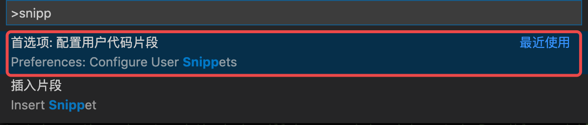
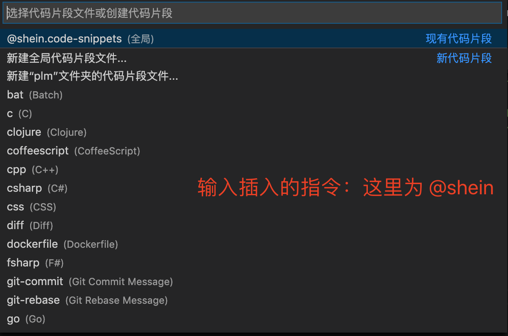
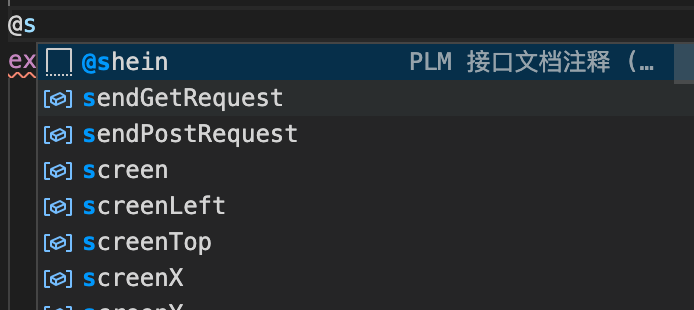

Visio Studio Code 自定义命令
===

> Create by **jsliang** on **2020-04-27 16:10:19**  
> Recently revised in **2020-5-12 08:19:41**

## <a name="chapter-one" id="chapter-one"></a>一 目录

**不折腾的前端，和咸鱼有什么区别**

| 目录 |
| --- | 
| [一 目录](#chapter-one) | 
| <a name="catalog-chapter-two" id="catalog-chapter-two"></a>[二 前言](#chapter-two) |
| <a name="catalog-chapter-three" id="catalog-chapter-three"></a>[三 配置步骤](#chapter-three) |

## <a name="chapter-two" id="chapter-two"></a>二 前言

> [返回目录](#chapter-one)

在日常工作中，我们会使用 VS Code 的大量快捷键，从而快速生成代码。

在这里讲解下如何配置一个自己想要的。

## <a name="chapter-three" id="chapter-three"></a>三 配置步骤

> [返回目录](#chapter-one)

整体步骤为：

* 步骤 1：`Command + Shift + P` 打开命令（Windows 下用 `Ctrl + Shift + P`）
* 步骤 2：输入 `snippet`，找到【首选项：配置用户代码片段】选项，点击进入。



* 步骤 3：点击【新建全局代码片段文件】输入想创建的命令，这里为 `@jsliang`，然后回车。



> 忽略图中的红色文字

* 步骤 4：编辑 `json` 配置文档。

```json
{
  // * scope：文件类型
  // * prefix：啥时候出现这个代码片段
  // * body：这个代码片段内容
  // * description：这个代码片段的描述
	"@jsliang": {
		"prefix": "@jsliang",
		"body": [
			"/**",
			"* @name 接口名字",
			"* @tutorial 接口地址",
			"*/",
		],
		"description": "PLM 接口文档注释",
	}
}
```

* 步骤 5：在任意的页面输入 `@jsliang`，就可以看到指定的命令。



---

**不折腾的前端，和咸鱼有什么区别！**


**jsliang** 会每天更新一道 LeetCode 题解，从而帮助小伙伴们夯实原生 JS 基础，了解与学习算法与数据结构。

**浪子神剑** 会每天更新面试题，以面试题为驱动来带动大家学习，坚持每天学习与思考，每天进步一点！

扫描上方二维码，关注 **jsliang** 的公众号（左）和 **浪子神剑** 的公众号（右），让我们一起折腾！

> <a rel="license" href="http://creativecommons.org/licenses/by-nc-sa/4.0/"></a><br /><span xmlns:dct="http://purl.org/dc/terms/" property="dct:title">jsliang 的文档库</span> 由 <a xmlns:cc="http://creativecommons.org/ns#" href="https://github.com/LiangJunrong/document-library" property="cc:attributionName" rel="cc:attributionURL">梁峻荣</a> 采用 <a rel="license" href="http://creativecommons.org/licenses/by-nc-sa/4.0/">知识共享 署名-非商业性使用-相同方式共享 4.0 国际 许可协议</a>进行许可。<br />基于<a xmlns:dct="http://purl.org/dc/terms/" href="https://github.com/LiangJunrong/document-library" rel="dct:source">https://github.com/LiangJunrong/document-library</a>上的作品创作。<br />本许可协议授权之外的使用权限可以从 <a xmlns:cc="http://creativecommons.org/ns#" href="https://creativecommons.org/licenses/by-nc-sa/2.5/cn/" rel="cc:morePermissions">https://creativecommons.org/licenses/by-nc-sa/2.5/cn/</a> 处获得。