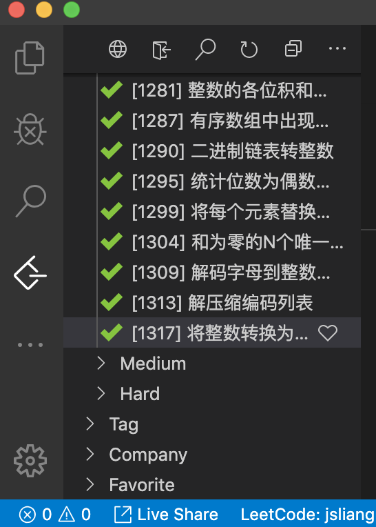

朝花夕拾 - 2019 总结
===

> Create by **jsliang** on **2020-02-01 22:11:03**  
> Recently revised in **2020-02-02 00:51:29**

欢迎关注 jsliang 的 GitHub，集技术、健身、理财等个人一生所拥有的各种财富的文档库：

* https://github.com/LiangJunrong/document-library

## 一 目录

**不折腾的前端，和咸鱼有什么区别**

| 目录 |
| --- | 
| [一 目录](#chapter-one) | 
| [二 前言](#chapter-two) |
| [三 得失](#chapter-three) |
| [四 展望](#chapter-four) |
| &emsp;[4.1 展望](#chapter-four-one) |
| &emsp;[4.2 展望](#chapter-four-two) |
| &emsp;[4.3 展望](#chapter-four-three) |
| [五 总结](#chapter-five) |
| [六 疯狂 283 道简单 LeetCode 题解集](#chapter-six) |
| &emsp;[6.1 【0-100】 道](#chapter-six-one) |
| &emsp;[6.2 【101-200】 道](#chapter-six-two) |
| &emsp;[6.3 【201-300】 道](#chapter-six-three) |

## 二 前言

> [返回目录](#chapter-one)

时间：2020.02.01。

一个值得被纪念的日子：

* [x] **jsliang** 把 Visio Studio Code 中的所有简单难度 LeetCode 都刷完了。

完成的那一刻，除了和朋友分享下喜悦，并没有想象中的非常激动。

我从 2019.05.16 开始，经公司同事 **@__MARPTS罗** 的推荐，开始攻略 LeetCode 题目。

从异常艰辛地编写第 1 道 LeetCode 题目《0001-两数之和》开始，到现在基本能快速解决 LeetCode 80% 以上的简单难度题目结束。

截至 2020.02.01，这 261 天里，我完成的 LeetCode 题目统计为：

* 简单：283 道
* 中等：10 道
* 困难：1 道

在这 294 道题目的洗礼下：我，成长了。

## 三 得失

> [返回目录](#chapter-one)

在这接近 9 个月（261 天）的时间里，刷完 294 道 LeetCode 题目后，个人收获如下：

1. 大幅度熟悉了 JavaScript 各种原生 API，能根据场景使用合适的方法快速求解。[《JavaScript 学习笔记》](https://github.com/LiangJunrong/document-library/tree/master/JavaScript-library/JavaScript)
2. 更加严谨的代码逻辑，不仅仅作用于刷题，对业务场景也能进行更好编程。[《LeetCode 简单难度题集》](https://github.com/LiangJunrong/document-library/tree/master/other-library/LeetCode/easy)
3. 了解一些算法和数据结构的基础知识和方法。例如双指针、递归……等。[《算法与数据结构》](https://github.com/LiangJunrong/document-library/tree/master/other-library/LeetCode/algorithms-and-data-structures)

但是，相比于收获，怎么看好像失去的更多：

* 成长空间
* 技术提升

不可否认，**jsliang** 认为入行第 1~3 年是个重要的发展期。

> 虽然我只有 1 年过 10 个月的工作经历，但是当中 9 个月的空闲时间都是刷题，深感浪费。

因为在前面的 1~3 年，你可能没有女票，亦或者还没有组建家庭，你没有太多的债务纠纷，不用理会房贷车贷等，你还有充沛的精力去折腾，你会去思考，去探索自己的未来。

在入职一年左右，**jsliang** 由之前的中国电信外包的工作，跑到了目前的公司，在这十个月的工作经历中，自觉经受了非常多的磨损。

咱们进行小小对比：

| 驻点公司 | 学习时间 | 技术 | 内容 |
| --- | --- | --- | --- |
| 电信 | 5/6h | 微信小程序、Vue、H5、JSP…… | 各式活动页、各类项目…… |
| 目前 | 3/4h | React | 表单、后台管理系统。 |

也许这是 2019 最大的遗憾，就是工资提升了，工作内容却狭小了，技术提升减少了，技术范围狭窄了。

以前在完成任务的同时，可以琢磨折腾新技术并应用到项目中；现在在完成任务的同时，还要防止时刻来的额外任务（海量线上 Bug、自提需求），你还能做的就是在经过审批后给项目添加新的 npm 包。

> 感慨：现在还记得经理一开始说的 6 小时工作 2 小时自我提升，现在是全天 8 小时满载，有时候需求量大还搞不完，需要周六日加班。

在和已经是面试官的朋友 **@lien** 聊天后，悲哀地发现：

* **jsliang**，废了。

因为我现在：

* React 不太懂，因为用的是封装好的全家桶
* React 不太懂，因为写的全是表单
* 其他技术淡忘了，CSS 布局？……沉默

话归正题，在繁忙的工作中挤出时间刷 LeetCode 题目外，剩下可用的时间，很少很少。

尝试过：

1. 挤时间。早上 8 点半到公司，自学到 10 点开工，晚上 8 点半回到租房，锻炼学习会 11 点睡觉。
2. 时间片段管理。跟同事 **@诗能** 学到的技巧，给自己限定完成任务时间是多少，然后挤出一点时间片段进行个人学习提升。

但是发现还是挺累的，有点同事共事经验的小伙伴都清楚，工作不是仅有代码，还有大量的《人与人之间的沟通共处》，其中心酸难以一一述说，唯有感慨一声继续给自己加油。

> 社会磨平了我们的棱角，但是并不能磨灭你的希望和你做出的努力。

综上所述，**jsliang** 的 2019 并没有那么如意。

## 四 展望

> [返回目录](#chapter-one)

虽然感慨颇多，但是……那 2 块钱的彩票让我觉得人生还有希望，哈哈。

经过 2019 的折腾，**jsliang** 将个人的发展分为 3 个部分：

1. 技术
2. 健康
3. 理财

**首先**，健康是第一位。虽然突然去世（cu si）只是偶尔发生，但是如果一直处于亚健康或者疾病状态，对个人明显是不利的。一次 ICU 能让一个普通的家庭穷困潦倒多久？

**然后**，技术是第二位。如果你没有突出的技术，你就不能获得持续的收益，或者进一步提升自己的收益，你的本金就是无根之水（当然，或者叫本领？）。

**最后**，学会理财，让你离早餐自由、水果自由、财务自由……更进一步。

这些是很有意义的提升，咱们下面浅谈几句。

### 4.1 技术

> [返回目录](#chapter-one)

技术上不敢多言，但是和 **@lien** 小伙伴聊天总能收获很多：

1. 业务能力
2. 底层能力
3. 管理能力

对于小伙伴经常吐槽的面试总被面数学、图形类的题目，在此只能表示膜拜。

在 **jsliang** 狭隘的眼光中，个人觉得：

1. 提升你的业务能力，不仅仅是说让你去写业务代码，更重要的是对项目的把控，对进度的推进和对业务风险的控制。
2. 如果你希望更进一步，那么你应该了解 XX 源码之类的，对算法与数据结构、设计模式等还有个人的见解，它们能帮助你进一步提升自己的能力。
3. 管理自己和管理他人，显得十分重要。在对于自己上，对时间的把控和对任务的解读是非常有必要的，连自己的底线都不清楚，那是不好的。在对于别人上，学会管理是一门艺术，我还没当上管理层，这里就不 yy bb。

《前端知识体系讲解》这一块永远不敢放出话，说自己多清楚。

世界那么大，你怎么知道自己不是井底之蛙。

希望有生之年，你我老了，公司辞退了的时候，咱们能小小吹水下前端技术要怎么发展~

### 4.2 健康

> [返回目录](#chapter-one)

*胖子是热门的探讨话题？*

从大一的 140 斤到现在稳稳的 160~165 斤，充分体现什么是：

* 技术宅
* 过劳肥
* 单身猪

意识到自己再不锻炼身体，下一个猝死在某某办公室的人可能就是我之后，开始注重锻炼身体、注重养生。

目前的锻炼方式即是打开 Keep 软件，找些内容进行锻炼，然后控制饮食，多活动。

为此，特意去搜索了一些健身资料，丰富自身的养生知识。

目前专栏正在持续完善，欢迎小伙伴监督~

* [jsliang 的健康频道](https://github.com/LiangJunrong/document-library/tree/master/other-library/Monologue/healthy)

当然，希望加 **jsliang** 微信或者进 **jsliang 的健身群** 讨论的，也可以跳到章节《五 总结》部分扫二维码加我，过审入群。

### 4.3 理财

> [返回目录](#chapter-one)

2019 跳槽的一大原因就是没钱了，负债中！

所以在还清债务后开始存钱，然后在朋友的推荐下，开始了理财之旅。

目前个人分配比：

| 项目 | 金额 |
| --- | --- |
| 彩票 | 200 |
| 房租 | 1200 |
| 伙食 | 1050 |
| 基金 | 5000 |
| 余额宝 | 剩余金额 |

当然，工资机密这种事情还是要搞的，所以能透露的占比如上所示，不能透露的都写在余额宝的 *剩余金额* 中了。

收益来源于：工资 + 公众号收益 + 小伙伴的文章打赏 + 云服务器推广收益。

值得一提的是：个人是个小彩民，每期 4 注体彩/福彩随机（8 元）是必须的。

> 暴富只是个梦想，要实现请先购买彩票 ^_^

目前尚未开启股票或者其他投资形式，第一是不太熟悉，第二是这点钱放到股市，分分钟炸裂。

如果小伙伴也想搞搞理财，学习下理财是怎么回事，可以找 **jsliang** 一起嗨皮：

* [jsliang 的理财频道](https://github.com/LiangJunrong/document-library/tree/master/other-library/Monologue/money)

当然，希望加 **jsliang** 微信或者进 **jsliang 的理财群** 讨论的，也可以跳到章节《五 总结》部分扫二维码加我，过审入群。

## 五 总结

> [返回目录](#chapter-one)

以上即为 2019 年 **jsliang** 的年度总结。

虽迟但到~

其实 2019 年尾的时候看到身边的大佬都在写《2019 年度总结》并且还获得了各式奖项的时候，还是挺羡慕的。

当然因为觉得自己还没有搞完 2019 内容，所以就不敢露面吹水。

直至 2020 年春节前后获得了《王者荣耀模拟战》王者等级，以及刷完了《LeetCode 简单难度》，才觉得 2019 可以 “勉强” 收工了，才写完这篇文章。

2020 尚在开启，未来会进一步完善自己的技术、健身、理财知识体系~

最后的最后，贴一下 283 道 LeetCode 简单难度题解。

咱们，2020 江湖再见！加油~

---

* 欢迎关注 jsliang 的 GitHub，集技术、健身、理财等个人一生所拥有的各种财富的文档库：https://github.com/LiangJunrong/document-library

* **微信公众号**：

> 目前每天一道 LeetCode 题，欢迎关注，一起成长

* **个人微信**：

* **jsliang 的前端群**：先加个人微信，好友通过后请备注需要进哪几个群，过审再拉进群。
* **jsliang 的健身群**：先加个人微信，好友通过后请备注需要进哪几个群，过审再拉进群。
* **jsliang 的理财群**：先加个人微信，好友通过后请备注需要进哪几个群，过审再拉进群。

---

> **jsliang** 广告推送：  
> 也许小伙伴想了解下云服务器  
> 或者小伙伴想买一台云服务器  
> 或者小伙伴需要续费云服务器  
> 欢迎点击 **[云服务器推广](https://github.com/LiangJunrong/document-library/blob/master/other-library/Monologue/%E7%A8%B3%E9%A3%9F%E8%89%B0%E9%9A%BE.md)** 查看！

## 六 疯狂 283 道简单 LeetCode 题解集

> [返回目录](#chapter-one)

LeetCode 简单难度攻略

* 链接：https://github.com/LiangJunrong/document-library/tree/master/other-library/LeetCode/easy

**纯粹喜欢，所以坚持，人生不仅有业务代码的 `if...else...` 或者面向面试题的工作，还有刷题的喜悦。**

### 6.1 【0-100】 道

> [返回目录](#chapter-one)

| 顺序 | 题目 | 解题攻略 |
| --- | --- | --- |
| 1 | 000 - 字谜分组（puzzle-grouping） | [#000 解题](https://github.com/LiangJunrong/document-library/tree/master/other-library/LeetCode/easy/000-字谜分组（puzzle-grouping）.md) |
| 2 | 001 - 两数之和（two-sum） | [#001 解题](https://github.com/LiangJunrong/document-library/tree/master/other-library/LeetCode/easy/001-两数之和（two-sum）.md) |
| 3  | 007 - 整数反转（reverse-integer） | [#007 解题](https://github.com/LiangJunrong/document-library/tree/master/other-library/LeetCode/easy/007-整数反转（reverse-integer）.md) |
| 4 | 009 - 回文数（palindrome-number） | [#009 解题](https://github.com/LiangJunrong/document-library/tree/master/other-library/LeetCode/easy/009-回文数（palindrome-number）.md) |
| 5 | 013 - 罗马数字转整数（roman-to-integer） | [#013 解题](https://github.com/LiangJunrong/document-library/tree/master/other-library/LeetCode/easy/013-罗马数字转整数（roman-to-integer）.md) |
| 6 | 014 - 最长公共前缀（longest-common-prefix） | [#014 解题](https://github.com/LiangJunrong/document-library/tree/master/other-library/LeetCode/easy/014-最长公共前缀（longest-common-prefix）.md) |
| 7 | 020 - 有效的括号（valid-parentheses） | [#020 解题](https://github.com/LiangJunrong/document-library/tree/master/other-library/LeetCode/easy/020-有效的括号（valid-parentheses）.md) |
| 8 | 021 - 合并两个有序链表（merge-two-sorted-lists） | [#021 解题](https://github.com/LiangJunrong/document-library/tree/master/other-library/LeetCode/easy/021-合并两个有序链表（merge-two-sorted-lists）.md) |
| 9 | 026 - 删除排序数组中的重复项（remove-duplicates-from-sorted-array） | [#026 解题](https://github.com/LiangJunrong/document-library/tree/master/other-library/LeetCode/easy/026-删除排序数组中的重复项（remove-duplicates-from-sorted-array）.md) |
| 10 | 027 - 移除元素（remove-element） | [#027 解题](https://github.com/LiangJunrong/document-library/tree/master/other-library/LeetCode/easy/027-移除元素（remove-element）.md) |
| 11 | 028 - 实现strStr（implement-strstr） | [#028 解题](https://github.com/LiangJunrong/document-library/tree/master/other-library/LeetCode/easy/028-实现strStr（implement-strstr）.md) |
| 12 | 029 - 搜索插入位置（search-insert-position） | [#029 解题](https://github.com/LiangJunrong/document-library/tree/master/other-library/LeetCode/easy/029-搜索插入位置（search-insert-position）.md) |
| 13 | 038 - 报数（count-and-say） | [#038 解题](https://github.com/LiangJunrong/document-library/tree/master/other-library/LeetCode/easy/038-报数（count-and-say）.md) |
| 14 | 053 - 最大子序和（maximum-subarray） | [#053 解题](https://github.com/LiangJunrong/document-library/tree/master/other-library/LeetCode/easy/053-最大子序和（maximum-subarray）.md) |
| 15 | 058 - 最后一个单词的长度（length-of-last-word） | [#058 解题](https://github.com/LiangJunrong/document-library/tree/master/other-library/LeetCode/easy/058-最后一个单词的长度（length-of-last-word）.md) |
| 16 | 066 - 加一（plus-one） | [#066 解题](https://github.com/LiangJunrong/document-library/tree/master/other-library/LeetCode/easy/066-加一（plus-one）.md) |
| 17 | 067 - 二进制求和（add-binary） | [#067 解题](https://github.com/LiangJunrong/document-library/tree/master/other-library/LeetCode/easy/067-二进制求和（add-binary）.md) |
| 18 | 069 - x 的平方根（sqrtx） | [#069 解题](https://github.com/LiangJunrong/document-library/tree/master/other-library/LeetCode/easy/069-x的平方根（sqrtx）.md) |
| 19 | 070 - 爬楼梯（climbing-stairs） | [#070 解题](https://github.com/LiangJunrong/document-library/tree/master/other-library/LeetCode/easy/070-爬楼梯（climbing-stairs）.md) |
| 20 | 083 - 删除排序链表中的重复元素（remove-duplicates-from-sorted-list） | [#083 解题](https://github.com/LiangJunrong/document-library/tree/master/other-library/LeetCode/easy/083-删除排序链表中的重复元素（remove-duplicates-from-sorted-list）.md) |
| 21 | 088 - 合并两个有序数组（merge-sorted-array） | [#088 解题](https://github.com/LiangJunrong/document-library/tree/master/other-library/LeetCode/easy/088-合并两个有序数组（merge-sorted-array）.md) |
| 22 | 100 - 相同的树（same-tree） | [#100 解题](https://github.com/LiangJunrong/document-library/tree/master/other-library/LeetCode/easy/100-相同的树（same-tree）.md) |
| 23 | 101 - 对称二叉树（symmetric-tree） | [#101 解题](https://github.com/LiangJunrong/document-library/tree/master/other-library/LeetCode/easy/101-对称二叉树（symmetric-tree）.md) |
| 24 | 104 - 二叉树的最大深度（maximum-depth-of-binary-tree） | [#104 解题](https://github.com/LiangJunrong/document-library/tree/master/other-library/LeetCode/easy/104-二叉树的最大深度（maximum-depth-of-binary-tree）.md) |
| 25 | 107 - 二叉树的层次遍历II（binary-tree-level-order-traversal-ii） | [#107 解题](https://github.com/LiangJunrong/document-library/tree/master/other-library/LeetCode/easy/107-二叉树的层次遍历II（binary-tree-level-order-traversal-ii）.md) |
| 26 | 108 - 将有序数组转换为二叉搜索树（convert-sorted-array-to-binary-search-tree） | [#108 解题](https://github.com/LiangJunrong/document-library/tree/master/other-library/LeetCode/easy/108-将有序数组转换为二叉搜索树（convert-sorted-array-to-binary-search-tree）.md) |
| 27 | 110 - 平衡二叉树（balanced-binary-tree） | [#110 解题](https://github.com/LiangJunrong/document-library/tree/master/other-library/LeetCode/easy/110-平衡二叉树（balanced-binary-tree）.md) |
| 28 | 111 - 二叉树的最小深度（minimum-depth-of-binary-tree） | [#111 解题](https://github.com/LiangJunrong/document-library/tree/master/other-library/LeetCode/easy/111-二叉树的最小深度（minimum-depth-of-binary-tree）.md) |
| 29 | 112 - 路径总和（path-sum） | [#112 解题](https://github.com/LiangJunrong/document-library/tree/master/other-library/LeetCode/easy/112-路径总和（path-sum）.md) |
| 30 | 118 - 杨辉三角（pascals-triangle） | [#118 解题](https://github.com/LiangJunrong/document-library/tree/master/other-library/LeetCode/easy/118-杨辉三角（pascals-triangle）.md) |
| 31 | 119 - 杨辉三角II（pascals-triangle-ii） | [#119 解题](https://github.com/LiangJunrong/document-library/tree/master/other-library/LeetCode/easy/119-杨辉三角II（pascals-triangle-ii）.md) |
| 32 | 121 - 买卖股票的最佳时机（best-time-to-buy-and-sell-stock） | [#121 解题](https://github.com/LiangJunrong/document-library/tree/master/other-library/LeetCode/easy/121-买卖股票的最佳时机（best-time-to-buy-and-sell-stock）.md) |
| 33 | 122 - 买卖股票的最佳时机II（best-time-to-buy-and-sell-stock-ii） | [#122 解题](https://github.com/LiangJunrong/document-library/tree/master/other-library/LeetCode/easy/122-买卖股票的最佳时机II（best-time-to-buy-and-sell-stock-ii）.md) |
| 34 | 125 - 验证回文串（valid-palindrome） | [#125 解题](https://github.com/LiangJunrong/document-library/tree/master/other-library/LeetCode/easy/125-验证回文串（valid-palindrome）.md) |
| 35 | 136 - 只出现一次的数字（single-number） | [#136 解题](https://github.com/LiangJunrong/document-library/tree/master/other-library/LeetCode/easy/136-只出现一次的数字（single-number）.md) |
| 36 | 141 - 环形链表（linked-list-cycle） | [#141 解题](https://github.com/LiangJunrong/document-library/tree/master/other-library/LeetCode/easy/141-环形链表（linked-list-cycle）.md) |
| 37 | 155 - 最小栈（min-stack） | [#155 解题](https://github.com/LiangJunrong/document-library/tree/master/other-library/LeetCode/easy/155-最小栈（min-stack）.md) |
| 38 | 160 - 相交链表（intersection-of-two-linked-lists） | [#160 解题](https://github.com/LiangJunrong/document-library/tree/master/other-library/LeetCode/easy/160-相交链表（intersection-of-two-linked-lists）.md) |
| 39 | 167 - 两数之和II（two-sum-ii-input-array-is-sorted） | [#167 解题](https://github.com/LiangJunrong/document-library/tree/master/other-library/LeetCode/easy/167-两数之和II（two-sum-ii-input-array-is-sorted）.md) |
| 40 | 168 - Excel表列名称（excel-sheet-column-title） | [#168 解题](https://github.com/LiangJunrong/document-library/tree/master/other-library/LeetCode/easy/168-Excel表列名称（excel-sheet-column-title）.md) |
| 41 | 169 - 求众数（majority-element） | [#169 解题](https://github.com/LiangJunrong/document-library/tree/master/other-library/LeetCode/easy/169-求众数（majority-element）.md) |
| 42 | 171 - Excel表列序号（excel-sheet-column-number） | [#171 解题](https://github.com/LiangJunrong/document-library/tree/master/other-library/LeetCode/easy/171-Excel表列序号（excel-sheet-column-number）.md) |
| 43 | 172 - 阶乘后的零（factorial-trailing-zeroes） | [#172 解题](https://github.com/LiangJunrong/document-library/tree/master/other-library/LeetCode/easy/172-阶乘后的零（factorial-trailing-zeroes）.md) |
| 44 | 189 - 旋转数组（rotate-array） | [#189 解题](https://github.com/LiangJunrong/document-library/tree/master/other-library/LeetCode/easy/189-旋转数组（rotate-array）.md) |
| 45 | 190 - 颠倒二进制位（reverse-bit） | [#190 解题](https://github.com/LiangJunrong/document-library/tree/master/other-library/LeetCode/easy/190-颠倒二进制位（reverse-bit）.md) |
| 46 | 191 - 位1的个数（number-of-1-bits） | [#191 解题](https://github.com/LiangJunrong/document-library/tree/master/other-library/LeetCode/easy/191-位1的个数（number-of-1-bits）.md) |
| 47 | 198 - 打家劫舍（house-robber） | [#198 解题](https://github.com/LiangJunrong/document-library/tree/master/other-library/LeetCode/easy/198-打家劫舍（house-robber）.md) |
| 48 | 202 - 快乐数（happy-number） | [#202 解题](https://github.com/LiangJunrong/document-library/tree/master/other-library/LeetCode/easy/202-快乐数（happy-number）.md) |
| 49 | 203 - 移除链表元素（remove-linked-list-elements） | [#203 解题](https://github.com/LiangJunrong/document-library/tree/master/other-library/LeetCode/easy/203-移除链表元素（remove-linked-list-elements）.md) |
| 50 | 204 - 计数质数（count-primes） | [#204 解题](https://github.com/LiangJunrong/document-library/tree/master/other-library/LeetCode/easy/204-计数质数（count-primes）.md) |
| 51 | 205 - 同构字符串（isomorphic-strings） | [#205 解题](https://github.com/LiangJunrong/document-library/tree/master/other-library/LeetCode/easy/205-同构字符串（isomorphic-strings）.md) |
| 52 | 206 - 反转链表（reverse-linked-list） | [#206 解题](https://github.com/LiangJunrong/document-library/tree/master/other-library/LeetCode/easy/206-反转链表（reverse-linked-list）.md) |
| 53 | 217 - 存在重复元素（contains-duplicate） | [#217 解题](https://github.com/LiangJunrong/document-library/tree/master/other-library/LeetCode/easy/217-存在重复元素（contains-duplicate）.md) |
| 54 | 219 - 存在重复元素II（contains-duplicate-ii） | [#219 解题](https://github.com/LiangJunrong/document-library/tree/master/other-library/LeetCode/easy/219-存在重复元素II（contains-duplicate-ii）.md) |
| 55 | 225 - 用队列实现栈（implement-stack-using-queues） | [#225 解题](https://github.com/LiangJunrong/document-library/tree/master/other-library/LeetCode/easy/225-用队列实现栈（implement-stack-using-queues）.md) |
| 56 | 226 - 翻转二叉树（invert-binary-tree） | [#226 解题](https://github.com/LiangJunrong/document-library/tree/master/other-library/LeetCode/easy/226-翻转二叉树（invert-binary-tree）.md) |
| 57 | 231 - 2的幂（power-of-two） | [#231 解题](https://github.com/LiangJunrong/document-library/tree/master/other-library/LeetCode/easy/231-2的幂（power-of-two）.md) |
| 58 | 232 - 用栈实现队列（implement-queue-using-stacks） | [#232 解题](https://github.com/LiangJunrong/document-library/tree/master/other-library/LeetCode/easy/232-用栈实现队列（implement-queue-using-stacks）.md) |
| 59 | 234 - 回文链表（palindrome-linked-list） | [#234 解题](https://github.com/LiangJunrong/document-library/tree/master/other-library/LeetCode/easy/234-回文链表（palindrome-linked-list）.md) |
| 60 | 235 - 二叉树的最近公共祖先（lowest-common-ancestor-of-a-binary-search-tree） | [#235 解题](https://github.com/LiangJunrong/document-library/tree/master/other-library/LeetCode/easy/235-二叉树的最近公共祖先（lowest-common-ancestor-of-a-binary-search-tree）.md) |
| 61 | 237 - 删除链表中的节点（delete-node-in-a-linked-list） | [#237 解题](https://github.com/LiangJunrong/document-library/tree/master/other-library/LeetCode/easy/237-删除链表中的节点（delete-node-in-a-linked-list）.md) |
| 62 | 242 - 有效的字母异位词（valid-anagram） | [#242 解题](https://github.com/LiangJunrong/document-library/tree/master/other-library/LeetCode/easy/242-有效的字母异位词（valid-anagram）.md) |
| 63 | 257 - 二叉树的所有路径（binary-tree-paths） | [#257 解题](https://github.com/LiangJunrong/document-library/tree/master/other-library/LeetCode/easy/257-二叉树的所有路径（binary-tree-paths）.md) |
| 64 | 258 - 各位相加（add-digits） | [#258 解题](https://github.com/LiangJunrong/document-library/tree/master/other-library/LeetCode/easy/258-各位相加（add-digits）.md) |
| 65 | 263 - 丑数（ugly-number） | [#263 解题](https://github.com/LiangJunrong/document-library/tree/master/other-library/LeetCode/easy/263-丑数（ugly-number）.md) |
| 66 | 268 - 缺失数字（missing-number） | [#268 解题](https://github.com/LiangJunrong/document-library/tree/master/other-library/LeetCode/easy/268-缺失数字（missing-number）.md) |
| 67 | 278 - 第一个错误的版本（first-bad-version） | [#278 解题](https://github.com/LiangJunrong/document-library/tree/master/other-library/LeetCode/easy/278-第一个错误的版本（first-bad-version）.md) |
| 68 | 283 - 移动零（move-zeroes） | [#283 解题](https://github.com/LiangJunrong/document-library/tree/master/other-library/LeetCode/easy/283-移动零（move-zeroes）.md) |
| 69 | 290 - 单词规律（word-pattern） | [#290 解题](https://github.com/LiangJunrong/document-library/tree/master/other-library/LeetCode/easy/290-单词规律（word-pattern）.md) |
| 70 | 292 - Nim游戏（nim-game） | [#292 解题](https://github.com/LiangJunrong/document-library/tree/master/other-library/LeetCode/easy/292-Nim游戏（nim-game）.md) |
| 71 | 303 - 区域和检索之数组不可变（range-sum-query-immutable） | [#303 解题](https://github.com/LiangJunrong/document-library/tree/master/other-library/LeetCode/easy/303-区域和检索之数组不可变（range-sum-query-immutable）.md) |
| 72 | 326 - 3的幂（power-of-three） | [#326 解题](https://github.com/LiangJunrong/document-library/tree/master/other-library/LeetCode/easy/326-3的幂（power-of-three）.md) |
| 73 | 342 - 4的幂（power-of-four） | [#342 解题](https://github.com/LiangJunrong/document-library/tree/master/other-library/LeetCode/easy/342-4的幂（power-of-four）.md) |
| 74 | 344 - 反转字符串（reverse-string） | [#344 解题](https://github.com/LiangJunrong/document-library/tree/master/other-library/LeetCode/easy/344-反转字符串（reverse-string）.md) |
| 75 | 345 - 反转字符串中的元音字母（reverse-vowels-of-a-string） | [#344 解题](https://github.com/LiangJunrong/document-library/tree/master/other-library/LeetCode/easy/345-反转字符串中的元音字母（reverse-vowels-of-a-string）.md) |
| 76 | 349 - 两个数组的交集（intersection-of-two-arrays） | [#349 解题](https://github.com/LiangJunrong/document-library/tree/master/other-library/LeetCode/easy/349-两个数组的交集（intersection-of-two-arrays）.md) |
| 77 | 350 - 两个数组的交集II（intersection-of-two-arrays-ii） | [#350 解题](https://github.com/LiangJunrong/document-library/tree/master/other-library/LeetCode/easy/350-两个数组的交集II（intersection-of-two-arrays-ii）.md) |
| 78 | 367 - 有效的完全平方数（valid-perfect-square） | [#367 解题](https://github.com/LiangJunrong/document-library/tree/master/other-library/LeetCode/easy/367-有效的完全平方数（valid-perfect-square）.md) |
| 79 | 371 - 两整数之和（sum-of-two-integers） | [#371 解题](https://github.com/LiangJunrong/document-library/tree/master/other-library/LeetCode/easy/371-两整数之和（sum-of-two-integers）.md) |
| 80 | 383 - 赎金信（ransom-note） | [#383 解题](https://github.com/LiangJunrong/document-library/tree/master/other-library/LeetCode/easy/383-赎金信（ransom-note）.md) |
| 81 | 387 - 字符串中的第一个唯一字符（first-unique-character-in-a-string） | [#387 解题](https://github.com/LiangJunrong/document-library/tree/master/other-library/LeetCode/easy/387-字符串中的第一个唯一字符（first-unique-character-in-a-string）.md) |
| 82 | 389 - 找不同（find-the-difference） | [#389 解题](https://github.com/LiangJunrong/document-library/tree/master/other-library/LeetCode/easy/389-找不同（find-the-difference）.md) |
| 83 | 400 - 第N个数字（nth-digit） | [#400 解题](https://github.com/LiangJunrong/document-library/tree/master/other-library/LeetCode/easy/400-第N个数字（nth-digit）.md) |
| 84 | 401 - 二进制手表（binary-watch） | [#401 解题](https://github.com/LiangJunrong/document-library/tree/master/other-library/LeetCode/easy/401-二进制手表（binary-watch）.md) |
| 85 | 404 - 左叶子之和（sum-of-left-leaves） | [#404 解题](https://github.com/LiangJunrong/document-library/tree/master/other-library/LeetCode/easy/404-左叶子之和（sum-of-left-leaves）.md) |
| 86 | 405 - 数字转换为十六进制（convert-a-number-to-hexadecimal） | [#405 解题](https://github.com/LiangJunrong/document-library/tree/master/other-library/LeetCode/easy/405-数字转换为十六进制（convert-a-number-to-hexadecimal）.md) |
| 87 | 409 - 最长回文串（longest-palindrome） | [#409 解题](https://github.com/LiangJunrong/document-library/tree/master/other-library/LeetCode/easy/409-最长回文串（longest-palindrome）.md) |
| 88 | 412 - FizzBuzz（fizz-buzz） | [#412 解题](https://github.com/LiangJunrong/document-library/tree/master/other-library/LeetCode/easy/412-FizzBuzz（fizz-buzz）.md) |
| 89 | 414 - 第三大的数（third-maximum-number） | [#414 解题](https://github.com/LiangJunrong/document-library/tree/master/other-library/LeetCode/easy/414-第三大的数（third-maximum-number）.md) |
| 90 | 415 - 字符串相加（add-strings） | [#415 解题](https://github.com/LiangJunrong/document-library/tree/master/other-library/LeetCode/easy/415-字符串相加（add-strings）.md) |
| 91 | 429 - n叉树的层序遍历（n-ary-tree-level-order-traversal） | [#429 解题](https://github.com/LiangJunrong/document-library/tree/master/other-library/LeetCode/easy/429-n叉树的层序遍历（n-ary-tree-level-order-traversal）.md) |
| 92 | 434 - 字符串中的单词数（number-of-segments-in-a-string） | [#434 解题](https://github.com/LiangJunrong/document-library/tree/master/other-library/LeetCode/easy/434-字符串中的单词数（number-of-segments-in-a-string）.md) |
| 93 | 437 - 路径总和III（path-sum-iii） | [#437 解题](https://github.com/LiangJunrong/document-library/tree/master/other-library/LeetCode/easy/437-路径总和III（path-sum-iii）.md) |
| 94 | 438 - 找到字符串中所有字母异位词（find-all-anagrams-in-a-string） | [#438 解题](https://github.com/LiangJunrong/document-library/tree/master/other-library/LeetCode/easy/438-找到字符串中所有字母异位词（find-all-anagrams-in-a-string）.md) |
| 95 | 441 - 排列硬币（arranging-coins） | [#441 解题](https://github.com/LiangJunrong/document-library/tree/master/other-library/LeetCode/easy/441-排列硬币（arranging-coins）.md) |
| 96 | 443 - 压缩字符串（string-compression） | [#443 解题](https://github.com/LiangJunrong/document-library/tree/master/other-library/LeetCode/easy/443-压缩字符串（string-compression）.md) |
| 97 | 447 - 回旋镖的数量（number-of-boomerangs） | [#447 解题](https://github.com/LiangJunrong/document-library/tree/master/other-library/LeetCode/easy/447-回旋镖的数量（number-of-boomerangs）.md) |
| 98 | 448 - 找出所有数组中消失的数字（find-all-numbers-disappeared-in-an-array） | [#448 解题](https://github.com/LiangJunrong/document-library/tree/master/other-library/LeetCode/easy/448-找出所有数组中消失的数字（find-all-numbers-disappeared-in-an-array）.md) |
| 99 | 453 - 最小移动次数使数组元素相等（minimum-moves-to-equal-array-elements） | [#453 解题](https://github.com/LiangJunrong/document-library/tree/master/other-library/LeetCode/easy/453-最小移动次数使数组元素相等（minimum-moves-to-equal-array-elements）.md) |
| 100 | 455 - 分发饼干（assign-cookies） | [#455 解题](https://github.com/LiangJunrong/document-library/tree/master/other-library/LeetCode/easy/455-分发饼干（assign-cookies）.md) |

### 6.2 【101-200】 道

> [返回目录](#chapter-one)

| 顺序 | 题目 | 解题攻略 |
| --- | --- | --- |
| 1 | 459 - 重复的字符串（repeated-substring-pattern） | [#459 解题](https://github.com/LiangJunrong/document-library/tree/master/other-library/LeetCode/easy/459-重复的字符串（repeated-substring-pattern）.md) |
| 2 | 461 - 汉明距离（hamming-distance） | [#461 解题](https://github.com/LiangJunrong/document-library/tree/master/other-library/LeetCode/easy/461-汉明距离（hamming-distance）.md) |
| 3 | 463 - 岛屿的周长（island-perimeter） | [#463 解题](https://github.com/LiangJunrong/document-library/tree/master/other-library/LeetCode/easy/463-岛屿的周长（island-perimeter）.md) |
| 4 | 475 - 供暖器（heaters） | [#475 解题](https://github.com/LiangJunrong/document-library/tree/master/other-library/LeetCode/easy/475-供暖器（heaters）.md) |
| 5 | 476 - 数字的补数（number-complement） | [#476 解题](https://github.com/LiangJunrong/document-library/tree/master/other-library/LeetCode/easy/476-数字的补数（number-complement）.md) |
| 6 | 482 - 秘钥格式化（license-key-formatting） | [#482 解题](https://github.com/LiangJunrong/document-library/tree/master/other-library/LeetCode/easy/482-秘钥格式化（license-key-formatting）.md) |
| 7 | 485 - 最大连续1的个数（max-consecutive-ones） | [#485 解题](https://github.com/LiangJunrong/document-library/tree/master/other-library/LeetCode/easy/485-最大连续1的个数（max-consecutive-ones）.md) |
| 8 | 492 - 构造矩形（construct-the-rectangle） | [#492 解题](https://github.com/LiangJunrong/document-library/tree/master/other-library/LeetCode/easy/492-构造矩形（construct-the-rectangle）.md) |
| 9 | 496 - 下一个更大元素I（next-greater-element-i） | [#496 解题](https://github.com/LiangJunrong/document-library/tree/master/other-library/LeetCode/easy/496-下一个更大元素I（next-greater-element-i）.md) |
| 10 | 500 - 键盘行（keyboard-row） | [#500 解题](https://github.com/LiangJunrong/document-library/tree/master/other-library/LeetCode/easy/500-键盘行（keyboard-row）.md) |
| 11 | 501 - 二叉搜索树中的众数（find-mode-in-binary-search-tree） | [#501 解题](https://github.com/LiangJunrong/document-library/tree/master/other-library/LeetCode/easy/501-二叉搜索树中的众数（find-mode-in-binary-search-tree）.md) |
| 12 | 504 - 七进制数（base-7） | [#504 解题](https://github.com/LiangJunrong/document-library/tree/master/other-library/LeetCode/easy/504-七进制数（base-7）.md) |
| 13 | 506 - 相对名次（relative-ranks） | [#506 解题](https://github.com/LiangJunrong/document-library/tree/master/other-library/LeetCode/easy/506-相对名次（relative-ranks）.md) |
| 14 | 507 - 完美数（perfect-number） | [#507 解题](https://github.com/LiangJunrong/document-library/tree/master/other-library/LeetCode/easy/507-完美数（perfect-number）.md) |
| 15 | 509 - 斐波那契数列（fibonacci-number） | [#509 解题](https://github.com/LiangJunrong/document-library/tree/master/other-library/LeetCode/easy/509-斐波那契数列（fibonacci-number）.md) |
| 16 | 520 - 检测大写字母（detect-capital） | [#520 解题](https://github.com/LiangJunrong/document-library/tree/master/other-library/LeetCode/easy/520-检测大写字母（detect-capital）.md) |
| 17 | 521 - 最长特殊序列I（longest-uncommon-subsequence-i） | [#521 解题](https://github.com/LiangJunrong/document-library/tree/master/other-library/LeetCode/easy/521-最长特殊序列I（longest-uncommon-subsequence-i）.md) |
| 18 | 530 - 二叉搜索树的最小绝对差（minimum-absolute-difference-in-bst） | [#530 解题](https://github.com/LiangJunrong/document-library/tree/master/other-library/LeetCode/easy/530-二叉搜索树的最小绝对差（minimum-absolute-difference-in-bst）.md) |
| 19 | 532 - 数组中的K-diff数对（k-diff-pairs-in-an-array） | [#532 解题](https://github.com/LiangJunrong/document-library/tree/master/other-library/LeetCode/easy/532-数组中的K-diff数对（k-diff-pairs-in-an-array）.md) |
| 20 | 538 - 把二叉搜索树转换成累加树（convert-bst-to-greater-tree） | [#538 解题](https://github.com/LiangJunrong/document-library/tree/master/other-library/LeetCode/easy/538-把二叉搜索树转换成累加树（convert-bst-to-greater-tree）.md) |
| 21 | 541 - 反转字符串II（reverse-string-ii） | [#541 解题](https://github.com/LiangJunrong/document-library/tree/master/other-library/LeetCode/easy/541-反转字符串II（reverse-string-ii）.md) |
| 22 | 543 - 二叉树的直径（diameter-of-binary-tree） | [#543 解题](https://github.com/LiangJunrong/document-library/tree/master/other-library/LeetCode/easy/543-二叉树的直径（diameter-of-binary-tree）.md) |
| 23 | 551 - 学生出勤记录I（student-attendance-record-i） | [#551 解题](https://github.com/LiangJunrong/document-library/tree/master/other-library/LeetCode/easy/551-学生出勤记录I（student-attendance-record-i）.md) |
| 24 | 557 - 反转字符串中的单词III（reverse-words-in-a-string-iii） | [#557 解题](https://github.com/LiangJunrong/document-library/tree/master/other-library/LeetCode/easy/557-反转字符串中的单词III（reverse-words-in-a-string-iii）.md) |
| 25 | 558 - 四叉树交集（quad-tree-intersection） | [#558 解题](https://github.com/LiangJunrong/document-library/tree/master/other-library/LeetCode/easy/558-四叉树交集（quad-tree-intersection）.md) |
| 26 | 559 - N叉树的最大深度（maximum-depth-of-n-ary-tree） | [#559 解题](https://github.com/LiangJunrong/document-library/tree/master/other-library/LeetCode/easy/559-N叉树的最大深度（maximum-depth-of-n-ary-tree）.md) |
| 27 | 561 - 数组拆分I（array-partition-i） | [#561 解题](https://github.com/LiangJunrong/document-library/tree/master/other-library/LeetCode/easy/561-数组拆分I（array-partition-i）.md) |
| 28 | 563 - 二叉树的坡度（binary-tree-tilt） | [#563 解题](https://github.com/LiangJunrong/document-library/tree/master/other-library/LeetCode/easy/563-二叉树的坡度（binary-tree-tilt）.md) |
| 29 | 566 - 重塑矩阵（reshape-the-matrix） | [#566 解题](https://github.com/LiangJunrong/document-library/tree/master/other-library/LeetCode/easy/566-重塑矩阵（reshape-the-matrix）.md) |
| 30 | 572 - 另一个树的子树（subtree-of-another-tree） | [#572 解题](https://github.com/LiangJunrong/document-library/tree/master/other-library/LeetCode/easy/572-另一个树的子树（subtree-of-another-tree）.md) |
| 31 | 575 - 分糖果（distribute-candies） | [#575 解题](https://github.com/LiangJunrong/document-library/tree/master/other-library/LeetCode/easy/575-分糖果（distribute-candies）.md) |
| 32 | 581 - 最短无序连续子数组（shortest-unsorted-continuous-subarray） | [#581 解题](https://github.com/LiangJunrong/document-library/tree/master/other-library/LeetCode/easy/581-最短无序连续子数组（shortest-unsorted-continuous-subarray）.md) |
| 33 | 589 - N叉树的前序遍历（n-ary-tree-preorder-traversal） | [#589 解题](https://github.com/LiangJunrong/document-library/tree/master/other-library/LeetCode/easy/589-N叉树的前序遍历（n-ary-tree-preorder-traversal）.md) |
| 34 | 590 - N叉树的后续遍历（n-ary-tree-postorder-traversal） | [#590 解题](https://github.com/LiangJunrong/document-library/tree/master/other-library/LeetCode/easy/590-N叉树的后续遍历（n-ary-tree-postorder-traversal）.md) |
| 35 | 594 - 最长和谐子序列（longest-harmonious-subsequence） | [#594 解题](https://github.com/LiangJunrong/document-library/tree/master/other-library/LeetCode/easy/594-最长和谐子序列（longest-harmonious-subsequence）.md) |
| 36 | 598 - 范围求和II（range-addition-ii） | [#598 解题](https://github.com/LiangJunrong/document-library/tree/master/other-library/LeetCode/easy/598-范围求和II（range-addition-ii）.md) |
| 37 | 599 - 两个列表的最小索引总和（minimum-index-sum-of-two-lists） | [#599 解题](https://github.com/LiangJunrong/document-library/tree/master/other-library/LeetCode/easy/599-两个列表的最小索引总和（minimum-index-sum-of-two-lists）.md) |
| 38 | 605 - 种花问题（can-place-flowers） | [#605 解题](https://github.com/LiangJunrong/document-library/tree/master/other-library/LeetCode/easy/605-种花问题（can-place-flowers）.md) |
| 39 | 606 - 根据二叉树创建字符串（construct-string-from-binary-tree） | [#606 解题](https://github.com/LiangJunrong/document-library/tree/master/other-library/LeetCode/easy/606-根据二叉树创建字符串（construct-string-from-binary-tree）.md) |
| 40 | 617 - 合并二叉树（merge-two-binary-trees） | [#617 解题](https://github.com/LiangJunrong/document-library/tree/master/other-library/LeetCode/easy/617-合并二叉树（merge-two-binary-trees）.md) |
| 41 | 628 - 三个数的最大乘积（maximum-product-of-three-numbers） | [#628 解题](https://github.com/LiangJunrong/document-library/tree/master/other-library/LeetCode/easy/628-三个数的最大乘积（maximum-product-of-three-numbers）.md) |
| 42 | 633 - 平方数之和（sum-of-square-numbers） | [#633 解题](https://github.com/LiangJunrong/document-library/tree/master/other-library/LeetCode/easy/633-平方数之和（sum-of-square-numbers）.md) |
| 43 | 637 - 二叉树的层平均值（average-of-levels-in-binary-tree） | [#637 解题](https://github.com/LiangJunrong/document-library/tree/master/other-library/LeetCode/easy/637-二叉树的层平均值（average-of-levels-in-binary-tree）.md) |
| 44 | 643 - 子数组最大平均数I（maximum-average-subarray-i） | [#643 解题](https://github.com/LiangJunrong/document-library/tree/master/other-library/LeetCode/easy/643-子数组最大平均数I（maximum-average-subarray-i）.md) |
| 45 | 645 - 错误的集合（set-mismatch） | [#645 解题](https://github.com/LiangJunrong/document-library/tree/master/other-library/LeetCode/easy/645-错误的集合（set-mismatch）.md) |
| 46 | 653 - 两数之和IV（two-sum-iv-input-is-a-bst） | [#653 解题](https://github.com/LiangJunrong/document-library/tree/master/other-library/LeetCode/easy/653-两数之和IV（two-sum-iv-input-is-a-bst）.md) |
| 47 | 657 - 机器人能否返回原点（robot-return-to-origin） | [#657 解题](https://github.com/LiangJunrong/document-library/tree/master/other-library/LeetCode/easy/657-机器人能否返回原点（robot-return-to-origin）.md) |
| 48 | 661 - 图片平滑器（image-smoother） | [#661 解题](https://github.com/LiangJunrong/document-library/tree/master/other-library/LeetCode/easy/661-图片平滑器（image-smoother）.md) |
| 49 | 665 - 非递减数列（non-decreasing-array） | [#665 解题](https://github.com/LiangJunrong/document-library/tree/master/other-library/LeetCode/easy/665-非递减数列（non-decreasing-array）.md) |
| 50 | 669 - 修剪二叉搜索树（trim-a-binary-search-tree） | [#669 解题](https://github.com/LiangJunrong/document-library/tree/master/other-library/LeetCode/easy/669-修剪二叉搜索树（trim-a-binary-search-tree）.md) |
| 51 | 671 - 二叉树中第二小的节点（second-minimum-node-in-a-binary-tree） | [#671 解题](https://github.com/LiangJunrong/document-library/tree/master/other-library/LeetCode/easy/671-二叉树中第二小的节点（second-minimum-node-in-a-binary-tree）.md) |
| 52 | 674 - 最长连续递增数列（longest-continuous-increasing-subsequence） | [#674 解题](https://github.com/LiangJunrong/document-library/tree/master/other-library/LeetCode/easy/674-最长连续递增数列（longest-continuous-increasing-subsequence）.md) |
| 53 | 680 - 验证回文字符串II（valid-palindrome-ii） | [#680 解题](https://github.com/LiangJunrong/document-library/tree/master/other-library/LeetCode/easy/680-验证回文字符串II（valid-palindrome-ii）.md) |
| 54 | 682 - 棒球比赛（baseball-game） | [#682 解题](https://github.com/LiangJunrong/document-library/tree/master/other-library/LeetCode/easy/682-棒球比赛（baseball-game）.md) |
| 55 | 686 - 重复叠加字符串匹配（repeated-string-match） | [#686 解题](https://github.com/LiangJunrong/document-library/tree/master/other-library/LeetCode/easy/686-重复叠加字符串匹配（repeated-string-match）.md) |
| 56 | 687 - 最长同值路径（longest-univalue-path） | [#687 解题](https://github.com/LiangJunrong/document-library/tree/master/other-library/LeetCode/easy/687-最长同值路径（longest-univalue-path）.md) |
| 57 | 693 - 交替位二进制数（binary-number-with-alternating-bits） | [#693 解题](https://github.com/LiangJunrong/document-library/tree/master/other-library/LeetCode/easy/693-交替位二进制数（binary-number-with-alternating-bits）.md) |
| 58 | 696 - 计数二进制子串（count-binary-substrings） | [#696 解题](https://github.com/LiangJunrong/document-library/tree/master/other-library/LeetCode/easy/696-计数二进制子串（count-binary-substrings）.md) |
| 59 | 697 - 数组的度（degree-of-an-array） | [#697 解题](https://github.com/LiangJunrong/document-library/tree/master/other-library/LeetCode/easy/697-数组的度（degree-of-an-array）.md) |
| 60 | 700 - 二叉搜索树的搜索（search-in-a-binary-search-tree） | [#700 解题](https://github.com/LiangJunrong/document-library/tree/master/other-library/LeetCode/easy/700-二叉搜索树的搜索（search-in-a-binary-search-tree）.md) |
| 61 | 703 - 数据流中的第K大元素（kth-largest-element-in-a-stream） | [#703 解题](https://github.com/LiangJunrong/document-library/tree/master/other-library/LeetCode/easy/703-数据流中的第K大元素（kth-largest-element-in-a-stream）.md) |
| 62 | 704 - 二分查找（binary-search） | [#704 解题](https://github.com/LiangJunrong/document-library/tree/master/other-library/LeetCode/easy/704-二分查找（binary-search）.md) |
| 63 | 709 - 转换成小写字母（to-lower-case） | [#709 解题](https://github.com/LiangJunrong/document-library/tree/master/other-library/LeetCode/easy/709-转换成小写字母（to-lower-case）.md) |
| 64 | 717 - 1比特和2比特字符（1-bit-and-2-bit-characters） | [#717 解题](https://github.com/LiangJunrong/document-library/tree/master/other-library/LeetCode/easy/717-1比特和2比特字符（1-bit-and-2-bit-characters）.md) |
| 65 | 720 - 词典里最长的单词（longest-word-in-dictionary） | [#720 解题](https://github.com/LiangJunrong/document-library/tree/master/other-library/LeetCode/easy/720-词典里最长的单词（longest-word-in-dictionary）.md) |
| 66 | 724 - 寻找数组的中心索引（find-pivot-index） | [#724 解题](https://github.com/LiangJunrong/document-library/tree/master/other-library/LeetCode/easy/724-寻找数组的中心索引（find-pivot-index）.md) |
| 67 | 728 - 自除数（self-dividing-numbers） | [#728 解题](https://github.com/LiangJunrong/document-library/tree/master/other-library/LeetCode/easy/728-自除数（self-dividing-numbers）.md) |
| 68 | 733 - 图像渲染（flood-fill） | [#733 解题](https://github.com/LiangJunrong/document-library/tree/master/other-library/LeetCode/easy/733-图像渲染（flood-fill）.md) |
| 69 | 744 - 寻找比目标字母大的最小字母（find-smallest-letter-greater-than-target） | [#744 解题](https://github.com/LiangJunrong/document-library/tree/master/other-library/LeetCode/easy/744-寻找比目标字母大的最小字母（find-smallest-letter-greater-than-target）.md) |
| 70 | 746 - 使用最小花费爬楼梯（min-cost-climbing-stairs） | [#746 解题](https://github.com/LiangJunrong/document-library/tree/master/other-library/LeetCode/easy/746-使用最小花费爬楼梯（min-cost-climbing-stairs）.md) |
| 71 | 747 - 至少是其他数字两倍的最大数（largest-number-at-least-twice-of-others） | [#747 解题](https://github.com/LiangJunrong/document-library/tree/master/other-library/LeetCode/easy/747-至少是其他数字两倍的最大数（largest-number-at-least-twice-of-others）.md) |
| 72 | 762 - 二进制表示中质数个计算置位（prime-number-of-set-bits-in-binary-representation） | [#762 解题](https://github.com/LiangJunrong/document-library/tree/master/other-library/LeetCode/easy/762-二进制表示中质数个计算置位（prime-number-of-set-bits-in-binary-representation）.md) |
| 73 | 766 - 托普利兹矩阵（toeplitz-matrix） | [#766 解题](https://github.com/LiangJunrong/document-library/tree/master/other-library/LeetCode/easy/766-托普利兹矩阵（toeplitz-matrix）.md) |
| 74 | 774 - 宝石与石头（jewels-and-stones） | [#774 解题](https://github.com/LiangJunrong/document-library/tree/master/other-library/LeetCode/easy/774-宝石与石头（jewels-and-stones）.md) |
| 75 | 783 - 二叉搜索树节点最小距离（minimum-distance-between-bst-nodes） | [#783 解题](https://github.com/LiangJunrong/document-library/tree/master/other-library/LeetCode/easy/783-二叉搜索树节点最小距离（minimum-distance-between-bst-nodes）.md) |
| 76 | 【interesting】784 - 字母大小写全排列（letter-case-permutation） | [#784 解题](https://github.com/LiangJunrong/document-library/tree/master/other-library/LeetCode/easy/784-字母大小写全排列（letter-case-permutation）.md) |
| 77 | 788 - 旋转数字（rotated-digits） | [#788 解题](https://github.com/LiangJunrong/document-library/tree/master/other-library/LeetCode/easy/788-旋转数字（rotated-digits）.md) |
| 78 | 796 - 旋转字符串（rotate-string） | [#796 解题](https://github.com/LiangJunrong/document-library/tree/master/other-library/LeetCode/easy/796-旋转字符串（rotate-string）.md) |
| 79 | 804 - 唯一摩尔斯密码词（unique-morse-code-words） | [#804 解题](https://github.com/LiangJunrong/document-library/tree/master/other-library/LeetCode/easy/804-唯一摩尔斯密码词（unique-morse-code-words）.md) |
| 80 | 806 - 写字符串需要的行数（number-of-lines-to-write-string） | [#806 解题](https://github.com/LiangJunrong/document-library/tree/master/other-library/LeetCode/easy/806-写字符串需要的行数（number-of-lines-to-write-string）.md) |
| 81 | 811 - 子域名访问计数（subdomain-visit-count） | [#811 解题](https://github.com/LiangJunrong/document-library/tree/master/other-library/LeetCode/easy/811-子域名访问计数（subdomain-visit-count）.md) |
| 82 | 812 - 最大三角形面积（largest-triangle-area） | [#812 解题](https://github.com/LiangJunrong/document-library/tree/master/other-library/LeetCode/easy/812-最大三角形面积（largest-triangle-area）.md) |
| 83 | 819 - 最常见的单词（most-common-word） | [#819 解题](https://github.com/LiangJunrong/document-library/tree/master/other-library/LeetCode/easy/819-最常见的单词（most-common-word）.md) |
| 84 | 821 - 字符的最短距离（shortest-distance-to-a-character） | [#821 解题](https://github.com/LiangJunrong/document-library/tree/master/other-library/LeetCode/easy/821-字符的最短距离（shortest-distance-to-a-character）.md) |
| 85 | 824 - 山羊拉丁文（goat-latin） | [#824 解题](https://github.com/LiangJunrong/document-library/tree/master/other-library/LeetCode/easy/824-山羊拉丁文（goat-latin）.md) |
| 86 | 830 - 较大分组的位置（positions-of-large-groups） | [#830 解题](https://github.com/LiangJunrong/document-library/tree/master/other-library/LeetCode/easy/830-较大分组的位置（positions-of-large-groups）.md) |
| 87 | 832 - 翻转图像（flipping-an-image） | [#832 解题](https://github.com/LiangJunrong/document-library/tree/master/other-library/LeetCode/easy/832-翻转图像（flipping-an-image）.md) |
| 88 | 836 - 矩形重叠（rectangle-overlap） | [#836 解题](https://github.com/LiangJunrong/document-library/tree/master/other-library/LeetCode/easy/836-矩形重叠（rectangle-overlap）.md) |
| 89 | 840 - 矩阵中的幻方（magic-squares-in-grid） | [#840 解题](https://github.com/LiangJunrong/document-library/tree/master/other-library/LeetCode/easy/840-矩阵中的幻方（magic-squares-in-grid）.md) |
| 90 | 844 - 比较含退格的字符串（backspace-string-compare） | [#844 解题](https://github.com/LiangJunrong/document-library/tree/master/other-library/LeetCode/easy/844-比较含退格的字符串（backspace-string-compare）.md) |
| 91 | 849 - 到最近的人的最大距离（maximize-distance-to-closest-person） | [#849 解题](https://github.com/LiangJunrong/document-library/tree/master/other-library/LeetCode/easy/849-到最近的人的最大距离（maximize-distance-to-closest-person）.md) |
| 92 | 852 - 山脉数组的峰顶索引（peak-index-in-a-mountain-array） | [#852 解题](https://github.com/LiangJunrong/document-library/tree/master/other-library/LeetCode/easy/852-山脉数组的峰顶索引（peak-index-in-a-mountain-array）.md) |
| 93 | 859 - 亲密字符串（buddy-strings） | [#859 解题](https://github.com/LiangJunrong/document-library/tree/master/other-library/LeetCode/easy/859-亲密字符串（buddy-strings）.md) |
| 94 | 860 - 柠檬水找零（lemonade-change） | [#860 解题](https://github.com/LiangJunrong/document-library/tree/master/other-library/LeetCode/easy/860-柠檬水找零（lemonade-change）.md) |
| 95 | 867 - 转置矩阵（transpose-matrix） | [#867 解题](https://github.com/LiangJunrong/document-library/tree/master/other-library/LeetCode/easy/867-转置矩阵（transpose-matrix）.md) |
| 96 | 868 - 二进制间距（binary-gap） | [#868 解题](https://github.com/LiangJunrong/document-library/tree/master/other-library/LeetCode/easy/868-二进制间距（binary-gap）.md) |
| 97 | 872 - 叶子相似的树（leaf-similar-trees） | [#872 解题](https://github.com/LiangJunrong/document-library/tree/master/other-library/LeetCode/easy/872-叶子相似的树（leaf-similar-trees）.md) |
| 98 | 874 - 模拟行走机器人（walking-robot-simulation） | [#874 解题](https://github.com/LiangJunrong/document-library/tree/master/other-library/LeetCode/easy/874-模拟行走机器人（walking-robot-simulation）.md) |
| 99 | 876 - 链表的中间结点（middle-of-the-linked-list） | [#876 解题](https://github.com/LiangJunrong/document-library/tree/master/other-library/LeetCode/easy/876-链表的中间结点（middle-of-the-linked-list）.md) |
| 100 | 883 - 三维形体投影面积（projection-area-of-3d-shapes） | [#883 解题](https://github.com/LiangJunrong/document-library/tree/master/other-library/LeetCode/easy/883-三维形体投影面积（projection-area-of-3d-shapes）.md) |

* **时间**：2020-01-14 09:55:25

* **感言**：

恭喜自己 GitHub 仓库已破 200 道 LeetCode 简单题题解~

虽然没有其他公众号的文章一样受欢迎（枯燥），虽然不曾连续发掘金、SF 等平台（太多发了没有观赏性），但是从中真的得到了许许多多的快乐，忘掉了工作的枯燥和生活的苦闷，2020，加油！

> GitHub 仓库地址：https://github.com/LiangJunrong/document-library/blob/master/other-library/LeetCode/easy/README.md

### 6.3 【201-300】 道

> [返回目录](#chapter-one)

| 顺序 | 题目 | 解题攻略 |
| --- | --- | --- |
| 1 | 884 - 两句话中的不常见单词（uncommon-words-from-two-sentences） | [#884 解题](https://github.com/LiangJunrong/document-library/tree/master/other-library/LeetCode/easy/884-两句话中的不常见单词（uncommon-words-from-two-sentences）.md) |
| 2 | 888 - 公平的糖果交换（fair-candy-swap） | [#888 解题](https://github.com/LiangJunrong/document-library/tree/master/other-library/LeetCode/easy/888-公平的糖果交换（fair-candy-swap）.md) |
| 3 | 892 - 三维形体的表面积（surface-area-of-3d-shapes） | [#892 解题](https://github.com/LiangJunrong/document-library/tree/master/other-library/LeetCode/easy/892-三维形体的表面积（surface-area-of-3d-shapes）.md) |
| 4 | 893 - 特殊等价字符串组（groups-of-special-equivalent-strings） | [#893 解题](https://github.com/LiangJunrong/document-library/tree/master/other-library/LeetCode/easy/893-特殊等价字符串组（groups-of-special-equivalent-strings）.md) |
| 5 | 896 - 单调数列（monotonic-array） | [#896 解题](https://github.com/LiangJunrong/document-library/tree/master/other-library/LeetCode/easy/896-单调数列（monotonic-array）.md) |
| 6 | 897 - 递增顺序查找树（increasing-order-search-tree） | [#897 解题](https://github.com/LiangJunrong/document-library/tree/master/other-library/LeetCode/easy/897-递增顺序查找树（increasing-order-search-tree）.md) |
| 7 | 905 - 按奇偶排序数组（sort-array-by-parity） | [#905 解题](https://github.com/LiangJunrong/document-library/tree/master/other-library/LeetCode/easy/905-按奇偶排序数组（sort-array-by-parity）.md) |
| 8 | 908 - 最小差值I（smallest-range-i） | [#908 解题](https://github.com/LiangJunrong/document-library/tree/master/other-library/LeetCode/easy/908-最小差值I（smallest-range-i）.md) |
| 9 | 914 - 卡牌分组（x-of-a-kind-in-a-deck-of-cards） | [#914 解题](https://github.com/LiangJunrong/document-library/tree/master/other-library/LeetCode/easy/914-卡牌分组（x-of-a-kind-in-a-deck-of-cards）.md) |
| 10 | 917 - 仅仅反转字母（reverse-only-letters） | [#917 解题](https://github.com/LiangJunrong/document-library/tree/master/other-library/LeetCode/easy/917-仅仅反转字母（reverse-only-letters）.md) |
| 11 | 922 - 按奇偶排序数组II（sort-array-by-parity-ii） | [#922 解题](https://github.com/LiangJunrong/document-library/tree/master/other-library/LeetCode/easy/922-按奇偶排序数组II（sort-array-by-parity-ii）.md) |
| 12 | 925 - 长按键入（long-pressed-name） | [#925 解题](https://github.com/LiangJunrong/document-library/tree/master/other-library/LeetCode/easy/925-长按键入（long-pressed-name）.md) |
| 13 | 929 - 独特的电子邮件地址（unique-email-addresses） | [#929 解题](https://github.com/LiangJunrong/document-library/tree/master/other-library/LeetCode/easy/929-独特的电子邮件地址（unique-email-addresses）.md) |
| 14 | 933 - 最近的请求次数（number-of-recent-calls） | [#933 解题](https://github.com/LiangJunrong/document-library/tree/master/other-library/LeetCode/easy/933-最近的请求次数（number-of-recent-calls）.md) |
| 15 | 937 - 重新排列日志文件（reorder-data-in-log-files） | [#937 解题](https://github.com/LiangJunrong/document-library/tree/master/other-library/LeetCode/easy/937-重新排列日志文件（reorder-data-in-log-files）.md) |
| 16 | 938 - 二叉搜索树的范围和（range-sum-of-bst） | [#938 解题](https://github.com/LiangJunrong/document-library/tree/master/other-library/LeetCode/easy/938-二叉搜索树的范围和（range-sum-of-bst）.md) |
| 17 |941 - 有效的山脉数组（valid-mountain-array） | [#941 解题](https://github.com/LiangJunrong/document-library/tree/master/other-library/LeetCode/easy/941-有效的山脉数组（valid-mountain-array）.md) |
| 18 | 942 - 增减字符串匹配（di-string-match） | [#942 解题](https://github.com/LiangJunrong/document-library/tree/master/other-library/LeetCode/easy/942-增减字符串匹配（di-string-match）.md) |
| 19 | 944 - 删列造序（delete-columns-to-make-sorted） | [#944 解题](https://github.com/LiangJunrong/document-library/tree/master/other-library/LeetCode/easy/944-删列造序（delete-columns-to-make-sorted）.md) |
| 20 | 949 - 给定数字能组成的最大时间（largest-time-for-given-digits） | [#949 解题](https://github.com/LiangJunrong/document-library/tree/master/other-library/LeetCode/easy/949-给定数字能组成的最大时间（largest-time-for-given-digits）.md) |
| 21 | 953 - 验证外星语词典（verifying-an-alien-dictionary） | [#953 解题](https://github.com/LiangJunrong/document-library/tree/master/other-library/LeetCode/easy/953-验证外星语词典（verifying-an-alien-dictionary）.md) |
| 22 | 961 - 重复N次的元素（n-repeated-element-in-size-2n-array） | [#961 解题](https://github.com/LiangJunrong/document-library/tree/master/other-library/LeetCode/easy/961-重复N次的元素（n-repeated-element-in-size-2n-array）.md) |
| 23 | 965 - 单值二叉树（univalued-binary-tree） | [#965 解题](https://github.com/LiangJunrong/document-library/tree/master/other-library/LeetCode/easy/965-单值二叉树（univalued-binary-tree）.md) |
| 24 | 970 - 强整数（powerful-integers） | [#970 解题](https://github.com/LiangJunrong/document-library/tree/master/other-library/LeetCode/easy/970-强整数（powerful-integers）.md) |
| 25 | 976 - 三角形的最大周长（largest-perimeter-triangle） | [#976 解题](https://github.com/LiangJunrong/document-library/tree/master/other-library/LeetCode/easy/976-三角形的最大周长（largest-perimeter-triangle）.md) |
| 26 | 977 - 有序数组的平方（squares-of-a-sorted-array） | [#977 解题](https://github.com/LiangJunrong/document-library/tree/master/other-library/LeetCode/easy/977-有序数组的平方（squares-of-a-sorted-array）.md) |
| 27 | 985 - 查询后的偶数和（sum-of-even-numbers-after-queries） | [#985 解题](https://github.com/LiangJunrong/document-library/tree/master/other-library/LeetCode/easy/985-查询后的偶数和（sum-of-even-numbers-after-queries）.md) |
| 28 | 989 - 数组形式的整数加法（add-to-array-form-of-integer） | [#989 解题](https://github.com/LiangJunrong/document-library/tree/master/other-library/LeetCode/easy/989-数组形式的整数加法（add-to-array-form-of-integer）.md) |
| 29 | 993 - 二叉树的堂兄弟节点（cousins-in-binary-tree） | [#993 解题](https://github.com/LiangJunrong/document-library/tree/master/other-library/LeetCode/easy/993-二叉树的堂兄弟节点（cousins-in-binary-tree）.md) |
| 30 | 994 - 腐烂的橘子（rotting-oranges） | [#994 解题](https://github.com/LiangJunrong/document-library/tree/master/other-library/LeetCode/easy/994-腐烂的橘子（rotting-oranges）.md) |
| 31 | 997 - 找到小镇的法官（find-the-town-judge） | [#997 解题](https://github.com/LiangJunrong/document-library/tree/master/other-library/LeetCode/easy/997-找到小镇的法官（find-the-town-judge）.md) |
| 32 | 999 - 车的可用捕货量（available-captures-for-rook） | [#999 解题](https://github.com/LiangJunrong/document-library/tree/master/other-library/LeetCode/easy/999-车的可用捕货量（available-captures-for-rook）.md) |
| 33 | 1002 - 查找常用字符（find-common-characters） | [#1002 解题](https://github.com/LiangJunrong/document-library/tree/master/other-library/LeetCode/easy/1002-查找常用字符（find-common-characters）.md) |
| 34 | 1005 - K次取反后最大化的数组和（maximize-sum-of-array-after-k-negations） | [#1005 解题](https://github.com/LiangJunrong/document-library/tree/master/other-library/LeetCode/easy/1005-K次取反后最大化的数组和（maximize-sum-of-array-after-k-negations）.md) |
| 35 | 1009 - 十进制整数的反码（complement-of-base-10-integer） | [#1009 解题](https://github.com/LiangJunrong/document-library/tree/master/other-library/LeetCode/easy/1009-十进制整数的反码（complement-of-base-10-integer）.md) |
| 36 | 1010 - 总持续时间可以被60整除的歌曲（pairs-of-songs-with-total-durations-divisible-by-60） | [#1010 解题](https://github.com/LiangJunrong/document-library/tree/master/other-library/LeetCode/easy/1010-总持续时间可以被60整除的歌曲（pairs-of-songs-with-total-durations-divisible-by-60）.md) |
| 37 | 1013 - 将数组分成和相等的三个部分（partition-array-into-three-parts-with-equal-sum） | [#1013 解题](https://github.com/LiangJunrong/document-library/tree/master/other-library/LeetCode/easy/1013-将数组分成和相等的三个部分（partition-array-into-three-parts-with-equal-sum）.md) |
| 38 | 1018 - 可被5整除的2进制前缀（binary-prefix-divisible-by-5） | [#1018 解题](https://github.com/LiangJunrong/document-library/tree/master/other-library/LeetCode/easy/1018-可被5整除的2进制前缀（binary-prefix-divisible-by-5）.md) |
| 39 | 1021 - 删除最外层的括号（remove-outermost-parentheses） | [#1021 解题](https://github.com/LiangJunrong/document-library/tree/master/other-library/LeetCode/easy/1021-删除最外层的括号（remove-outermost-parentheses）.md) |
| 40 | 1022 - 从根到叶的二进制数之和（sum-of-root-to-leaf-binary-numbers） | [#1022 解题](https://github.com/LiangJunrong/document-library/tree/master/other-library/LeetCode/easy/1022-从根到叶的二进制数之和（sum-of-root-to-leaf-binary-numbers）.md) |
| 41 | 1025 - 除数博弈（divisor-game） | [#1025 解题](https://github.com/LiangJunrong/document-library/tree/master/other-library/LeetCode/easy/1025-除数博弈（divisor-game）.md) |
| 42 | 1029 - 两地调度（two-city-scheduling） | [#1029 解题](https://github.com/LiangJunrong/document-library/tree/master/other-library/LeetCode/easy/1029-两地调度（two-city-scheduling）.md) |
| 43 | 1030 - 距离顺序排列矩阵单元格（matrix-cells-in-distance-order） | [#1030 解题](https://github.com/LiangJunrong/document-library/tree/master/other-library/LeetCode/easy/1030-距离顺序排列矩阵单元格（matrix-cells-in-distance-order）.md) |
| 44 | 1033 - 移动石子直到连续（moving-stones-until-consecutive） | [#1033 解题](https://github.com/LiangJunrong/document-library/tree/master/other-library/LeetCode/easy/1033-移动石子直到连续（moving-stones-until-consecutive）.md) |
| 45 | 1037 - 有效的回旋镖（valid-boomerang） | [#1037 解题](https://github.com/LiangJunrong/document-library/tree/master/other-library/LeetCode/easy/1037-有效的回旋镖（valid-boomerang）.md) |
| 46 | 1042 - 不邻接植花（flower-planting-with-no-adjacent） | [#1042 解题](https://github.com/LiangJunrong/document-library/tree/master/other-library/LeetCode/easy/1042-不邻接植花（flower-planting-with-no-adjacent）.md) |
| 47 | 1046 - 最后一块石头的重量（last-stone-weight） | [#1046 解题](https://github.com/LiangJunrong/document-library/tree/master/other-library/LeetCode/easy/1046-最后一块石头的重量（last-stone-weight）.md) |
| 48 | 1047 - 删除字符串中的所有相邻重复项（remove-all-adjacent-duplicates-in-string） | [#1047 解题](https://github.com/LiangJunrong/document-library/tree/master/other-library/LeetCode/easy/1047-删除字符串中的所有相邻重复项（remove-all-adjacent-duplicates-in-string）.md) |
| 49 | 1051 - 高度检查器（height-checker） | [#1051 解题](https://github.com/LiangJunrong/document-library/tree/master/other-library/LeetCode/easy/1051-高度检查器（height-checker）.md) |
| 50 | 1071 - 字符串的最大公因子（greatest-common-divisor-of-strings） | [#1071 解题](https://github.com/LiangJunrong/document-library/tree/master/other-library/LeetCode/easy/1071-字符串的最大公因子（greatest-common-divisor-of-strings）.md) |
| 51 | 1078 - Bigram分词（occurrences-after-bigram） | [#1078 解题](https://github.com/LiangJunrong/document-library/tree/master/other-library/LeetCode/easy/1078-Bigram分词（occurrences-after-bigram）.md) |
| 52 | 1089 - 复写零（duplicate-zeros） | [#1089 解题](https://github.com/LiangJunrong/document-library/tree/master/other-library/LeetCode/easy/1089-复写零（duplicate-zeros）.md) |
| 53 | 1103 - 分糖果（distribute-candies-to-people） | [#1103 解题](https://github.com/LiangJunrong/document-library/tree/master/other-library/LeetCode/easy/1103-分糖果（distribute-candies-to-people）.md) |
| 54 | 1108 - IP地址无效化（defanging-an-ip-address） | [#1108 解题](https://github.com/LiangJunrong/document-library/tree/master/other-library/LeetCode/easy/1108-IP地址无效化（defanging-an-ip-address）.md) |
| 55 | 1122 - 数组的相对排序（relative-sort-array） | [#1122 解题](https://github.com/LiangJunrong/document-library/tree/master/other-library/LeetCode/easy/1122-数组的相对排序（relative-sort-array）.md) |
| 56 | 1128 - 等价多米诺骨牌对的数量（number-of-equivalent-domino-pairs） | [#1128 解题](https://github.com/LiangJunrong/document-library/tree/master/other-library/LeetCode/easy/1128-等价多米诺骨牌对的数量（number-of-equivalent-domino-pairs）.md) |
| 57 | 1137 - 第N个泰波那契数（n-th-tribonacci-number） | [#1137 解题](https://github.com/LiangJunrong/document-library/tree/master/other-library/LeetCode/easy/1137-第N个泰波那契数（n-th-tribonacci-number）.md) |
| 58 | 1154 - 一年中的第几天（day-of-the-year） | [#1154 解题](https://github.com/LiangJunrong/document-library/tree/master/other-library/LeetCode/easy/1154-一年中的第几天（day-of-the-year）.md) |
| 59 | 1160 - 拼写单词（find-words-that-can-be-formed-by-characters） | [#1160 解题](https://github.com/LiangJunrong/document-library/tree/master/other-library/LeetCode/easy/1160-拼写单词（find-words-that-can-be-formed-by-characters）.md) |
| 60 | 1170 - 比较字符串最小字母出现频次（compare-strings-by-frequency-of-the-smallest-character） | [#1170 解题](https://github.com/LiangJunrong/document-library/tree/master/other-library/LeetCode/easy/1170-比较字符串最小字母出现频次（compare-strings-by-frequency-of-the-smallest-character）.md) |
| 61 | 1175 - 质数排列（prime-arrangements） | [#1175 解题](https://github.com/LiangJunrong/document-library/tree/master/other-library/LeetCode/easy/1175-质数排列（prime-arrangements）.md) |
| 62 | 1184 - 公交站间的距离（distance-between-bus-stops） | [#1184 解题](https://github.com/LiangJunrong/document-library/tree/master/other-library/LeetCode/easy/1184-公交站间的距离（distance-between-bus-stops）.md) |
| 63 | 1185 - 一周中的第几天（day-of-the-week） | [#1185 解题](https://github.com/LiangJunrong/document-library/tree/master/other-library/LeetCode/easy/1185-一周中的第几天（day-of-the-week）.md) |
| 64 | 1189 - 气球的最大数量（maximum-number-of-balloons） | [#1189 解题](https://github.com/LiangJunrong/document-library/tree/master/other-library/LeetCode/easy/1189-气球的最大数量（maximum-number-of-balloons）.md) |
| 65 | 1200 - 最小绝对差（minimum-absolute-difference） | [#1200 解题](https://github.com/LiangJunrong/document-library/tree/master/other-library/LeetCode/easy/1200-最小绝对差（minimum-absolute-difference）.md) |
| 66 | 1207 - 独一无二的出现次数（unique-number-of-occurrences） | [#1207 解题](https://github.com/LiangJunrong/document-library/tree/master/other-library/LeetCode/easy/1207-独一无二的出现次数（unique-number-of-occurrences）.md) |
| 67 | 1217 - 玩筹码（play-with-chips） | [#1217 解题](https://github.com/LiangJunrong/document-library/tree/master/other-library/LeetCode/easy/1217-玩筹码（play-with-chips）.md) |
| 68 | 1221 - 分割平衡字符串（split-a-string-in-balanced-strings） | [#1221 解题](https://github.com/LiangJunrong/document-library/tree/master/other-library/LeetCode/easy/1221-分割平衡字符串（split-a-string-in-balanced-strings）.md) |
| 69 | 1232 - 缀点成线（check-if-it-is-a-straight-line） | [#1232 解题](https://github.com/LiangJunrong/document-library/tree/master/other-library/LeetCode/easy/1232-缀点成线（check-if-it-is-a-straight-line）.md) |
| 70 | 1237 - 找出给定方程的正整数解（find-positive-integer-solution-for-a-given-equation） | [#1237 解题](https://github.com/LiangJunrong/document-library/tree/master/other-library/LeetCode/easy/1237-找出给定方程的正整数解（find-positive-integer-solution-for-a-given-equation）.md) |
| 71 | 1252 - 奇数值单元格的数目（cells-with-odd-values-in-a-matrix） | [#1252 解题](https://github.com/LiangJunrong/document-library/tree/master/other-library/LeetCode/easy/1252-奇数值单元格的数目（cells-with-odd-values-in-a-matrix）.md) |
| 72 | 1260 - 二维网格迁移（shift-2d-grid） | [#1260 解题](https://github.com/LiangJunrong/document-library/tree/master/other-library/LeetCode/easy/1260-二维网格迁移（shift-2d-grid）.md) |
| 73 | 1266 - 访问所有点的最小时间（minimum-time-visiting-all-points） | [#1266 解题](https://github.com/LiangJunrong/document-library/tree/master/other-library/LeetCode/easy/1266-访问所有点的最小时间（minimum-time-visiting-all-points）.md) |
| 74 | 1275 - 找出井字棋的获胜者（find-winner-on-a-tic-tac-toe-game） | [#1275 解题](https://github.com/LiangJunrong/document-library/tree/master/other-library/LeetCode/easy/1275-找出井字棋的获胜者（find-winner-on-a-tic-tac-toe-game）.md) |
| 75 | 1281 - 整数的各位积和之差（subtract-the-product-and-sum-of-digits-of-an-integer） | [#1281 解题](https://github.com/LiangJunrong/document-library/tree/master/other-library/LeetCode/easy/1281-整数的各位积和之差（subtract-the-product-and-sum-of-digits-of-an-integer）.md) |
| 76 | 1287 - 有序数组中出现次数超过25%的元素（element-appearing-more-than-25-in-sorted-array） | [#1287 解题](https://github.com/LiangJunrong/document-library/tree/master/other-library/LeetCode/easy/1287-有序数组中出现次数超过25%的元素（element-appearing-more-than-25-in-sorted-array）.md) |
| 77 | 1290 - 二进制链表转整数（convert-binary-number-in-a-linked-list-to-integer） | [#1290 解题](https://github.com/LiangJunrong/document-library/tree/master/other-library/LeetCode/easy/1290-二进制链表转整数（convert-binary-number-in-a-linked-list-to-integer）.md) |
| 78 | 1295 - 统计位数为偶数的数字（find-numbers-with-even-number-of-digits） | [#1295 解题](https://github.com/LiangJunrong/document-library/tree/master/other-library/LeetCode/easy/1295-统计位数为偶数的数字（find-numbers-with-even-number-of-digits）.md) |
| 79 | 1299 - 将每个元素替换为右侧最大元素（replace-elements-with-greatest-element-on-right-side） | [#1299 解题](https://github.com/LiangJunrong/document-library/tree/master/other-library/LeetCode/easy/1299-将每个元素替换为右侧最大元素（replace-elements-with-greatest-element-on-right-side）.md) |
| 80 | 1304 - 和为零的唯一整数（find-n-unique-integers-sum-up-to-zero） | [#1304 解题](https://github.com/LiangJunrong/document-library/tree/master/other-library/LeetCode/easy/1304-和为零的唯一整数（find-n-unique-integers-sum-up-to-zero）.md) |
| 81 | 1309 - 解码字母到整数映射（decrypt-string-from-alphabet-to-integer-mapping） | [#1309 解题](https://github.com/LiangJunrong/document-library/tree/master/other-library/LeetCode/easy/1309-解码字母到整数映射（decrypt-string-from-alphabet-to-integer-mapping）.md) |
| 82 | 1313 - 解压缩编码列表（decompress-run-length-encoded-list） | [#1313 解题](https://github.com/LiangJunrong/document-library/tree/master/other-library/LeetCode/easy/1313-解压缩编码列表（decompress-run-length-encoded-list）.md) |
| 83 | 1317 - 将整数转换为两个无零整数的和（convert-integer-to-the-sum-of-two-no-zero-integers） | [#1317 解题](https://github.com/LiangJunrong/document-library/tree/master/other-library/LeetCode/easy/1317-将整数转换为两个无零整数的和（convert-integer-to-the-sum-of-two-no-zero-integers）.md) |

>  jsliang 的文档库 由 <a xmlns:cc="http://creativecommons.org/ns#" href="https://github.com/LiangJunrong/document-library" property="cc:attributionName" rel="cc:attributionURL">梁峻荣</a> 采用 <a rel="license" href="http://creativecommons.org/licenses/by-nc-sa/4.0/">知识共享 署名-非商业性使用-相同方式共享 4.0 国际 许可协议</a>进行许可。 基于<a xmlns:dct="http://purl.org/dc/terms/" href="https://github.com/LiangJunrong/document-library" rel="dct:source">https://github.com/LiangJunrong/document-library</a>上的作品创作。 本许可协议授权之外的使用权限可以从 <a xmlns:cc="http://creativecommons.org/ns#" href="https://creativecommons.org/licenses/by-nc-sa/2.5/cn/" rel="cc:morePermissions">https://creativecommons.org/licenses/by-nc-sa/2.5/cn/</a> 处获得。