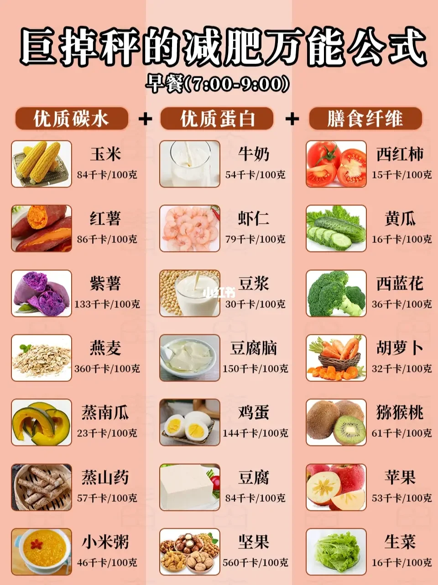
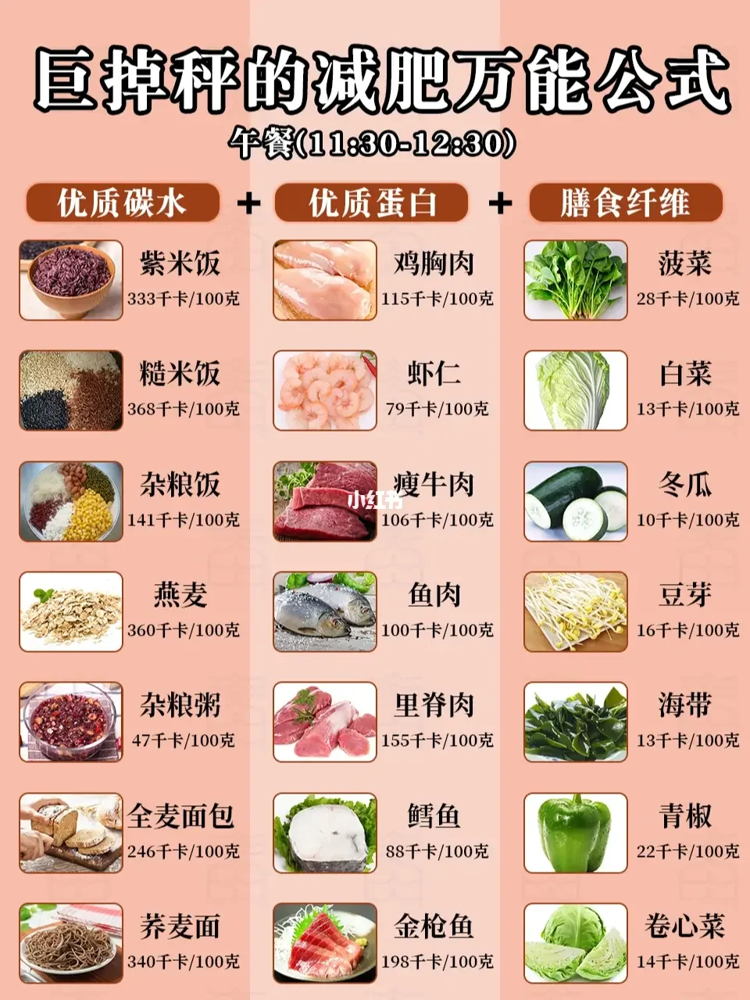
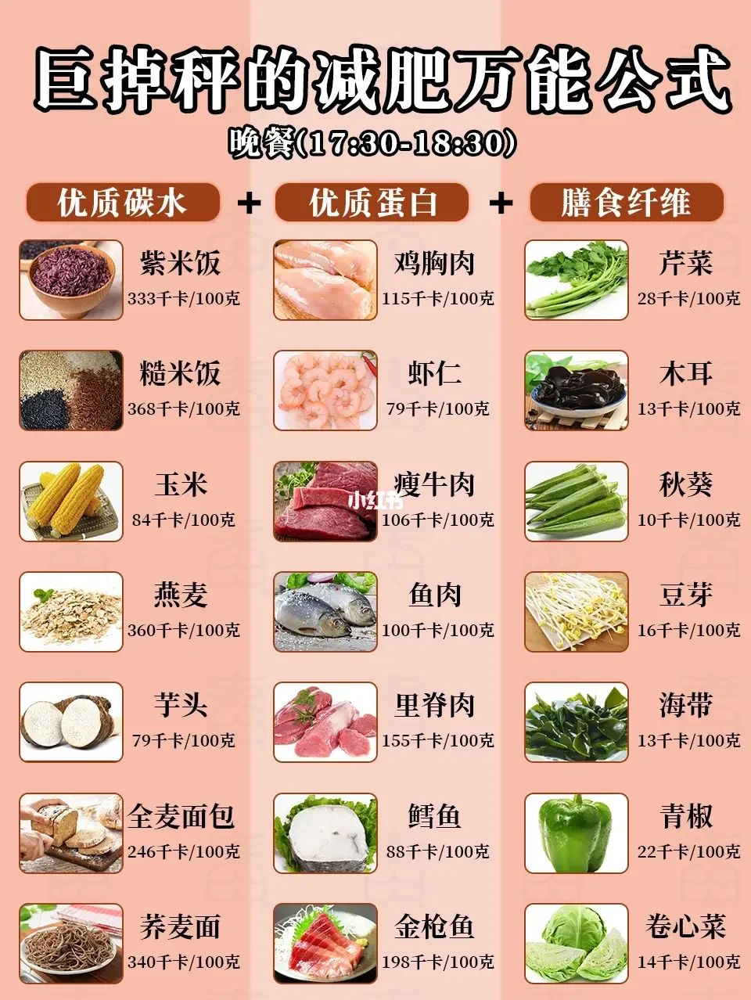

活得开心 - 健康小尝试
===

> Create by **jsliang** on **2023-07-12 08:30:29**  
> Recently revised in **2023-07-21 22:41:56**

不要希望一周暴瘦 10 斤，也不要希望一天暴富。

哪有那么好的事，如果有我早去了。

## 一、睡眠

**打卡次数**：4 （2023-07-21）

* 晚上：23:30-07:00。23:00 闹钟结束一切活动，床上酝酿睡意
* 中午：13:20-13:50。保证下午精神

## 二、护发

在进入这个模块之前，先同步一下你我的知识掌握：

* [脱发一步一步加重！就有了脱发等级图！看看脱发演变趋势吧！](https://zhuanlan.zhihu.com/p/55831640)

### 2.1 按摩

**打卡天数**：5 （2023-07-21）

**打卡记录**：

1. 早中晚，想到/有空就尝试循环 2 次。早上按摩地会很放松，能睡回笼觉那种；中午按摩完很精神导致午觉没休息好；晚上吹干头发按摩，稍微有点提神效果
2. 不要敷衍性地按摩，放下手机放松身体放空情绪，可以在同一部位多按摩一会，这样会比较有感觉
3. 指腹按摩和握拳按摩对不同部位的效果不一样，指腹按摩对于头顶、额角以及中间操作会方便（软肉多）、握拳按摩对于有骨头的地方操作会方便一点，头顶效果不理想。
4. 按照个人习惯会对这几个按摩姿势有一定改变，最重要的就是要舒适。
5. 每个姿势做 4 个 8 拍会很轻松

**原理**：脱发部分的头皮纤维化会比较严重，严重的纤维化会导致毛囊供血和供氧不足，按摩可以改善和预防头皮的纤维化，促进毛囊组织的再生

**时机**：

* 中午 11:00
* 下午 15:00
* 加班熬夜的情况加次数。熬夜加班会导致头皮紧绷，进而加剧头皮的纤维化（脱发严重）
* 随时都可以按摩，如果头皮油啥的可以洗个头发清洁下头皮再操作（不需要按摩油或者护发素，因为油腻阻碍我们操作）

**注意**：

1. 男士秃顶一般从发旋和两个额角开始，可以着重关注
2. 女性秃顶一般从头顶发缝开始，可以着重关注

**步骤**：下面步骤循环 2~3 次，给头皮做个 SPA，达到放松情况即可

> 注意按摩过程因尽可能放松，不能太用力，也不能太缓

1. 风池穴按摩：在脖子以及头发的交汇处有个「风池穴」，食指和中指并拢打圈 `○` 按摩
2. 角孙穴按摩：在耳朵上方有个「角孙穴」，大拇指指腹微微挤压，并打圈 `○` 按摩
3. 指腹按摩：五指呈抓的形式，让头皮达到波浪式挤压 `_^_` 效果
4. 握拳按摩：双手握拳，用手指中间部分关节作为支点，做打圈 `○` 动作

> 百会穴、玉枕穴在上述按摩步骤中，可以稍微涉及一下

### 2.2 洗头

1. 剪掉指甲，用指腹揉头发
2. 洗发水用含氨基酸的洗护产品

### 2.3 吹发

1. 有条件争取自然风干，没条件用吹风机
2. 吹风机尽可能接近自然风，不要用太热或者太冷的档对着头皮吹（吹头发离头皮远一点）

### 2.4 梳头

1. 梳头的作用是活络头顶经络，促进血液循环
2. 所以如果你懂按摩，给自己头皮做个按摩也能达到这个效果

### 2.5 养发

1. 吃杂不吃差，尽可能摄取更多的营养元素种类
2. 生物素（维生素 H）、锌、铁、维生素 D、维生素 E、不饱和脂肪酸和氨基酸

食谱：

* 坚果：核桃、腰果、夏威夷果、巴西坚果……
* 黑色系食物：黑八宝、芝麻糊、黑芝麻
* 生物素：蛋黄
* 其他：五谷杂粮粥、阿胶
* 药物：胱氨酸片、维生素B6、维生素B2
* 维生素 D：三文鱼，富含 DHA 和维生素 D，建议每周吃 2-3 次，每次 100-150 克，用油小火煎两面各 5 分钟加调味
* 不饱和脂肪酸：牛油果，富含不饱和脂肪酸和维生素 E
* 铁/锌：生蚝

> 注 1：养发跟减肥有一定的冲突，比如牛油果

> 注 2：上面罗列的食物因为跟减肥的饮食计划有所冲突，所以除了五谷杂粮、坚果这些，其他的一般目前不会吃

## 三、饮食

在进入这个模块之前，先同步一下你我的知识掌握：

* 知识 1：「**8 + 16 断食减肥法**」

即 8 小时内随便吃，16 小时不吃有热量的东西。

但是上班族一般比较难做，至少是 9:00-19:00，而且感觉容易反弹（如果没有配合好早睡习惯）。

* 知识 2：「**优质碳水 + 优质蛋白 + 膳食纤维**」

作为优秀的饮食配方，可以尝试优质碳水 + 优质蛋白 + 膳食纤维的搭配。

即一拳头主食 + 一拳头蛋白质 + 两拳头蔬菜（75g-100g）。

* 知识 3：「**卡路里换算公式**」

1 千卡 / 1 大卡 / 1 卡路里（kcal） = 4.184 千焦。

碰到配方表的计算，直接将【能量】的值除于 4 计算即可。

比如每 100g 能量 2355 千焦，估算就是 590 大卡。

* 知识 4：「**饮食控油**」

一天摄入的脂肪在 50g 左右，包含炒菜的油和食材本身含有的油脂。

油的话控制在 25g 左右，两勺~两勺半（一天），可以采用喷雾式油壶。

* 知识 5：「**饱和脂肪酸和不饱和脂肪酸**」

动物油脂倾向于饱和脂肪酸，植物油倾向于不饱和脂肪酸，或者多不饱和脂肪酸。

饱和脂肪适合提供能量，单不饱和脂肪酸降血压降血脂降胆固醇，多不饱和脂肪酸富含 Omega-3 和 Omega-6。

单不饱和脂肪酸和多不饱和脂肪酸稳定性更差、活性更高、更容易被氧化、更容易被改性。

烧菜的时候，高温容易导致多不饱和脂肪酸改性，甚至产生反式脂肪酸。

* 知识 6：「**Omega-3 和 Omega-6**」

Omega-3 和 Omega-6 人体无法合成。

Omega-3:Omega-6 最佳比例为 1:1。

专门补充 Omega-3，也可以用鱼油，或者深海鱼肉等。

* 知识 7：「**食用油**」

橄榄油。特级初榨橄榄油的烟点低，适合小火和凉拌。尽量不要选择精炼的。

花生油。自身饮食习惯，适合大火和爆炒。

大部分食用油不易存放，不需要购买太多。

贮藏方式包括但不限于：注意置放阴凉的地方；注意用完后拧紧瓶盖，减少与空气接触；注意分开装时瓶子的干燥；注意用过的油不要倒回瓶中和新油混合。

* 知识 8：「**空气炸锅**」

空气炸锅最好买那种取出式的。

抽屉式的不容易清洗，容易致癌（打个 ? 号）。

参考文献：

* [知乎：一分钟教你看懂食品营养表](https://zhuanlan.zhihu.com/p/30033310)
* [小红书：🔥巨掉秤的减肥食谱，让你越吃越瘦‼️](https://www.xiaohongshu.com/explore/63edfd1c00000000130111df)
* [小红书：美味营养低脂低卡](https://www.xiaohongshu.com/explore/63be5cfc000000001b016063)
* [b 站视频：减肥别吃植物油！种子油让身体发炎变胖，动物油炒菜不香吗？【第44期】](https://www.bilibili.com/video/BV1w7411Y7xx/)
* [b 站视频：做饭怎样用油才健康？这有一份科学指南](https://www.bilibili.com/video/BV1mt411Y7bZ)
* [b 站视频：食用油健康排行榜，花生油在第三梯度，谁才是“油中之王”？](https://www.bilibili.com/video/BV1kL411Q7b6/)
* [b 站视频：这种油汪汪的烧烤，减肥一定要多吃！](https://www.bilibili.com/video/BV12m4y1k7nq)
* [b 站视频：空气炸锅半成品备餐！少油低卡！好吃又健康！](https://www.bilibili.com/video/BV1Je4y1K7pT/)

### 3.1 个人食谱

酱料配方清单：

1. 「**酱料配方 1**」：蒜末 + 少许橄榄油 + 2 勺生抽 + 1 勺陈醋 + 1 勺蚝油
2. 「**酱料配方 2**」：蒜末 + 2 勺生抽 + 1 勺蚝油 + 半勺香油
3. 「**酱料配方 3**」：1 勺生抽 + 1 勺老抽 + 少许淀粉

晚餐食谱：

* **食谱 1：西蓝花鸡肉魔芋**

尝试次数：0

食材：西蓝花、鸡胸肉、魔芋结、蒜末

做法：鸡胸肉腌制 5 分钟，西蓝花和魔芋结煮熟捞出，少量橄榄油加上蒜片炒熟鸡胸肉，加入西蓝花、魔芋结以及「酱料配方 1」超匀即可

* **食谱 2：菠菜金针菇虾仁**

尝试次数：0

食材：菠菜、金针菇、虾仁

做法：将食材煮熟后，放入碗中，淋上「酱料配方 2」，拌匀即可开吃

* **食谱 3：西蓝花香菇**

尝试次数：0

食材：西蓝花、香菇、蒜末

做法：西蓝花焯水煮熟，少油爆香蒜末，加入香菇炒熟，放上少许盐和 1 勺蚝油，均匀撒上黑胡椒即可

* **食谱 4：西蓝花鸡胸肉**

尝试次数：0

食材：西蓝花、鸡胸肉

做法：鸡胸肉切块，配合「酱料配方 3」腌制 15 分钟，西蓝花焯水捞出，煎熟鸡胸肉后倒入西蓝花翻炒，最后加上 1 勺（生抽+蚝油）炒匀即可

### 3.2 早餐

我的配方：

* （1 次）玉米 + 鸡蛋 + 胡萝卜
* （1 次）胡萝卜 + 鸡蛋

推荐配方：

### 3.3 午餐

我的配方：

* （1 次）【外卖】鸡胸肉 + 半颗鸡蛋 + 西蓝花 + 杂菇 + 南瓜 + 菠菜
* （1 次）【外卖】牛肉 + 玉米粒 + 半颗鸡蛋 + 胡萝卜丝 + 西蓝花 + 魔芋丝 + 黄瓜丝
* （1 次）【外卖】金枪鱼 + 鸡胸肉 + 玉米粒 + 胡萝卜丝 + 西蓝花 + 鸡蛋 + 青瓜丝 + 豆芽 + 吞拿鱼 + 低 GI 荞麦面

推荐配方：

### 3.4 加餐

推荐配方：

### 3.5 晚餐

## 四、锻炼

* 3.45 km + 7-8' 配速慢跑
* [b 站视频：小伙子亲测！全网公认脂肪杀手“波比跳”](https://www.bilibili.com/video/BV1oF411K7cS/)

## 五、参考文献

* [小红书：第23集 | 防脱头皮按摩 | 拯救秃头少男少女](https://www.xiaohongshu.com/explore/60e41390000000002103bc6e)
* [小红书：头部按摩跟练版](https://www.xiaohongshu.com/explore/638ae1ac000000001b027902)
* [知乎：脱发一步一步加重！就有了脱发等级图！看看脱发演变趋势吧！](https://zhuanlan.zhihu.com/p/55831640)
* [b 站视频：四年生发血泪史！这些习惯做不好活该是秃头！养发生发必看｜纯干货个人分享！](https://www.bilibili.com/video/BV1eE41177wf/)
* [b 站视频：最生发养发的食物排名，别再只吃黑芝麻了](https://www.bilibili.com/video/BV1d44y1x7c3)
* [b 站视频：牛油果：30年前还是垃圾食品，为什么突然成了完美神果？](https://www.bilibili.com/video/BV1vz4y1U7C6/)
* [小红书：🔥巨掉秤的减肥食谱，让你越吃越瘦‼️](https://www.xiaohongshu.com/explore/63edfd1c00000000130111df)
* [小红书：美味营养低脂低卡](https://www.xiaohongshu.com/explore/63be5cfc000000001b016063)
* [b 站视频：小伙子亲测！全网公认脂肪杀手“波比跳”](https://www.bilibili.com/video/BV1oF411K7cS/)
* [b 站视频：减肥别吃植物油！种子油让身体发炎变胖，动物油炒菜不香吗？【第44期】](https://www.bilibili.com/video/BV1w7411Y7xx/)
* [b 站视频：做饭怎样用油才健康？这有一份科学指南](https://www.bilibili.com/video/BV1mt411Y7bZ)
* [b 站视频：这种油汪汪的烧烤，减肥一定要多吃！](https://www.bilibili.com/video/BV12m4y1k7nq)
* [b 站视频：空气炸锅半成品备餐！少油低卡！好吃又健康！](https://www.bilibili.com/video/BV1Je4y1K7pT/)
* [b 站视频：食用油的种类这么多，怎么选才健康又实惠？](https://www.bilibili.com/video/BV1oA411A7MS)
* [b 站视频：一分钟了解食用油到底怎么选](https://www.bilibili.com/video/BV1RB4y1G7hs/)
* [b 站视频：食用油健康排行榜，花生油在第三梯度，谁才是“油中之王”？](https://www.bilibili.com/video/BV1kL411Q7b6/)
* [b 站视频：一个视频告诉你健康的食用油怎么选](https://www.bilibili.com/video/BV1cu411e726)
* [文章：「Omega–3油」到底是什麼？一圖看懂橄欖油、魚油７種油品脂肪酸比例](https://health.gvm.com.tw/article/82885)
* [文章：Omega-3、6、9有什麼差別？營養師帶你認識人體「必需脂肪酸」](https://shop.vitabox.com.tw/pages/omega-3-6-9)
* [知乎：一分钟教你看懂食品营养表](https://zhuanlan.zhihu.com/p/30033310)
* [知乎：豆奶减肥法，其实豆奶多喝也会胖，树袋宝宝给新妈指明路](https://zhuanlan.zhihu.com/p/130863982)
* [知乎：你还不知道魔芋是什么，可是你都吃了它！](https://zhuanlan.zhihu.com/p/57197783)
* [A+ 医学百科：魔芋](http://www.a-hospital.com/w/%E9%AD%94%E8%8A%8B)

---

**不折腾的前端，和咸鱼有什么区别！**

觉得文章不错的小伙伴欢迎点赞/点 Star。

如果小伙伴需要联系 **jsliang**：

* [Github](https://github.com/LiangJunrong/document-library)
* [掘金](https://juejin.im/user/3403743728515246)

个人联系方式存放在 Github 首页，欢迎一起折腾~

争取打造自己成为一个充满探索欲，喜欢折腾，乐于扩展自己知识面的终身学习斜杠程序员。

> jsliang 的文档库由 [梁峻荣](https://github.com/LiangJunrong) 采用 [知识共享 署名-非商业性使用-相同方式共享 4.0 国际 许可协议](http://creativecommons.org/licenses/by-nc-sa/4.0/) 进行许可。 基于 [https://github.com/LiangJunrong/document-library](https://github.com/LiangJunrong/document-library) 上的作品创作。 本许可协议授权之外的使用权限可以从 [https://creativecommons.org/licenses/by-nc-sa/2.5/cn/](https://creativecommons.org/licenses/by-nc-sa/2.5/cn/) 处获得。

