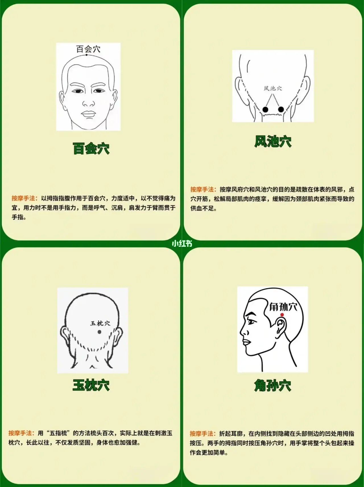

活得开心 - 健康小尝试
===

> Create by **jsliang** on **2023-07-12 08:30:29**  
> Recently revised in **2023-07-16 22:55:32**

## 一、睡眠

**打卡次数**：

* 晚上：23:30-07:00。23:00 闹钟结束一切活动，床上酝酿睡意
* 中午：13:20-13:50。保证下午精神

## 二、护发

在你进行护发之前，请了解常见的基础知识，统一一下你我的认知：

* [脱发一步一步加重！就有了脱发等级图！看看脱发演变趋势吧！](https://zhuanlan.zhihu.com/p/55831640)

### 2.1 按摩

**打卡次数**：1

**打卡记录**：

* 第 1 次：循环 2 次，很放松，能睡回笼觉那种

**原理**：脱发部分的头皮纤维化会比较严重，严重的纤维化会导致毛囊供血和供氧不足，按摩可以改善和预防头皮的纤维化，促进毛囊组织的再生

**时机**：

* 中午 11:00
* 下午 15:00
* 加班熬夜的情况加次数。熬夜加班会导致头皮紧绷，进而加剧头皮的纤维化（脱发严重）
* 随时都可以按摩，如果头皮油啥的可以洗个头发清洁下头皮再操作（不需要按摩油或者护发素，因为油腻阻碍我们操作）

**注意**：

1. 男士秃顶一般从发旋和两个额角开始，可以着重关注
2. 女性秃顶一般从头顶发缝开始，可以着重关注

**步骤**：下面步骤循环 2~3 次，给头皮做个 SPA，达到放松情况即可

> 注意按摩过程因尽可能放松，不能太用力，也不能太缓

1. 指腹按摩：五指呈抓的形式，让头皮达到波浪式挤压 `_^_` 效果
2. 握拳按摩：双手握拳，用手指中间部分关节作为支点，做打圈 ○ 动作
3. 风池穴按摩：在脖子以及头发的交汇处有个「风池穴」，食指和中指并拢打圈按摩
4. 角孙穴按摩：在耳朵上方有个「角孙穴」，大拇指指腹微微挤压，并打圈按摩

> 百会穴、玉枕穴在上述按摩步骤中，可以稍微涉及一下

### 2.2 洗头

1. 剪掉指甲，用指腹揉头发
2. 洗发水用含氨基酸的洗护产品

### 2.3 吹发

1. 有条件争取自然风干，没条件用吹风机；
2. 吹风机尽可能接近自然风，不要用太热或者太冷的档对着头皮吹（吹头发离头皮远一点）

### 2.4 梳头

1. 梳头的作用是活络头顶经络，促进血液循环
2. 所以如果你懂按摩，给自己头皮做个按摩也能达到这个效果

### 2.5 养发

1. 吃杂不吃差，尽可能摄取更多的营养元素种类
2. 生物素（维生素 H）、锌、铁、维生素 D、维生素 E、不饱和脂肪酸和氨基酸

食谱：

* 黑八宝
* 坚果（核桃、腰果、夏威夷果等）
* 蛋黄（10 mcg 生物素）
* 五谷杂粮粥
* 芝麻糊
* 核桃
* 阿胶
* 胱氨酸片/维生素B6/维生素B2
* 三文鱼。DHA 和维生素 D 含量都最高的日常食物，建议每周吃 2-3 次，每次 100-150 克，用油小火煎两面各 5 分钟加调味
* 坚果种子。黑芝麻、巴西坚果
* 牛油果。富含不饱和脂肪酸和维生素 E
* 生蚝。铁、锌

> 注：养发跟减肥有一定的冲突，比如牛油果

## 饮食

8 + 16 断食减肥法：8 小时内随便吃，16 小时不吃有热量的东西

做不到，改为 09:00 - 19:00

食谱：

* ❤️科学健康的饮食一定是：优质碳水 + 优质蛋白 + 膳食纤维
* 🧐优质碳水代表：燕麦、杂粮饭、全麦面包、煮玉米、煮红薯、蒸山药、蒸南瓜、荞麦面等
* 🧐优质蛋白代表：鸡胸肉、鱼肉、瘦牛肉、豆腐、豆浆、鸡蛋、牛奶、虾仁、坚果等
* 🧐膳食纤维：西红柿、黄瓜、西兰花、胡萝卜、生菜、冬瓜、豆芽、海带、青椒等
* 🧐低糖水果：苹果🍎、圣女果、桃子、橙子🍊、草莓🍓、西梅、柚子

参考：

* [小红书：🔥巨掉秤的减肥食谱，让你越吃越瘦‼️](https://www.xiaohongshu.com/explore/63edfd1c00000000130111df)

## 锻炼

## 疯狂 AI

https://claude.ai/

减肥计划方案

* jsliang：制定一个减肥计划，适合体重87.3kg，身高178cm的人

好的,给体重87.3kg,身高178cm的您制定一个合理的减肥计划:

1. 适度控制饮食摄入量,少吃高热量、高脂肪食物,多吃蔬菜水果。一天摄入总热量控制在1600-2000千卡左右。 
2. 合理安排三餐,不要跳过早餐,也不要大量进食夜宵。
3. 增加日常活动量,每天至少要有30-60分钟的有氧运动,比如快走、慢跑、游泳等。
4. 培养良好的生活作息习惯,早睡早起,保证充足的睡眠时间。
5. 定期进行体重监测,根据体重变化适当调整饮食和运动量。
6. 心态放松,保持乐观积极的态度。可以适当加入瑜伽等放松活动。
7. 可以加入社区运动团队,和朋友们一起互相鼓励。
8. 每月订立具体的体重目标,努力达成。
9. 戒烟限酒,不要过度消费含糖饮料。 
10. 保持计划的持续性,即使体重已达标,也要继续保持良好的生活习惯。

这个计划需要您的耐心和坚持,希望能对您的减肥之旅有所帮助。如果有任何疑问,欢迎随时提出,我会为您提供更个性化的建议。

* jsliang：听说波比跳适合这类人群，请进一步优化这个减肥计划

好的,针对体重87.3kg,身高178cm的您,我来进一步优化增加波比跳的减肥计划:

1. 每天选择适当的音乐,跳波比跳游乐舞蹈,时长30-60分钟。音乐节奏明快,动作要轻快有力。
2. 波比跳可以配合饮食控制,空腹状态下跳舞可以更好地消耗体内脂肪。
3. 动作要保持双脚离地,上下弹跳,这样可以更好地运用自身体重,消耗更多热量。
4. 可以边跳边唱,加入调动全身肌肉的手臂和躯干动作,增强训练强度。
5. 也可以加入一些波比跳基础课程,系统地学习各种动作技巧。
6. 跳舞前后可以适当进行伸展运动,防止肌肉拉伤。
7. 可以定期测量体重、身体脂肪率等指标,评估跳舞减肥效果。
8. 保持乐观积极心态,与伙伴们一起跳舞减肥。

波比跳节奏快乐,非常适合减肥塑形。希望这些建议可以帮助您的减肥计划事半功倍!持之以恒,您一定能达到体重目标!

* jsliang：减肥计划注意的饮食问题应包含哪些

开展减肥计划时,饮食方面需要注意以下几点:

1. 控制饮食总热量,计算每天需要的热量摄入量,适度减少300-500千卡。
2. 合理饮食结构,确保sufficient蛋白质摄入,约占总热量的15%-20%。饮食中脂肪不要超过总热量的30%。
3. 加大蔬菜和水果的摄入量。蔬菜水果提供维生素、矿物质和膳食纤维,还能增强饱腹感。
4. 少吃高糖、高脂肪的垃圾食品,如甜点、糕点、炸物和含糖饮料等。
5. 多喝白开水,至少每天喝1.5-2升。减少含糖饮料、酒精的摄入。
6. 分餐次数要合理,不要长期挨饿或大餐一次吃太多。
7. 避免情绪性暴饮暴食。学习控制压力,不以食物发泄情绪。
8. 进食要慢慢咀嚼,减缓进食速度,让大脑有充分的饱腹感知。

合理的饮食结构和方法对减肥大有裨益,希望这些建议可以帮助您的减肥之路!

* jsliang：牛油果属于减肥计划的水果范畴吗？

牛油果是否属于减肥计划推荐的水果,可以从以下几点来分析:

1. 牛油果肉质软滑,口感香甜,但热量并不低,每100克约147千卡。
2. 牛油果中脂肪含量较高,约占熟果份量的15%,主要为不饱和脂肪。
3. 牛油果含钾、维生素E、维生素K等微量元素较丰富。
4. 牛油果中含有膳食纤维,可助于增强饱腹感,缓解便秘。
5. 牛油果中不含蛋白质,对促进减肥效果帮助不大。
6. 牛油果价格较为昂贵,不适合大量食用。

综合来看,牛油果热量较高,可以作为减肥餐间的零食之一,但不适合作为减肥主食。建议控制每天摄入量在50-100克。在热量控制允许的范围内,适量食用牛油果对减肥还是有一定帮助的。

* jsliang：哪些坚果适合减肥计划食用

在减肥计划中,下列几种坚果适合适量添加到日常饮食中:

1. 腰果
腰果含蛋白质和脂肪较高,还含丰富的膳食纤维,可以帮助控制食欲,提高饱腹感。
2. 核桃
核桃含钙、镁等矿物质丰富,也含有肌肉所需的蛋白质。
3. 瓜子
瓜子中的不饱和脂肪可以帮助降低胆固醇,也含有蛋白质。
4. 杏仁
杏仁中Omega-3脂肪酸丰富,可以帮助减轻体重。
5. 腰果
富含蛋白质和钙等营养物质,适量食用有利于健康减肥。
6. 开心果
开心果中的膳食纤维丰富,可以增加饱腹感。
7. 葵花子仁
葵花子仁中优质蛋白质的含量很高,可以减少食欲。

需要注意的是,坚果热量较高,适量食用即可,每天控制在30-50克。同时不能以坚果完全代替主餐。

* jsliang：8+16减肥断食法是指？

8+16减肥断食法简单来说就是:

1. 在24小时内,限制进食时间为8小时内。
2. 剩余16小时为断食时间,只可以摄入水、黑咖啡或零卡饮料。
3. 进食时间可以自行安排,例如10am至6pm。
4. 在进食时间内,可以正常饮食,但要控制饮食总热量。
5. 断食期间一定要充足饮水,可以提高新陈代谢,减少饥饿感。
6. 开始时可以从12小时断食做起,慢慢延长至16小时。
7. 需要保证每天的睡眠时间。
8. 可以进行轻度有氧运动,但不要过量运动。

这种断食法可以帮助控制饮食热量摄入,减少脂肪堆积。但需要注意补充营养,不要长期执行。需要根据身体情况调整。

* jsliang：有哪些对减肥有帮助的优质碳水食物推荐

推荐一些对减肥有帮助的优质碳水化合物食物:

1. 燕麦
含有膳食纤维,可以帮助控制食欲和血糖。
2. 全麦面包
全麦中富含蛋白质、膳食纤维和维生素B。选择高蛋白低糖的全麦面包。
3. 蕃薯
营养丰富的蔬菜,含丰富膳食纤维,热量不高。
4. 蚕豆
高蛋白、高膳食纤维,控制食欲效果好。
5. 西兰花
含丰富维生素C和膳食纤维,可以代替大部分碳水化合物。 
6. 藜麦
含有植物蛋白质,可以减少对精制碳水的依赖。
7. 糙米
富含蛋白质、维生素和矿物质,全面营养。
8. 马铃薯
去皮后热量不高,淀粉易产生饱腹感。

总之,选择高蛋白、高膳食纤维的优质碳水,有助于减肥过程中控制饥饿和血糖。

* jsliang：有哪些对减肥有帮助的优质蛋白食物推荐

这里推荐几种对减肥有帮助的优质蛋白食物:

1. 瘦肉
如瘦猪肉、牛肉、鸡肉等,优质蛋白,少脂肪。
2. 鱼类
如三文鱼、金枪鱼、对虾等,提供优质蛋白质。
3. 蛋白粉
如奶蛋白粉、大豆蛋白粉、米蛋白粉,高纯度蛋白质。
4. 豆类
如大豆、黑豆、鸡豆等,植物蛋白的良好来源。
5. 希腊酸奶
高蛋白,低糖,有益菌,蛋白质吸收好。
6. 低脂奶酪
如棕榈奶酪、帕马森奶酪,蛋白质丰富。
7. 蛋白质麦片
富含谷物蛋白,方便快捷。
8. 蛋白质棒
帮助补充运动时的蛋白需求。
9. 鲜蚕豆
蛋白质和膳食纤维含量丰富。
10. 虾仁
鲜嫩的虾仁几乎全是蛋白质。

合理搭配食用这些优质蛋白食物,既能满足减肥过程中的蛋白质需求,也能帮助控制饥饿感,利于减肥。

* 请针对饮食和锻炼，制定一个减肥计划，适合体重87.3kg，身高178cm的人，另外强调这个人平时吃外卖比较多

好的,针对体重87.3kg,身高178cm,且平时吃外卖较多的情况,我推荐如下减肥计划:

一、饮食方面
1. 控制每日饮食总热量在1600-1800千卡。
2. 少吃高脂肪、高糖外卖,每周外卖控制在2-3次。
3. 加大蔬菜水果在餐盘中的比例,使其占一半体积。
4. 少吃精白饭类,选择淀粉类食物以全麦、燕麦等为主。  
5. 选择烧烤、蒸煮等低脂肪烹饪方法,限制油炸食品。
6. 避免过量饮酒及饮料,每日饮水2升以上。

二、运动方面  
1. 每周进行3-4次中等强度有氧运动,每次30-60分钟,如快走、游泳、骑自行车等。
2. 增加日常步行量,利用步行代替部分短途交通工具。 
3. 每周进行2-3次力量训练,增强肌肉量,提高基础代谢。
4. 坚持每周2-3次拉伸运动,保证身体柔韧性。
5. 逐步增加运动强度,可配合间歇性训练等有氧运动。

三、其他
1. 每周体重测量1次,记录身体变化。
2. 睡眠时间保证7-8小时,保障减肥效果。
3. 定期进行身体检查,确认体质指数、血脂等指标。
4. 注意情绪管理,保持良好心态。

希望这些针对性的建议可以帮助您制定成功的减肥计划!减肥需要过程与坚持,持之以恒定能达到体重目标。

## 参考文献

* [小红书：第23集 | 防脱头皮按摩 | 拯救秃头少男少女](https://www.xiaohongshu.com/explore/60e41390000000002103bc6e)
* [小红书：头部按摩跟练版](https://www.xiaohongshu.com/explore/638ae1ac000000001b027902)
* [知乎：脱发一步一步加重！就有了脱发等级图！看看脱发演变趋势吧！](https://zhuanlan.zhihu.com/p/55831640)
* [b 站视频：四年生发血泪史！这些习惯做不好活该是秃头！养发生发必看｜纯干货个人分享！](https://www.bilibili.com/video/BV1eE41177wf/)
* [b 站视频：最生发养发的食物排名，别再只吃黑芝麻了](https://www.bilibili.com/video/BV1d44y1x7c3)
* [b 站视频：牛油果：30年前还是垃圾食品，为什么突然成了完美神果？](https://www.bilibili.com/video/BV1vz4y1U7C6/)
* [小红书：🔥巨掉秤的减肥食谱，让你越吃越瘦‼️](https://www.xiaohongshu.com/explore/63edfd1c00000000130111df)

---

**不折腾的前端，和咸鱼有什么区别！**

觉得文章不错的小伙伴欢迎点赞/点 Star。

如果小伙伴需要联系 **jsliang**：

* [Github](https://github.com/LiangJunrong/document-library)
* [掘金](https://juejin.im/user/3403743728515246)

个人联系方式存放在 Github 首页，欢迎一起折腾~

争取打造自己成为一个充满探索欲，喜欢折腾，乐于扩展自己知识面的终身学习斜杠程序员。

> jsliang 的文档库由 [梁峻荣](https://github.com/LiangJunrong) 采用 [知识共享 署名-非商业性使用-相同方式共享 4.0 国际 许可协议](http://creativecommons.org/licenses/by-nc-sa/4.0/) 进行许可。 基于 [https://github.com/LiangJunrong/document-library](https://github.com/LiangJunrong/document-library) 上的作品创作。 本许可协议授权之外的使用权限可以从 [https://creativecommons.org/licenses/by-nc-sa/2.5/cn/](https://creativecommons.org/licenses/by-nc-sa/2.5/cn/) 处获得。

