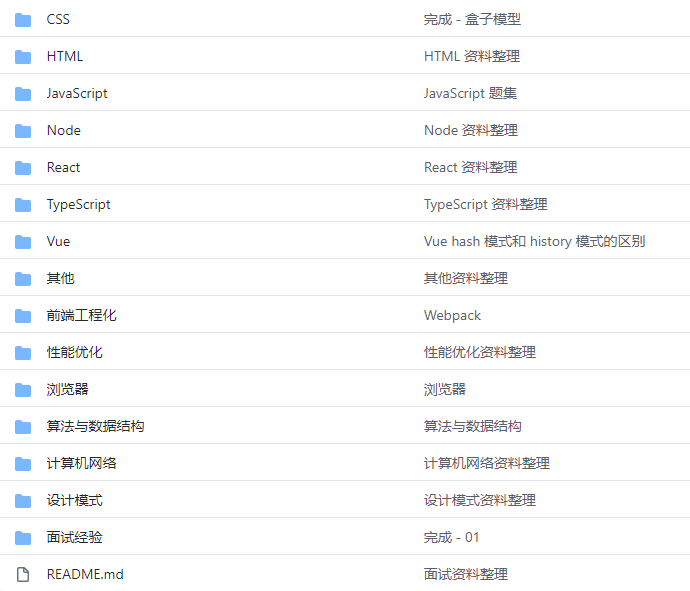

朝花夕拾 - 艰难 9 月复习及 10 月规划
===

> Create by **jsliang** on **2020-10-01 15:52:32**  
> Recently revised in **2020-10-01 16:32:37**

<!-- 目录开始 -->
## 一 目录

**不折腾的前端，和咸鱼有什么区别**

| 目录 |
| --- |
| [一 目录](#chapter-one) |
| [二 前言](#chapter-two) |
| [三 裸辞的压力](#chapter-three) |
| [四 复习进度](#chapter-four) |
| [五 其他](#chapter-five) |
<!-- 目录结束 -->

## 二 前言

> [返回目录](#chapter-one)

还来不及感慨，10 月又到了~

粗略整理一下 9 月浪费在哪了：

* 【玩】2 次爬山
  * 深圳羊台山：浪子神剑、Jeskson 等大佬
  * 广州沙湾古镇 + 滴水岩森林公园：Kacoo 等小伙伴
* 【初】花 2~3 天整理 9 月需要复习的知识体系
* 【中】根据一开始的整理，去学习并且完善诸如 Promise、Webpack 等知识点，从而形成自己的知识体系
* 【算法】坚持 LeetCode 每日一题、周赛，并跟进 LeetBook 编写
* 【刷题】牛客网每天 30 分钟刷基础题
* 【面试】月初整理并投递简历
* 【面试】月中 3 次中小厂裸面
* 【面试】月底 360 金融面试
* 【学习】React 视频学习（未完成）
* 【学习】Webpack 视频学习（完成）
* 【插件】VS Code 插件开发，丰富了 `snippets` 以及根据文章标题形成文章目录的功能
* ……

大概就是这样一些小事吧，我们挑一些部分着重聊。

## 三 裸辞的压力

> [返回目录](#chapter-one)

裸辞一时爽，一直裸辞一时爽。

建议小伙伴还是不要学我，我那是迫不得已，没有后路了。

裸辞面临的压力：

1. 亲朋好友咨询。咨询一次压力大一分，没个承受能力会去见上帝的，所以如果你身边有裸辞的小伙伴，对待他们请友善点，带他们去过个周末，吃喝放松一下是可以的，但是每天问进度就没必要了，不要去做这个恶人。
2. 个人进度问题。每个人的基础不同，每个人的目标也不同，如果是去中小厂，也许压力不会那么大，但是如果想做到更好，那么对个人来说是种挑战。拿 **jsliang** 来说：基础差、目标大，谁不想去大厂是吧，要去那就要自己承受住这个压力，自己把握好复习进度。
3. 生活生存问题。这次 **jsliang** 的资金，存少了，导致有时候觉得活着真难，而且出来两年多的人了，你也不好意思跟家里人要钱，还好 **lien**、**呆呆** 大佬的友善，还能撑撑，要不然没钱没朋友的小伙伴不建议辞职太久。

有压力的程序猿容易掉发，这句话不是瞎说的，**jsliang** 在 9 月下半月的时候，天天 2~4 点睡。

晚睡 + 压力大，结果 9.29 去深圳面试完，回来和广州小伙伴吃饭的时候，广州小伙伴说我有地中海迹象了……然后我去找我代理的植发 `hospital`，免费检查了下，发旋处的头发变细了，如果不注意真有地中海秃头迹象。

所以 9.29 和 9.30 开始调整睡眠时间和心态了，如果你面临压力，请找个好点的减压方式，例如找 **jsliang** 聊天；如果你没压力，但是头发凉了，**jsliang** 只能带你去植发 `hospital` 看看了，全国范围内（广州、深圳、南京等地）代理……

咳咳，这话题就点到这里了，有压力有 “那个” 需求欢迎私聊。

## 四 复习进度

> [返回目录](#chapter-one)

呆呆大佬有句话我很受用，我这里魔改下：

* **每个人都有自己的基础、复习进度和挑战目标，把握好自己的进度，别因为别人的快速而自愧不已，男人太快不好。**

> 车车，好快的车车

**jsliang** 在 9 月初的一个整理如下。

目前希望复习好的部分：

* React
* Webpack
* JavaScript
* HTML
* CSS
* 性能优化
* 浏览器
* 算法与数据结构
* 计算机网络
* 设计模式
* 面试经验

一共 11 部分，尽量都复习到吧，这样心态可能就好很多了。

> 仅供参考，不做炫耀

## 五 其他

> [返回目录](#chapter-one)

这个月没其他想法，就复习，9 月不成，那就 10 月，10 月不成，那就 11 月，来自 **jsliang** 的不甘吧，哈哈，加油 2020，往前冲就完了！

资料地址：https://github.com/LiangJunrong/document-library/tree/master/other-library/interview/%E9%9D%A2%E8%AF%95%E8%B5%84%E6%96%99%E6%95%B4%E7%90%86

---

>  jsliang 的文档库 由 <a xmlns:cc="http://creativecommons.org/ns#" href="https://github.com/LiangJunrong/document-library" property="cc:attributionName" rel="cc:attributionURL">梁峻荣</a> 采用 <a rel="license" href="http://creativecommons.org/licenses/by-nc-sa/4.0/">知识共享 署名-非商业性使用-相同方式共享 4.0 国际 许可协议</a>进行许可。 基于<a xmlns:dct="http://purl.org/dc/terms/" href="https://github.com/LiangJunrong/document-library" rel="dct:source">https://github.com/LiangJunrong/document-library</a>上的作品创作。 本许可协议授权之外的使用权限可以从 <a xmlns:cc="http://creativecommons.org/ns#" href="https://creativecommons.org/licenses/by-nc-sa/2.5/cn/" rel="cc:morePermissions">https://creativecommons.org/licenses/by-nc-sa/2.5/cn/</a> 处获得。