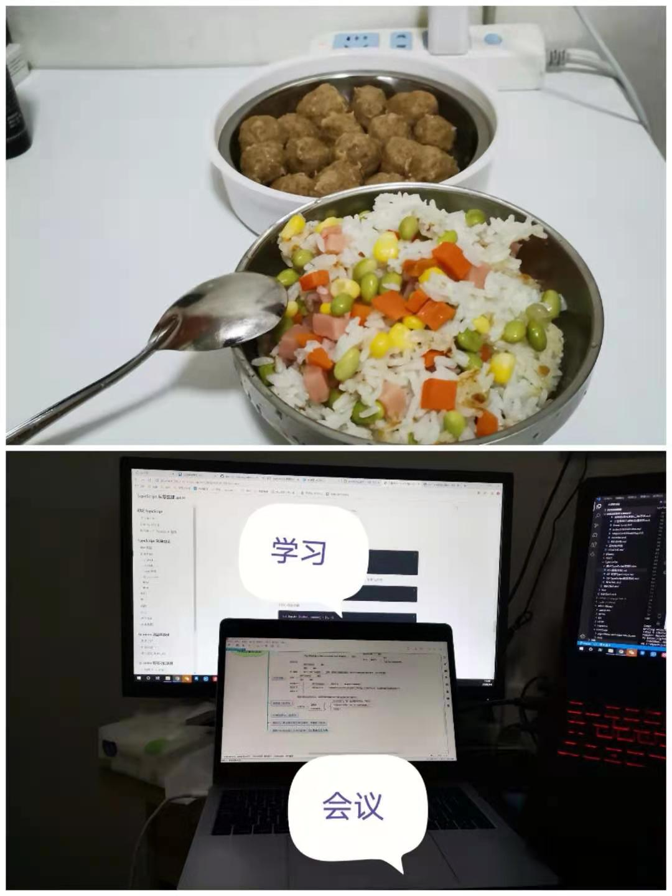
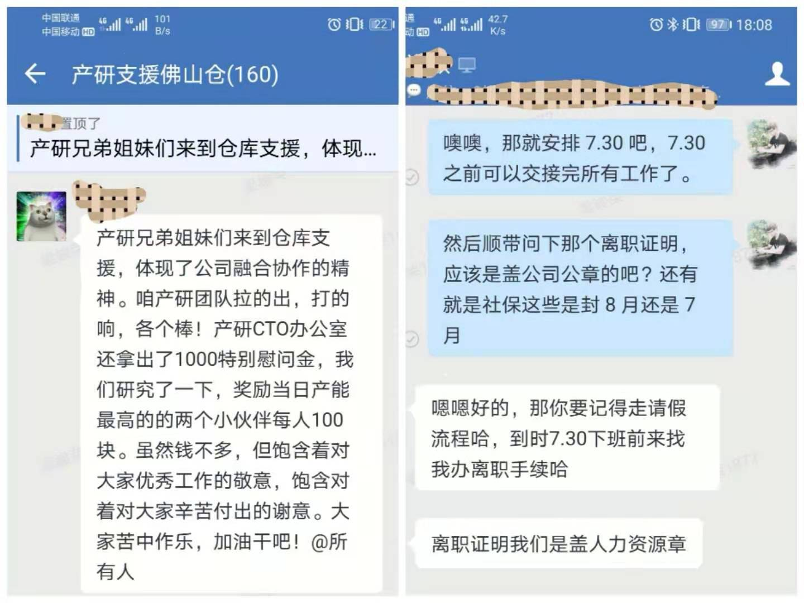
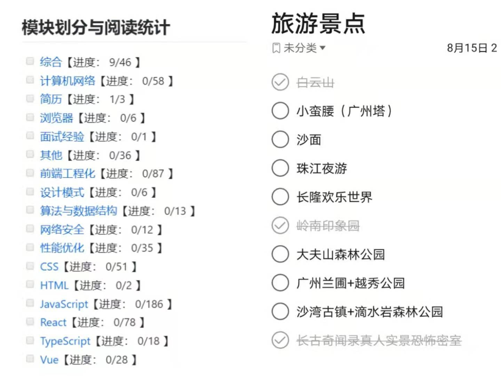

朝花夕拾 - 2020 梦一场，2021 再来战
===

> Create by **jsliang** on **2021-01-01 14:41:25**  
> Recently revised in **2021-01-01 15:49:15**

清理下半个多月没动过的电脑

倒一杯热水，捧手里慢慢喝完

拿起指甲钳，修理变长的指甲

呵，都 2021 了，你还搁这发呆呢？！

啊，对，是要做个没人看的总结和 2021 计划来着。

## 2020 梦一场

上一次想把 2020 总结写了，是 2020-12-05，不是印象深刻，是有 [笔记](https://github.com/LiangJunrong/document-library/blob/master/%E7%B3%BB%E5%88%97-%E4%B8%AA%E4%BA%BA%E7%94%9F%E6%B4%BB/%E5%A4%A7%E4%BA%8B%E8%AE%B0%E5%BD%95/2020/2020-12-05.md)。

回头一看，嚯，这都啥跟啥，写得乱七八糟的。（兴许每个人看自己之前的笔记都是这样吧）

简单来说，2020 总结：**梦一场**。

再简单来说，4 个小节 4 句话 4 张图概括 2020。

### 2月 - 3月

疫情期间的真实写照，就是职业宅男，过上了在租房办公的日子，学会了花式做鸡蛋（葱花蛋、水蛋、蛋炒饭、西红柿鸡蛋、煮鸡蛋……）

### 4月 - 7月

经过一系列变故，觉得自己不跳出这个圈，估计这辈子也就这样了，于是果断点，给自己来一刀。

### 8月 - 11月

今年 10 个裸辞会不会有 9 个哭，太痛苦了！8 月份还在定旅游计划，9 月就开始制定复习计划，痛苦煎熬，开始打磨自己。

### 11月 - 12月

一边偷着哭，一边给自己打气，熬着熬着终于拿到了真正意义上的第一份 offer，于是就入职了。

## 2021 再来战

所以，2020 并没有做什么，但是翻翻相册，都是让人难忘的日子。

2021 的计划？并没有完全想好，大概就是：

* 2 月工作转正
* 4 月出人生第一本书
* 6 月将 GitHub 的个人仓库做成一本有意义的技术书
* 8 月偷摸着将珠海旅游完（当然前提是 2 月转正能过）
* 12 月计划在河源开个小店铺
* ……

以上。

不太好意思又划水了一篇，主要是翻相册，翻着翻着觉得自己太有故事了（旁边没人一起看是个遗憾哈哈）

2020-01-01 14:45 写下第一句话，15:45 才写到这里，感觉自己还是不太适合制定比较细节的计划啊，那就这样子吧！

---

> jsliang 的文档库由 [梁峻荣](https://github.com/LiangJunrong) 采用 [知识共享 署名-非商业性使用-相同方式共享 4.0 国际 许可协议](http://creativecommons.org/licenses/by-nc-sa/4.0/) 进行许可。 基于 [https://github.com/LiangJunrong/document-library](https://github.com/LiangJunrong/document-library) 上的作品创作。 本许可协议授权之外的使用权限可以从 [https://creativecommons.org/licenses/by-nc-sa/2.5/cn/](https://creativecommons.org/licenses/by-nc-sa/2.5/cn/) 处获得。
