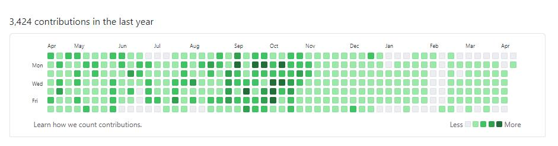
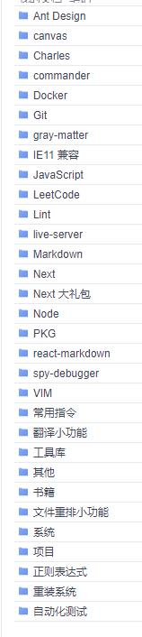
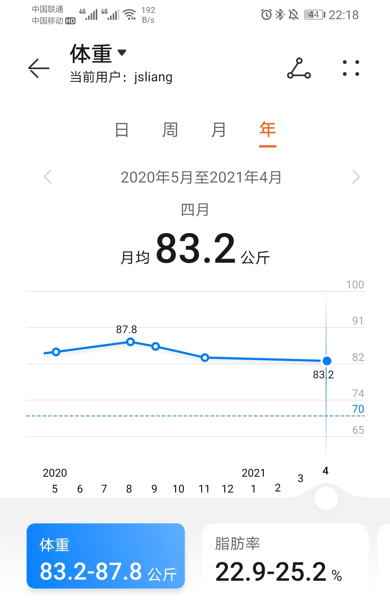
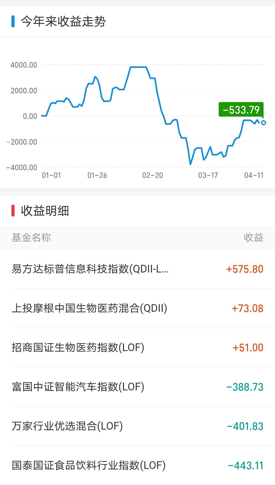

朝花夕拾 - 生日
===

> Create by **jsliang** on **2021-04-12 21:34:51**  
> Recently revised in **2021-04-12 22:34:56**

* [2019 生日贴](https://github.com/LiangJunrong/document-library/blob/master/%E7%B3%BB%E5%88%97-%E4%B8%AA%E4%BA%BA%E7%94%9F%E6%B4%BB/%E5%A4%A7%E4%BA%8B%E8%AE%B0%E5%BD%95/2019/2019-04-05.md)
* [2020 生日贴](https://github.com/LiangJunrong/document-library/blob/master/%E7%B3%BB%E5%88%97-%E4%B8%AA%E4%BA%BA%E7%94%9F%E6%B4%BB/%E5%A4%A7%E4%BA%8B%E8%AE%B0%E5%BD%95/2020/2020-03-24.md)
* [2021 生日贴](https://github.com/LiangJunrong/document-library/blob/master/%E7%B3%BB%E5%88%97-%E4%B8%AA%E4%BA%BA%E7%94%9F%E6%B4%BB/%E5%A4%A7%E4%BA%8B%E8%AE%B0%E5%BD%95/2021/2021-04-12.md)

熟悉 **jsliang** 的都知道，他是一个喜欢吹水，爱唠叨的渣渣前端。

不知不觉，他已经记录了 3 年的前端 history，陪大家度过了 1075 天。

前路漫漫，希望以后的以后，还能跟小伙伴们一起分享前端各种有用、有趣的知识点。

## 一 前言

今天真的是忘记了生日，得亏姥姥一通电话、爸妈两个红包，要不然真的就是办公室坐下去站起来就是一天。

乘着今天能正常处理完日常需求，所以 8 点下班跑了个步，回来洗完澡就开始记录下这次生日了。

OK，闲话少说，进入正题。

## 二 疑问解答

最近小伙伴们可能工作量不够，喜欢很多小问题，于是我都跟他们经理投诉了遍。

下面将这些问问题的人清单列举一遍，希望各个前端大佬、经理看看是不是你们那边的（不是）。

### 2.1 jsliang 是不是堕落了

**jsliang** 没堕落~

可能很多小伙伴看 **jsliang** 很久没更新公众号、掘金了，觉得 **jsliang** 已经放弃专研技术了。

事实并不是如此。

除了每天记录 GitHub 状态：

还有就是更新工作中碰到的各种知识点：

只是因为有些资料没脱敏，以及公司不允许登录 GitHub 和 各种云（数据安全），或者感觉自己用得不够深入，怕发出来误导小伙伴们，所以先存在金山文档上了。

当然，说这话的时候，这些内容都已经处理完了，不日就会更新上去（GitHub），欢迎小伙伴们一起折腾~

### 2.2 jsliang 的目标完成得咋样了

**首先**，体重上，是有减少的：

> 晚上洗澡 + 喝水后的情况，请不要算去毛、水分净重……

**然后**，理财上，目前是定投状态，涨跌情况看 A 股和 QDII：

**最后**，技术上，还是处于不断学习，争取打破现在窘境的情况的。

工作 3 年的囧，可能就是技术往深比不过一线大厂，管理转向比不过人家全栈，只能唯唯诺诺，内心鼓励自己一定能折腾过来的。

### 2.3 jsliang 今天许了什么愿

地狱不空誓不成佛？哈哈~

可能只是单纯希望能完成今年 01-01 定的小目标吧，没啥大计划，如果你有 idea 欢迎来吐槽。

更多可见：https://github.com/LiangJunrong/document-library

## 三 总结

那么，就酱，更多也不叨叨了，后面天天更新 GitHub 等各个平台小伙伴们就可以事实看到一个折腾的 **jsliang** 了。

在这里祝小伙伴们生活如意，事事顺利！

---

> jsliang 的文档库由 [梁峻荣](https://github.com/LiangJunrong) 采用 [知识共享 署名-非商业性使用-相同方式共享 4.0 国际 许可协议](http://creativecommons.org/licenses/by-nc-sa/4.0/) 进行许可。 基于 [https://github.com/LiangJunrong/document-library](https://github.com/LiangJunrong/document-library) 上的作品创作。 本许可协议授权之外的使用权限可以从 [https://creativecommons.org/licenses/by-nc-sa/2.5/cn/](https://creativecommons.org/licenses/by-nc-sa/2.5/cn/) 处获得。
