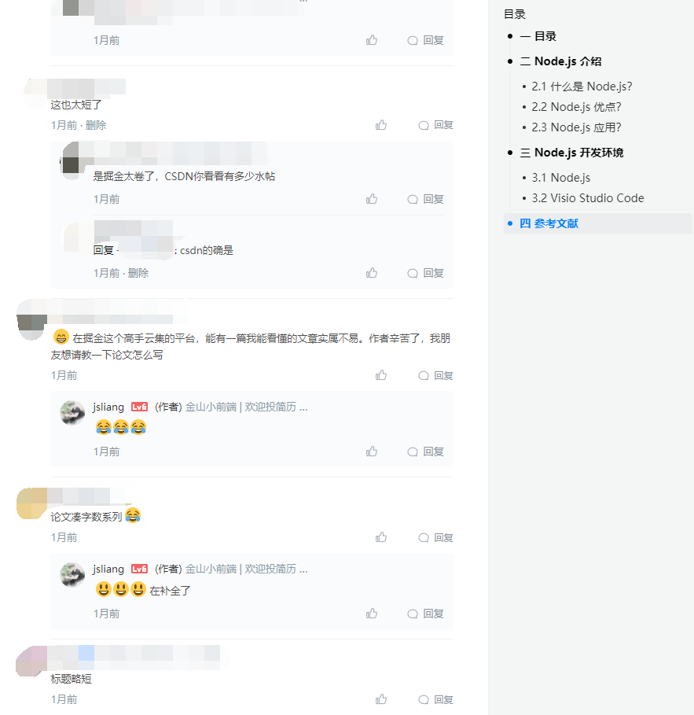
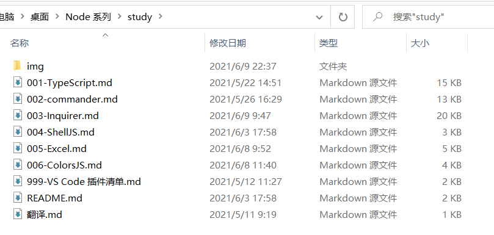
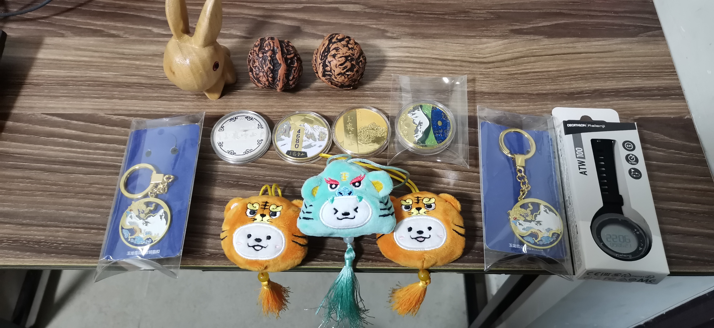

朝花夕拾 - jsliang 陪你瞎叨叨（2）
===

> Create by **jsliang** on **2021-06-09 22:38:46**  
> Recently revised in **2021-06-10 07:27:35**

不知不觉 **jsliang** 的生存日志断更 1 个月了，GitHub 也断了一个多月（哭，丢了一波小绿点）。

虽然在微信粉丝群的都知道我每天还有在折腾，但是掘金、微信公众号的小伙伴可能就误解了，4 月多发的一篇文章也被吐槽地体无完肤，怪不好意思的。

其实主要原因说开了也没啥：

* 申请支援去加了一个月的夜班（周末有时候也去支援）
* 出去云南旅游了
* 公司不支持登录 GitHub
* ……

既然已经恢复常态了，那么 GitHub、掘金、公众号 就要恢复正常更新了，Node 系列文章也是跃跃欲试：

> Markdown 的文件 1k 差不多 1w 字吧，可以看个爽快

另外端午也快到了，广东这边闹心得很，也去不了广州找朋友玩。

所以 **jsliang** 准备周五或者周六开个直播，发发礼物聊聊天：

如果你希望参与进来，可以填一下问卷：

避免错过直播/跟进的方式就是加 jsliang 的微信：Liang123Gogo 或者扫码：

那么，直播见~

---

> jsliang 的文档库由 [梁峻荣](https://github.com/LiangJunrong) 采用 [知识共享 署名-非商业性使用-相同方式共享 4.0 国际 许可协议](http://creativecommons.org/licenses/by-nc-sa/4.0/) 进行许可。 基于 [https://github.com/LiangJunrong/document-library](https://github.com/LiangJunrong/document-library) 上的作品创作。 本许可协议授权之外的使用权限可以从 [https://creativecommons.org/licenses/by-nc-sa/2.5/cn/](https://creativecommons.org/licenses/by-nc-sa/2.5/cn/) 处获得。
