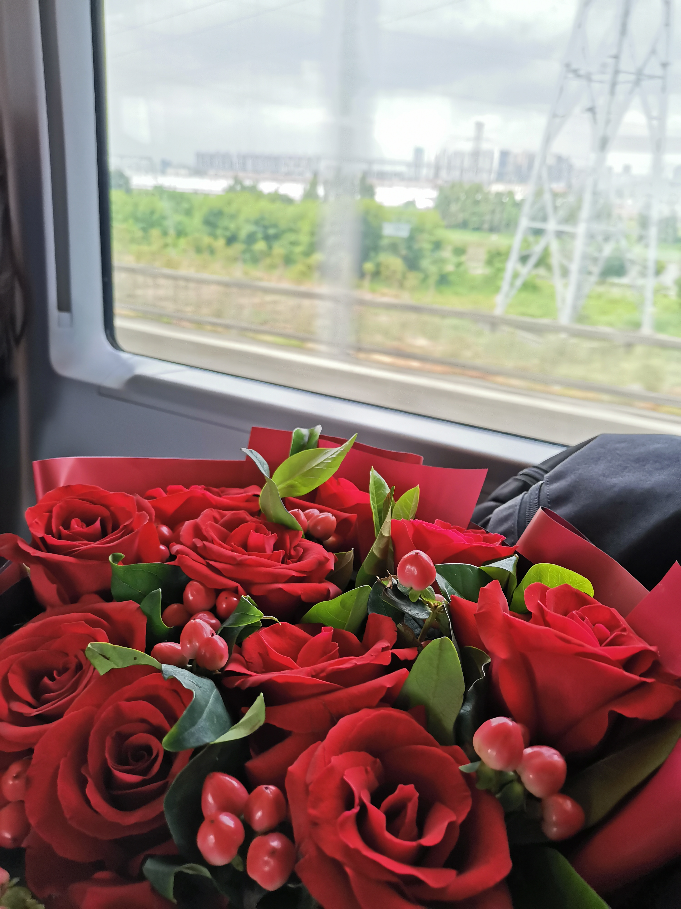
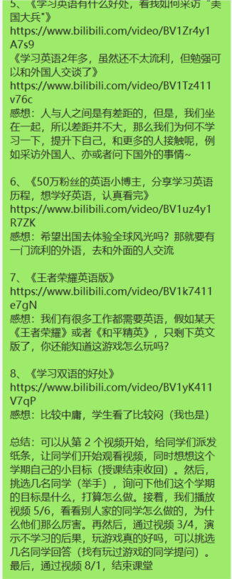

朝花夕拾 - 致 jsliang 下半年的一封信
===

> Create by **jsliang** on **2021-08-31 07:36:25**  
> Recently revised in **2021-08-31 08:48:12**

Hello 小伙伴们早上、中午、下午、晚上、深夜好，先给小伙伴们来个真诚致歉：**8 月没有好好更文**。

虽然，对于小日子过得还不错的 **jsliang** 来说，这不是什么大错，但是真的感觉很有错，因为文章没写几篇净是发广告。

> 注：请坚信 **jsliang** 公众号「飘飞的心灵」只会写原文，如果要做转发其他号主文章的活早做了，**jsliang** 还是坚守打造原创型公众号的

现在，8 月已然流逝，9 月即将到来，蹭一波开学季，给自己打打气，加油~

<!-- 目录开始 -->
## 一 目录

**不折腾的前端，和咸鱼有什么区别**

| 目录 |
| --- |
| [一 目录](#chapter-one) |
| [二 ① 小唠叨](#chapter-two) |
| [三 ② 小唠叨](#chapter-three) |
| [四 ③ 小计划](#chapter-four) |
<!-- 目录结束 -->

## 二 ① 小唠叨

> [返回目录](#chapter-one)

在 8 月的日子里，**jsliang** 也没闲着，最主要还是去打 Boss 了，通过攻略 5 个城市、收集 3 个信物、贡献心脏 1 个……终于成功通关：

* [x] 收获女票一枚

> 凌晨 6 点起来，去广东 A 市花店，买了云南空运过来的鲜花，搭高铁前往广东 B 市，途中收获 99 关注，9999 浏览

然后就有很多小伙伴来八卦细节了，譬如：哪认识的、有没你对象照片、哪行业的、怎么追到手的、后续什么计划……

我的表情就是：😄😀🙂😂😅

求放过 o(╥﹏╥)o

## 三 ② 小唠叨

> [返回目录](#chapter-one)

总而言之，8 月终于稳定下来了，我们也能好好对自己说：**赶紧规划 9 月以及下半年的作战计划吧**！

目前的作息时间表变更为：

* 23:00-07:00 睡眠
* 07:00-08:50 学习
* 09:00-12:00 工作
* 12:00-14:00 学习+午休
* 14:00-19:00 工作
* 19:00-20:00 锻炼
* 21:00-22:00 学习
* 22:00-23:00 电话

值得一提的是周末不一定能学习了，因为还有另外的小计划：

* 用周末跑遍广东出名景点

目前已经去了次「珠海长隆」，后续旅游攻略会整理到：

* https://github.com/LiangJunrong/document-library/tree/master/系列-个人生活/旅游

欢迎小伙伴们关注，公众号后面也会发表一些旅游攻略。

> 公众号「飘飞的心灵」的定位，是 **jsliang** 的文档库，不一定是技术文档，还可能有理财、旅游等内容

## 四 ③ 小计划

> [返回目录](#chapter-one)

其实 **jsliang** 的目标还是小坚定的：

* 开发小游戏，完善 Node 系列
* 学习做视频，记录生活每一天

每个人都需要提升自己，我也一样，从来没放弃过学习，毕竟思想 out 是真的会被淘汰的，接触更多知识点，开阔自己视野非常有必要。

**尽可能打造终身学习计划**！

为什么会有那么深的感触？因为昨天帮忙去找激励小学 4 年级的视频了：

讲真现在英语都可能比不过小朋友了，「听说」现在一些小学英语普遍成绩 95+，还有日常生活英文沟通等（想想我好像还不能流利沟通，4 级都没过的渣渣）

所以，不要把目光看得那么浅，现在就要防止 10 后的卷了（1 年工作 10 年经验？）

因此，9 月及 2021 下半年小计划如下：

1. 开发一个 Roguelike 向竖屏小游戏，融合玄幻、科技点，打通技术点 Canvas、Node、Docker 等
2. 制作 6 个 2 分钟小视频「梁峻荣故事集」，用来演示编程、生活等有趣小故事
3. 利用周末等时间跑遍广东较出名景点（0831 晚上需要收集好旅游清单，更新到仓库中）

这样，9 月前终于可以把计划重新制定好，如果小伙伴们有啥吐槽的，可以评论留言，或者私聊微信：

下篇文章预告：**广东-001-珠海长隆**

---

> jsliang 的文档库由 [梁峻荣](https://github.com/LiangJunrong) 采用 [知识共享 署名-非商业性使用-相同方式共享 4.0 国际 许可协议](http://creativecommons.org/licenses/by-nc-sa/4.0/) 进行许可。 基于 [https://github.com/LiangJunrong/document-library](https://github.com/LiangJunrong/document-library) 上的作品创作。 本许可协议授权之外的使用权限可以从 [https://creativecommons.org/licenses/by-nc-sa/2.5/cn/](https://creativecommons.org/licenses/by-nc-sa/2.5/cn/) 处获得。
