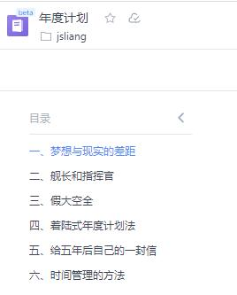
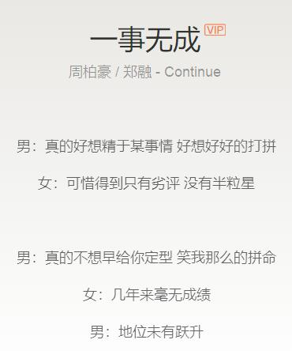
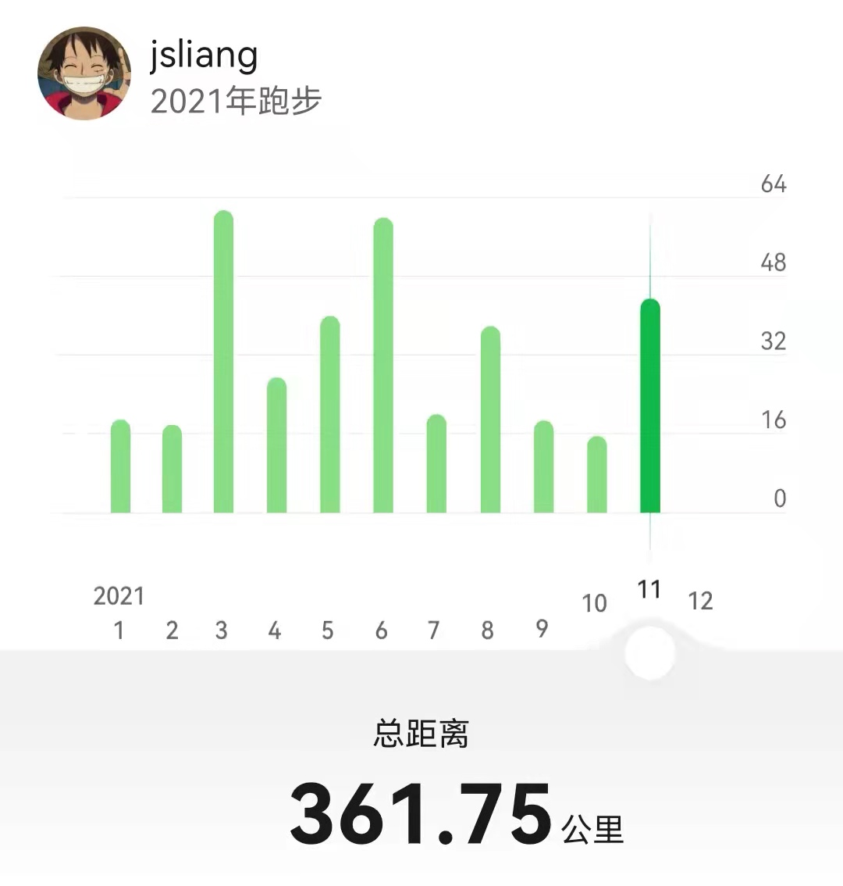
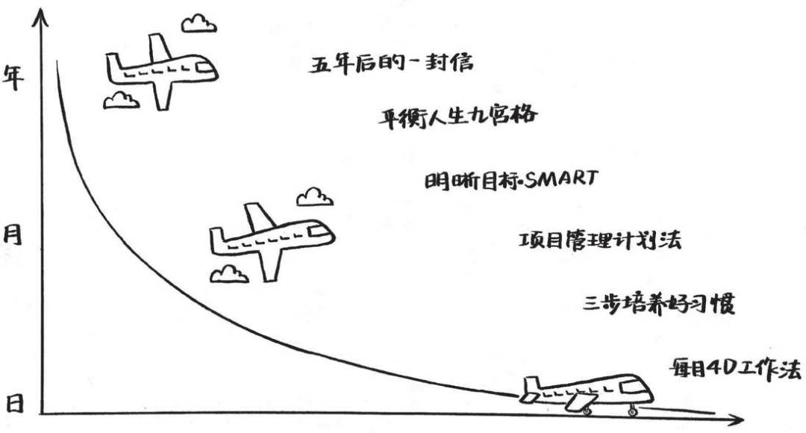
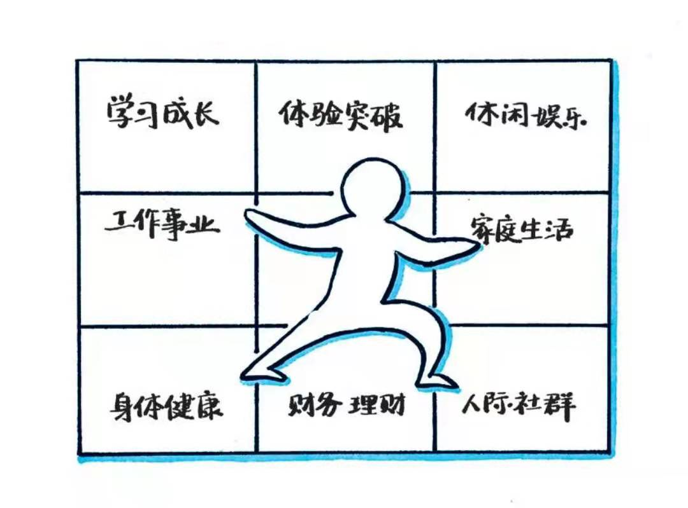

朝花夕拾 - 2022 年度计划
===

> Create by **jsliang** on **2021-11-29 21:30:44**  
> Recently revised in **2021-12-11 10:20:23**

2022 的年度计划有点早。

其实在 11 月初，我就开始在想 30 岁计划了吧：

根据当时看的书《只管去做 2021》，整了下《[年度计划](https://kdocs.cn/l/clrxxj2q6JfL)》。

还没整到一半，因为工作问题，需要支援其他开发组，所以搁置了。

> 支援过程中，可能懂的太少心里捉急，所以天天加班学习和写需求，于是计划就落下来了。

上一次更新文章时间还是 09.03 关于长隆旅游的（虽然 GitHub 上我一直有记录每天做了啥，但是流水式日志实在枯燥无比，枯寂的内心急需热火燃烧一把）

最近写完需求，又有精力继续折腾了，燃烧起了对未来的热情，那么就继续学起来并写下来吧！

## 一、给自己的前言 & 往事不堪回首

说来惭愧，其实 2018 年的时候，就开始在写 GitHub 的个人知识库（[LiangJunrong/document-library](https://github.com/LiangJunrong/document-library)）了，当时或多或少，会想到一点中年危机之类的（别问为啥当时 24 岁小伙伴就中年危机，问就是差点秃头），但是阅历始终是种硬伤，没有过重关注导致后面非常被动。

* 18 年忙着学习 H5、Vue 和整 ECharts 以及微信小程序，并准备第一次跳槽
* 19 年跳槽成功了（当时的《[搬家](https://github.com/LiangJunrong/document-library/blob/master/%E7%B3%BB%E5%88%97-%E4%B8%AA%E4%BA%BA%E7%94%9F%E6%B4%BB/%E5%A4%A7%E4%BA%8B%E8%AE%B0%E5%BD%95/2019/2019-03-22.md)》记录），但是可能进到的岗位，不是自己想要的吧，所以也很焦虑，于是天天刷算法，整理了《[系列-LeetCode](https://github.com/LiangJunrong/document-library/tree/master/%E7%B3%BB%E5%88%97-LeetCode)》
* 20 年 7 月开始裸辞复习，然后认识到自己的项目经验是有多么薄弱，但又无力补充，于是整到 20 年 11 月才跳槽成功（当时的面试资料我称为 jsliang 的八股文库《[系列-面试资料](https://github.com/LiangJunrong/document-library/tree/master/%E7%B3%BB%E5%88%97-%E9%9D%A2%E8%AF%95%E8%B5%84%E6%96%99)》
* 21 年就做了 2 件事，成功转正，谈到女朋友，除此之外，不敢造次

细细一品，就感觉非常失败，3 年半好像很忙，但是又好像啥都没做。

**钱没存到，人已老去**

吓得 **jsliang** 赶紧播一首《一事无成》听听：

当然，这几年也想过做很多事：

* [x] 整一个属于自己的知识库
* [x] 薪资翻番一次
* [ ] 旅游打卡全广东
* [ ] 精于一项技能（算法、锻炼……）
* [ ] 有 3 个以上睡后收入
* [ ] ……

可惜就是没有如果，没整好就是没整好。

而我也不会后悔，只是希望自己能根据当前状态，尽可能调整，尽力实现个人目标：

**任何事，都是开头容易，坚持很难**

说到这句话，就可以大倒苦水（水文章）：

* 失败的例子，可能就是算法的事情？很遗憾的就是没有乘热打铁，把自己对算法的认知梳理下来（半途而废，血亏大半年）。
* 成功的例子，可能就是每天坚持锻炼 3km？我的运动 APP 总跑步里程是 507.95km（2020-2021），然后今年的跑步总里程是 361.75（2021.1.1-2021.11.29）

其实，个人感觉，任何事，坚持下来，会收获很大的成就感，哪怕是上面的失败例子，也是我进行了长期打卡的，就只差最后一个里程：最终输出……

这些，就是 **jsliang** 相当于对 2021 的年度汇总啦。

当然，我知道，看到这里可能你会吐槽：就这？

虽然我也能给自己狡辩，希望找到更多的成就感，但是事实就是：

**并不是每个人的每年生活都是多姿多彩的，人人都希望成为何同学，但人人活成了大猛子**。

## 二、3 年小规划 & 给 30 岁的自己

这 4 年过得懵懵懂懂，但至少不敢忘本：

**知道自己想要什么，尤其重要**

* 你想去旅游，那么你要先有计划，特别想去哪个城市，然后计划哪天过去，于是就会有一系列操作
* 你想减肥，那么应该想的是没有小肚腩，体重控制在多少斤，所以你就会动起来，看看应该怎么整

既然想做一番事情，那么总会写下自己的憧憬：

* 《[朝花夕拾 - 给 30 岁的自己](https://github.com/LiangJunrong/document-library/blob/master/%E7%B3%BB%E5%88%97-%E4%B8%AA%E4%BA%BA%E7%94%9F%E6%B4%BB/%E5%A4%A7%E4%BA%8B%E8%AE%B0%E5%BD%95/2025/2025-03-31.md)》

> 图片来源于《只管去做 2021》，不做商用，侵权必删

这篇给未来自己的画大饼，篇幅有点长，就抽出来单独写了，希望自己的 5 个大方面有所长进，有所成就。

> **jsliang** GitHub 仓库小彩蛋：这篇文章的存放目录是 2025，“战略性文章”

工作 3 年多，曾经想要的很多，写出来的却很少。

但是写下来那一刻，仿佛将这些话刻到了心里，疼痛中带点期盼。

这就是我的 3 年小规划，你呢？欢迎吐槽~

## 三、2022 小目标 & 加油向前冲

既然上面已经明确了 30 岁的自己是怎样的，那么就要每年每年去实现。

2022 年的我想活成啥样子的呢？大概是这样吧：

> 图片来源于《只管去做 2021》，不做商用，侵权必删

* **生活**

* [x] 保持每天晚上 11 点到早上 7 点的良好作息习惯
* [ ] 「2d * 21」旅游打卡全广东
  * [ ] 熟练开车方便出行
  * [ ] 明确景点并前往
  * [ ] 将旅游 VLog 同步到各个平台
* [ ] 「1h * 150」每天 3km 跑步打卡，年度打卡时间至少 150/365 天

> 广东省有 21 个地级市，2022 年有 365 天，共 53 个周末，有 7 个基本是 3 天的节假日

[广东旅游](https://github.com/LiangJunrong/document-library/blob/master/%E7%B3%BB%E5%88%97-%E4%B8%AA%E4%BA%BA%E7%94%9F%E6%B4%BB/%E6%97%85%E6%B8%B8/2022.md)

* **技能**

* [ ] 制作 3 个系列的视频
  * [ ] 学习拍摄技巧
  * [ ] 学习视频后期
  * [ ] 旅游 VLog
  * [ ] 程序员日常
  * [ ] 游戏制作
* [ ] 「2h * 150」每天直播 2 小时，年度打卡时间至少 150/365 天

实现年度目标所需时间 ______，一年可支配时间 ______？

---

> jsliang 的文档库由 [梁峻荣](https://github.com/LiangJunrong) 采用 [知识共享 署名-非商业性使用-相同方式共享 4.0 国际 许可协议](http://creativecommons.org/licenses/by-nc-sa/4.0/) 进行许可。 基于 [https://github.com/LiangJunrong/document-library](https://github.com/LiangJunrong/document-library) 上的作品创作。 本许可协议授权之外的使用权限可以从 [https://creativecommons.org/licenses/by-nc-sa/2.5/cn/](https://creativecommons.org/licenses/by-nc-sa/2.5/cn/) 处获得。
