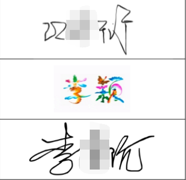

朝花夕拾 - 记一次抽奖活动全流程
===

> Create by **jsliang** on **2021-12-20 22:15:46**  
> Recently revised in **2021-12-20 22:15:46**

在这次的抽奖活动过程中，如果非要说让我眼前一亮的点，是一位小姐姐在进行电子签名的时候，用的签名非常耀眼：

第一眼感觉就是好炫酷（相对来说），因为别人的签字都是黑白的，只有她是彩色的！

本次使用工具：

* 金山表单
* 金山表格
* 金山文档
* bilibili
* 自己编写的抽奖页面

---

> jsliang 的文档库由 [梁峻荣](https://github.com/LiangJunrong) 采用 [知识共享 署名-非商业性使用-相同方式共享 4.0 国际 许可协议](http://creativecommons.org/licenses/by-nc-sa/4.0/) 进行许可。 基于 [https://github.com/LiangJunrong/document-library](https://github.com/LiangJunrong/document-library) 上的作品创作。 本许可协议授权之外的使用权限可以从 [https://creativecommons.org/licenses/by-nc-sa/2.5/cn/](https://creativecommons.org/licenses/by-nc-sa/2.5/cn/) 处获得。
