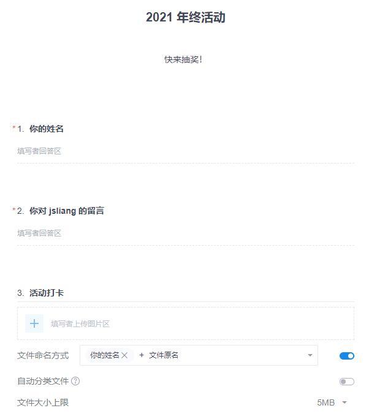
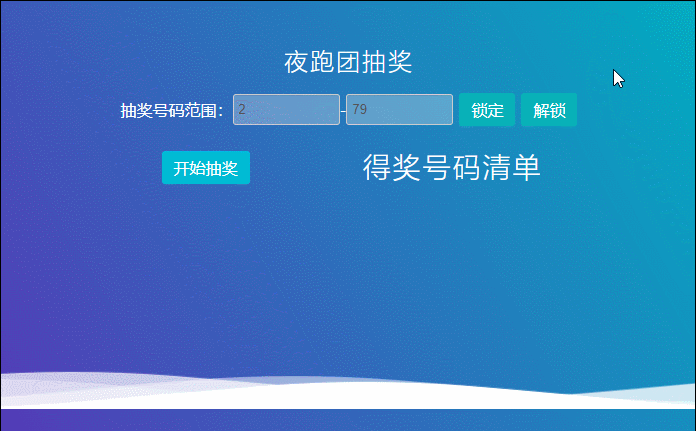
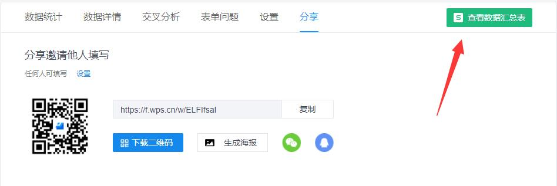

朝花夕拾 - 关于在编写抽奖活动文章中突然举办个人年度活动
===

> Create by **jsliang** on **2021-12-20 22:15:46**  
> Recently revised in **2021-12-21 23:51:35**

这不临近年终，很多公司都开始了各式各样的抽奖活动。

正期待公司年会的时候，刚好今年参加的公司社团，有个年终活动需要举办，又恰巧我有幸负责该活动的从 0 到 1 举办……

所以，就不安排一波，让自己过下中奖瘾？（诚信正直警告！！）

经过几天的安排，终于在 350+ 的社团群抽出了 50 位欧皇，细想了下这个活动举办的还不错，所以这里做下小总结~

本次活动主要流程：

1. 通过「金山文档-文档」进行活动内容描述
2. 通过「金山表单」进行数据收集统计
3. 通过「bilibili」进行抽奖直播
4. 通过「自定义抽奖网页」进行抽奖活动
5. 通过「必剪」进行视频编辑上传

欢迎符合下列情况的小伙伴参考：

* 即将举行年终晚会的
* 或者想参考下别人年终活动怎么耍的
* 或者想玩下抽奖页面过过瘾的

小伙伴们观看完后请尽情留下你的 **点赞评论**~

> 注 1：本文不做上述内容的基本教学，一个工具的使用应该由该平台介绍，会更具有感染力

> 注 2：**jsliang** 在这方面也在摸索，如果小伙伴想探讨一些深层次的内容，可以通过 GitHub 首页的联系方式找到我：https://github.com/LiangJunrong/document-library/

## 一 设计流程

### 1.1 活动内容的设计和数据的收集

首先，我们需要完成活动内容的设计和数据的收集，这就用到了金山文档今年新出的工具：**「文档」**

> 操作方式：登录 https://kdocs.cn，点击新建，弹框后点击文档即可

新建完文档，我们通过它提供的「模板」填写个「活动策划」，然后再搞个表单并将收集贴 贴到文档中即可：

> 操作方式：登录 https://f.wps.cn，点击新建，输入问题内容

这样，我们就形成了：

* 《jsliang 的 2021 年终活动》https://kdocs.cn/l/cmwrtroxyUfP

啊这……

其实是我写着写着的时候，突然发现上一次搞活动还是 2 月份了，意犹未尽所以顺手就写了个年终抽奖活动你信不信！

### 1.2 抽奖的设计和直播安排

在完成上面的步骤，并进行群聊 @所有人 的宣传后，说实话，我抑郁住了，为啥没人自愿写个抽奖页面！哭~

遭不住只好利用自己几天的下班时间，简简单单撸了个简简单单的抽奖页面：https://github.com/LiangJunrong/all-for-one/tree/master/033-%E6%8A%BD%E5%A5%96%E9%A1%B5%E9%9D%A2

这个界面由简单的 HTML、CSS、JavaScript 组成，未使用任何 UI 库和 JS 库。

设计初衷如下：

1. 支持指定范围的 Number 的抽奖。因为金山表单提交的数据，会形成表格，这样指定 Number 就可以抽出指定行的行数
2. 不允许 Number 重复出现。因为一个 Number 只能中一次奖，所以设计了如果抽奖重复就会重新抽奖
3. 尽可能好看点。这点给自己打 6 分，因为 **jsliang** 的 UI 做得真的不好！

这样，我们就有了个简单的抽奖页面，自己写的安全放心没毛病，有 bug 打死也不认就好。

接下来就是安排直播，这点咱们可以用上 b 站的预约直播，详细自己去找吧（当前正在直播没法描述）

最后在直播期间，根据根据用户提交的数据，我们对着抽奖即可！

至于直播详细的过程，我通过必剪稍微修饰后，提交到 b 站即可：https://www.bilibili.com/video/BV1Di4y1d712/

> 填写的表单可以直接在表格上查看到具体数据

> 另外如果想剪辑自己直播的内容，可以尝试用剪映、必剪等工具，如果要专业点的话可以尝试 PR、AE 等

## 二 让人眼前一亮的点

以上，就是我这次举行社团活动的简要流程啦，因为不喜欢铺开从基础的细细截图，所以有些内容简写掉了，如果有细节不太确定的小伙伴欢迎找我。

另外，记录下这次活动中让我眼前一亮的点！

### 2.1 签名

因为公司的活动奖励，需要签字签收的，所以当时用了表格的电子签名

然后在这次活动中，公司一位小姐姐的签名非常耀眼：

第一眼感觉就是好炫酷（相对来说），因为别人在表格上的签字都是黑白的，只有她是彩色的！

### 2.2 留言

在这次活动中，各式各样的留言让我啼笑皆非，但是有句话我觉得还是不错的，顺带送给在座的各位：

* 不是所有的人，都能当红花，必要的时候，让我这绿叶撑场也不错

就好比行业中的那么多的人，不是所有人都能成为大咖，但是留下自己的足迹，有自己一席之地，也是非常 nice 的~

---

> jsliang 的文档库由 [梁峻荣](https://github.com/LiangJunrong) 采用 [知识共享 署名-非商业性使用-相同方式共享 4.0 国际 许可协议](http://creativecommons.org/licenses/by-nc-sa/4.0/) 进行许可。 基于 [https://github.com/LiangJunrong/document-library](https://github.com/LiangJunrong/document-library) 上的作品创作。 本许可协议授权之外的使用权限可以从 [https://creativecommons.org/licenses/by-nc-sa/2.5/cn/](https://creativecommons.org/licenses/by-nc-sa/2.5/cn/) 处获得。
