朝花夕拾 - 3 Year 50 G 20 W
===

> Create by **jsliang** on **2023-01-24 11:28:35**  
> Recently revised in **2023-01-26 22:26:39**

我的故事，就在那里。

不管有没人看这一番平淡激情，不管别人是贬低还是褒奖，它一定会演完。

这个故事的主角，叫「jsliang」。

## 一 前言

生活是什么，生活就是一年到头，**不抽烟不喝酒也不咋出门消费**，回头一算啥钱也没挣着。

生活是什么，生活就是一望无垠，**活得小心翼翼但是总满眼期待**，踏实干活想着明天更好。

Hello 大家好，我是爱折腾的 **jsliang**，一名在一线奋斗的普普通通前端程序猿。

**2020-2022**，3 年，50 G 相册，20 W 存款，见证我的短暂人生片段。

**希望此时此刻，此故事，能分享给你不一样的精彩**。

**欢迎点赞评论，加好友，和你共见证每一天的成长**。

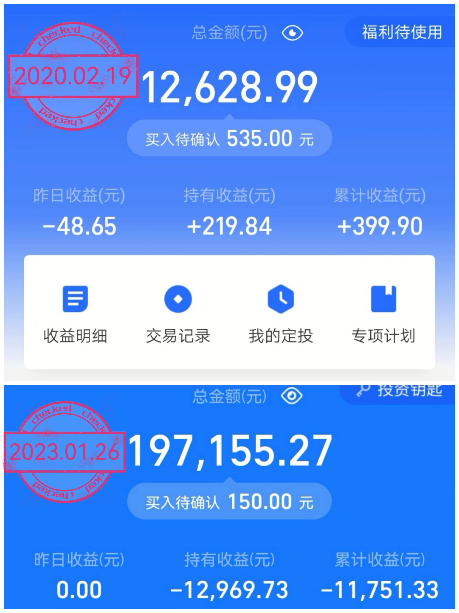

## 二 知道自己想要什么，尤其重要

**简述**：2020 年，裸辞，坐在创业园小板凳上，笑着个脸，电话跟外婆说能找到更好的工作……

### 2.1 起

2019.04.01，**jsliang** 入职了跨境电商 S。

* 那一天，是愚人节；
* 那一天，心情激动而期盼；
* 那一天，我穿着自认为得体的翻领长袖，和穿到 2023 年还在用的劣质外套；
* 那一天，身上沾满了昨晚紧张期待没注意到，睡了假棉绒被后，一身的小细毛。

“看那个新来的多勤劳”

虽然很忙，但很充实~

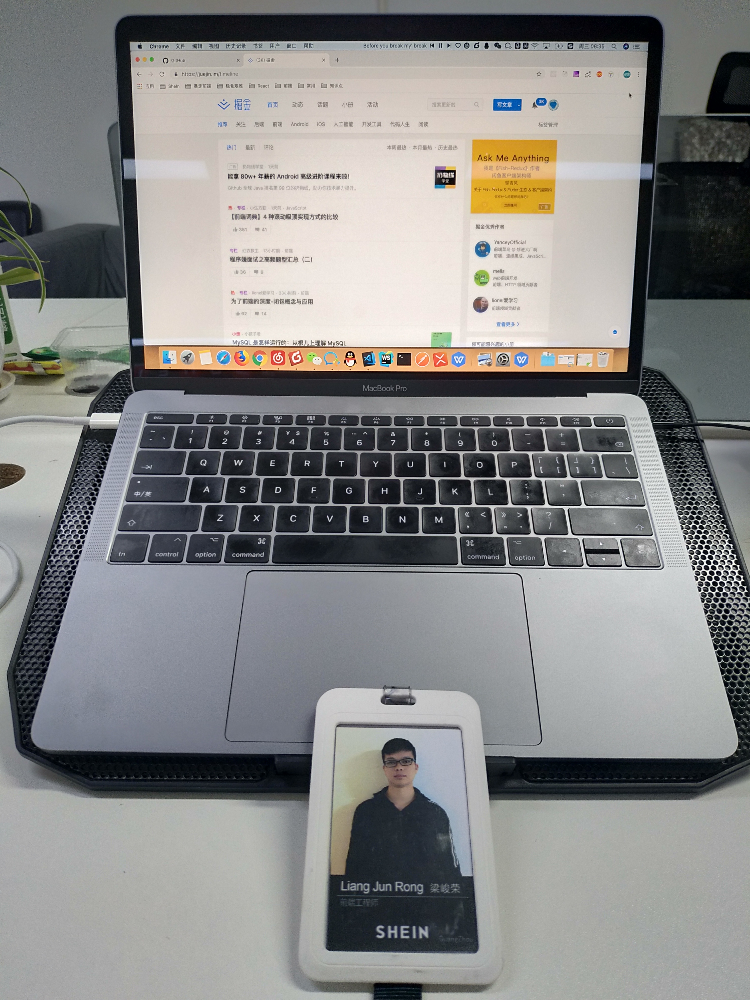

### 2.2 承

2019-2020，这一年，经历了很多事情。

* 这一年，我在哼次哼次写着后台管理系统；
* 这一年，我差点被杀鸡儆猴优化掉；
* 这一年，我嘴硬地和领导吵过架，和产品吵过架，和测试吵过架；
* 这一年，我由脾气火爆，到被教会了什么叫 “**工作不能带个人情绪**” “**产品测试说的都是对的**” “**你要好好努力才能有更好发展**”。

在 2020 年 7 月的时候，带着 **20 天调休假期**，惨淡收场，裸辞待业。

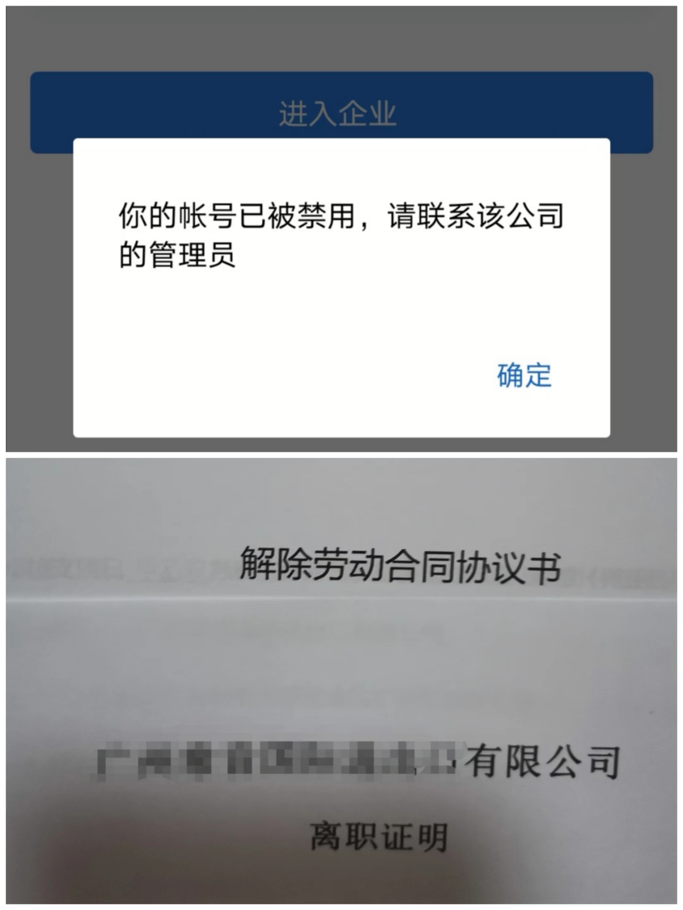

迷迷糊糊回来租房的时候，我没敢和任何一个亲戚说。

正如我没遵循父亲建议靠关系去尝试国企，而是稀里糊涂自己找了一份外包工作一样。

我有自己的想法。哪怕这个想法在现在看来是那么稚嫩。

但是，自己已经做的事，那就做了，扭扭捏捏不像样。

**知道自己想要什么，尤其重要**。

### 2.3 转

那时候的日子是煎熬的。

因为我裸辞后才知道，原来面试还有那么多弯弯绕，而我的技术，还不足于让面试官高看我一眼。

内心的煎熬，让我知道这不是一时半会的事。

是时，置顶笔记「月薪 13k 了吗？知道自己想要什么，尤其重要」

一直被我拿来说服自己：**他只不过是想让薪资更高一点，他能有什么错**。

无所谓，我会出手~

于是我开始了 “**海量**” 的计划，我尝试让一个无业游民的生活趋于平衡。

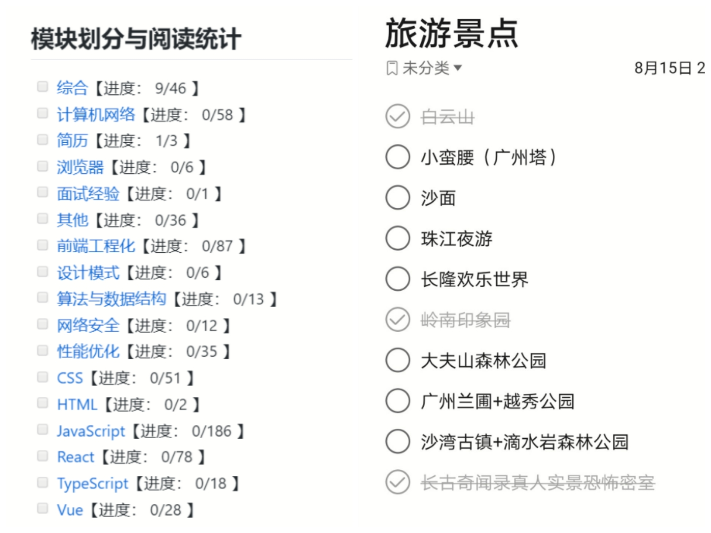

我成为了一枚 b 站 up 主，持续更新我的离职状态，以及我的复习计划：

> 账号已改名「jsliang95」

我也不断出门远行，向往诗和远方。

那是我第一次空闲地出门游完，第一次认真看一眼大学 + 毕业居住了 6 年的广州。

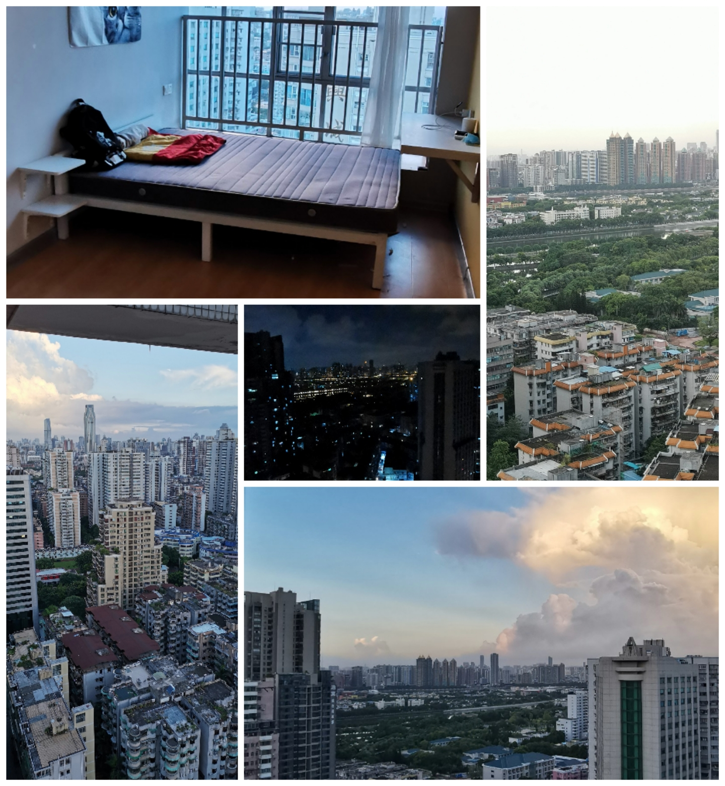

更多的，是经受来自各个平台的婉拒，经受一封封冰冷的邮件：

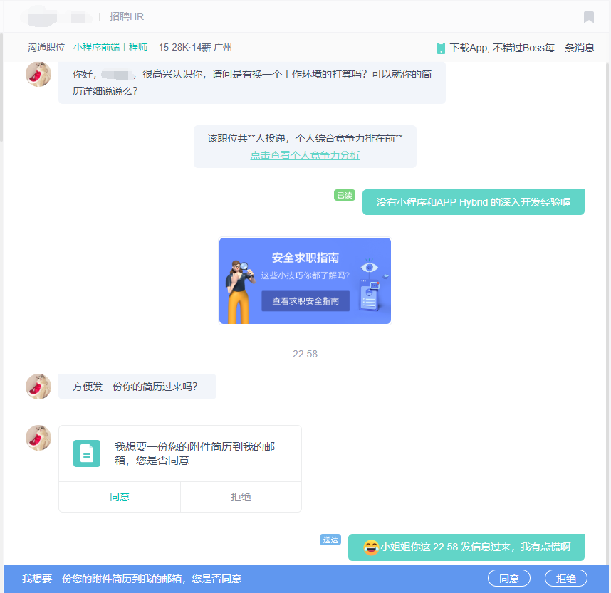

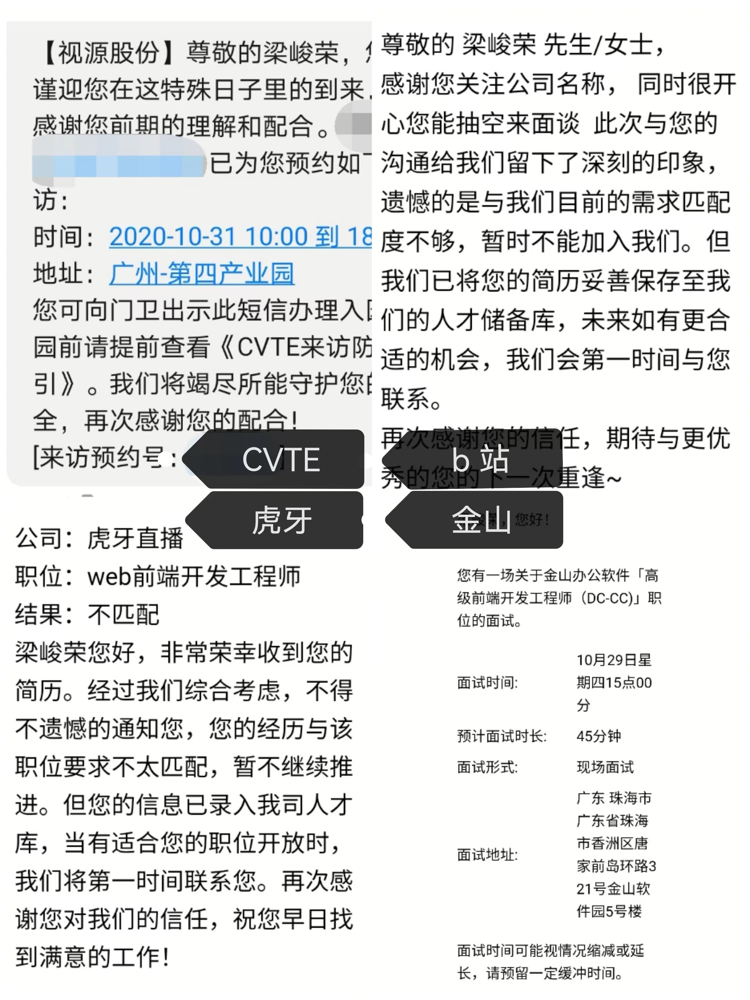

### 2.4 合

成年人得为自己的行为买单，哪怕你觉得事情可以挽回做得更好，哪怕那件事情明明就发生在昨天，发生在刚才。

「要有自信，你是最好的，知道吗？」

我知道，知道自己想要什么，尤其重要。

虽然我知道，最终入职的不是广州，而是换了个城市。

虽然我知道，再坚持下去，熬过 2020，等到 2021 招聘，可能会找到更好的。

但是，我挑战成功了，那，什么都不重要了。

—— 在珠海公交车站等待第 n 次异地现场面试的我如此想着

2020 的 5 个月裸辞，磨掉了我的暴躁。

也让我知道，如果找到了目标，那就去做。

不要犹豫，犹豫就会败北。

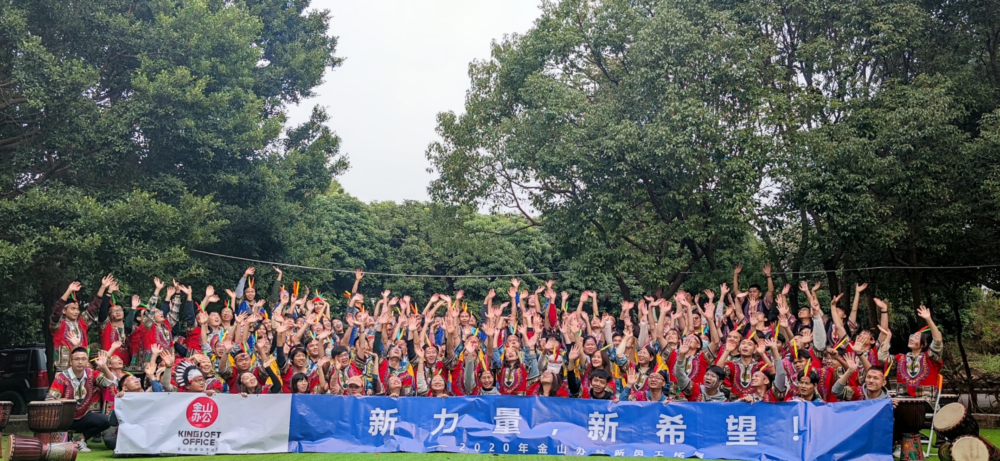

## 三 任何事，都是开头容易，坚持很难

**简述**：

2021 年，开闯！

我不努力，被辞退了就没法重新入职了~

只是想在互联网上，留下一个叫「jsliang」的记忆。

就好像那位叫「吴孟达」的演员，在我心里留下了他的精神痕迹。

### 3.1 听说有一场严峻的考核叫转正

金山的开场，就像珠海那从未停止的狂风，让我始终不敢原地逗留。

“**上一任坐你位置的，转正没过，你加油啊**”

—— 大佬如是说

那 2 个多月，我和 1 个测试以及 1 个运维小伙伴是真的有被吓到。

因为这很可能就是一个季度珠海金山游，转正审核不过就打道回府~

很庆幸的是，当时我很快进入了角色：

* 日常维护一些项目内容
* 新建知识库用以维护项目对外输出知识点

> WebOffice 知识库：https://wwo.wps.cn/docs

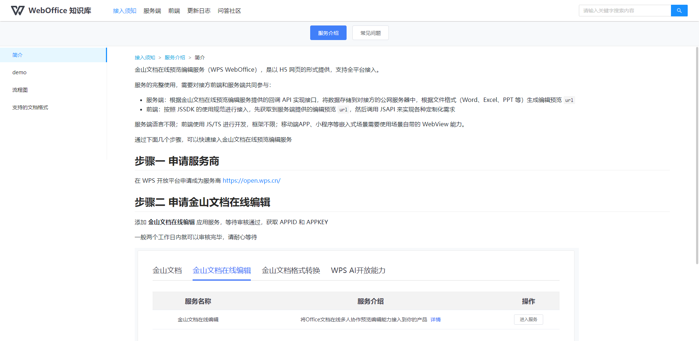

你很难想象，为什么一个程序员，能把文章写得那么顺畅，甚至能将一个知识库的 90% 文档补充出来。

更想象不到，是什么让他写篇文章跟喝水一样简单。

这个故事说来很长，长到从 2014 年说起。

那是一个高中文科毕业的小伙子，大学读了「信息管理与信息系统」，半文半理、又教代码又教管理学那种。

懵懵懂懂在毕业后拿着「管理学学士学位」，去一家小外包写 H5 活动页。

拿到第一个页面的设计稿支支吾吾，写到深夜 2 点多写不出来。

那时候，我知道，任性是要付出代价的。

任何事，都是开头容易，坚持很难。

* 你可以写下第 1 篇文章，却止步于第 100 篇文章
* 你可以跨出第 1 天跑步，却止步于第 100 次跑步
* 你可以混进第 1 家公司，却止步于那一场转正

> 感兴趣的小伙伴可以看看 《99 次成就挑战打卡》坚持多久，获得什么，花多久时间，等你来…… https://kdocs.cn/l/cot8BBHZqi7j

### 3.2 互联网时代你一片数据碎片都没有

2 月多，看到「吴孟达」去世的消息，当时较为震惊，从小看到大的达叔就这样离去了？

我知道，对于大多数人印象中来说，他是配角，只是 XX 电影的一个角色。

可我更知道，很多时候，我却连配角都算不上。

听别人说 XX 电影男主很厉害，我只能暗暗叹气，有多少付出心血表演的能在知名电影中当个跑龙套。

这个世界，很大。

但是，这个互联网世界，更大。

就像我一开始，要在 GitHub 搭建个人文档库一样，又何尝不是想在互联网上抛下自己的船锚。

* https://github.com/LiangJunrong/document-library

我不知道，这艘船能航行多远。

也不知道，它能载多少人上岸。

只管前行，莫论对错。

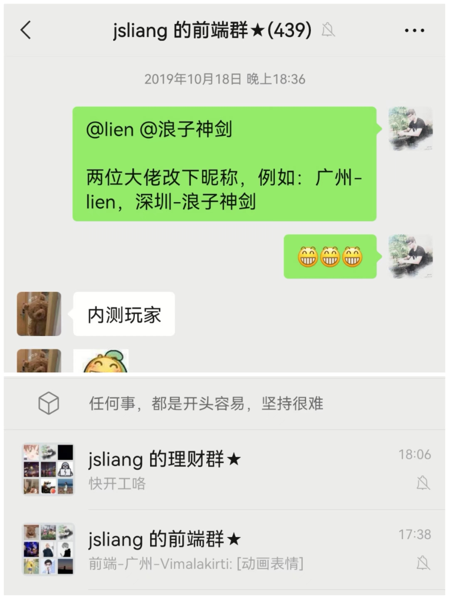

当我的文章开始影响到越来越多的人，当我知道我也开始能影响到同一辈，甚至下一辈。

我知道，我可以走更远。

我希望，我能影响更多。

在这个互联网时代，一定有一个数据碎片，叫「jsliang」

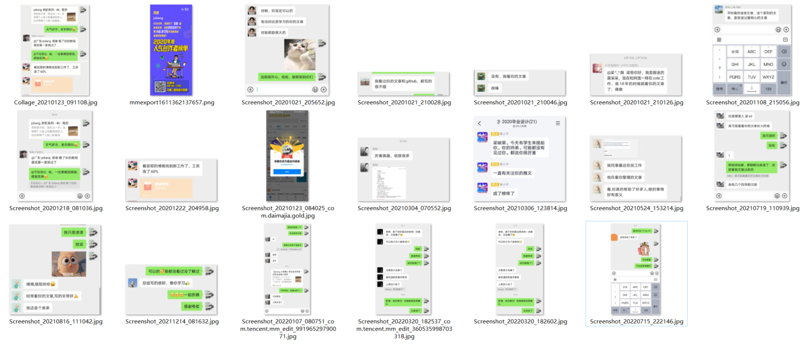

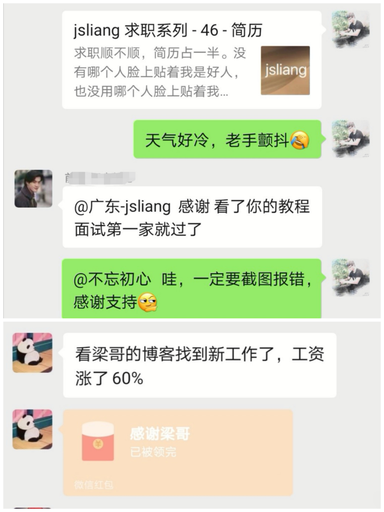

### 3.3 有个旮沓叫远方

2021 年的公司旅游，是去了云南大理和丽江。

而在大理洱海的那段日子，让我那么地痴迷。

为什么那旮沓的风景能更好看。

为什么那旮沓的房子让我羡慕。

这是什么神仙日子和生活节奏，从我过去那几天，我心里就是大写的放松。

**我找到了梦想中的居住地，找到了梦想中的房子标准**。

甚至在我给 30 岁的自己一封信中，我也表示第一个期盼就是房子：

* [朝花夕拾 - 给 30 岁的自己](https://github.com/LiangJunrong/document-library/blob/master/%E7%B3%BB%E5%88%97-%E4%B8%AA%E4%BA%BA%E7%94%9F%E6%B4%BB/%E5%A4%A7%E4%BA%8B%E8%AE%B0%E5%BD%95/2025/2025-03-31.md)

虽然距离梦想很远很远，但是 2021 年，我给自己的内心种了一个花园：

* 就是要这样的风景
* 就是要这样的房子
* 就是要这样的生活
* ……

哪怕，它真的不那么容易实现。

### 3.4 离职无法再次入职系列

这一年，很激情，也活得很精彩。

任何事，都是开头容易，坚持很难。

难以想象积累的笔记到现在都还没整理完：

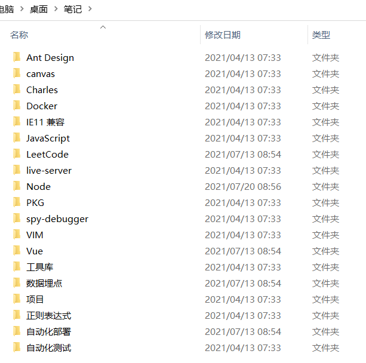

因为那时候我知道，离职了就无法再次入职了。

从 2020 年入职到现在就过了半年，发现入职门槛已经到了一本。

> 19 年珠海金山招聘条件非常低（听说是个人就行），20 年我入职的时候提高了，21 年更高了到一本，22 年非重本难进来了……

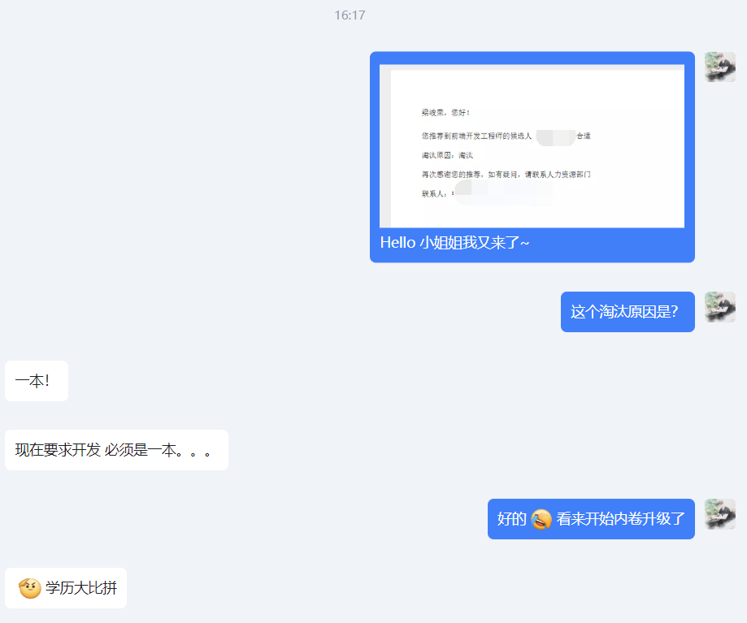

所以，很多时候，你的内卷，你不敢停下，因为 “人才” 越来越多，简历、能力比拼越来越严重。

## 四 做得好不好，时间会给你答案

**简述**：

2022 年，摆烂，公众号停更，分手，人生迷茫，技术迷茫。

做了很多事，又好像没那么多事。

时间给了我答案，很多在 2018/2019 年知名的博客、掘金、公众号作者，逐渐淡出视野。

我呢？是不是也会逐步落寞……

### 4.1 繁花落叶，兴衰一念间

这是 2022 年刚开工没多久的我：

这是 2023 年对 2022 年的总结：

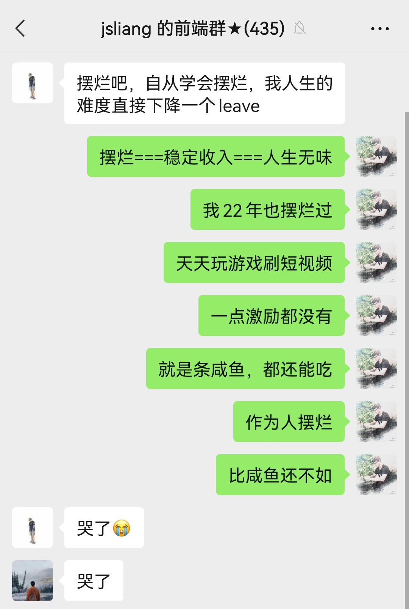

**当一个人说自己没事的时候，ta 一定有事，只是不想跟任何人分享此时此刻的酸甜苦辣**。

繁花落叶，没有谁能留着住时光流逝，但精神寄托的流逝确实让人伤感。

而那个最笨的人，居然会以为将精神寄托到工作会让他有所振奋。

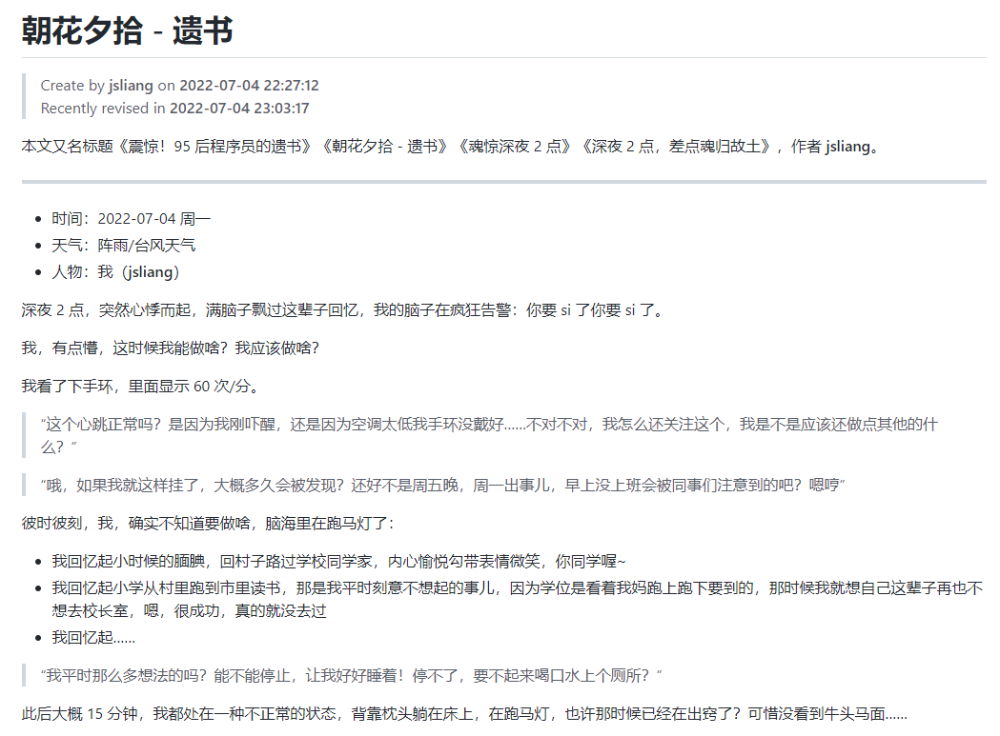

> 再次告诫关注 **jsliang** 的小伙伴们和正在看文章的你，注意身体健康，早点休息，加强锻炼

### 4.2 做自己的摆渡人

吃饭、睡觉、打豆豆；

游戏、小说、短视频；

那艘摇摆不定的船，开始漏水了。

但他，仍不想去修理，反而想转移到其他船喘息。

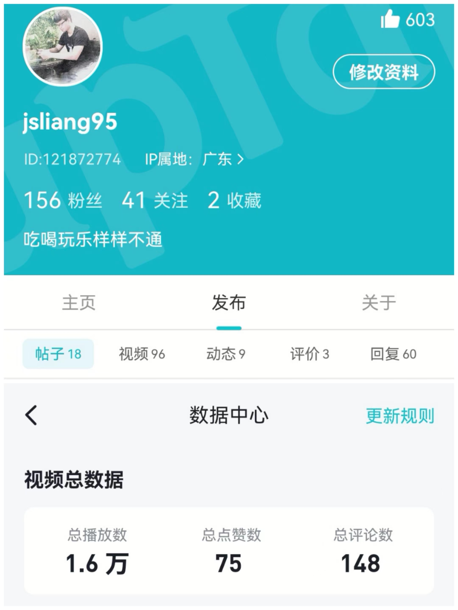

然而注定了他不是天生的败家仔，因为哪怕败家，他也不敢挪一份钱潇洒。

他只是累了，累的有点疲惫，不仅仅是因为爱情，更因为是事业。

很多时候，他在渡人；但更多时候，他更要渡自己。

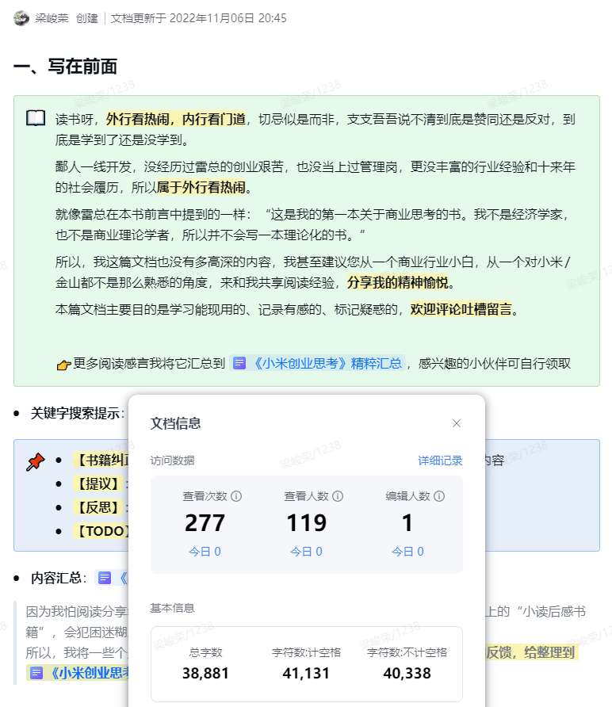

没有人会一直沉沦，除非他心里在逃避。

既然逃避不了，那就去做，自信地去做好那件事。

做得好不好，时间会给你答案。

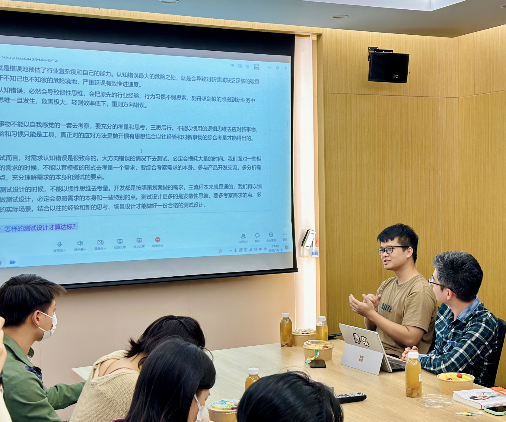

---

**不折腾的前端，和咸鱼有什么区别！**

觉得文章不错的小伙伴欢迎点赞/点 Star。

如果小伙伴需要联系 **jsliang**：

* [Github](https://github.com/LiangJunrong/document-library)
* [掘金](https://juejin.im/user/3403743728515246)

个人联系方式存放在 Github 首页，欢迎一起折腾~

争取打造自己成为一个充满探索欲，喜欢折腾，乐于扩展自己知识面的终身学习斜杠程序员。

> jsliang 的文档库由 [梁峻荣](https://github.com/LiangJunrong) 采用 [知识共享 署名-非商业性使用-相同方式共享 4.0 国际 许可协议](http://creativecommons.org/licenses/by-nc-sa/4.0/) 进行许可。 基于 [https://github.com/LiangJunrong/document-library](https://github.com/LiangJunrong/document-library) 上的作品创作。 本许可协议授权之外的使用权限可以从 [https://creativecommons.org/licenses/by-nc-sa/2.5/cn/](https://creativecommons.org/licenses/by-nc-sa/2.5/cn/) 处获得。
