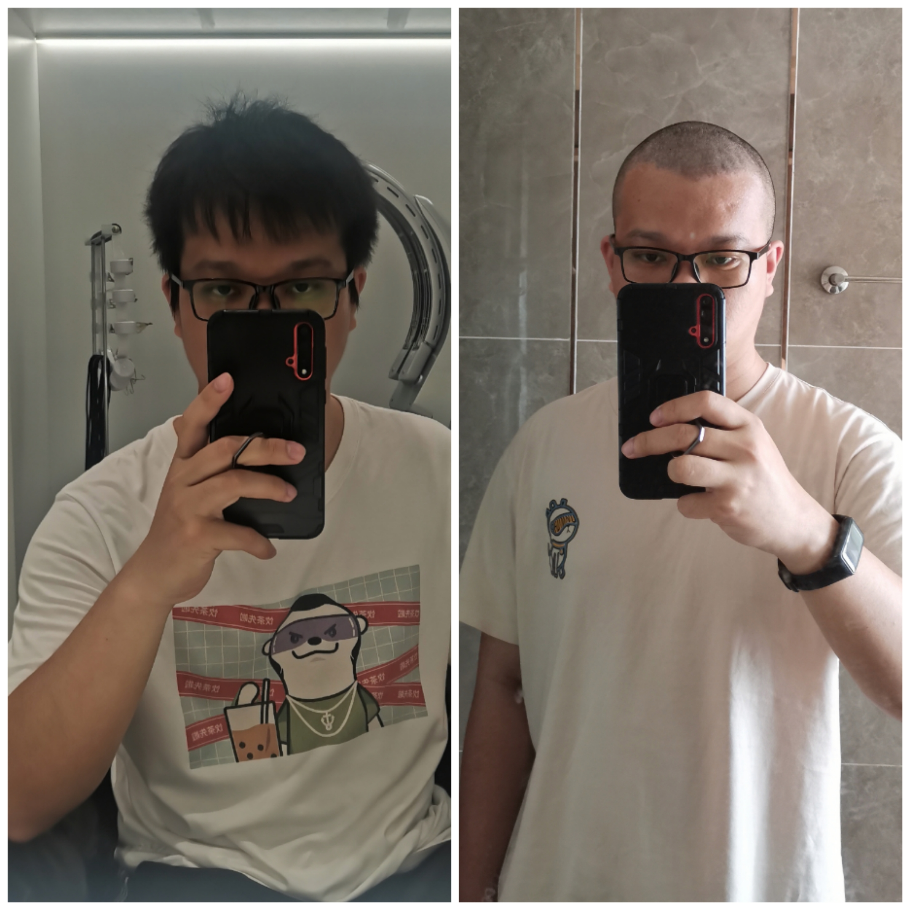
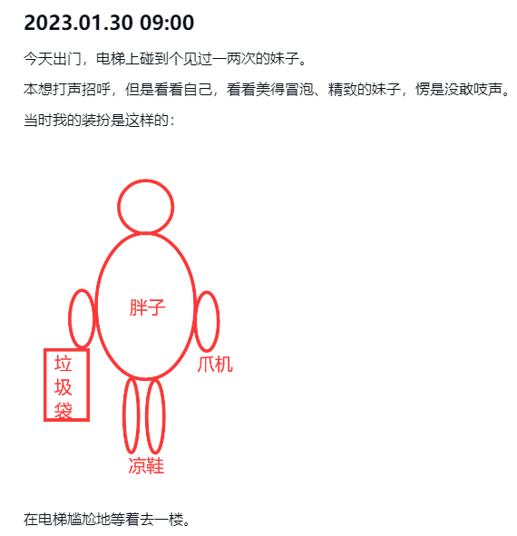

朝花夕拾 - 卷王的自白（光头祭天，法力无边》
===

> Create by **jsliang** on **2023-04-10 22:18:10**  
> Recently revised in **2023-04-15 12:45:12**

## 一、震撼开场

做一个卷王 ta 有什么错，无非就是 ——

「秃」了那么一点点！！！

咳咳咳，一一回复：

* 自愿的
* 没有想不开
* 没有考到寺庙
* 心态正常
* ……

如果非要给这次的行为贯穿一个理由，那就是「下周四就 28 岁了」「头发长长太快想凉快点」！

## 二、“正文”

Hello 小伙伴们早上、中午、下午、晚上和深夜好，这里是 **jsliang**~

鸽了近一个月，终于能恢复正常作息，和小伙伴们一起折腾、聊天吹水、学习啦！

当然，这次我想在 **jsliang** 的「朝花夕拾」频道，和小伙伴们聊的，不仅仅是鸽了的这个月的内容。

更多的，咱们要从年初，乃至年前聊起。

虽然可能会聊到很多内容，但是咱们尽可能长话短说！

1. 这几个月怎么过来的？
2. 你觉得有意思的事情是什么？
3. 你觉得很失败/颓的事情是什么？
4. 这几个月发生的事情有哪些让你关注的？
5. 后面想做啥事情？

## 三、话痨小剧场

本篇图文尽可能不涉及技术等硬通货，纯粹想聊天吹水交朋友，感兴趣的小伙伴可 + VX： Liang123Gogo 或者关注公众号 「飘飞的心灵」

> 朋友圈每天更新丰富内容哦~

### 3.1 这几个月怎么过来的？

从 2 月过完年回来后，996 甚至偶尔 997 呀，然后喜提「卷王」称号。

大概故事线就是：

1. **jsliang** 想挑战下自己
2. 然后转开发组，挑战新项目
3. 不巧作为几年老开发，评估需求失败，3 周的需求，愣是做了 10 周
4. 于是「自愿」加班，顶着压力 996 乃至 997

Q：你干嘛哎哟！这么一说这几个月可歌可泣的故事，你一点都没体现啊！

A：这你就不懂了吧，这里不说的简单点，小伙伴们怎么往下看~

### 3.2 你觉得有意思的事情是什么？

这几个月感觉蛮有意思的事情，大概有那么几个。

**首先**，能学到一些没玩过的技术啦！

对于一些「浅薄」的技术，我总是那么沉迷，比如这一次学习了：

1. Formily。阿里面向中后台复杂场景的表单解决方案
2. Slate / tinymce。这 2 款不同的富文本编辑器，一种是 React，一种是 Vue，在 2 个不同项目都接触了

**然后**，就是对旧知识的巩固啦！

没错，就是你 React Hook~

有一说一每次写 Hook 我都很沉迷

—— 为什么这个组件多次渲染，为什么这个组件又不渲染了！

回头写一篇小作文吧，在这里吐槽占篇幅太大了。

**接着**，就是对升华身心的一种挑战。

这几个月被大佬吐槽过能力不行、需求管理没做好；

这几个月碰到过技术问题，经常辗转反侧想不通；

这几个月熬夜有点多，脸色蜡黄黑眼圈……

不过还好，每天坚持跑步和跟小伙伴吐槽，让我挺过来了，很有意思，下次别喊我体验了，哈哈~

**最后**，就是通过直播、发视频、写文章认识了更多的小伙伴。

现在 VX 有 2000+ 好友，距离 30 岁的 5000 好友又近了一步！

不同小伙伴让我认识了世界不一样的精彩~

### 3.3 你觉得很失败/颓的事情是什么？

这个算糗事集合了吧哈哈~

**Round 1**：

小丑鸭碰到白天鹅的尴尬~

**Round 2**：

如 3.2 所说，因为瞎排期，明明做了 10 周的需求，被我在需求稿上写成了 3 周。

然后，我就被骂了哈哈哈，没人撑我，甚是失败。

当时有想过跑路……

**Round 3**：

赚的钱还是那么卑微而少，但是肉眼可见爸妈年轻不再。

有时候会迷茫啥时候能回家买地皮自己起楼，2023 年的机遇我到底抓住了没有。

以上，简单说说 3 件印象比较深刻的，后面有更多失败和令人颓废的事咱们再唠嗑唠嗑~

### 3.4 这几个月发生的事情有哪些让你关注的？

有 2 个：

* 人工智能
* 前端已死

当时本来想蹭热度去写写，后面自己把自己说服了，按表不发，等后面逐个打通（如果有小伙伴感兴趣听我吐槽的话）

目前只能说保持对这 2 个话题的关注，提升自己对这 2 块相关技能的学习。

其他的，慢慢来啦，咱走个长期攻略。

### 3.5 后面想做啥事情？

先补全一些遗憾：

* [ ] CSS 系列更新到第 8 篇（当前第 5 篇，尽量补充几个实用性的）
* [ ] 出门旅游 1 次
* [ ] 补充文章+视频：人工智能
* [ ] 补充文章+视频：前端已死
* [ ] 恢复每日晚上 9:00-11:00 的直播

长期上，可能会关注一下「自由职业」和「独立能力」，毕竟真不能想象自己还能在一线做开发多久~

那么，就酱啦！

周六下午要加班，晚上我会把剃光头的视频和本期内容整合成一个小视频，晚上回去直播，欢迎关注光头前端！

See you tonight~

---

**不折腾的前端，和咸鱼有什么区别！**

觉得文章不错的小伙伴欢迎点赞/点 Star。

如果小伙伴需要联系 **jsliang**：

* [Github](https://github.com/LiangJunrong/document-library)
* [掘金](https://juejin.im/user/3403743728515246)

个人联系方式存放在 Github 首页，欢迎一起折腾~

争取打造自己成为一个充满探索欲，喜欢折腾，乐于扩展自己知识面的终身学习斜杠程序员。

> jsliang 的文档库由 [梁峻荣](https://github.com/LiangJunrong) 采用 [知识共享 署名-非商业性使用-相同方式共享 4.0 国际 许可协议](http://creativecommons.org/licenses/by-nc-sa/4.0/) 进行许可。 基于 [https://github.com/LiangJunrong/document-library](https://github.com/LiangJunrong/document-library) 上的作品创作。 本许可协议授权之外的使用权限可以从 [https://creativecommons.org/licenses/by-nc-sa/2.5/cn/](https://creativecommons.org/licenses/by-nc-sa/2.5/cn/) 处获得。

