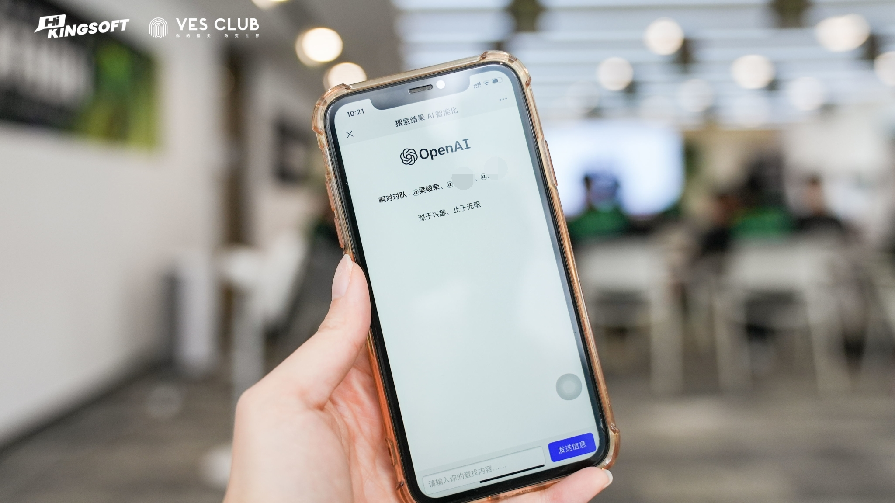
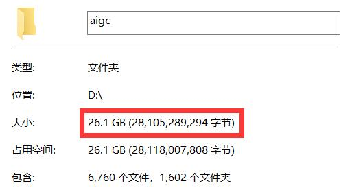
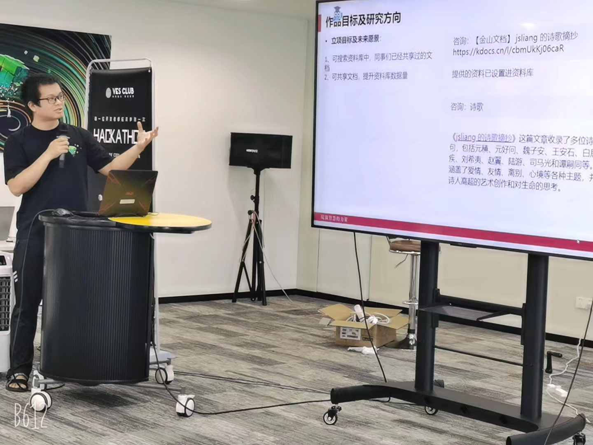
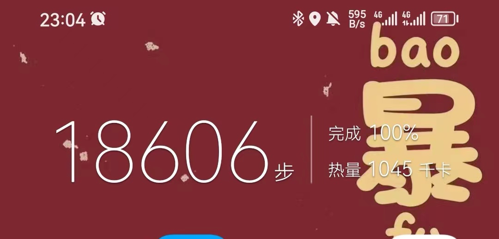
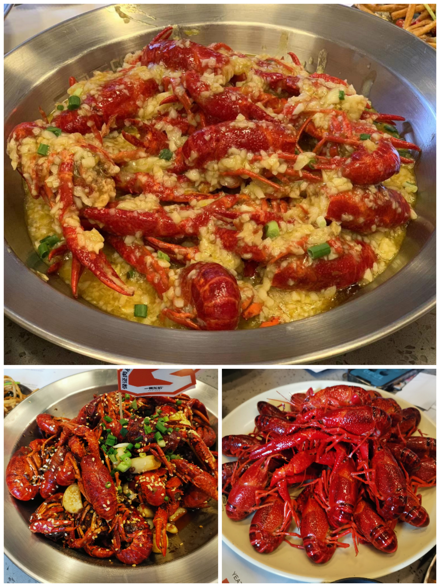
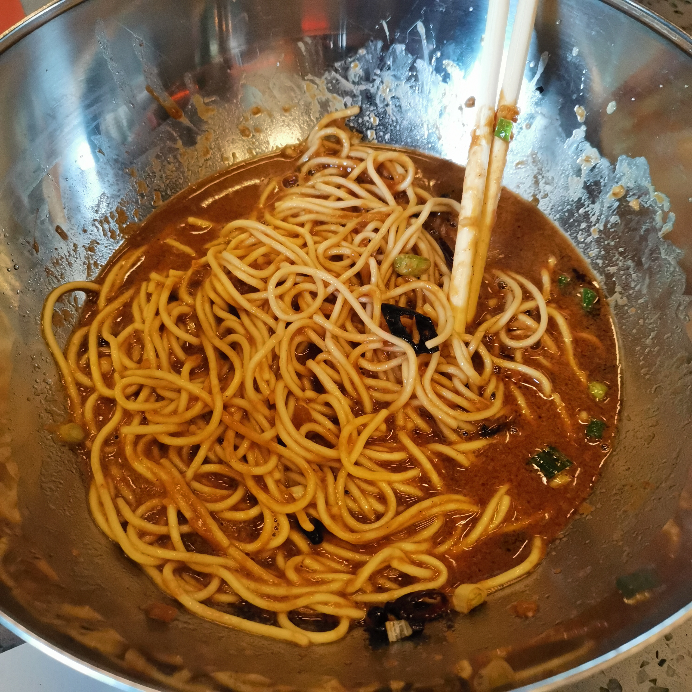

朝花夕拾 - 编程马拉松！Coding 40h，着手 AI 展望未来
===

> Create by **jsliang** on **2023-07-09 22:02:56**  
> Recently revised in **2023-07-09 23:19:34**

眼看时间已过半，回忆唏嘘难忘怀。

Hello 大家好，我是爱折腾的前端工程师 **jsliang**~

2023 过得很快，眼瞅着加加班已去大半年，一边恨自己没赶上今年大热门，一边蒙头睡觉恢复体力并感叹精神不如初。

在我以为潮流箭步离我而去的时候，突然发觉还有机会！

公司的青年工程师俱乐部（简称 YES Club），在武汉组织了一场以 AI 为主题的编程马拉松比赛。

我作为举办方苦力和参赛选手，在 07.07-07.09 加入了这场为期 40h 的编程比赛中！

> 比赛会场

## 一、没有搞不定的需求，只有满足不了的条件

这个需求很简单，怎么实现我不管~

> 参赛项目

在这次比赛中，为了上图这么一个小小的框，咱也算是绞尽脑汁了：

* 报！GPT4All 倒下了
* 报！百川装包一直报错
* 报！prompt 训练问题多多
* ……

当昨天奋斗到凌晨 1 点，看着我队友疲惫的双眼，我感觉人都麻了。

在队伍清一色前端的情况下，真正感觉自己一无所知没太大贡献，在咨询队友也没理解一些知识点后，四处请教其他选手大佬和俱乐部大佬：

* 为什么要用 Python，Python 怎么耍，能用 Node.js 么？
* prompt 训练怎么玩
* 模型如何微调
* 有哪些好用的中文模型
* ……

每天做的事就是搜索资料、搜索资料、还是搜索资料！让一个小白在短短 40 个小时从 0 到 1，感觉填鸭式都不够的~

在付出 26.1G 的硬盘后，终于搞定了这次比赛！

万分庆幸今天不是拿着 PPT 进行干巴巴地演讲，而是给自己的项目打上一个 100% 完成。

> 项目

但是，我感觉这仅仅是一个开始，因为真的有太多的 idea 深深刺激着我。

在演讲的时候，脑子想着这次比赛还是不够完美的，怎样进行一个补充完善：

> 演讲

## 二、武汉逛吃逛吃

这次是第一次办公出差，也是第一次来武汉，谈谈逛吃初印象：

> 逛

> 吃

这方面以 07.08（周六）最为体现，那一晚走了 1.9w 步，吃了 3 种不同品类小龙虾，还有貌不进人但确实好吃的凉面。

倒是可惜的是没吃过一碗热干面，时间都共享给 Coding 了！

还有个蛮有意思的现象，就是吃了 3 顿大餐，顿顿都有卤毛豆，问了下好像刚好赶上季节的缘故。

## 三、小结

在这次比赛中收获很多，充实且有意思。

后续也会投入一小部门精力继续关注今年的这波小浪潮发展。

在出差前特意问熟悉 Midjourney 的小伙伴要了些参考资料，回头也了解下智能绘画这块相关的。

那么，这次比赛到此就划上小句号了，充满期待，看向明天。

---

**不折腾的前端，和咸鱼有什么区别！**

觉得文章不错的小伙伴欢迎点赞/点 Star。

如果小伙伴需要联系 **jsliang**：

* [Github](https://github.com/LiangJunrong/document-library)
* [掘金](https://juejin.im/user/3403743728515246)

个人联系方式存放在 Github 首页，欢迎一起折腾~

争取打造自己成为一个充满探索欲，喜欢折腾，乐于扩展自己知识面的终身学习斜杠程序员。

> jsliang 的文档库由 [梁峻荣](https://github.com/LiangJunrong) 采用 [知识共享 署名-非商业性使用-相同方式共享 4.0 国际 许可协议](http://creativecommons.org/licenses/by-nc-sa/4.0/) 进行许可。 基于 [https://github.com/LiangJunrong/document-library](https://github.com/LiangJunrong/document-library) 上的作品创作。 本许可协议授权之外的使用权限可以从 [https://creativecommons.org/licenses/by-nc-sa/2.5/cn/](https://creativecommons.org/licenses/by-nc-sa/2.5/cn/) 处获得。

