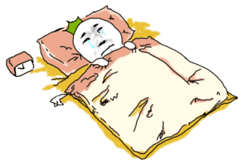
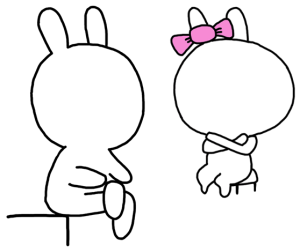
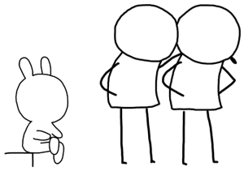
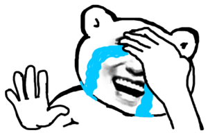
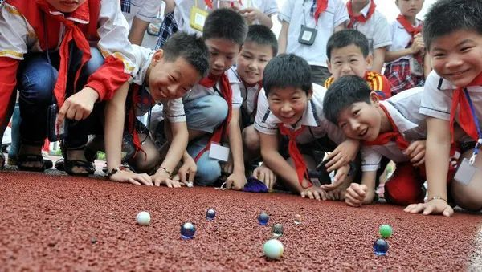
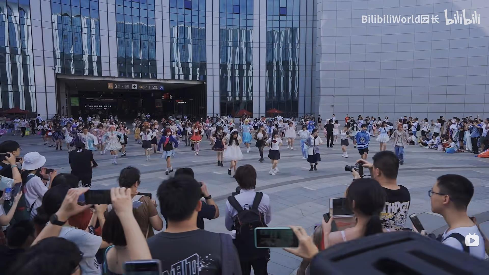

朝花夕拾 - 病态打工仔
===

> Create by **jsliang** on **2023-07-31 22:12:39**  
> Recently revised in **2023-08-05 18:22:14**

我大抵是病了，看着简陋的项目，望着清淡的用户，眼眶浮现灰蒙蒙的暮气。

周末瘫在家里就是 2 天，关闭微信、关闭企业 IM，不想回复信息。

机械地点着游戏广告，看着千篇一律套路、打怪升级大结局的小说。

奇怪，为什么焦虑但不行动，抑郁却无法治愈，是怎样的魔力让人心绪低迷。

## 一、打工只是兴趣，珠海买不了房

* 项目更换了全新皮肤、新增了 AI 等新能力、补充了炫酷交互 —— 好耶！
* 日常学会了烹饪方式、调整了生活作息、看到了有意思风景 —— 好耶！

披着晒得黑里透黄的皮肤，散发着阳光的温暖，再靠近一点就融化~

* 「有一说一 你的性格太好了 你爸妈怎么培养的你啊 很阳光」—— 同事邓
* 「受大佬感染，我 99 天打卡跳绳，坚持到 19 天啦！」—— 同事那

打工只是兴趣，珠海买不了房。

打工已经够累了，生活应该要开心有趣呀！

再待久一点，估计大老板会盯上我，这家伙怎么感觉哪个群都有他，纯纯反工作社畜人士！

but~

最近我的小伙伴「阿伟」找到我，说分手几个月后，不知道活着的意义。

当晚和小伙伴微信通话半个钟，就我故事和亲身经历，尽自己能力给了建议。

## 二、相遇是种缘分，时间沉淀感情

原谅 **jsliang** 少得可怜的拍拖经验~

* 高一聊了一个女孩，手都没牵，当网恋聊了 2 个月分了
* 大一聊了一个女孩，谈一学期，然后因为家境差异问题分了
* 21 年聊了一个女孩，谈了不到一年，因为女方想专心考研分了

敲完这几行我鸡皮疙瘩起来了，怎么越看越像，传说中妥妥的老实人模板！

最近不管是父母，亦或者同事朋友，零零散散给我介绍过优秀的靓女。

* 「你到底想找什么类型的！家境好？性格好？相貌好？」
* 「小梁，你要老婆不要？你要老婆，只要你开金口，我等会就给你送来。」

也许我这 95 憨憨笨猪真的想明白了？

我告诉他们，我想随便找个能看我顺眼的、能跟我唠嗑的、能过日子的。

碰到每次过几天才回复，每次聊天时的敷衍，让我这话痨都能被噎地沉默的小伙伴，我感觉那是一种精神折磨。

相遇是种缘分，时间沉淀感情。

正如上一任一样，在时间的流逝下，逐渐 “无话题” “慢回复” “0 商量”，也许分别是一种最恰当的安排（虽然后面我也很难释怀）

让这感情随着时间沉淀发酵，让浓香弥漫一生？

## 三、轻生不是选择，温暖无处不在

我和家妹都是半吊子的留守儿童，从小就在舅舅、舅妈家寄住，快初中才被父母接到市里学习生活。

家妹小时候，让我印象深刻的是她突然不想上学，那时候母亲辞工回来陪了一阵子。

而我，**jsliang**，一个甲状腺病患而已~

小时候，莫名其妙被发现很能吃，就是那种一碗白米饭，不需要任何饭菜，库库干几碗那种。

懵懂中知道自己患了传说中大脖子病（虽然一直就没大脖子过），然后每个月跟着我叔，去抽血化验和拿药。

也许那是对幼小心灵的一个折磨？

* 「是不是可以从医院上跳下去一了百了，真的好累」

> 写这一段我愣了 10 分钟，找到了那种黑暗笼罩的恐惧

导致这种问题的，现在总结起来，因素有 3：

1. 从村里出来后，不知道怎么结识城里的小伙伴，他们会不会看不起我，我家可是租房的
2. 病秧子，虽然看起来活蹦乱跳，但是每个月要抽血化验吃药，要花钱
3. 不知道怎么跟爸妈和亲戚说，小时候不懂沟通

哪怕时至今日，有时候会想到跳楼，也有这一块的阴影。

but~

怎么治愈的？嘶，让我想想，让我再想想：

* 是十几年一直碰到友好的同学，一直感受青春的欢乐，没有经历校园霸凌这些？
* 是那破自行车的快乐，骑着它走过老城区的大街小巷，和家妹在马路上狂飙？
* 是做一个显眼包，在课堂上疯狂举手发言吸引老师和同学注意？
* 是看多了医院的伤别离，希望自己不会这样子？最后一次治疗甲状腺，那个热心的阿姨，看我犯困跟我唠嗑的帅样子
* 是跟着老爸，为了供我读书，取出 2w 现金的学费，拎着袋子走在大街上的那种感动和骄傲？
* ……

写着一段我可耻地眼睛进沙子了，原来阳光温暖一直都有呀~

> 哭完眼红了笑死

## 四、受挫只是一时，生命音乐节奏

不习惯说别人的问题，咱谈谈自己的受挫：

* “你什么时候能沉稳一点，熟悉你的人知道你人好，不熟悉你的觉得你轻浮” —— 啊？
* “你的专业技术还不够，应该多看一下架构相关内容，方便升职晋升” —— 啊？
* “你什么时候成家立业，老大不小了” —— 啊？

啊~啊？啊！啊……

回收前言中的颓废状态，这几周真的很颓。

似乎，有一种「成长」的烦恼，越来越近了。

又或者，叫「中年危机」？

老一辈吃过的盐，要开始撒在我伤口上了~

逃不掉、避不开，只能面对。

OK，坐好、站直，好好想想！

### 4.1 生命歌单

在经过 2 周的颓废、沉默、低迷状态后，在每天跑步思考生命中，在今天编写文章的时候，听的歌曲：

* 习惯失恋 - 容祖儿
* 我的回忆不是我的 - 海鸣威
* 孤雏 - AGA
* 小问题 - AGA
* 错位时空（粤语版） - 三本目/关小甜
* 一生有你（粤语版） - 贝贝帅
* 总有你鼓励 - 左麟右李
* 死性不改 - Boy'z/Twins
* ……

将你的情绪逐个 pick 起来，让我康康都坏了哪些！

### 4.2 寻找快乐

如果你心绪还是低迷，下面的活动可以尝试下：

* **跑步**：见证落日、见证四季变换、流自己的汗，发泄自己的情绪

* **校园**：见证青春、见证生命活力、看人生欢乐，共鸣璀璨的生命

* **漫展**：见证热闹、见证年轻心态、看生命演绎，体会快乐的群体

* **医院**：见证命运、见证生离死别、走一遭百态，感受人生的难得

* **旅游**：见证伟岸、见证山山水水、走一遭人间，感受自然的风光

### 4.3 我的节奏

也许，幸运女神很忙，并不会眷顾每一个勤奋的人。

努力只是一种凭证，命运的枷锁很难突破。

昨天和一位认识好些年的同事唠嗑，才感觉到，自己又要折腾咯~

但是，这才让人生更有趣呀！

配合之前做的一系列小尝试，整起来吧~

## 五、小结

写这篇文章的初衷，其实是希望分手后抑郁了的小伙伴，能走出阴影迎接阳光。

> 小伙伴加油呀！！！

然后没想到我把自己代入场景后，低迷到周末不想学习，日常不想工作，于是噼里啪啦写了一堆给心灵鸡汤。

本来某天洗澡的时候，已经有想法了，但是洗完澡后，我居然鬼迷心窍去写了一篇游戏攻略！

回头再敲键盘的时候，完全没感觉，真的让我大感难受。

今天再温一遍各种情绪，写下此篇文章。

---

**不折腾的前端，和咸鱼有什么区别！**

觉得文章不错的小伙伴欢迎点赞/点 Star。

如果小伙伴需要联系 **jsliang**：

* [Github](https://github.com/LiangJunrong/document-library)
* [掘金](https://juejin.im/user/3403743728515246)

个人联系方式存放在 Github 首页，欢迎一起折腾~

争取打造自己成为一个充满探索欲，喜欢折腾，乐于扩展自己知识面的终身学习斜杠程序员。

> jsliang 的文档库由 [梁峻荣](https://github.com/LiangJunrong) 采用 [知识共享 署名-非商业性使用-相同方式共享 4.0 国际 许可协议](http://creativecommons.org/licenses/by-nc-sa/4.0/) 进行许可。 基于 [https://github.com/LiangJunrong/document-library](https://github.com/LiangJunrong/document-library) 上的作品创作。 本许可协议授权之外的使用权限可以从 [https://creativecommons.org/licenses/by-nc-sa/2.5/cn/](https://creativecommons.org/licenses/by-nc-sa/2.5/cn/) 处获得。
