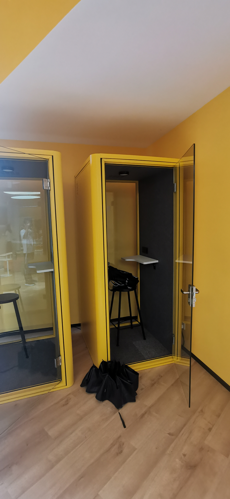

朝花夕拾 - 应届生面试官
===

> Create by **jsliang** on **2024-01-27 04:34:00**  
> Recently revised in **2024-01-27 13:03:14**

1、 数据统计
Hello 小伙伴上午/下午/晚上好，我是来自金山文档的梁峻荣，今天将由我担任前端面试官，对你进行前端岗位的面试~
【表情】微笑服务

在匆匆忙忙的小培训之后，从 2023.09.21 到 2023.12.18 这 88 天里，进行了 50 场一面面试，面试通过率 76%，整体通过率 20% 左右（一面 + 二面 + HR 面），面试情况如下：
• 面试完毕：50 个
    ◦ 非常不满意：1
    ◦ 不满意：4
    ◦ 待定：7
    ◦ 满意：24
    ◦ 非常满意：14
• 取消面试：9 个

2、 数据分析
今年面试的 2024 前端应届生小伙伴，学历基本是硕士。
在这些小伙伴中：
有的是 C++ 行业，并且在算法方面有所建树，但是因为前端有趣，所以转来前端看看；
有的从大二就开始入行，基础扎实经验丰富，面对问题基本秒答；
有的 22 岁但是有着几年工作经验，并且正在带领前端小队；

88 天下来，感觉 面试远比相亲难多了，毕竟要照顾应届生的情绪，HR 说把应届生整哭了就怪我 /-_-。
所以，保持“慈祥”面容，出题过程随机应变，照顾好应届生心态，就非常有必要。

3、 面试题库
面试的过程，我一般会怎么出题呢，拿 Web 基础题举个栗子：
1. 首先是一个 JavaScript 问题，X 同学能不能聊聊你知道的 ES6+ 语法和特性？
2. 然后在我们和同事合作开发项目的过程中，经常会出现下面的情况：
const A = '123'; a = '456'; // 报错
const A = { B: '123' }; A.B = '456'; // 不会报错请聊聊可以通过哪些办法，让 const 设置的 Object 属性的值不被修改，避免出现 A.B 可以直接设置值的惨案。
3. 接着介绍一下你对 Promise 的了解，比如 Promise 是为了解决什么问题，它有哪些状态，有哪些静态语法？
4. 最后我们做一个 Promise 延伸题目。
现在有一个任务，需要调用 A 接口 1000 次。这个接口每次调用时间必须间隔 5s，即第 1 次接口调用完毕后，不管结果如何，过 5s 就要调用第 2 个接口。现在需要你设计一个方法，取到这 1000 次接口调用的结果。请聊聊你的设计思路。
const aFun = async () => {};
const data = await aFun();a. 代码设计思路是怎样的，如何确保 data  可以取到 1000 次的结果，注意第 1 个卡点，这里是过 5s 直接调用第 2 个接口，不能因为 await 造成接口堵塞；第 2 个卡点，是获取到 1000 次结果给到 data，不能因为第 999 次接口和第 1000 次接口太慢，造成里面数据返回不齐全
b. 用户通过浏览器调用我们代码，但是执行到 500 次的时候，用户电脑断点了，下一次启动后，希望从 501 次开始继续，可以如何操作？
c. 还有其他值得注意的地方吗？

当然，还有比较 open 的职场交流问题：
在项目流程中，一般分为【需求评审环节】【开发环节】【需求验收环节】【测试环节】以及【上线环节】
在这些流程中，我们会碰到各式各样的问题：
5. 首先，在【需求评审环节】结束后，准备进入【开发环节】。领导希望你独立负责一个业务模块，比如富文本编辑器。但是这个模块涉及到你的知识盲区，你会怎么安排和计划呢？
6. 在【开发环节】，你预计一个功能模块 3 天可以解决，并且和领导报备了。但是 3 天后，你发下时间不够，存在项目延期的风险，你会怎么处理？
7. 到了【需求验收环节】，产品发现你误解了 ta 设计的某块业务逻辑点，但是你开发的时候，觉得这块业务应该按照你的思路去做才行，你会怎么处理？
8. 到了【测试环节】，测试反馈了一个 bug，是需求中的一个业务逻辑点，但是你感觉从技术角度和产品交互上，都不方便处理，你会怎么做呢？
9. 到了【上线环节】，有用户反馈，希望某个关键逻辑点需要加上去，这时候已经到 17:30 分，一时半会处理不完，但是你 18:00 有个重要聚会，你会怎么做呢？
这是没有固定答案的，但是每个面试的小伙伴总能给我不一样的反馈~

更多的题目欢迎添加微信 Liang123Gogo 交流沟通

4、 面试小结
1. 面试是件苦闷的事，因为金山会议室比较少，所以只能去小黑屋
然后一天早 9 晚 6，可能就在这个小黑屋里面，没有空调，风扇嘈杂，空间幽闭，比较折磨人

2. 面试官是个靠爱发电的岗位，所以很多小伙伴觉得当个面试官很威风，实际上就是扛着领导给的业务压力，和人力部的招聘压力，然后尽心尽责去挑合适的小伙伴
3. 一面大概是 30min-70min，这么大的落差，是因为一些优秀的，口齿伶俐的小伙伴，大概 30min 能面试完；然后一些知识面比较广的，会尽可能延伸题目去咨询，测出 ta 的极限，大概 70min 面完

5、 你想象中的优秀应届生是怎么样的？
千人千面，每个人招聘应届生的标准不同，我这边的标杆是：
1. 善于和同事沟通。这是个很重要的事。有些情况下会碰到技术很厉害的应届生，但是“代沟”会让你不知所措；又或者很难沟通，后面进来会和测试、产品沟通打起来的。这些同学会第一时间被标记不合格。
2. 把自己当需求 owner 去推进需求。需求是产品提的，所以产品说咋样就咋样？那样只会害了你，在用户和功能之间你成为了第三者。把自己做的业务当做是你后面天天要体验的，你会恨不得产品都听你的！
3. 基础知识扎实。在包含前面 2 条特性下，才到技术环节。因为面试的应届生都是高材生，所以不用担心他们学不会。基础知识扎实会让他们能更快成长为能和你沟通、互相提升的小伙伴，那真的很棒。

6、 对前端应届生的建议？
1. 多接触潮流玩意。2023 的 AI 已经火爆了一年，不知道你接触没有，AI 机器人、AI 文生图、AI 图生图、AI 视频创作……这些都是很有意思的东西，并且它可能会像 Vue/React 把 jQuery 拉下帷幕一样，不接触一些新玩意，可能哪天你怎么被淘汰的也不知道。
2. 多深挖技术知识。说实话，这点是我自身都没做好（所以我很菜）。Webpack 构建、Vue 源码、React 源码……我是没有一样精通的。虽然我会感到可惜，但是我不会遗憾，可能个人兴趣就在那。相对于天天对着代码，我更想知道如何编写界面交互，能让用户有更好的体验。
3. 乘早学点服务端。需求业务掌握在产品手里，质量把控掌握在测试手里，数据掌握在服务端和运维手里。可以学深一点前端技术，或者往服务端靠拢一下，提升自己的不可替代性。

---

**不折腾的前端，和咸鱼有什么区别！**

觉得文章不错的小伙伴欢迎点赞/点 Star。

如果小伙伴需要联系 **jsliang**：

* [Github](https://github.com/LiangJunrong/document-library)
* [掘金](https://juejin.im/user/3403743728515246)

个人联系方式存放在 Github 首页，欢迎一起折腾~

争取打造自己成为一个充满探索欲，喜欢折腾，乐于扩展自己知识面的终身学习斜杠程序员。

> jsliang 的文档库由 [梁峻荣](https://github.com/LiangJunrong) 采用 [知识共享 署名-非商业性使用-相同方式共享 4.0 国际 许可协议](http://creativecommons.org/licenses/by-nc-sa/4.0/) 进行许可。 基于 [https://github.com/LiangJunrong/document-library](https://github.com/LiangJunrong/document-library) 上的作品创作。 本许可协议授权之外的使用权限可以从 [https://creativecommons.org/licenses/by-nc-sa/2.5/cn/](https://creativecommons.org/licenses/by-nc-sa/2.5/cn/) 处获得。
