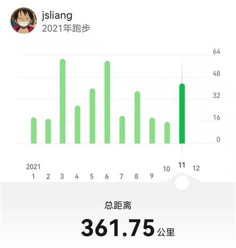

朝花夕拾 - 三十而立
===

> Create by **jsliang** on **2021-11-29 21:30:44**   
> Recently revised in **2021-11-30 23:22:40**

Hello 已经 30 岁的我，今天是 `2021.11.29`，一个刚做完需求稍微清闲点的日子。

现在距离 `2025.03.31` 还有 1218 天，莫名很想给吐槽自己 2 句，不准不听，希望自己能长长心，哈哈。

## 一 居住

现在可能已经买房啦~

但我知道你梦想中的住所，是能自建一套属于自己的房子，有着前院可以晒太阳，后院小菜园可以种植各种绿色植物，就像你在 2021 年逛大理洱海时看到的房子一样酷：

当然，这个房子一定一定是有大空间的，至少有着 3 个卧室 1 个客房 1 个客厅 1 个书房 1 个厨房 1 个杂物房，还有阳台/天台可以烧烤和晒棉被。

兴许你当时，为了找到那种能自建房屋，附近又有较好的教学、医疗资源，以及良好的交通地段的位置而烦恼过，但我想你总能找到两全的法子~

如果未来的你看到这里，补充下当时的纠结，我想一定会很有意思！

**TODO:** 做你想做的，记录你的点滴

## 二 锻炼

你一直都喜欢跑步，那么 30 岁的你，应该坚持了每年 450km 的里程，现在有近 2000km 的总里程了吧。

虽然像 2021 年这样，每天 3km 看起来很逊，但是它符合你的想法：保持锻炼，远离 ICU。

即便你还是没有瘦回 150 斤，但请继续关注自己的身体健康，毕竟长命百岁难能可贵，拥有健康的身体势在必行。

**TODO:** 贴一下从 2020 到 2025 的总里程，我想这时候你的眼睛一定泛着亮光（一抹银色的光，hahah）

## 三 实践

你一直觉得自己 “一事无成”，所以我知道为了有所成就，你这几年仍在不停折腾，完成自己列的任务清单。

兴许你完成的事情不会多，但是希望你做到了自己喜欢的、想做的事情：

* [ ] 整理了一本自己的电子书
* [ ] 整理了一套朴素的算法视频
* [ ] 开发了 3 款不同类型的小游戏
* [ ] 基于 GitHub 的知识库，还拥有一个自己打造的便捷的知识库
* [ ] 实现了至少 3 种税后收入，例如：
  * [ ] 书籍
  * [ ] 短视频
  * [ ] 游戏广告
* [ ] 自由存款达到 50w 以上
* [ ] ……

当然，内容太多，记得补充，记得还愿！

**TODO:** 补充这几年你的 “奇思妙想” 和实现情况

## 四 交际

还记得小时候，咱从村里到市里，永远都是群体中的一员，融不入群体的一员，别人家孩子里的乡巴佬，那个不值得深交的同学。

但是咱努力过，尝试过，所以这种情况直到大学后有所改善，你认识的越来越多的朋友（虽然这些朋友仍是你人生旅途中的一员）。

到 30 岁的今天，你的微信大号应该超过 5000 好友了吧，甚至私密小号也有 50 个你认为可以长期聊天吹水的 “至交”。

你会时不时联络好友的感情，更会开着你的小车去拜访好友，大家喝喝茶、聊聊天，或者约好出去烧烤、聚餐。

想想就是不错的生活方式呢~

**TODO:** 统计一下当前好友数，梳理下自己人脉

## 五 鸡汤

你喜欢鸡汤，也喜欢给自己煲鸡汤，没有鸡汤的生活总感觉缺少点灵魂。

但是，更希望 30 岁的你，能把自己深刻经历的汤渣给整理出来，毕竟人生果过肚，重要的过程忘了就很惨：

* 2014：**人生三愿：吃得下饭、睡得着觉、笑得出来**
* 2018：**不折腾的前端，和咸鱼有什么区别**
* 2019：**知道自己想要什么，尤其重要**
* 2021：**任何事，都是开头容易，坚持很难**
* ……

虽然别人看了不会有切身体会，但是这些都是你成长过程中铭刻在心里的教训。

记着就好，不用跟所有人吐槽你怎样怎样~

**TODO:** 上面的记得列一列

## 六 总结

这样，应该，就写完了？

还是感慨时间真的很少，过得真快呀~

活下去，更好地、竭尽全力地活下去，活出属于自己的精彩！

---

> jsliang 的文档库由 [梁峻荣](https://github.com/LiangJunrong) 采用 [知识共享 署名-非商业性使用-相同方式共享 4.0 国际 许可协议](http://creativecommons.org/licenses/by-nc-sa/4.0/) 进行许可。 基于 [https://github.com/LiangJunrong/document-library](https://github.com/LiangJunrong/document-library) 上的作品创作。 本许可协议授权之外的使用权限可以从 [https://creativecommons.org/licenses/by-nc-sa/2.5/cn/](https://creativecommons.org/licenses/by-nc-sa/2.5/cn/) 处获得。
