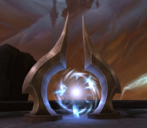
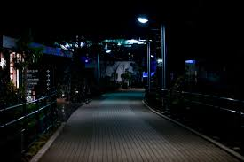

2022-02-16 - 改编
===

> Create by **jsliang** on **2022-02-16 08:30:15**  
> Recently revised in **2022-03-10 23:00:31**

## 第 233 章、红警归来

“Vehicle reporting. Attacking!……”

剑寒秋踏出传送门，身后依稀传来雄厚的声音。

> 图片来源于网络，侵权必删

「吁，终于搞定了！这系统也太变态了吧，怎么越打到后面越发难。这次居然是红警世界，然后一堆人玩指挥，还好我留了一手」

剑寒秋叹了口气，往休息室走去。

> “寒秋，没事吧？” “没事没事，小场面小场面，哈哈~”

> “寒秋，不受个伤，中个诅咒？” “去你的，我好着呢”

> “你这次第 5 层是什么场景？” “红警，世界地图混战！” “哟，这么刺激？” “对，差点被阴了。”

剑寒秋跟朋友们打着招呼，望向人群中围着的一群人，似乎争吵非常激烈：“怎么了？”

> 图片来源于网络，侵权必删

人群稍微让了点位置，剑寒秋瞅了一眼，有点发愣：“怎么回事？！”

在空开的位置上，他看到了「年轻版」的无霜，似乎有一圈黑色光环在旋转。

> “无霜中了「迷乱」诅咒，身体会逐渐变年轻和衰弱，并且记忆也逐渐混乱。”

> “她攻略上一层的时候，最后时刻被对手拼死反击，估计一时半会没法解，除非能及时找到解药”

> “我知道有个其他团队的人有解药，但是别人正在攻略梦境，而无霜的下一个梦境却不远了，是连环梦境。”

> “对了，寒秋你和无霜分派到的梦境好像是同一个，你能帮忙照顾下？”

听了大家七嘴八舌的描述，剑寒秋吸了口冷气：下一个梦境是他第 6 个梦境，梦境越往下越难，他的手段自保有余，带人不及啊！

但是梦境互助小组就是这样，每个人都曾经被帮助，也有必要去帮助别人，所以看着眼前嚷着要讲故事才能入睡的无霜，左思右想没有更好的法子了，剑寒秋咬咬牙：“好，那我试试！”

深夜，众人逐渐沉睡……

……

…… ……

> 图片来源于网络，侵权必删

## 第 234 章、梦境 6 层，噩梦开局

剑寒秋只觉得眼前一亮，来到了一个教室类型的场景，同时脑海里复现出这个梦境的任务：

1. 【主线任务】逃出校园
2. 【注意事项 1】手机电量为 0，将遭受致命攻击
3. 【注意事项 2】安全场景有固定安全时间
4. 【注意事项 3】……隐藏……

糟！看着这个任务描述，剑寒秋只觉得头皮发麻，因为越往后的梦境，如果越接近真实，那么需要注意的条条框框越多。

看了下无霜，还在意识混乱阶段，好像更加年幼了。

> 图片来源于网络，侵权必删

> “醒醒无霜！”

剑寒秋将无霜摇醒，开始打量教室，教室座位已是满员：

| 走廊 |  |  |  | 老师 |  |  |
| --- | --- | --- | --- | --- | --- | --- |
| 走廊 |  |  |  | 讲台 |  |  |
| 走廊 | 前门 | A | B | C | D | E |
| 走廊 |  | ... | ... | ... | ... | ... |
| 走廊 |  | ... | ... | ... | ... | ... |
| 走廊 |  | ... | ... | ... | ... | ... |
| 走廊 |  | ... | ... | ... | ... | ... |
| 走廊 |  | F | G | H | I | J |
| 走廊 | 后门 | 寒秋 | 无霜 | K | L | M |

「会遭遇什么吗？需要逃出校园，还有安全场景在固定的时间才安全。」

> “安静！”

讲台上老师开始发话：

> “这次我们考完试要调换座位，但是我待会需要去开个会，所以由班长（A）组织，等我回来希望看到你们换好座位了！”

老师说完匆匆离去，A 同学走上讲台

「！！！这眼神！艹，怎么是他！」

剑寒秋内心开始歇斯底里起来。

没错，站在讲台上的正是司徒枭，剑寒秋的老对手，看司徒枭的眼光，应该也是第一眼认出了寒秋，毕竟 —— 双方都恨不得立马收拾了对面，把对方扬灰了！

> **系统提示：10 分钟后教室将爆发不可预料的危险**

看到这提示，剑寒秋内心开始盘算起来：

「10 分钟后有危险，印证了前面的安全场景有固定时间的注意事项，所以这 10 分钟，是最佳的应对时间！」

「但是无霜还是混乱状态，这就很棘手了……」

在剑寒秋纠结的时候，突然发现旁边有人陆续有人走过，还有几个人走过时拿着手机，盯着课室内。

> 前面同学低语：  
> “刚才走过的是不是君莫笑？这不是动漫主角？”  
> “对对，好像还有现实明星？这是混搭走秀么？”

……

> “现在我们开始调换座位，座位表如下！”

| 走廊 |  |  |  | 讲台 |  |  |
| --- | --- | --- | --- | --- | --- | --- |
| 走廊 | 前门 | 司徒枭 | B | C | D | E |
| 走廊 |  | ... | ... | ... | ... | ... |
| 走廊 |  | ... | ... | ... | ... | ... |
| 走廊 |  | ... | ... | ... | ... | 寒秋 |
| 走廊 |  | ... | ... | ... | ... | ... |
| 走廊 |  | F | G | H | I | J |
| 走廊 | 后门 | M | 无霜 | L | K | ... |

> “当然，座位是可以换的，具体看各位需求哈~”

司徒枭给了个你懂的眼神，然后将前门旁边的同学赶走，得意洋洋得看着讲台下。

课室内的同学听到这话，开始交头接耳起来，至于是试炼者还是 NPC，那就不清楚了。

「这座位表……开局就被针对了呢，系统提示 10 分钟会有危险，待会突发情况下，最后面走的肯定有问题！不行，得试试了！」

走廊上人群不停走动，逐渐稀疏起来……

剑寒秋稍微推了下后门：

「！能动！」

深吸了口气，剑寒秋再细细观察着路过的人：

「动漫人物，现实动漫相关人物，现实人物，现实动漫相关人物……就是你了！」

剑寒秋立马推门而出：

> “你好！请问是「Kaze凉」吗？”

> “啊？请问你是？！”

对面的靓仔稍微有点懵。

> “你好，我叫剑寒秋。长话短说，我能求助下你么，有个同学病了，能帮忙带过去看看校医吗？”

> “你好，同学我帮你是可以的，但是你也知道规则的，需要收你最低协助费。”

> “！！可以，请问需要多少？”

「能行，剑寒秋内心嘀咕起来：我还以为是梦境人物，结果真的是试炼人物，估计是福利关卡」

> “50% 电量，每人，但是给同学你一个友情提示：这关 50% 不一定能通关！”

—— 此时已过去 8 分钟，教室内的同学也陆续出来了，这会儿功夫下，司徒枭也收取了一波 “调位费”，看到剑寒秋的情况，从座位赶过来了。

「不能耽误了，不一定能通过说不定也可以的！」

> “成交！那待会那个混乱状态的同学就摆脱你了！”

> “行！”

在听到「Kaze凉」回复后，剑寒秋快速跑到无霜身边，将她拉起来跑出门口，并反锁课室门！

！司徒枭一下子没反应过来，瞪着剑寒秋，眼里杀意涌现！

> “这么果断……”

「Kaze凉」小声嘀咕着：

> “那人我就带走啦，刚才系统也提示将你的电量扣掉了。”

> “好的，感谢！”

剑寒秋松了口气，目送「Kaze凉」和无霜逐渐消失。

「希望能跟我想的一样，这是现实版的 Kaze凉 过来的，要不然我还真不安心，现实的这个宅男应该在这里也能信守承诺吧！」

—— 9 分钟已过半，剑寒秋赶紧从正门赶回教室。

「那么，就开始吧！」

## 第 235 章、校园乱斗

哒哒哒，走廊传来脚步声，老师走进课室。

> “好，看来你们位置都换好了，那么我们开始讲课吧！”

老师托了托眼镜，眼神略显疲惫。

> “今天我们讲解原力，虽然同学们觉得不可思议，也比较难相信，但是希望大家还是努力听讲……”

> “魔力，是本世纪的重要发现之一。它由科学家海森·伯格发现，并应用到他的学生身上。迪·思帕就是当中一位，它开启了火系魔力，相传温度能高达 1400℃，能熔炼铁等金属……”

> “同学们可以把魔力当成你们小说常见的异能，这节课我们就是来开启异能的。”

「异能学院？有没那么扯，我要搓个魔法球才能毕业吗？不过这也好，突破到异能，限制就没那么大了」

剑寒秋内心叨叨着，当然也不敢有啥大动作。

> “H、I 同学你们在干嘛！课堂上交头接耳，给我滚出教室！”

讲台上老师突然爆发了，有点气急败坏的样子，指着 H、I 同学，催促他们赶紧走。

而 H、I 同学明显不当回事，甚至有点「就等这话」的样子，看来应该有所打算，他们慢悠悠晃出教室。

！滋……在他两出去不到几秒钟，外面突然传来一阵诡异怪声。

「！！灵魂四溢，教室外有危险？！」

剑寒秋暗自心惊，看了下周围同学的表情，场景也略显压抑。

「看来这门课得好好听了，千万不能出教室，好好当一回学生。系统这么坑的吗，所谓的课室有不可预料的危险，就是不认真听课，被赶出课室，然后直接灰飞烟灭？」

……

> “好，咱们继续讲魔力的开启方法，希望同学们别学刚才的同学，争取……”

……

…… ……

…… …… ……

> “那么现在是休息时间，同学们做好准备，下节课我们将尝试开启魔力“

折磨的理论讲解终于在课堂铃声响起的那一刻结束了，剑寒秋稍微松了口气，看了下手机电量，还剩 48%。

「现在有 2 点情况，首先是我手机电量开局没了一半，得看下怎么处理；另外就是下节课，老师都没开启魔力，这是将我们当小白鼠吗？而且刚才他可是亲口说开启魔力存有风险的！」

「但是没法子了，横竖都是残局开场，我还是想想怎么做吧……」

看到教室门开启，同学们陆续走出去不受影响，剑寒秋也出去溜达了起来。

……

…… ……

叮铃铃，上课铃声仿佛催命般响起，同学们迅速地走到自己座位上。

> “好的，这节课我们需要借助操场，同学们跟我下楼”

老师将队伍带到操场树荫角落后，开始组织队伍，让众人四散坐下。

> “上节课，我们讲过魔力是什么，当初海森·伯格是怎样安排他的同学开启魔力的，所以这节课我们仿照他进行训练！那么，我们开始吧，第一环节 —— 静坐。”

老师说罢，也开始打坐起来，看来是想做个榜样。

|  |  | 老师 |  |  |
| --- | --- | --- | --- | --- |
| 司徒枭 | B | C | D | E |
| ... | ... | ... | ... | ... |
| ... | ... | ... | ... | 寒秋 |
| ... | ... | ... | ... | ... |
| ... | ... | ... | ... | ... |
| F | G |  |  | J |
| M |  | L | K | ... |

> “第二阶段，哈，破神练心！同学门跟左我整”

「嘶，真狠，说咬破舌头就咬破舌头！」

> **系统提示：血祭，这里要留下 10 具尸体开启魔力献祭，当前剩余人数 32**

听到这系统提示，剑寒秋还没反应过来，双脚就被突然变长野草的束缚起来！并且开始长出针状尖头刺入大腿，血开始逐渐流失

> “哈啊，哈啊……”老师的气喘声，“我要活下去，别逼我，放我离开这所学校，你们要疯狂别带我疯狂，啊，都去死！”

瞬间打坐的同学们乱了起来，叫嚷不断。

剑寒秋也开始挣扎，想摆脱野草的束缚，但是该死的，完全无法动弹！

无意间瞟了眼被忽视很久的司徒枭，剑寒秋更加心寒了。

「他是怎么挣脱一只脚的？！怎么他附近光纤有点朦胧？」

剑寒秋再三观察，看着司徒枭脚上的野草开始滕火，稍微明白了：司徒枭觉醒了魔力？

「这是具备加热类型的魔力？不行我得快想法子！」

> “同学们，想死想活请看我！交易已经发到你们面板了，你们懂？”

司徒枭站了起来，得意洋洋看着下方，其他人也开始查看系统面板，在估摸要不要进行交易。

当然，剑寒秋是不会收到交易的了，司徒枭还特意笑着看着他两眼。

> “啊！怎么会这样，救我，为什么野草又长出来了！我没电量了，求求你们帮忙烧开”

可惜这位同学的苦苦求饶并没有换来同情，似乎因为二次缠绕，这次吸血更加迅速，那位同学喊声逐渐虚弱起来。

剑寒秋因短时没法挣脱，再加上被抽了几管血了，也开始迷糊起来。

「找到了！魔力开，卧槽，土系？！」

剑寒秋内心崩溃 ing....土系貌似无法挣脱束缚，那他要这魔力有何用！

以此同时，有好几位同学也觉醒了魔力，开始打量向谁下手，毕竟继续待下去说不定有更多的风险，还是找几个倒霉蛋完成血祭比较实际。

司徒枭和其他率先觉醒魔力的同学，因为抢电量交易互相打了几个来回后，很快便将队伍分成了 4 个队，以及剩下 5 个倒霉蛋还没挣脱野草束缚。

眼看司徒枭他们达成一致，开始向剩下的倒霉蛋下手，剑寒秋感觉不能耽搁了。

「消耗电量 10%，生成荒土沙化！」

附近野草因为失去了水分补充，开始干瘪，并且周围开始成沙化起来，挣脱成功！

> 剑寒秋：大脑，开始运转！电量，接近停机！对面，人有点多！人命关天，在线等，挺急的！

## 第 236 章、反杀！我还有一手！

很快剩下的 4 个未挣脱倒霉蛋被清理掉了，剑寒秋和其他小队开始对峙了起来。

> “还有 4 个缺口，赶紧的，要不然大家一起死”

> “别因为你们队人多就嚣张，打起来谁被扬灰还不一定”

就在大家争执不下的时候，司徒枭使坏了：

> “3 队一起围攻人少那队，再加上那个落单的，刚好 4 个，没问题就动手！”

剑寒秋听到顺觉不妙，开始跑动起来~

咻，感觉头皮火辣辣地疼，看了下司徒枭，看来他是光类魔力，

> **系统提示：想死？想活！20 分钟后下课学校门口等你**

喝水塞牙缝！逃跑挨打过程中，剑寒秋逐渐学会通过低至 1% 的电量，来造成小地皮凸起，从而阻碍其他人的追赶。

> “他之前和别人交易过，电量应该剩余不多，赶紧均摊下攻击，别让他走了！”

司徒枭看来是想在这个梦境彻底埋葬剑寒秋了，带着几个人冲了过来。

又是火球又是冰蛋之类的砸过来，剑寒秋好不狼狈，看来今天这关有点难过了。

在追逐过程中，那只 3 人小队已逐渐失去抵抗能力，身体条件开始走下坡路。

> “该死，这是你们逼我的，那就一块走吧！”

“轰”，3 人小队中的火系魔力成员，眼看就要彻底失去抵抗能力了，将其他 2 个人的电量都交易过来，然后将所有电量用尽，直接爆炸起来。

望着远处的火光，剑寒秋加快了速度，朝校门口跑去。

> “别跑了，就算你跑过去，最后一个祭品也是你！”

「笑话，我不跑站着等你们打？」

剑寒秋已经说不出话了，距离学校门口的路仿佛越发地远。

「该死，失血有点多，早想到方法就好了」

“咻”，又是一发光箭，剑寒秋感觉快撑不住了，这是噩梦开局地狱过程啊！

「嘿，不要急不要急，我快到了我快到了」

剑寒秋内心给自己鼓劲着，看着越来越近的大门，再回头看了下前排追赶的以及后面收拾好也跑过来的司徒枭，露出了微笑：

> “拜拜啦！”

随着地面的颤抖，一堵墙从平地快速升起，将剑寒秋和众人隔离开来，并且从其他人攻击但是毫发无损的趋势来看，这堵墙的防御着实有点高！

「手机放进厕所充电，估计你们没想到吧哈哈哈，当时为了玩手机我可是好不容易找到的这个法子，没想到这里也可以，舒心~」

这用 80% 电量产生的土墙，估计也就剑寒秋有这个胆量了，因为他的电量到 1% 了！

看着校门口逐渐显现熟悉的黑洞，剑寒秋得意洋洋走了过去。

（完结）

## 完结感言

这个梦境是 **jsliang** 改造的第一个梦境，可能有点蹩脚，尤其是最后的结尾。

我感觉脑细胞分裂着分裂着直接凉了，因为除了第一章，其他三章都是补出来的。

之前没写过这类，它不像写代码，思路整理好想怎么写都可以，因为写这个小说，你总会想到不同的 idea，然后就冲突了。

以上，作为萌新 “梦境小说家”，以后有梦境我再改造吧，哈哈~

---

**不折腾的前端，和咸鱼有什么区别！**

觉得文章不错的小伙伴欢迎点赞/点 Star。

如果小伙伴需要联系 **jsliang**：

* [Github](https://github.com/LiangJunrong/document-library)
* [掘金](https://juejin.im/user/3403743728515246)

个人联系方式存放在 Github 首页，欢迎一起折腾~

争取打造自己成为一个充满探索欲，喜欢折腾，乐于扩展自己知识面的终身学习斜杠程序员。

> jsliang 的文档库由 [梁峻荣](https://github.com/LiangJunrong) 采用 [知识共享 署名-非商业性使用-相同方式共享 4.0 国际 许可协议](http://creativecommons.org/licenses/by-nc-sa/4.0/) 进行许可。 基于 [https://github.com/LiangJunrong/document-library](https://github.com/LiangJunrong/document-library) 上的作品创作。 本许可协议授权之外的使用权限可以从 [https://creativecommons.org/licenses/by-nc-sa/2.5/cn/](https://creativecommons.org/licenses/by-nc-sa/2.5/cn/) 处获得。
