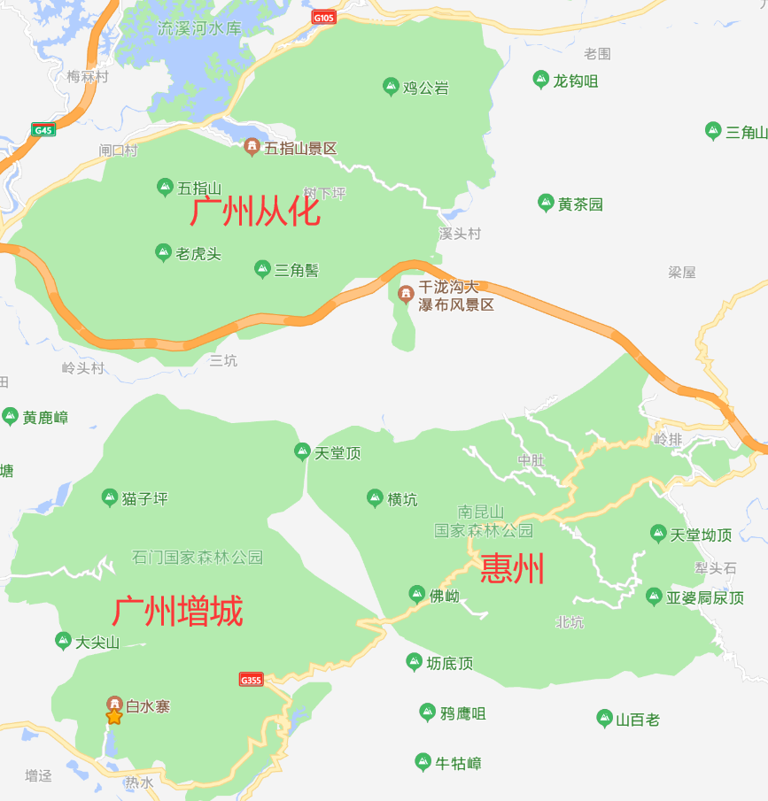

2022 计划 - 打卡广东
===

> Create by **jsliang** on **2021-12-09 08:45:13**  
> Recently revised in **2021-12-11 09:41:37**

## 一 前言

有些小伙伴可能好奇为什么 **jsliang** 会有旅游打卡全广东的想法？

兴许还得从我 2017 年做业务员说起：

2017 年因为学校要求，要整个实习经历，恰好当时有个学校的坑人项目，懵懵懂懂就去了，后面才知道是去广州各个地区的药店，去装医保监控系统。

这个活，讲真和装宽带的工人没啥区别（没有任何歧义，仅对当时的工作做比喻），属于苦力活，哪里需要去哪里那种。

> 图片来源于网络，侵权必删

一来二去，跑的地儿多了，地图也玩熟练了，然后跟打通了社交牛逼症的任督二脉一样，感觉跑图也是一种乐趣，和人打交道也是一种乐趣，天天跑图天天爽，当时还整了个 100 多号人的微信群（后面就被封杀了，你懂的）

> 图片来源于网络，侵权必删

> 不知为啥刚才洗澡的时候甚是怀念了一波，等现在拿起键盘敲这段话的时候，没有那个意境了

于是后面就想着哪天要打卡全广东，但是因为程序员嘛，大家都懂，每天敲完代码，回去就累得想歇息，周末也是宅在家。

后面认识了小赵同学，接着就不知不觉逛了珠海、广州等地儿的 8/9 个景点了。

当然，因为 **jsliang** 的怠惰，所以目前就记录了珠海长隆的攻略。

后续想着将全广东打个卡，顺带记录成视频和文章，也算不虚此行吧~

* 文章可见 GitHub：《[系列-个人生活 / 旅游](https://github.com/LiangJunrong/document-library/tree/master/%E7%B3%BB%E5%88%97-%E4%B8%AA%E4%BA%BA%E7%94%9F%E6%B4%BB/%E6%97%85%E6%B8%B8)》
* 视频可见位置：「[飘飞的心灵](https://space.bilibili.com/289377747)」

## 二 旅行攻略

广东省有 21 个地级市，划分为珠三角、粤东、粤西和粤北四个区域，其中具体划分为：

* **珠三角**：广州、深圳、佛山、东莞、中山、珠海、江门、肇庆、惠州
* **粤东**：汕头、潮州、揭阳、汕尾
* **粤西**：湛江、茂名、阳江、云浮
* **粤北**：韶关、清远、梅州、河源

本次计划于 2022 年 12 月 31 日前完成旅游打卡。

2022 年有 365 天，共 53 个周末，另外有 7 个 3 天以上的节假日。

计划每个月至少 2 个周末（4 天）旅行，**每个市至少 1 个景点**，即 2022 至少旅行 48 天，且溜达过 24 个景点。

* 当前时间消耗总进度（天）：「**18/48**」
* 当前景点游玩总进度（个）：「**9/24**」

当然，做这些是有前置条件的，目前正逐步开启中：

* [ ] 已有驾照，需要熟练开车，以方便出行
* [ ] 学习制作旅游 VLog，并学会同步各大平台
* [ ] 梳理旅游文章，并明确投稿的平台

那么，下面就是各大区域的详细攻略。

## 三 珠三角

**jsliang** 抽时间整了一遍，但是还不够仔细，另外因为有些地区交通可能不太便利，所以有些地方的打卡点就标记了一个，后面到该市游玩后会详细补充

**如果有好玩的地方但是 **jsliang** 疏漏了，欢迎留言提醒，个人联系方式在 GitHub 首页**

### 3.1 广州

* [ ] 长隆野生动物世界 + 长隆欢乐世界 + 长隆国际大马戏
* [ ] 广州塔
* [ ] 广州融创雪世界
* [ ] 白水寨风景名胜区
* [x] 珠江夜游
* [ ] 从化碧水湾温泉
* [ ] 从化千龙沟大瀑布
* [x] 沙湾古镇

个人去过：

* [x] 岭南印象园
* [x] 白云山
* [x] 沙面
* [x] 上下九步行街
* [x] 北京路步行街
* [x] 陈家祠
* [x] 广州兰圃
* [x] 越秀公园

### 3.2 深圳

* [ ] 世界之窗
* [ ] 深圳野生动物园
* [ ] 深圳欢乐谷 + 湾区之光摩天轮
* [ ] 东部华侨城 + 大梅沙海滨公园 + 小梅沙度假村 + 玫瑰海岸文化旅游度假区

个人去过：

* [x] 东门老街
* [x] 大梅沙海滨公园
* [x] 小梅沙度假村

### 3.3 佛山

* [ ] 长鹿旅游休博园
* [ ] 西樵山风景名胜区
* [x] 顺德欢乐海岸 PLUS + 清晖园博物馆 + 乐漫冰雪王国
* [ ] 千灯湖 + 祖庙 + 岭南天地

### 3.4 东莞

* [ ] 隐贤山庄旅游风景区
* [x] 南社明清古村落
* [x] 鸦片战争博物馆 + 林则徐销烟池旧址
* [ ] 虎门炮台

### 3.5 中山

* [ ] 孙中山故里旅游区

### 3.6 珠海

* [x] 珠海长隆海洋王国 + 珠海横琴长隆国际大马戏
* [ ] 御温泉
* [ ] 外伶仃岛
* [ ] 东澳岛
* [ ] 神秘岛主题乐园
* [ ] 星奇塔无动力世界
* [x] 野狸岛公园 + 珠海大剧院
* [ ] 圆明新园
* [ ] 唐家湾古镇 + 唐家湾沙滩
* [x] 淇澳岛

### 3.7 江门

* [ ] 开平碉楼文化旅游区立园景区 + 开平碉楼文化旅游区

### 3.8 肇庆

* [ ] 七星岩景区 + 肇庆星湖风景名胜区
* [ ] 鼎湖山景区
* [x] 恒大世纪梦幻城

### 3.9 惠州

* [ ] 大亚湾 + 巽寮湾 + 双月湾
* [ ] 南昆山温泉旅游大观园 + 富力岭南花园温泉度假山庄 + 南昆山云顶温泉 + 南昆山国家森林公园
* [ ] 罗浮山风景名胜区
* [ ] 惠州西湖风景名胜区 + 红花湖景区

## 四 粤东

**如果有好玩的地方但是 **jsliang** 疏漏了，欢迎留言提醒，个人联系方式在 GitHub 首页**

### 4.1 汕头

* [ ] 南澳岛
* [ ] 汕头老城

### 4.2 潮州

* [ ] 潮州古城 + 潮州西湖 + 韩愈纪念馆 + 开元寺泰佛殿

### 4.3 揭阳

* [ ] 黄满寨瀑布

### 4.4 汕尾

* [ ] 红海湾旅游区 + 汕尾风车岛

## 五 粤西

**如果有好玩的地方但是 **jsliang** 疏漏了，欢迎留言提醒，个人联系方式在 GitHub 首页**

### 5.1 湛江

* [ ] 南三旅游区 + 霞山观海长廊 + 特呈岛

### 5.2 茂名

* [ ] 中国第一滩 + 水东湾海洋公园

### 5.3 阳江

* [ ] 海陵岛风景区

### 5.4 云浮

* [ ] 广东天露山旅游度假区 + 象窝山 + 禅域小镇

## 六 粤北

**如果有好玩的地方但是 **jsliang** 疏漏了，欢迎留言提醒，个人联系方式在 GitHub 首页**

### 6.1 韶关

* [ ] 南雄帽子峰旅游景区
* [ ] 丹霞山
* [ ] 珠玑古巷

### 6.2 清远

* [ ] 古龙峡
* [ ] 清远黄腾峡生态旅游区

### 6.3 梅州

* [ ] 雁南飞茶田景区
* [ ] 客天下·梅州国际旅游度假区

### 6.4 河源

* [x] 万绿湖
* [ ] 巴伐利亚庄园
* [ ] 龙川霍山风景区
* [ ] 桂山风景区

## 七 interesting

有意思的区域划分：

**广州从化** 的「五指山景区 + 千泷沟大瀑布风景区」和 **广州增城**「白水寨 + 石门国家森林公园」以及 **惠州** 的「南昆山国家森林公园」，是相邻位置，即一块地图可以看到这么多景点凑在一起

## 八 参考文献

* [携程旅游攻略社区 - 广东 Guangdong](https://you.ctrip.com/sight/guangdong100051.html)

---

> jsliang 的文档库由 [梁峻荣](https://github.com/LiangJunrong) 采用 [知识共享 署名-非商业性使用-相同方式共享 4.0 国际 许可协议](http://creativecommons.org/licenses/by-nc-sa/4.0/) 进行许可。 基于 [https://github.com/LiangJunrong/document-library](https://github.com/LiangJunrong/document-library) 上的作品创作。 本许可协议授权之外的使用权限可以从 [https://creativecommons.org/licenses/by-nc-sa/2.5/cn/](https://creativecommons.org/licenses/by-nc-sa/2.5/cn/) 处获得。
