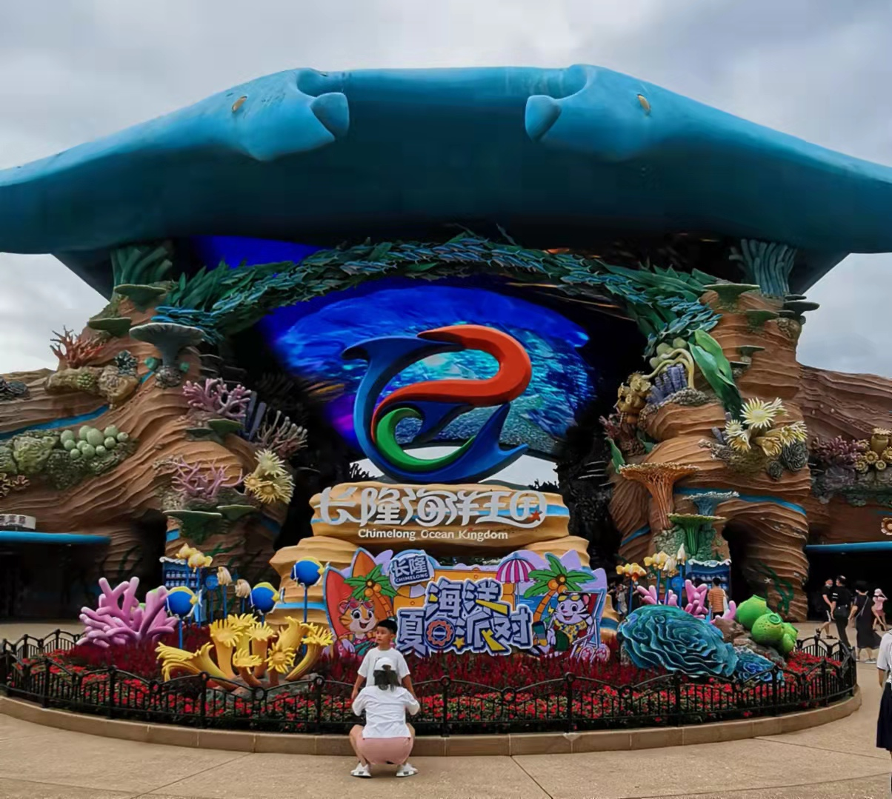
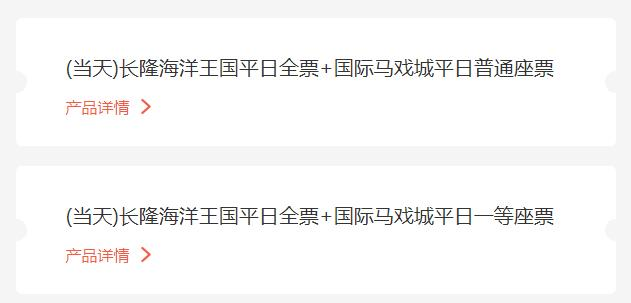

广东 - 001 - 珠海长隆
===

> Create by **jsliang** on **2021-07-28 07:47:58**  
> Recently revised in **2021-09-02 12:48:42**

Hello 小伙伴们早上、中午、下午、晚上、深夜好，秋天到了，是时候来一波说走就走的旅行了！

本篇文章将整理 2021 年 7 月份的两天一夜「珠海长隆旅游小攻略」，包含酒店挑选、景点路线、注意事项等内容，感兴趣的小伙伴可以看看，记得评论/留言/私聊吐槽，哈哈~

> 注：本攻略具有时效性，各种票价可能有所差异，本文适合拿来做参考比对

## 一、定目标

最好的攻略就是有 “亿” 点点期望，然后稍微补充 “亿” 点点小细节。—— **jsliang** 说的

## 二、旅游基础

**首先**，确定大致套餐，即你希望这次旅游应该必备的一些条件（衣食住行），而 **jsliang** 这边挑选的：

* 住：酒店
* 玩：海洋王国 + 马戏
* 吃：自助餐（早餐/中餐/晚餐一样或者多样）

这里想说的是海洋王国和马戏应该算是 2 个重头戏吧，[珠海长隆海洋王国官网](https://sc.chimelong.com/100004) 的套票就会有这 2 个放在一块的。

自助餐是因为想享受那种海底环绕环境，当然里面也有很多餐馆，但是过去后再买票好像会贵一点点。

> 旅游后补充：不是贵一点点，外面 10 块钱的皮蛋瘦肉粥里面能卖 35 元，尽量把吃的确定好！

## 三、酒店挑选

**然后**，贴一下 2021.07 查找资料时，各个满足我需求的套餐价格：

* 横琴湾酒店 3289 元（度假园景房+海洋王国+自助晚餐+马戏）
* 横琴湾酒店 3232 元（度假园景房+海洋王国+自助午餐+马戏）
* 企鹅酒店 3058 元（极地房+海洋王国+自助晚餐+马戏）
* 企鹅酒店 3232 元（极地房+海洋王国+自助午餐+马戏）
* 马戏酒店 2684 元（杂技大床房+海洋王国+早餐+自助午餐/晚餐+马戏）
* 海洋科学酒店 3062 元（印度洋房+海洋王国+半自助午餐+马戏）
* 海洋科学酒店 2548 元（印度洋房+海洋王国+马戏）

当然，我看到的这些价格肯定不是最便宜的，毕竟让我从各个平台比对，我还是觉得太心累了，这些是官方 App 找到的价位。

所以我仅贴出来而已，方便后续要游完的小伙伴看到做个比对（当然这是 “历史” 价格，后续升还是涨我不知道）

下面小分析一波，上图：

通过这个概览图，大致讲下小情报：

* **长隆**：游完面积真不会太大，凭我的脚力只走不进去观赏的话半小时可以溜一圈，它周围都是山
* **企鹅酒店**：真的有企鹅，不过是在餐馆里面，吃饭的时候可以在企鹅隔壁坐着吃（前提是你买了自助餐票），另外就是它距离长隆景点非常近，有通道，不怕晒和累
* **科学酒店**：便宜是它的前提
* **横琴湾酒店**：靠海！只要你 money 给的多，海景房是有的，不过每年 5-10 月，走过来距离还是有的，注意防晒

**接着**，确定必去景点，因为有些场景是特定时间才有演出，错过了还得下次，就不那么友好。

海洋王国是 10:00-20:00，最晚 19:00 入园，然后计划中的话，2 天分别去一些场景。

第一天：

* 12306 购票，从珠海出发去珠海长隆，30 分钟车程
* 入驻酒店，早于 15:00 可以先将行李寄存到前台，然后去游完
* 「重要」进门拿地图，否则看官方 App，各个场馆提前 15 分钟进场
* ……各式展馆，详细跟着官方 App 路线图走
* 水上飞人大巡演 16:00 上演，15 分钟
* 晚餐：17:00-18:30（营业时间 17:30-21:30）
* 海洋保卫战 19:00 上演，18 分钟
* 马戏：19:30-20:45

> 自助餐营业时间：早餐：07:00-10:30、午餐：11:30-14:00、晚餐：17:30-21:30

第二天：

* 5D 城堡影院（海豚湾）11:00 12:00 13:00 16:00 18:00
* 白鲸剧场 12:30 17:45
* 海豚剧场 13:30 17:00
* 鲸鲨(鲸鲨馆) 11:00 14:00 17:00

其实这些路线因人而异，可以在官方 App 的「发现-游园-长隆海洋王国」生成即时的路线图。

**最后**，官方推荐游完列表有：

* 「游玩项目」鹦鹉过山车
* 「游玩项目」超级激流
* 「游玩项目」雨林升降塔
* 「游玩项目」冰山过山车
* 「亲子体验」5D 城堡影院
* 「亲子体验」海豚转转车
* 「展馆」鲸鲨馆
* 「展馆」企鹅馆
* 「展馆」海牛馆
* 「展馆」白鲸馆
* 「展馆」北极熊馆

## 路线

高铁路线：

1. 高铁抵达珠海站
2. 搭乘轻轨 30 分钟车程抵达珠海长隆站
3. 12306 App 显示珠海-珠海长隆时间为 07:56、08:42、09:25、10:08、10:51、11:34、11:54、12:17、13:00、13:23、13:43、14:26、14:50、15:09……

## 订票

* 携程网
* 长隆 APP

## 酒店

一般来说附近的酒店：

* 入驻时间均为 15:00
* 退房时间为第二天的 12:00
* 礼宾部有相应的寄存行李
* 享有免费停车服务
* 酒店礼宾部提供商务车租赁、婴儿车租赁、轮椅租赁、快递邮寄等服务

> 注 1：这些信息获取自 https://www.chimelong.com/zh/ ，更多信息可自行查看（避免信息时效性）

> 注 2：寄存行李的好处就是，譬如周六早上过去了，那么可以放着，到下午 15:00 再拿去房间内，然后周日 12:00 将行李寄存那边，继续去园区玩，玩完再拿走

### 横琴湾酒店

适合带娃，客房内有趣味科普故事书、明星片以及童趣钥匙扣都是送娃的，还提供婴儿床、床围护栏等，拨号服务中心即可。

横琴湾酒店有水世界（相对于其他两个酒店的特色），有着室内和户外嬉水游乐区，当然，带娃好去处？

* 海豚自助餐厅特定日晚餐全票 328元
* 

### 企鹅酒店

紧挨园区，走路前往海洋王国只需要两分钟比其他酒店距离海洋王国都要近些。

酒店安排有儿童拖鞋、儿童牙具、儿童沐浴用品，景区有多处儿童推车租借点，方便家长们使用。

## Q&A

* 单园游和双园游区别？单园游指仅包含一个园区，即海洋王国或者大马戏；双园游是指包含两个园区，即海洋王国加上大马戏。
* 儿童？海洋王国每位持票成人可以携带一位 1m 以下儿童，1-1.5m 儿童需要加价
* 停车？酒店有免费停车的，各个酒店去对应官网看吧。[企鹅酒店](https://www.chimelong.com/zh/Penguinhotel/)、[横琴湾酒店](https://www.chimelong.com/zh/hengqinbayhotel/)、[马戏酒店](https://www.chimelong.com/zh/circushotel/)

## 注意事项

1. 防晒霜、帽子、遮阳伞、袖套、扇子、纸巾
2. 可矿泉水 600ml（即 500ml 矿泉水一瓶，不能带零食），景区矿泉水 10 元/瓶
3. 园区入口处拿表演时间安排表和地图（公众号可同步）

欢迎小伙伴评论留言或者私聊吐槽，**jsliang** 微信号：

## 攻略参考

* [马蜂窝：珠海长隆](https://www.mafengwo.cn/search/q.php?q=%E7%8F%A0%E6%B5%B7%E9%95%BF%E9%9A%86)
* [珠海横琴长隆海洋王国](https://sc.chimelong.com/100004)
* [企鹅酒店](https://www.chimelong.com/zh/Penguinhotel/)
* [横琴湾酒店](https://www.chimelong.com/zh/hengqinbayhotel/)
* [马戏酒店](https://www.chimelong.com/zh/circushotel/)

---

> jsliang 的文档库由 [梁峻荣](https://github.com/LiangJunrong) 采用 [知识共享 署名-非商业性使用-相同方式共享 4.0 国际 许可协议](http://creativecommons.org/licenses/by-nc-sa/4.0/) 进行许可。 基于 [https://github.com/LiangJunrong/document-library](https://github.com/LiangJunrong/document-library) 上的作品创作。 本许可协议授权之外的使用权限可以从 [https://creativecommons.org/licenses/by-nc-sa/2.5/cn/](https://creativecommons.org/licenses/by-nc-sa/2.5/cn/) 处获得。
