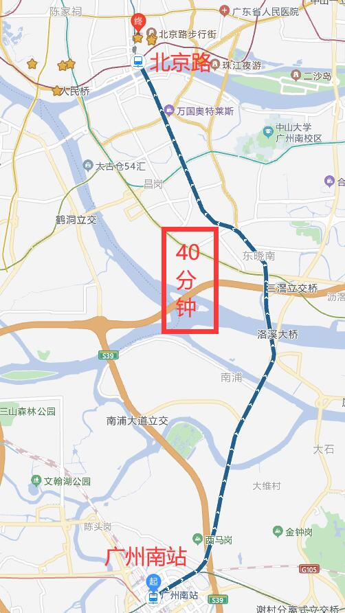
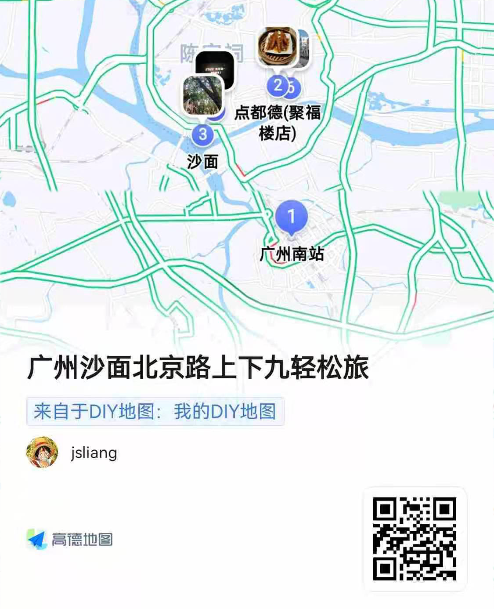
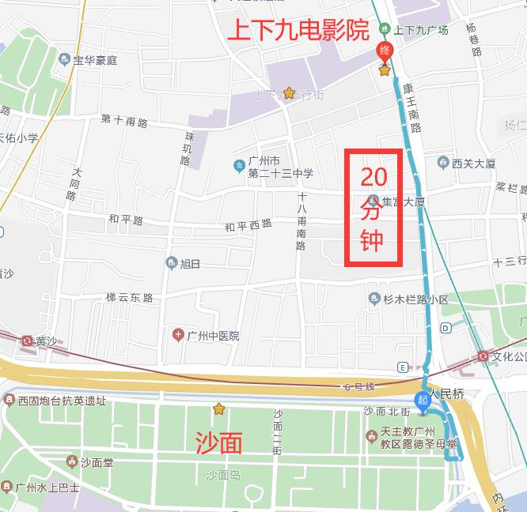
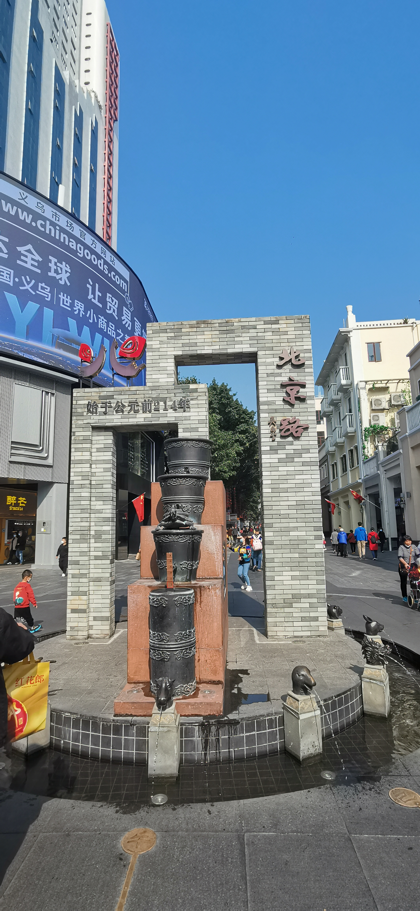
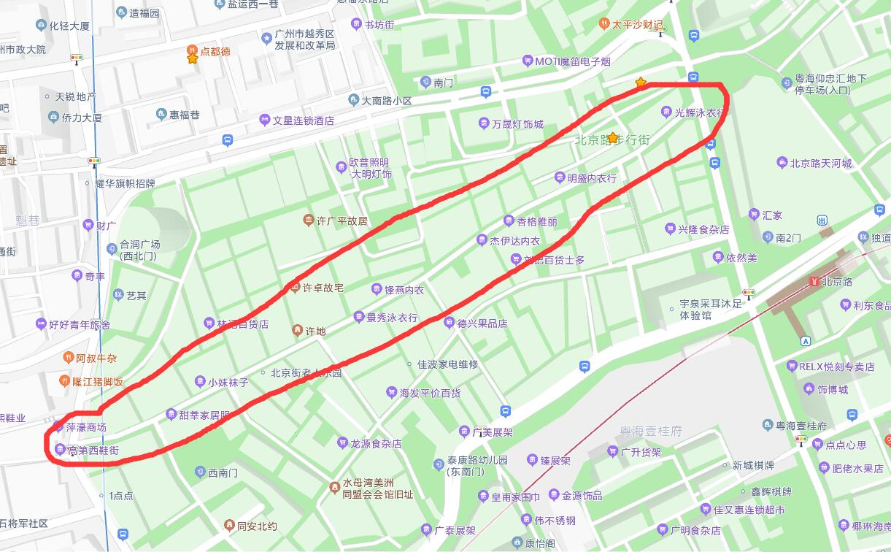
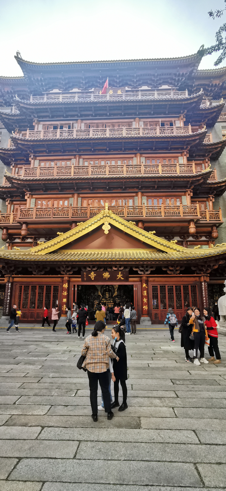

广东 - 011 - 广州沙面|北京路|上下九
===

> Create by **jsliang** on **2022-01-03 21:53:46**  
> Recently revised in **2022-01-03 23:20:22**

Hello 小伙伴们早上、中午、晚上好，避开了元旦的人流高峰，**jsliang** 于 2022.01.02 出去溜达了 2022 年的第一次轻松旅途。

因为最近 **jsliang** 和赵老师都比较累，赵老师还感冒了，所以俺们挑了一个比较放松的短线游完：

* 饮早茶 + 广州沙面 + 上下九 + 北京路

那么，Here we go~

## 旅游路线

因为 **jsliang** 目前还是在珠海，所以需要先搭乘地铁过去广州南站。

这里就不得不吐槽下「唐家湾站-广州南站」的奇葩设计：

要么，我就要痛苦地 6 点起来，然后赶 8 点的高铁；要么，我就只能磨蹭到 9 点，赶 11 点到广州南站的高铁。

> 真怀念住广州员岗的时候，早上直接高铁去深圳爬山的日子，同样都是 1 个种，「广州南站-深圳北站」，想去就去

所以先赶去广州南站，再赶去北京路，其实就已经是中午了（算不上早茶咯~）

这次的旅游全路线为：

Day 1：

* 「广州南站-点都德（北京路）」
* 「点都德-沙面」
* 「沙面-期遇*隽电影城（上下九）」

Day 2：

* 「北京路」

记不住的小伙伴可以扫码看路线：

## Day 1

因为这次主要是休闲，所以全程以放松为目的，那么 11 点多赶到北京路，首要任务是找吃的。

记得上一次吃点都德还是上一次，太久了记不得了，所以趁这次赶紧去溜达溜达：

这家店铺是高德地图上看到的，所以首要任务就是点大家的推荐：

* 「百合酱蒸凤爪 - ￥28」

有一说一从小吃到大的凤爪，这一次吃得只舔舌头，过了 2 天回忆起来就是：

* 软糯
* 骨肉分离
* 松脆

所以强烈推荐这个~

另外提醒下就是如果饭量都不是特别大的话，最好就点一份饭就好，这里边推荐：

* 「生炒燕麦糯米粉 - ￥20」

最后作为一枚广东靓仔，汤肯定不能少的：

* 「原只椰子炖竹丝鸡汤 - ￥31」

这样一份精致的菜单，你值得拥有，靓仔靓女下次记得请我去吃吃，哈哈~

最后贴下这次的菜单（上图从左到右菜名，上面没提到的不是强烈推荐）：

1. 「生炒燕麦糯米粉 - ￥20」
2. 「滋补猪脚姜 - ￥31」
3. 「招聘虾饺皇 - ￥29」
4. 「百合酱蒸凤爪 - ￥28」
5. 「腊味排骨蒸饭 - ￥29」
6. 「农家小米糕 - ￥18」
7. 「原只椰子炖竹丝鸡汤 - ￥31」

饮完早茶刚好下午快 14:00，所以这里不得不提一下就是，如果小伙伴们要过夜的，可以先安排一家旅馆，这样中午就能愉快地午休会（尤其对于 **jsliang** 这种吃饱就想睡的懒虫）

====== 切场景 ======

午休完后就可以前往沙面逛逛，有一说一来沙面真的很享受：

因为是知名的拍照景点，所以单身的小伙伴可以来这里欣赏靓仔靓女，情侣小伙伴可以来这里看看别人婚纱照，然后自己拍拍照啥的。

如果你还嫌不够享受，可以跟着叔叔阿姨们载歌载舞：

[视频](./img/guangdong-011-08.mp4)

====== 切场景 ======

看了一会后快 6 点了，因为元旦出了好几部片并且 **jsliang** 和赵老师也很久没看电影了，所以直接赶去上下九：

这两处距离 1km 左右，步行过去还行。

这次看的电影是：

* 《李茂扮太子》

评价？一部喜剧，就是末尾有点强行煽情感觉有点尬 0.0，不是专业的所以就不多评论和剧透啦~

看完后就逛逛上下九吃吃喝喝，这里需要提的一嘴是：

* 千万千万不要吃夜市那种熟食烧烤的摊子
* 千万千万不要吃夜市那种熟食烧烤的摊子
* 千万千万不要吃夜市那种熟食烧烤的摊子

因为 **jsliang** 点了个鱿鱼包饭，结果真的接受不了，我 ￥18 买的一只，吃了点皮就吐了，感觉像是放了好久死硬死硬，然后店家就过热了下……

就是小伙伴们晚上逛上下九，碰到鱿鱼包饭、熟制品烧烤这些，掂量下能不能吃，毕竟它们可能摆了一天了。

> 另：之前和小伙伴逛上下九看到过一些食物上面爬过蟑螂，我们当时还拍了照（估计 **jsliang** 翻相册还能找到给你）

So，Day 1 就这样轻松过啦~

## Day 2

因为 01.03（今天下午）要赶高铁，所以我们就简单逛了逛北京路。

给 **jsliang** 印象最深的还是：小伙伴们不要去「高第街」：

也只有 **jsliang** 这么厚脸皮的才能 hold 得住了，因为这一条街全是卖女性内衣内裤之类的，然后它长度 600m 左右，你可以想象下 **jsliang** 从街头走到街尾的感觉~

然后就是北京路的大佛寺：

这次还是没过去瞅一眼，因为人太多了~

简单来说北京路咱也不知道逛啥，赵老师和我都不咋线下购物的，所以瞎溜达就走了。

## 总结

这就是元旦小假期 **jsliang** 的小旅途啦，不知道小伙伴们看完有啥感觉~

欢迎小伙伴们介绍推荐自己的旅途，然后前面几期旅途小伙伴们有想去的也可以咨询 **jsliang**：

* [广东-001-珠海长隆](https://github.com/LiangJunrong/document-library/blob/master/%E7%B3%BB%E5%88%97-%E4%B8%AA%E4%BA%BA%E7%94%9F%E6%B4%BB/%E6%97%85%E6%B8%B8/%E5%B9%BF%E4%B8%9C-001-%E7%8F%A0%E6%B5%B7%E9%95%BF%E9%9A%86.md)
* [广东-002-东莞南社明清古村落](https://github.com/LiangJunrong/document-library/blob/master/%E7%B3%BB%E5%88%97-%E4%B8%AA%E4%BA%BA%E7%94%9F%E6%B4%BB/%E6%97%85%E6%B8%B8/%E5%B9%BF%E4%B8%9C-002-%E4%B8%9C%E8%8E%9E%E5%8D%97%E7%A4%BE%E6%98%8E%E6%B8%85%E5%8F%A4%E6%9D%91%E8%90%BD.md)
* [广东-003-顺德欢乐海岸](https://github.com/LiangJunrong/document-library/blob/master/%E7%B3%BB%E5%88%97-%E4%B8%AA%E4%BA%BA%E7%94%9F%E6%B4%BB/%E6%97%85%E6%B8%B8/%E5%B9%BF%E4%B8%9C-003-%E9%A1%BA%E5%BE%B7%E6%AC%A2%E4%B9%90%E6%B5%B7%E5%B2%B8.md)
* [广东-004-肇庆恒大世纪梦幻城](https://github.com/LiangJunrong/document-library/blob/master/%E7%B3%BB%E5%88%97-%E4%B8%AA%E4%BA%BA%E7%94%9F%E6%B4%BB/%E6%97%85%E6%B8%B8/%E5%B9%BF%E4%B8%9C-004-%E8%82%87%E5%BA%86%E6%81%92%E5%A4%A7%E4%B8%96%E7%BA%AA%E6%A2%A6%E5%B9%BB%E5%9F%8E.md)
* [广东-005-河源万绿湖](https://github.com/LiangJunrong/document-library/blob/master/%E7%B3%BB%E5%88%97-%E4%B8%AA%E4%BA%BA%E7%94%9F%E6%B4%BB/%E6%97%85%E6%B8%B8/%E5%B9%BF%E4%B8%9C-005-%E6%B2%B3%E6%BA%90%E4%B8%87%E7%BB%BF%E6%B9%96.md)
* [广东-006-广州珠江夜游](https://github.com/LiangJunrong/document-library/blob/master/%E7%B3%BB%E5%88%97-%E4%B8%AA%E4%BA%BA%E7%94%9F%E6%B4%BB/%E6%97%85%E6%B8%B8/%E5%B9%BF%E4%B8%9C-006-%E5%B9%BF%E5%B7%9E%E7%8F%A0%E6%B1%9F%E5%A4%9C%E6%B8%B8.md)
* [广东-007-东莞鸦片战争博物馆](https://github.com/LiangJunrong/document-library/blob/master/%E7%B3%BB%E5%88%97-%E4%B8%AA%E4%BA%BA%E7%94%9F%E6%B4%BB/%E6%97%85%E6%B8%B8/%E5%B9%BF%E4%B8%9C-007-%E4%B8%9C%E8%8E%9E%E9%B8%A6%E7%89%87%E6%88%98%E4%BA%89%E5%8D%9A%E7%89%A9%E9%A6%86.md)
* [广东-008-珠海淇澳岛](https://github.com/LiangJunrong/document-library/blob/master/%E7%B3%BB%E5%88%97-%E4%B8%AA%E4%BA%BA%E7%94%9F%E6%B4%BB/%E6%97%85%E6%B8%B8/%E5%B9%BF%E4%B8%9C-008-%E7%8F%A0%E6%B5%B7%E6%B7%87%E6%BE%B3%E5%B2%9B.md)
* [广东-009-广州番禺](https://github.com/LiangJunrong/document-library/blob/master/%E7%B3%BB%E5%88%97-%E4%B8%AA%E4%BA%BA%E7%94%9F%E6%B4%BB/%E6%97%85%E6%B8%B8/%E5%B9%BF%E4%B8%9C-009-%E5%B9%BF%E5%B7%9E%E7%95%AA%E7%A6%BA.md)
* [广东-010-白水寨](https://github.com/LiangJunrong/document-library/blob/master/%E7%B3%BB%E5%88%97-%E4%B8%AA%E4%BA%BA%E7%94%9F%E6%B4%BB/%E6%97%85%E6%B8%B8/%E5%B9%BF%E4%B8%9C-010-%E7%99%BD%E6%B0%B4%E5%AF%A8.md)

那么，我们下期见~

---

> jsliang 的文档库由 [梁峻荣](https://github.com/LiangJunrong) 采用 [知识共享 署名-非商业性使用-相同方式共享 4.0 国际 许可协议](http://creativecommons.org/licenses/by-nc-sa/4.0/) 进行许可。 基于 [https://github.com/LiangJunrong/document-library](https://github.com/LiangJunrong/document-library) 上的作品创作。 本许可协议授权之外的使用权限可以从 [https://creativecommons.org/licenses/by-nc-sa/2.5/cn/](https://creativecommons.org/licenses/by-nc-sa/2.5/cn/) 处获得。
