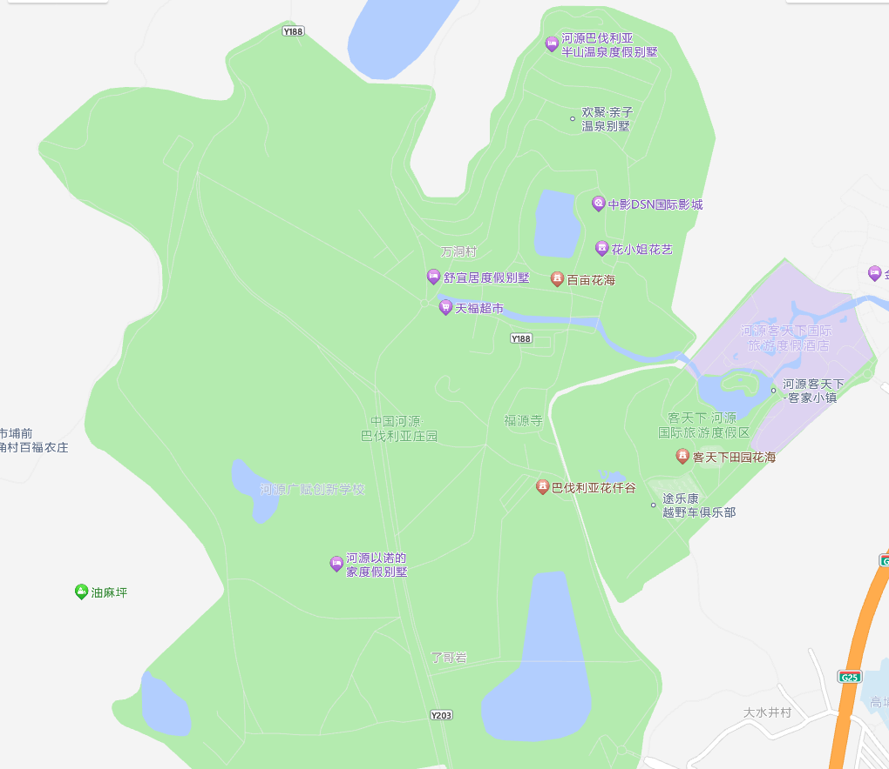
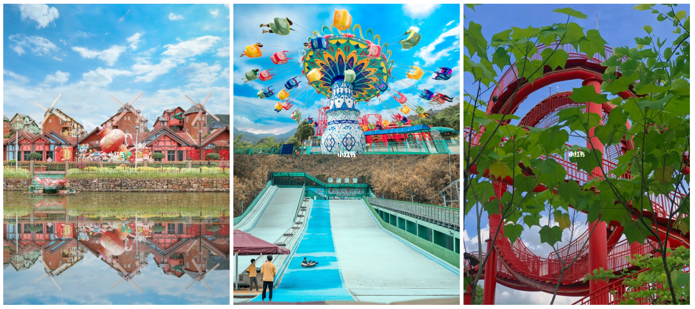
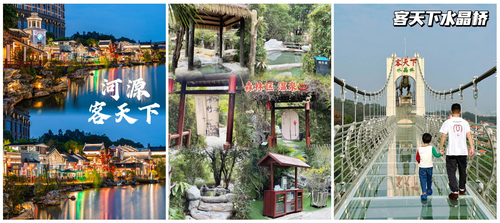
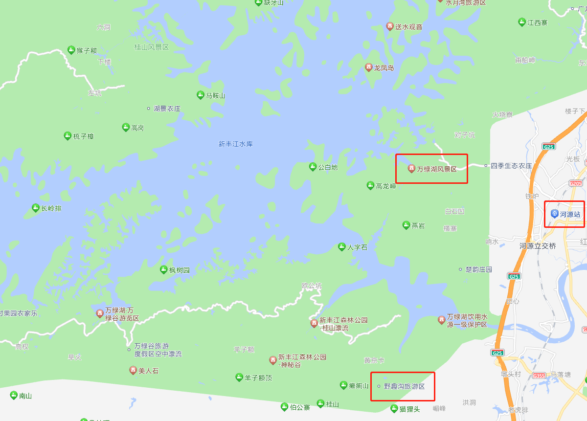
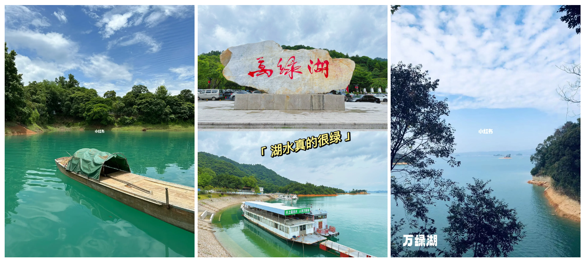
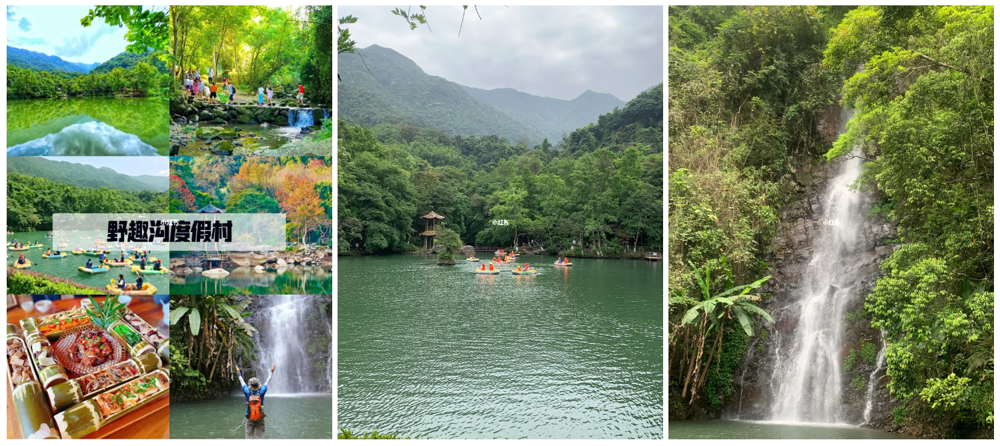

广东 - 013 - 河源
===

> Create by **jsliang** on **2023-07-21 08:09:05**  
> Recently revised in **2023-07-21 08:09:05**

Hello 小伙伴们好呀，我是爱折腾的 **jsliang**~

今天主要安利的，是「广东省/河源市/源城区」附近的逛吃逛吃。

特别适合 2 天 1 夜、3 天 2 夜出行计划的小伙伴，快安利起来吧！

> 更多了解欢迎加 WX：Liang123Gogo

## 一、前言

正所谓旅游别问本地人，因为本地人吃喝在家里，出行小圈子。

**jsliang** 能在河源找到旅游的感觉，是从村里跑到河源源城的时候，天天骑着一辆破单车，或者开着十一路车四处乱逛。

当然，有朋自远方来，攻略得做乎！

那就做一个客家靓仔对河源吃喝玩乐的整理吧~

## 二、玩

金山银山，不如绿水青山，是河源发展的策略。

正如去广东顺德是奔着吃的目的，去广东河源抱着逛吃逛吃的目的是正确的。

### 1.1 巴伐利亚庄园 & 客天下度假区

**首先**，映入眼帘的，是「巴伐利亚庄园」和「客天下度假区」这一片旅游区：

**然后**，对于「巴伐利亚庄园」，网友点赞 “广东河源的童话小镇”

可游完项目：

* 黑森林乐园。缆车、极速滑雪、迪士高、电玩游戏城等
* 巴伐利亚大桥
* 花纤谷
* 福源寺祈福
* 冰雪世界
* 国医国药温泉。22:00 关门
* ……

风景参考：

> 图片来源于网络，侵权必删！

**然后**，对于「客天下度假区」，网友点赞 “休闲度假圣地”

可游完项目：

* 冰雪乐园。以恐龙为主题的冰雪乐园，园内设有冰雕观赏区、雕刻体验区、滑雪游乐区等
* 丛林乐园。老少皆宜，户外运动，林间设置了各种难易不同的闯关项目以供冒险
* 田园花海。占地面积 150 多亩，浪漫花海、农庄牧场、野炊烧烤，各个区域由花海相连
* 客家小镇。有着典型的客家建筑，也有客家特色美食可以品尝
* 水晶玻璃桥。全场 288 米，高约 100 米

风景参考：

> 图片来源于网络，侵权必删！

**最后**，注意啦！！！

景区酒店不排除躺雷风险，众所周知风景区附近的都不会有特便宜的，小伙伴理性消费哈~

当然，有钱人不差两个仔儿的随意~

建议还是逛逛就好，吃喝的自己看看荷包和看看里面物价就好。

### 1.2 万绿湖风景区 & 野趣沟风景区

**首先**，映入眼帘的，是「万绿湖风景区」和「野趣沟风景区」这一片旅游区：

**然后**，对于「万绿湖风景区」，网友点赞 “天上瑶池水，人间万绿湖”。

可游完项目：

* 游船
* 皮划艇

作为某矿泉水的取水点之一，万绿湖风光是不错的，地方很美，风景宜人，休闲观光好去处。

不过 2021 年国庆去过一趟，碰巧水位下降，所以观光兴致略微不好。

但是去河源没看过万绿湖，跟别人讨论旅游可能会被嘲笑，所以还是贴贴图，感兴趣的小伙伴可自行前往。

风景参考：

> 图片来源于网络，侵权必删！

**然后**，对于「野趣沟风景区」，网友点赞 “天然氧吧”

游完项目：

* 漂流
* 观赏瀑布
* 摸鱼抓虾
* 丛林探险

在万绿湖风景区附近的野趣沟，空气清晰、山水清凉、让人能褪去疲惫，放松心情。

风景参考：

> 图片来源于网络，侵权必删！

**最后**，对于里面的旅游产品，请谨慎消费。

如果是万绿湖推荐的淡水鱼产品等内容，可以网上搜同款或者去景区外的特产店购买（怕你们躺坑）

如果是野趣沟的竹筒饭之类的，有那种场景吃起来才香的，看个人喜好（价格估计不会便宜）

注意了注意了注意了！！！

河源物价对标广州，土著基本吃的也是常去的几家馆子，特别一些馆子价格会离谱很多。

## 二、吃

在河源，吃的不用太焦虑，越是好吃的可能越不显眼。

比如地方偏僻的一家农庄，又或者是一家普通宵夜档。

这里不推荐餐馆，因为每个人的口味都是不同的！

看别人各种推荐，还不如自己对着下面的推荐食物，各种 APP 搜一下排行靠前的、有制作这些美食的餐馆~

### 2.1 煎酿食物

去河源不得不吃的美食，很多人会说「煎酿三宝」「煎酿四宝」。

大部分原因就是在客家人的眼中，什么都可以做煎酿。

* 酿豆腐
* 酿茄子
* 酿苦瓜
* 酿青椒
* ……

所以搜索美食的时候，一定要找一家有煎酿食物的店铺试试！

### 2.2 五指毛桃食物

**jsliang** 的同事和粉丝们，一定看 **jsliang** 给安利过「五指毛桃鸡」。

所以如果去河源，吃一下五指毛桃食物也不为过：

* 五指毛桃汤

### 2.3 其他

* 娘酒醉河虾
* 上汤桂花鱼
* 

---

**不折腾的前端，和咸鱼有什么区别！**

觉得文章不错的小伙伴欢迎点赞/点 Star。

如果小伙伴需要联系 **jsliang**：

* [Github](https://github.com/LiangJunrong/document-library)
* [掘金](https://juejin.im/user/3403743728515246)

个人联系方式存放在 Github 首页，欢迎一起折腾~

争取打造自己成为一个充满探索欲，喜欢折腾，乐于扩展自己知识面的终身学习斜杠程序员。

> jsliang 的文档库由 [梁峻荣](https://github.com/LiangJunrong) 采用 [知识共享 署名-非商业性使用-相同方式共享 4.0 国际 许可协议](http://creativecommons.org/licenses/by-nc-sa/4.0/) 进行许可。 基于 [https://github.com/LiangJunrong/document-library](https://github.com/LiangJunrong/document-library) 上的作品创作。 本许可协议授权之外的使用权限可以从 [https://creativecommons.org/licenses/by-nc-sa/2.5/cn/](https://creativecommons.org/licenses/by-nc-sa/2.5/cn/) 处获得。
