湖南 - 001 - 郴州
===

> Create by **jsliang** on **2023-08-20 18:00:06**  
> Recently revised in **2023-08-20 19:26:20**

这是一篇根据去年国庆游完经验 + 某书教程，进行总结的湖南郴州的攻略，如有不足，请多指正。

郴州初印象，大抵是吃鱼，还有就是游山玩水。

## 一、吃喝

### 1.1 鱼汤/鱼粉 ☆☆☆☆☆

超喜欢，这里的鱼汤、鱼粉有些做的是真不错。

强烈推荐图二的鱼汤，我一口气直接干完了，里面的汤底非常 nice！

> 忘记是黄骨鱼还是啥品种了，反正郴州的鱼汤/鱼粉还是推荐的

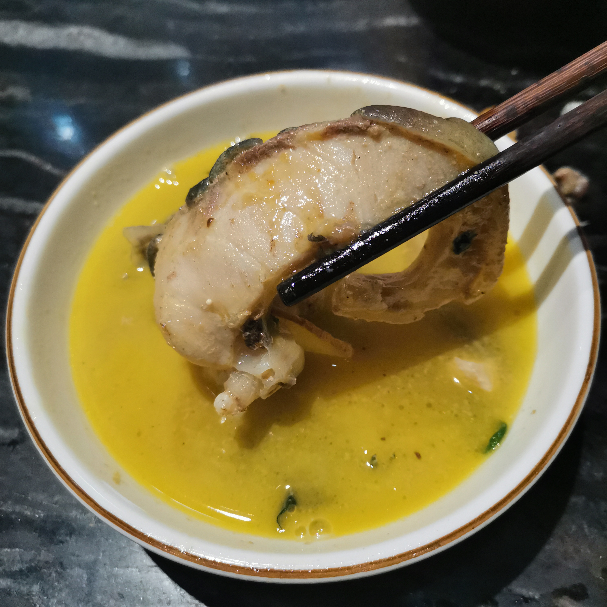

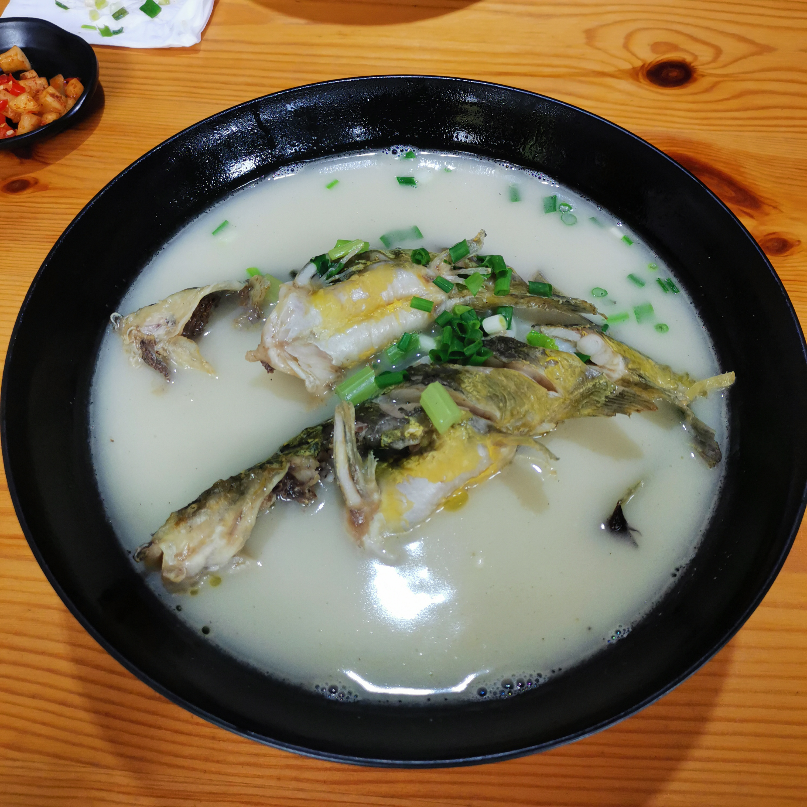

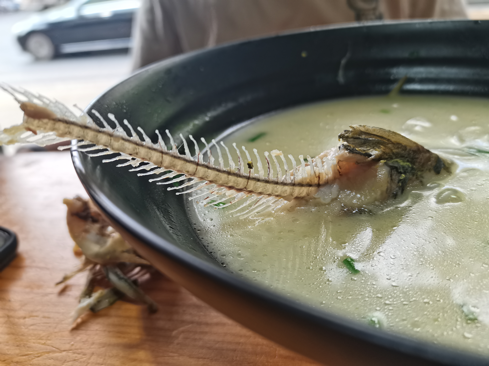

### 1.2 杀猪粉 ☆☆☆

说到这里的杀猪粉，可能因为我吃的是路边摊，所以我感觉还不如下图的河源猪脚粉。

如果小伙伴们想尝试的话，尽量先叫一碗小的杀猪粉试试，本广东河源靓仔可能没吃到真实的杀猪粉，这里就不贴图了。

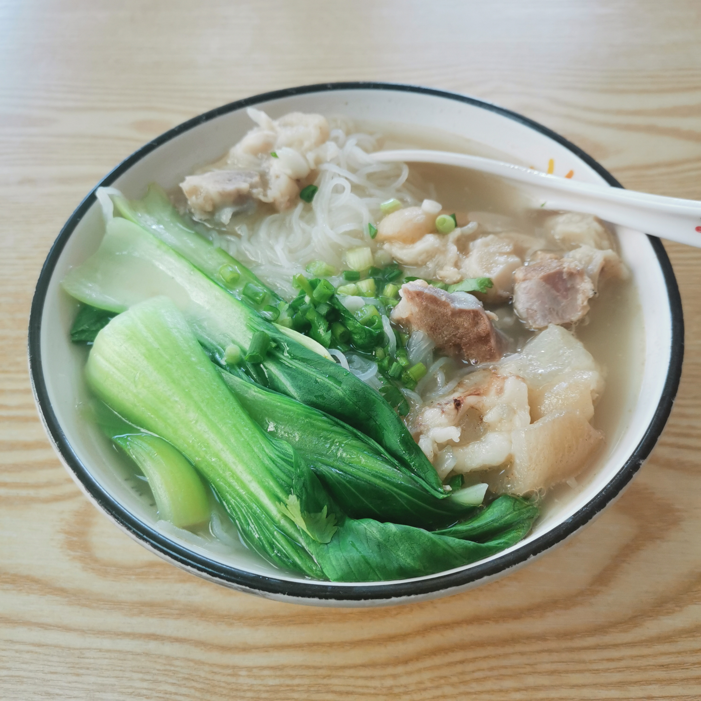

> 河源猪脚粉

### 1.3 不推荐 ☆

下面对于广东人来说，不咋推荐的菜品：

* 柴火鸡/烧鸡公。简单来说就是在灶台里面加柴火烧出来的鸡，广东靓仔靓女可能会毫无感触（尤其夏秋吃这个更不推荐，柴火热啊）

## 二、玩乐

玩乐注意事项：

1. **注意防晒**。2022 年国庆去高椅岭的时候，我出来后，那把伞的铁伞柄已经发烫了，而且我的伞是二层防护（黑 + 黑胶）
2. **带多点水**。还是高椅岭，景区水又贵，天气又热，每人至少带 3 瓶 500ml+ 的水，要不然真的撑不住。
3. **注意天气**。东江湖的雾气有生成条件的，有些情况下可能看不到的喔~

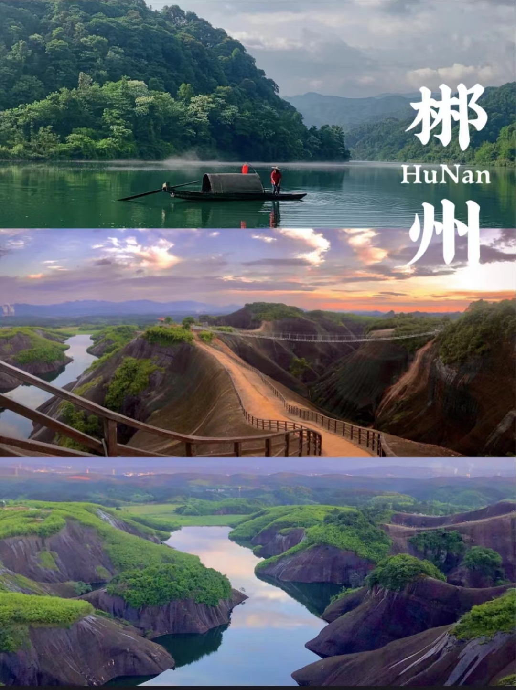

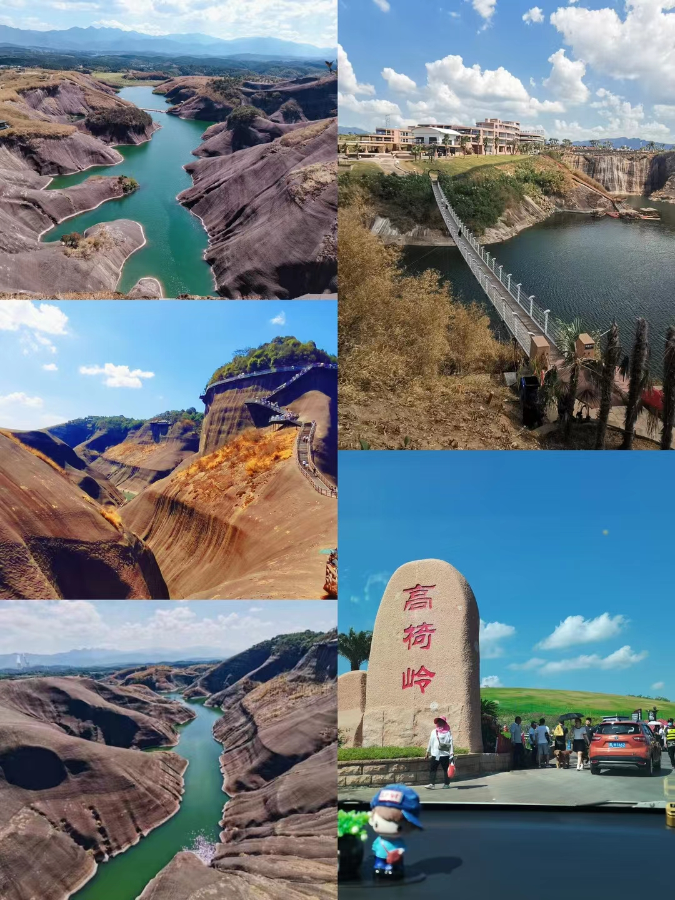

### 2.1 东江湖

东江湖的游玩，大多是奔着「仙气飘飘、渔夫撒网」的氛围去的，所以你需要：

1. 住在靠近东江湖的酒店，或者能够便捷抵达东江湖的位置
2. 早起
3. 搭车到东江湖附近，然后骑行小型交通工具/步行过去

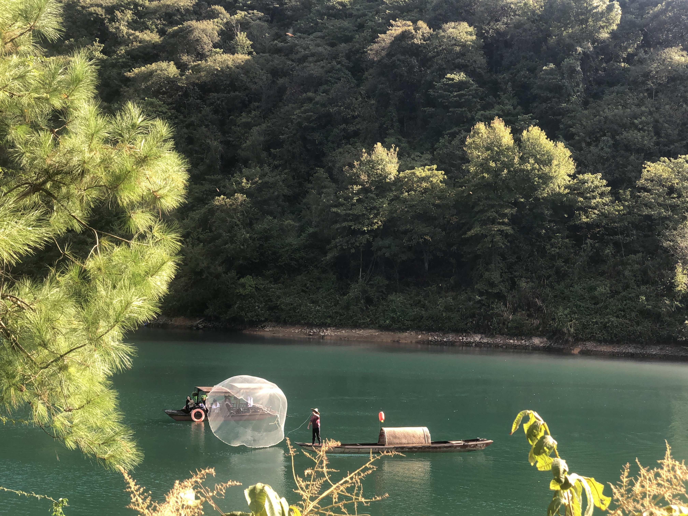

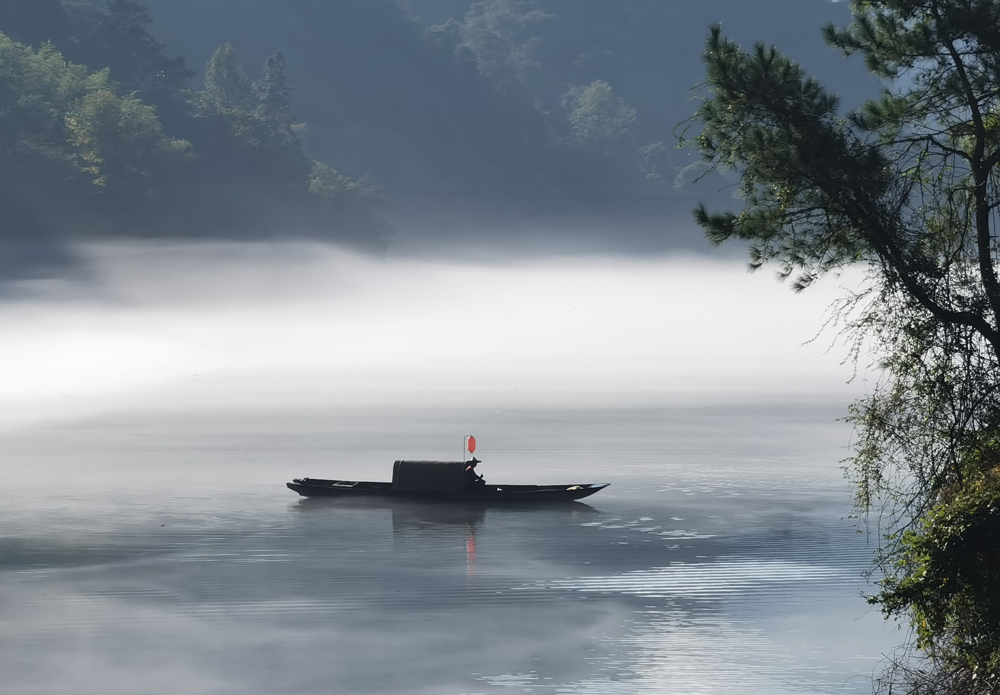

强调一下，如果是寒暑假和节假日，人从众，所以尽量安排好时间，要不然进景区的排队都要让你崩溃~

### 2.2 高椅岭

带上你能爬山的朋友，然后出发吧！

什么，你朋友不喜欢爬山？那你们在门口看看就好了，或者到山顶走捷径下来！

喀斯特地貌确实让人眼前一亮，但是恶毒的天气也能让你眼前一黑！

哎嘿，主打的就是一个 roguelike~

> 注意，天气炎热的情况，每人至少备好 3 支水！

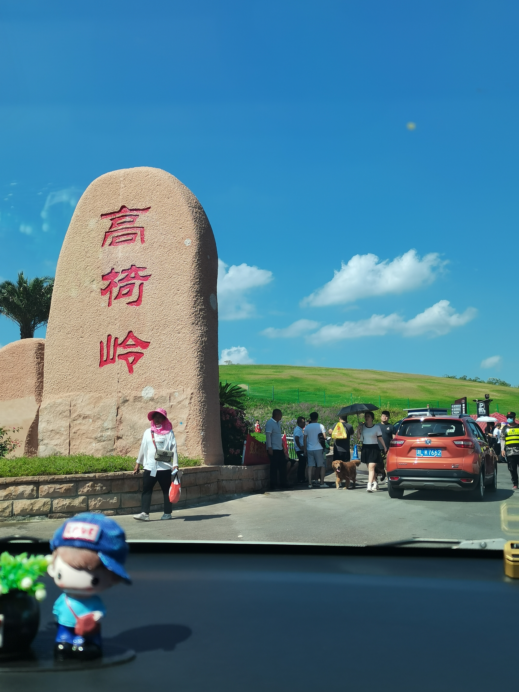

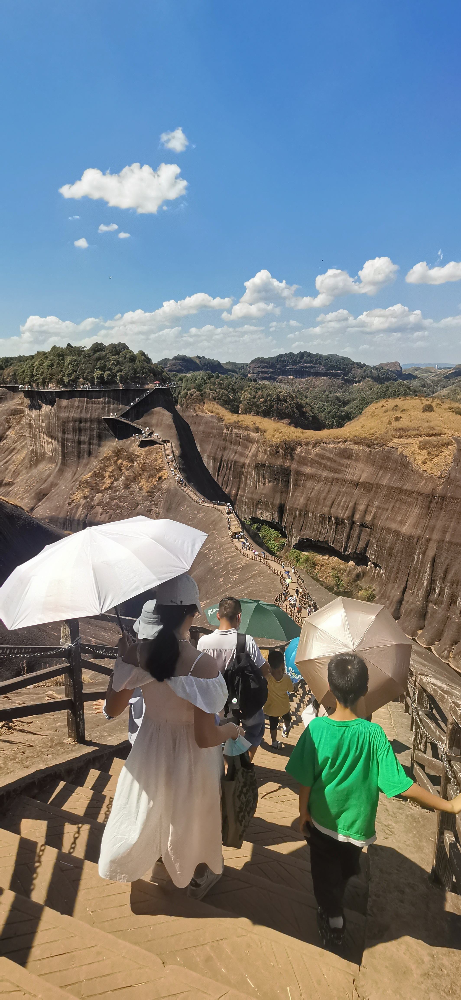

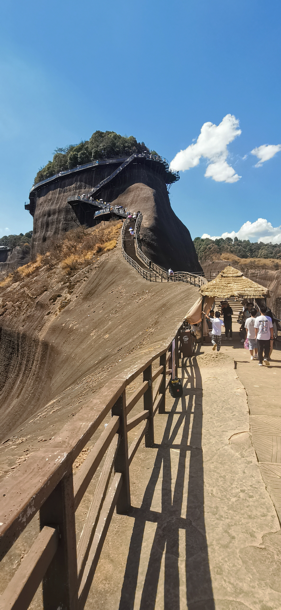

### 2.3 仰天湖

我没去。

听说这个「仰天湖大草原」是郴州的一个特色草原风景区。

但是因为当时比较赶，所以这个大草原没去，这里贴下网图，感兴趣的小伙伴可尝试打卡。

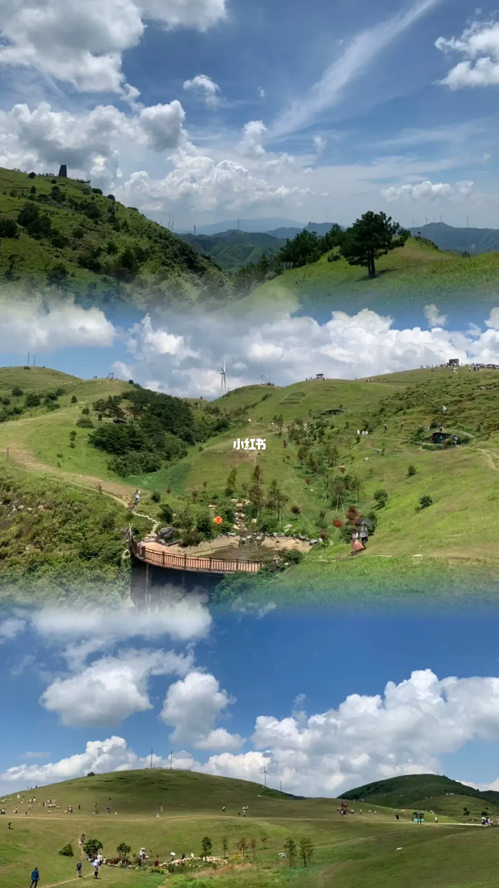

## 三、安全和提示

1. 假司机。路边的司机啥的，注意安全呀，尽量网约车咯
2. 假游客。网上看到 XX 游客的 XX 攻略，推荐的司机、旅游团、酒店啥的，一百个小心眼都有
3. 景点食物/礼品。一般来说，我是能不买就不买，毕竟懂的都懂

以上，小伙伴们安排自己出行的话，尽可能轻松愉快一点啦~

不要安排地太过紧凑了，毕竟郴州还是希望逛吃逛吃为主，而不是搞特种兵式出行！

---

**不折腾的前端，和咸鱼有什么区别！**

觉得文章不错的小伙伴欢迎点赞/点 Star。

如果小伙伴需要联系 **jsliang**：

* [Github](https://github.com/LiangJunrong/document-library)
* [掘金](https://juejin.im/user/3403743728515246)

个人联系方式存放在 Github 首页，欢迎一起折腾~

争取打造自己成为一个充满探索欲，喜欢折腾，乐于扩展自己知识面的终身学习斜杠程序员。

> jsliang 的文档库由 [梁峻荣](https://github.com/LiangJunrong) 采用 [知识共享 署名-非商业性使用-相同方式共享 4.0 国际 许可协议](http://creativecommons.org/licenses/by-nc-sa/4.0/) 进行许可。 基于 [https://github.com/LiangJunrong/document-library](https://github.com/LiangJunrong/document-library) 上的作品创作。 本许可协议授权之外的使用权限可以从 [https://creativecommons.org/licenses/by-nc-sa/2.5/cn/](https://creativecommons.org/licenses/by-nc-sa/2.5/cn/) 处获得。
