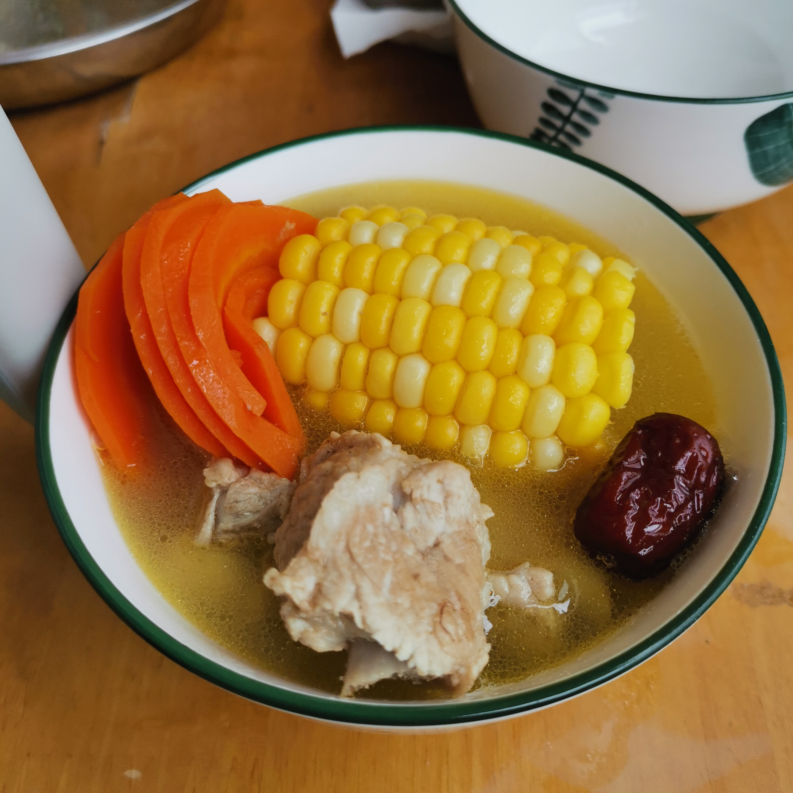
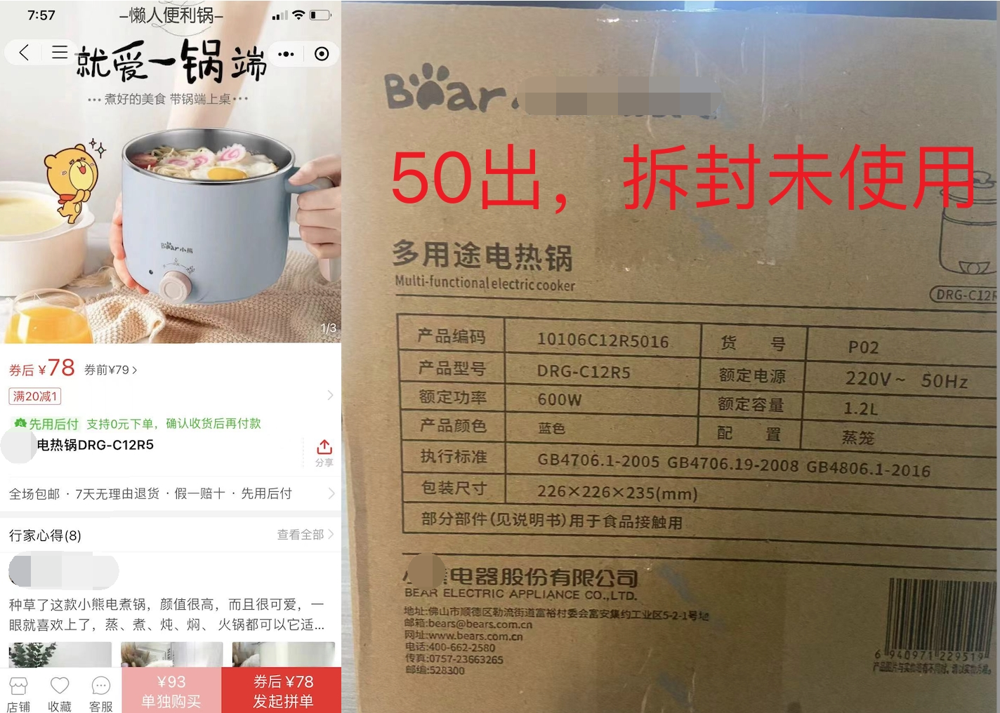
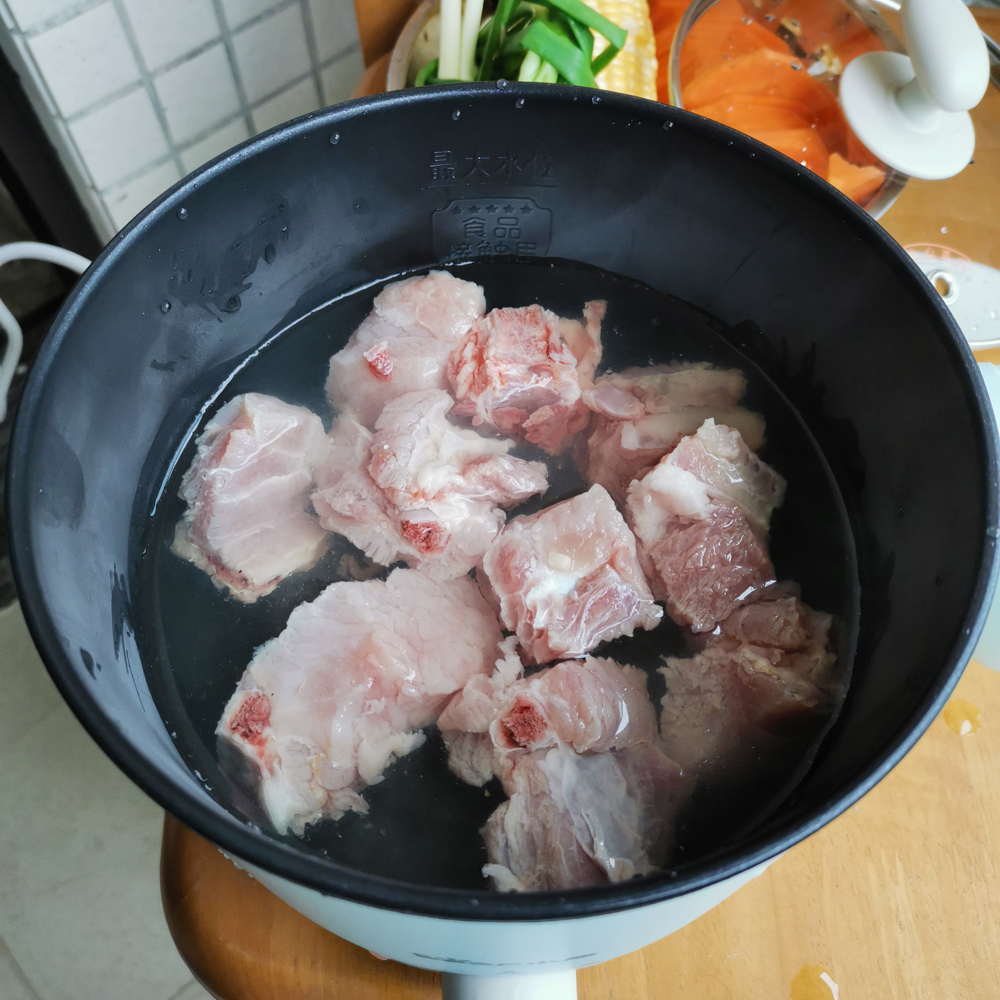
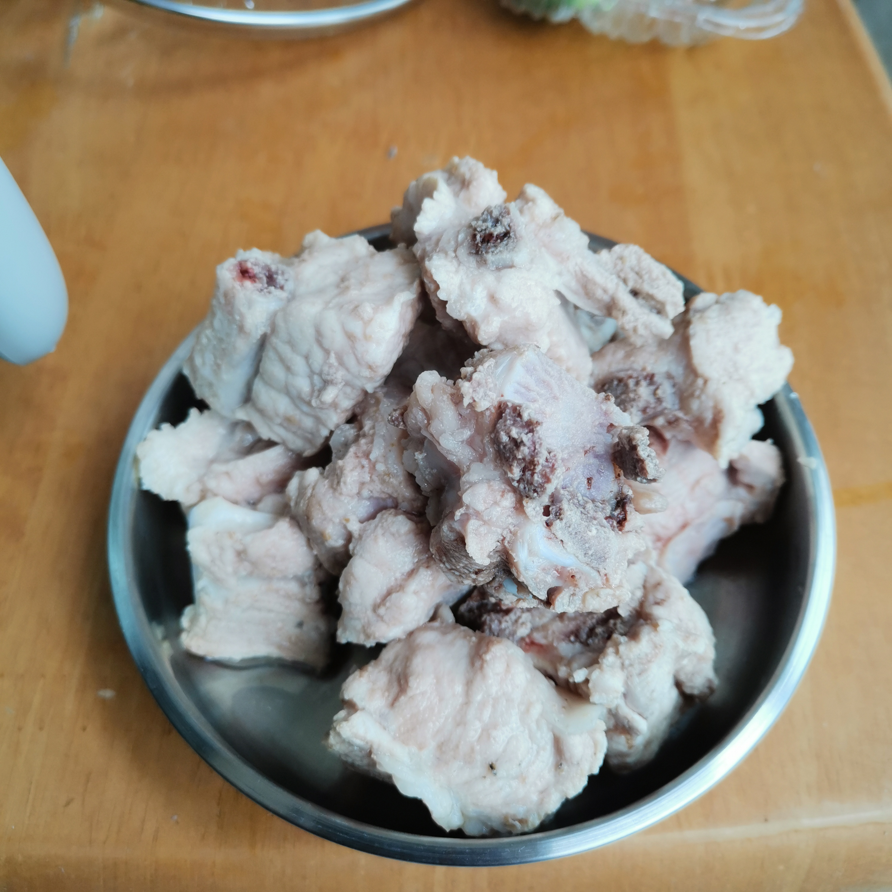
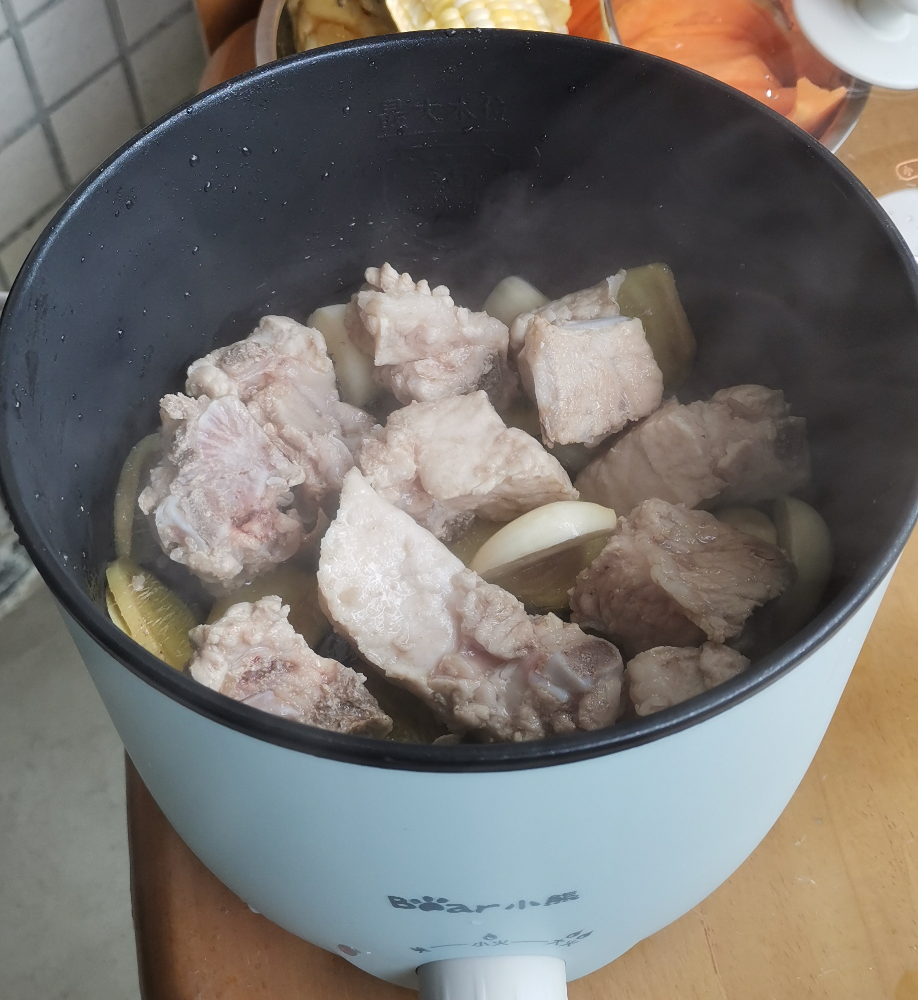
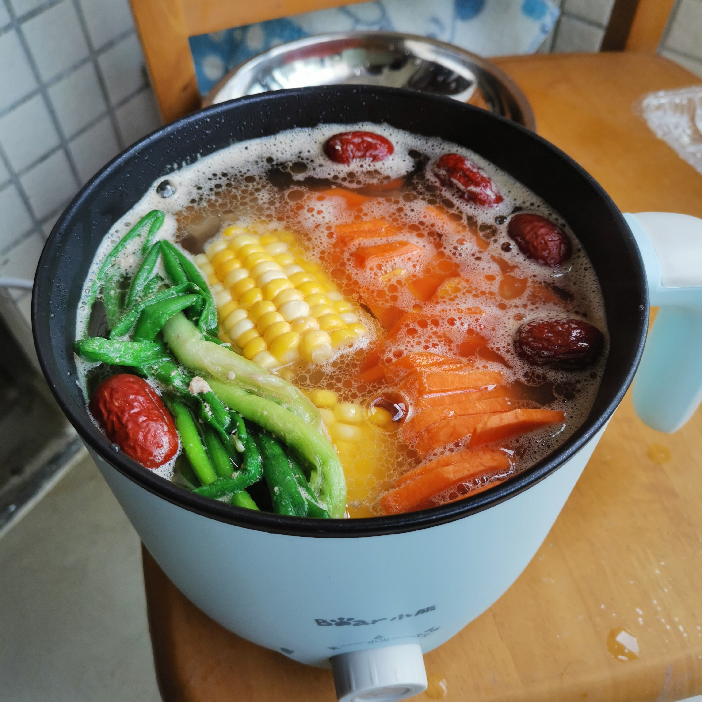
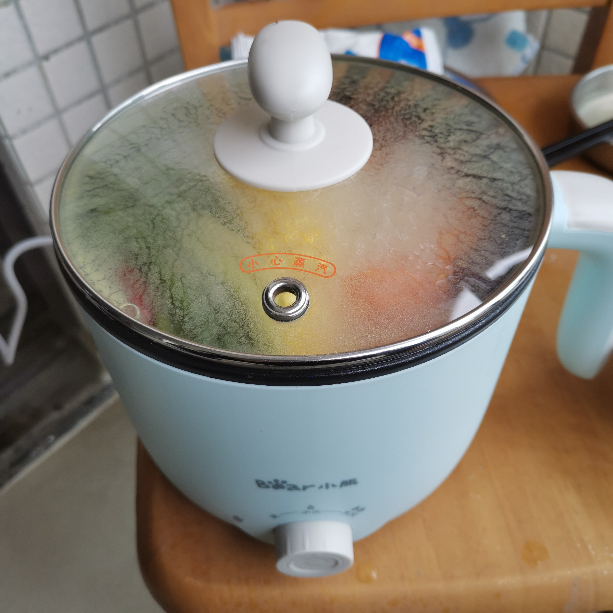
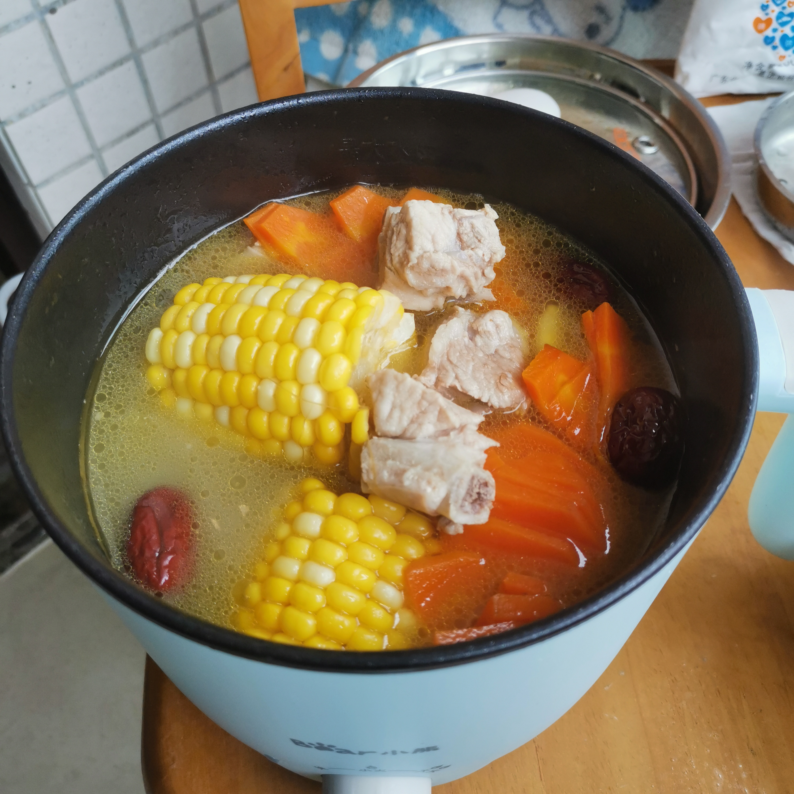

001 - 玉米胡萝卜排骨汤「程序猿烟火气」
===

> Create by **jsliang** on **2023-02-04 21:21:25**  
> Recently revised in **2023-02-04 22:02:59**

最爱人间烟火气，咕噜冒泡享生活。

—— 繁忙的工作，冗余的代码，不知道能更新几期的烹饪系列

「这个程序猿在厨房笨手笨脚有点不太聪明的亚子」

## 一 材料

* 排骨 1 份
* 玉米 1 条
* 胡萝卜 1 条
* 葱姜蒜各 50g
* 料酒一丢丢
* 花生油一丢丢
* 盐一丢丢
* 红枣 4/5 个

下面是购物清单：

> 求求你有条件的去个菜市场吧，外卖真的贵，还不容易掂量吃的多少

> 排骨 250g 大约 12 块，下面有图，自己掂量

另外，友情提示，第一次下厨的，还需要：

* 菜刀 1 把
* 砧板 1 个
* 菜碟 2 个（装材料）
* 蒸炖焖一体锅 1 个
* 碗 2 个

> jsliang 收购的一个小锅

## 二 过程

### 2.1 处理素材

### 2.2 煮开排骨血水

小锅加水，放「排骨」，将血水煮出，再捞出，洗锅

### 2.3 小煎一会

1. 小锅洗净，过热，蒸发去水
2. 加「油」，加「姜片」「蒜片」「排骨」，将「排骨」煎至微微焦黄

### 2.4 加水加配料

1. 加水，想喝多少碗加多少。
2. 放上「玉米」「胡萝卜」「红枣」

> 注：这里可以不加「葱」，建议葱切碎，后面出锅前 5 分钟加！

### 2.5 小火 30 分钟 - 1 小时

上盖子，小火炖 30 分钟 - 1 小时

### 2.6 出锅食用

---

**不折腾的前端，和咸鱼有什么区别！**

觉得文章不错的小伙伴欢迎点赞/点 Star。

如果小伙伴需要联系 **jsliang**：

* [Github](https://github.com/LiangJunrong/document-library)
* [掘金](https://juejin.im/user/3403743728515246)

个人联系方式存放在 Github 首页，欢迎一起折腾~

争取打造自己成为一个充满探索欲，喜欢折腾，乐于扩展自己知识面的终身学习斜杠程序员。

> jsliang 的文档库由 [梁峻荣](https://github.com/LiangJunrong) 采用 [知识共享 署名-非商业性使用-相同方式共享 4.0 国际 许可协议](http://creativecommons.org/licenses/by-nc-sa/4.0/) 进行许可。 基于 [https://github.com/LiangJunrong/document-library](https://github.com/LiangJunrong/document-library) 上的作品创作。 本许可协议授权之外的使用权限可以从 [https://creativecommons.org/licenses/by-nc-sa/2.5/cn/](https://creativecommons.org/licenses/by-nc-sa/2.5/cn/) 处获得。
