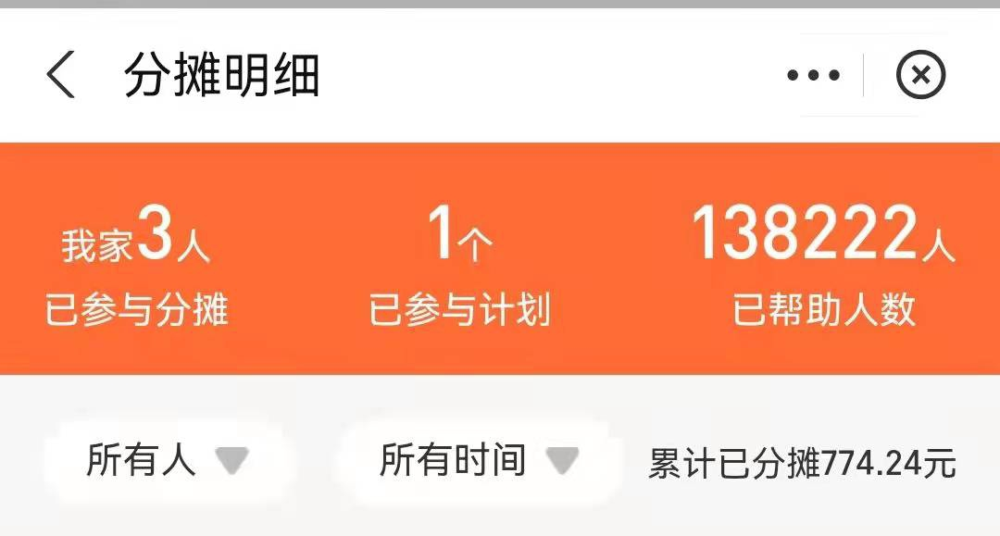
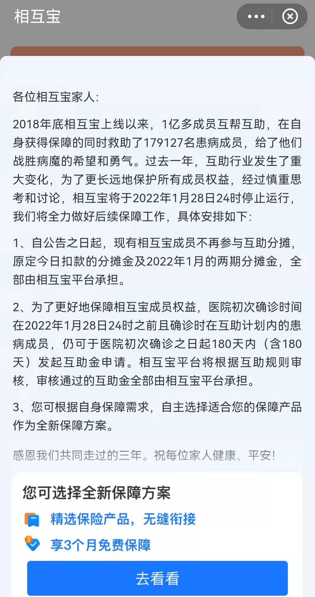
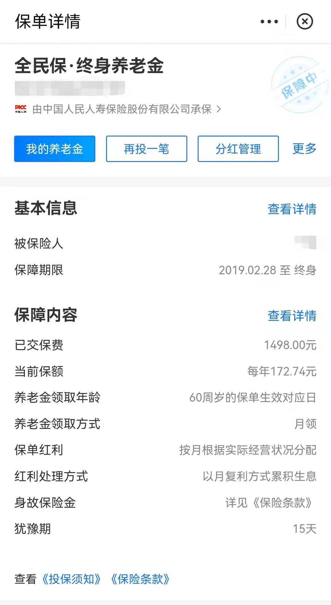

0104 - 相互宝关闭分析
===

> Create by **jsliang** on **2022-01-04 22:09:13**  
> Recently revised in **2022-01-04 22:09:13**

在 2021 年年底，**jsliang** 突然收到消息，每个月扣我 20 多块钱（3 个人 1 个月费用）的相互宝要关闭了！



这一消息如同惊天巨雷，直接把我惊醒了，所以直接划拉到我的分摊总结界面：



对于我这种从它运营就开始加入的人来说，其实一开始是冲着它能当后背保险用来的。

后面就没特别关注过，只知道它的收费是越收越多，从几毛钱一个月到后面 6/7 块钱。

庆幸投保的 3 年家人和自己没灾没病的同时，也为它突然关闭感到迷惑无语！

因此，为了这「区区」￥774.24 元，我查了几天的资料，就是想了解下面几点内容：

1. 为什么「相互宝」会关闭，关闭背后的真相是什么？
2. 「相互宝」剩余的钱被带去哪了，媒体说的关闭后支出 30 亿是真的吗？
3. 我从 2019 投保的「全民保·终身养老金」也会突然关闭吗？
4. 对于后续「支付宝」的相关产品需要怎么警惕？

> 注：因为不是专业人士，所以这里不会有各种专业角度的分析，而是从一个「用户」角色看待这个问题，惊醒自己同时给大家做个剖析

## 一、探索问题及自我解答

### 1.1 为什么「相互宝」会关闭，关闭背后的真相是什么？

从网上查询资料的过程中，会看到很多资料讲解「相互宝」的起源、历史使命等内容，这里简要介绍下：

1. 因为网络互助低门槛和普惠等角度，所以从 2011 年开始各个互助平台相继成立，包含支付宝、美团、京东、百度、新浪、360 等头部互联网平台
2. 因网络互助不是保险，它随时都有可能被关闭，所以在各种原因下，各大平台又相继跑路了

很戏剧性的一个故事：我闻到了这里面的商机，但是这只螃蟹太硬了，吃到后面壳都被我仍了。

那么，话归正题，「相互宝」关闭的背后是有什么缘故？

**首先，缺乏有效的监督**。

相互宝是一个互助计划，重点是「互」而不是「保」，它不是保险，不适用于国家的一些法律约束，平台话事权大，它可以随时更改互助内容，例如将癌症列为轻症：

* 《知乎 - 精算猫 - 相互宝规则说改就改，是拿我们当“傻子”？》https://zhuanlan.zhihu.com/p/100457559

**然后，没有基准的条款**。

同样一个病，它可以称为 A，又可以称为 B，然后相互宝将 A 列入到条款中，B 没有列入。

结果戏剧性场景出现了，成员的主治医师用 B 来列名称的，那么该成员可能在所谓的「陪审团」面前就不能得到很好的支持。

同时，「相互宝」类似人治，而人治有相应缺陷的，就是往往依据人的主观能动性，带有人的感情来投票，如果你的命把控在一群感性的人手上，那无疑是可怕的！

**最后，不能得到持续的新鲜血液注入**。

假设相互宝的成员上限为 1 亿用户，他们的年龄都是 50 岁，然后每年注入的用户成员为 1000 万，那么，在 10 年后，受身体情况影响，将有越来越多的人申请互助，从而导致每个人均摊的费用将越来越高，最终导致崩盘。

当然，网上剖析的点有很多，这里边我就只列我印象比较深刻的，感兴趣的小伙伴可以看我下面列的参考文献。

### 1.2 「相互宝」剩余的钱被带去哪了，媒体说的关闭后支出 30 亿是真的吗？

在一篇文章中提到：

```
为此，相互宝非但不存在卷钱跑路，还需要额外付出 30 亿左右的支出。
撑到最后一刻，承担应尽的责任，做好善后，遗憾告别，
说这是相互宝留给大部分业内外人士的最后印象，较为公允。
```

* 《证券时报网 - 蒋光祥 - 相互宝使命达成，有遗憾但无需叹息》https://stock.stcn.com/djjd/202201/t20220104_4036581.html

那这句话到底是事实，还是媒体的强行挽尊，为此我这边特意去搜索下相关资料。

但是令我诧异的是，我换了好几个关键字，换了 Google、百度、Bing 等平台，每个关键字的搜索结果我都翻了前面的近 20 来条资料，也没找到相应资料，是我关键字有误？

关键字列表：

1. 相互宝 关停 钱走向
2. 相互宝 钱 结余
3. 相互宝 后续

最后只查找到一些预估算：

```
相互宝的公告显示，自公告之日起，成员不再参与互助分摊
在 1 月 28 日关停日之前的三期分摊，都将由相互宝平台承担
按照 12 月第二期分摊金约 5.6 亿估算，在这一项上，相互宝平台就至少要掏出 16 亿的成本。
……
……
因此，此次关停，由于成员规模大，相互宝平台需要承担的成本也较其他互助平台高出许多，将至少达到 30 亿元。
```

然而，我对这个搜索结果并不满意：

* 根据搜索资料显示的 2020 就能收取 7.29 亿巨额运营费用的情况下，2022 关闭后剩余多少钱，剩余的钱流到哪了？

表示后续会持续关注，这是个困扰我的问题！

### 1.3 我从 2019 投保的「全民保·终身养老金」也会突然关闭吗？

在「相互宝」关停的后续，我的眼光也瞄向我在支付宝投资的另一个项目：

* 产品：「全民保·终身养老金」
* 保障期限：2019.02.28 至终身
* 已交保费：￥1498.00
* 当前保费：￥172.74/年

它也会像「相互宝」一样直接被关停吗？在未来的日子里，如果它被关停了我要怎么办？



* **中国人保集团** 旗下 **人民人寿保险公司** 承保的一款产品
* 一旦存入，最好能够长期持有；如果中途退保，别说投资收益了，本金也可能会有损失。
* 支付宝的这款全民保终身养老金本质是一款分红型的年金险，对于年金险这类保险理财，深蓝君之前就明确表达过态度，不太建议普通家庭购买，不仅收益低，也几乎没有保障作用。
* 所以金融产品不能只看收益，还是要结合自己的需求来考虑

### 1.4 对于后续「支付宝」的相关产品需要怎么警惕？


## 参考文献

* 《知乎 - 精算猫 - 相互宝规则说改就改，是拿我们当“傻子”？》https://zhuanlan.zhihu.com/p/100457559
* 《证券时报网 - 蒋光祥 - 相互宝使命达成，有遗憾但无需叹息》https://stock.stcn.com/djjd/202201/t20220104_4036581.html
* 《搜狐 - 观察者网 - 曾经帮助过 18 万人的蚂蚁相互宝告别后，穷人的保险由谁来保障？》https://www.sohu.com/a/514327472_115479
* 《搜狐 - 搜狐科技 - 速览 | 蚂蚁相互宝将 1 个月后关停：分摊金上涨超两百倍，已有十家互助平台关闭 》https://www.sohu.com/a/512476306_115565
* 《深蓝保 - 垦厕 - 相互宝分摊的钱能退回吗？》https://www.shenlanbao.com/wenda/12-13769
*  《中国财经 - 唐亚华 - 风波中的相互宝：诱导开通、私自扣费、理赔难？》http://finance.china.com.cn/money/insurance/20200713/5316986.shtml
*  《网易 - 北京商报 - 相互宝宣布关停 平台方将承担 30 亿成本 十年网络互助集体谢幕》https://www.163.com/dy/article/GSB3I5030519DFFO.html
*  《新浪科技 - 相互宝 2020 年运营成绩单：用户过亿却尚未盈利，开年来 300 万人退出大病互助》https://finance.sina.com.cn/tech/2021-03-04/doc-ikftssaq1120768.shtml
*  《知乎 - 奶爸保-嘉林 - 支付宝的全民保·终身养老金怎么样？》https://www.zhihu.com/question/289490693
*  《什么值得买 - 明亚高级保险经纪人 - 支付宝全民保终身养老金保险怎么样？适不适合你？》https://post.smzdm.com/p/a783xn75/
* 《bilibili - 财可夫斯基 - 相互保说停就停，7500 万人的救命钱怎么办？！》https://www.bilibili.com/video/BV1hm4y1Q7vq
* 《bilibili - 浪浪历险计 - 【浪浪】为什么相互宝即将停止？》https://www.bilibili.com/video/BV1pV411z7JV

---

> jsliang 的文档库由 [梁峻荣](https://github.com/LiangJunrong) 采用 [知识共享 署名-非商业性使用-相同方式共享 4.0 国际 许可协议](http://creativecommons.org/licenses/by-nc-sa/4.0/) 进行许可。<br/>基于 [https://github.com/LiangJunrong/document-library](https://github.com/LiangJunrong/document-library) 上的作品创作。<br/>本许可协议授权之外的使用权限可以从 [https://creativecommons.org/licenses/by-nc-sa/2.5/cn/](https://creativecommons.org/licenses/by-nc-sa/2.5/cn/) 处获得。
