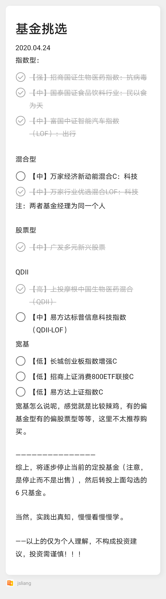
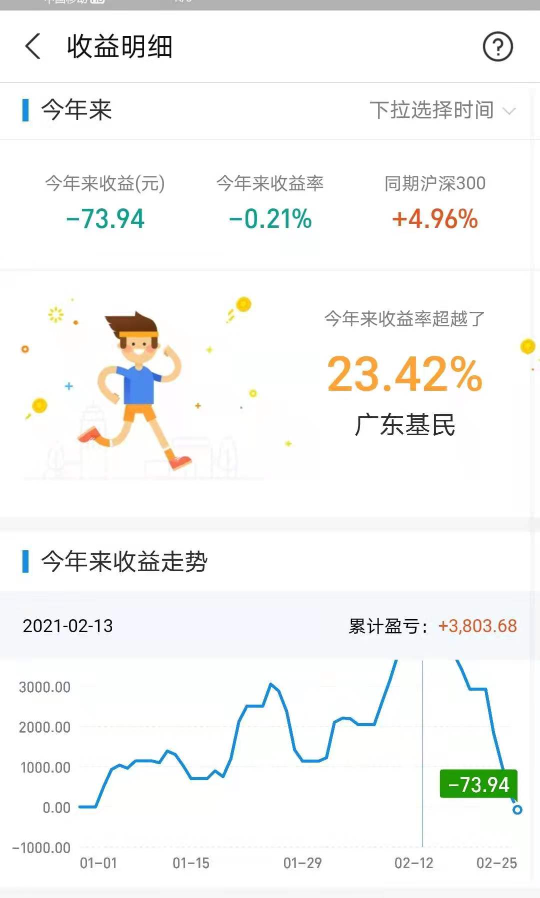
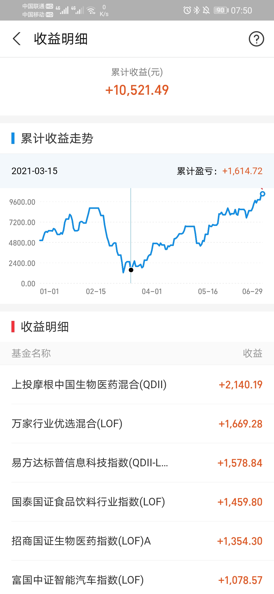

朝花夕拾 - jsliang 基金定投 1 年分享
===

> Create by **jsliang** on **2021-06-29 07:56:57**  
> Recently revised in **2021-06-29 09:06:11**

种一棵树最好的时间是十年前，其次是现在。

自 2020.04.24 制定我的基金定投方案后，至 2021.06.29 为止，**jsliang** 的累计收益成功破万，累计收益率达 18.8%，今天（2021.06.29）分享下这段有趣的旅途。

> 『投资声明』  
> ① 投资有风险，操作需谨慎  
> ② 本文的投资经验分享仅适用于当时时间段的本人，不构成当前的投资建议，请理性投资

<!-- 目录开始 -->
## 一 目录

**不折腾的前端，和咸鱼有什么区别**

| 目录 |
| --- |
| [一 目录](#chapter-one) |
| [二 前言](#chapter-two) |
| [三 经过、结果和分析](#chapter-three) |
<!-- 目录结束 -->

## 二 前言

> [返回目录](#chapter-one)

在 2020.04.24，当时 **jsliang** 手里开始有闲钱了，于是 **jsliang** 就开始正式地制定基金定投计划。

当时的定投策略如下：

> 还好当时的笔记还没删除

**首先**，在抗疫时期，**jsliang** 是非常看好医疗的，所以当时果断投资了：

* 上投摩根中国生物医药混合（QDII）
* 招商国证生物医药指数（LOF）A

其实那时候就有朋友劝告疫情很快会过去，然后医药时代就过去了。

不过当时还是坚定自己信息，定投了这 2 支基金。

> 事实证明的确有那么段趋势，即便最后翻盘了，下面会拿出来分析

**然后**，民以食为天，当时翻阅某宝的基金排行，『指数型』的近三年和近五年出现最多的就是白酒（白酒 yyds？），于是当时顺势就点了白酒的牌：

* 国泰国证食品饮料行业（LOF）

**接着**，衣食住「行」，交通、科技应该也值得投资？所以当时投资了：

* 国富中证智能汽车指数（LOF）
* 易方达标普信息科技指数（QDII-LOF）

> 事实证明投资国内汽车指数是个败笔，下面会拿出来分析

**最后**，为了风险对冲，也是当时还有投资股票，想看看『指数型』和『混合型/偏股』的对抗，于是投资了：

* 万家行业优选混合（LOF）

**最后的最后**，设置定投计划是「日定投」，定投资金「根据工资浮动」和「根据 A 股浮动」而定。

## 三 经过、结果和分析

> [返回目录](#chapter-one)

就这样，经过一年的走期，在『A 股』低迷的时候加投，在『A 股』高涨的时候猥琐发育，时间线来到 2021 年过完年后，这个人见人怕的时期：

好家伙，当时是没想到『今年来收益』还能变成负的，从 19 年我开始小玩基金投就没出现负的！

有的小伙伴机智，在年前就将所有基金抛了；也有的小伙伴和我一样，基金收益还跑不过沪深 300，都是泪~

**但是**，没有后路可言了，这时候跑路无疑就不理性了，所以 **jsliang** 当时还加投了点（就是在定投的基础上，将闲钱再塞进去）

这时候其实应了当时小伙伴的说法：医疗行业会走过强势期的。

当然，不可厚非的说，也有大趋势的原因，但是当时其他基金回转后，『上投摩根中国生物医药混合（QDII）』的情况其实还没那么好，差点就有横线的感觉。

只不过时间会证明一切，一时的失利不是一直的失利，**jsliang** 的所有定投逐步回转后基金到今天变成：

由 03.15 的 +1614.72 到今天（06.19）的 +10521.49，个人感觉心情还是蛮舒适的，毕竟也是小破 W 了，小步伐证明了目前投资方向的正确。

> 投资有风险，该投资仅为本人去年的分析和目前走势，不代表投资建议，不作为参考依据请谨慎对待

然后在持有排行上，贴一下前五投资图：

> 第六个截不下，某宝不让长截图

**最后**，进行小汇总：

* *当前持有收益/总金额 = 9303.09/55878.09 * 100% ≈ 16.6%*

OK，如上即是本次分享内容，祝小伙伴们的投资结果称心如意，祝老板们发大财~

---

> jsliang 的文档库由 [梁峻荣](https://github.com/LiangJunrong) 采用 [知识共享 署名-非商业性使用-相同方式共享 4.0 国际 许可协议](http://creativecommons.org/licenses/by-nc-sa/4.0/) 进行许可。 基于 [https://github.com/LiangJunrong/document-library](https://github.com/LiangJunrong/document-library) 上的作品创作。 本许可协议授权之外的使用权限可以从 [https://creativecommons.org/licenses/by-nc-sa/2.5/cn/](https://creativecommons.org/licenses/by-nc-sa/2.5/cn/) 处获得。
